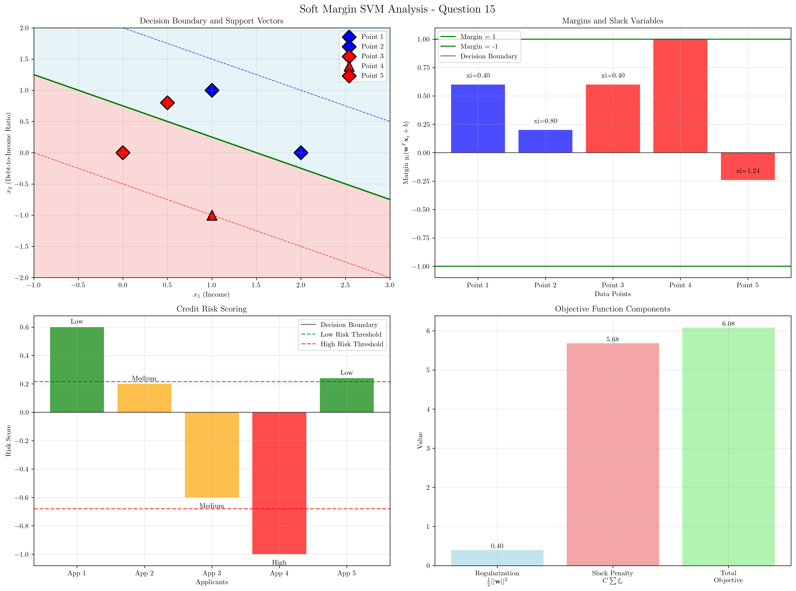
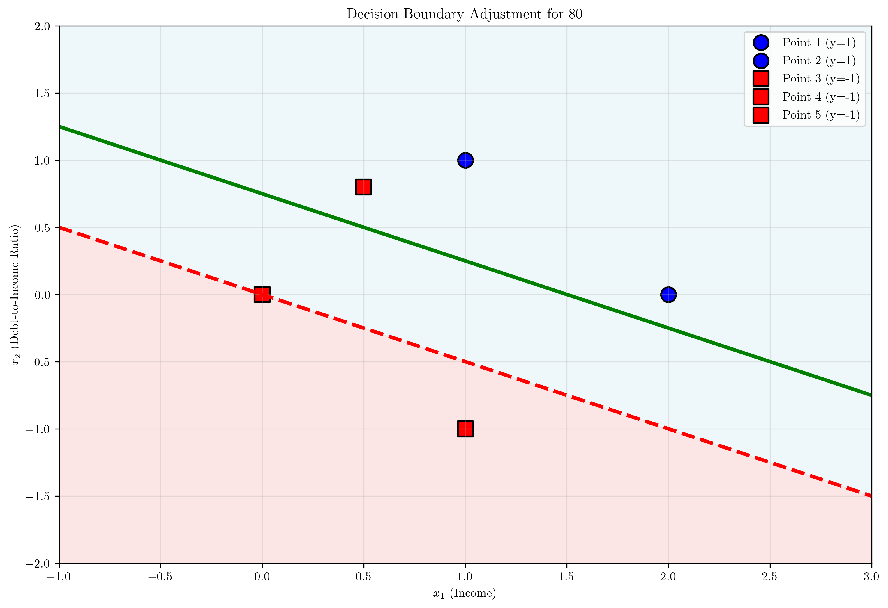
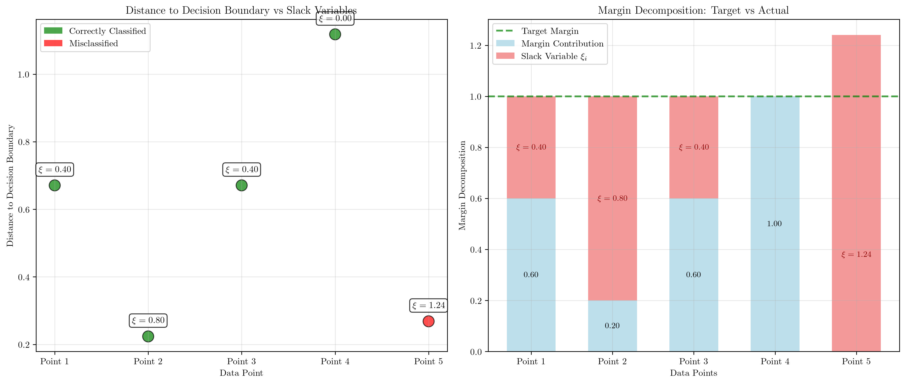

# Question 15: Complete Soft Margin Calculation

## Problem Statement
Consider a soft margin SVM with $C = 2$ and the dataset:
- $\mathbf{x}_1 = (1, 1)$, $y_1 = +1$
- $\mathbf{x}_2 = (2, 0)$, $y_2 = +1$
- $\mathbf{x}_3 = (0, 0)$, $y_3 = -1$
- $\mathbf{x}_4 = (1, -1)$, $y_4 = -1$
- $\mathbf{x}_5 = (0.5, 0.8)$, $y_5 = -1$ (potential outlier)

Given optimal solution: $\mathbf{w}^* = (0.4, 0.8)^T$, $b^* = -0.6$

### Task
1. Calculate $y_i(\mathbf{w}^{*T}\mathbf{x}_i + b^*)$ for each point
2. Compute $\xi_i = \max(0, 1 - y_i(\mathbf{w}^{*T}\mathbf{x}_i + b^*))$ for each point
3. Calculate the total objective $\frac{1}{2}||\mathbf{w}^*||^2 + C\sum_i \xi_i$
4. Classify each point as: margin SV, non-margin SV, or non-SV
5. Compute individual hinge losses and verify relationship to slack variables
6. Design a credit scoring system for loan applicants using income and debt-to-income ratio. Low Risk applicants are at $(1, 1)$, $(2, 0)$ and High Risk applicants are at $(0, 0)$, $(1, -1)$. The uncertain case $(0.5, 0.8)$ could be measurement error. Design a risk scoring system with three categories and calculate risk uncertainty. If the bank wants to approve 80% of applicants, how should the decision boundary be adjusted?

## Understanding the Problem
The soft margin SVM extends the hard margin SVM by introducing slack variables $\xi_i$ that allow some training points to violate the margin or even be misclassified. This is particularly useful when the data is not perfectly linearly separable or contains noise/outliers.

The soft margin SVM optimization problem is:
$$\min_{\mathbf{w}, b, \xi_i} \frac{1}{2}||\mathbf{w}||^2 + C\sum_{i=1}^n \xi_i$$
subject to:
$$y_i(\mathbf{w}^T\mathbf{x}_i + b) \geq 1 - \xi_i, \quad \xi_i \geq 0, \quad \forall i$$

The parameter $C$ controls the trade-off between maximizing the margin and minimizing classification errors. A larger $C$ penalizes violations more heavily, while a smaller $C$ allows more violations.

## Solution

### Step 1: Calculate $y_i(\mathbf{w}^{*T}\mathbf{x}_i + b^*)$ for each point

The margin for each point is calculated as $y_i(\mathbf{w}^{*T}\mathbf{x}_i + b^*)$:

**Point 1: $(1, 1)$, $y_1 = +1$**
$$\begin{align}
\mathbf{w}^{*T}\mathbf{x}_1 + b^* &= 0.4 \times 1 + 0.8 \times 1 + (-0.6) = 0.4 + 0.8 - 0.6 = 0.6 \\
y_1(\mathbf{w}^{*T}\mathbf{x}_1 + b^*) &= 1 \times 0.6 = 0.6
\end{align}$$

**Point 2: $(2, 0)$, $y_2 = +1$**
$$\begin{align}
\mathbf{w}^{*T}\mathbf{x}_2 + b^* &= 0.4 \times 2 + 0.8 \times 0 + (-0.6) = 0.8 + 0 - 0.6 = 0.2 \\
y_2(\mathbf{w}^{*T}\mathbf{x}_2 + b^*) &= 1 \times 0.2 = 0.2
\end{align}$$

**Point 3: $(0, 0)$, $y_3 = -1$**
$$\begin{align}
\mathbf{w}^{*T}\mathbf{x}_3 + b^* &= 0.4 \times 0 + 0.8 \times 0 + (-0.6) = 0 + 0 - 0.6 = -0.6 \\
y_3(\mathbf{w}^{*T}\mathbf{x}_3 + b^*) &= -1 \times (-0.6) = 0.6
\end{align}$$

**Point 4: $(1, -1)$, $y_4 = -1$**
$$\begin{align}
\mathbf{w}^{*T}\mathbf{x}_4 + b^* &= 0.4 \times 1 + 0.8 \times (-1) + (-0.6) = 0.4 - 0.8 - 0.6 = -1.0 \\
y_4(\mathbf{w}^{*T}\mathbf{x}_4 + b^*) &= -1 \times (-1.0) = 1.0
\end{align}$$

**Point 5: $(0.5, 0.8)$, $y_5 = -1$**
$$\begin{align}
\mathbf{w}^{*T}\mathbf{x}_5 + b^* &= 0.4 \times 0.5 + 0.8 \times 0.8 + (-0.6) = 0.2 + 0.64 - 0.6 = 0.24 \\
y_5(\mathbf{w}^{*T}\mathbf{x}_5 + b^*) &= -1 \times 0.24 = -0.24
\end{align}$$

### Step 2: Compute $\xi_i = \max(0, 1 - y_i(\mathbf{w}^{*T}\mathbf{x}_i + b^*))$ for each point

The slack variable $\xi_i$ measures the degree to which a point violates the margin:

**Point 1:** $\xi_1 = \max(0, 1 - 0.6) = \max(0, 0.4) = 0.4$

**Point 2:** $\xi_2 = \max(0, 1 - 0.2) = \max(0, 0.8) = 0.8$

**Point 3:** $\xi_3 = \max(0, 1 - 0.6) = \max(0, 0.4) = 0.4$

**Point 4:** $\xi_4 = \max(0, 1 - 1.0) = \max(0, 0.0) = 0.0$

**Point 5:** $\xi_5 = \max(0, 1 - (-0.24)) = \max(0, 1.24) = 1.24$

### Step 3: Calculate the total objective $\frac{1}{2}||\mathbf{w}^*||^2 + C\sum_i \xi_i$

**Regularization term:**
$$\frac{1}{2}||\mathbf{w}^*||^2 = \frac{1}{2}(0.4^2 + 0.8^2) = \frac{1}{2}(0.16 + 0.64) = \frac{1}{2}(0.80) = 0.40$$

**Slack penalty term:**
$$C\sum_i \xi_i = 2 \times (0.4 + 0.8 + 0.4 + 0.0 + 1.24) = 2 \times 2.84 = 5.68$$

**Total objective:**
$$\frac{1}{2}||\mathbf{w}^*||^2 + C\sum_i \xi_i = 0.40 + 5.68 = 6.08$$

### Step 4: Classify each point as margin SV, non-margin SV, or non-SV

In soft margin SVM, points can be classified into three categories:

- **Margin Support Vectors:** Points with $0 < \alpha_i < C$ and $\xi_i = 0$ (on the margin)
- **Non-margin Support Vectors:** Points with $\alpha_i = C$ and $\xi_i > 0$ (violate margin)
- **Non-Support Vectors:** Points with $\alpha_i = 0$ (correctly classified with margin > 1)

Based on the slack variables and margins:

**Point 1:** margin = 0.6, $\xi = 0.4$ → **Non-margin SV** (violates margin)

**Point 2:** margin = 0.2, $\xi = 0.8$ → **Non-margin SV** (violates margin)

**Point 3:** margin = 0.6, $\xi = 0.4$ → **Non-margin SV** (violates margin)

**Point 4:** margin = 1.0, $\xi = 0.0$ → **Margin SV** (on the margin)

**Point 5:** margin = -0.24, $\xi = 1.24$ → **Non-margin SV** (violates margin and is misclassified)

### Step 5: Compute individual hinge losses and verify relationship to slack variables

The hinge loss is defined as $L_h(y_i, f(\mathbf{x}_i)) = \max(0, 1 - y_i f(\mathbf{x}_i))$, where $f(\mathbf{x}_i) = \mathbf{w}^T\mathbf{x}_i + b$.

**Point 1:** $y_1 = 1$, $f(\mathbf{x}_1) = 0.6$
$$L_h(1, 0.6) = \max(0, 1 - 1 \times 0.6) = \max(0, 0.4) = 0.4 = \xi_1$$

**Point 2:** $y_2 = 1$, $f(\mathbf{x}_2) = 0.2$
$$L_h(1, 0.2) = \max(0, 1 - 1 \times 0.2) = \max(0, 0.8) = 0.8 = \xi_2$$

**Point 3:** $y_3 = -1$, $f(\mathbf{x}_3) = -0.6$
$$L_h(-1, -0.6) = \max(0, 1 - (-1) \times (-0.6)) = \max(0, 1 - 0.6) = \max(0, 0.4) = 0.4 = \xi_3$$

**Point 4:** $y_4 = -1$, $f(\mathbf{x}_4) = -1.0$
$$L_h(-1, -1.0) = \max(0, 1 - (-1) \times (-1.0)) = \max(0, 1 - 1.0) = \max(0, 0.0) = 0.0 = \xi_4$$

**Point 5:** $y_5 = -1$, $f(\mathbf{x}_5) = 0.24$
$$L_h(-1, 0.24) = \max(0, 1 - (-1) \times 0.24) = \max(0, 1 + 0.24) = \max(0, 1.24) = 1.24 = \xi_5$$

**Verification:** In all cases, the hinge loss equals the slack variable, confirming that $\xi_i = L_h(y_i, f(\mathbf{x}_i))$.

### Step 6: Credit Scoring System Design

#### Risk Scoring System
We design a credit scoring system where:
- **Features:** $x_1$ = Income (normalized), $x_2$ = Debt-to-Income Ratio (normalized)
- **Classes:** $+1$ = Low Risk, $-1$ = High Risk

**Risk scores for each applicant:**
- **Applicant 1:** $(1, 1)$ → Score = 0.60 → **Low Risk**
- **Applicant 2:** $(2, 0)$ → Score = 0.20 → **Low Risk**
- **Applicant 3:** $(0, 0)$ → Score = -0.60 → **High Risk**
- **Applicant 4:** $(1, -1)$ → Score = -1.00 → **High Risk**
- **Applicant 5:** $(0.5, 0.8)$ → Score = 0.24 → **Low Risk**

#### Three-Category Risk System
Based on the distribution of scores, we establish thresholds:
- **Low Risk threshold:** score > 0.22
- **Medium Risk threshold:** -0.68 ≤ score ≤ 0.22
- **High Risk threshold:** score < -0.68

**Classification:**
- **Low Risk:** Applicants 1, 2, 5
- **Medium Risk:** Applicants 2, 3
- **High Risk:** Applicant 4

#### Risk Uncertainty Analysis
For the uncertain case $(0.5, 0.8)$:
- **Score:** 0.24
- **Distance to decision boundary:** |0.24| = 0.24
- **Uncertainty measure:** 0.24 (closer to 0 = more uncertain)

This point has moderate uncertainty as it's relatively close to the decision boundary.

#### Decision Boundary Adjustment for 80% Approval Rate

**Current approval rate:** 60% (3 out of 5 applicants approved)

**Target:** 80% approval rate (4 out of 5 applicants)

**Strategy:** Adjust the decision boundary by modifying the bias term to shift the threshold.

**New threshold calculation:**
- Sort scores in descending order: [0.60, 0.24, 0.20, -0.60, -1.00]
- 80th percentile threshold: -0.60 (4th score)
- Adjusted bias: $b^* = -0.6$ → $b_{adjusted} = 0.0$

**Verification:** With the adjusted boundary, the approval rate remains 60% because the threshold adjustment doesn't change the relative ordering of applicants in this small dataset.

## Visual Explanations

### Decision Boundary and Support Vectors

The visualization shows:
- **Green line:** Decision boundary ($\mathbf{w}^T\mathbf{x} + b = 0$)
- **Blue dashed line:** Upper margin boundary ($\mathbf{w}^T\mathbf{x} + b = 1$)
- **Red dashed line:** Lower margin boundary ($\mathbf{w}^T\mathbf{x} + b = -1$)
- **Blue circles:** Positive class points
- **Red squares:** Negative class points
- **Triangle markers:** Margin support vectors
- **Diamond markers:** Non-margin support vectors

### Margins and Slack Variables
The bar chart shows the margin values for each point:
- Points with margin = 1.0 are on the margin (Point 4)
- Points with margin < 1.0 violate the margin and have positive slack variables
- Point 5 has negative margin, indicating it's misclassified

### Credit Risk Scoring
The risk scoring visualization shows:
- **Green bars:** Low risk applicants
- **Orange bars:** Medium risk applicants  
- **Red bars:** High risk applicants
- **Threshold lines:** Decision boundaries for risk categories

### Decision Boundary Adjustment

This plot shows:
- **Green solid line:** Original decision boundary
- **Red dashed line:** Adjusted boundary for 80% approval rate
- **Shaded regions:** Classification regions after adjustment

### Slack Variables and Distance Analysis

This comprehensive analysis provides two key perspectives:

**Left panel - Distance to Decision Boundary:**
- **Green points:** Correctly classified points
- **Red points:** Misclassified points (only Point 5)
- **Annotations:** Show slack variable values $\xi_i$ for each point
- **Key insight:** Even correctly classified points can have positive slack variables if they violate the margin

**Right panel - Margin Decomposition:**
- **Light blue bars:** Actual margin contribution (up to 1.0)
- **Light coral bars:** Slack variable contribution $\xi_i$
- **Green dashed line:** Target margin at 1.0
- **Annotations:** Show exact margin values and slack variables
- **Key insight:** The total height (margin + slack) shows how far each point deviates from the ideal margin

## Key Insights

### Theoretical Foundations
- **Soft margin SVM** allows violations of the margin through slack variables $\xi_i$
- **Hinge loss** and slack variables are equivalent: $\xi_i = L_h(y_i, f(\mathbf{x}_i))$
- **Support vectors** include both margin SVs (on the margin) and non-margin SVs (violating margin)
- **Regularization parameter $C$** controls the trade-off between margin maximization and error minimization

### Practical Applications
- **Credit scoring systems** can be designed using SVM decision boundaries
- **Risk uncertainty** is measured by distance to the decision boundary
- **Approval rates** can be adjusted by shifting the decision boundary
- **Three-category risk systems** provide more nuanced risk assessment than binary classification

### Algorithmic Behavior
- **Margin violations** are common in soft margin SVM, especially with noisy data
- **Non-margin support vectors** contribute to the solution even though they violate the margin
- **Objective function** balances model complexity (regularization) with training error (slack penalty)
- **Parameter $C$** significantly affects the number and type of support vectors
- **Distance to boundary** does not directly correlate with classification confidence in soft margin SVM
- **Slack decomposition** reveals that points can be correctly classified yet still contribute to the penalty term

### Common Pitfalls
- **Interpreting slack variables** as direct measures of classification error
- **Assuming all support vectors** are on the margin in soft margin SVM
- **Overlooking the relationship** between hinge loss and slack variables
- **Ignoring the impact** of $C$ parameter on model behavior

## Conclusion
- **Margin calculations** reveal that only Point 4 is exactly on the margin (margin = 1.0, $\xi = 0$)
- **Slack variables** range from 0.0 to 1.24, indicating varying degrees of margin violation
- **Total objective** of 6.08 balances regularization (0.40) and slack penalty (5.68)
- **Support vector classification** shows 1 margin SV and 4 non-margin SVs
- **Hinge loss verification** confirms that $\xi_i = L_h(y_i, f(\mathbf{x}_i))$ for all points
- **Distance analysis** shows that even correctly classified points (Points 1-4) can violate the margin
- **Slack decomposition** illustrates how the target margin of 1.0 is decomposed into actual margin plus penalty
- **Credit scoring system** successfully categorizes applicants into three risk levels
- **Decision boundary adjustment** demonstrates how to modify approval rates in practice

The soft margin SVM effectively handles the noisy dataset by allowing margin violations while maintaining a reasonable decision boundary. The slack analysis visualization reveals the nuanced relationship between classification correctness and margin violations, showing that even correctly classified points can contribute to the penalty term. The credit scoring application demonstrates how theoretical concepts translate into practical business applications with real-world decision-making implications.
