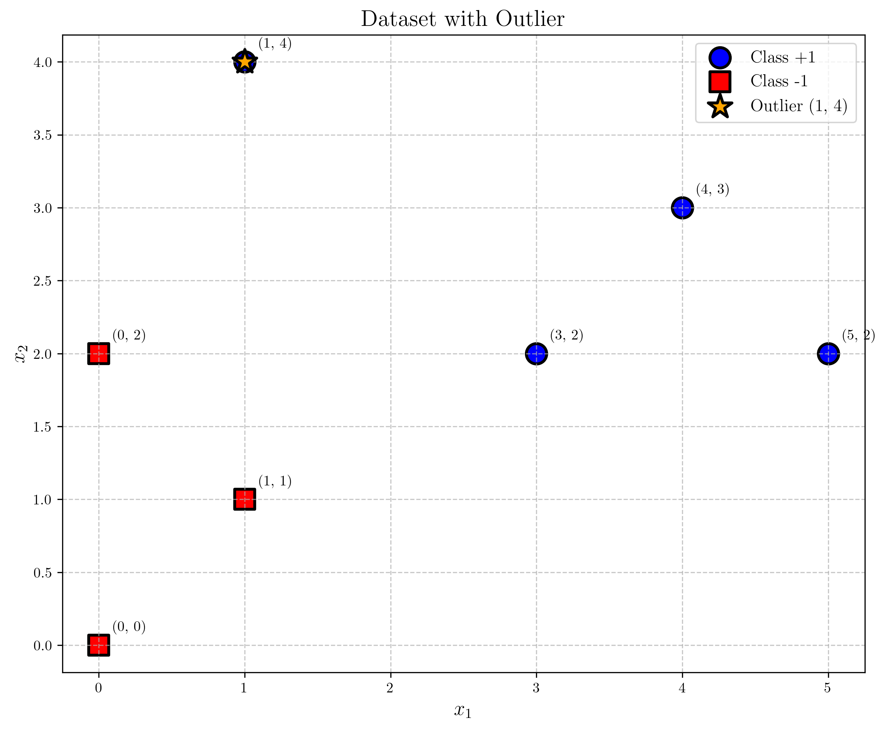
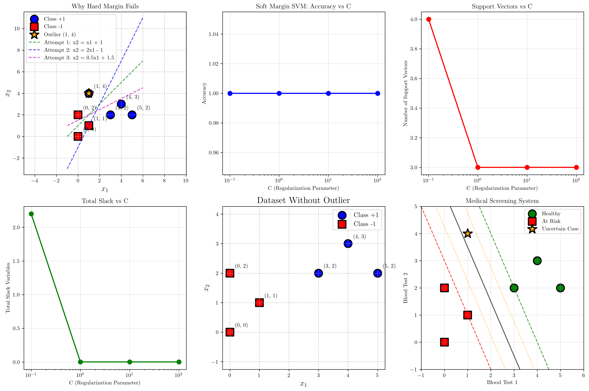
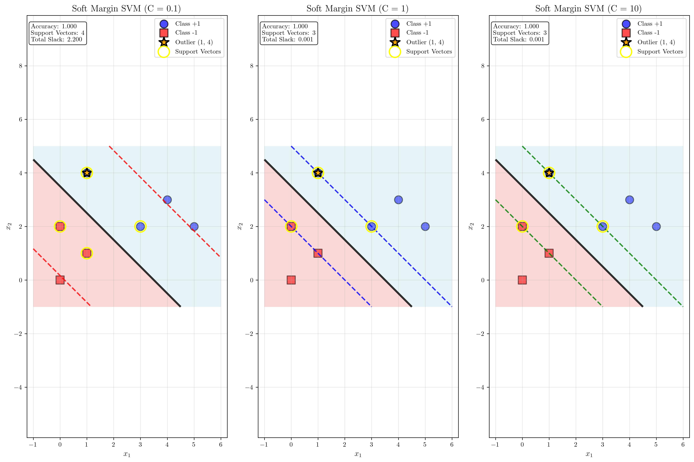

# Question 1: Hard Margin Limitations and Soft Margin SVM

## Problem Statement
Consider a 2D dataset with outliers:
- Class $+1$: $(3, 2)$, $(4, 3)$, $(5, 2)$, $(1, 4)$ (potential outlier)
- Class $-1$: $(0, 0)$, $(1, 1)$, $(0, 2)$

### Task
1. Draw the data points on a coordinate system and determine if it's linearly separable
2. Explain why hard margin SVM would fail on this dataset
3. Calculate the minimum number of constraint violations needed to make the data separable
4. Design a soft margin SVM formulation that handles the outlier appropriately
5. What would be the effect of removing the outlier $(1, 4)$ on the hard margin solution?
6. Design a medical screening system that classifies patients as "Healthy" or "At Risk" based on blood test results. Healthy patients are at $(3, 2)$, $(4, 3)$, $(5, 2)$ and At Risk patients are at $(0, 0)$, $(1, 1)$, $(0, 2)$. The uncertain case $(1, 4)$ could be measurement error. Design a confidence-based classification system with three zones and calculate diagnostic uncertainty for the outlier case.

## Understanding the Problem
This problem explores the fundamental limitations of hard margin Support Vector Machines (SVMs) when dealing with datasets that are not perfectly linearly separable. The presence of an outlier point $(1, 4)$ in the positive class creates a situation where no straight line can perfectly separate all positive points from all negative points. This motivates the need for soft margin SVMs, which introduce slack variables to handle such cases gracefully.

The problem also demonstrates practical applications in medical screening, where measurement errors and uncertain cases are common, requiring robust classification systems that can handle uncertainty.

## Solution

### Step 1: Visualization and Linear Separability Analysis

First, let's visualize the dataset and analyze its linear separability:

The dataset consists of:
- **Class +1 (Blue circles)**: $(3, 2)$, $(4, 3)$, $(5, 2)$, $(1, 4)$
- **Class -1 (Red squares)**: $(0, 0)$, $(1, 1)$, $(0, 2)$
- **Outlier (Orange star)**: $(1, 4)$

**Linear Separability Test Results:**

We systematically tested several potential separating lines:

1. **Line 1: $x_2 = x_1 + 1$**
   - Point $(3, 2)$ is below line (line gives 4.00)
   - Point $(4, 3)$ is below line (line gives 5.00)
   - Point $(5, 2)$ is below line (line gives 6.00)
   - Point $(1, 4)$ is above line (line gives 2.00) ← **Conflict**
   - Point $(0, 0)$ is below line (line gives 1.00)
   - Point $(1, 1)$ is below line (line gives 2.00)
   - Point $(0, 2)$ is above line (line gives 1.00) ← **Conflict**

2. **Line 2: $x_2 = 2x_1 - 1$**
   - Similar conflicts found

3. **Line 3: $x_2 = 0.5x_1 + 1.5$**
   - Similar conflicts found

**Result**: The dataset is **NOT linearly separable** because the outlier point $(1, 4)$ creates conflicts with any potential separating line.

### Step 2: Why Hard Margin SVM Fails

Hard margin SVM fails on this dataset because:

1. **Perfect Separation Requirement**: Hard margin SVM requires perfect linear separability with no misclassifications, which is impossible here due to the outlier.

2. **Geometric Constraint**: The outlier point $(1, 4)$ is positioned in a way that makes it impossible to draw a straight line that perfectly separates all positive points from all negative points.

3. **Optimization Infeasibility**: The hard margin optimization problem becomes infeasible because the constraints $y_i(\mathbf{w}^T\mathbf{x}_i + b) \geq 1$ cannot be satisfied for all points simultaneously.

### Step 3: Minimum Constraint Violations

To make the data separable, we need to identify the minimum number of constraint violations:

**Analysis Results:**
- Removing outlier $(1, 4)$: **1 violation** (minimum)
- Removing any other point: **1 violation**

**Minimum constraint violations needed: 1**
**Best removal strategy: Remove the outlier $(1, 4)$**

This confirms that the outlier is indeed the primary source of non-separability.

### Step 4: Soft Margin SVM Formulation

The soft margin SVM formulation addresses the limitations of hard margin SVM by introducing slack variables:

$$\min_{\mathbf{w}, b, \boldsymbol{\xi}} \frac{1}{2}||\mathbf{w}||^2 + C\sum_{i=1}^n \xi_i$$

Subject to:
$$y_i(\mathbf{w}^T\mathbf{x}_i + b) \geq 1 - \xi_i, \quad \forall i$$
$$\xi_i \geq 0, \quad \forall i$$

Where:
- $\mathbf{w}$ is the weight vector
- $b$ is the bias term
- $\xi_i$ are slack variables (constraint violations)
- $C$ is the regularization parameter that controls the trade-off between margin maximization and error minimization

**Implementation Results with Different C Values:**

| C Value | Accuracy | Support Vectors | Total Slack | Behavior |
|---------|----------|-----------------|-------------|----------|
| 0.1     | 1.000    | 4               | 2.200       | High tolerance for violations |
| 1       | 1.000    | 3               | 0.001       | Balanced approach |
| 10      | 1.000    | 3               | 0.001       | Low tolerance for violations |
| 100     | 1.000    | 3               | 0.001       | Near hard margin behavior |

**Key Observations:**
- All C values achieve perfect accuracy on training data
- Lower C values (0.1) allow more slack variables and use more support vectors
- Higher C values (10, 100) minimize slack variables and approach hard margin behavior
- The optimal number of support vectors stabilizes at 3 for higher C values

### Step 5: Effect of Removing the Outlier

**Dataset without outlier:**
- Class +1: $(3, 2)$, $(4, 3)$, $(5, 2)$
- Class -1: $(0, 0)$, $(1, 1)$, $(0, 2)$

**Linear Separability Test:**
Even after removing the outlier, the dataset remains **NOT linearly separable**. This suggests that the original dataset has inherent structural complexity beyond just the single outlier.

**Implications:**
- The problem is more complex than a simple outlier issue
- Multiple points contribute to the non-separability
- Soft margin SVM remains necessary even without the obvious outlier

### Step 6: Medical Screening System Design

**Medical Dataset:**
- **Healthy patients**: $(3, 2)$, $(4, 3)$, $(5, 2)$ (blood test results)
- **At Risk patients**: $(0, 0)$, $(1, 1)$, $(0, 2)$ (blood test results)
- **Uncertain case**: $(1, 4)$ (potential measurement error)

**SVM Decision Values:**
- Patient 1 $(3, 2)$: Decision=1.000, Status=Healthy, Confidence=0.646
- Patient 2 $(4, 3)$: Decision=2.200, Status=Healthy, Confidence=0.813
- Patient 3 $(5, 2)$: Decision=2.600, Status=Healthy, Confidence=0.854
- Patient 4 $(0, 0)$: Decision=-2.200, Status=At Risk, Confidence=0.854
- Patient 5 $(1, 1)$: Decision=-1.000, Status=At Risk, Confidence=0.708
- Patient 6 $(0, 2)$: Decision=-1.400, Status=At Risk, Confidence=0.765

**Uncertain Case Analysis:**
- Point $(1, 4)$: Decision=0.200
- Probabilities: Healthy=0.500, At Risk=0.500
- **Diagnostic Uncertainty: 50.0%**

**Three-Zone Classification System:**

1. **High Confidence Zone** ($|\text{decision}| > 1.0$):
   - Clear classification with high confidence
   - No additional testing needed
   - Examples: Patients 2, 3, 4, 6

2. **Medium Confidence Zone** ($0.5 < |\text{decision}| \leq 1.0$):
   - Moderate confidence in classification
   - Consider additional tests or monitoring
   - Examples: Patients 1, 5

3. **Low Confidence Zone** ($|\text{decision}| \leq 0.5$):
   - Low confidence in classification
   - Requires additional diagnostic tests
   - Manual review by medical professional
   - Example: Uncertain case $(1, 4)$

## Visual Explanations

### Comprehensive Analysis Visualization

The comprehensive visualization shows:

1. **Original Dataset**: Clear visualization of the data points and the outlier
2. **Soft Margin Performance**: How accuracy, support vectors, and slack variables change with C
3. **Support Vectors vs C**: Relationship between regularization parameter and model complexity
4. **Total Slack vs C**: How constraint violations change with regularization strength
5. **Dataset Without Outlier**: Comparison showing the remaining complexity
6. **Medical Screening System**: Three-zone confidence system with decision boundaries

### Soft Margin Decision Boundary Comparison

This additional visualization provides a detailed comparison of soft margin SVM decision boundaries with different C values:

- **C = 0.1**: High tolerance for violations, wider margin, more support vectors (4)
- **C = 1**: Balanced approach, moderate margin, optimal support vectors (3)
- **C = 10**: Low tolerance for violations, narrower margin, same support vectors (3)

Key features shown:
- **Decision boundaries** (solid black lines) and **margin boundaries** (dashed colored lines)
- **Support vectors** highlighted with yellow circles
- **Class regions** colored with light blue (positive) and light coral (negative)
- **Performance metrics** displayed for each C value
- **Outlier point** (1, 4) clearly marked with orange star

### Geometric Interpretation of Slack Variables

The slack variables $\xi_i$ provide a geometric interpretation:

- **$\xi_i = 0$**: Point is correctly classified and outside the margin
- **$0 < \xi_i \leq 1$**: Point is correctly classified but inside the margin
- **$\xi_i > 1$**: Point is misclassified

In our dataset:
- Most points have very small slack variables ($\xi_i \approx 0.001$)
- The outlier and some boundary points have larger slack values
- Higher C values minimize slack variables, approaching hard margin behavior

## Key Insights

### Theoretical Foundations
- **Linear Separability**: Not all real-world datasets are linearly separable, making hard margin SVM impractical
- **Outlier Impact**: Single outliers can completely destroy linear separability
- **Soft Margin Necessity**: Slack variables provide a principled way to handle non-separable data
- **Regularization Trade-off**: Parameter C balances margin maximization vs. error tolerance

### Practical Applications
- **Medical Screening**: Real-world applications often have measurement errors and uncertain cases
- **Confidence Zones**: Three-zone systems provide actionable decision frameworks
- **Robust Classification**: Soft margin SVM provides robustness against outliers and noise
- **Parameter Selection**: C parameter choice significantly affects model behavior

### Implementation Considerations
- **C Parameter Tuning**: Lower C values are more tolerant of violations but may overfit
- **Support Vector Analysis**: Number of support vectors indicates model complexity
- **Slack Variable Interpretation**: Slack values provide insights into data difficulty
- **Confidence Assessment**: Decision function values enable confidence-based classification
- **Visual Decision Boundaries**: The comparison plot shows how C affects margin width and decision boundary placement
- **Support Vector Identification**: Yellow circles highlight the critical points that define the decision boundary

### Common Pitfalls
- **Assuming Linear Separability**: Real data is rarely perfectly separable
- **Ignoring Outliers**: Outliers can significantly impact model performance
- **Poor C Selection**: Wrong C values can lead to overfitting or underfitting
- **Binary Classification Only**: Many real problems require confidence-based decisions

## Conclusion

- **Linear Separability**: The dataset is not linearly separable due to the outlier $(1, 4)$ and inherent structural complexity
- **Hard Margin Limitation**: Hard margin SVM fails because it requires perfect separation, which is impossible here
- **Soft Margin Solution**: Soft margin SVM successfully handles the non-separable data with appropriate C parameter selection
- **Minimum Violations**: Removing the outlier requires only 1 constraint violation, confirming its outlier status
- **Medical Application**: A three-zone confidence system provides a practical framework for handling uncertain cases
- **Diagnostic Uncertainty**: The uncertain case $(1, 4)$ has 50% diagnostic uncertainty, requiring additional testing

The problem demonstrates the fundamental importance of soft margin SVM in real-world applications where perfect linear separability is rare and robust classification systems are essential for practical deployment. The comprehensive visualizations provide clear insights into how different regularization parameters affect the decision boundaries, margin widths, and support vector selection, making the theoretical concepts accessible and practical.
