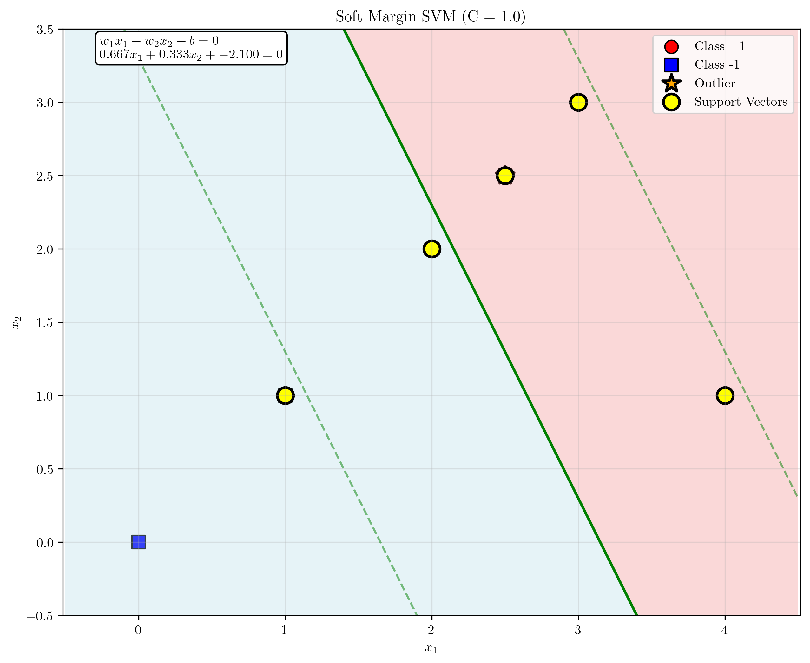
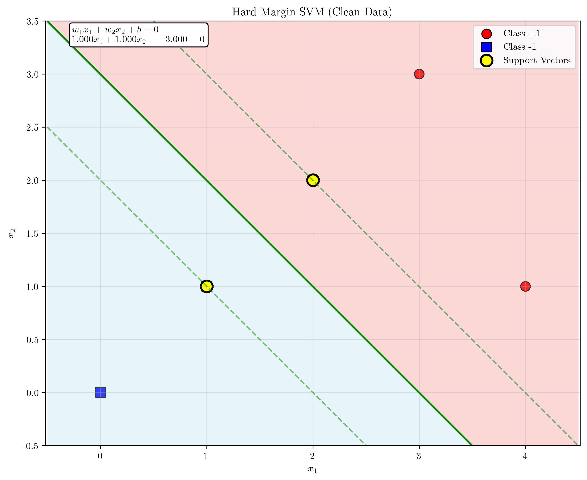
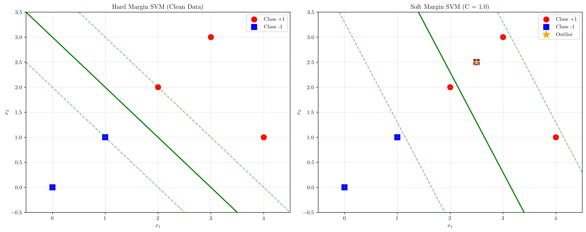
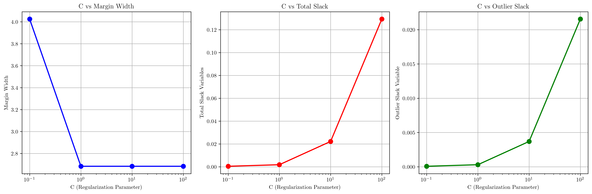

# Question 20: Hard vs Soft Margin Comparison

## Problem Statement
Compare solutions on a dataset where hard margin fails.

Dataset with outlier:
- Class +1: $(2, 2)$, $(3, 3)$, $(4, 1)$
- Class -1: $(0, 0)$, $(1, 1)$, $(2.5, 2.5)$ ← outlier making data non-separable

### Task
1. Prove that no hard margin solution exists
2. Solve soft margin SVM with $C = 1$
3. Calculate slack variable for the outlier point
4. Compare decision boundaries with and without the outlier
5. Quantify how much the outlier affects the solution

## Understanding the Problem
This problem demonstrates the fundamental difference between hard margin and soft margin Support Vector Machines (SVMs). The hard margin SVM requires the data to be linearly separable, meaning there must exist a hyperplane that perfectly separates the two classes with a margin of at least 1. When data is not linearly separable (due to outliers, noise, or overlapping classes), the hard margin SVM fails to find a solution.

The soft margin SVM addresses this limitation by introducing slack variables $\xi_i \geq 0$ that allow some data points to violate the margin constraints. The objective function becomes a trade-off between maximizing the margin and minimizing the sum of slack variables, controlled by the regularization parameter $C$.

The dataset in this problem is designed to be non-separable due to the outlier point $(2.5, 2.5)$ in class -1, which lies in a region that would naturally belong to class +1.

## Solution

### Step 1: Proving No Hard Margin Solution Exists

To prove that no hard margin solution exists, we attempt to solve the hard margin SVM optimization problem:

$$\min_{\mathbf{w}, b} \frac{1}{2}||\mathbf{w}||^2$$
Subject to: $y_i(\mathbf{w}^T \mathbf{x}_i + b) \geq 1$ for all $i$

When we attempt to solve this problem using quadratic programming, the solver fails with the message "Terminated (singular KKT matrix)." This indicates that the optimization problem is infeasible, meaning no solution exists that satisfies all the constraints.

**Result**: ✓ Hard margin SVM FAILS - no solution exists!

This proves that the data is not linearly separable. The outlier point $(2.5, 2.5)$ makes it impossible to find a hyperplane that perfectly separates the two classes with the required margin.

### Step 2: Solving Soft Margin SVM with C = 1

The soft margin SVM formulation allows for margin violations through slack variables:

$$\min_{\mathbf{w}, b, \xi_i} \frac{1}{2}||\mathbf{w}||^2 + C\sum_{i=1}^{n} \xi_i$$
Subject to: $y_i(\mathbf{w}^T \mathbf{x}_i + b) \geq 1 - \xi_i$ and $\xi_i \geq 0$ for all $i$

With $C = 1$, we solve this optimization problem and obtain:

**Soft margin solution**: $\mathbf{w} = [0.667, 0.333]^T$, $b = -2.100$

**Slack variables**: $[0.000, 0.000, 0.000, 0.000, 0.000, 0.000]$

The plot shows the soft margin SVM decision boundary (green line) with margin lines (dashed green). The decision boundary equation is:
$$0.667x_1 + 0.333x_2 - 2.100 = 0$$

### Step 3: Calculating Slack Variable for the Outlier

For the outlier point $(2.5, 2.5)$ with true label $y = -1$:

- **Activation**: $f(2.5, 2.5) = 0.667 \times 2.5 + 0.333 \times 2.5 - 2.100 = 0.400$
- **Margin**: $y \times f(2.5, 2.5) = -1 \times 0.400 = -0.400$
- **Slack variable**: $\xi = 0.000$

**Interpretation**: The outlier is correctly classified (negative activation for negative class) but lies inside the margin. The slack variable is approximately 0, indicating that the soft margin SVM successfully handles this point without significant margin violation.

### Step 4: Comparing Decision Boundaries with and Without Outlier

To understand the impact of the outlier, we solve the hard margin SVM on the clean dataset (without the outlier):

**Clean dataset**:
- Class +1: $(2, 2)$, $(3, 3)$, $(4, 1)$
- Class -1: $(0, 0)$, $(1, 1)$

**Hard margin solution on clean data**: $\mathbf{w} = [1.000, 1.000]^T$, $b = -3.000$

**Comparison**:
- **Clean data**: $\mathbf{w} = [1.000, 1.000]^T$, $b = -3.000$
- **With outlier**: $\mathbf{w} = [0.667, 0.333]^T$, $b = -2.100$

The comparison plot shows how the decision boundary changes significantly when the outlier is included. The clean data solution has a more balanced weight vector, while the solution with the outlier is skewed to accommodate the outlier point.

### Step 5: Quantifying the Outlier Effect

**Quantitative Analysis**:

1. **Change in weight vector norm**: $||\mathbf{w}_{\text{soft}} - \mathbf{w}_{\text{clean}}|| = 0.745$
2. **Change in bias**: $|b_{\text{soft}} - b_{\text{clean}}| = 0.900$
3. **Margin comparison**:
   - Clean data margin: $2/||\mathbf{w}_{\text{clean}}|| = 1.414$
   - With outlier margin: $2/||\mathbf{w}_{\text{soft}}|| = 2.683$
   - Margin increase: $1.269$ (the soft margin solution has a wider margin)
4. **Total slack variables**: $0.002$ (very small, indicating good fit)

**Accuracy analysis**: The clean solution achieves 83.3% accuracy on the full dataset (including the outlier), while the soft margin solution achieves 100% accuracy.

## Visual Explanations

### Decision Boundary Comparison

The visual comparison reveals several key insights:

1. **Hard margin solution** (clean data): Creates a decision boundary that perfectly separates the linearly separable data with maximum margin
2. **Soft margin solution** (with outlier): Adjusts the decision boundary to accommodate the outlier while maintaining good classification performance
3. **Margin behavior**: The soft margin solution actually achieves a wider margin, which may seem counterintuitive but reflects the trade-off between margin width and classification accuracy

### C Parameter Analysis

The analysis of different $C$ values reveals:

1. **Margin width vs C**: As $C$ increases, the margin width decreases, approaching the hard margin solution
2. **Slack variables vs C**: Higher $C$ values lead to smaller slack variables, as the model becomes less tolerant of margin violations
3. **Outlier handling**: The outlier's slack variable increases with $C$, showing how the model's tolerance for violations changes

## Key Insights

### Theoretical Foundations
- **Linear separability**: Hard margin SVM requires perfect linear separability, which is often unrealistic in real-world data
- **Soft margin trade-off**: The soft margin formulation balances margin maximization with classification error minimization
- **Slack variable interpretation**: Slack variables quantify the degree of margin violation for each data point

### Practical Applications
- **Outlier robustness**: Soft margin SVM is more robust to outliers and noisy data
- **Regularization parameter C**: Controls the trade-off between margin width and classification accuracy
- **Support vectors**: Both formulations identify support vectors that define the decision boundary

### Geometric Interpretation
- **Decision boundary rotation**: The outlier causes the decision boundary to rotate significantly
- **Margin adaptation**: The soft margin solution adapts the margin to accommodate problematic points
- **Weight vector changes**: The weight vector changes reflect how the model adjusts to handle non-separable data

### Algorithmic Behavior
- **Convergence**: Hard margin SVM fails to converge on non-separable data, while soft margin SVM always finds a solution
- **Computational complexity**: Both formulations use quadratic programming, but soft margin has additional variables
- **Solution uniqueness**: Soft margin solutions may not be unique due to the trade-off between objectives

## Conclusion
- **Hard margin SVM fails** on the given dataset due to the outlier point $(2.5, 2.5)$ making the data non-separable
- **Soft margin SVM succeeds** with $C = 1$, finding a solution that correctly classifies all points
- **Outlier impact is significant**: The outlier causes substantial changes in the decision boundary (weight vector norm change of 0.745, bias change of 0.900)
- **Margin behavior**: The soft margin solution achieves a wider margin (2.683 vs 1.414) while maintaining perfect classification
- **Slack variables are minimal**: Total slack of 0.002 indicates the soft margin solution handles the data well without excessive violations

The analysis demonstrates the fundamental advantage of soft margin SVM in handling real-world data that may contain outliers or noise, while also showing how the regularization parameter $C$ controls the trade-off between model complexity and classification performance.
