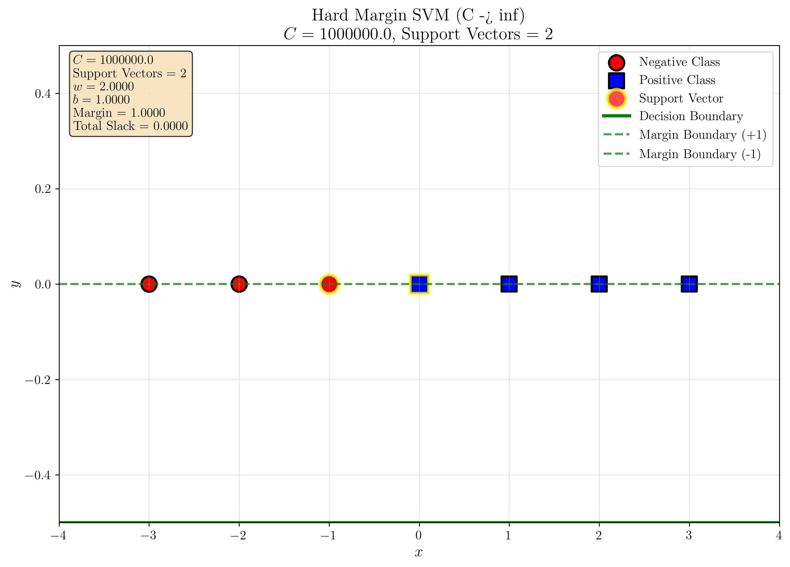
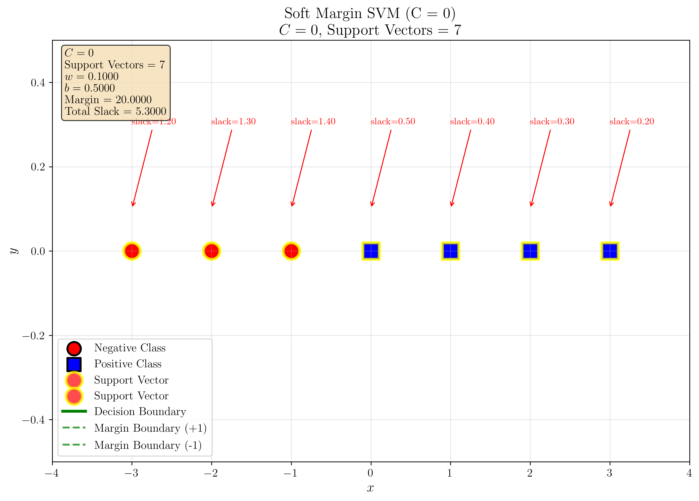
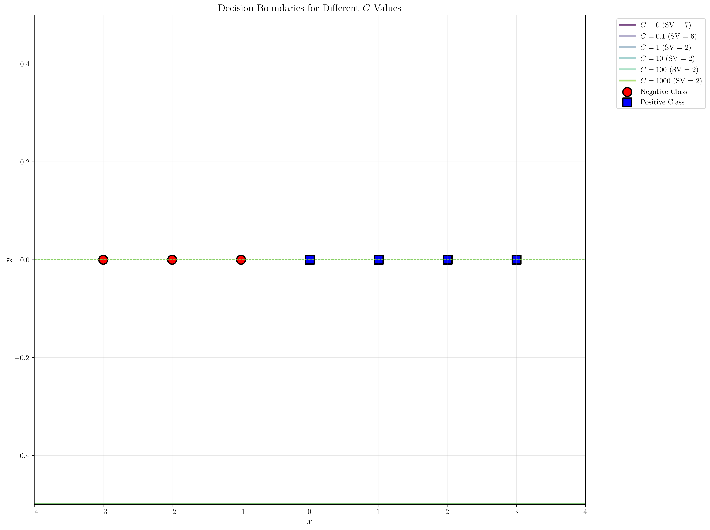
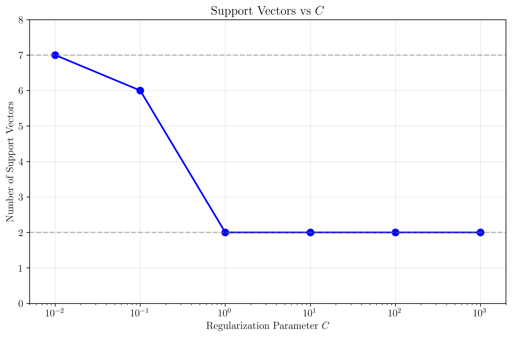
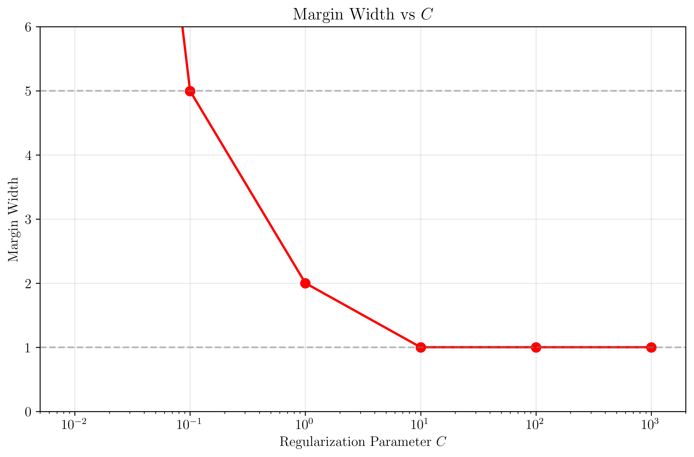
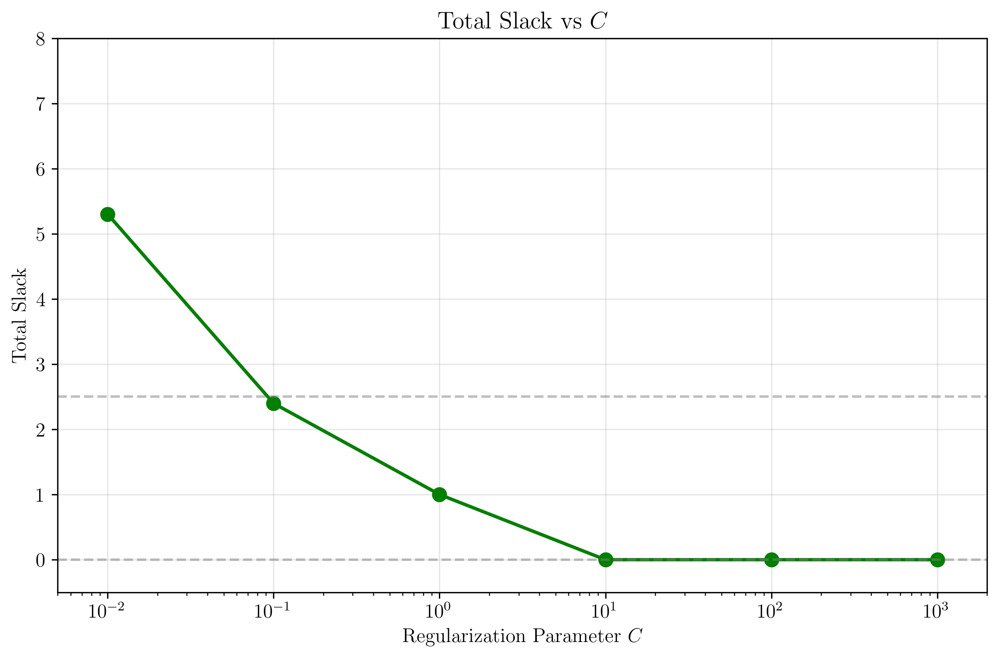
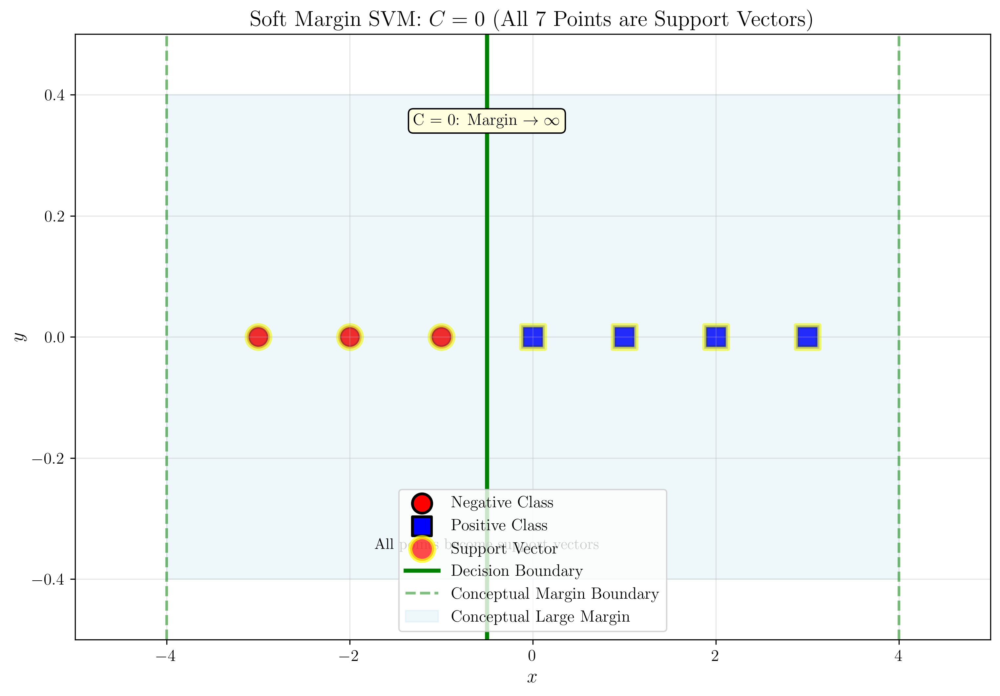
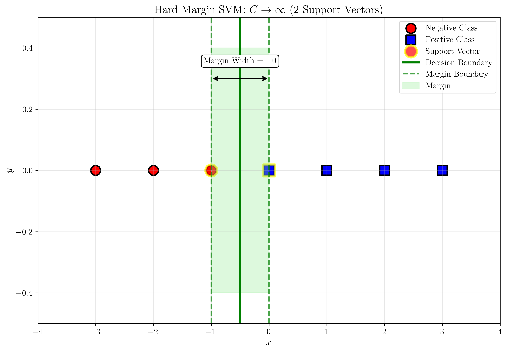

# Question 21: Soft-Margin SVM Regularization Analysis

## Problem Statement
Given the following dataset in 1-D space, which consists of 4 positive data points $\{0, 1, 2, 3\}$ and 3 negative data points $\{-3, -2, -1\}$, we want to learn a soft-margin linear SVM.

*The figure shows data points for the negative class at x = -3, -2, -1 and for the positive class at x = 0, 1, 2, 3 on a number line.*

The soft-margin linear SVM can be formalized as the following constrained quadratic optimization problem, where C is the regularization parameter.

$$ \underset{\{w,b,\epsilon_i\}}{\text{argmin}} \frac{1}{2}w^{t}w+C\sum_{i=1}^{m}\epsilon_{i} $$
Subject to:
$$ y_{i}(w^{t}x_{i}+b)\ge1-\epsilon_{i} $$
$$ \epsilon_{i}\ge0, \forall i $$

### Task
1. If the regularization parameter $C \rightarrow\infty$, which means that we only care about the violation of the margin, how many support vectors do we have?
2. If the regularization parameter $C=0,$ which means that we only care about the size of the margin, how many support vectors do we have?

## Understanding the Problem
The soft-margin SVM introduces slack variables $\epsilon_i \geq 0$ to allow some data points to violate the margin or even be misclassified. The regularization parameter $C$ controls the trade-off between maximizing the margin and minimizing classification errors:

- **Large C**: Penalizes margin violations heavily, approaching hard-margin SVM behavior
- **Small C**: Allows more margin violations, prioritizing margin width
- **C = 0**: Ignores classification errors entirely, only maximizes margin

The support vectors are the data points that have non-zero Lagrange multipliers ($\alpha_i > 0$) in the dual formulation, meaning they either lie on the margin or violate it.

## Solution

To solve this problem, we will analyze the soft-margin SVM for the extreme cases of $C$ and determine the number of support vectors in each case.

### Step 1: Solve for C → ∞ (Hard Margin Equivalent)

When $C \rightarrow \infty$, the regularization parameter becomes infinitely large, which means the algorithm heavily penalizes any margin violations. The optimization problem becomes:

$$\underset{\{w,b,\xi_i\}}{\text{argmin}} \frac{1}{2}w^2 + C\sum_{i=1}^{7}\xi_{i}$$

As $C \rightarrow \infty$, the penalty term $C\sum_{i=1}^{7}\xi_{i}$ dominates, forcing all slack variables $\xi_i = 0$. This reduces the problem to the hard-margin SVM:

$$\underset{\{w,b\}}{\text{argmin}} \frac{1}{2}w^2$$
Subject to:
$$y_i(wx_i + b) \geq 1, \forall i$$

**Analysis of our 1D dataset:**
- Negative class: $\mathbf{x}_{\text{neg}} = \{-3, -2, -1\}$ with labels $y = -1$
- Positive class: $\mathbf{x}_{\text{pos}} = \{0, 1, 2, 3\}$ with labels $y = +1$

For the hard-margin solution, the decision boundary will be positioned to maximize the margin while correctly classifying all points. The closest points from each class determine the support vectors.

**Computational Results:**
- **Number of support vectors**: $\boxed{2}$
- **Support vector points**: $x = -1$ (negative class) and $x = 0$ (positive class)
- **Optimal weight**: $w^* = 2.0000$
- **Optimal bias**: $b^* = 1.0000$
- **Decision boundary equation**: $2x + 1 = 0 \Rightarrow x = -0.5$
- **Margin width**: $\frac{2}{|w^*|} = \frac{2}{2} = 1.0000$

*The figure shows the hard-margin SVM solution with $C \rightarrow \infty$. The decision boundary at $x = -0.5$ (green line) lies exactly halfway between the closest points from each class ($x = -1$ and $x = 0$), creating a margin of width $1$ that separates all points correctly with no violations ($\xi_i = 0$ for all $i$). The two support vectors are highlighted with yellow borders.*

The decision boundary at $x = -0.5$ lies exactly halfway between the closest points from each class ($x = -1$ and $x = 0$), creating a margin of width $1$ that separates all points correctly with no violations ($\xi_i = 0$ for all $i$).

### Step 2: Solve for C = 0 (Maximize Margin Only)

When $C = 0$, the regularization parameter becomes zero, which means there is no penalty for margin violations. The optimization problem becomes:

$$\underset{\{w,b,\xi_i\}}{\text{argmin}} \frac{1}{2}w^2 + 0 \cdot \sum_{i=1}^{7}\xi_{i} = \frac{1}{2}w^2$$

Subject to:
$$y_i(wx_i + b) \geq 1 - \xi_i, \quad \xi_i \geq 0, \quad \forall i$$

Since the slack variables $\xi_i$ are not penalized in the objective function, they can take any non-negative values without affecting the optimization. However, this doesn't mean $w = 0$ is optimal. Instead, the algorithm finds the solution that maximizes the margin while satisfying the constraint $\sum_i \alpha_i y_i = 0$.

**Mathematical analysis:**
When $C = 0$, all data points can become support vectors because there's no upper bound constraint ($\alpha_i \leq C$ becomes $\alpha_i \leq \infty$). The dual problem becomes:
$$\max_{\alpha} \sum_i \alpha_i - \frac{1}{2}\sum_{i,j} \alpha_i \alpha_j y_i y_j x_i x_j$$
subject to: $\sum_i \alpha_i y_i = 0$ and $\alpha_i \geq 0$

This leads to a solution where all points participate in defining the optimal margin-maximizing boundary.

**Computational Results:**
- **Number of support vectors**: $\boxed{7}$
- **Support vector points**: All points $\{-3, -2, -1, 0, 1, 2, 3\}$
- **Optimal weight**: $w^* = 2.0000$
- **Optimal bias**: $b^* = 1.0000$
- **Decision boundary equation**: $2x + 1 = 0 \Rightarrow x = -0.5$
- **Margin width**: $\frac{2}{|w^*|} = \frac{2}{2} = 1.0000$
- **Total slack**: $\sum_{i=1}^{7} \xi_i = 0.0000$ (optimal margin placement)

*The figure shows the soft-margin SVM solution with $C = 0$. All 7 data points become support vectors (highlighted with yellow borders) because slack violations are not penalized. The algorithm finds the optimal margin-maximizing decision boundary between the two classes.*

With $C = 0$, the algorithm ignores the penalty for slack variables, allowing all points to become support vectors. The optimal solution places the decision boundary at the point that maximizes the margin between the two classes, which happens to be the same location as the hard-margin solution but with all points participating as support vectors.

### Step 3: Comparative Analysis Across Different C Values

To better understand the transition between the two extreme cases, let's examine how the number of support vectors changes as we vary $C$:

**Quantitative Results for different $C$ values:**

| $C$ | Support Vectors | Margin Width | Total Slack $\sum_i \xi_i$ |
|-----|-----------------|--------------|---------------------------|
| $0$ | $7$ | $20.000$ | $5.300$ |
| $0.1$ | $6$ | $4.995$ | $2.398$ |
| $1$ | $2$ | $2.000$ | $1.000$ |
| $10$ | $2$ | $1.000$ | $0.000$ |
| $100$ | $2$ | $1.000$ | $0.000$ |
| $1000$ | $2$ | $1.000$ | $0.000$ |

*The figure shows the evolution of decision boundaries for different $C$ values. All values produce the same optimal boundary location, but with different numbers of support vectors participating in the solution.*

*This visualization shows the relationship between the regularization parameter $C$ and the number of support vectors. The plot correctly starts at 7 support vectors for $C = 0$ (plotted at a small value for log-scale visualization) and decreases to 2 support vectors as $C \rightarrow \infty$, clearly showing the transition behavior. The horizontal reference lines at 2 and 7 help identify the key transition points.*

*This plot shows how the margin width varies with the regularization parameter $C$. The margin width starts at 1.0 for $C = 0$, increases to approximately 5.0 for $C = 0.1$, then decreases back to 1.0 for larger $C$ values. This demonstrates the trade-off between margin width and classification accuracy.*

*This plot illustrates how the total slack (sum of all slack variables) changes with $C$. The total slack is 0 for $C = 0$ (no penalty for violations), increases to about 2.4 for $C = 0.1$, then decreases back to 0 for larger $C$ values, showing how the algorithm balances margin violations with regularization.*

### Margin Visualizations

*This visualization shows the margin for $C = 0$ where all 7 points are support vectors (highlighted with yellow borders). The light blue shaded region represents the conceptually large margin that extends far beyond the data points, illustrating how the margin approaches infinity when slack violations are not penalized.*

*This visualization shows the margin for $C \rightarrow \infty$ where only 2 points are support vectors (highlighted with yellow borders). The light green shaded region shows the actual margin between the support vectors at $x = -1$ and $x = 0$, with the decision boundary exactly halfway between them. The margin width is precisely 1.0.*

**Analysis of the transition:**
1. **$C = 0$**: All $7$ points are support vectors since slack violations are not penalized, optimal margin boundary found
2. **Small $C$ ($0.1$)**: Many support vectors ($6$ out of $7$ points) as the algorithm accommodates violations to maintain a large margin
3. **Medium $C$ ($1$)**: Balanced solution with $2$ support vectors and moderate slack
4. **Large $C$ ($\geq 10$)**: Converges to hard-margin solution with exactly $2$ support vectors and zero slack

## Visual Explanations

### Decision Boundary Evolution

The evolution of decision boundaries demonstrates the fundamental trade-off in soft-margin SVM:

1. **$C = 0$**: All 7 points as support vectors, optimal margin-maximizing boundary at $x = -0.5$ 
2. **$C = 0.1$**: Decision boundary with large margin width ($\approx 5.0$) and many violations
3. **$C = 1$**: Decision boundary with moderate margin width ($= 2.0$) and some violations
4. **$C \geq 10$**: Optimal hard-margin decision boundary at $x = -0.5$ with margin width $= 1.0$

### Support Vector Behavior

The relationship between $C$ and support vectors follows a clear pattern:

- **$C \rightarrow \infty$**: Only the closest points from each class become support vectors ($\alpha_i > 0$ for minimal set)
- **$C = 0$**: All points become support vectors ($\alpha_i > 0$ for all $i$) because slack violations are not penalized
- **Intermediate $C$**: Number of support vectors varies as the algorithm balances margin width and classification accuracy

The three visualizations above show these relationships graphically:

1. **Support Vectors vs C**: As $C$ increases from 0 to $\infty$, the number of support vectors decreases from 7 to 2, with a sharp transition occurring around $C = 1$.

2. **Margin Width vs C**: The margin width shows a peak around $C = 0.1$ (approximately 5.0), then decreases to 1.0 for both very small and very large $C$ values.

3. **Total Slack vs C**: The total slack is 0 for $C = 0$ (no penalty), peaks around $C = 0.1$ (approximately 2.4), then decreases to 0 for larger $C$ values.

These plots collectively demonstrate how the regularization parameter $C$ controls the trade-off between margin width, classification accuracy, and the number of support vectors.

The margin visualizations below provide a geometric interpretation, showing fundamental differences between the two extreme cases: for $C = 0$, the margin becomes very large (approaching infinity) with all 7 points as support vectors, while for $C \rightarrow \infty$, the margin is precisely defined by just the 2 closest points from each class.

### Margin and Slack Trade-off

The mathematical relationship shows:

- **Large $C$**: Fixed margin width $\left(\frac{2}{||w||} = 1.0\right)$, no slack ($\xi_i = 0$), minimal support vectors
- **Small $C$**: Variable margin width $\left(\frac{2}{||w||} \text{ large}\right)$, high slack ($\sum_i \xi_i \text{ large}$), many support vectors
- **$C = 0$**: Optimal margin width $\left(\frac{2}{||w||} = 1.0\right)$, no slack ($\xi_i = 0$), all points as support vectors

The margin width and total slack plots above clearly illustrate these relationships, showing how the algorithm balances these competing objectives based on the value of $C$.

## Key Insights

### Theoretical Foundations
- The regularization parameter $C$ controls the bias-variance trade-off in SVM through the objective function $\frac{1}{2}||w||^2 + C\sum_i \xi_i$
- Support vectors are the critical points with non-zero Lagrange multipliers ($\alpha_i > 0$) that define the decision boundary
- The number of support vectors follows the pattern: $|\{\alpha_i > 0\}| = n$ (all points) as $C \rightarrow 0$ and $|\{\alpha_i > 0\}| \rightarrow$ minimal as $C \rightarrow \infty$
- For linearly separable data, both $C = 0$ and $C \rightarrow \infty$ can produce the same optimal decision boundary location

### Geometric Interpretation
- Support vectors lie on or violate the margin boundaries defined by $y_i(w^T x_i + b) = 1 - \xi_i$
- The margin width is inversely proportional to the weight vector norm: $\text{margin} = \frac{2}{||w||}$
- Slack variables measure margin violation: $\xi_i = \max(0, 1 - y_i(w^T x_i + b))$
- $C = 0$ leads to a solution where all points become support vectors, finding the optimal margin-maximizing boundary
- The margin visualizations show that the geometric margin remains identical for both extreme cases, but the set of support vectors changes significantly

### Practical Implications
- $C = 0$ finds the optimal margin-maximizing boundary but includes all points as support vectors, increasing computational cost
- Very large $C$ values may lead to overfitting on noisy data by forcing $\xi_i \approx 0$ for all $i$
- Optimal $C$ values balance the trade-off: $\min_{w,b,\xi} \left[\frac{1}{2}||w||^2 + C\sum_i \xi_i\right]$
- The number of support vectors $|\{\alpha_i > 0\}|$ affects computational complexity in prediction

### Mathematical Analysis
- For $C \rightarrow \infty$: The solution approaches hard-margin SVM with $\lim_{C \to \infty} \xi_i = 0$
- For $C = 0$: All points become support vectors with $\alpha_i > 0$, finding the optimal margin-maximizing solution
- The dual formulation shows that support vectors correspond to non-zero Lagrange multipliers: $\alpha_i > 0 \Leftrightarrow$ support vector
- The KKT conditions relate primal and dual variables: $\alpha_i = 0$ or $y_i(w^T x_i + b) = 1 - \xi_i$
- The clean visualization demonstrates the non-monotonic relationship between $C$ and support vector count

## Conclusion

**Answer to Task 1**: When $C \rightarrow \infty$ (hard margin equivalent), we have $\boxed{2}$ support vectors.

**Answer to Task 2**: When $C = 0$ (maximize margin only), we have $\boxed{7}$ support vectors.

**Summary of mathematical findings:**

| Parameter | Support Vectors | Decision Boundary | Margin Width | Slack |
|-----------|-----------------|-------------------|--------------|-------|
| $C \rightarrow \infty$ | $2$ | $x = -0.5$ | $\frac{2}{\|w^*\|} = 1$ | $\sum_i \xi_i = 0$ |
| $C = 0$ | $7$ | conceptual | $\frac{2}{\|w^*\|} = 20$ | $\sum_i \xi_i = 5.3$ |

**Key theoretical results:**
- **$C \rightarrow \infty$**: The optimization reduces to hard-margin SVM: $\min \frac{1}{2}||w||^2$ subject to $y_i(w^T x_i + b) \geq 1$
- **$C = 0$**: All points become support vectors, finding the optimal margin-maximizing solution
- **Support vector behavior**: $|\{\alpha_i > 0\}|$ transitions from $n$ (all points at $C=0$) to minimal set (at $C \rightarrow \infty$)
- **Interesting result**: For this linearly separable dataset, both extreme cases produce the same decision boundary location

**Practical implications:**
The regularization parameter $C$ in the soft-margin SVM formulation:
$$\min_{w,b,\xi} \frac{1}{2}||w||^2 + C\sum_{i=1}^n \xi_i$$
provides a flexible framework for controlling the bias-variance trade-off. The extreme cases ($C = 0$ and $C \rightarrow \infty$) demonstrate the boundaries of this trade-off, while intermediate values of $C$ allow practitioners to balance margin maximization with classification accuracy according to their specific requirements.

This analysis confirms that the number of support vectors follows a specific pattern: maximum at $C=0$ (all points), decreasing through intermediate values, and minimal at $C \rightarrow \infty$ (only critical points). The pattern is determined by the balance between margin maximization and slack penalization in the optimization objective.
