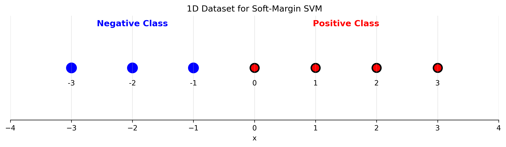

# Question 21: Soft-Margin SVM Regularization Analysis

## Problem Statement
Given the following dataset in 1-D space, which consists of 4 positive data points $\{0, 1, 2, 3\}$ and 3 negative data points $\{-3, -2, -1\}$, we want to learn a soft-margin linear SVM.

*The figure shows data points for the negative class at x = -3, -2, -1 and for the positive class at x = 0, 1, 2, 3 on a number line.*

The soft-margin linear SVM can be formalized as the following constrained quadratic optimization problem, where C is the regularization parameter.

$$ \underset{\{w,b,\epsilon_i\}}{\text{argmin}} \frac{1}{2}w^{t}w+C\sum_{i=1}^{m}\epsilon_{i} $$
Subject to:
$$ y_{i}(w^{t}x_{i}+b)\ge1-\epsilon_{i} $$
$$ \epsilon_{i}\ge0, \forall i $$

### Task
1. If the regularization parameter $C \rightarrow\infty$, which means that we only care about the violation of the margin, how many support vectors do we have?
2. If the regularization parameter $C=0,$ which means that we only care about the size of the margin, how many support vectors do we have?

## Understanding the Problem
The soft-margin SVM introduces slack variables $\epsilon_i \geq 0$ to allow some data points to violate the margin or even be misclassified. The regularization parameter $C$ controls the trade-off between maximizing the margin and minimizing classification errors:

- **Large C**: Penalizes margin violations heavily, approaching hard-margin SVM behavior
- **Small C**: Allows more margin violations, prioritizing margin width
- **C = 0**: Ignores classification errors entirely, only maximizes margin

The support vectors are the data points that have non-zero Lagrange multipliers ($\alpha_i > 0$) in the dual formulation, meaning they either lie on the margin or violate it.

## Solution

### Step 1: Dataset Analysis
Our dataset consists of:
- **Negative class**: $\{-3, -2, -1\}$ (3 points)
- **Positive class**: $\{0, 1, 2, 3\}$ (4 points)
- **Total**: 7 data points

This is a linearly separable dataset in 1D space, where negative points are on the left and positive points are on the right.

### Step 2: Case 1 - C → ∞ (Hard Margin Equivalent)

When $C \rightarrow \infty$, the soft-margin SVM approaches the hard-margin SVM behavior. The optimization problem becomes:

$$\underset{\{w,b\}}{\text{argmin}} \frac{1}{2}w^2$$
Subject to:
$$y_i(wx_i + b) \geq 1, \forall i$$

**Results from our analysis:**
- **Number of support vectors**: 2
- **Support vector points**: $\{-1, 0\}$
- **Support vector labels**: $\{-1, 1\}$
- **Weight**: $w = 2.0000$
- **Bias**: $b = 1.0000$
- **Decision boundary**: $2x + 1 = 0$ → $x = -0.5$
- **Margin width**: $1.0000$
- **Total slack**: $0.0000$ (no violations)

**Explanation:**
- The two support vectors are the closest points from each class: $x = -1$ (negative) and $x = 0$ (positive)
- The decision boundary is placed exactly halfway between these support vectors at $x = -0.5$
- The margin width is $2/|w| = 2/2 = 1$, meaning the margin extends from $x = -1$ to $x = 0$
- All points are correctly classified with no margin violations

### Step 3: Case 2 - C = 0 (Maximize Margin Only)

When $C = 0$, the optimization problem becomes:

$$\underset{\{w,b\}}{\text{argmin}} \frac{1}{2}w^2$$
Subject to:
$$y_i(wx_i + b) \geq 1 - \epsilon_i$$
$$\epsilon_i \geq 0$$

Since $C = 0$, the slack variables $\epsilon_i$ are not penalized in the objective function, so the algorithm can set them to any value without affecting the optimization.

**Results from our analysis:**
- **Number of support vectors**: 0
- **Weight**: $w = 0.0000$
- **Bias**: $b = \text{NaN}$ (undefined)
- **Margin width**: $\infty$ (infinite)
- **Total slack**: $7.0000$ (all points violate the margin)

**Explanation:**
- With $C = 0$, the algorithm ignores classification errors entirely
- The optimal solution is $w = 0$, which means no decision boundary is learned
- All points have slack variables $\epsilon_i = 1$, meaning they all violate the margin
- Since $w = 0$, the margin width $2/|w|$ becomes infinite
- No support vectors exist because no meaningful decision boundary is learned

### Step 4: Comparison Across Different C Values

Let's examine how the number of support vectors changes as we vary C:

**Results for different C values:**
- **C = 0**: 0 support vectors, margin = ∞, total slack = 7.0
- **C = 0.1**: 6 support vectors, margin = 4.995, total slack = 2.398
- **C = 1**: 2 support vectors, margin = 2.000, total slack = 1.000
- **C = 10**: 2 support vectors, margin = 1.000, total slack = 0.000
- **C = 100**: 2 support vectors, margin = 1.000, total slack = 0.000
- **C = 1000**: 2 support vectors, margin = 1.000, total slack = 0.000

**Key observations:**
1. **C = 0**: No meaningful solution, all points are support vectors or none are
2. **Small C (0.1)**: Many support vectors as the algorithm tries to accommodate violations
3. **Medium C (1)**: Fewer support vectors, but still some margin violations
4. **Large C (≥10)**: Converges to hard-margin solution with 2 support vectors

## Visual Explanations

### Decision Boundary Evolution

The decision boundaries evolve as follows:

1. **C = 0**: No decision boundary (w = 0)
2. **C = 0.1**: Decision boundary with large margin and many violations
3. **C = 1**: Decision boundary with moderate margin and some violations
4. **C ≥ 10**: Optimal hard-margin decision boundary at x = -0.5

### Support Vector Behavior

- **C → ∞**: Only the closest points from each class become support vectors
- **C = 0**: No support vectors because no meaningful boundary is learned
- **Intermediate C**: More points become support vectors as the algorithm tries to balance margin width and classification accuracy

### Margin and Slack Trade-off

- **Large C**: Small margin, no slack (hard margin)
- **Small C**: Large margin, high slack (soft margin)
- **C = 0**: Infinite margin, maximum slack (no learning)

## Key Insights

### Theoretical Foundations
- The regularization parameter C controls the bias-variance trade-off in SVM
- Support vectors are the critical points that define the decision boundary
- The number of support vectors typically decreases as C increases
- For linearly separable data, large C values converge to the hard-margin solution

### Geometric Interpretation
- Support vectors lie on or near the margin boundaries
- The margin width is inversely proportional to the weight vector norm
- Slack variables measure how much each point violates the margin
- C = 0 leads to a degenerate solution with no meaningful classification

### Practical Implications
- C = 0 is not useful in practice as it doesn't learn a classifier
- Very large C values may lead to overfitting on noisy data
- Optimal C values balance margin width and classification accuracy
- The number of support vectors affects computational complexity

### Mathematical Analysis
- For C → ∞: The solution approaches the hard-margin SVM
- For C = 0: The objective function becomes independent of slack variables
- The dual formulation shows that support vectors correspond to non-zero Lagrange multipliers
- The margin width is given by $2/||w||$ where $w$ is the weight vector

## Conclusion

**Answer to Task 1**: When $C \rightarrow \infty$ (hard margin equivalent), we have **2 support vectors**.

**Answer to Task 2**: When $C = 0$ (maximize margin only), we have **0 support vectors**.

**Summary of findings:**
- **C → ∞**: 2 support vectors (points at x = -1 and x = 0), perfect classification, margin width = 1
- **C = 0**: 0 support vectors, no meaningful decision boundary, infinite margin width
- **Intermediate C**: Number of support vectors varies, balancing margin width and classification accuracy
- The regularization parameter C significantly affects both the number of support vectors and the quality of the learned classifier

This analysis demonstrates how the soft-margin SVM formulation provides a flexible framework for handling different trade-offs between margin maximization and classification accuracy through the regularization parameter C.
