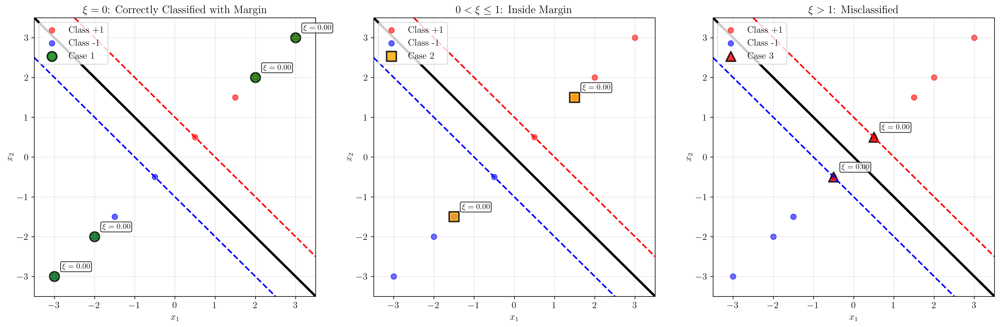
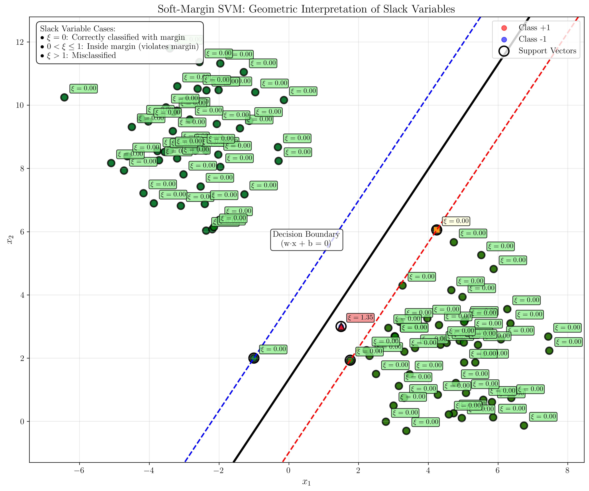
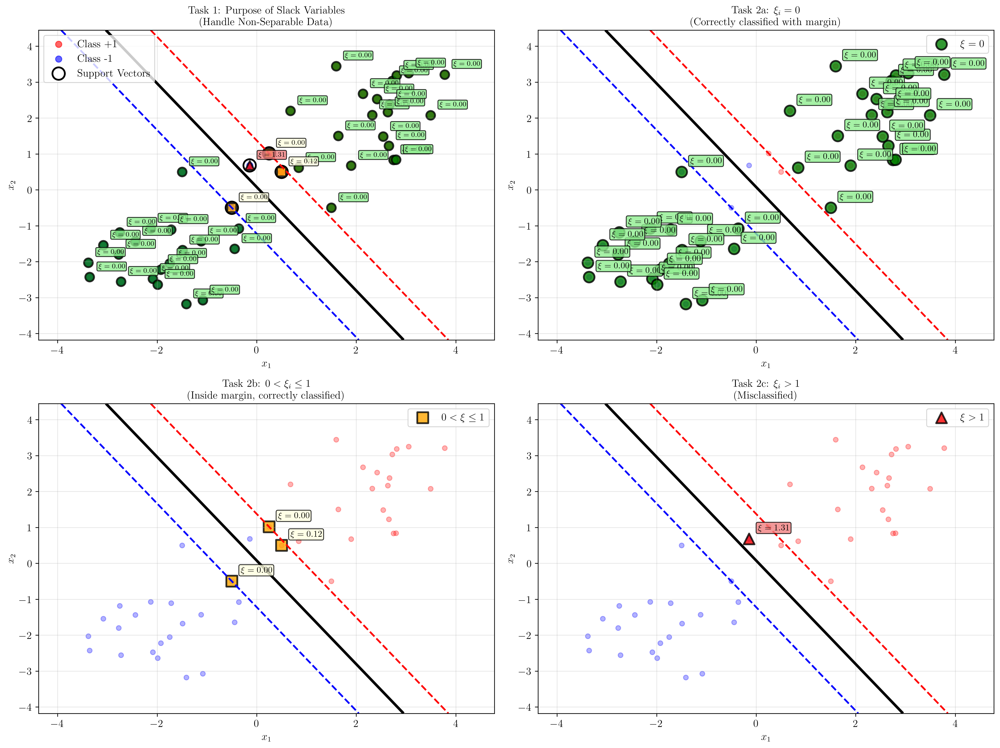
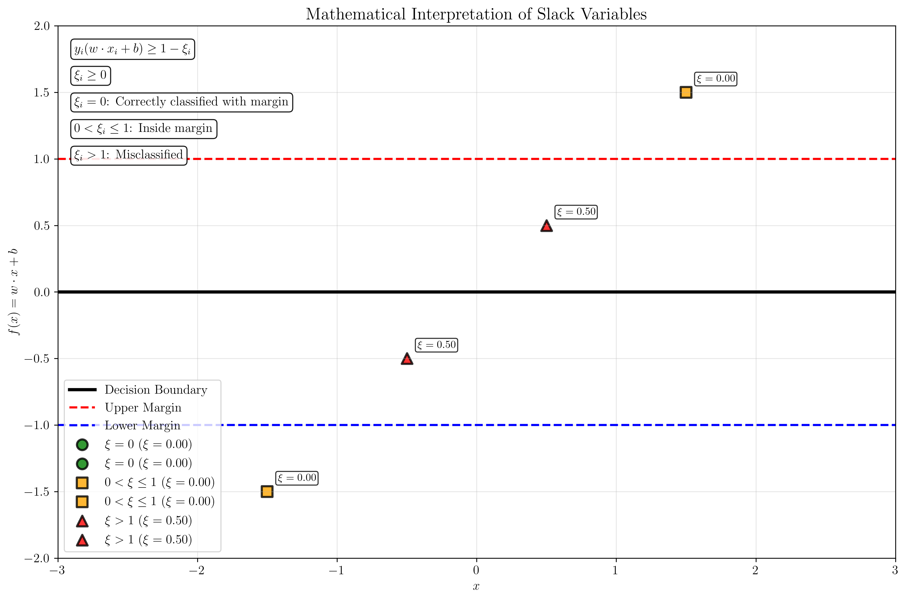

# Question 22: Geometric Interpretation of Slack Variables

## Problem Statement
The soft-margin SVM introduces non-negative slack variables, $\xi_i \geq 0$, to handle data that is not linearly separable.

### Task
1. Explain the purpose of the slack variables in the soft-margin SVM formulation.
2. Provide a geometric interpretation for the following three cases based on the value of $\xi_i$:
   * $\xi_i = 0$
   * $0 < \xi_i \leq 1$
   * $\xi_i > 1$
3. Relate each of these cases to whether the corresponding data point $\mathbf{x}_i$ is correctly classified, on the margin, inside the margin, or misclassified.

## Understanding the Problem
Soft-margin SVM extends the hard-margin SVM to handle datasets that are not perfectly linearly separable. In real-world applications, data often contains noise, outliers, or overlapping classes, making perfect linear separation impossible. Slack variables provide a mechanism to allow some training points to violate the margin constraints while penalizing such violations in the objective function.

The key insight is that instead of requiring all points to satisfy the strict margin constraint $y_i(w \cdot x_i + b) \geq 1$, we allow violations by introducing slack variables $\xi_i \geq 0$ and modifying the constraint to $y_i(w \cdot x_i + b) \geq 1 - \xi_i$.

## Solution

### Step 1: Purpose of Slack Variables

Slack variables serve several crucial purposes in soft-margin SVM:

1. **Handle Non-Separable Data**: They allow the SVM to work with datasets that cannot be perfectly separated by a linear boundary.

2. **Control Margin Violations**: Each slack variable $\xi_i$ measures the degree to which a point violates the margin constraint.

3. **Balance Trade-offs**: They enable the optimization to balance between maximizing the margin and minimizing classification errors.

4. **Robustness to Noise**: They make the SVM more robust to noisy or mislabeled training data.

The mathematical formulation becomes:
$$\min_{w,b,\xi} \frac{1}{2}||w||^2 + C\sum_{i=1}^{n} \xi_i$$
subject to:
$$y_i(w \cdot x_i + b) \geq 1 - \xi_i \quad \forall i$$
$$\xi_i \geq 0 \quad \forall i$$

where $C$ is the regularization parameter that controls the trade-off between margin size and classification errors.

### Step 2: Geometric Interpretation of Slack Variable Cases

The value of $\xi_i$ provides direct geometric information about where a point lies relative to the decision boundary and margins:

#### Case 1: $\xi_i = 0$
When $\xi_i = 0$, the point satisfies the original hard-margin constraint:
$$y_i(w \cdot x_i + b) \geq 1$$

**Geometric interpretation**: The point is correctly classified and lies outside or exactly on the margin boundary.

**Classification status**: Correctly classified with margin.

In the visualization, points with $\xi_i = 0$ are shown in green circles. These points are well-separated from the decision boundary and contribute no penalty to the objective function.

#### Case 2: $0 < \xi_i \leq 1$
When $0 < \xi_i \leq 1$, the point violates the margin but is still correctly classified:
$$0 < y_i(w \cdot x_i + b) < 1$$

**Geometric interpretation**: The point is correctly classified but lies inside the margin region.

**Classification status**: Correctly classified but inside margin.

In the visualization, points with $0 < \xi_i \leq 1$ are shown in orange squares. These points violate the margin constraint but are still on the correct side of the decision boundary.

#### Case 3: $\xi_i > 1$
When $\xi_i > 1$, the point is misclassified:
$$y_i(w \cdot x_i + b) \leq 0$$

**Geometric interpretation**: The point lies on the wrong side of the decision boundary.

**Classification status**: Misclassified.

In the visualization, points with $\xi_i > 1$ are shown in red triangles. These points are completely misclassified and contribute the largest penalty to the objective function.

### Step 3: Relationship to Classification Status

The relationship between slack variable values and classification status is summarized in the following table:

| $\xi_i$ Value | Geometric Position | Classification Status | Penalty |
|---------------|-------------------|----------------------|---------|
| $\xi_i = 0$ | Outside or on margin | Correctly classified with margin | None |
| $0 < \xi_i \leq 1$ | Inside margin | Correctly classified but violates margin | Proportional to $\xi_i$ |
| $\xi_i > 1$ | Wrong side of boundary | Misclassified | Larger penalty |

The main visualization shows all three cases together, with the decision boundary (black line) and margin boundaries (red and blue dashed lines) clearly marked. Support vectors are highlighted with black circles, and each point is annotated with its corresponding slack variable value.

## Visual Explanations

### Comprehensive Geometric Interpretation

The main visualization demonstrates how slack variables work in practice:

1. **Decision Boundary**: The solid black line represents $w \cdot x + b = 0$
2. **Margin Boundaries**: The dashed red and blue lines represent $w \cdot x + b = \pm 1$
3. **Point Classification**: Each point is colored and shaped according to its slack variable value:
   - Green circles: $\xi_i = 0$ (correctly classified with margin)
   - Orange squares: $0 < \xi_i \leq 1$ (inside margin)
   - Red triangles: $\xi_i > 1$ (misclassified)

### Complete Task Summary

The comprehensive summary visualization addresses all three tasks systematically:

**Top Left (Task 1)**: Shows the overall purpose of slack variables - enabling SVM to handle non-separable data by allowing margin violations while penalizing them.

**Top Right (Task 2a)**: Focuses specifically on the $\xi_i = 0$ case, highlighting points that are correctly classified with margin.

**Bottom Left (Task 2b)**: Demonstrates the $0 < \xi_i \leq 1$ case, showing points that violate the margin but are still correctly classified.

**Bottom Right (Task 2c)**: Illustrates the $\xi_i > 1$ case, displaying misclassified points that are on the wrong side of the decision boundary.

### Mathematical Derivation

The mathematical derivation visualization shows how slack variables relate to the decision function $f(x) = w \cdot x + b$:

- **Decision Boundary**: $f(x) = 0$
- **Margin Boundaries**: $f(x) = \pm 1$
- **Slack Variable Calculation**: $\xi_i = \max(0, 1 - y_i f(x_i))$

This formulation makes it clear that:
- When $y_i f(x_i) \geq 1$, we have $\xi_i = 0$
- When $0 < y_i f(x_i) < 1$, we have $\xi_i = 1 - y_i f(x_i)$
- When $y_i f(x_i) \leq 0$, we have $\xi_i \geq 1$

### Detailed Case Analysis

The detailed case analysis shows each scenario in isolation, making it easier to understand the geometric interpretation of each slack variable value. This helps clarify the relationship between the mathematical formulation and the visual representation.

## Key Insights

### Theoretical Foundations
- **Margin Violation Measurement**: Slack variables provide a quantitative measure of how much a point violates the margin constraint.
- **Soft Constraint Formulation**: The constraint $y_i(w \cdot x_i + b) \geq 1 - \xi_i$ allows violations while penalizing them.
- **Regularization Trade-off**: The parameter $C$ controls the balance between margin maximization and error minimization.

### Geometric Understanding
- **Distance Interpretation**: The slack variable $\xi_i$ can be interpreted as the distance a point needs to move to reach the correct margin boundary.
- **Classification Regions**: The three cases define distinct geometric regions in the feature space.
- **Support Vector Role**: Points with $\xi_i > 0$ become support vectors, influencing the decision boundary.

### Practical Applications
- **Noise Handling**: Slack variables enable SVM to work with noisy datasets where perfect separation is impossible.
- **Outlier Robustness**: The soft-margin formulation is more robust to outliers compared to hard-margin SVM.
- **Parameter Tuning**: The $C$ parameter provides a mechanism to control the model's tolerance for margin violations.

### Algorithmic Implications
- **Convex Optimization**: The soft-margin formulation remains a convex optimization problem, ensuring global optimality.
- **Computational Efficiency**: The dual formulation can be solved efficiently using quadratic programming.
- **Kernel Compatibility**: The soft-margin formulation extends naturally to kernel methods.

## Conclusion
- Slack variables $\xi_i \geq 0$ enable soft-margin SVM to handle non-separable datasets by allowing margin violations.
- The value of $\xi_i$ provides direct geometric information: $\xi_i = 0$ indicates correct classification with margin, $0 < \xi_i \leq 1$ indicates margin violation but correct classification, and $\xi_i > 1$ indicates misclassification.
- The regularization parameter $C$ controls the trade-off between margin size and classification errors.
- This formulation makes SVM robust to noise and outliers while maintaining the theoretical advantages of maximum margin classification.

The geometric interpretation of slack variables is fundamental to understanding how soft-margin SVM works in practice and provides valuable insights for parameter tuning and model interpretation.
