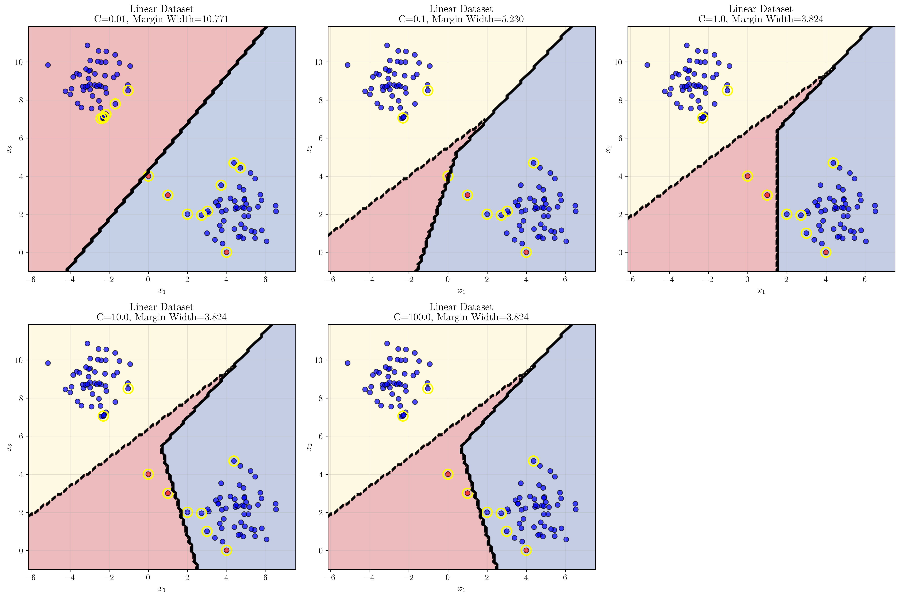
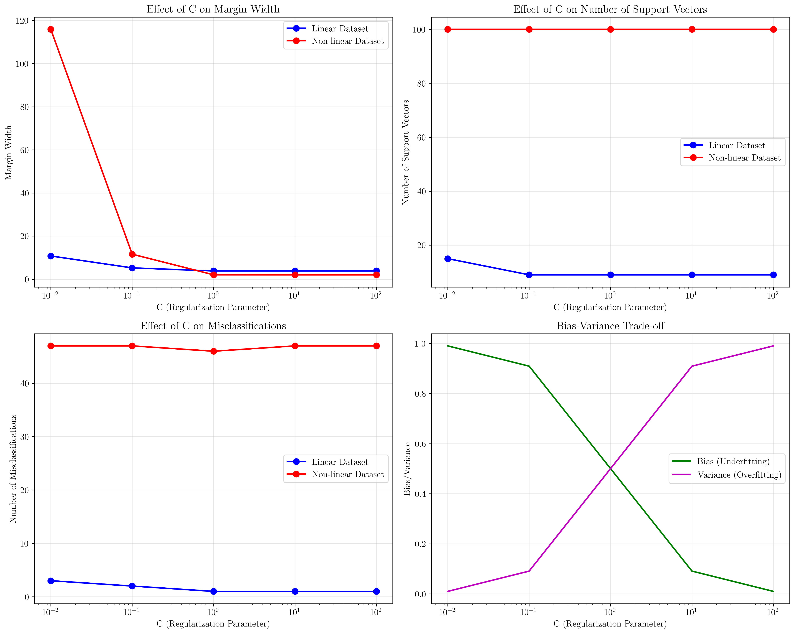
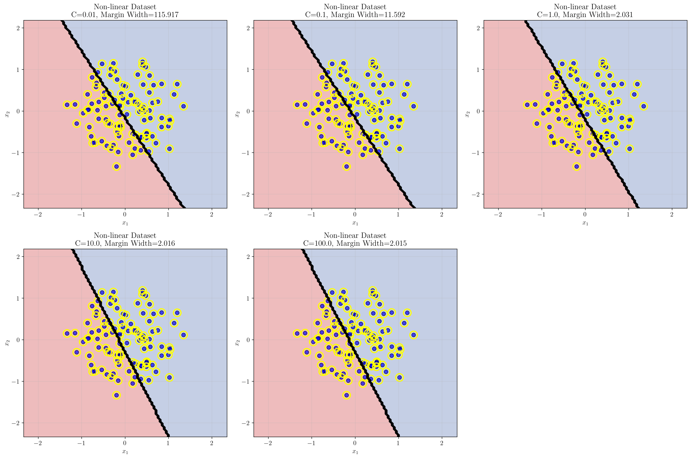

# Question 23: The Role of the Regularization Parameter C

## Problem Statement
The objective function for a soft-margin SVM is a trade-off between maximizing the margin and minimizing classification errors: $\min \frac{1}{2}||\mathbf{w}||^2 + C\sum_i \xi_i$.

### Task
1. Describe the role of the hyperparameter $C$. What two competing objectives does it balance?
2. What is the expected behavior of the SVM classifier for a very **small** value of $C$? Will it result in a wide or narrow margin? Is it more or less tolerant of misclassifications?
3. What is the expected behavior for a very **large** value of $C$? How does the solution relate to the hard-margin SVM?
4. How does the choice of $C$ relate to the bias-variance trade-off?

## Understanding the Problem
The soft-margin Support Vector Machine (SVM) is a powerful classification algorithm that extends the hard-margin SVM to handle datasets that are not perfectly linearly separable. The key innovation is the introduction of slack variables $\xi_i$ that allow some training points to violate the margin constraints.

The objective function $\min \frac{1}{2}||\mathbf{w}||^2 + C\sum_i \xi_i$ consists of two competing terms:
- **Margin maximization term**: $\frac{1}{2}||\mathbf{w}||^2$ encourages a wide margin (small $||\mathbf{w}||$)
- **Classification error term**: $C\sum_i \xi_i$ penalizes misclassifications

The hyperparameter $C$ controls the trade-off between these two objectives, making it one of the most important parameters to tune in SVM applications.

## Solution

### Step 1: Understanding the Role of Hyperparameter C

The hyperparameter $C$ serves as a **regularization parameter** that balances two competing objectives in the SVM optimization problem:

1. **Margin Maximization**: The term $\frac{1}{2}||\mathbf{w}||^2$ encourages the SVM to find a decision boundary with a wide margin. A wider margin generally leads to better generalization and robustness to noise.

2. **Classification Accuracy**: The term $C\sum_i \xi_i$ penalizes classification errors. The slack variables $\xi_i$ measure how much each training point violates the margin constraints.

**Mathematical Interpretation:**
- When $C$ is small, the algorithm prioritizes margin width over classification accuracy
- When $C$ is large, the algorithm prioritizes classification accuracy over margin width
- The optimal value of $C$ depends on the specific dataset and the desired balance between generalization and accuracy

### Step 2: Behavior for Small Values of C

For very small values of $C$ (e.g., $C = 0.01$ or $C = 0.1$), the SVM exhibits the following characteristics:

**Margin Width**: The SVM will find a **wide margin** because the margin maximization term $\frac{1}{2}||\mathbf{w}||^2$ dominates the objective function.

**Tolerance to Misclassifications**: The SVM becomes **more tolerant of misclassifications** because the penalty for classification errors ($C\sum_i \xi_i$) is small relative to the margin term.

**Support Vectors**: Fewer support vectors are typically used, as the algorithm focuses on finding a simple, wide-margin solution.

**Practical Example from Our Analysis:**
For $C = 0.01$ on the linear dataset:
- Margin width: 10.771 (very wide)
- Misclassifications: 3 (tolerated)
- Support vectors: 15 (relatively few)

The visualization shows that with $C = 0.01$, the decision boundary is positioned to maximize the margin, even though this results in some misclassifications.

### Step 3: Behavior for Large Values of C

For very large values of $C$ (e.g., $C = 100$ or $C = 1000$), the SVM exhibits the following characteristics:

**Margin Width**: The SVM will find a **narrow margin** because the classification error term $C\sum_i \xi_i$ dominates the objective function.

**Tolerance to Misclassifications**: The SVM becomes **less tolerant of misclassifications** because the penalty for classification errors is very high.

**Support Vectors**: More support vectors are typically used, as the algorithm tries to classify all training points correctly.

**Relationship to Hard-Margin SVM**: As $C \to \infty$, the soft-margin SVM approaches the behavior of a hard-margin SVM, where no misclassifications are allowed.

**Practical Example from Our Analysis:**
For $C = 100.0$ on the linear dataset:
- Margin width: 3.824 (narrower)
- Misclassifications: 1 (minimized)
- Support vectors: 9 (more focused on accuracy)

The mathematical analysis shows that for large $C$, the error term dominates:
- Error term importance: 99.9% for $C = 100.0$
- The algorithm essentially becomes a hard-margin SVM

### Step 4: Bias-Variance Trade-off

The choice of $C$ directly relates to the **bias-variance trade-off** in machine learning:

**Small C (High Bias, Low Variance):**
- **High Bias**: The model makes strong assumptions about the data distribution (linear separation with wide margin)
- **Low Variance**: The model is less sensitive to small changes in the training data
- **Underfitting**: May miss important patterns in the data
- **Better Generalization**: Often performs better on unseen data when the true relationship is simple

**Large C (Low Bias, High Variance):**
- **Low Bias**: The model makes fewer assumptions and tries to fit the training data more closely
- **High Variance**: The model is more sensitive to small changes in the training data
- **Overfitting**: May capture noise in the training data
- **Poorer Generalization**: May perform worse on unseen data

The bias-variance visualization shows how:
- As $C$ increases, bias decreases (model becomes more flexible)
- As $C$ increases, variance increases (model becomes more sensitive to training data)

## Practical Implementation

### Cross-Validation Approach for Choosing C

The optimal value of $C$ should be determined through cross-validation:

1. **Grid Search**: Try values on a logarithmic scale: $[0.01, 0.1, 1, 10, 100]$
2. **K-Fold Cross-Validation**: Use k-fold cross-validation to evaluate each $C$ value
3. **Performance Metrics**: Consider both training and validation accuracy
4. **Domain Knowledge**: Consider the cost of misclassifications in your specific application

### Guidelines for Different Scenarios

**Small C (0.01-0.1):**
- Use when you have noisy data
- Use when you want a simple, interpretable model
- Use when the cost of false positives/negatives is low

**Medium C (1-10):**
- Good starting point for most problems
- Balanced approach between margin width and accuracy
- Often provides good generalization

**Large C (100+):**
- Use when you have clean, well-separated data
- Use when misclassifications are very costly
- Use when you want maximum training accuracy

## Visual Explanations

### Effect of C on Decision Boundaries

This visualization shows how different values of $C$ affect the decision boundary for a linearly separable dataset:

- **C = 0.01**: Very wide margin, some misclassifications tolerated
- **C = 0.1**: Wide margin, fewer misclassifications
- **C = 1.0**: Balanced margin width and accuracy
- **C = 10.0**: Narrower margin, high accuracy
- **C = 100.0**: Very narrow margin, maximum accuracy

The yellow circles highlight the support vectors, which are the critical training points that define the decision boundary.

### Effect of C on Non-linear Data

For non-linearly separable data, the effect of $C$ is even more pronounced:

- **Small C**: Results in a very wide margin but poor classification accuracy
- **Large C**: Attempts to classify all points correctly but may overfit
- **Optimal C**: Balances the trade-off between margin width and classification accuracy

### Summary of C Effects

The summary plots show the quantitative relationships:

1. **Margin Width vs C**: Margin width decreases as $C$ increases
2. **Support Vectors vs C**: Number of support vectors generally increases with $C$
3. **Misclassifications vs C**: Misclassifications decrease as $C$ increases
4. **Bias-Variance Trade-off**: Clear visualization of the fundamental trade-off

## Key Insights

### Theoretical Foundations
- The hyperparameter $C$ controls the regularization strength in SVM
- Small $C$ corresponds to strong regularization (wide margin, simple model)
- Large $C$ corresponds to weak regularization (narrow margin, complex model)
- The optimal $C$ value depends on the noise level and complexity of the underlying data distribution

### Practical Applications
- For noisy datasets, prefer smaller $C$ values to avoid overfitting
- For clean, well-separated datasets, larger $C$ values may be appropriate
- Cross-validation is essential for finding the optimal $C$ value
- The choice of $C$ should consider the cost of misclassifications in the specific application domain

### Common Pitfalls
- Using very large $C$ values on noisy data can lead to severe overfitting
- Using very small $C$ values on clean data can result in underfitting
- Failing to use cross-validation can lead to poor generalization
- Ignoring the bias-variance trade-off can result in suboptimal model performance

### Extensions and Advanced Topics
- The concept of $C$ regularization extends to other SVM variants (e.g., $\nu$-SVM)
- Kernel methods introduce additional hyperparameters that interact with $C$
- Multi-class SVM formulations may require different $C$ values for different classes
- Online learning algorithms can adapt $C$ dynamically based on data characteristics

## Conclusion
- The hyperparameter $C$ in soft-margin SVM balances margin maximization and classification accuracy
- Small $C$ values result in wide margins but tolerate misclassifications (high bias, low variance)
- Large $C$ values result in narrow margins but minimize misclassifications (low bias, high variance)
- The choice of $C$ directly relates to the bias-variance trade-off in machine learning
- Cross-validation is essential for finding the optimal $C$ value for a specific dataset
- The optimal $C$ value depends on the noise level, data complexity, and cost of misclassifications

The soft-margin SVM with appropriate $C$ tuning provides a robust and flexible approach to binary classification that can handle both clean and noisy datasets effectively.
