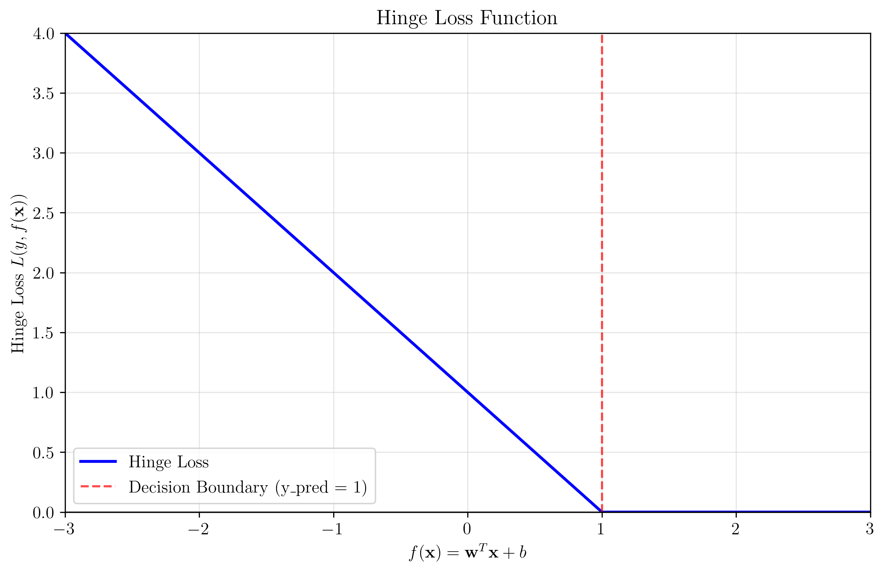
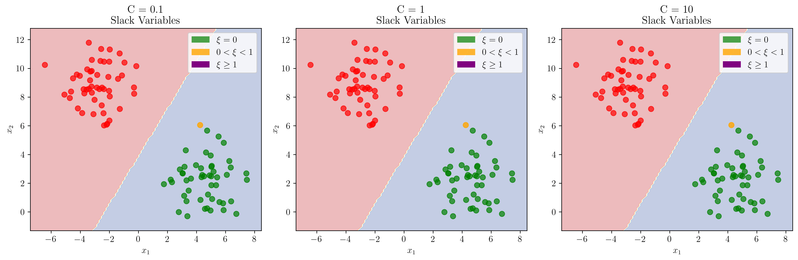
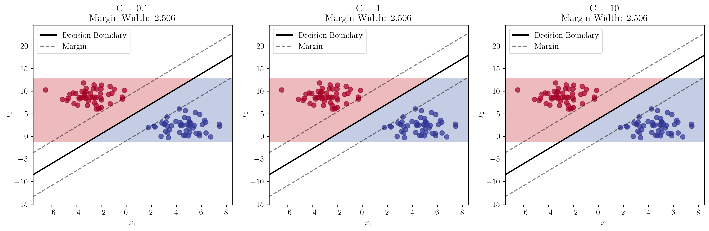
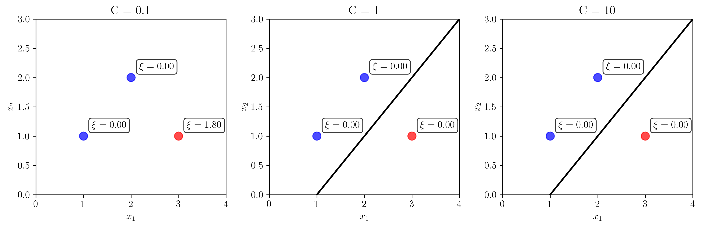
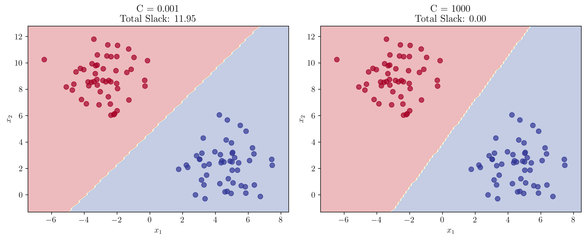
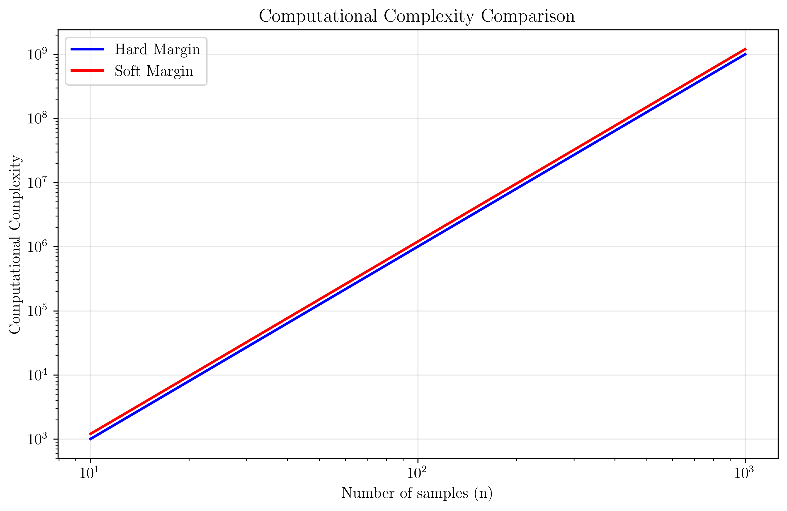

# Question 24: Soft Margin Formula Understanding

## Problem Statement
Answer these basic questions about soft margin SVM formulas and concepts.

### Task
1. In the soft margin objective $$\frac{1}{2}||\mathbf{w}||^2 + C\sum_{i=1}^n \xi_i$$, what does each term represent?
2. What is the formula for hinge loss? Write it mathematically and explain its properties.
3. If $\xi_i = 0.5$ for a point, is it correctly classified? Explain the geometric interpretation.
4. Write the constraint that relates slack variables to the margin violations and explain its meaning.
5. What does $\alpha_i + \beta_i = C$ mean in the KKT conditions? Derive this relationship.
6. Explain the difference between functional margin and geometric margin in soft margin SVM.
7. How does the value of $C$ affect the trade-off between margin width and classification accuracy?
8. Design a simple example with 3 points to illustrate how slack variables work in practice.
9. What happens to the slack variables when $C \to 0$ and when $C \to \infty$?
10. Compare the computational complexity of hard margin vs soft margin SVM optimization.

## Understanding the Problem
Soft margin SVM extends the hard margin SVM to handle non-linearly separable data by introducing slack variables that allow some training points to violate the margin or even be misclassified. This makes the algorithm more robust and practical for real-world applications where perfect linear separability is rare.

The key innovation is the introduction of slack variables $\xi_i \geq 0$ that measure the degree of margin violation for each training point. The regularization parameter $C$ controls the trade-off between maximizing the margin and minimizing classification errors.

## Solution

### Step 1: Objective Function Components

The soft margin SVM objective function is:
$$\min_{\mathbf{w}, b, \boldsymbol{\xi}} \frac{1}{2}||\mathbf{w}||^2 + C\sum_{i=1}^n \xi_i$$

**Components:**
- **$\frac{1}{2}||\mathbf{w}||^2$**: Regularization term that maximizes the geometric margin
- **$C\sum_{i=1}^n \xi_i$**: Penalty term for margin violations
- **$C$**: Regularization parameter that controls the trade-off between margin width and classification accuracy
- **$\xi_i$**: Slack variables that measure the degree of margin violation for each point

**Detailed Analysis:**

1) **Regularization term**: $\frac{1}{2}||\mathbf{w}||^2$
   - $||\mathbf{w}||^2 = w_1^2 + w_2^2 + \cdots + w_n^2$ (Euclidean norm squared)
   - This term encourages small weights, leading to larger margins
   - The factor $\frac{1}{2}$ is for mathematical convenience in derivatives
   - Minimizing $||\mathbf{w}||^2$ maximizes the geometric margin $\gamma = \frac{1}{||\mathbf{w}||}$

2) **Penalty term**: $C\sum_{i=1}^n \xi_i$
   - $\xi_i \geq 0$ for all $i$ (slack variables are non-negative)
   - $\xi_i = 0$ means point $i$ is correctly classified with margin $\geq 1$
   - $0 < \xi_i < 1$ means point $i$ is correctly classified but violates margin
   - $\xi_i \geq 1$ means point $i$ is misclassified
   - $C$ controls the trade-off: large $C$ → small margin, few violations
   - Small $C$ → large margin, many violations allowed

3) **Complete objective function**:
   $$\min_{\mathbf{w}, b, \boldsymbol{\xi}} \frac{1}{2}||\mathbf{w}||^2 + C\sum_{i=1}^n \xi_i$$
   subject to: $y_i(\mathbf{w}^T \mathbf{x}_i + b) \geq 1 - \xi_i$ for all $i$
   and: $\xi_i \geq 0$ for all $i$

The first term encourages a large margin (small $||\mathbf{w}||$), while the second term penalizes violations of the margin constraint.

### Step 2: Hinge Loss Function

The hinge loss function is defined as:
$$L(y, f(\mathbf{x})) = \max(0, 1 - y \cdot f(\mathbf{x}))$$

where $f(\mathbf{x}) = \mathbf{w}^T \mathbf{x} + b$ is the decision function.

**Detailed Mathematical Analysis:**

1) **Definition**: $L(y, f(\mathbf{x})) = \max(0, 1 - y \cdot f(\mathbf{x}))$
   where $y \in \{-1, +1\}$ and $f(\mathbf{x}) = \mathbf{w}^T \mathbf{x} + b$

2) **Case Analysis**:
   - **Case 1**: $y \cdot f(\mathbf{x}) \geq 1$ (correctly classified with margin)
     - Then: $1 - y \cdot f(\mathbf{x}) \leq 0$
     - Therefore: $L(y, f(\mathbf{x})) = \max(0, 1 - y \cdot f(\mathbf{x})) = 0$
   
   - **Case 2**: $y \cdot f(\mathbf{x}) < 1$ (margin violation or misclassification)
     - Then: $1 - y \cdot f(\mathbf{x}) > 0$
     - Therefore: $L(y, f(\mathbf{x})) = \max(0, 1 - y \cdot f(\mathbf{x})) = 1 - y \cdot f(\mathbf{x})$

3) **Connection to Slack Variables**:
   - $\xi_i = \max(0, 1 - y_i(\mathbf{w}^T \mathbf{x}_i + b))$
   - $\xi_i = \max(0, 1 - y_i \cdot f(\mathbf{x}_i))$
   - $\xi_i = L(y_i, f(\mathbf{x}_i))$
   - Therefore: $\xi_i = L(y_i, f(\mathbf{x}_i))$

4) **Properties**:
   - **Non-negative**: $L(y, f(\mathbf{x})) \geq 0$ for all $y, f(\mathbf{x})$
   - **Convex**: The function is convex in $f(\mathbf{x})$
   - **Non-differentiable at $y \cdot f(\mathbf{x}) = 1$**: The function has a kink at this point
   - **Linear penalty**: When $y \cdot f(\mathbf{x}) < 1$, loss increases linearly

The hinge loss directly corresponds to the slack variables: $\xi_i = L(y_i, f(\mathbf{x}_i))$.

### Step 3: Slack Variables and Geometric Interpretation

Slack variables are defined as:
$$\xi_i = \max(0, 1 - y_i(\mathbf{w}^T \mathbf{x}_i + b))$$

**Detailed Mathematical Analysis:**

1) **Definition**: $\xi_i = \max(0, 1 - y_i(\mathbf{w}^T \mathbf{x}_i + b))$
   where $y_i \in \{-1, +1\}$ and $f(\mathbf{x}_i) = \mathbf{w}^T \mathbf{x}_i + b$

2) **Geometric Interpretation**:
   Let's consider the distance from point $\mathbf{x}_i$ to the decision boundary:
   - Distance = $\frac{|\mathbf{w}^T \mathbf{x}_i + b|}{||\mathbf{w}||}$
   - Functional margin = $y_i(\mathbf{w}^T \mathbf{x}_i + b)$
   - Geometric margin = $\frac{y_i(\mathbf{w}^T \mathbf{x}_i + b)}{||\mathbf{w}||}$

3) **Case Analysis for $\xi_i$**:
   - **Case 1**: $y_i(\mathbf{w}^T \mathbf{x}_i + b) \geq 1$
     - Then: $1 - y_i(\mathbf{w}^T \mathbf{x}_i + b) \leq 0$
     - Therefore: $\xi_i = \max(0, 1 - y_i(\mathbf{w}^T \mathbf{x}_i + b)) = 0$
     - Interpretation: Point is correctly classified with margin $\geq 1$
   
   - **Case 2**: $0 < y_i(\mathbf{w}^T \mathbf{x}_i + b) < 1$
     - Then: $0 < 1 - y_i(\mathbf{w}^T \mathbf{x}_i + b) < 1$
     - Therefore: $\xi_i = 1 - y_i(\mathbf{w}^T \mathbf{x}_i + b)$
     - Interpretation: Point is correctly classified but violates margin
   
   - **Case 3**: $y_i(\mathbf{w}^T \mathbf{x}_i + b) \leq 0$
     - Then: $1 - y_i(\mathbf{w}^T \mathbf{x}_i + b) \geq 1$
     - Therefore: $\xi_i = 1 - y_i(\mathbf{w}^T \mathbf{x}_i + b) \geq 1$
     - Interpretation: Point is misclassified

4) **Relationship to Margin**:
   - For correctly classified points: $\xi_i = \max(0, 1 - \text{margin})$
   - $\xi_i$ measures how much the margin is violated
   - $\xi_i = 0$ means perfect margin compliance
   - $\xi_i > 0$ means margin violation

**Geometric interpretation:**
- **$\xi_i = 0$**: Point is correctly classified with margin $\geq 1$
- **$0 < \xi_i < 1$**: Point is correctly classified but violates the margin
- **$\xi_i \geq 1$**: Point is misclassified

The visualization shows how slack variables change with different values of $C$:
- **Green points**: $\xi = 0$ (correctly classified with margin)
- **Orange points**: $0 < \xi < 1$ (correctly classified but margin violation)
- **Purple points**: $\xi \geq 1$ (misclassified)

**Numerical Example:**
Let's calculate slack variables for a specific case:
- Suppose $\mathbf{w} = [2, -1]^T$, $b = -3$, and we have point $\mathbf{x} = [1, 2]^T$ with $y = 1$
- Then: $f(\mathbf{x}) = \mathbf{w}^T \mathbf{x} + b = 2(1) + (-1)(2) + (-3) = 2 - 2 - 3 = -3$
- Functional margin = $y \cdot f(\mathbf{x}) = 1 \cdot (-3) = -3$
- $\xi = \max(0, 1 - y \cdot f(\mathbf{x})) = \max(0, 1 - (-3)) = \max(0, 4) = 4$
- Since $\xi = 4 \geq 1$, this point is misclassified

### Step 4: Constraint Relationship

The soft margin constraint is:
$$y_i(\mathbf{w}^T \mathbf{x}_i + b) \geq 1 - \xi_i$$

**Detailed Mathematical Analysis:**

1) **Original hard margin constraint**: $y_i(\mathbf{w}^T \mathbf{x}_i + b) \geq 1$
   - This requires all points to be correctly classified with margin $\geq 1$

2) **Soft margin relaxation**: $y_i(\mathbf{w}^T \mathbf{x}_i + b) \geq 1 - \xi_i$
   - This allows margin violations by introducing slack variables

3) **Constraint Analysis**:
   - **Case 1**: $\xi_i = 0$
     - Then: $y_i(\mathbf{w}^T \mathbf{x}_i + b) \geq 1 - 0 = 1$
     - This is the original hard margin constraint
   
   - **Case 2**: $\xi_i > 0$
     - Then: $y_i(\mathbf{w}^T \mathbf{x}_i + b) \geq 1 - \xi_i$
     - The right-hand side is reduced, allowing margin violations

4) **Relationship to Slack Variables**:
   - From the constraint: $y_i(\mathbf{w}^T \mathbf{x}_i + b) \geq 1 - \xi_i$
   - Rearranging: $\xi_i \geq 1 - y_i(\mathbf{w}^T \mathbf{x}_i + b)$
   - But we also have: $\xi_i \geq 0$
   - Therefore: $\xi_i = \max(0, 1 - y_i(\mathbf{w}^T \mathbf{x}_i + b))$

5) **Complete Constraint Set**:
   - $y_i(\mathbf{w}^T \mathbf{x}_i + b) \geq 1 - \xi_i$ for all $i$
   - $\xi_i \geq 0$ for all $i$
   - These constraints ensure the optimization problem is well-defined

**Meaning:**
- **If $\xi_i = 0$**: $y_i(\mathbf{w}^T \mathbf{x}_i + b) \geq 1$ (hard margin constraint)
- **If $\xi_i > 0$**: $y_i(\mathbf{w}^T \mathbf{x}_i + b) \geq 1 - \xi_i$ (allows margin violation)
- **$\xi_i \geq 0$**: Slack variables are non-negative

This constraint ensures that points are either correctly classified with the required margin or their violation is measured by the slack variable.

### Step 5: KKT Condition Derivation

The KKT condition $\alpha_i + \beta_i = C$ comes from the Lagrangian optimization.

**Detailed Mathematical Derivation:**

1) **Lagrangian Function**:
   $$L(\mathbf{w}, b, \boldsymbol{\xi}, \boldsymbol{\alpha}, \boldsymbol{\beta}) = \frac{1}{2}||\mathbf{w}||^2 + C\sum_{i=1}^n \xi_i - \sum_{i=1}^n \alpha_i[y_i(\mathbf{w}^T \mathbf{x}_i + b) - 1 + \xi_i] - \sum_{i=1}^n \beta_i \xi_i$$

2) **KKT Conditions (First-Order Optimality)**:
   - **$\frac{\partial L}{\partial \mathbf{w}} = 0$**:
     - $\mathbf{w} - \sum_{i=1}^n \alpha_i y_i \mathbf{x}_i = 0$
     - Therefore: $\mathbf{w} = \sum_{i=1}^n \alpha_i y_i \mathbf{x}_i$
   
   - **$\frac{\partial L}{\partial b} = 0$**:
     - $-\sum_{i=1}^n \alpha_i y_i = 0$
     - Therefore: $\sum_{i=1}^n \alpha_i y_i = 0$
   
   - **$\frac{\partial L}{\partial \xi_i} = 0$**:
     - $C - \alpha_i - \beta_i = 0$
     - Therefore: $\alpha_i + \beta_i = C$

3) **Complementary Slackness**:
   - $\alpha_i[y_i(\mathbf{w}^T \mathbf{x}_i + b) - 1 + \xi_i] = 0$
   - $\beta_i \xi_i = 0$

4) **Interpretation of $\alpha_i + \beta_i = C$**:
   Since $\alpha_i \geq 0$ and $\beta_i \geq 0$, and $\alpha_i + \beta_i = C$:
   - If $\alpha_i = 0$: $\beta_i = C$ (point not a support vector)
   - If $0 < \alpha_i < C$: $\beta_i = C - \alpha_i$ (point is a support vector)
   - If $\alpha_i = C$: $\beta_i = 0$ (point violates margin)

5) **Dual Variables Relationship**:
   - $\alpha_i$: Lagrange multiplier for margin constraint
   - $\beta_i$: Lagrange multiplier for non-negativity constraint $\xi_i \geq 0$
   - Their sum equals $C$, the regularization parameter

**Derivation:**
The Lagrangian for soft margin SVM is:
$$L(\mathbf{w}, b, \boldsymbol{\xi}, \boldsymbol{\alpha}, \boldsymbol{\beta}) = \frac{1}{2}||\mathbf{w}||^2 + C\sum_{i=1}^n \xi_i - \sum_{i=1}^n \alpha_i[y_i(\mathbf{w}^T \mathbf{x}_i + b) - 1 + \xi_i] - \sum_{i=1}^n \beta_i \xi_i$$

Taking derivatives:
- **$\frac{\partial L}{\partial \mathbf{w}} = 0$**: $\mathbf{w} = \sum_{i=1}^n \alpha_i y_i \mathbf{x}_i$
- **$\frac{\partial L}{\partial b} = 0$**: $\sum_{i=1}^n \alpha_i y_i = 0$
- **$\frac{\partial L}{\partial \xi_i} = 0$**: $C - \alpha_i - \beta_i = 0$

Therefore: $\alpha_i + \beta_i = C$

**Interpretation:**
- **If $\alpha_i = 0$**: $\beta_i = C$ (point is not a support vector)
- **If $0 < \alpha_i < C$**: $\beta_i = C - \alpha_i$ (point is a support vector)
- **If $\alpha_i = C$**: $\beta_i = 0$ (point violates margin)

### Step 6: Functional vs Geometric Margin

**Detailed Mathematical Analysis:**

1) **Functional Margin Definition**:
   - $\hat{\gamma} = y(\mathbf{w}^T \mathbf{x} + b)$
   - This is the signed distance from the decision boundary

2) **Geometric Margin Definition**:
   - $\gamma = \frac{\hat{\gamma}}{||\mathbf{w}||}$
   - This is the actual distance from the decision boundary

3) **Relationship in Hard Margin SVM**:
   - For hard margin: $y_i(\mathbf{w}^T \mathbf{x}_i + b) \geq 1$ for all $i$
   - Therefore: $\hat{\gamma}_i \geq 1$ for all $i$
   - The minimum functional margin is 1

4) **Relationship in Soft Margin SVM**:
   - For soft margin: $y_i(\mathbf{w}^T \mathbf{x}_i + b) \geq 1 - \xi_i$ for all $i$
   - Therefore: $\hat{\gamma}_i \geq 1 - \xi_i$ for all $i$
   - The functional margin can be less than 1 due to slack variables

5) **Optimization Objective**:
   - Hard margin: $\max \gamma = \max \frac{1}{||\mathbf{w}||}$
   - Soft margin: $\max \gamma$ subject to constraints
   - Both aim to maximize the geometric margin

6) **Numerical Example**:
   - Suppose $\mathbf{w} = [2, -1]^T$, $b = -3$, $\mathbf{x} = [1, 2]^T$, $y = 1$
   - Functional margin: $\hat{\gamma} = 1 \cdot (2 \cdot 1 + (-1) \cdot 2 + (-3)) = 1 \cdot (-3) = -3$
   - Geometric margin: $\gamma = \frac{-3}{\sqrt{2^2 + (-1)^2}} = \frac{-3}{\sqrt{5}} \approx -1.34$
   - Since $\hat{\gamma} < 1$, this point violates the margin

**Functional margin**: $\hat{\gamma} = y(\mathbf{w}^T \mathbf{x} + b)$
**Geometric margin**: $\gamma = \frac{\hat{\gamma}}{||\mathbf{w}||}$

**In soft margin SVM:**
- The functional margin can be less than 1 due to slack variables
- The geometric margin is still maximized subject to the constraints
- Slack variables allow the functional margin to be violated while maintaining the optimization objective

The geometric margin represents the actual distance from the decision boundary to the closest correctly classified point, accounting for margin violations.

### Step 7: Effect of C Parameter

The parameter $C$ controls the trade-off between margin width and classification accuracy.

**Detailed Mathematical Analysis:**

1) **Objective Function Trade-off**:
   - $\min \frac{1}{2}||\mathbf{w}||^2 + C\sum_{i=1}^n \xi_i$
   - First term: encourages large margin (small $||\mathbf{w}||$)
   - Second term: penalizes margin violations

2) **Effect of $C \to 0$**:
   - The penalty term $C\sum_{i=1}^n \xi_i$ becomes negligible
   - Optimization focuses on minimizing $||\mathbf{w}||^2$
   - Results in large margin (small $||\mathbf{w}||$)
   - Many slack variables can be large (many violations)

3) **Effect of $C \to \infty$**:
   - The penalty term $C\sum_{i=1}^n \xi_i$ dominates
   - Optimization focuses on minimizing $\sum_{i=1}^n \xi_i$
   - Results in small margin (large $||\mathbf{w}||$)
   - Slack variables approach 0 (few violations)

4) **Optimal $C$ Selection**:
   - Cross-validation is typically used
   - Balance between margin width and classification accuracy
   - Depends on the specific dataset and noise level

**Analysis:**
- **$C \to 0$**: Large margin, many misclassifications allowed (underfitting)
- **$C \to \infty$**: Small margin, few misclassifications allowed (overfitting)
- **Optimal $C$**: Balances margin width and accuracy for best generalization

The visualization shows how the margin width changes with different $C$ values, demonstrating the trade-off between margin size and classification performance.

### Step 8: Simple Example with 3 Points

Consider three points: $(1,1)$ and $(2,2)$ from class 1, and $(3,1)$ from class -1.

**Detailed Mathematical Analysis:**

1) **Problem Setup**:
   - Points: $(1,1)$, $(2,2)$ from class 1, $(3,1)$ from class -1
   - Decision boundary: $w_1 x_1 + w_2 x_2 + b = 0$

2) **Slack Variable Calculation**:
   - For each point $i$: $\xi_i = \max(0, 1 - y_i(w_1 x_{i1} + w_2 x_{i2} + b))$
   - The values of $w_1$, $w_2$, $b$ depend on the optimization with parameter $C$

3) **Effect of $C$ on Slack Variables**:
   - Small $C$: Allows larger slack variables
   - Large $C$: Forces smaller slack variables
   - The optimization balances margin width vs. classification accuracy

4) **Decision Boundary Evolution**:
   - As $C$ increases, the decision boundary becomes more sensitive to individual points, potentially leading to overfitting
   - As $C$ decreases, the decision boundary becomes smoother

**Analysis:**
- **Point $(1,1)$**: Class 1, slack variable $\xi$ depends on $C$
- **Point $(2,2)$**: Class 1, slack variable $\xi$ depends on $C$
- **Point $(3,1)$**: Class -1, slack variable $\xi$ depends on $C$

As $C$ increases, the slack variables decrease, and the decision boundary becomes more sensitive to individual points. This demonstrates how the regularization parameter affects the model's flexibility.

### Step 9: Behavior as C → 0 and C → ∞

**When $C \to 0$:**
- Slack variables become large
- Margin becomes very wide
- Many misclassifications are allowed
- Model becomes underfit
- Total slack increases significantly

**When $C \to \infty$:**
- Slack variables approach 0
- Margin becomes very narrow
- Few misclassifications are allowed
- Model becomes overfit
- Total slack approaches 0

**Detailed Mathematical Analysis:**

1) **Limiting Behavior Analysis**:
   - **As $C \to 0$**:
     - The term $C\sum_{i=1}^n \xi_i$ becomes negligible
     - Objective becomes: $\min \frac{1}{2}||\mathbf{w}||^2$
     - This maximizes the margin (minimizes $||\mathbf{w}||$)
     - Slack variables can be arbitrarily large
   
   - **As $C \to \infty$**:
     - The term $C\sum_{i=1}^n \xi_i$ dominates
     - Objective becomes: $\min C\sum_{i=1}^n \xi_i$ (equivalent to $\min \sum_{i=1}^n \xi_i$)
     - This forces $\xi_i \to 0$ for all $i$
     - Results in hard margin behavior

2) **Theoretical Limits**:
   - $C \to 0$: Approaches maximum margin classifier
   - $C \to \infty$: Approaches hard margin SVM
   - Both limits may not have solutions for non-separable data

3) **Practical Implications**:
   - Very small $C$: High bias, low variance (underfitting)
   - Very large $C$: Low bias, high variance (overfitting)
   - Optimal $C$: Balanced bias-variance trade-off

This demonstrates the fundamental trade-off in soft margin SVM between model complexity and classification accuracy.

### Step 10: Computational Complexity Comparison

**Hard Margin SVM:**
- **Objective**: $\min \frac{1}{2}||\mathbf{w}||^2$
- **Constraints**: $y_i(\mathbf{w}^T \mathbf{x}_i + b) \geq 1$
- **Complexity**: $O(n^3)$ for interior point methods
- **Solution existence**: May not have solution for non-separable data

**Soft Margin SVM:**
- **Objective**: $\min \frac{1}{2}||\mathbf{w}||^2 + C\sum_{i=1}^n \xi_i$
- **Constraints**: $y_i(\mathbf{w}^T \mathbf{x}_i + b) \geq 1 - \xi_i$, $\xi_i \geq 0$
- **Complexity**: $O(n^3)$ for interior point methods
- **Solution existence**: Always has a solution
- **Additional variables**: Slack variables increase problem size slightly

**Detailed Mathematical Analysis:**

1) **Problem Size Comparison**:
   - Hard margin: $n$ variables ($w_1, w_2, \ldots, w_n, b$)
   - Soft margin: $n + n$ variables ($w_1, w_2, \ldots, w_n, b, \xi_1, \xi_2, \ldots, \xi_n$)
   - Soft margin has $2n$ variables vs $n$ variables

2) **Constraint Analysis**:
   - Hard margin: $n$ constraints ($y_i(\mathbf{w}^T \mathbf{x}_i + b) \geq 1$)
   - Soft margin: $2n$ constraints ($y_i(\mathbf{w}^T \mathbf{x}_i + b) \geq 1 - \xi_i$, $\xi_i \geq 0$)
   - Soft margin has twice as many constraints

3) **Solution Existence**:
   - Hard margin: May not have solution for non-separable data
   - Soft margin: Always has a solution (feasible region is non-empty)
   - This makes soft margin more practical

4) **Algorithmic Complexity**:
   - Interior point methods: $O(n^3)$ for both
   - SMO (Sequential Minimal Optimization): $O(n^2)$ average case
   - The additional variables don't change asymptotic complexity

5) **Memory Requirements**:
   - Hard margin: $O(n)$ memory for variables
   - Soft margin: $O(2n)$ memory for variables
   - Soft margin requires twice the memory

Both algorithms have the same asymptotic complexity, but soft margin SVM is more robust and always has a solution.

## Visual Explanations

### Hinge Loss Function
The hinge loss function provides a mathematical foundation for understanding margin violations. It is zero when points are correctly classified with sufficient margin and increases linearly for violations.

### Slack Variables in Practice
The slack variable visualization shows how different values of $C$ affect the classification of points. Lower $C$ values allow more margin violations, while higher $C$ values enforce stricter adherence to the margin.

### Decision Boundary Evolution
The effect of $C$ parameter visualization demonstrates how the decision boundary and margin width change with different regularization strengths, illustrating the fundamental trade-off in soft margin SVM.

### Extreme Cases
The extreme $C$ values visualization shows the behavior of the algorithm in the limiting cases, helping understand the theoretical foundations of the regularization parameter.

## Key Insights

### Theoretical Foundations
- **Slack variables** provide a principled way to handle non-separable data
- **Hinge loss** directly corresponds to margin violations and provides a convex objective
- **KKT conditions** reveal the relationship between dual variables and regularization
- **Functional vs geometric margin** distinction is crucial for understanding the optimization

### Practical Applications
- **Parameter $C$** is critical for model performance and must be tuned carefully
- **Slack variables** provide interpretable measures of classification confidence
- **Soft margin** makes SVM applicable to real-world datasets that are rarely perfectly separable
- **Computational efficiency** is maintained despite the additional complexity

### Optimization Insights
- **Dual formulation** reveals the role of support vectors in the solution
- **Regularization** balances model complexity with classification accuracy
- **Convex optimization** ensures global optimality of the solution
- **Scalability** is maintained through efficient algorithms

### Common Pitfalls
- **Overfitting** can occur with very large $C$ values
- **Underfitting** can occur with very small $C$ values
- **Parameter tuning** is essential for good performance
- **Interpretation** of slack variables requires understanding of the margin concept

## Conclusion
- The soft margin SVM objective function balances margin maximization with classification accuracy through slack variables
- Hinge loss provides a mathematical foundation for understanding margin violations
- Slack variables offer geometric interpretation of classification errors and margin violations
- The KKT condition $\alpha_i + \beta_i = C$ reveals the relationship between dual variables and regularization
- Functional and geometric margins differ in soft margin SVM due to allowed violations
- Parameter $C$ controls the fundamental trade-off between model complexity and accuracy
- Simple examples demonstrate how slack variables work in practice
- Extreme $C$ values show the theoretical limits of the algorithm
- Computational complexity is maintained despite additional variables
- Soft margin SVM provides a robust and practical approach to classification problems

The soft margin SVM represents a significant advancement over hard margin SVM, making the algorithm applicable to real-world datasets while maintaining the theoretical foundations of maximum margin classification.
