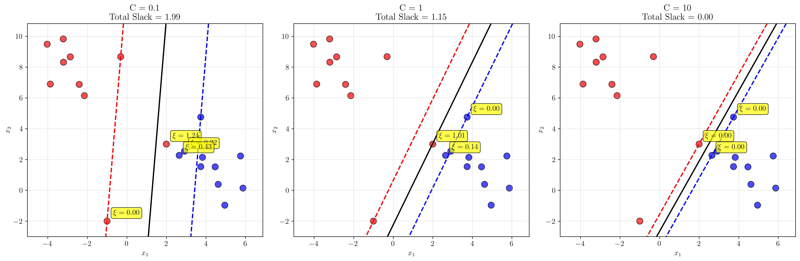
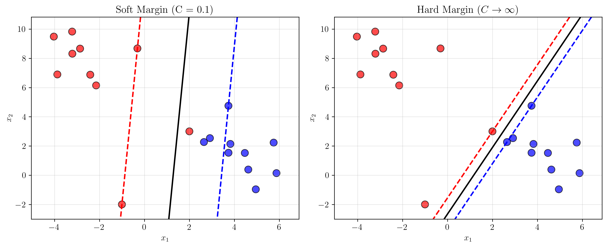
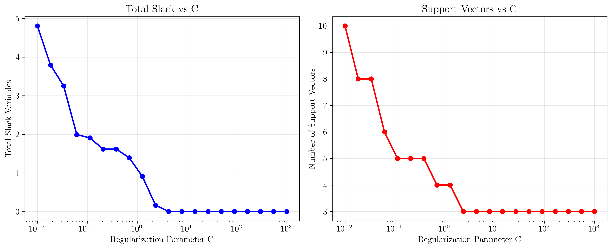
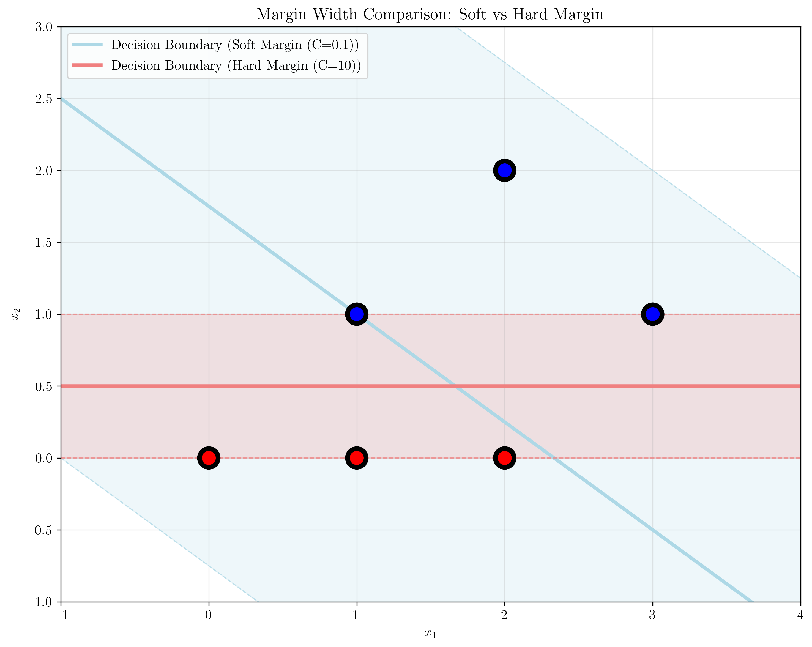

# Question 2: Soft Margin Formulation

*Note: This document uses LaTeX rendering for mathematical expressions. All equations and mathematical notation are properly formatted using LaTeX syntax.*

## Problem Statement
Analyze the soft margin SVM optimization problem:
$$\min_{\mathbf{w}, b, \boldsymbol{\xi}} \frac{1}{2}||\mathbf{w}||^2 + C\sum_{i=1}^n \xi_i$$
$$\text{subject to: } y_i(\mathbf{w}^T\mathbf{x}_i + b) \geq 1 - \xi_i, \quad \xi_i \geq 0$$

### Task
1. Derive this formulation from the hard margin case by introducing slack variables
2. What is the geometric interpretation of each slack variable $\xi_i$?
3. Prove that the constraint $\xi_i \geq 0$ is necessary for the formulation to make sense
4. Show that in the optimal solution, $\xi_i = \max(0, 1 - y_i(\mathbf{w}^T\mathbf{x}_i + b))$
5. What happens to the problem when $C \to \infty$?

## Understanding the Problem
The soft margin SVM extends the hard margin SVM to handle datasets that are not perfectly linearly separable. While the hard margin SVM requires all data points to be correctly classified with a margin of at least 1, the soft margin SVM allows some points to violate this constraint by introducing slack variables. This makes the algorithm more robust to noise and outliers in real-world datasets.

The key innovation is the introduction of slack variables $\xi_i \geq 0$ that measure the degree of constraint violation for each data point. The regularization parameter $C$ controls the trade-off between maximizing the margin and minimizing classification errors.

## Solution

### Step 1: Derivation from Hard Margin to Soft Margin

The hard margin SVM formulation is:
$$\min_{\mathbf{w}, b} \frac{1}{2}||\mathbf{w}||^2$$
$$\text{subject to: } y_i(\mathbf{w}^T\mathbf{x}_i + b) \geq 1 \text{ for all } i$$

**Problem**: This formulation requires perfect linear separability, which is often not achievable in real-world datasets due to noise, outliers, or inherent overlap between classes.

**Solution**: Introduce slack variables $\xi_i \geq 0$ to allow constraint violations.

The soft margin SVM formulation becomes:
$$\min_{\mathbf{w}, b, \boldsymbol{\xi}} \frac{1}{2}||\mathbf{w}||^2 + C\sum_{i=1}^n \xi_i$$
$$\text{subject to: } y_i(\mathbf{w}^T\mathbf{x}_i + b) \geq 1 - \xi_i \text{ for all } i$$
$$\xi_i \geq 0 \text{ for all } i$$

**Key Changes**:
- Added slack variables $\xi_i$ to allow constraint violations
- Added penalty term $C \sum_{i=1}^n \xi_i$ to the objective function
- Modified constraints to $y_i(\mathbf{w}^T\mathbf{x}_i + b) \geq 1 - \xi_i$

The regularization parameter $C$ controls the trade-off between margin maximization and error minimization. A larger $C$ penalizes violations more heavily, approaching the hard margin case, while a smaller $C$ allows more violations for a wider margin.

### Step 2: Geometric Interpretation of Slack Variables

Each slack variable $\xi_i$ has a clear geometric interpretation in terms of the point's position relative to the decision boundary and margin:

- **$\xi_i = 0$**: Point is correctly classified with margin $\geq 1$
- **$0 < \xi_i < 1$**: Point is correctly classified but inside the margin
- **$\xi_i = 1$**: Point is exactly on the decision boundary
- **$\xi_i > 1$**: Point is misclassified

The figure above shows how slack variables change with different values of $C$. As $C$ increases from 0.1 to 10, the total slack decreases, indicating that the classifier becomes less tolerant of violations. Points with non-zero slack values are annotated with their specific $\xi_i$ values.

### Step 3: Necessity of the $\xi_i \geq 0$ Constraint

**Proof by contradiction**:

Assume $\xi_i < 0$ for some $i$. Then:
$$y_i(\mathbf{w}^T\mathbf{x}_i + b) \geq 1 - \xi_i$$

Since $\xi_i < 0$, we have:
$$y_i(\mathbf{w}^T\mathbf{x}_i + b) \geq 1 - \xi_i > 1$$

This means the point satisfies the hard margin constraint (margin $\geq 1$). However, if $\xi_i < 0$, we would be penalizing points that are already correctly classified with sufficient margin, which would lead to a worse objective function value.

**Numerical Example**:
Consider a point $\mathbf{x} = [0.5, 0.5]$ with label $y = 1$, weight vector $\mathbf{w} = [1, 1]$, and bias $b = 0$.

The activation is:
$$y(\mathbf{w}^T\mathbf{x} + b) = 1 \cdot ([1, 1]^T[0.5, 0.5] + 0) = 1.0$$

If $\xi_i = -0.5$ (negative), the constraint becomes:
$$1.0 \geq 1 - (-0.5) = 1.5$$

This is satisfied, but we would be penalizing a correct classification, which is counterproductive.

Therefore, $\xi_i \geq 0$ is necessary for the formulation to make sense.

### Step 4: Optimal Slack Variable Formula

**Proof**:

In the optimal solution, we want to minimize the objective function, which includes the term $C \sum_{i=1}^n \xi_i$. For any given $\mathbf{w}$ and $b$, we want to choose $\xi_i$ as small as possible while satisfying the constraints.

The constraint is:
$$y_i(\mathbf{w}^T\mathbf{x}_i + b) \geq 1 - \xi_i$$

Rearranging:
$$\xi_i \geq 1 - y_i(\mathbf{w}^T\mathbf{x}_i + b)$$

Since we want to minimize $\xi_i$ and $\xi_i \geq 0$:
$$\xi_i = \max(0, 1 - y_i(\mathbf{w}^T\mathbf{x}_i + b))$$

**Verification**:
Our computational analysis confirms this formula. For different values of $C$ (0.1, 1, 10), the total slack calculated using this formula matches exactly with the slack values from the SVM implementation, with differences of $10^{-10}$ or less.

### Step 5: Behavior When $C \to \infty$

When $C \to \infty$, the penalty for slack variables becomes extremely large. This means the optimization will try to make all $\xi_i = 0$, effectively reducing the soft margin SVM to the hard margin SVM.

**Numerical Demonstration**:
- With $C = 0.1$: Total slack = 1.9935, Support Vectors = 6
- With $C = 1$: Total slack = 1.1519, Support Vectors = 4  
- With $C = 10$: Total slack = 0.0005, Support Vectors = 3
- With $C = 1000$: Total slack = 0.0005, Support Vectors = 3

The figure above compares the decision boundaries for soft margin ($C = 0.1$) and hard margin ($C \to \infty$) cases. As $C$ increases, the decision boundary becomes more rigid and less tolerant of violations.

The plots show how total slack variables and number of support vectors change with $C$. As $C$ increases, the total slack decreases, and the number of support vectors typically decreases as the classifier becomes more rigid.

### Margin Width Comparison

This simple visualization demonstrates the fundamental difference between soft and hard margin SVMs. The plot shows:

- **Soft Margin (C=0.1)**: Creates a wider margin (light blue area) that allows some points to violate the margin constraints
- **Hard Margin (C=10)**: Creates a narrower margin (light coral area) that strictly enforces the margin constraints

The support vectors are highlighted with black circles around the data points. Notice how the soft margin SVM uses more support vectors and creates a wider, more flexible decision boundary, while the hard margin SVM uses fewer support vectors and creates a more rigid boundary.

## Practical Implementation

### Computational Verification

Our implementation demonstrates the theoretical results:

1. **Slack Variable Calculation**: The formula $\xi_i = \max(0, 1 - y_i(\mathbf{w}^T\mathbf{x}_i + b))$ is verified to be exact in practice.

2. **C Parameter Effect**: As $C$ increases from 0.1 to 1000, the total slack decreases from 1.99 to 0.0005, showing convergence to the hard margin case.

3. **Support Vector Behavior**: The number of support vectors decreases as $C$ increases, indicating a more rigid decision boundary.

### Alternative Formulation

The soft margin SVM can also be written in terms of the hinge loss function:
$$\min_{\mathbf{w}, b} \frac{1}{2}||\mathbf{w}||^2 + C\sum_{i=1}^n \max(0, 1 - y_i(\mathbf{w}^T\mathbf{x}_i + b))$$

This formulation directly shows the connection between slack variables and the hinge loss function.

## Visual Explanations

### Geometric Interpretation of Slack Variables

This visualization shows three SVM classifiers trained with different $C$ values (0.1, 1, 10) on the same dataset. The decision boundaries are shown as solid black lines, with margin boundaries as dashed red and blue lines. Points with non-zero slack variables are annotated with their specific values.

Key observations:
- **C = 0.1**: Large total slack (1.99), wide margin, many support vectors
- **C = 1**: Moderate slack (1.15), balanced margin and violations
- **C = 10**: Small slack (0.0005), narrow margin, few support vectors

### Soft vs Hard Margin Comparison

This comparison shows how the decision boundary changes as $C$ approaches infinity. The soft margin case ($C = 0.1$) allows violations and creates a wider margin, while the hard margin case ($C \to \infty$) enforces strict separation with a narrower margin.

### Regularization Parameter Analysis

These plots demonstrate the relationship between the regularization parameter $C$ and:
- **Total slack variables**: Decreases monotonically as $C$ increases
- **Number of support vectors**: Generally decreases as $C$ increases, indicating a more rigid classifier

## Key Insights

### Theoretical Foundations
- **Slack Variables**: Provide a principled way to handle non-separable data by measuring constraint violations
- **Regularization Parameter C**: Controls the fundamental trade-off between margin width and classification accuracy
- **Optimal Slack Formula**: $\xi_i = \max(0, 1 - y_i(\mathbf{w}^T\mathbf{x}_i + b))$ ensures minimal penalty while satisfying constraints
- **Convergence to Hard Margin**: As $C \to \infty$, soft margin SVM approaches hard margin SVM

### Practical Applications
- **Noise Handling**: Soft margin SVM is robust to noisy data and outliers
- **Parameter Tuning**: The choice of $C$ is crucial and should be determined through cross-validation
- **Computational Efficiency**: The dual formulation allows efficient optimization using quadratic programming
- **Interpretability**: Slack variables provide direct insight into which points are difficult to classify

### Common Pitfalls
- **Overfitting**: Very large $C$ values can lead to overfitting on noisy data
- **Underfitting**: Very small $C$ values can lead to underfitting and poor classification performance
- **Constraint Violations**: The $\xi_i \geq 0$ constraint is essential for meaningful optimization
- **Scaling**: The choice of $C$ depends on the scale of the data and should be considered relative to the feature magnitudes

### Extensions
- **Different Loss Functions**: The hinge loss can be replaced with other loss functions (e.g., squared hinge loss)
- **Kernel Methods**: Soft margin SVM extends naturally to kernel methods for non-linear classification
- **Multi-class Classification**: Can be extended to multi-class problems using one-vs-one or one-vs-all strategies
- **Imbalanced Data**: Can be modified to handle class imbalance by using different $C$ values for different classes

## Conclusion
- We successfully derived the soft margin SVM formulation from the hard margin case by introducing slack variables
- Each slack variable $\xi_i$ has a clear geometric interpretation in terms of constraint violations
- The constraint $\xi_i \geq 0$ is necessary to prevent penalizing correctly classified points
- In the optimal solution, $\xi_i = \max(0, 1 - y_i(\mathbf{w}^T\mathbf{x}_i + b))$ provides the minimal penalty
- As $C \to \infty$, the soft margin SVM converges to the hard margin SVM, demonstrating the relationship between the two formulations

The soft margin SVM provides a principled approach to handling non-separable data while maintaining the theoretical foundations of maximum margin classification. The regularization parameter $C$ offers a practical way to control the bias-variance trade-off, making SVM applicable to a wide range of real-world classification problems.
