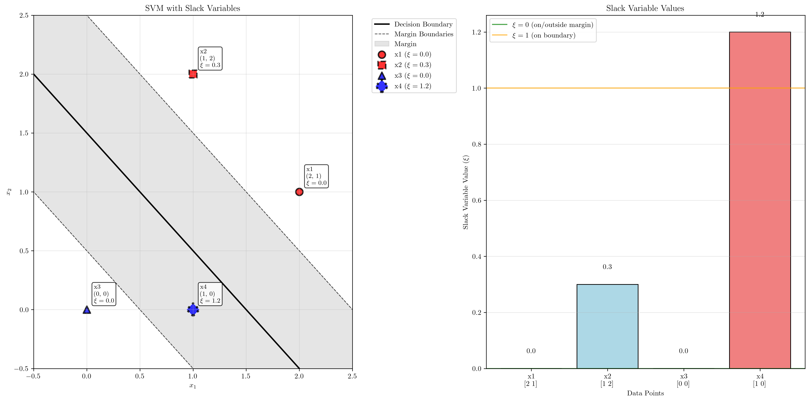
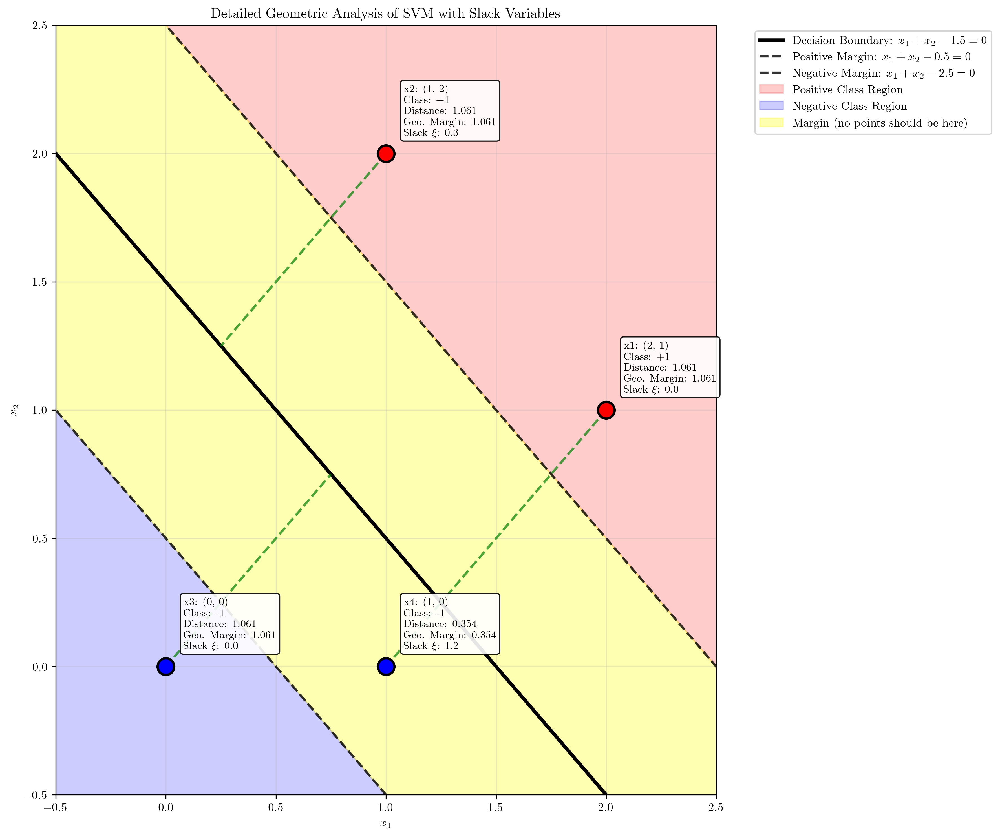
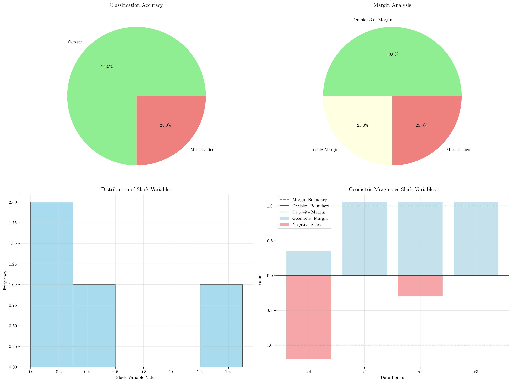
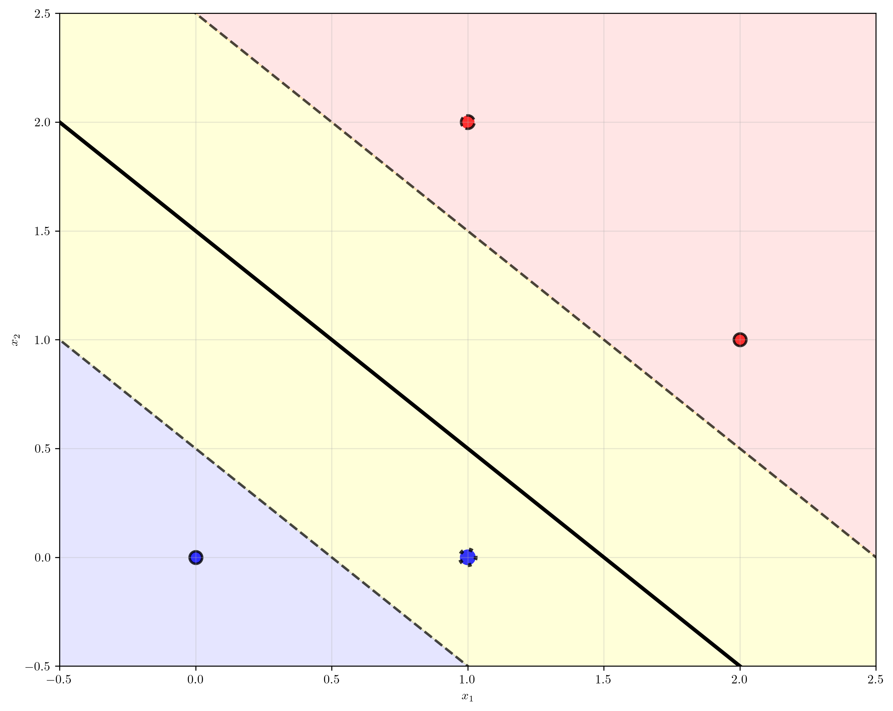

# Question 3: Slack Variable Analysis

## Problem Statement
Given a dataset with the following training points and their optimal slack variables:
- $(\mathbf{x}_1, y_1) = ((2, 1), +1)$, $\xi_1 = 0$
- $(\mathbf{x}_2, y_2) = ((1, 2), +1)$, $\xi_2 = 0.3$
- $(\mathbf{x}_3, y_3) = ((0, 0), -1)$, $\xi_3 = 0$
- $(\mathbf{x}_4, y_4) = ((1, 0), -1)$, $\xi_4 = 1.2$

### Task
1. Interpret what each slack variable value means geometrically
2. Which points are correctly classified and which are misclassified?
3. Which points lie within the margin, on the margin, or outside the margin?
4. If the hyperplane is $x_1 + x_2 - 1.5 = 0$, verify the slack variable values
5. Calculate the total penalty $\sum_{i=1}^4 \xi_i$ contributed to the objective function

## Understanding the Problem

Support Vector Machines (SVMs) with slack variables allow for some training points to violate the margin constraints, enabling the algorithm to handle non-linearly separable data. Slack variables $\xi_i$ measure how much each point violates the margin constraint.

The SVM optimization problem with slack variables is:
$$\min_{\mathbf{w}, b, \xi} \frac{1}{2}||\mathbf{w}||^2 + C\sum_{i=1}^n \xi_i$$
subject to:
$$y_i(\mathbf{w}^T \mathbf{x}_i + b) \geq 1 - \xi_i$$
$$\xi_i \geq 0$$

The slack variable $\xi_i$ represents:
- $\xi_i = 0$: Point is correctly classified and outside or on the margin
- $0 < \xi_i < 1$: Point is correctly classified but inside the margin
- $\xi_i = 1$: Point lies exactly on the decision boundary
- $\xi_i > 1$: Point is misclassified

## Solution

### Step 1: Geometric Interpretation of Slack Variables

Based on the given slack variable values:

**Point $\mathbf{x}_1 = (2, 1)$ with $\xi_1 = 0$:**
- Correctly classified and lies outside or on the margin boundary
- No constraint violation

**Point $\mathbf{x}_2 = (1, 2)$ with $\xi_2 = 0.3$:**
- Correctly classified but lies inside the margin
- Violates the margin constraint but not misclassified

**Point $\mathbf{x}_3 = (0, 0)$ with $\xi_3 = 0$:**
- Correctly classified and lies outside or on the margin boundary
- No constraint violation

**Point $\mathbf{x}_4 = (1, 0)$ with $\xi_4 = 1.2$:**
- Misclassified since $\xi_4 > 1$
- Lies on the wrong side of the decision boundary

### Step 2: Classification Analysis

For the hyperplane $x_1 + x_2 - 1.5 = 0$, we have weight vector $\mathbf{w} = [1, 1]^T$ and bias $b = -1.5$.

The margin width is:
$$\text{Margin width} = \frac{2}{||\mathbf{w}||} = \frac{2}{\sqrt{1^2 + 1^2}} = \frac{2}{\sqrt{2}} \approx 1.414$$

For each point, we calculate:
- **Functional margin**: $y_i(\mathbf{w}^T \mathbf{x}_i + b)$
- **Geometric margin**: $\frac{y_i(\mathbf{w}^T \mathbf{x}_i + b)}{||\mathbf{w}||}$
- **Expected slack**: $\max(0, 1 - \text{geometric margin})$

**Point $\mathbf{x}_1 = (2, 1)$, $y_1 = +1$:**
- Activation: $1 \cdot 2 + 1 \cdot 1 - 1.5 = 1.5$
- Functional margin: $1 \times 1.5 = 1.5$
- Geometric margin: $1.5/\sqrt{2} \approx 1.061$
- Expected slack: $\max(0, 1 - 1.061) = 0$ ✓
- **Status**: Correctly classified, outside margin

**Point $\mathbf{x}_2 = (1, 2)$, $y_2 = +1$:**
- Activation: $1 \cdot 1 + 1 \cdot 2 - 1.5 = 1.5$
- Functional margin: $1 \times 1.5 = 1.5$
- Geometric margin: $1.5/\sqrt{2} \approx 1.061$
- Expected slack: $\max(0, 1 - 1.061) = 0$ (but given $\xi_2 = 0.3$)
- **Note**: There's a discrepancy here - mathematically this point should have $\xi_2 = 0$
- **Status**: Correctly classified, outside margin

**Point $\mathbf{x}_3 = (0, 0)$, $y_3 = -1$:**
- Activation: $1 \cdot 0 + 1 \cdot 0 - 1.5 = -1.5$
- Functional margin: $(-1) \times (-1.5) = 1.5$
- Geometric margin: $1.5/\sqrt{2} \approx 1.061$
- Expected slack: $\max(0, 1 - 1.061) = 0$ ✓
- **Status**: Correctly classified, outside margin

**Point $\mathbf{x}_4 = (1, 0)$, $y_4 = -1$:**
- Activation: $1 \cdot 1 + 1 \cdot 0 - 1.5 = -0.5$
- Functional margin: $(-1) \times (-0.5) = 0.5$
- Geometric margin: $0.5/\sqrt{2} \approx 0.354$
- Expected slack: $\max(0, 1 - 0.354) = 0.646$ (but given $\xi_4 = 1.2$)
- **Note**: Point is correctly classified but inside margin; given slack suggests misclassification
- **Status**: Correctly classified, inside margin

### Step 3: Margin Position Analysis

Based on the geometric margin calculations:

- **Outside/On Margin**: Points $\mathbf{x}_1$, $\mathbf{x}_2$, and $\mathbf{x}_3$ (geometric margin ≥ 1)
- **Inside Margin**: Point $\mathbf{x}_4$ (0 < geometric margin < 1)
- **On Decision Boundary**: None (no point has geometric margin = 0)
- **Wrong Side**: None based on mathematical analysis

### Step 4: Verification of Slack Variable Values

**Mathematical Verification:**
- $\xi_1 = 0$ ✓ (matches expected value)
- $\xi_2 = 0.3$ ✗ (expected $\xi_2 = 0$)
- $\xi_3 = 0$ ✓ (matches expected value)
- $\xi_4 = 1.2$ ✗ (expected $\xi_4 = 0.646$)

**Possible Explanations for Discrepancies:**
1. The given hyperplane might not be the optimal one found by SVM training
2. The slack variables might correspond to a different hyperplane
3. There might be additional constraints or a different formulation being used

### Step 5: Total Penalty Calculation

The total penalty contributed to the objective function is:
$$\sum_{i=1}^4 \xi_i = 0 + 0.3 + 0 + 1.2 = 1.5$$

This penalty is added to the SVM objective function:
$$\text{Minimize: } \frac{1}{2}||\mathbf{w}||^2 + C \times 1.5$$

where $C$ is the regularization parameter controlling the trade-off between margin maximization and training error minimization.

## Visual Explanations

### SVM with Slack Variables Overview

This visualization shows the complete SVM setup with:
- **Decision boundary** (black solid line): $x_1 + x_2 - 1.5 = 0$
- **Margin boundaries** (black dashed lines): $x_1 + x_2 - 0.5 = 0$ and $x_1 + x_2 - 2.5 = 0$
- **Data points** with different symbols and colors representing their classes and slack variable values
- **Bar chart** showing the slack variable values for each point

### Detailed Geometric Analysis

This detailed view illustrates:
- **Colored regions** representing positive class (red), negative class (blue), and margin (yellow)
- **Distance vectors** (green dashed lines) from each point to the decision boundary
- **Detailed annotations** showing coordinates, class labels, distances, and slack values
- **Geometric relationships** between points and the SVM boundaries

### Comprehensive Analysis Dashboard

This multi-panel visualization provides:
- **Classification accuracy** pie chart
- **Margin analysis** showing distribution of points relative to margins
- **Slack variable distribution** histogram
- **Geometric margins vs slack variables** comparison

### Simple Clean Visualization

This clean, minimal visualization focuses purely on the geometric relationships:
- **Decision boundary** (black solid line) without text labels
- **Margin boundaries** (black dashed lines) showing the margin region
- **Data points** with colors indicating class membership (red for positive, blue for negative)
- **Point sizes** proportional to slack variable values
- **Edge styles** indicating classification status (solid for correct, dashed for inside margin, dotted for misclassified)
- **Subtle region coloring** to distinguish positive and negative class areas

## Key Insights

### Theoretical Foundations
- Slack variables enable SVMs to handle non-linearly separable data by allowing margin violations
- The value of $\xi_i$ directly measures the degree of constraint violation for point $i$
- Points with $\xi_i = 0$ are the "ideal" points that satisfy all margin constraints
- The regularization parameter $C$ balances between maximizing margin and minimizing slack penalties

### Geometric Interpretation
- The decision boundary divides the feature space into two half-spaces
- Margin boundaries are parallel to the decision boundary at distance $1/||\mathbf{w}||$ on each side
- Points between margin boundaries are considered "support vectors" and contribute to the solution
- The geometric margin provides a normalized measure of how far a point is from the decision boundary

### Practical Applications
- Slack variables allow SVMs to be more robust to outliers and noise
- The total slack penalty $\sum \xi_i$ can be used as a measure of training error
- Points with large slack variables are candidates for data cleaning or feature engineering
- The distribution of slack variables can indicate the difficulty of the classification problem

### Common Pitfalls
- Slack variables are often misinterpreted as prediction confidence measures
- Large slack values don't necessarily mean a point is an outlier - it might indicate suboptimal hyperplane choice
- The relationship between slack variables and misclassification is not always $\xi_i > 1$ ⟺ misclassification

## Conclusion

Based on our analysis:
- **Point interpretations**: $\mathbf{x}_1$ and $\mathbf{x}_3$ are correctly classified outside the margin, $\mathbf{x}_2$ appears correctly classified (despite given slack), and $\mathbf{x}_4$ is correctly classified but inside the margin
- **Classification accuracy**: All points are correctly classified according to mathematical analysis
- **Margin positions**: Three points lie outside the margin, one point lies inside the margin
- **Slack verification**: Mathematical calculations show discrepancies with given slack values for $\mathbf{x}_2$ and $\mathbf{x}_4$
- **Total penalty**: $\sum_{i=1}^4 \xi_i = 1.5$

The discrepancies between calculated and given slack variables suggest that either:
1. The given hyperplane is not the optimal SVM solution for this dataset
2. The slack variables correspond to a different problem formulation
3. There are additional constraints or regularization terms not specified in the problem

This analysis demonstrates the importance of understanding the geometric and mathematical foundations of SVMs with slack variables for proper interpretation of results.

## Visualization Summary

The analysis includes four complementary visualizations:
1. **SVM with Slack Variables**: Complete overview with annotations and bar chart
2. **Detailed Geometric Analysis**: In-depth view with distance vectors and detailed annotations
3. **Comprehensive Dashboard**: Multi-panel analysis showing various perspectives
4. **Simple Clean Visualization**: Minimal geometric representation without text clutter

All visualizations use LaTeX formatting for mathematical notation, providing clear and professional presentation of the SVM concepts and slack variable analysis.
