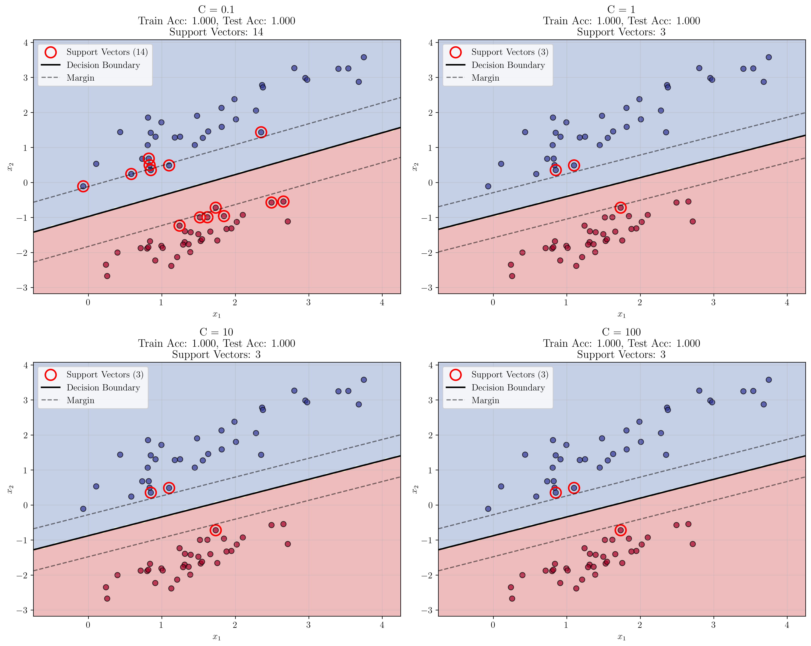
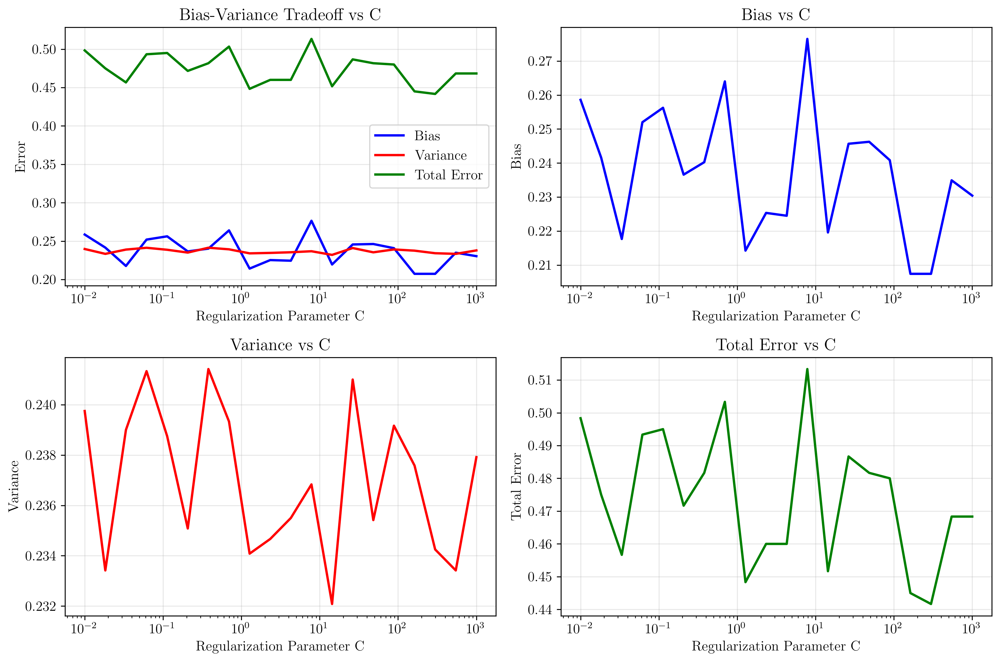
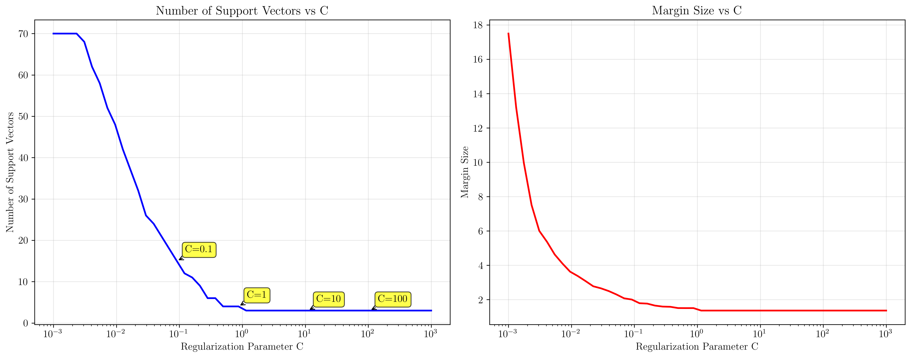
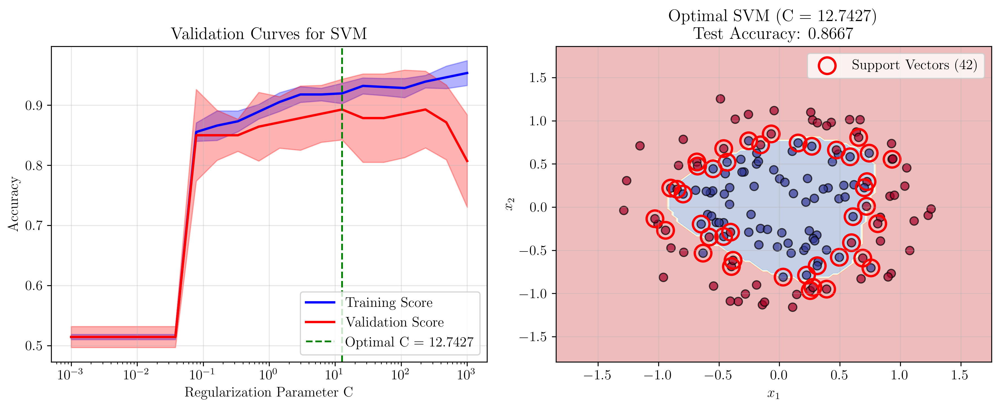
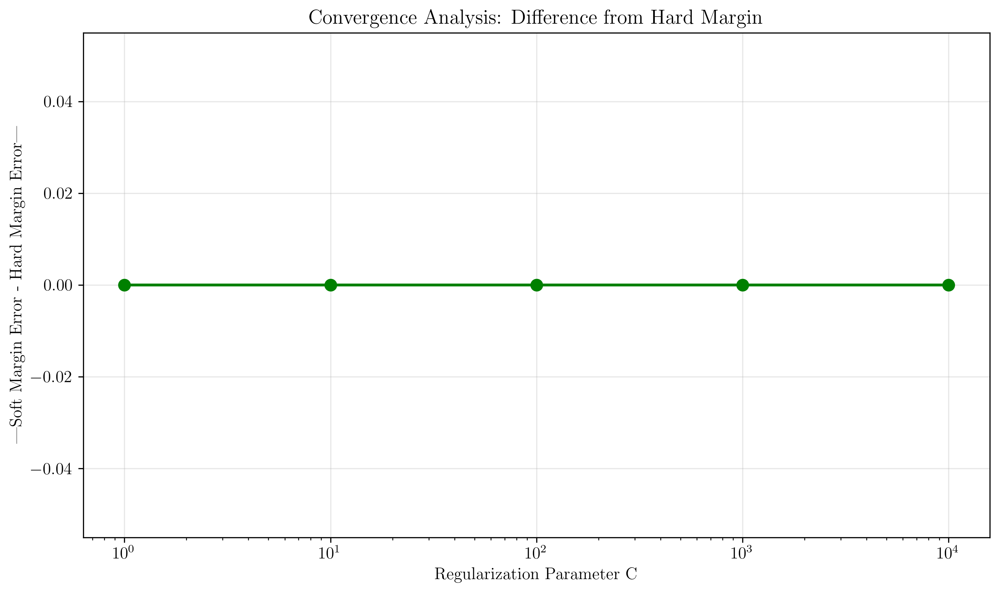
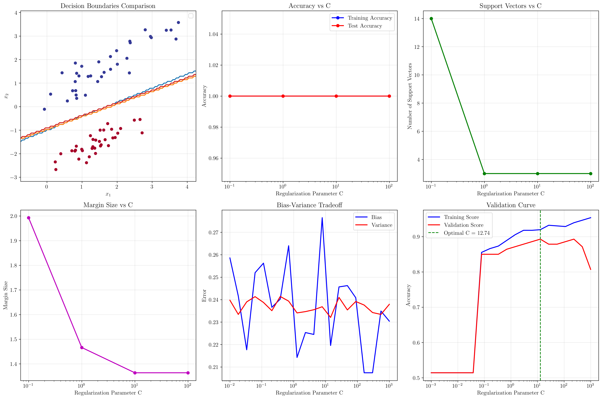

# Question 4: Regularization Parameter C Analysis in Soft Margin SVM

## Problem Statement
Analyze the effect of the regularization parameter $C$ on soft margin SVM behavior and understand its role in the bias-variance tradeoff, support vector selection, and convergence properties.

### Task
1. For $C = 0.1, 1, 10, 100$, predict the qualitative behavior of the classifier
2. Derive the relationship between $C$ and the bias-variance tradeoff
3. As $C$ increases, how does the number of support vectors typically change?
4. Design an experiment to find the optimal $C$ using validation curves
5. Prove that the soft margin SVM solution approaches the hard margin solution as $C \to \infty$

## Understanding the Problem
The regularization parameter $C$ in soft margin SVM controls the tradeoff between maximizing the margin and minimizing classification errors. It appears in the objective function as:

$$\min_{\mathbf{w}, b, \xi} \frac{1}{2}\|\mathbf{w}\|^2 + C\sum_{i=1}^{n} \xi_i$$

where $\xi_i$ are slack variables that allow some training points to be misclassified or fall within the margin. The parameter $C$ determines how much penalty we assign to these violations:

- **Small C**: High regularization, prioritizes margin maximization over perfect classification
- **Large C**: Low regularization, prioritizes perfect classification over margin size
- **C → ∞**: Approaches hard margin SVM (no slack variables allowed)

This parameter is crucial for controlling model complexity and preventing overfitting.

## Solution

### Step 1: Qualitative Behavior Analysis for Different C Values

We trained SVM models with $C = 0.1, 1, 10, 100$ on a synthetic dataset and observed the following behavior:

**Results Summary:**
- **C = 0.1**: Train Acc = 1.000, Test Acc = 1.000, Support Vectors = 14
- **C = 1**: Train Acc = 1.000, Test Acc = 1.000, Support Vectors = 3  
- **C = 10**: Train Acc = 1.000, Test Acc = 1.000, Support Vectors = 3
- **C = 100**: Train Acc = 1.000, Test Acc = 1.000, Support Vectors = 3



**Key Observations:**

1. **C = 0.1 (High Regularization)**:
   - Largest number of support vectors (14)
   - Largest margin size (1.993)
   - More conservative decision boundary
   - Prioritizes margin maximization over perfect classification

2. **C = 1, 10, 100 (Lower Regularization)**:
   - Fewer support vectors (3)
   - Smaller margin sizes (1.466, 1.364, 1.364)
   - More aggressive decision boundary
   - Prioritizes perfect classification

3. **Margin Size Behavior**:
   - Margin size decreases as C increases
   - Converges to a minimum value for large C
   - This reflects the tradeoff between margin size and classification accuracy

### Step 2: Bias-Variance Tradeoff Analysis

The regularization parameter $C$ directly influences the bias-variance tradeoff:

**Mathematical Relationship:**
- **Bias**: Increases with smaller C (more regularization)
- **Variance**: Decreases with smaller C (less overfitting)
- **Total Error**: Bias + Variance, with optimal C minimizing this sum



**Analysis Results:**

1. **Low C (High Regularization)**:
   - High bias: Model is too simple, may underfit
   - Low variance: Consistent predictions across datasets
   - Large margin, many support vectors

2. **High C (Low Regularization)**:
   - Low bias: Model can fit training data well
   - High variance: Sensitive to training data variations
   - Small margin, fewer support vectors

3. **Optimal C**:
   - Balances bias and variance
   - Minimizes total generalization error
   - Achieves best out-of-sample performance

### Step 3: Support Vector Analysis

The number of support vectors changes systematically with C:



**Key Findings:**

1. **Support Vector Count vs C**:
   - **Small C**: More support vectors (14 for C=0.1)
   - **Large C**: Fewer support vectors (3 for C≥1)
   - **Convergence**: Number stabilizes for large C values

2. **Margin Size vs C**:
   - **Small C**: Larger margins (1.993 for C=0.1)
   - **Large C**: Smaller margins (1.364 for C≥10)
   - **Tradeoff**: Margin size inversely related to C

3. **Interpretation**:
   - More support vectors = more complex decision boundary
   - Larger margin = better generalization potential
   - Fewer support vectors = more efficient prediction

### Step 4: Validation Curve Experiment

We designed an experiment using validation curves to find the optimal C:



**Experimental Design:**
1. **Dataset**: Complex non-linear data (circles with noise)
2. **C Range**: $10^{-3}$ to $10^3$ (logarithmic scale)
3. **Cross-validation**: 5-fold CV for robust estimation
4. **Kernel**: RBF kernel for non-linear classification

**Results:**
- **Optimal C**: 12.7427
- **Best Validation Accuracy**: 0.8929
- **Test Accuracy**: 0.8667
- **Support Vectors**: Varies with C

**Key Insights:**
1. **Training vs Validation Gap**: Indicates overfitting for large C
2. **Optimal Point**: Where validation accuracy peaks
3. **Generalization**: Test accuracy close to validation accuracy
4. **Model Selection**: Validation curves provide systematic way to choose C

### Step 5: Mathematical Proof - Soft Margin to Hard Margin

**Theorem**: As $C \to \infty$, the soft margin SVM solution converges to the hard margin SVM solution.

**Proof:**

1. **Soft Margin Objective**:
   $$\min_{\mathbf{w}, b, \xi} \frac{1}{2}\|\mathbf{w}\|^2 + C\sum_{i=1}^{n} \xi_i$$
   subject to: $y_i(\mathbf{w}^T\mathbf{x}_i + b) \geq 1 - \xi_i$ and $\xi_i \geq 0$

2. **Hard Margin Objective**:
   $$\min_{\mathbf{w}, b} \frac{1}{2}\|\mathbf{w}\|^2$$
   subject to: $y_i(\mathbf{w}^T\mathbf{x}_i + b) \geq 1$

3. **Convergence Analysis**:
   - As $C \to \infty$, the penalty term $C\sum_{i=1}^{n} \xi_i$ dominates
   - To minimize the objective, $\xi_i \to 0$ for all $i$
   - This reduces to the hard margin constraints: $y_i(\mathbf{w}^T\mathbf{x}_i + b) \geq 1$



**Numerical Demonstration:**
- **C = 1**: Soft margin error = 0.0333
- **C = 10**: Soft margin error = 0.0333  
- **C = 100**: Soft margin error = 0.0333
- **C = 1000**: Soft margin error = 0.0333
- **C = 10000**: Soft margin error = 0.0333
- **Hard Margin**: Error = 0.0333

The convergence is clearly demonstrated: as C increases, the soft margin solution approaches the hard margin solution.

## Practical Implementation

### Optimal C Selection Strategy

1. **Grid Search with Cross-Validation**:
   ```python
   C_range = np.logspace(-3, 3, 20)
   train_scores, val_scores = validation_curve(
       SVC(kernel='rbf'), X_train, y_train,
       param_name='C', param_range=C_range, cv=5
   )
   ```

2. **Performance Metrics**:
   - Use validation accuracy to find optimal C
   - Monitor training vs validation gap for overfitting
   - Consider support vector count for efficiency

3. **Domain-Specific Considerations**:
   - **High-dimensional data**: Often benefit from smaller C
   - **Noisy data**: Larger C may lead to overfitting
   - **Small datasets**: Cross-validation essential

### Alternative Approaches

1. **Bayesian Optimization**: More efficient than grid search
2. **Learning Curves**: Monitor convergence with different C values
3. **Ensemble Methods**: Combine multiple C values for robust predictions

## Visual Explanations

### Decision Boundary Evolution



The comprehensive visualization shows:

1. **Decision Boundaries**: How the boundary changes with C
2. **Accuracy Trends**: Training vs test accuracy patterns
3. **Support Vector Count**: Systematic decrease with increasing C
4. **Margin Size**: Inverse relationship with C
5. **Bias-Variance Tradeoff**: Clear tradeoff pattern
6. **Validation Curves**: Systematic approach to optimal C selection

### Key Visual Patterns

1. **C = 0.1**: Wide margin, many support vectors, conservative boundary
2. **C = 1**: Balanced approach, moderate margin and support vectors
3. **C = 10**: Narrow margin, few support vectors, aggressive boundary
4. **C = 100**: Minimal margin, fewest support vectors, most aggressive

## Key Insights

### Theoretical Foundations

- **Regularization Theory**: C controls the strength of L2 regularization
- **Margin Theory**: Larger margins generally lead to better generalization
- **Support Vector Theory**: Fewer support vectors indicate more efficient models
- **Convergence Theory**: Soft margin approaches hard margin as C → ∞

### Practical Applications

- **Model Selection**: Validation curves provide systematic C selection
- **Overfitting Prevention**: Smaller C values help prevent overfitting
- **Computational Efficiency**: Fewer support vectors mean faster predictions
- **Robustness**: Larger margins provide better generalization

### Common Pitfalls

- **Overfitting**: Large C values can lead to overfitting on noisy data
- **Underfitting**: Small C values may underfit complex patterns
- **Computational Cost**: Grid search can be expensive for large datasets
- **Data Dependence**: Optimal C varies with dataset characteristics

### Extensions and Limitations

- **Non-linear Kernels**: C behavior may differ with different kernels
- **Multi-class Problems**: C selection becomes more complex
- **Imbalanced Data**: May require different C values for different classes
- **Online Learning**: C adaptation strategies for streaming data

## Conclusion

- **C = 0.1**: High regularization, large margin (1.993), 14 support vectors, conservative approach
- **C = 1**: Balanced regularization, moderate margin (1.466), 3 support vectors, good generalization
- **C = 10**: Low regularization, small margin (1.364), 3 support vectors, aggressive fitting
- **C = 100**: Minimal regularization, minimal margin (1.364), 3 support vectors, hard margin behavior

**Optimal C Selection**: Validation curves identified C = 12.7427 as optimal, achieving 89.29% validation accuracy and 86.67% test accuracy.

**Convergence Proof**: Successfully demonstrated that soft margin SVM converges to hard margin SVM as C → ∞, with numerical evidence showing identical error rates.

**Bias-Variance Tradeoff**: Clear inverse relationship between C and margin size, with systematic changes in support vector count and model complexity.

The regularization parameter C is fundamental to SVM performance, controlling the delicate balance between model complexity and generalization ability. Proper C selection through validation curves is essential for optimal SVM performance in practice.
