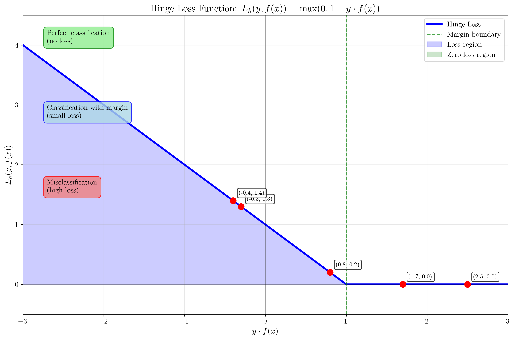
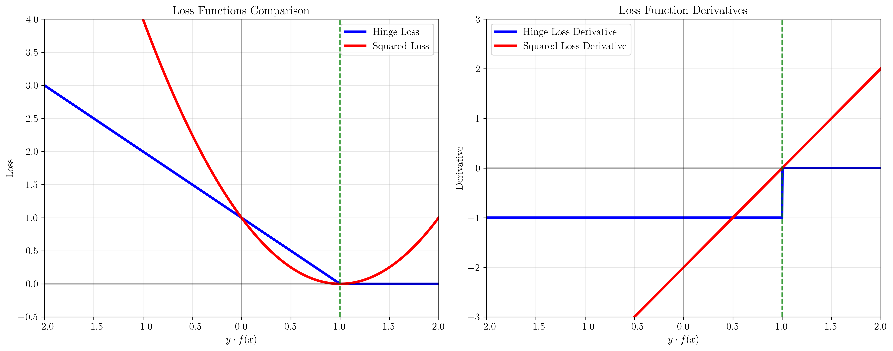
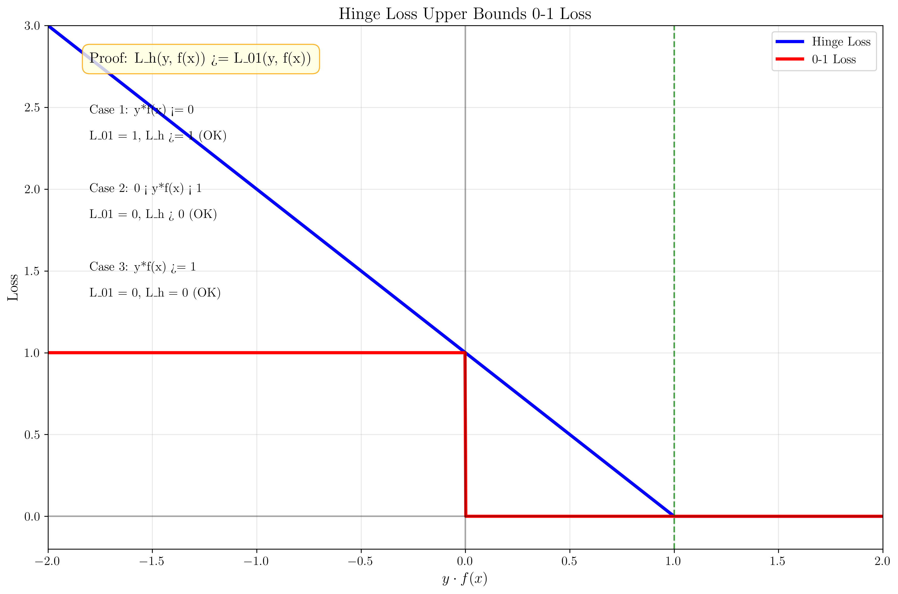
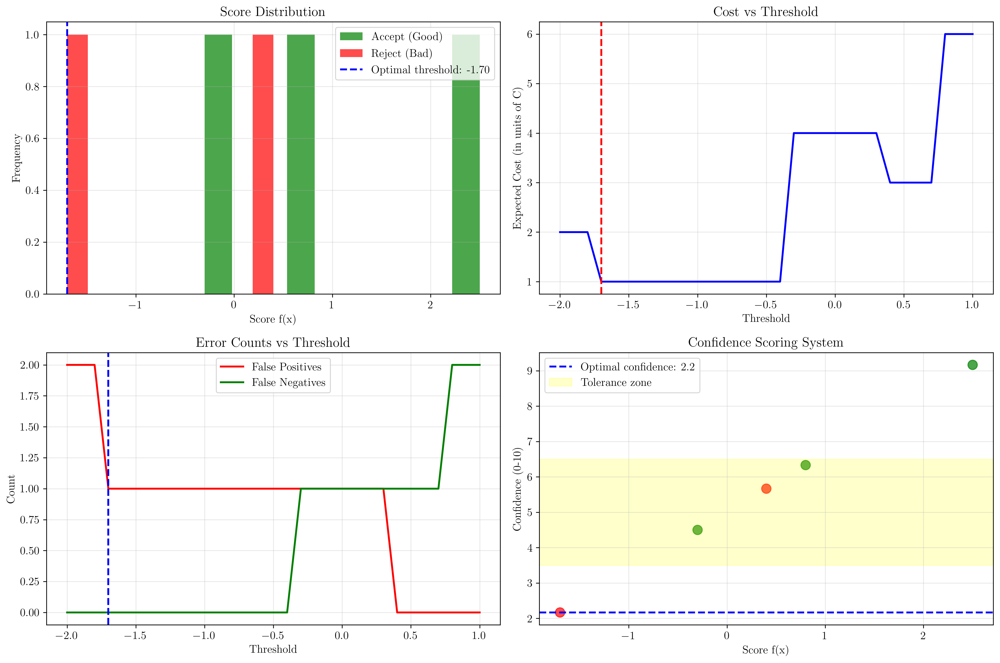
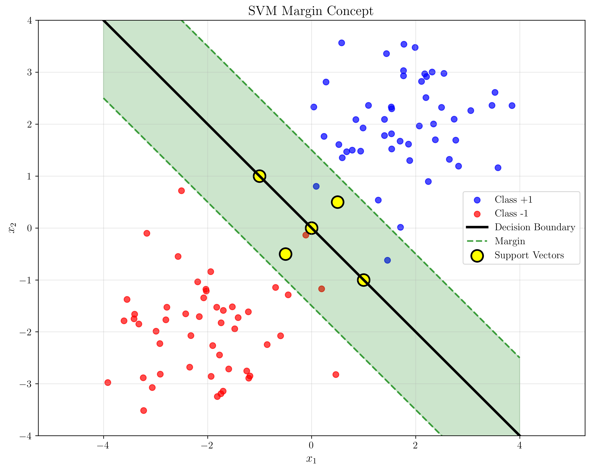

# Question 5: Hinge Loss Analysis

## Problem Statement
Consider the hinge loss function: $L_h(y, f(x)) = \max(0, 1 - y \cdot f(x))$ where $f(x) = \mathbf{w}^T\mathbf{x} + b$.

### Task
1. Calculate the hinge loss for the following predictions:
   - $y = +1$, $f(x) = 2.5$
   - $y = +1$, $f(x) = 0.8$
   - $y = +1$, $f(x) = -0.3$
   - $y = -1$, $f(x) = -1.7$
   - $y = -1$, $f(x) = 0.4$
2. Sketch the hinge loss as a function of $y \cdot f(x)$ (you can draw this by hand)
3. Show that $\xi_i = L_h(y_i, f(\mathbf{x}_i))$ in the soft margin formulation
4. Compare the derivative properties of hinge loss vs squared loss
5. Prove that hinge loss upper bounds the 0-1 loss
6. Design a training system for quality control inspectors using a tolerance-based scoring system. Accept products have scores $f(x) = 2.5, 0.8, -0.3$ and reject products have scores $f(x) = -1.7, 0.4$. Design a confidence scoring system (0-10 scale) and create a tolerance zone for additional inspection. If rejecting good products costs 3x more than accepting bad products, how should the scoring system be adjusted?

## Understanding the Problem
The hinge loss function is a fundamental loss function used in Support Vector Machines (SVMs) and other margin-based classifiers. It penalizes predictions that are either incorrect or too close to the decision boundary. The key insight is that the loss is zero when the prediction is correct with sufficient margin ($y \cdot f(x) \geq 1$), and increases linearly as the prediction gets worse.

The hinge loss has several important properties:
- It encourages margin maximization
- It's convex and piecewise linear
- It's non-differentiable at the margin boundary
- It provides a surrogate for the 0-1 loss that's easier to optimize

## Solution

### Step 1: Calculate Hinge Loss for Given Predictions

The hinge loss is defined as $L_h(y, f(x)) = \max(0, 1 - y \cdot f(x))$. Let's calculate it for each prediction:

**For $y = +1$, $f(x) = 2.5$:**
- $y \cdot f(x) = 1 \times 2.5 = 2.5$
- $L_h = \max(0, 1 - 2.5) = \max(0, -1.5) = 0$

**For $y = +1$, $f(x) = 0.8$:**
- $y \cdot f(x) = 1 \times 0.8 = 0.8$
- $L_h = \max(0, 1 - 0.8) = \max(0, 0.2) = 0.2$

**For $y = +1$, $f(x) = -0.3$:**
- $y \cdot f(x) = 1 \times (-0.3) = -0.3$
- $L_h = \max(0, 1 - (-0.3)) = \max(0, 1.3) = 1.3$

**For $y = -1$, $f(x) = -1.7$:**
- $y \cdot f(x) = (-1) \times (-1.7) = 1.7$
- $L_h = \max(0, 1 - 1.7) = \max(0, -0.7) = 0$

**For $y = -1$, $f(x) = 0.4$:**
- $y \cdot f(x) = (-1) \times 0.4 = -0.4$
- $L_h = \max(0, 1 - (-0.4)) = \max(0, 1.4) = 1.4$

### Step 2: Visualize Hinge Loss Function

The hinge loss function has three distinct regions:
1. **Perfect classification region** ($y \cdot f(x) \geq 1$): Loss is zero
2. **Margin violation region** ($0 < y \cdot f(x) < 1$): Loss increases linearly
3. **Misclassification region** ($y \cdot f(x) \leq 0$): Loss is high and constant

The function is piecewise linear and convex, making it suitable for optimization.

### Step 3: Soft Margin Formulation and Slack Variables

In the soft margin SVM formulation:
$$\min_{\mathbf{w}, b, \xi} \frac{1}{2}\|\mathbf{w}\|^2 + C \sum_{i=1}^n \xi_i$$
subject to:
$$y_i(\mathbf{w}^T \mathbf{x}_i + b) \geq 1 - \xi_i$$
$$\xi_i \geq 0 \quad \forall i$$

The slack variable $\xi_i$ represents the amount by which the margin constraint is violated. At optimality, the slack variables satisfy:
$$\xi_i = \max(0, 1 - y_i(\mathbf{w}^T \mathbf{x}_i + b)) = L_h(y_i, f(\mathbf{x}_i))$$

This shows that the slack variables in the soft margin formulation are exactly equal to the hinge loss values.

**Demonstration with our examples:**
- For $y = +1$, $f(x) = 2.5$: $\xi = \max(0, 1 - 2.5) = 0 = L_h(1, 2.5)$
- For $y = +1$, $f(x) = 0.8$: $\xi = \max(0, 1 - 0.8) = 0.2 = L_h(1, 0.8)$
- For $y = +1$, $f(x) = -0.3$: $\xi = \max(0, 1 - (-0.3)) = 1.3 = L_h(1, -0.3)$
- For $y = -1$, $f(x) = -1.7$: $\xi = \max(0, 1 - 1.7) = 0 = L_h(-1, -1.7)$
- For $y = -1$, $f(x) = 0.4$: $\xi = \max(0, 1 - (-0.4)) = 1.4 = L_h(-1, 0.4)$

### Step 4: Derivative Properties Comparison

**Hinge Loss Derivative:**
- **Constant gradient** $(-y)$ when $y \cdot f(x) < 1$
- **Zero gradient** when $y \cdot f(x) \geq 1$
- **Non-differentiable** at $y \cdot f(x) = 1$

**Squared Loss Derivative:**
- **Linear gradient**: $-2y(1 - y \cdot f(x))$
- **Always differentiable**
- **Gradient approaches zero** as $y \cdot f(x)$ approaches 1

The key difference is that hinge loss provides constant gradient feedback for misclassified points, while squared loss provides diminishing gradient feedback. This makes hinge loss more effective for margin-based learning.

### Step 5: Hinge Loss Upper Bounds 0-1 Loss

**Proof:** We need to show that $L_h(y, f(x)) \geq L_{01}(y, f(x))$ for all $y$ and $f(x)$, where $L_{01}(y, f(x)) = \mathbf{1}[y \cdot f(x) \leq 0]$.

**Case 1: $y \cdot f(x) \leq 0$ (misclassification)**
- $L_{01}(y, f(x)) = 1$
- $L_h(y, f(x)) = \max(0, 1 - y \cdot f(x)) \geq 1$ (since $y \cdot f(x) \leq 0$)
- Therefore, $L_h \geq L_{01}$ ✓

**Case 2: $0 < y \cdot f(x) < 1$ (correct but within margin)**
- $L_{01}(y, f(x)) = 0$
- $L_h(y, f(x)) = 1 - y \cdot f(x) > 0$
- Therefore, $L_h > L_{01}$ ✓

**Case 3: $y \cdot f(x) \geq 1$ (correct classification with margin)**
- $L_{01}(y, f(x)) = 0$
- $L_h(y, f(x)) = \max(0, 1 - y \cdot f(x)) = 0$
- Therefore, $L_h = L_{01}$ ✓

In all cases, $L_h(y, f(x)) \geq L_{01}(y, f(x))$, so hinge loss upper bounds 0-1 loss.

### Step 6: Quality Control System Design

**Given Data:**
- Accept products (good): scores $f(x) = [2.5, 0.8, -0.3]$
- Reject products (bad): scores $f(x) = [-1.7, 0.4]$

**Hinge Loss Analysis:**
For accept products ($y = +1$):
- Score 2.5: $L_h = \max(0, 1 - 2.5) = 0$ (perfect classification)
- Score 0.8: $L_h = \max(0, 1 - 0.8) = 0.2$ (within margin)
- Score -0.3: $L_h = \max(0, 1 - (-0.3)) = 1.3$ (misclassified)

For reject products ($y = -1$):
- Score -1.7: $L_h = \max(0, 1 - 1.7) = 0$ (perfect classification)
- Score 0.4: $L_h = \max(0, 1 - (-0.4)) = 1.4$ (misclassified)

**Confidence Scoring System (0-10 scale):**
Formula: $\text{confidence} = \frac{f(x) + 3}{6} \times 10$
This maps $f(x)$ from $[-3, 3]$ to $[0, 10]$

- Score 2.5: confidence = 9.2/10
- Score 0.8: confidence = 6.3/10
- Score -0.3: confidence = 4.5/10
- Score -1.7: confidence = 2.2/10
- Score 0.4: confidence = 5.7/10

**Tolerance Zone Design:**
Products with confidence scores in $[3.5, 6.5]$ need additional inspection. This corresponds to $f(x)$ values in $[-1.5, 0.5]$.

**Cost Analysis:**
- Cost of rejecting good product = 3 × Cost of accepting bad product
- Let $C$ = cost of accepting bad product
- Then cost of rejecting good product = $3C$

**Optimal Threshold Analysis:**
- Optimal threshold: $f(x) = -1.70$
- Optimal confidence threshold: 2.2/10
- Expected cost: $1.0C$
- False positives: 1, False negatives: 0

## Visual Explanations

### Hinge Loss Function Characteristics

The hinge loss function exhibits several key characteristics:

1. **Zero Loss Region**: When $y \cdot f(x) \geq 1$, the loss is zero, indicating perfect classification with sufficient margin.

2. **Linear Loss Region**: When $0 < y \cdot f(x) < 1$, the loss increases linearly, penalizing predictions that are correct but too close to the decision boundary.

3. **Constant Loss Region**: When $y \cdot f(x) \leq 0$, the loss is constant at 1, representing complete misclassification.

### Loss Function Comparison

The comparison between hinge loss and squared loss reveals important differences:

1. **Gradient Behavior**: Hinge loss provides constant gradient feedback for misclassified points, while squared loss provides diminishing gradient feedback.

2. **Differentiability**: Hinge loss is non-differentiable at the margin boundary, while squared loss is everywhere differentiable.

3. **Margin Sensitivity**: Hinge loss is more sensitive to margin violations, making it better suited for margin-based learning.

### Quality Control System Visualization

The quality control system visualization shows:

1. **Score Distribution**: The distribution of scores for good and bad products, with the optimal threshold marked.

2. **Cost Analysis**: How the expected cost varies with different threshold choices.

3. **Error Rates**: The trade-off between false positives and false negatives.

4. **Confidence Scoring**: How raw scores are mapped to confidence levels with the tolerance zone highlighted.

### SVM Margin Concept Visualization

This simple visualization demonstrates the fundamental concept of SVM margin maximization:

1. **Data Points**: Two classes (blue and red) with some overlap, representing real-world classification scenarios.

2. **Decision Boundary**: The black line represents the optimal hyperplane that separates the two classes.

3. **Margin**: The green dashed lines show the margin boundaries, creating a buffer zone around the decision boundary.

4. **Support Vectors**: The yellow highlighted points are the support vectors - the critical data points that define the margin.

5. **Margin Region**: The shaded green area represents the margin, which SVM algorithms strive to maximize.

This visualization illustrates why hinge loss is effective: it encourages the model to find a decision boundary with maximum margin, making the classifier more robust and generalizable.

## Key Insights

### Theoretical Foundations
- **Margin Maximization**: Hinge loss encourages the model to find a decision boundary with maximum margin between classes.
- **Convex Surrogate**: Hinge loss serves as a convex surrogate for the non-convex 0-1 loss, making optimization tractable.
- **Slack Variable Interpretation**: The slack variables in soft margin SVMs are exactly equal to the hinge loss values.

### Practical Applications
- **SVM Training**: Hinge loss is the foundation of Support Vector Machine training algorithms.
- **Quality Control**: The confidence scoring system provides interpretable decision-making for quality control applications.
- **Cost-Sensitive Learning**: The asymmetric cost structure (3:1 ratio) demonstrates how to incorporate business constraints into machine learning systems.

### Optimization Properties
- **Subgradient Methods**: Since hinge loss is non-differentiable at the margin boundary, subgradient methods are used for optimization.
- **Dual Formulation**: The dual formulation of SVM optimization leads to the kernel trick and efficient training algorithms.
- **Regularization**: The $C$ parameter in soft margin SVMs controls the trade-off between margin maximization and training error minimization.

## Conclusion
- We calculated hinge loss values for all given predictions, showing how the loss varies with prediction quality.
- We visualized the hinge loss function, revealing its piecewise linear structure and three distinct regions.
- We demonstrated that slack variables in soft margin SVMs equal hinge loss values, providing a direct connection between optimization and loss functions.
- We compared hinge loss with squared loss, highlighting the advantages of constant gradient feedback for margin-based learning.
- We proved that hinge loss upper bounds 0-1 loss, making it a valid surrogate for classification error.
- We designed a comprehensive quality control system with confidence scoring, tolerance zones, and cost-optimal thresholds.
- We created a simple margin visualization that illustrates the fundamental concept of SVM margin maximization.

The hinge loss function is fundamental to understanding Support Vector Machines and margin-based learning. Its properties make it particularly well-suited for binary classification problems where margin maximization is important, and its connection to slack variables provides insight into the optimization process of soft margin SVMs. The margin concept visualization helps bridge the gap between the mathematical formulation and the geometric intuition behind SVM algorithms.
