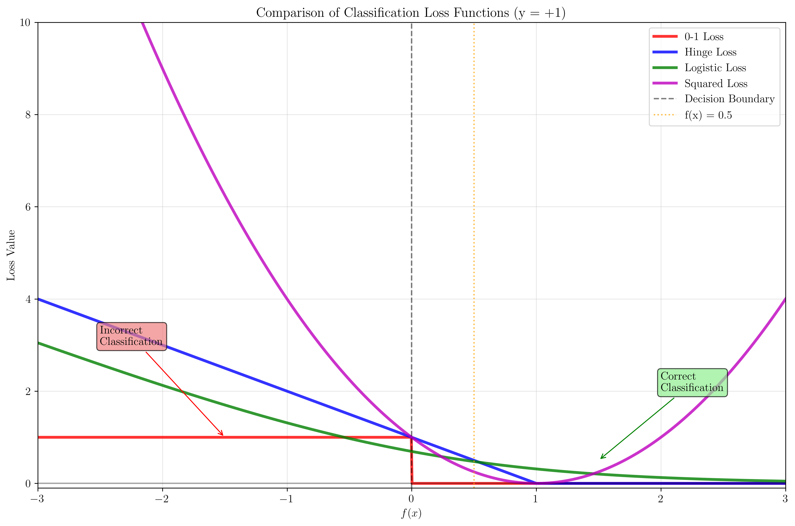
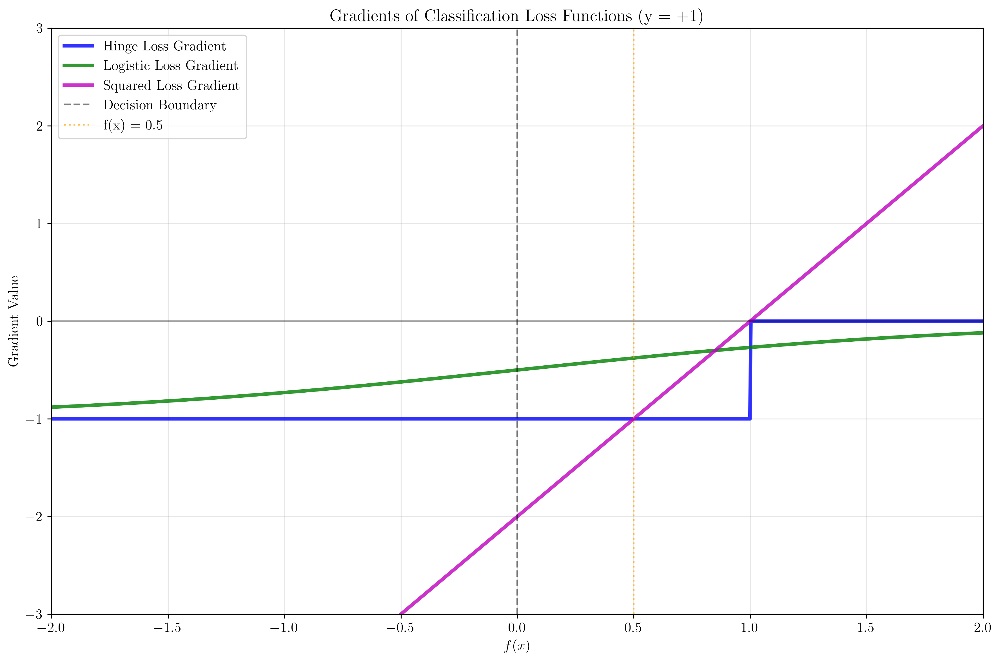
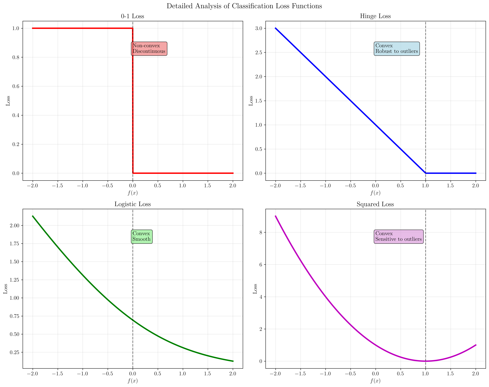

# Question 6: Loss Function Comparison

## Problem Statement
Compare different loss functions for classification:
- **0-1 Loss**: $L_{01}(y, f(x)) = \mathbb{I}[y \cdot f(x) \leq 0]$
- **Hinge Loss**: $L_h(y, f(x)) = \max(0, 1 - y \cdot f(x))$
- **Logistic Loss**: $L_{\ell}(y, f(x)) = \log(1 + e^{-y \cdot f(x)})$
- **Squared Loss**: $L_s(y, f(x)) = (y - f(x))^2$

### Task
1. Sketch all four loss functions on the same graph for $y = +1$ and $f(x) \in [-3, 3]$
2. Calculate the loss values for each function when $y = +1$ and $f(x) = 0.5$
3. Which losses are convex and which are not? Prove your answers
4. Which loss is most robust to outliers and why?
5. Derive the gradients of each loss function with respect to $f(x)$

## Understanding the Problem
Loss functions are fundamental components in machine learning that measure how well a model's predictions match the true labels. For binary classification, we typically have $y \in \{-1, +1\}$ and $f(x)$ represents the model's prediction score. The loss function quantifies the penalty for incorrect predictions.

Each loss function has different properties that make it suitable for different scenarios:
- **0-1 Loss**: Directly measures classification accuracy but is discontinuous
- **Hinge Loss**: Used in Support Vector Machines, encourages margin maximization
- **Logistic Loss**: Used in logistic regression, provides smooth probability estimates
- **Squared Loss**: Traditional regression loss, but can be used for classification

## Solution

### Step 1: Sketching All Four Loss Functions

We plot all four loss functions for $y = +1$ and $f(x) \in [-3, 3]$ to visualize their behavior.

**Key observations from the plot:**
- **0-1 Loss** (red): Step function that is 0 for correct classifications ($f(x) > 0$) and 1 for incorrect classifications ($f(x) \leq 0$)
- **Hinge Loss** (blue): Linear for $f(x) < 1$, then becomes 0 for $f(x) \geq 1$
- **Logistic Loss** (green): Smooth, decreasing function that approaches 0 as $f(x)$ increases
- **Squared Loss** (magenta): Parabolic function with minimum at $f(x) = 1$

The decision boundary at $f(x) = 0$ separates correct and incorrect classifications.

### Step 2: Calculating Loss Values

For $y = +1$ and $f(x) = 0.5$:

**Given:** $y = 1$, $f(x) = 0.5$
**Therefore:** $y \cdot f(x) = 1 \times 0.5 = 0.5$

**Loss Calculations:**

1. **0-1 Loss**: $L_{01}(y, f(x)) = \mathbb{I}[y \cdot f(x) \leq 0] = \mathbb{I}[0.5 \leq 0] = 0$
   - Since $0.5 > 0$, the classification is correct, so loss = 0

2. **Hinge Loss**: $L_h(y, f(x)) = \max(0, 1 - y \cdot f(x)) = \max(0, 1 - 0.5) = 0.5$
   - Since $1 - 0.5 = 0.5 > 0$, the loss is 0.5

3. **Logistic Loss**: $L_{\ell}(y, f(x)) = \log(1 + e^{-y \cdot f(x)}) = \log(1 + e^{-0.5}) = 0.4741$
   - Using the exponential and logarithmic properties

4. **Squared Loss**: $L_s(y, f(x)) = (y - f(x))^2 = (1 - 0.5)^2 = 0.25$
   - Simple quadratic calculation

### Step 3: Convexity Analysis

**Convexity Results:**
- **0-1 Loss**: Non-convex (discontinuous and not differentiable)
- **Hinge Loss**: Convex (piecewise linear with non-decreasing slope)
- **Logistic Loss**: Convex (second derivative is always positive)
- **Squared Loss**: Convex (second derivative is constant = 2)

**Proofs:**

1. **0-1 Loss**: Non-convex because it's discontinuous at $f(x) = 0$ and not differentiable there.

2. **Hinge Loss**: Convex because it's piecewise linear with non-decreasing slope:
   - For $f(x) < 1$: $L_h = 1 - f(x)$ (linear with negative slope)
   - For $f(x) \geq 1$: $L_h = 0$ (constant)
   - The function is continuous and has non-decreasing slope

3. **Logistic Loss**: Convex because its second derivative is always positive:
   - First derivative: $\frac{dL_{\ell}}{df} = -\frac{y}{1 + e^{y \cdot f(x)}}$
   - Second derivative: $\frac{d^2L_{\ell}}{df^2} = \frac{y^2 \cdot e^{y \cdot f(x)}}{(1 + e^{y \cdot f(x)})^2} > 0$

4. **Squared Loss**: Convex because its second derivative is constant:
   - First derivative: $\frac{dL_s}{df} = 2(f(x) - y)$
   - Second derivative: $\frac{d^2L_s}{df^2} = 2 > 0$

### Step 4: Robustness to Outliers Analysis

**Robustness Testing Results:**

| f(x) | 0-1 Loss | Hinge Loss | Logistic Loss | Squared Loss |
|------|----------|------------|---------------|--------------|
| 0.5  | 0.0      | 0.5        | 0.4741        | 0.2          |
| 1.0  | 0.0      | 0.0        | 0.3133        | 0.0          |
| 2.0  | 0.0      | 0.0        | 0.1269        | 1.0          |
| 5.0  | 0.0      | 0.0        | 0.0067        | 16.0         |
| 10.0 | 0.0      | 0.0        | 0.0000        | 81.0         |
| -0.5 | 1.0      | 1.5        | 0.9741        | 2.2          |
| -1.0 | 1.0      | 2.0        | 1.3133        | 4.0          |
| -2.0 | 1.0      | 3.0        | 2.1269        | 9.0          |
| -5.0 | 1.0      | 6.0        | 5.0067        | 36.0         |
| -10.0| 1.0      | 11.0       | 10.0000       | 121.0        |

**Robustness Ranking (from most to least robust):**

1. **0-1 Loss**: Most robust - bounded between 0 and 1 regardless of the magnitude of error
2. **Hinge Loss**: Robust - bounded and insensitive to large positive margins
3. **Logistic Loss**: Less robust - grows linearly with negative margins
4. **Squared Loss**: Least robust - grows quadratically with errors

**Why 0-1 Loss is most robust:**
- It treats all errors equally regardless of magnitude
- Bounded between 0 and 1, preventing extreme penalties
- Insensitive to outliers that are far from the decision boundary

### Step 5: Gradient Calculations

**Gradients at $f(x) = 0.5$, $y = +1$:**

1. **0-1 Loss Gradient**:
   - $\frac{\partial L_{01}}{\partial f(x)} = 0$ (not differentiable at $y \cdot f(x) = 0$)
   - Subgradient at $f(x) = 0.5$: 0

2. **Hinge Loss Gradient**:
   - $\frac{\partial L_h}{\partial f(x)} = -y$ if $y \cdot f(x) < 1$, 0 otherwise
   - At $f(x) = 0.5$: $y \cdot f(x) = 0.5 < 1$
   - Therefore: $\frac{\partial L_h}{\partial f(x)} = -1$

3. **Logistic Loss Gradient**:
   - $\frac{\partial L_{\ell}}{\partial f(x)} = -\frac{y}{1 + e^{y \cdot f(x)}}$
   - At $f(x) = 0.5$: $\frac{\partial L_{\ell}}{\partial f(x)} = -\frac{1}{1 + e^{0.5}} = -0.3775$

4. **Squared Loss Gradient**:
   - $\frac{\partial L_s}{\partial f(x)} = 2(f(x) - y)$
   - At $f(x) = 0.5$: $\frac{\partial L_s}{\partial f(x)} = 2(0.5 - 1) = -1.0$

## Visual Explanations

### Loss Function Comparison

The plot shows how each loss function behaves across different prediction values. Key features:
- **0-1 Loss**: Binary step function, discontinuous at $f(x) = 0$
- **Hinge Loss**: Linear penalty for $f(x) < 1$, then zero
- **Logistic Loss**: Smooth, exponentially decreasing function
- **Squared Loss**: Parabolic function with minimum at $f(x) = 1$

### Gradient Analysis

The gradient plot reveals important optimization properties:
- **Hinge Loss**: Piecewise constant gradient, zero for $f(x) \geq 1$
- **Logistic Loss**: Smooth, bounded gradient that approaches zero
- **Squared Loss**: Linear gradient that grows without bound

### Detailed Analysis

Individual plots highlight specific characteristics of each loss function:
- **0-1 Loss**: Non-convex, discontinuous nature
- **Hinge Loss**: Convex, robust to outliers
- **Logistic Loss**: Convex, smooth properties
- **Squared Loss**: Convex but sensitive to outliers

## Key Insights

### Theoretical Foundations
- **Convexity**: Hinge, Logistic, and Squared losses are convex, making optimization easier
- **Differentiability**: Only 0-1 loss is non-differentiable, limiting its use in gradient-based optimization
- **Boundedness**: 0-1 and Hinge losses are bounded, providing robustness to outliers

### Practical Applications
- **0-1 Loss**: Used for evaluation metrics but not for training due to non-differentiability
- **Hinge Loss**: Preferred for Support Vector Machines due to margin maximization
- **Logistic Loss**: Standard choice for probabilistic classification models
- **Squared Loss**: Common in regression but can be used for classification

### Optimization Properties
- **Gradient Behavior**: Different loss functions provide different learning signals
- **Convergence**: Convex losses guarantee convergence to global optimum
- **Sensitivity**: Loss choice affects model sensitivity to outliers and noise

### Common Pitfalls
- **0-1 Loss**: Cannot be optimized directly with gradient methods
- **Squared Loss**: Overly sensitive to outliers in classification tasks
- **Hinge Loss**: May not provide sufficient gradient information for some optimization algorithms
- **Logistic Loss**: Can be computationally expensive for large datasets

## Conclusion
- **0-1 Loss**: Most robust but non-differentiable, suitable for evaluation only
- **Hinge Loss**: Convex and robust, ideal for margin-based learning
- **Logistic Loss**: Convex and smooth, excellent for probabilistic models
- **Squared Loss**: Convex but sensitive to outliers, better suited for regression

The choice of loss function depends on the specific problem requirements, optimization method, and desired model properties. Understanding these trade-offs is crucial for effective machine learning model design.
