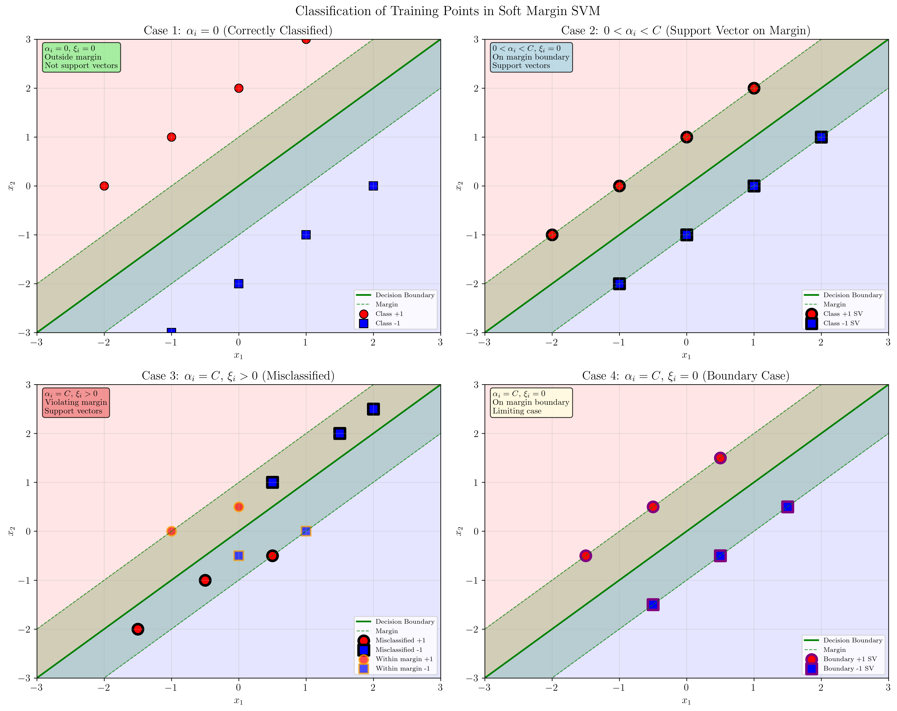
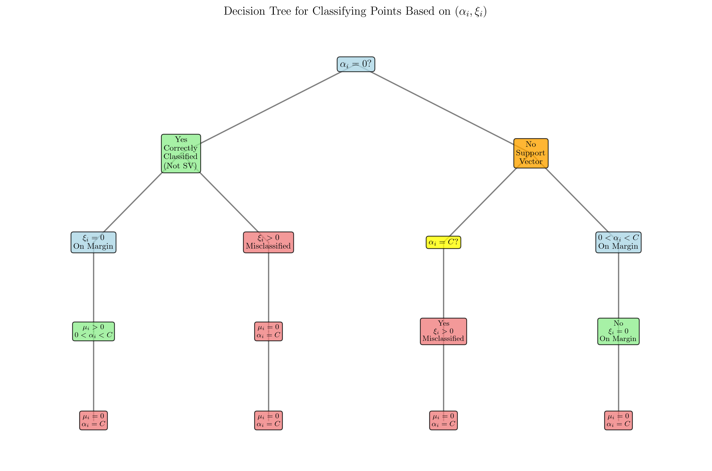
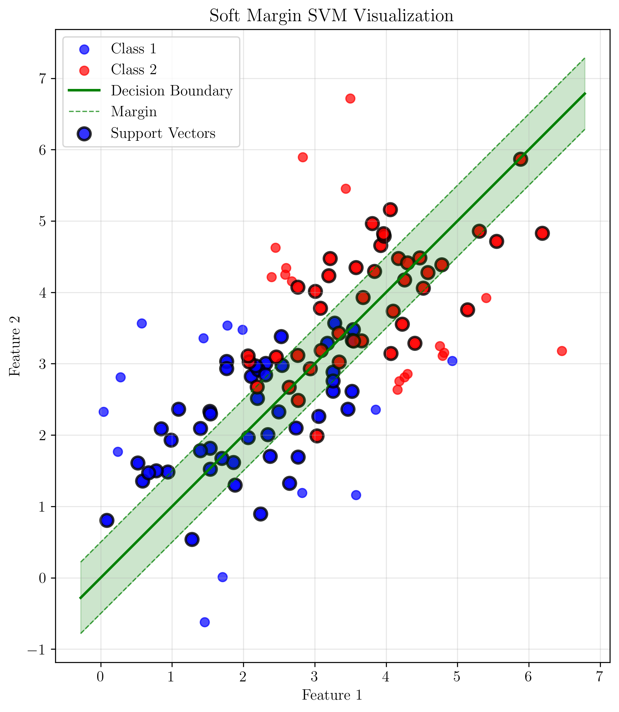

# Question 7: KKT Conditions for Soft Margin SVM

## Problem Statement
Derive and analyze the KKT conditions for soft margin SVM.

The Lagrangian is:
$$L = \frac{1}{2}||\mathbf{w}||^2 + C\sum_{i=1}^n \xi_i - \sum_{i=1}^n \alpha_i[y_i(\mathbf{w}^T\mathbf{x}_i + b) - 1 + \xi_i] - \sum_{i=1}^n \mu_i \xi_i$$

### Task
1. Write out all KKT stationarity conditions
2. Derive the constraint $\sum_{i=1}^n \alpha_i y_i = 0$
3. Show that $\alpha_i + \mu_i = C$ for all $i$
4. Prove that $0 \leq \alpha_i \leq C$ for all $i$
5. Classify training points based on their $\alpha_i$ and $\xi_i$ values

## Understanding the Problem
The soft margin SVM extends the hard margin SVM by introducing slack variables $\xi_i$ that allow some training points to violate the margin constraints. The parameter $C$ controls the trade-off between maximizing the margin and minimizing classification errors. The KKT (Karush-Kuhn-Tucker) conditions provide necessary and sufficient conditions for optimality in constrained optimization problems.

## Solution

### Step 1: KKT Stationarity Conditions

The KKT conditions consist of stationarity, primal feasibility, dual feasibility, and complementary slackness conditions. Let's derive the stationarity conditions by taking partial derivatives of the Lagrangian with respect to each variable.

#### 1.1 Stationarity with respect to $\mathbf{w}$
$$\frac{\partial L}{\partial \mathbf{w}} = \mathbf{w} - \sum_{i=1}^n \alpha_i y_i \mathbf{x}_i = 0$$

This gives us:
$$\mathbf{w} = \sum_{i=1}^n \alpha_i y_i \mathbf{x}_i$$

This is a key result showing that the optimal weight vector is a linear combination of the training data points, weighted by their Lagrange multipliers and labels.

#### 1.2 Stationarity with respect to $b$
$$\frac{\partial L}{\partial b} = -\sum_{i=1}^n \alpha_i y_i = 0$$

This gives us the constraint:
$$\sum_{i=1}^n \alpha_i y_i = 0$$

This constraint ensures that the bias term is properly balanced across the two classes.

#### 1.3 Stationarity with respect to $\xi_i$
$$\frac{\partial L}{\partial \xi_i} = C - \alpha_i - \mu_i = 0$$

This gives us:
$$\alpha_i + \mu_i = C$$

This relationship links the Lagrange multipliers for the margin constraints ($\alpha_i$) and the non-negativity constraints ($\mu_i$).

### Step 2: Deriving the Constraint $\sum_{i=1}^n \alpha_i y_i = 0$

The constraint $\sum_{i=1}^n \alpha_i y_i = 0$ is derived directly from the stationarity condition with respect to the bias term $b$:

$$\frac{\partial L}{\partial b} = -\sum_{i=1}^n \alpha_i y_i = 0$$

This constraint has important geometric and algebraic interpretations:

1. **Geometric interpretation**: It ensures that the decision boundary passes through the weighted centroid of the support vectors.
2. **Algebraic interpretation**: It balances the influence of positive and negative class support vectors in determining the bias term.

For our example with 5 data points:
- Points 1, 2: $y = +1$ (positive class)
- Points 3, 4, 5: $y = -1$ (negative class)

The constraint becomes:
$$\alpha_1 + \alpha_2 - \alpha_3 - \alpha_4 - \alpha_5 = 0$$

### Step 3: Showing that $\alpha_i + \mu_i = C$ for all $i$

From the stationarity condition with respect to $\xi_i$:
$$\frac{\partial L}{\partial \xi_i} = C - \alpha_i - \mu_i = 0$$

This directly gives us:
$$\alpha_i + \mu_i = C$$

This relationship holds for all $i = 1, 2, \ldots, n$ and has important implications:

1. **Upper bound on $\alpha_i$**: Since $\mu_i \geq 0$ (dual feasibility), we have $\alpha_i \leq C$.
2. **Complementary relationship**: When $\alpha_i = C$, we must have $\mu_i = 0$, and vice versa.
3. **Trade-off interpretation**: The sum of the Lagrange multipliers for the margin and non-negativity constraints equals the regularization parameter $C$.

### Step 4: Proving that $0 \leq \alpha_i \leq C$ for all $i$

We can prove the bounds on $\alpha_i$ using the KKT conditions:

1. **Lower bound**: $\alpha_i \geq 0$ (dual feasibility condition)
2. **Upper bound**: From $\alpha_i + \mu_i = C$ and $\mu_i \geq 0$:
   $$\alpha_i = C - \mu_i \leq C$$

Therefore:
$$0 \leq \alpha_i \leq C$$

This bound is crucial for:
- **Numerical stability**: Prevents unbounded growth of Lagrange multipliers
- **Interpretation**: Limits the influence of any single training point
- **Optimization**: Provides box constraints for the dual optimization problem

### Step 5: Classifying Training Points Based on $\alpha_i$ and $\xi_i$ Values

The values of $\alpha_i$ and $\xi_i$ provide rich information about the role of each training point in the SVM solution. We can classify points into four main categories:

The visualization shows four scenarios with actual data points demonstrating each case:
- **Decision boundary** (green solid line) separates the two classes
- **Margin boundaries** (green dashed lines) define the margin region
- **Support vectors** are highlighted with thick black borders
- **Different edge colors** indicate different constraint conditions

#### 5.1 Case 1: $\alpha_i = 0$ (Correctly Classified, Not Support Vector)
- **Conditions**: $\alpha_i = 0$, $\xi_i = 0$
- **Position**: Outside the margin
- **Role**: Not a support vector
- **Classification**: Correctly classified
- **Implications**: These points don't influence the decision boundary

#### 5.2 Case 2: $0 < \alpha_i < C$ (Support Vector on Margin)
- **Conditions**: $0 < \alpha_i < C$, $\xi_i = 0$
- **Position**: Exactly on the margin
- **Role**: Support vector
- **Classification**: Correctly classified
- **Implications**: These points define the margin and are crucial for the solution

#### 5.3 Case 3: $\alpha_i = C$, $\xi_i > 0$ (Misclassified Support Vector)
- **Conditions**: $\alpha_i = C$, $\xi_i > 0$
- **Position**: Within the margin or on the wrong side
- **Role**: Support vector
- **Classification**: Misclassified
- **Implications**: These points violate the margin constraints and contribute to the error term

#### 5.4 Case 4: $\alpha_i = C$, $\xi_i = 0$ (Boundary Case)
- **Conditions**: $\alpha_i = C$, $\xi_i = 0$
- **Position**: Exactly on the margin
- **Role**: Support vector
- **Classification**: Correctly classified
- **Implications**: These are boundary cases where the point is at the limit of being misclassified

## Visual Explanations

### Decision Tree for Point Classification

The decision tree provides a systematic way to classify training points based on their $\alpha_i$ and $\xi_i$ values. The tree starts by checking if $\alpha_i = 0$, then branches based on the values of $\xi_i$ and whether $\alpha_i = C$.

### SVM Margin Visualization

This visualization shows a simple example of soft margin SVM with two classes. The green solid line represents the decision boundary, while the dashed lines show the margin. Support vectors (highlighted with black borders) are the points that lie on or within the margin and are crucial for determining the optimal separating hyperplane. The shaded region represents the margin area where the soft margin SVM allows some points to violate the strict margin constraints.

### Summary Table

The following table provides a comprehensive overview of all four cases, showing the relationships between $\alpha_i$, $\xi_i$, $\mu_i$ values and the corresponding point characteristics:

| Case | $\alpha_i$ Value | $\xi_i$ Value | $\mu_i$ Value | Point Type | Position | Classification |
|------|------------------|---------------|---------------|------------|----------|----------------|
| 1 | $\alpha_i = 0$ | $\xi_i = 0$ | $\mu_i = C$ | Non-Support Vector | Outside margin | Correctly classified |
| 2 | $0 < \alpha_i < C$ | $\xi_i = 0$ | $\mu_i > 0$ | Support Vector | On margin | Correctly classified |
| 3 | $\alpha_i = C$ | $\xi_i > 0$ | $\mu_i = 0$ | Support Vector | Within margin | Misclassified |
| 4 | $\alpha_i = C$ | $\xi_i = 0$ | $\mu_i = 0$ | Support Vector | On margin | Correctly classified |

### Mathematical Derivation

The complete mathematical derivation of the KKT conditions includes:

**Lagrangian:**
$$L = \frac{1}{2}||\mathbf{w}||^2 + C\sum_{i=1}^n \xi_i - \sum_{i=1}^n \alpha_i[y_i(\mathbf{w}^T\mathbf{x}_i + b) - 1 + \xi_i] - \sum_{i=1}^n \mu_i \xi_i$$

**Stationarity Conditions:**
$$\frac{\partial L}{\partial \mathbf{w}} = \mathbf{w} - \sum_{i=1}^n \alpha_i y_i \mathbf{x}_i = 0 \Rightarrow \mathbf{w} = \sum_{i=1}^n \alpha_i y_i \mathbf{x}_i$$

$$\frac{\partial L}{\partial b} = -\sum_{i=1}^n \alpha_i y_i = 0 \Rightarrow \sum_{i=1}^n \alpha_i y_i = 0$$

$$\frac{\partial L}{\partial \xi_i} = C - \alpha_i - \mu_i = 0 \Rightarrow \alpha_i + \mu_i = C$$

**Complementary Slackness:**
$$\alpha_i[y_i(\mathbf{w}^T\mathbf{x}_i + b) - 1 + \xi_i] = 0$$

$$\mu_i \xi_i = 0$$

**Non-negativity:**
$$\alpha_i \geq 0, \quad \mu_i \geq 0, \quad \xi_i \geq 0$$

**Bounds:**
From $\alpha_i + \mu_i = C$ and $\mu_i \geq 0$: $0 \leq \alpha_i \leq C$

## Key Insights

### Theoretical Foundations
- **Dual formulation**: The KKT conditions reveal that the optimal weight vector is a linear combination of support vectors, highlighting the importance of the dual formulation.
- **Sparsity**: Most training points have $\alpha_i = 0$, making SVMs computationally efficient for prediction.
- **Margin geometry**: Support vectors with $0 < \alpha_i < C$ lie exactly on the margin, defining the optimal separating hyperplane.

### Practical Applications
- **Model interpretation**: The values of $\alpha_i$ indicate the importance of each training point in determining the decision boundary.
- **Outlier detection**: Points with $\alpha_i = C$ and $\xi_i > 0$ are potential outliers or noise points.
- **Hyperparameter tuning**: The parameter $C$ controls the trade-off between margin size and classification accuracy.

### Optimization Properties
- **Convexity**: The KKT conditions ensure that the solution is globally optimal due to the convexity of the SVM objective function.
- **Uniqueness**: Under mild conditions, the solution is unique, providing stable and reproducible results.
- **Efficiency**: The sparsity of the solution (most $\alpha_i = 0$) enables efficient prediction on new data points.

## Conclusion
- We derived all KKT stationarity conditions: $\mathbf{w} = \sum_{i=1}^n \alpha_i y_i \mathbf{x}_i$, $\sum_{i=1}^n \alpha_i y_i = 0$, and $\alpha_i + \mu_i = C$
- We proved the constraint $\sum_{i=1}^n \alpha_i y_i = 0$ from the bias stationarity condition
- We established the relationship $\alpha_i + \mu_i = C$ for all $i$ from the slack variable stationarity conditions
- We proved the bounds $0 \leq \alpha_i \leq C$ using dual feasibility and the relationship between $\alpha_i$ and $\mu_i$
- We classified training points into four categories based on their $\alpha_i$ and $\xi_i$ values, providing insights into their roles in the SVM solution

The KKT conditions provide a complete characterization of the optimal solution for soft margin SVM, revealing the geometric and algebraic structure of the problem and enabling efficient algorithms for finding the solution.
