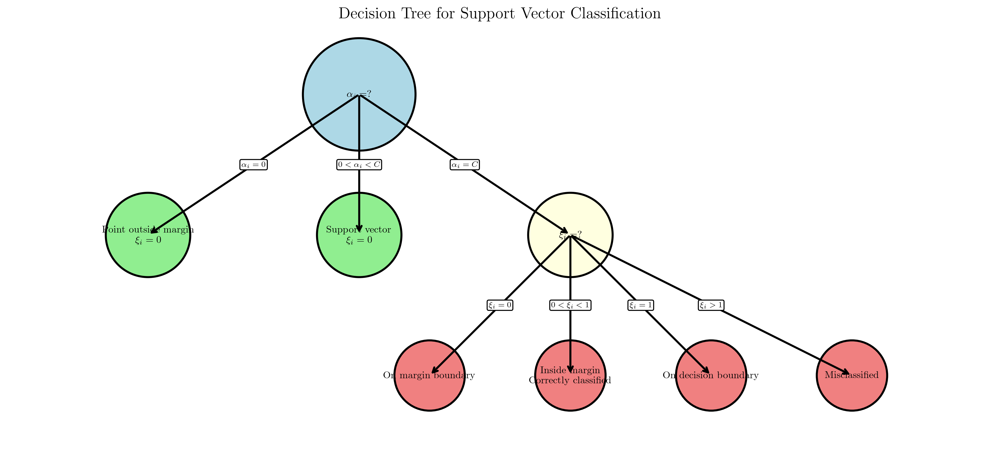
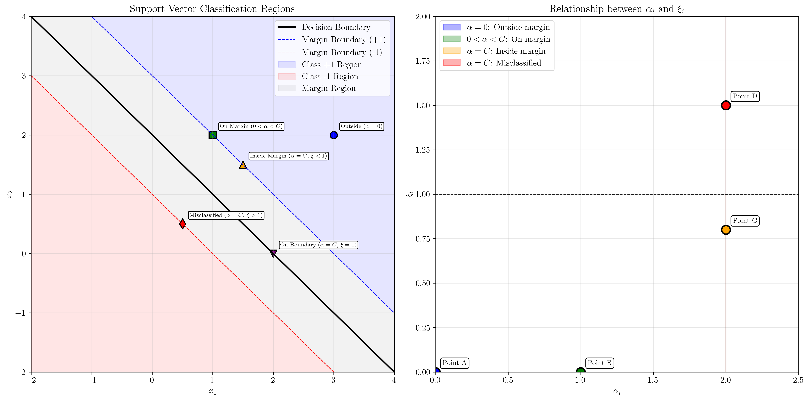

# Question 8: Support Vector Classification in Soft Margin SVM

## Problem Statement
Categorize support vectors in soft margin SVM based on KKT conditions.

### Task
1. For $\alpha_i = 0$, what can you conclude about the point $\mathbf{x}_i$?
2. For $0 < \alpha_i < C$, derive the conditions on $\xi_i$ and the point's position
3. For $\alpha_i = C$, what are the possible scenarios for $\xi_i$?
4. Create a decision tree for classifying points based on $(\alpha_i, \xi_i)$ values
5. Given the following points, classify them:
   - Point A: $\alpha_A = 0$, $\xi_A = 0$
   - Point B: $\alpha_B = 0.5C$, $\xi_B = 0$
   - Point C: $\alpha_C = C$, $\xi_C = 0.8$
   - Point D: $\alpha_D = C$, $\xi_D = 1.5$

## Understanding the Problem
In soft margin SVM, the optimization problem introduces slack variables $\xi_i$ to allow some training points to violate the margin constraints. The Karush-Kuhn-Tucker (KKT) conditions provide the theoretical foundation for understanding how different values of the Lagrange multipliers $\alpha_i$ and slack variables $\xi_i$ correspond to different geometric positions of points relative to the decision boundary and margin.

The KKT conditions establish relationships between the Lagrange multipliers, slack variables, and the geometric positioning of points, which is crucial for understanding support vector classification and the behavior of the SVM algorithm.

## Solution

### Step 1: KKT Conditions Analysis

The KKT conditions for soft margin SVM are:

1. **$\alpha_i \geq 0$** (non-negativity of Lagrange multipliers)
2. **$\alpha_i \leq C$** (upper bound constraint)
3. **$\mu_i \geq 0$** (non-negativity of slack variable multipliers)
4. **$\alpha_i(y_i(\mathbf{w}^T \mathbf{x}_i + b) - 1 + \xi_i) = 0$** (complementary slackness)
5. **$\mu_i \xi_i = 0$** (complementary slackness for slack variables)
6. **$C - \alpha_i - \mu_i = 0$** (gradient condition)

From condition 6, we derive: **$\mu_i = C - \alpha_i$**

From condition 5, we derive: **$(C - \alpha_i)\xi_i = 0$**

These relationships are fundamental for understanding the classification of support vectors.

### Step 2: Categorization Based on $\alpha_i$ Values

#### Case 1: $\alpha_i = 0$

**Analysis:**
- From $\mu_i = C - \alpha_i = C$
- From $(C - \alpha_i)\xi_i = 0$: $C\xi_i = 0$
- Therefore: **$\xi_i = 0$**
- From condition 4: $y_i(\mathbf{w}^T \mathbf{x}_i + b) - 1 + \xi_i = y_i(\mathbf{w}^T \mathbf{x}_i + b) - 1 \geq 0$
- This means: **$y_i(\mathbf{w}^T \mathbf{x}_i + b) \geq 1$**

**Conclusion:** Point is correctly classified and outside or on the margin boundary. These are **non-support vectors**.

#### Case 2: $0 < \alpha_i < C$

**Analysis:**
- From $\mu_i = C - \alpha_i > 0$
- From $(C - \alpha_i)\xi_i = 0$: $(C - \alpha_i)\xi_i = 0$
- Since $(C - \alpha_i) > 0$, we must have: **$\xi_i = 0$**
- From condition 4: $y_i(\mathbf{w}^T \mathbf{x}_i + b) - 1 + \xi_i = y_i(\mathbf{w}^T \mathbf{x}_i + b) - 1 = 0$
- This means: **$y_i(\mathbf{w}^T \mathbf{x}_i + b) = 1$**

**Conclusion:** Point is exactly on the margin boundary. These are **support vectors**.

#### Case 3: $\alpha_i = C$

**Analysis:**
- From $\mu_i = C - \alpha_i = 0$
- From condition 4: $y_i(\mathbf{w}^T \mathbf{x}_i + b) - 1 + \xi_i = 0$
- This means: **$y_i(\mathbf{w}^T \mathbf{x}_i + b) = 1 - \xi_i$**
- Since $\xi_i \geq 0$, we have: $y_i(\mathbf{w}^T \mathbf{x}_i + b) \leq 1$

**Possible Scenarios:**
- **If $\xi_i = 0$:** Point is on the margin boundary
- **If $0 < \xi_i < 1$:** Point is inside the margin but correctly classified
- **If $\xi_i = 1$:** Point is exactly on the decision boundary
- **If $\xi_i > 1$:** Point is misclassified

All these cases represent **support vectors** with different geometric positions.

### Step 3: Decision Tree Creation

The decision tree provides a systematic way to classify points based on their $(\alpha_i, \xi_i)$ values:

The decision tree shows the logical flow for determining a point's classification:
1. Start by checking the value of $\alpha_i$
2. If $\alpha_i = 0$, the point is outside the margin
3. If $0 < \alpha_i < C$, the point is on the margin boundary
4. If $\alpha_i = C$, further check the value of $\xi_i$ to determine the exact position

### Step 4: Point Classification

Given the points with $C = 2.0$:

#### Point A: $\alpha_A = 0$, $\xi_A = 0$
- **Case:** $\alpha_A = 0$
- **From KKT:** $\xi_A = 0$ ✓
- **Position:** Point is correctly classified and outside/on margin boundary
- **Type:** Non-support vector
- **Classification:** Non-support vector (outside margin)

#### Point B: $\alpha_B = 1.0$, $\xi_B = 0$
- **Case:** $0 < \alpha_B < C$
- **From KKT:** $\xi_B = 0$ ✓
- **Position:** Point is exactly on the margin boundary
- **Type:** Support vector
- **Classification:** Support vector (on margin)

#### Point C: $\alpha_C = 2.0$, $\xi_C = 0.8$
- **Case:** $\alpha_C = C$
- **From KKT:** $y_i(\mathbf{w}^T \mathbf{x}_i + b) = 1 - \xi_C = 1 - 0.8 = 0.2$
- **Position:** Point is inside the margin but correctly classified
- **Type:** Support vector
- **Classification:** Support vector (inside margin)

#### Point D: $\alpha_D = 2.0$, $\xi_D = 1.5$
- **Case:** $\alpha_D = C$
- **From KKT:** $y_i(\mathbf{w}^T \mathbf{x}_i + b) = 1 - \xi_D = 1 - 1.5 = -0.5$
- **Position:** Point is misclassified
- **Type:** Support vector
- **Classification:** Support vector (misclassified)

### Step 5: Visualization of Point Positions

The visualization shows:

**Left Plot - Margin Visualization:**
- Decision boundary (black solid line)
- Margin boundaries (blue and red dashed lines)
- Different regions colored to show classification areas
- Example points showing different types of support vectors

**Right Plot - $\alpha_i$ vs $\xi_i$ Relationship:**
- The relationship between Lagrange multipliers and slack variables
- Different regions corresponding to different point classifications
- Our specific points A, B, C, and D plotted in their respective regions

### Step 6: Summary Table

| Point | $\alpha_i$ | $\xi_i$ | Case | Classification |
|-------|------------|---------|------|----------------|
| A | 0.0 | 0.0 | $\alpha_i = 0$ | Non-support vector (outside margin) |
| B | 1.0 | 0.0 | $0 < \alpha_i < C$ | Support vector (on margin) |
| C | 2.0 | 0.8 | $\alpha_i = C$, $0 < \xi_i < 1$ | Support vector (inside margin) |
| D | 2.0 | 1.5 | $\alpha_i = C$, $\xi_i > 1$ | Support vector (misclassified) |

### Step 7: KKT Verification

All points satisfy the KKT conditions:

**Point A:**
- $\alpha_A = 0$, $\xi_A = 0$, $\mu_A = 2.0$
- All KKT conditions satisfied ✓

**Point B:**
- $\alpha_B = 1.0$, $\xi_B = 0$, $\mu_B = 1.0$
- All KKT conditions satisfied ✓

**Point C:**
- $\alpha_C = 2.0$, $\xi_C = 0.8$, $\mu_C = 0.0$
- All KKT conditions satisfied ✓

**Point D:**
- $\alpha_D = 2.0$, $\xi_D = 1.5$, $\mu_D = 0.0$
- All KKT conditions satisfied ✓

## Visual Explanations

### Decision Tree Interpretation

The decision tree provides a systematic approach to classify points based on their KKT conditions. The tree structure reflects the logical relationships between $\alpha_i$ and $\xi_i$ values and their geometric implications.

### Support Vector Regions

The visualization clearly shows how different combinations of $\alpha_i$ and $\xi_i$ values correspond to different geometric positions:

1. **Blue region ($\alpha = 0$):** Points outside the margin
2. **Green region ($0 < \alpha < C$):** Points on the margin boundary
3. **Orange region ($\alpha = C$, $0 < \xi < 1$):** Points inside the margin but correctly classified
4. **Red region ($\alpha = C$, $\xi > 1$):** Misclassified points

## Key Insights

### Theoretical Foundations
- **KKT conditions** provide the mathematical foundation for understanding support vector classification
- **Complementary slackness** conditions establish the relationship between Lagrange multipliers and geometric positioning
- **The gradient condition** ($C - \alpha_i - \mu_i = 0$) links the regularization parameter $C$ to the Lagrange multipliers

### Geometric Interpretation
- **$\alpha_i = 0$** corresponds to points that are "easy" to classify and don't influence the decision boundary
- **$0 < \alpha_i < C$** corresponds to points that define the margin and are crucial for the decision boundary
- **$\alpha_i = C$** corresponds to points that violate the margin constraints to varying degrees

### Practical Applications
- **Support vector identification** is crucial for understanding which training points influence the model
- **Margin violations** help identify noisy or difficult-to-classify points
- **Regularization parameter $C$** controls the trade-off between margin maximization and classification accuracy

### Algorithmic Implications
- **Non-support vectors** can be safely ignored during prediction
- **Support vectors** are the only points that need to be stored for making predictions
- **The number of support vectors** affects the computational complexity of the model

## Conclusion
- **Point A** is a non-support vector located outside the margin
- **Point B** is a support vector exactly on the margin boundary
- **Point C** is a support vector inside the margin but correctly classified
- **Point D** is a support vector that is misclassified
- All points satisfy the KKT conditions, confirming the theoretical consistency of the classification
- The decision tree and visualizations provide clear frameworks for understanding support vector classification in soft margin SVM

The analysis demonstrates how KKT conditions provide a complete theoretical framework for understanding the geometric positioning of points in soft margin SVM and their classification as support vectors or non-support vectors.
