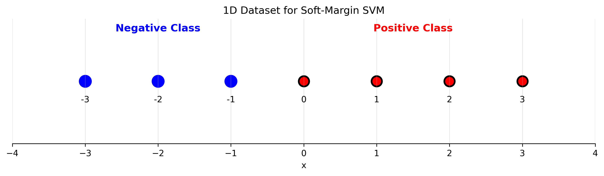

# Lecture 5.2: Hard Margin and Soft Margin SVMs Quiz

## Overview
This quiz contains 25 questions covering different topics from section 5.2 of the lectures on Hard Margin SVM, Soft Margin SVM, Slack Variables, Regularization Trade-offs, Hinge Loss Function, and KKT Conditions.

## Question 1

### Problem Statement
Consider a 2D dataset with outliers:
- Class $+1$: $(3, 2)$, $(4, 3)$, $(5, 2)$, $(1, 4)$ (potential outlier)
- Class $-1$: $(0, 0)$, $(1, 1)$, $(0, 2)$

#### Task
1. Draw the data points on a coordinate system and determine if it's linearly separable (you can use graph paper or a simple sketch)
2. Explain why hard margin SVM would fail on this dataset
3. Calculate the minimum number of constraint violations needed to make the data separable
4. Design a soft margin SVM formulation that handles the outlier appropriately
5. What would be the effect of removing the outlier $(1, 4)$ on the hard margin solution?
6. Design a medical screening system that classifies patients as "Healthy" or "At Risk" based on blood test results. Healthy patients are at $(3, 2)$, $(4, 3)$, $(5, 2)$ and At Risk patients are at $(0, 0)$, $(1, 1)$, $(0, 2)$. The uncertain case $(1, 4)$ could be measurement error. Design a confidence-based classification system with three zones and calculate diagnostic uncertainty for the outlier case.

For a detailed explanation of this problem, see [Question 1: Hard Margin Limitations](L5_2_1_explanation.md).

## Question 2

### Problem Statement
Analyze the soft margin SVM optimization problem:
$$\min_{\mathbf{w}, b, \boldsymbol{\xi}} \frac{1}{2}||\mathbf{w}||^2 + C\sum_{i=1}^n \xi_i$$
$$\text{subject to: } y_i(\mathbf{w}^T\mathbf{x}_i + b) \geq 1 - \xi_i, \quad \xi_i \geq 0$$

#### Task
1. Derive this formulation from the hard margin case by introducing slack variables
2. What is the geometric interpretation of each slack variable $\xi_i$?
3. Prove that the constraint $\xi_i \geq 0$ is necessary for the formulation to make sense
4. Show that in the optimal solution, $\xi_i = \max(0, 1 - y_i(\mathbf{w}^T\mathbf{x}_i + b))$
5. What happens to the problem when $C \to \infty$?

For a detailed explanation of this problem, see [Question 2: Soft Margin Formulation](L5_2_2_explanation.md).

## Question 3

### Problem Statement
Given a dataset with the following training points and their optimal slack variables:
- $(\mathbf{x}_1, y_1) = ((2, 1), +1)$, $\xi_1 = 0$
- $(\mathbf{x}_2, y_2) = ((1, 2), +1)$, $\xi_2 = 0.3$
- $(\mathbf{x}_3, y_3) = ((0, 0), -1)$, $\xi_3 = 0$
- $(\mathbf{x}_4, y_4) = ((1, 0), -1)$, $\xi_4 = 1.2$

#### Task
1. Interpret what each slack variable value means geometrically
2. Which points are correctly classified and which are misclassified?
3. Which points lie within the margin, on the margin, or outside the margin?
4. If the hyperplane is $x_1 + x_2 - 1.5 = 0$, verify the slack variable values
5. Calculate the total penalty $\sum_{i=1}^4 \xi_i$ contributed to the objective function

For a detailed explanation of this problem, see [Question 3: Slack Variable Analysis](L5_2_3_explanation.md).

## Question 4

### Problem Statement
Analyze the effect of the regularization parameter $C$ on soft margin SVM behavior.

#### Task
1. For $C = 0.1, 1, 10, 100$, predict the qualitative behavior of the classifier
2. Derive the relationship between $C$ and the bias-variance tradeoff
3. As $C$ increases, how does the number of support vectors typically change?
4. Design an experiment to find the optimal $C$ using validation curves
5. Prove that the soft margin SVM solution approaches the hard margin solution as $C \to \infty$

For a detailed explanation of this problem, see [Question 4: Regularization Parameter Analysis](L5_2_4_explanation.md).

## Question 5

### Problem Statement
Consider the hinge loss function: $L_h(y, f(x)) = \max(0, 1 - y \cdot f(x))$ where $f(x) = \mathbf{w}^T\mathbf{x} + b$.

#### Task
1. Calculate the hinge loss for the following predictions:
   - $y = +1$, $f(x) = 2.5$
   - $y = +1$, $f(x) = 0.8$
   - $y = +1$, $f(x) = -0.3$
   - $y = -1$, $f(x) = -1.7$
   - $y = -1$, $f(x) = 0.4$
2. Sketch the hinge loss as a function of $y \cdot f(x)$ (you can draw this by hand)
3. Show that $\xi_i = L_h(y_i, f(\mathbf{x}_i))$ in the soft margin formulation
4. Compare the derivative properties of hinge loss vs squared loss
5. Prove that hinge loss upper bounds the 0-1 loss
6. Design a training system for quality control inspectors using a tolerance-based scoring system. Accept products have scores $f(x) = 2.5, 0.8, -0.3$ and reject products have scores $f(x) = -1.7, 0.4$. Design a confidence scoring system (0-10 scale) and create a tolerance zone for additional inspection. If rejecting good products costs 3x more than accepting bad products, how should the scoring system be adjusted?

For a detailed explanation of this problem, see [Question 5: Hinge Loss Analysis](L5_2_5_explanation.md).

## Question 6

### Problem Statement
Compare different loss functions for classification:
- 0-1 Loss: $L_{01}(y, f(x)) = \mathbb{I}[y \cdot f(x) \leq 0]$
- Hinge Loss: $L_h(y, f(x)) = \max(0, 1 - y \cdot f(x))$
- Logistic Loss: $L_{\ell}(y, f(x)) = \log(1 + e^{-y \cdot f(x)})$
- Squared Loss: $L_s(y, f(x)) = (y - f(x))^2$

#### Task
1. Sketch all four loss functions on the same graph for $y = +1$ and $f(x) \in [-3, 3]$ (you can draw this by hand)
2. Calculate the loss values for each function when $y = +1$ and $f(x) = 0.5$
3. Which losses are convex and which are not? Prove your answers
4. Which loss is most robust to outliers and why?
5. Derive the gradients of each loss function with respect to $f(x)$

For a detailed explanation of this problem, see [Question 6: Loss Function Comparison](L5_2_6_explanation.md).

## Question 7

### Problem Statement
Derive and analyze the KKT conditions for soft margin SVM.

The Lagrangian is:
$$L = \frac{1}{2}||\mathbf{w}||^2 + C\sum_{i=1}^n \xi_i - \sum_{i=1}^n \alpha_i[y_i(\mathbf{w}^T\mathbf{x}_i + b) - 1 + \xi_i] - \sum_{i=1}^n \mu_i \xi_i$$

#### Task
1. Write out all KKT stationarity conditions
2. Derive the constraint $\sum_{i=1}^n \alpha_i y_i = 0$
3. Show that $\alpha_i + \mu_i = C$ for all $i$
4. Prove that $0 \leq \alpha_i \leq C$ for all $i$
5. Classify training points based on their $\alpha_i$ and $\xi_i$ values

For a detailed explanation of this problem, see [Question 7: KKT Conditions Derivation](L5_2_7_explanation.md).

## Question 8

### Problem Statement
Categorize support vectors in soft margin SVM based on KKT conditions.

#### Task
1. For $\alpha_i = 0$, what can you conclude about the point $\mathbf{x}_i$?
2. For $0 < \alpha_i < C$, derive the conditions on $\xi_i$ and the point's position
3. For $\alpha_i = C$, what are the possible scenarios for $\xi_i$?
4. Create a decision tree for classifying points based on $(\alpha_i, \xi_i)$ values
5. Given the following points, classify them:
   - Point A: $\alpha_A = 0$, $\xi_A = 0$
   - Point B: $\alpha_B = 0.5C$, $\xi_B = 0$
   - Point C: $\alpha_C = C$, $\xi_C = 0.8$
   - Point D: $\alpha_D = C$, $\xi_D = 1.5$

For a detailed explanation of this problem, see [Question 8: Support Vector Classification](L5_2_8_explanation.md).

## Question 9

### Problem Statement
Solve a small soft margin SVM problem analytically.

Consider the dataset:
- $\mathbf{x}_1 = (1, 0)$, $y_1 = +1$
- $\mathbf{x}_2 = (0, 1)$, $y_2 = +1$
- $\mathbf{x}_3 = (-1, 0)$, $y_3 = -1$
- $\mathbf{x}_4 = (0, -1)$, $y_4 = -1$
- $\mathbf{x}_5 = (0.1, 0.1)$, $y_5 = -1$ (outlier)

#### Task
1. Set up the dual optimization problem for soft margin SVM with $C = 1$
2. Solve for the optimal Lagrange multipliers $\alpha_i$
3. Calculate the optimal weight vector $\mathbf{w}^*$ and bias $b^*$
4. Determine the slack variable $\xi_5$ for the outlier point
5. Verify that your solution satisfies all KKT conditions

For a detailed explanation of this problem, see [Question 9: Analytical Solution Example](L5_2_9_explanation.md).

## Question 10

### Problem Statement
Design experiments to understand the bias-variance tradeoff in soft margin SVMs.

#### Task
1. Describe how you would generate synthetic datasets to study the effect of $C$
2. Design a cross-validation scheme to select the optimal $C$ value
3. Predict how training error and validation error curves will look as functions of $C$
4. What metrics would you use to evaluate the bias and variance components?
5. How would noise level in the data affect the optimal choice of $C$?

For a detailed explanation of this problem, see [Question 10: Experimental Design](L5_2_10_explanation.md).

## Question 11

### Problem Statement
Analyze the computational complexity differences between hard and soft margin SVMs.

#### Task
1. Compare the number of optimization variables in hard vs soft margin formulations
2. How does the addition of slack variables affect the QP problem structure?
3. What is the worst-case time complexity for solving soft margin SVM?
4. How does the choice of $C$ affect convergence properties of optimization algorithms?
5. Estimate the memory requirements for storing the extended problem formulation

For a detailed explanation of this problem, see [Question 11: Computational Complexity](L5_2_11_explanation.md).

## Question 12

### Problem Statement
Investigate the relationship between soft margin SVM and regularized empirical risk minimization.

#### Task
1. Show that soft margin SVM can be written as: $\min_{\mathbf{w}, b} \frac{\lambda}{2}||\mathbf{w}||^2 + \frac{1}{n}\sum_{i=1}^n L_h(y_i, \mathbf{w}^T\mathbf{x}_i + b)$
2. What is the relationship between $\lambda$ and $C$?
3. Compare this to Ridge regression formulation
4. How does this connect SVM to the general framework of regularized learning?
5. What other loss functions could be substituted while maintaining convexity?

For a detailed explanation of this problem, see [Question 12: Regularized Risk Minimization](L5_2_12_explanation.md).

## Question 13

### Problem Statement
Study the geometric interpretation of the soft margin in 2D.

#### Task
1. For the hyperplane $x_1 + 2x_2 - 3 = 0$, draw the margin boundaries (you can sketch this by hand)
2. Sketch points with different slack variable values: $\xi = 0, 0.5, 1.0, 1.5$ (you can draw this by hand)
3. Show how the margin changes as $C$ varies from $0.1$ to $10$
4. Illustrate the effect of adding an outlier point on the decision boundary
5. Compare the margins achieved with $C = 1$ vs $C = 100$ for the same dataset

For a detailed explanation of this problem, see [Question 13: Geometric Interpretation](L5_2_13_explanation.md).

## Question 14

### Problem Statement
Practical implementation considerations for soft margin SVMs.

#### Task
1. How would you handle the case where all points are outliers (all $\xi_i > 0$)?
2. What preprocessing steps are essential for soft margin SVM?
3. Design a grid search strategy for finding optimal $C$ values
4. How would you detect when $C$ is too small or too large from the solution characteristics?
5. What stopping criteria would you use for iterative optimization algorithms?

For a detailed explanation of this problem, see [Question 14: Implementation Considerations](L5_2_14_explanation.md).

## Question 15

### Problem Statement
Consider a soft margin SVM with $C = 2$ and the dataset:
- $\mathbf{x}_1 = (1, 1)$, $y_1 = +1$
- $\mathbf{x}_2 = (2, 0)$, $y_2 = +1$
- $\mathbf{x}_3 = (0, 0)$, $y_3 = -1$
- $\mathbf{x}_4 = (1, -1)$, $y_4 = -1$
- $\mathbf{x}_5 = (0.5, 0.8)$, $y_5 = -1$ (potential outlier)

Given optimal solution: $\mathbf{w}^* = (0.4, 0.8)^T$, $b^* = -0.6$

#### Task
1. Calculate $y_i(\mathbf{w}^{*T}\mathbf{x}_i + b^*)$ for each point
2. Compute $\xi_i = \max(0, 1 - y_i(\mathbf{w}^{*T}\mathbf{x}_i + b^*))$ for each point
3. Calculate the total objective $\frac{1}{2}||\mathbf{w}^*||^2 + C\sum_i \xi_i$
4. Classify each point as: margin SV, non-margin SV, or non-SV
5. Compute individual hinge losses and verify relationship to slack variables
6. Design a credit scoring system for loan applicants using income and debt-to-income ratio. Low Risk applicants are at $(1, 1)$, $(2, 0)$ and High Risk applicants are at $(0, 0)$, $(1, -1)$. The uncertain case $(0.5, 0.8)$ could be measurement error. Design a risk scoring system with three categories and calculate risk uncertainty. If the bank wants to approve 80% of applicants, how should the decision boundary be adjusted?

For a detailed explanation of this problem, see [Question 15: Complete Soft Margin Calculation](L5_2_15_explanation.md).

## Question 16

### Problem Statement
Given the soft margin SVM solution with:
- $\alpha_1 = 0.5$, $\alpha_2 = 0$, $\alpha_3 = 1.2$, $\alpha_4 = 0$, $\alpha_5 = 2.0$ (where $C = 2$)
- Corresponding slack variables: $\xi_1 = 0$, $\xi_2 = 0.1$, $\xi_3 = 0$, $\xi_4 = 0.3$, $\xi_5 = 0.6$

#### Task
1. For each point, determine which KKT condition category it belongs to
2. Verify $\alpha_i(1 - y_i f(\mathbf{x}_i) - \xi_i) = 0$ for each point
3. Check $(C - \alpha_i)\xi_i = 0$ for each point
4. Identify margin SVs, non-margin SVs, and non-SVs
5. Use margin support vectors to calculate $b$

For a detailed explanation of this problem, see [Question 16: KKT Conditions in Soft Margin](L5_2_16_explanation.md).

## Question 17

### Problem Statement
Compare three soft margin SVMs with $C = 0.1, 1, 10$ on the same dataset.

#### Task
1. Predict how the number of support vectors changes with $C$
2. Derive how margin width is affected by different $C$ values
3. Predict the total slack $\sum_i \xi_i$ trend as $C$ increases
4. Calculate expected training error bounds for each $C$ value
5. Determine which $C$ value leads to overfitting and why

For a detailed explanation of this problem, see [Question 17: Regularization Analysis](L5_2_17_explanation.md).

## Question 18

### Problem Statement
For the points and classifier $f(x) = 0.5x_1 - 0.3x_2 + 0.2$:
- $(2, 1, +1)$, $(1, 3, +1)$, $(0, 0, -1)$, $(1, 1, -1)$, $(3, 2, +1)$

#### Task
1. Calculate $f(\mathbf{x}_i)$ for each point
2. Compute $L_h(y_i, f(\mathbf{x}_i)) = \max(0, 1 - y_i f(\mathbf{x}_i))$
3. Calculate $\sum_i L_h(y_i, f(\mathbf{x}_i))$
4. Compare with 0-1 loss $\sum_i \mathbf{1}[y_i f(\mathbf{x}_i) < 0]$
5. Compute subgradients of hinge loss at each point

For a detailed explanation of this problem, see [Question 18: Hinge Loss Calculations](L5_2_18_explanation.md).

## Question 19

### Problem Statement
Design an experiment to find optimal $C$ for a noisy dataset.

#### Task
1. Sketch expected validation error vs. $C$ for dataset with 10% label noise (you can draw this by hand)
2. Design a logarithmic grid for $C$ values from $10^{-3}$ to $10^3$
3. Design a 5-fold CV strategy and calculate expected average validation error
4. Show how bias and variance components change with $C$
5. Compare performance with different noise levels (5%, 15%, 25%)

For a detailed explanation of this problem, see [Question 19: C Parameter Optimization](L5_2_19_explanation.md).

## Question 20

### Problem Statement
Compare solutions on a dataset where hard margin fails.

Dataset with outlier:
- Class +1: $(2, 2)$, $(3, 3)$, $(4, 1)$
- Class -1: $(0, 0)$, $(1, 1)$, $(2.5, 2.5)$ ← outlier making data non-separable

#### Task
1. Prove that no hard margin solution exists
2. Solve soft margin SVM with $C = 1$
3. Calculate slack variable for the outlier point
4. Compare decision boundaries with and without the outlier
5. Quantify how much the outlier affects the solution

For a detailed explanation of this problem, see [Question 20: Hard vs Soft Margin Comparison](L5_2_20_explanation.md).

## [⭐] Question 21

### Problem Statement
Given the following dataset in 1-D space, which consists of 4 positive data points $\{0, 1, 2, 3\}$ and 3 negative data points $\{-3, -2, -1\}$, we want to learn a soft-margin linear SVM.

*The figure shows data points for the negative class at x = -3, -2, -1 and for the positive class at x = 0, 1, 2, 3 on a number line.*

The soft-margin linear SVM can be formalized as the following constrained quadratic optimization problem, where C is the regularization parameter.

$$ \underset{\{w,b,\epsilon_i\}}{\text{argmin}} \frac{1}{2}w^{t}w+C\sum_{i=1}^{m}\epsilon_{i} $$
Subject to:
$$ y_{i}(w^{t}x_{i}+b)\ge1-\epsilon_{i} $$
$$ \epsilon_{i}\ge0, \forall i $$

### Task
1.  If the regularization parameter $C \rightarrow\infty$, which means that we only care about the violation of the margin, how many support vectors do we have?
2.  If the regularization parameter $C=0,$ which means that we only care about the size of the margin, how many support vectors do we have?

For a detailed explanation of this problem, see [Question 21: Soft-Margin SVM Regularization Analysis](L5_2_21_explanation.md).

## Question 22

### Problem Statement
The soft-margin SVM introduces non-negative slack variables, $\xi_i \geq 0$, to handle data that is not linearly separable.

#### Task
1.  Explain the purpose of the slack variables in the soft-margin SVM formulation.
2.  Provide a geometric interpretation for the following three cases based on the value of $\xi_i$:
    * $\xi_i = 0$
    * $0 < \xi_i \leq 1$
    * $\xi_i > 1$
3.  Relate each of these cases to whether the corresponding data point $\mathbf{x}_i$ is correctly classified, on the margin, inside the margin, or misclassified.

For a detailed explanation of this problem, see [Question 22: Geometric Interpretation of Slack Variables](L5_2_22_explanation.md).

## Question 23

### Problem Statement
The objective function for a soft-margin SVM is a trade-off between maximizing the margin and minimizing classification errors: $\min \frac{1}{2}||\mathbf{w}||^2 + C\sum_i \xi_i$.

#### Task
1.  Describe the role of the hyperparameter $C$. What two competing objectives does it balance?
2.  What is the expected behavior of the SVM classifier for a very **small** value of $C$? Will it result in a wide or narrow margin? Is it more or less tolerant of misclassifications?
3.  What is the expected behavior for a very **large** value of $C$? How does the solution relate to the hard-margin SVM?
4.  How does the choice of $C$ relate to the bias-variance trade-off?

For a detailed explanation of this problem, see [Question 23: The Role of the Regularization Parameter C](L5_2_23_explanation.md).

## Question 24

### Problem Statement
Answer these basic questions about soft margin SVM formulas and concepts.

#### Task
1. [📚] In the soft margin objective $$\frac{1}{2}||\mathbf{w}||^2 + C\sum_{i=1}^n \xi_i$$, what does each term represent?
2. What is the formula for hinge loss? Write it mathematically and explain its properties.
3. [📚] If $\xi_i = 0.5$ for a point, is it correctly classified? Explain the geometric interpretation.
4. [📚] Write the constraint that relates slack variables to the margin violations and explain its meaning.
5. [📚] What does $\alpha_i + \mu_i = C$ mean in the KKT conditions? Derive this relationship.
6. [📚] Explain the difference between functional margin and geometric margin in soft margin SVM.
7. [📚] How does the value of $C$ affect the trade-off between margin width and classification accuracy?
8. [📚] Design a simple example with 3 points to illustrate how slack variables work in practice.
9. [📚] What happens to the slack variables when $C \to 0$ and when $C \to \infty$?
10. [📚] Compare the computational complexity of hard margin vs soft margin SVM optimization.

For a detailed explanation of this problem, see [Question 24: Soft Margin Formula Understanding](L5_2_24_explanation.md).

## Question 25

### Problem Statement
For point $(\mathbf{x}_1, y_1) = ((2, 3), +1)$ with hyperplane $f(\mathbf{x}) = x_1 + 2x_2 - 4$:

#### Task
1. Calculate $f(\mathbf{x}_1)$
2. Calculate the functional margin: $y_1 \cdot f(\mathbf{x}_1)$
3. Calculate the slack variable: $\xi_1 = \max(0, 1 - y_1 \cdot f(\mathbf{x}_1))$
4. Calculate the hinge loss: $L_h = \max(0, 1 - y_1 \cdot f(\mathbf{x}_1))$
5. Is this point correctly classified? Is it a support vector? Explain your reasoning.
6. If the hyperplane changes to $f(\mathbf{x}) = 0.5x_1 + x_2 - 2$, recalculate all the above values.
7. For a dataset with points $(1, 1, +1)$, $(2, 2, +1)$, $(0, 0, -1)$, $(1, 0, -1)$, calculate slack variables for each point using the original hyperplane.
8. Design a credit scoring system where income and debt ratio are features. Given a customer with income=2, debt_ratio=3, and hyperplane $f(\mathbf{x}) = 0.3x_1 - 0.1x_2 - 0.5$, calculate their risk score and confidence level.
9. If the regularization parameter $C = 2$, calculate the contribution of this point to the total objective function.
10. Compare the geometric interpretation of this point's position relative to the margin boundaries.

For a detailed explanation of this problem, see [Question 25: Basic Soft Margin Calculations](L5_2_25_explanation.md).