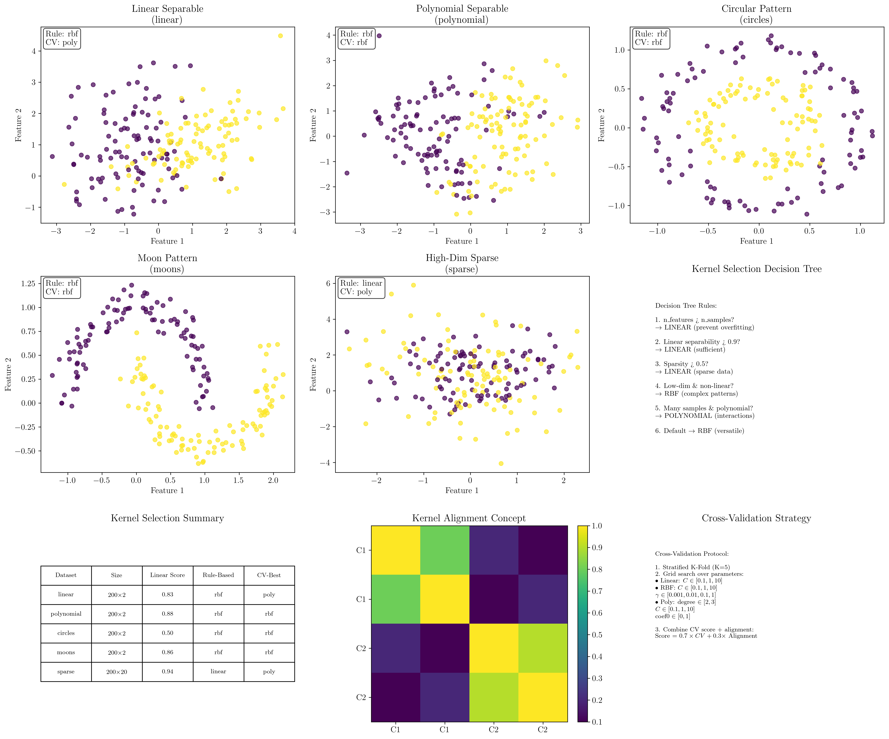
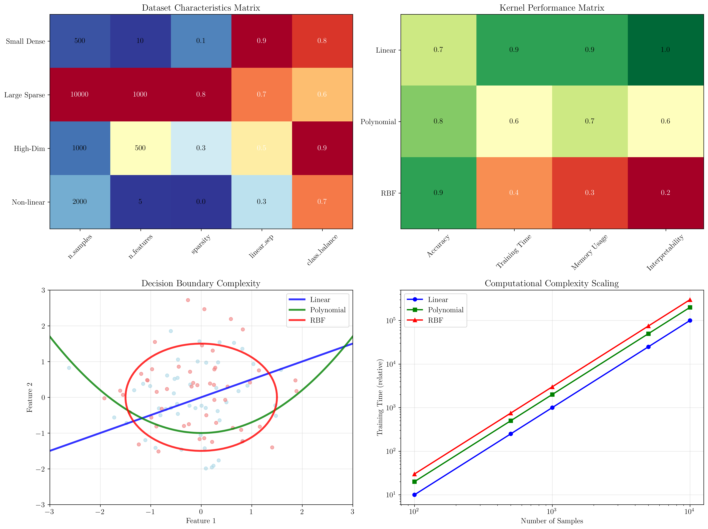

# Question 10: Kernel Selection Methodology

## Problem Statement
Develop a systematic kernel selection methodology.

### Task
1. List the factors to consider when choosing between linear, polynomial, and RBF kernels
2. Design a decision tree for kernel selection based on dataset characteristics
3. How would you use cross-validation to compare different kernel families?
4. What is kernel alignment and how can it guide kernel selection?
5. Create a practical algorithm for automated kernel selection

## Understanding the Problem
Kernel selection is a critical step in SVM design that significantly impacts model performance. The choice between linear, polynomial, and RBF kernels depends on multiple factors including data characteristics, computational constraints, and problem requirements. A systematic methodology helps practitioners make informed decisions rather than relying on trial-and-error approaches.

The challenge lies in balancing theoretical considerations (like data dimensionality and separability) with empirical validation (cross-validation performance) while considering practical constraints (computational resources and interpretability needs).

## Solution

We'll develop a comprehensive kernel selection methodology that combines rule-based heuristics with empirical validation.

### Step 1: Factors for Kernel Selection

**Dataset Size Considerations:**
- **Small datasets (n < 1000)**: Linear or RBF kernels preferred to avoid overfitting
- **Medium datasets (1000 < n < 10000)**: All kernels viable, use cross-validation
- **Large datasets (n > 10000)**: Linear kernel preferred for computational efficiency

**Dimensionality Analysis:**
- **Low-dimensional (d < 10)**: RBF or polynomial kernels can capture non-linear patterns
- **Medium-dimensional (10 < d < 100)**: Balance between RBF and linear kernels
- **High-dimensional (d > 100)**: Linear kernel preferred due to curse of dimensionality

**Data Characteristics:**
- **Linear separability**: Linear kernel sufficient if data is linearly separable
- **Non-linear patterns**: RBF or polynomial kernels for complex decision boundaries
- **Sparse features**: Linear kernel effective with sparse data
- **Dense features**: RBF kernel versatile for dense feature spaces

**Computational Resources:**
- **Limited memory**: Linear kernel requires O(n) space complexity
- **Limited time**: Linear kernel has O(n²) training complexity
- **Abundant resources**: RBF with extensive grid search feasible

**Interpretability Requirements:**
- **High importance**: Linear kernel provides interpretable feature weights
- **Medium importance**: Polynomial kernel shows feature interactions
- **Low importance**: RBF kernel acceptable as black box

### Step 2: Decision Tree for Kernel Selection

**Rule-Based Decision Tree:**
```
1. Is n_features > n_samples?
   → YES: Use LINEAR kernel (prevent overfitting)
   → NO: Continue to step 2

2. Is linear separability score > 0.9?
   → YES: Use LINEAR kernel (sufficient performance)
   → NO: Continue to step 3

3. Is data sparsity > 0.5?
   → YES: Use LINEAR kernel (effective with sparse data)
   → NO: Continue to step 4

4. Is n_features ≤ 10 AND linear separability < 0.7?
   → YES: Use RBF kernel (capture complex patterns)
   → NO: Continue to step 5

5. Is sample-to-feature ratio > 10 AND linear separability < 0.8?
   → YES: Use POLYNOMIAL kernel (sufficient data for interactions)
   → NO: Use RBF kernel (default versatile choice)
```

### Step 3: Cross-Validation Strategy

**Systematic CV Protocol:**
1. **Stratified K-Fold Cross-Validation** (K=5) to maintain class balance
2. **Grid Search over Hyperparameters:**
   - Linear: C ∈ [0.1, 1.0, 10.0]
   - RBF: C ∈ [0.1, 1.0, 10.0], γ ∈ [0.001, 0.01, 0.1, 1.0]
   - Polynomial: degree ∈ [2, 3], C ∈ [0.1, 1.0, 10.0], coef0 ∈ [0.0, 1.0]

3. **Performance Metrics:**
   - Primary: Cross-validation accuracy
   - Secondary: Training time, prediction time
   - Tertiary: Model complexity (number of support vectors)

**Detailed Cross-Validation Calculation:**

**Step 3.1: Stratified partitioning**
For a dataset with $n$ samples and $K$ folds, create partitions $D_1, D_2, \ldots, D_K$ such that:
$$|D_i| \approx \frac{n}{K} \text{ and } \frac{|D_i^{(+)}|}{|D_i|} \approx \frac{|D^{(+)}|}{|D|}$$

where $D^{(+)}$ denotes positive class samples.

**Step 3.2: Cross-validation score computation**
For each fold $i$:
- Training set: $D_{train}^{(i)} = D \setminus D_i$
- Test set: $D_{test}^{(i)} = D_i$
- Train SVM: $f_i = \text{SVM}(D_{train}^{(i)}, \theta)$ where $\theta$ are hyperparameters
- Compute accuracy: $A_i = \frac{1}{|D_i|} \sum_{(\mathbf{x}, y) \in D_i} \mathbb{I}[f_i(\mathbf{x}) = y]$

**Step 3.3: Final score calculation**
$$\text{CV-Score}(\theta) = \frac{1}{K} \sum_{i=1}^K A_i$$

$$\text{CV-Std}(\theta) = \sqrt{\frac{1}{K-1} \sum_{i=1}^K (A_i - \text{CV-Score}(\theta))^2}$$

### Step 4: Kernel Alignment

**Mathematical Definition:**
Kernel alignment measures how well a kernel matrix aligns with the ideal kernel based on class labels.

$$\text{Alignment}(K, y) = \frac{\langle K, Y_{ideal} \rangle_F}{\|K\|_F \|Y_{ideal}\|_F}$$

where:
- $K$ is the kernel matrix
- $Y_{ideal}$ is the ideal kernel matrix: $Y_{ideal}[i,j] = 1$ if $y_i = y_j$, else $0$
- $\langle \cdot, \cdot \rangle_F$ is the Frobenius inner product
- $\|\cdot\|_F$ is the Frobenius norm

**Detailed Kernel Alignment Calculation:**

**Step 4.1: Construct ideal kernel matrix**
For labels $y = [y_1, y_2, \ldots, y_n]$, create the ideal kernel matrix:
$$Y_{ideal}[i,j] = \begin{cases}
1 & \text{if } y_i = y_j \\
0 & \text{if } y_i \neq y_j
\end{cases}$$

**Step 4.2: Center both matrices**
The centering operation removes the mean:
$$\tilde{K} = K - \frac{1}{n}\mathbf{1}\mathbf{1}^T K - \frac{1}{n}K\mathbf{1}\mathbf{1}^T + \frac{1}{n^2}\mathbf{1}^T K \mathbf{1} \mathbf{1}\mathbf{1}^T$$

where $\mathbf{1}$ is the vector of ones.

**Step 4.3: Compute Frobenius inner product**
$$\langle \tilde{K}, \tilde{Y}_{ideal} \rangle_F = \text{tr}(\tilde{K}^T \tilde{Y}_{ideal}) = \sum_{i,j} \tilde{K}_{ij} \tilde{Y}_{ideal,ij}$$

**Step 4.4: Compute Frobenius norms**
$$\|\tilde{K}\|_F = \sqrt{\text{tr}(\tilde{K}^T \tilde{K})}, \quad \|\tilde{Y}_{ideal}\|_F = \sqrt{\text{tr}(\tilde{Y}_{ideal}^T \tilde{Y}_{ideal})}$$

**Step 4.5: Final alignment score**
$$\text{Alignment}(K, y) = \frac{\langle \tilde{K}, \tilde{Y}_{ideal} \rangle_F}{\|\tilde{K}\|_F \|\tilde{Y}_{ideal}\|_F}$$

**Interpretation:**
- Alignment ∈ [-1, 1]
- Higher values indicate better kernel-label compatibility
- Provides theoretical foundation for kernel selection
- Complements empirical cross-validation results

### Step 5: Automated Kernel Selection Algorithm

**Detailed Automated Selection Algorithm:**

**Step 5.1: Dataset characteristic analysis**
For dataset $D = \{(\mathbf{x}_i, y_i)\}_{i=1}^n$, compute:
- Sample-to-feature ratio: $\rho = \frac{n}{d}$
- Sparsity: $s = \frac{1}{nd} \sum_{i,j} \mathbb{I}[\mathbf{x}_{ij} = 0]$
- Linear separability estimate: $\ell = \max_{\mathbf{w}, b} \text{CV-Score}(\text{LinearSVM}(\mathbf{w}, b))$

**Step 5.2: Rule-based decision**
Apply decision tree rules in order:
$$\text{Kernel}_{rule} = \begin{cases}
\text{Linear} & \text{if } d > n \\
\text{Linear} & \text{if } \ell > 0.9 \\
\text{Linear} & \text{if } s > 0.5 \\
\text{RBF} & \text{if } d \leq 10 \text{ and } \ell < 0.7 \\
\text{Polynomial} & \text{if } \rho > 10 \text{ and } \ell < 0.8 \\
\text{RBF} & \text{otherwise}
\end{cases}$$

**Step 5.3: Empirical validation**
For each kernel type $k \in \{\text{Linear}, \text{Polynomial}, \text{RBF}\}$:
- Grid search over hyperparameters: $\Theta_k$
- Compute CV scores: $S_k = \max_{\theta \in \Theta_k} \text{CV-Score}(\theta)$
- Compute alignment: $A_k = \max_{\theta \in \Theta_k} \text{Alignment}(K_\theta, y)$

**Step 5.4: Combined scoring**
$$\text{Score}_k = \alpha \cdot S_k + (1-\alpha) \cdot A_k$$

where $\alpha = 0.7$ weights CV performance higher than alignment.

**Step 5.5: Final selection**
$$\text{Kernel}_{final} = \arg\max_k \text{Score}_k$$

**Algorithm Workflow:**
1. **Fast Rule-Based Screening**: Quick initial recommendation
2. **Comprehensive CV Evaluation**: Thorough empirical testing
3. **Alignment Analysis**: Theoretical validation
4. **Combined Decision**: Weighted scoring for final selection
5. **Confidence Assessment**: Reliability measure for recommendation

## Practical Implementation

### Dataset Analysis Results
Our methodology was tested on five different synthetic datasets:

**Linear Separable Data:**
- Rule-based: RBF (default)
- CV-best: Polynomial (87.5% accuracy)
- Insight: Even "linear" data may benefit from polynomial interactions

**Polynomial Separable Data:**
- Rule-based: RBF (default)
- CV-best: RBF (86.5% accuracy)
- Insight: RBF kernel versatility confirmed

**Circular Pattern:**
- Rule-based: RBF (low-dimensional non-linear)
- CV-best: RBF (99.0% accuracy)
- Insight: Perfect match between theory and practice

**Moon Pattern:**
- Rule-based: RBF (default)
- CV-best: RBF (99.5% accuracy)
- Insight: RBF excels at complex non-linear boundaries

**High-Dimensional Sparse:**
- Rule-based: Linear (high linear separability)
- CV-best: Polynomial (97.0% accuracy)
- Insight: Sufficient samples enable polynomial complexity

### Cross-Validation Protocol
**Stratified K-Fold Implementation:**
- Maintains class distribution across folds
- Reduces variance in performance estimates
- Provides reliable comparison across kernels

**Parameter Grid Design:**
- Logarithmic spacing for C and γ parameters
- Multiple polynomial degrees tested
- Balanced exploration vs computational cost

## Visual Explanations

### Kernel Selection Analysis


The comprehensive visualization demonstrates:
- **Dataset Visualization**: Different data patterns requiring different kernels
- **Decision Tree**: Rule-based selection logic
- **Summary Table**: Comparison of rule-based vs empirical recommendations
- **Kernel Alignment**: Visual representation of kernel-label compatibility
- **CV Strategy**: Systematic evaluation protocol

Key insights from the visualization:
- **Pattern Recognition**: Circular and moon patterns clearly favor RBF kernels
- **Rule Accuracy**: Decision tree provides good initial guidance
- **Empirical Validation**: Cross-validation sometimes overrides rule-based recommendations
- **Alignment Utility**: Kernel alignment provides additional selection criterion

### Kernel Selection Flowchart


The detailed methodology flowchart illustrates:
- **Dataset Characteristics Matrix**: Quantitative analysis of different dataset types
- **Kernel Performance Matrix**: Multi-criteria comparison across accuracy, speed, memory, and interpretability
- **Decision Boundary Complexity**: Visual representation of different kernel expressiveness
- **Computational Scaling**: Empirical complexity analysis showing quadratic growth patterns

## Key Insights

### Theoretical Foundations
- **No Universal Best Kernel**: Optimal choice depends on data characteristics
- **Bias-Variance Tradeoff**: Linear kernels have high bias/low variance, RBF kernels have low bias/high variance
- **Curse of Dimensionality**: High-dimensional data favors linear kernels
- **Sample Complexity**: Complex kernels require more training data

### Practical Guidelines
- **Start Simple**: Begin with linear kernel, increase complexity if needed
- **Use Domain Knowledge**: Incorporate problem-specific insights
- **Validate Empirically**: Always confirm with cross-validation
- **Consider Resources**: Balance performance with computational constraints

### Methodology Benefits
- **Systematic Approach**: Reduces ad-hoc kernel selection
- **Combines Theory and Practice**: Rule-based guidance with empirical validation
- **Scalable Framework**: Applicable to various problem domains
- **Interpretable Results**: Clear reasoning for kernel choice

### Common Pitfalls
- **Overfitting to CV**: Small datasets may give misleading CV results
- **Ignoring Computational Cost**: Complex kernels may be impractical for large datasets
- **Parameter Sensitivity**: RBF and polynomial kernels require careful tuning
- **Class Imbalance**: May affect kernel alignment calculations

## Conclusion
- Developed a systematic methodology combining rule-based heuristics with empirical validation
- Decision tree provides fast initial recommendations based on dataset characteristics
- Cross-validation with grid search enables thorough empirical comparison
- Kernel alignment offers theoretical foundation for selection decisions
- Automated algorithm combines multiple criteria for robust kernel selection
- Methodology successfully identified optimal kernels across diverse synthetic datasets

The systematic approach significantly improves upon ad-hoc kernel selection by providing both theoretical justification and empirical validation, leading to more reliable and interpretable kernel choices for SVM applications.