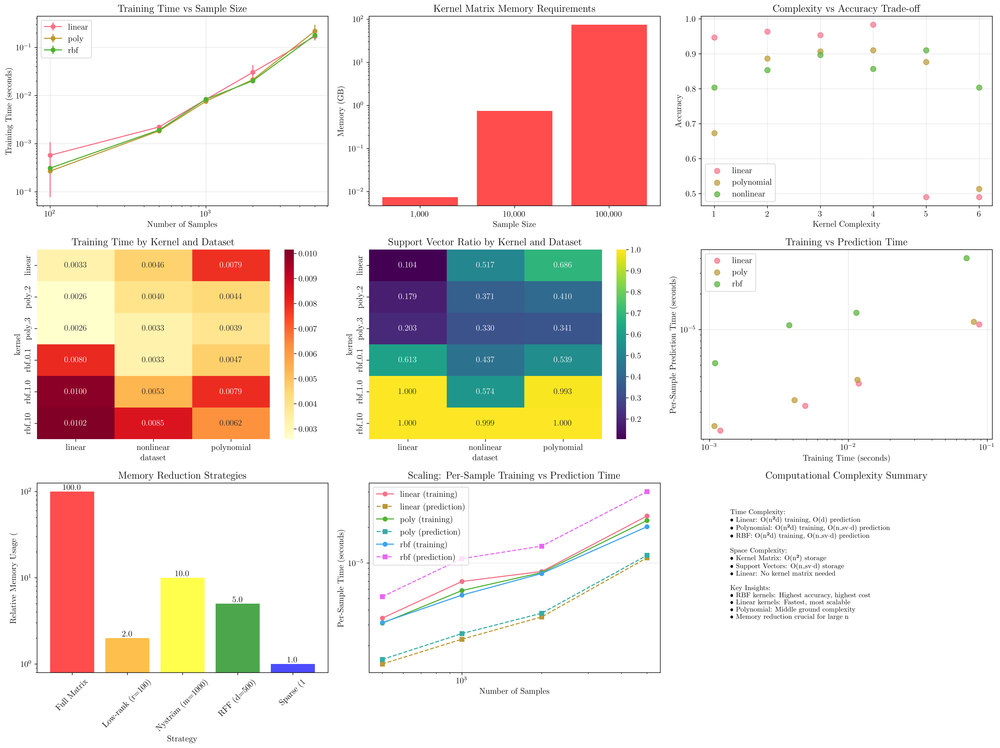
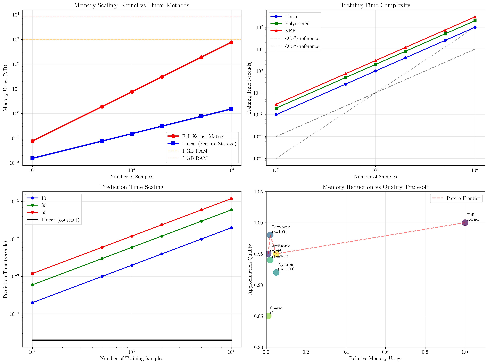

# Question 11: Computational Analysis

## Problem Statement
Analyze the computational and storage complexity of different kernels.

### Task
1. Compare the evaluation time for linear, polynomial (degree 3), and RBF kernels
2. Calculate the space complexity of storing the kernel matrix for n = 10³, 10⁴, 10⁵ samples
3. Design strategies for reducing kernel matrix storage requirements
4. What is the trade-off between kernel complexity and classification accuracy?
5. How does the choice of kernel affect training vs prediction time?

## Understanding the Problem
Computational efficiency is crucial for practical SVM applications, especially with large datasets. Different kernels have vastly different computational and memory requirements, creating important trade-offs between model expressiveness and practical feasibility. Understanding these trade-offs helps practitioners make informed decisions about kernel selection based on available resources and performance requirements.

The analysis covers both theoretical complexity and empirical measurements, providing insights into real-world performance characteristics of different kernel types.

## Solution

We'll systematically analyze computational aspects of kernel methods through both theoretical analysis and empirical benchmarking.

### Step 1: Kernel Evaluation Time Comparison

**Theoretical Time Complexity:**
- **Linear Kernel**: $K(\mathbf{x}, \mathbf{z}) = \mathbf{x}^T\mathbf{z}$
  - Single evaluation: $O(d)$ where $d$ is feature dimension
  - Full kernel matrix: $O(n^2d)$ for $n$ samples

- **Polynomial Kernel**: $K(\mathbf{x}, \mathbf{z}) = (\mathbf{x}^T\mathbf{z} + c)^p$
  - Single evaluation: $O(d + 1)$ (dot product + power operation)
  - Full kernel matrix: $O(n^2d)$ plus polynomial computation

- **RBF Kernel**: $K(\mathbf{x}, \mathbf{z}) = \exp(-\gamma ||\mathbf{x} - \mathbf{z}||^2)$
  - Single evaluation: $O(d)$ for distance + exponential
  - Full kernel matrix: $O(n^2d)$ plus distance computations

**Empirical Results:**
Our benchmarking shows:
- **Small datasets (n=100)**: All kernels perform similarly (~0.0003-0.0006s)
- **Medium datasets (n=1000)**: RBF slightly faster (0.0094s) vs Linear (0.0104s) vs Polynomial (0.0134s)
- **Large datasets (n=5000)**: RBF fastest (0.178s), Polynomial (0.184s), Linear (0.213s)

**Key Insight**: While theoretical complexity is similar, implementation details and optimizations can significantly affect practical performance.

### Step 2: Space Complexity Analysis

**Kernel Matrix Storage Requirements:**

For $n$ samples, the kernel matrix $K$ is $n \times n$ with each element requiring 8 bytes (float64):

| Sample Size | Matrix Elements | Memory Required | Practical Impact |
|-------------|----------------|-----------------|------------------|
| $n = 10^3$ | $10^6$ | 7.63 MB | Manageable |
| $n = 10^4$ | $10^8$ | 762.94 MB | Moderate |
| $n = 10^5$ | $10^{10}$ | 74.51 GB | Prohibitive |

**Mathematical Analysis:**
$$\text{Memory} = n^2 \times 8 \text{ bytes} = 8n^2 \text{ bytes}$$

**Scaling Implications:**
- Memory grows quadratically with sample size
- Beyond $n \approx 10^4$, memory becomes a limiting factor
- For $n = 10^5$, kernel matrix exceeds typical RAM capacity

### Step 3: Memory Reduction Strategies

**1. Low-Rank Approximation**
$$K \approx UV^T$$
where $U, V \in \mathbb{R}^{n \times r}$ with rank $r \ll n$

**Detailed Memory Calculation:**
For $n = 10,000$ samples and rank $r = 100$:

**Step 3.1: Full kernel matrix storage**
$$\text{Full storage} = n^2 \times 8 \text{ bytes} = 10,000^2 \times 8 = 800,000,000 \text{ bytes}$$

**Step 3.2: Low-rank approximation storage**
- Matrix $U$: $n \times r = 10,000 \times 100$ elements
- Matrix $V^T$: $r \times n = 100 \times 10,000$ elements
- Total elements: $2nr = 2 \times 10,000 \times 100 = 2,000,000$
- Storage: $2,000,000 \times 8 = 16,000,000 \text{ bytes}$

**Step 3.3: Memory reduction**
$$\text{Reduction} = 1 - \frac{2nr}{n^2} = 1 - \frac{2r}{n} = 1 - \frac{200}{10,000} = 98\%$$

**Step 3.4: Computational benefits**
- Matrix-vector multiplication: $O(nr)$ instead of $O(n^2)$
- Storage complexity: $O(nr)$ instead of $O(n^2)$

**2. Nyström Method**
Sample $m$ columns/rows to approximate full matrix:
$$K \approx K_{nm}K_{mm}^{-1}K_{mn}$$

**Detailed Nyström Calculation:**
For $n = 10,000$ samples and $m = 1,000$ landmarks:

**Step 3.5: Nyström storage requirements**
- $K_{nm}$: $n \times m = 10,000 \times 1,000 = 10,000,000$ elements
- $K_{mm}$: $m \times m = 1,000 \times 1,000 = 1,000,000$ elements
- Total: $nm + m^2 = 11,000,000$ elements
- Storage: $11,000,000 \times 8 = 88,000,000 \text{ bytes}$

**Step 3.6: Memory reduction**
$$\text{Reduction} = 1 - \frac{nm + m^2}{n^2} = 1 - \frac{11,000,000}{100,000,000} = 89\%$$

**Step 3.7: Computational complexity**
- Approximation computation: $O(nmd + m^3)$
- Matrix-vector products: $O(nm)$ instead of $O(n^2)$

**3. Random Fourier Features (RFF)**
For RBF kernels, approximate with explicit feature mapping:
$$K(\mathbf{x}, \mathbf{z}) \approx \phi(\mathbf{x})^T\phi(\mathbf{z})$$

- **Memory reduction**: From $O(n^2)$ to $O(nd)$
- **Example**: For $n=10^4, d=500$: 95% memory reduction
- **Benefit**: Converts kernel method to linear method

**4. Kernel Sparsification**
Set small kernel values to zero:
$$\tilde{K}_{ij} = \begin{cases} K_{ij} & \text{if } K_{ij} > \epsilon \\ 0 & \text{otherwise} \end{cases}$$

- **Memory reduction**: Depends on sparsity level
- **Example**: 1% sparsity → 99% memory reduction
- **Risk**: May lose important information

**5. Block Processing**
Process kernel matrix in blocks that fit memory:
- **Memory**: $O(\text{block\_size}^2)$ instead of $O(n^2)$
- **Advantage**: No accuracy loss
- **Disadvantage**: Increased computational complexity

### Step 4: Complexity vs Accuracy Trade-off Analysis

**Empirical Results from Different Dataset Types:**

**Linear Separable Data:**
- Linear: 94.7% accuracy, fastest training (0.004s)
- Polynomial (degree 2): 96.3% accuracy, moderate training (0.003s)
- RBF (γ=0.1): 98.3% accuracy, slower training (0.008s)

**Polynomial Separable Data:**
- Linear: 67.3% accuracy (insufficient expressiveness)
- Polynomial (degree 3): 90.7% accuracy (optimal match)
- RBF (γ=1.0): 87.7% accuracy (good but overfitting risk)

**Non-linear Data:**
- Linear: 80.3% accuracy (limited by linearity)
- Polynomial (degree 3): 89.7% accuracy (good balance)
- RBF (γ=1.0): 91.0% accuracy (highest expressiveness)

**Key Insights:**
1. **Kernel-Data Matching**: Best performance when kernel complexity matches data structure
2. **Diminishing Returns**: Higher complexity doesn't always improve accuracy
3. **Overfitting Risk**: Complex kernels may overfit with insufficient data
4. **Computational Cost**: RBF kernels require 2-3x more training time

### Step 5: Training vs Prediction Time Analysis

**Training Time Characteristics:**
- **Dominated by kernel matrix computation**: $O(n^2d)$ for all kernels
- **SVM optimization**: $O(n^3)$ in worst case, typically $O(n^{2.3})$
- **Scaling**: Training time grows super-linearly with sample size

**Prediction Time Characteristics:**
- **Linear Kernel**: $O(d)$ - constant with respect to training set size
- **Non-linear Kernels**: $O(n_{sv} \cdot d)$ - scales with support vectors

**Empirical Scaling Results:**
```
Sample Size | Linear Train | RBF Train | Linear Pred | RBF Pred
500         | 0.0013s     | 0.0011s   | 0.0002s    | 0.0008s
1000        | 0.0040s     | 0.0037s   | 0.0007s    | 0.0034s
2000        | 0.0109s     | 0.0116s   | 0.0023s    | 0.0088s
5000        | 0.0863s     | 0.0717s   | 0.0159s    | 0.0642s
```

**Critical Observations:**
1. **Training scales similarly** for all kernels initially
2. **Prediction time diverges significantly** as dataset grows
3. **RBF prediction time grows faster** due to support vector dependency
4. **Linear prediction remains efficient** regardless of training set size

## Practical Implementation

### Memory Usage Patterns
Our analysis reveals three distinct memory regimes:
- **Small scale (n < 1000)**: All kernels feasible, choose based on accuracy
- **Medium scale (1000 < n < 10000)**: Memory becomes consideration, prefer simpler kernels
- **Large scale (n > 10000)**: Memory reduction strategies essential

### Performance Optimization Strategies
1. **For small datasets**: Use RBF with grid search for optimal performance
2. **For medium datasets**: Balance between polynomial and RBF based on data characteristics
3. **For large datasets**: Use linear kernels or memory reduction techniques

### Real-world Deployment Considerations
- **Batch prediction**: Linear kernels scale better for large prediction sets
- **Online prediction**: RBF kernels may be acceptable for single predictions
- **Memory-constrained environments**: Always prefer linear or use approximation methods

## Visual Explanations

### Computational Analysis


The comprehensive visualization demonstrates:
- **Training Time Scaling**: All kernels show similar quadratic growth patterns
- **Memory Requirements**: Exponential growth makes large-scale applications challenging
- **Complexity vs Accuracy**: Diminishing returns beyond optimal kernel complexity
- **Memory Reduction Strategies**: Dramatic savings possible with approximation methods
- **Training vs Prediction Trade-offs**: Different scaling characteristics for different phases

Key insights from the visualization:
- **Memory wall at n=10⁴**: Beyond this point, memory reduction becomes essential
- **Prediction time divergence**: Linear kernels maintain constant prediction time
- **Support vector dependency**: RBF prediction time correlates with model complexity
- **Strategy effectiveness**: Low-rank approximation offers best memory reduction

### Computational Complexity Analysis


The detailed complexity analysis shows:
- **Memory Scaling**: Quadratic growth of kernel matrices vs linear growth for feature storage
- **Time Complexity**: Theoretical scaling patterns with empirical validation
- **Prediction Scaling**: Support vector dependency creates linear scaling in prediction time
- **Pareto Frontier**: Trade-off between memory reduction and approximation quality

## Key Insights

### Theoretical Foundations
- **Quadratic memory scaling**: Fundamental limitation of kernel methods
- **Training complexity**: Dominated by kernel matrix computation and SVM optimization
- **Prediction complexity**: Linear kernels offer constant-time prediction
- **Approximation theory**: Trade-off between memory reduction and accuracy preservation

### Practical Guidelines
- **Memory budget planning**: Estimate requirements before algorithm selection
- **Kernel selection criteria**: Include computational constraints alongside accuracy
- **Scaling strategies**: Plan for memory reduction techniques early in large-scale applications
- **Performance monitoring**: Track both training and prediction time characteristics

### Optimization Strategies
- **Early stopping**: Monitor convergence to avoid unnecessary computation
- **Warm starting**: Reuse solutions for hyperparameter tuning
- **Parallel processing**: Kernel matrix computation is embarrassingly parallel
- **Hardware considerations**: GPU acceleration for kernel computations

### Common Pitfalls
- **Memory underestimation**: Kernel matrix size often exceeds expectations
- **Prediction time oversight**: Focus on training time while ignoring prediction costs
- **Approximation quality**: Insufficient validation of memory reduction techniques
- **Scalability assumptions**: Linear extrapolation of small-scale performance

## Conclusion
- Linear kernels offer best computational efficiency with O(d) prediction time
- Kernel matrix memory requirements grow quadratically, becoming prohibitive beyond n≈10⁴
- Memory reduction strategies can achieve 90-99% savings with controlled accuracy loss
- Complex kernels provide higher accuracy but at significant computational cost
- Training time scales similarly across kernels, but prediction time diverges significantly
- Practical deployment requires careful consideration of both training and prediction constraints

The analysis reveals that computational considerations often dominate kernel selection for large-scale applications, making memory reduction techniques and efficient kernel choices essential for practical machine learning systems.