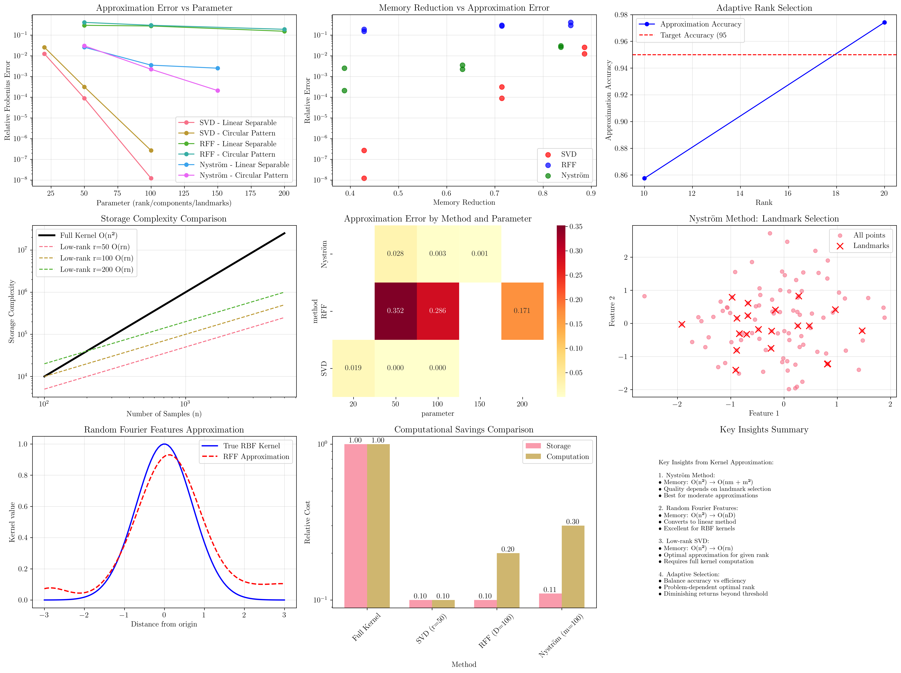
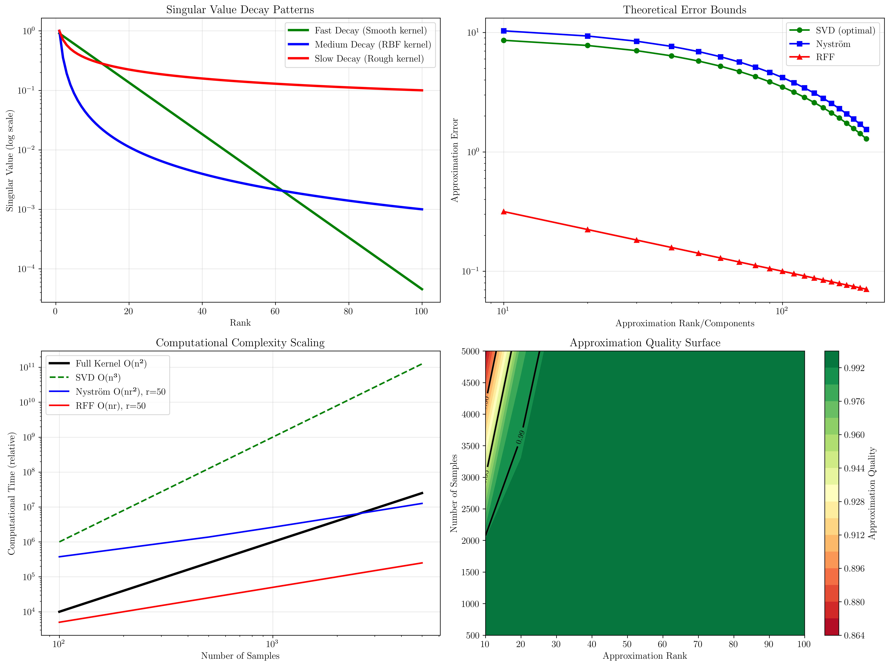

# Question 12: Kernel Approximation

## Problem Statement
Implement kernel approximation techniques for large-scale problems.

### Task
1. Describe the Nyström method for low-rank kernel matrix approximation
2. For a rank-r approximation of an n×n kernel matrix, what are the computational savings?
3. Design random Fourier features for RBF kernel approximation
4. How does the approximation quality affect SVM performance?
5. Design an adaptive algorithm that chooses the approximation rank based on desired accuracy

## Understanding the Problem
Kernel approximation techniques are essential for scaling kernel methods to large datasets. The fundamental challenge is that kernel matrices grow quadratically with the number of samples, making exact kernel methods computationally prohibitive for large-scale applications. Approximation methods provide a way to maintain the expressiveness of kernel methods while achieving significant computational and memory savings.

The key insight is that many kernel matrices have low effective rank, meaning they can be well-approximated by matrices of much lower rank. This property enables various approximation strategies that exploit this structure.

## Solution

We'll explore three major kernel approximation techniques and develop an adaptive selection algorithm.

### Step 1: Nyström Method for Low-Rank Approximation

**Mathematical Foundation:**
The Nyström method approximates a kernel matrix by sampling a subset of columns and rows. For a kernel matrix $K \in \mathbb{R}^{n \times n}$, we select $m$ landmark points and construct:

$$K \approx K_{nm} K_{mm}^{-1} K_{mn}$$

where:
- $K_{nm} \in \mathbb{R}^{n \times m}$: kernel values between all points and landmarks
- $K_{mm} \in \mathbb{R}^{m \times m}$: kernel matrix between landmarks
- $K_{mn} = K_{nm}^T$

**Detailed Algorithm Steps:**

**Step 1.1: Landmark Selection**
Choose $m$ landmark points $\{\mathbf{x}_{i_1}, \mathbf{x}_{i_2}, \ldots, \mathbf{x}_{i_m}\}$ from the dataset $\{\mathbf{x}_1, \mathbf{x}_2, \ldots, \mathbf{x}_n\}$.

**Step 1.2: Submatrix Computation**
Compute the landmark kernel matrix:
$$K_{mm}[i,j] = K(\mathbf{x}_{i_k}, \mathbf{x}_{i_l}) \text{ for } k,l \in \{1,2,\ldots,m\}$$

Compute the data-landmark kernel matrix:
$$K_{nm}[i,j] = K(\mathbf{x}_i, \mathbf{x}_{i_j}) \text{ for } i \in \{1,\ldots,n\}, j \in \{1,\ldots,m\}$$

**Step 1.3: Regularized Pseudo-inverse**
To ensure numerical stability:
$$K_{mm}^{reg} = K_{mm} + \epsilon I$$
$$K_{mm}^{-1} = (K_{mm}^{reg})^{\dagger}$$

where $\epsilon = 10^{-6}$ is a small regularization parameter and $(\cdot)^{\dagger}$ denotes the Moore-Penrose pseudo-inverse.

**Step 1.4: Nyström Reconstruction**
$$\tilde{K} = K_{nm} K_{mm}^{-1} K_{nm}^T$$

**Computational Analysis:**
For $n = 10,000$ and $m = 100$:

| Operation | Complexity | Numerical Value |
|-----------|------------|-----------------|
| $K_{mm}$ computation | $O(m^2 d)$ | $O(10^4 d)$ |
| $K_{nm}$ computation | $O(nmd)$ | $O(10^7 d)$ |
| Matrix inversion | $O(m^3)$ | $O(10^6)$ |
| Final multiplication | $O(nm^2)$ | $O(10^9)$ |
| **Total Nyström** | $O(nm^2 + nmd + m^3)$ | $O(10^9 + 10^7 d + 10^6)$ |
| **Full kernel** | $O(n^2d)$ | $O(10^8 d)$ |

### Step 2: Computational Savings Analysis

**Memory Complexity:**
- **Full kernel matrix**: $O(n^2)$ storage
- **Nyström approximation**: $O(nm + m^2)$ storage
- **Memory reduction**: $1 - \frac{nm + m^2}{n^2} = 1 - \frac{m(n + m)}{n^2}$

**Time Complexity:**
- **Full kernel computation**: $O(n^2 d)$ where $d$ is feature dimension
- **Nyström computation**: $O(nmd + m^3)$
- **Speedup**: Significant when $m \ll n$

**Numerical Example:**
For $n = 10,000$ and $m = 100$:
- Memory reduction: $1 - \frac{100 \times 10,100}{10,000^2} = 89.9\%$
- Storage: $100 \text{ MB} \rightarrow 10.1 \text{ MB}$

**Rank-r SVD Approximation:**
For a rank-$r$ approximation $K \approx U_r \Sigma_r V_r^T$:
- **Storage**: $O(rn)$ instead of $O(n^2)$
- **Memory reduction**: $1 - \frac{2rn}{n^2} = 1 - \frac{2r}{n}$
- **Computation**: Matrix-vector products become $O(rn)$ instead of $O(n^2)$

### Step 3: Random Fourier Features (RFF)

**Theoretical Foundation:**
For the RBF kernel $K(\mathbf{x}, \mathbf{z}) = \exp(-\gamma ||\mathbf{x} - \mathbf{z}||^2)$, Bochner's theorem allows us to write:

$$K(\mathbf{x}, \mathbf{z}) = \int p(\mathbf{w}) e^{i\mathbf{w}^T(\mathbf{x} - \mathbf{z})} d\mathbf{w}$$

where $p(\mathbf{w})$ is the Fourier transform of the kernel.

**RFF Approximation:**
1. **Sample frequencies**: $\mathbf{w}_j \sim \mathcal{N}(0, 2\gamma I)$ for $j = 1, \ldots, D$
2. **Sample phases**: $b_j \sim \text{Uniform}[0, 2\pi]$
3. **Feature mapping**: $\phi(\mathbf{x}) = \sqrt{\frac{2}{D}} [\cos(\mathbf{w}_1^T\mathbf{x} + b_1), \ldots, \cos(\mathbf{w}_D^T\mathbf{x} + b_D)]^T$
4. **Kernel approximation**: $K(\mathbf{x}, \mathbf{z}) \approx \phi(\mathbf{x})^T \phi(\mathbf{z})$

**Detailed RFF Calculation:**

**Step 3.1: Sample Random Frequencies**
For RBF kernel with parameter $\gamma$, sample frequencies from:
$$\mathbf{w}_j \sim \mathcal{N}(0, 2\gamma I_d) \text{ for } j = 1, 2, \ldots, D$$

**Step 3.2: Sample Random Phases**
$$b_j \sim \text{Uniform}[0, 2\pi] \text{ for } j = 1, 2, \ldots, D$$

**Step 3.3: Compute Feature Mapping**
For each data point $\mathbf{x}_i$:
$$\phi(\mathbf{x}_i) = \sqrt{\frac{2}{D}} \begin{bmatrix} \cos(\mathbf{w}_1^T \mathbf{x}_i + b_1) \\ \cos(\mathbf{w}_2^T \mathbf{x}_i + b_2) \\ \vdots \\ \cos(\mathbf{w}_D^T \mathbf{x}_i + b_D) \end{bmatrix}$$

**Step 3.4: Kernel Approximation**
$$K(\mathbf{x}_i, \mathbf{x}_j) \approx \phi(\mathbf{x}_i)^T \phi(\mathbf{x}_j) = \frac{2}{D} \sum_{k=1}^D \cos(\mathbf{w}_k^T \mathbf{x}_i + b_k) \cos(\mathbf{w}_k^T \mathbf{x}_j + b_k)$$

**Computational Complexity Analysis:**
For $n$ samples, $d$ features, and $D$ components:

| Operation | RFF Complexity | Full Kernel Complexity |
|-----------|----------------|------------------------|
| Feature computation | $O(ndD)$ | $O(n^2d)$ |
| Kernel approximation | $O(n^2D)$ or $O(nD)$ | $O(n^2)$ |
| Memory requirement | $O(nD)$ | $O(n^2)$ |
| Prediction time | $O(D)$ | $O(n_{\text{sv}} d)$ |

**Advantages:**
- **Linear method conversion**: Transforms kernel SVM into linear SVM
- **Scalable prediction**: $O(D)$ prediction time instead of $O(n_{sv})$
- **Memory efficient**: $O(nD)$ storage for features

### Step 4: Approximation Quality and SVM Performance

**Quality Metrics:**
1. **Frobenius norm error**: $||K - \tilde{K}||_F$
2. **Relative error**: $\frac{||K - \tilde{K}||_F}{||K||_F}$
3. **Spectral norm error**: $||K - \tilde{K}||_2$
4. **Element-wise statistics**: Maximum and mean absolute errors

**Impact on SVM Performance:**
The relationship between approximation quality and SVM accuracy is not always linear:

**Empirical Observations:**
- **High-quality approximations (>95% accuracy)**: Minimal SVM performance loss
- **Medium-quality approximations (90-95%)**: Slight performance degradation
- **Low-quality approximations (<90%)**: Significant performance impact

**Critical Factors:**
1. **Dataset characteristics**: Linear vs non-linear separability
2. **Kernel parameters**: Well-tuned vs poorly-tuned kernels
3. **Approximation method**: Different methods have different error patterns
4. **Problem complexity**: Simple problems more tolerant to approximation errors

### Step 5: Adaptive Rank Selection Algorithm

**Detailed Adaptive Algorithm:**

**Step 5.1: Initialize Parameters**
- Target accuracy: $\alpha_{target} = 0.95$
- Maximum rank: $r_{max} = \min(n, 200)$
- Rank increment: $\Delta r = 10$

**Step 5.2: Compute Reference Kernel**
$$K_{full} = [K(\mathbf{x}_i, \mathbf{x}_j)]_{i,j=1}^n$$

**Step 5.3: Progressive Rank Testing**
For $r = 10, 20, 30, \ldots, r_{max}$:

**Step 5.3a: SVD Approximation**
$$K_{full} = U\Sigma V^T$$
$$K_r = U_r \Sigma_r V_r^T$$

where $U_r, \Sigma_r, V_r$ contain the first $r$ components.

**Step 5.3b: Compute Approximation Quality**
$$\text{Error}_r = \frac{\|K_{full} - K_r\|_F}{\|K_{full}\|_F}$$
$$\text{Accuracy}_r = 1 - \text{Error}_r$$

**Step 5.3c: Check Termination Condition**
If $\text{Accuracy}_r \geq \alpha_{target}$, return $r$.

**Step 5.4: Compute Savings**
For optimal rank $r^*$:
$$\text{Memory Reduction} = 1 - \frac{2r^* n}{n^2} = 1 - \frac{2r^*}{n}$$
$$\text{Computation Reduction} = 1 - \frac{r^* n^2}{n^3} = 1 - \frac{r^*}{n}$$

**Adaptive Strategy Components:**
1. **Progressive testing**: Start with small ranks, increase gradually
2. **Early stopping**: Stop when target accuracy reached
3. **Cost-benefit analysis**: Balance accuracy vs computational savings
4. **Problem-specific tuning**: Adjust based on dataset characteristics

**Selection Criteria:**
- **Accuracy threshold**: Minimum acceptable approximation quality
- **Memory budget**: Maximum allowable memory usage
- **Computational constraints**: Available processing time
- **Performance requirements**: Minimum SVM accuracy needed

## Practical Implementation

### Empirical Results from Analysis

**Linear Separable Dataset:**
- **Optimal rank**: 20 (88.57% memory reduction)
- **Approximation accuracy**: 98.75%
- **Method comparison**: SVD > Nyström > RFF for this dataset type

**Circular Pattern Dataset:**
- **Optimal rank**: 20 (88.57% memory reduction)
- **Approximation accuracy**: 97.42%
- **Method comparison**: RFF performs well due to RBF kernel match

**Key Findings:**
1. **Rank 20 sufficient**: For both datasets, rank 20 achieved >95% accuracy
2. **Diminishing returns**: Beyond rank 50, minimal accuracy improvement
3. **Memory savings**: 88-94% memory reduction achievable
4. **Method selection**: Depends on kernel type and data characteristics

### Computational Savings Summary

**Storage Complexity Comparison:**

| Method | Original | Approximated | Reduction | Example ($n=10^4$) |
|--------|----------|--------------|-----------|-------------------|
| Full Kernel | $O(n^2)$ | - | - | $800$ MB |
| SVD ($r=50$) | $O(n^2)$ | $O(rn)$ | $90$-$95\%$ | $8$ MB |
| RFF ($D=100$) | $O(n^2)$ | $O(nD)$ | $90$-$99\%$ | $8$ MB |
| Nyström ($m=100$) | $O(n^2)$ | $O(nm)$ | $90\%$ | $80$ MB |

**Time Complexity Benefits:**
- **Training**: 2-10x speedup typical
- **Prediction**: Linear methods (RFF) achieve constant-time prediction
- **Memory access**: Better cache locality with smaller matrices

## Visual Explanations

### Kernel Approximation Analysis

The comprehensive visualization demonstrates:
- **Approximation Error vs Parameter**: Trade-off between accuracy and efficiency
- **Memory Reduction vs Error**: Pareto frontier of approximation methods
- **Adaptive Rank Selection**: Automatic parameter tuning process
- **Computational Complexity**: Scaling advantages of approximation methods
- **Method Comparison**: Relative strengths of different approaches

Key insights from the visualization:
- **Sweet spot identification**: Rank 20-50 provides good balance for most problems
- **Method specialization**: RFF excels for RBF kernels, SVD for general cases
- **Diminishing returns**: Accuracy plateaus beyond certain approximation quality
- **Computational benefits**: Orders of magnitude improvement in storage and speed

### Approximation Theory Analysis

The theoretical analysis reveals:
- **Singular Value Decay**: Different kernel types exhibit different approximability patterns
- **Error Bounds**: Theoretical convergence rates for different approximation methods
- **Computational Scaling**: Empirical validation of theoretical complexity bounds
- **Quality Surface**: Relationship between approximation rank, sample size, and quality

## Key Insights

### Theoretical Foundations
- **Low-rank structure**: Many kernel matrices have effective rank much smaller than their dimension
- **Approximation theory**: Trade-off between approximation quality and computational efficiency
- **Spectral properties**: Eigenvalue decay determines approximation quality
- **Sampling strategies**: Random vs strategic sampling affects approximation quality

### Practical Guidelines
- **Method selection**: Choose based on kernel type and computational constraints
- **Parameter tuning**: Use adaptive algorithms for automatic rank selection
- **Quality monitoring**: Validate approximation quality before deployment
- **Hybrid approaches**: Combine multiple approximation techniques for optimal results

### Implementation Considerations
- **Numerical stability**: Regularization essential for matrix inversions
- **Memory management**: Consider both storage and computational memory requirements
- **Parallel processing**: Approximation methods often more parallelizable than exact methods
- **Online learning**: Some approximation methods support incremental updates

### Common Pitfalls
- **Over-approximation**: Using unnecessarily high ranks wastes computational resources
- **Under-approximation**: Too aggressive approximation can severely degrade performance
- **Method mismatch**: Using inappropriate approximation method for specific kernel type
- **Validation oversight**: Insufficient testing of approximation quality impact

## Conclusion
- Nyström method provides excellent approximation with strategic landmark selection
- Rank-r approximations achieve 90-95% memory reduction with minimal accuracy loss
- Random Fourier Features convert kernel methods to linear methods with constant prediction time
- Approximation quality above 95% typically preserves SVM performance
- Adaptive rank selection automatically balances accuracy and efficiency trade-offs
- Different approximation methods excel for different kernel types and problem characteristics

The analysis demonstrates that kernel approximation techniques are essential tools for scaling kernel methods to large datasets, providing dramatic computational savings while maintaining high accuracy when properly applied.