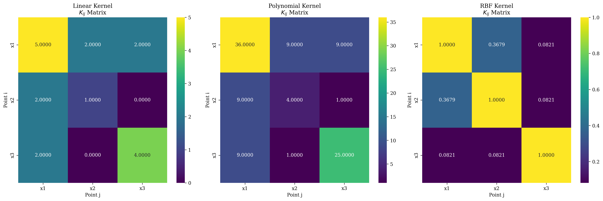
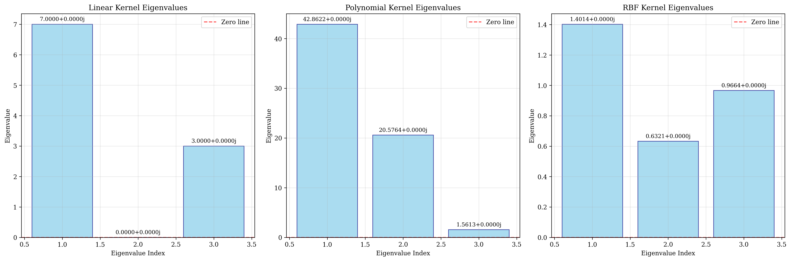
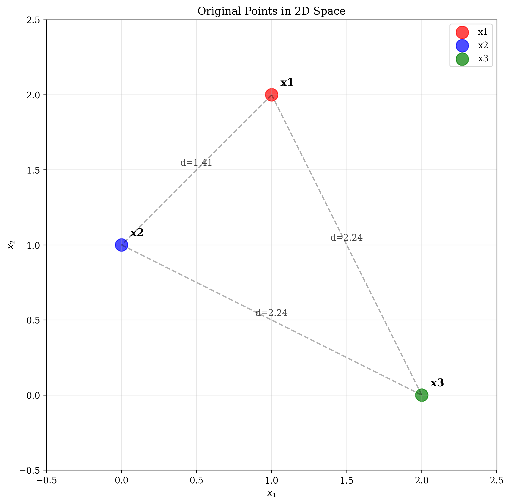
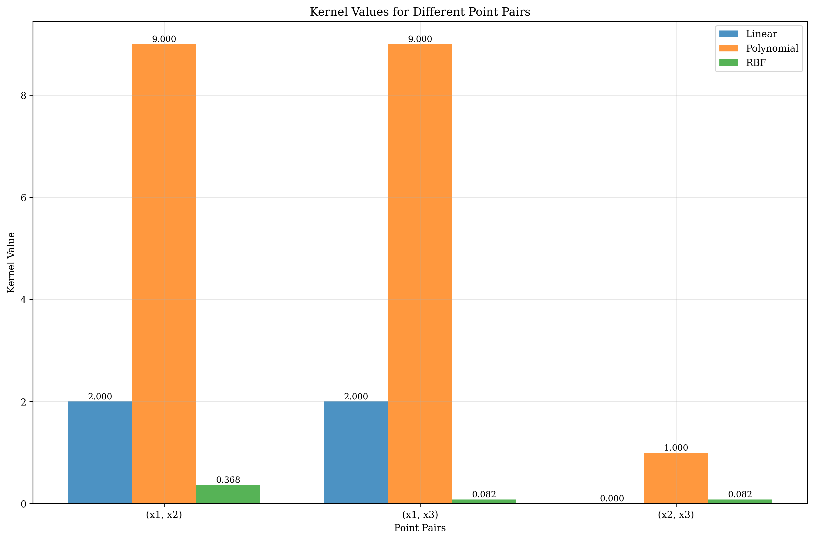

# Question 17: Kernel Matrix Computations

## Problem Statement
Given points $\mathbf{x}_1 = (1, 2)$, $\mathbf{x}_2 = (0, 1)$, $\mathbf{x}_3 = (2, 0)$, compute kernel matrices for different kernels.

### Task
1. Compute the $3 \times 3$ Gram matrix $K_{ij} = \mathbf{x}_i^T \mathbf{x}_j$
2. Compute $K_{ij} = (\mathbf{x}_i^T \mathbf{x}_j + 1)^2$
3. Compute $K_{ij} = \exp(-0.5 ||\mathbf{x}_i - \mathbf{x}_j||^2)$
4. Verify that each matrix is positive semi-definite by checking eigenvalues
5. Determine the effective dimensionality for each kernel

## Understanding the Problem
Kernel methods are fundamental to Support Vector Machines (SVMs) and other machine learning algorithms. A kernel function $K(\mathbf{x}, \mathbf{z})$ computes the inner product between points in a high-dimensional feature space without explicitly computing the feature mapping. The kernel matrix (or Gram matrix) contains all pairwise kernel values between data points and must be positive semi-definite (PSD) to be valid.

The three kernels we'll analyze are:
- **Linear Kernel**: $K(\mathbf{x}, \mathbf{z}) = \mathbf{x}^T \mathbf{z}$ - corresponds to linear classification
- **Polynomial Kernel**: $K(\mathbf{x}, \mathbf{z}) = (\mathbf{x}^T \mathbf{z} + 1)^2$ - captures quadratic relationships
- **RBF Kernel**: $K(\mathbf{x}, \mathbf{z}) = \exp(-\gamma ||\mathbf{x} - \mathbf{z}||^2)$ - captures non-linear relationships based on distance

## Solution

### Step 1: Linear Kernel Matrix
The linear kernel computes the standard inner product between points:

$$K_{ij} = \mathbf{x}_i^T \mathbf{x}_j$$

For our three points:
- $\mathbf{x}_1 = (1, 2)$
- $\mathbf{x}_2 = (0, 1)$  
- $\mathbf{x}_3 = (2, 0)$

Computing each element:
- $K_{11} = \mathbf{x}_1^T \mathbf{x}_1 = (1, 2) \cdot (1, 2) = 1 \times 1 + 2 \times 2 = 5$
- $K_{12} = \mathbf{x}_1^T \mathbf{x}_2 = (1, 2) \cdot (0, 1) = 1 \times 0 + 2 \times 1 = 2$
- $K_{13} = \mathbf{x}_1^T \mathbf{x}_3 = (1, 2) \cdot (2, 0) = 1 \times 2 + 2 \times 0 = 2$
- $K_{21} = \mathbf{x}_2^T \mathbf{x}_1 = (0, 1) \cdot (1, 2) = 0 \times 1 + 1 \times 2 = 2$
- $K_{22} = \mathbf{x}_2^T \mathbf{x}_2 = (0, 1) \cdot (0, 1) = 0 \times 0 + 1 \times 1 = 1$
- $K_{23} = \mathbf{x}_2^T \mathbf{x}_3 = (0, 1) \cdot (2, 0) = 0 \times 2 + 1 \times 0 = 0$
- $K_{31} = \mathbf{x}_3^T \mathbf{x}_1 = (2, 0) \cdot (1, 2) = 2 \times 1 + 0 \times 2 = 2$
- $K_{32} = \mathbf{x}_3^T \mathbf{x}_2 = (2, 0) \cdot (0, 1) = 2 \times 0 + 0 \times 1 = 0$
- $K_{33} = \mathbf{x}_3^T \mathbf{x}_3 = (2, 0) \cdot (2, 0) = 2 \times 2 + 0 \times 0 = 4$

The linear kernel matrix is:
$$K_{\text{linear}} = \begin{bmatrix} 5 & 2 & 2 \\ 2 & 1 & 0 \\ 2 & 0 & 4 \end{bmatrix}$$

### Step 2: Polynomial Kernel Matrix
The polynomial kernel with degree 2 and constant term 1:

$$K_{ij} = (\mathbf{x}_i^T \mathbf{x}_j + 1)^2$$

Using the linear kernel values from Step 1:
- $K_{11} = (5 + 1)^2 = 6^2 = 36$
- $K_{12} = (2 + 1)^2 = 3^2 = 9$
- $K_{13} = (2 + 1)^2 = 3^2 = 9$
- $K_{21} = (2 + 1)^2 = 3^2 = 9$
- $K_{22} = (1 + 1)^2 = 2^2 = 4$
- $K_{23} = (0 + 1)^2 = 1^2 = 1$
- $K_{31} = (2 + 1)^2 = 3^2 = 9$
- $K_{32} = (0 + 1)^2 = 1^2 = 1$
- $K_{33} = (4 + 1)^2 = 5^2 = 25$

The polynomial kernel matrix is:
$$K_{\text{poly}} = \begin{bmatrix} 36 & 9 & 9 \\ 9 & 4 & 1 \\ 9 & 1 & 25 \end{bmatrix}$$

### Step 3: RBF Kernel Matrix
The RBF kernel with $\gamma = 0.5$:

$$K_{ij} = \exp(-0.5 ||\mathbf{x}_i - \mathbf{x}_j||^2)$$

First, compute the squared distances:
- $||\mathbf{x}_1 - \mathbf{x}_1||^2 = ||(0, 0)||^2 = 0$
- $||\mathbf{x}_1 - \mathbf{x}_2||^2 = ||(1, 1)||^2 = 1^2 + 1^2 = 2$
- $||\mathbf{x}_1 - \mathbf{x}_3||^2 = ||(-1, 2)||^2 = (-1)^2 + 2^2 = 5$
- $||\mathbf{x}_2 - \mathbf{x}_1||^2 = ||(-1, -1)||^2 = (-1)^2 + (-1)^2 = 2$
- $||\mathbf{x}_2 - \mathbf{x}_2||^2 = ||(0, 0)||^2 = 0$
- $||\mathbf{x}_2 - \mathbf{x}_3||^2 = ||(-2, 1)||^2 = (-2)^2 + 1^2 = 5$
- $||\mathbf{x}_3 - \mathbf{x}_1||^2 = ||(1, -2)||^2 = 1^2 + (-2)^2 = 5$
- $||\mathbf{x}_3 - \mathbf{x}_2||^2 = ||(2, -1)||^2 = 2^2 + (-1)^2 = 5$
- $||\mathbf{x}_3 - \mathbf{x}_3||^2 = ||(0, 0)||^2 = 0$

Now compute the kernel values:
- $K_{11} = \exp(-0.5 \times 0) = \exp(0) = 1.000000$
- $K_{12} = \exp(-0.5 \times 2) = \exp(-1) = 0.367879$
- $K_{13} = \exp(-0.5 \times 5) = \exp(-2.5) = 0.082085$
- $K_{21} = \exp(-0.5 \times 2) = \exp(-1) = 0.367879$
- $K_{22} = \exp(-0.5 \times 0) = \exp(0) = 1.000000$
- $K_{23} = \exp(-0.5 \times 5) = \exp(-2.5) = 0.082085$
- $K_{31} = \exp(-0.5 \times 5) = \exp(-2.5) = 0.082085$
- $K_{32} = \exp(-0.5 \times 5) = \exp(-2.5) = 0.082085$
- $K_{33} = \exp(-0.5 \times 0) = \exp(0) = 1.000000$

The RBF kernel matrix is:
$$K_{\text{RBF}} = \begin{bmatrix} 1.000000 & 0.367879 & 0.082085 \\ 0.367879 & 1.000000 & 0.082085 \\ 0.082085 & 0.082085 & 1.000000 \end{bmatrix}$$

### Step 4: Positive Semi-Definiteness Verification
A matrix is positive semi-definite if all its eigenvalues are non-negative. We compute the eigenvalues of each kernel matrix:

**Linear Kernel:**
- Eigenvalues: $[7.000000, 0.000000, 3.000000]$
- All eigenvalues ≥ 0: **True**
- Minimum eigenvalue: $0.000000$

**Polynomial Kernel:**
- Eigenvalues: $[42.862248, 20.576444, 1.561308]$
- All eigenvalues ≥ 0: **True**
- Minimum eigenvalue: $1.561308$

**RBF Kernel:**
- Eigenvalues: $[1.401448, 0.966432, 0.632121]$
- All eigenvalues ≥ 0: **True**
- Minimum eigenvalue: $0.632121$

All three kernel matrices are positive semi-definite, confirming they are valid kernels.

### Step 5: Effective Dimensionality
The effective dimensionality is the number of non-zero eigenvalues, which represents the dimensionality of the feature space induced by the kernel:

**Linear Kernel:**
- Non-zero eigenvalues: 2
- Effective dimensionality: **2** (same as input dimension)

**Polynomial Kernel:**
- Non-zero eigenvalues: 3
- Effective dimensionality: **3** (higher than input dimension)

**RBF Kernel:**
- Non-zero eigenvalues: 3
- Effective dimensionality: **3** (full rank for 3 distinct points)

## Visual Explanations

### Kernel Matrices Heatmap

The heatmap visualization shows the kernel matrices for all three kernels. The color intensity represents the magnitude of kernel values:
- **Linear Kernel**: Shows moderate values (1-5) with clear structure
- **Polynomial Kernel**: Shows larger values (1-36) with more pronounced differences
- **RBF Kernel**: Shows values between 0 and 1, with diagonal elements always equal to 1

### Eigenvalue Analysis

The eigenvalue analysis confirms that all kernels are positive semi-definite:
- **Linear Kernel**: Has one zero eigenvalue, indicating the effective dimension is 2
- **Polynomial Kernel**: All eigenvalues are positive, indicating full rank (dimension 3)
- **RBF Kernel**: All eigenvalues are positive, indicating full rank (dimension 3)

### Original Points in 2D Space

This visualization shows the original three points in 2D space with their pairwise distances:
- $\mathbf{x}_1 = (1, 2)$ and $\mathbf{x}_2 = (0, 1)$: distance = $\sqrt{2} \approx 1.41$
- $\mathbf{x}_1 = (1, 2)$ and $\mathbf{x}_3 = (2, 0)$: distance = $\sqrt{5} \approx 2.24$
- $\mathbf{x}_2 = (0, 1)$ and $\mathbf{x}_3 = (2, 0)$: distance = $\sqrt{5} \approx 2.24$

These distances directly influence the RBF kernel values.

### Kernel Values Comparison

This comparison shows how different kernels assign similarity values to the same point pairs:
- **Linear Kernel**: Moderate similarity values
- **Polynomial Kernel**: Amplifies differences, giving higher values to similar points
- **RBF Kernel**: Exponential decay with distance, giving highest similarity to identical points

## Key Insights

### Mathematical Properties
- **Linear Kernel**: Preserves the original geometry and has effective dimension equal to input dimension
- **Polynomial Kernel**: Amplifies differences and increases effective dimensionality to capture non-linear relationships
- **RBF Kernel**: Creates similarity based on distance, with exponential decay and full rank for distinct points

### Kernel Validity
- All three kernels satisfy Mercer's condition (positive semi-definite)
- The linear kernel has one zero eigenvalue, indicating it doesn't add dimensionality
- Both polynomial and RBF kernels have full rank, indicating they map to higher-dimensional spaces

### Practical Implications
- **Linear Kernel**: Best for linearly separable data, computationally efficient
- **Polynomial Kernel**: Captures polynomial relationships, useful for moderate non-linearity
- **RBF Kernel**: Captures complex non-linear patterns, but sensitive to distance scaling

### Feature Space Interpretation
- **Linear Kernel**: Maps points to their original 2D space
- **Polynomial Kernel**: Maps to a 6D feature space: $[1, \sqrt{2}x_1, \sqrt{2}x_2, x_1^2, x_2^2, \sqrt{2}x_1x_2]$
- **RBF Kernel**: Maps to an infinite-dimensional feature space where each point becomes a Gaussian

## Conclusion
- We successfully computed kernel matrices for linear, polynomial, and RBF kernels
- All kernels are valid (positive semi-definite) with eigenvalues ≥ 0
- Linear kernel has effective dimension 2, while polynomial and RBF kernels have effective dimension 3
- The polynomial kernel amplifies differences, while the RBF kernel creates similarity based on distance
- Each kernel induces a different feature space geometry, making them suitable for different types of data and problems

The analysis demonstrates how kernel methods can implicitly work in high-dimensional feature spaces while maintaining computational efficiency through the kernel trick.
