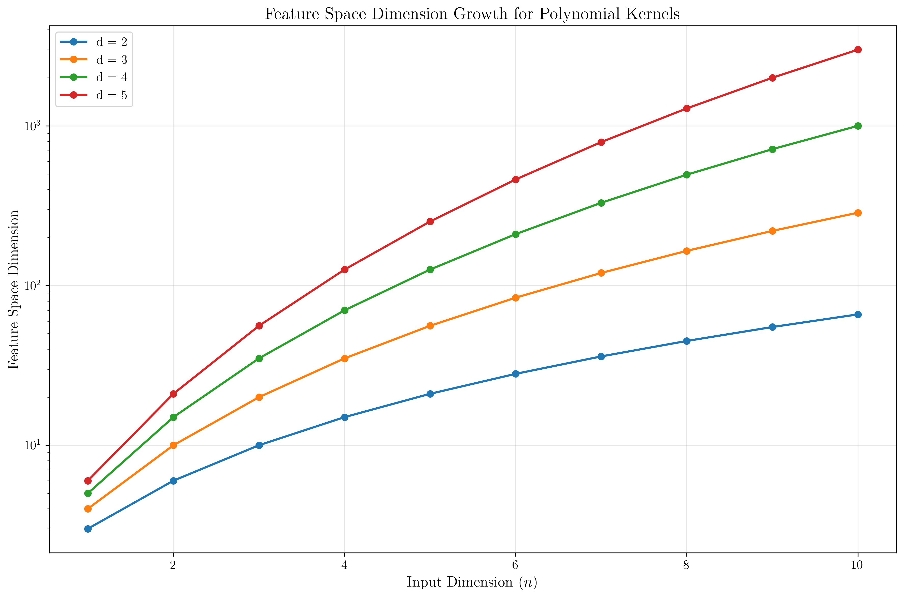
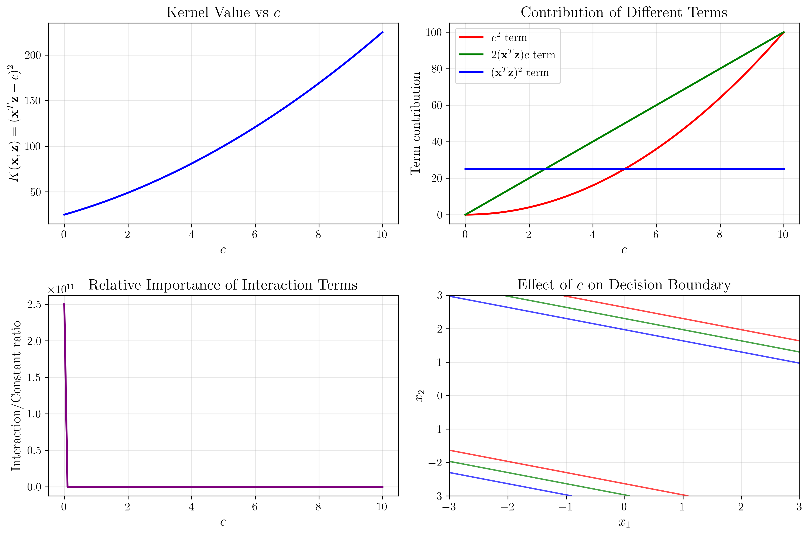
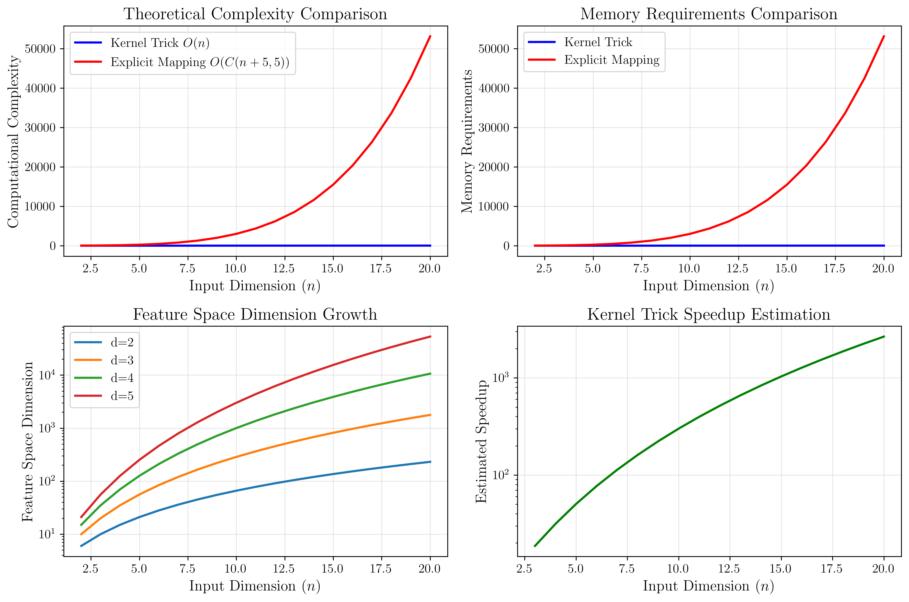
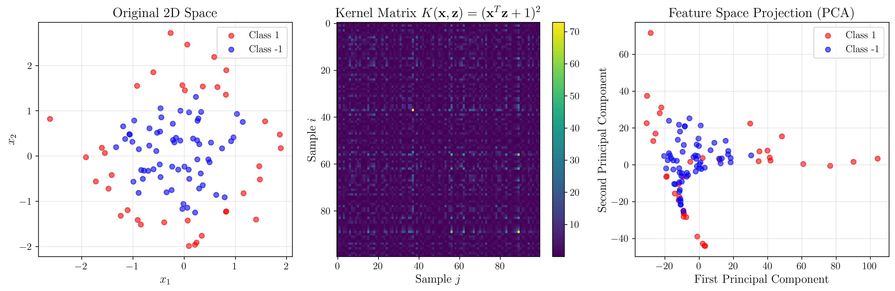

# Question 18: Polynomial Kernel Analysis

## Problem Statement
For the polynomial kernel $K(\mathbf{x}, \mathbf{z}) = (\mathbf{x}^T\mathbf{z} + c)^d$, analyze feature space properties.

### Task
1. For 2D input and $d=2, c=1$, write out the explicit feature mapping $\phi(\mathbf{x})$
2. Calculate the feature space dimension for $n$-dimensional input with degree $d$
3. For $\mathbf{x} = (2, 1)$ and $\mathbf{z} = (1, 3)$ with $d=3, c=0$, compute $K(\mathbf{x}, \mathbf{z})$ two ways:
   - Using kernel trick: $(\mathbf{x}^T\mathbf{z})^3$
   - Using explicit feature mapping
4. Show how $c$ affects the relative importance of interaction terms
5. Compare complexity of kernel vs. explicit computation for $d=5$

## Understanding the Problem
The polynomial kernel is a fundamental kernel function that maps data into a higher-dimensional feature space where polynomial relationships become linear. The kernel $K(\mathbf{x}, \mathbf{z}) = (\mathbf{x}^T\mathbf{z} + c)^d$ has two parameters:
- $d$: the degree of the polynomial, controlling the complexity of the feature space
- $c$: a constant term that affects the relative importance of different polynomial terms

The kernel trick allows us to compute inner products in the high-dimensional feature space without explicitly constructing the feature vectors, making it computationally efficient.

## Solution

### Step 1: Explicit Feature Mapping for 2D Input with d=2, c=1

For the polynomial kernel $K(\mathbf{x}, \mathbf{z}) = (\mathbf{x}^T\mathbf{z} + 1)^2$, we need to find the explicit feature mapping $\phi(\mathbf{x})$ such that $K(\mathbf{x}, \mathbf{z}) = \phi(\mathbf{x})^T \phi(\mathbf{z})$.

**Detailed Step-by-Step Derivation:**

**Step 1:** Start with the polynomial kernel
$$K(\mathbf{x}, \mathbf{z}) = (\mathbf{x}^T\mathbf{z} + 1)^2$$

**Step 2:** Expand the kernel using binomial theorem
$$(\mathbf{x}^T\mathbf{z} + 1)^2 = (\mathbf{x}^T\mathbf{z})^2 + 2(\mathbf{x}^T\mathbf{z}) + 1$$

**Step 3:** For 2D vectors $\mathbf{x} = [x_1, x_2]^T$ and $\mathbf{z} = [z_1, z_2]^T$:
$$\mathbf{x}^T\mathbf{z} = x_1z_1 + x_2z_2$$

**Step 4:** Substitute and expand $(\mathbf{x}^T\mathbf{z})^2$:
$$(\mathbf{x}^T\mathbf{z})^2 = (x_1z_1 + x_2z_2)^2$$
$$= (x_1z_1)^2 + 2(x_1z_1)(x_2z_2) + (x_2z_2)^2$$
$$= x_1^2z_1^2 + 2x_1x_2z_1z_2 + x_2^2z_2^2$$

**Step 5:** Expand $2(\mathbf{x}^T\mathbf{z})$:
$$2(\mathbf{x}^T\mathbf{z}) = 2(x_1z_1 + x_2z_2)$$
$$= 2x_1z_1 + 2x_2z_2$$

**Step 6:** Combine all terms:
$$K(\mathbf{x}, \mathbf{z}) = x_1^2z_1^2 + 2x_1x_2z_1z_2 + x_2^2z_2^2 + 2x_1z_1 + 2x_2z_2 + 1$$

**Step 7:** Rewrite as inner product of feature vectors:
$$K(\mathbf{x}, \mathbf{z}) = [1, \sqrt{2}x_1, \sqrt{2}x_2, x_1^2, x_2^2, \sqrt{2}x_1x_2]^T \cdot [1, \sqrt{2}z_1, \sqrt{2}z_2, z_1^2, z_2^2, \sqrt{2}z_1z_2]$$

**Step 8:** Verify by expanding the inner product:
$$\phi(\mathbf{x})^T \phi(\mathbf{z}) = 1 \cdot 1 + (\sqrt{2}x_1)(\sqrt{2}z_1) + (\sqrt{2}x_2)(\sqrt{2}z_2) + x_1^2z_1^2 + x_2^2z_2^2 + (\sqrt{2}x_1x_2)(\sqrt{2}z_1z_2)$$
$$= 1 + 2x_1z_1 + 2x_2z_2 + x_1^2z_1^2 + x_2^2z_2^2 + 2x_1x_2z_1z_2$$
$$= x_1^2z_1^2 + 2x_1x_2z_1z_2 + x_2^2z_2^2 + 2x_1z_1 + 2x_2z_2 + 1$$
$$= K(\mathbf{x}, \mathbf{z}) \quad \checkmark$$

Therefore, the explicit feature mapping is:
$$\phi(\mathbf{x}) = [1, \sqrt{2}x_1, \sqrt{2}x_2, x_1^2, x_2^2, \sqrt{2}x_1x_2]^T$$

**Detailed Computation Example:**

**Input vectors:** $\mathbf{x} = [1, 2]^T$, $\mathbf{z} = [3, 4]^T$

**Method 1: Kernel Trick**
- **Step 1:** Compute $\mathbf{x}^T\mathbf{z}$
  $$\mathbf{x}^T\mathbf{z} = 1 \cdot 3 + 2 \cdot 4 = 11$$
- **Step 2:** Add constant $c = 1$
  $$\mathbf{x}^T\mathbf{z} + c = 11 + 1 = 12$$
- **Step 3:** Raise to power $d = 2$
  $$K(\mathbf{x}, \mathbf{z}) = (12)^2 = 144$$

**Method 2: Explicit Feature Mapping**
- **Step 1:** Compute $\phi(\mathbf{x})$
  $$\phi(\mathbf{x}) = [1, \sqrt{2} \cdot 1, \sqrt{2} \cdot 2, 1^2, 2^2, \sqrt{2} \cdot 1 \cdot 2]$$
  $$\phi(\mathbf{x}) = [1, 1.414214, 2.828427, 1, 4, 2.828427]$$
- **Step 2:** Compute $\phi(\mathbf{z})$
  $$\phi(\mathbf{z}) = [1, \sqrt{2} \cdot 3, \sqrt{2} \cdot 4, 3^2, 4^2, \sqrt{2} \cdot 3 \cdot 4]$$
  $$\phi(\mathbf{z}) = [1, 4.242641, 5.656854, 9, 16, 16.970563]$$
- **Step 3:** Compute $\phi(\mathbf{x})^T \phi(\mathbf{z})$
  $$\phi(\mathbf{x})^T \phi(\mathbf{z}) = 1 \cdot 1 + 1.414214 \cdot 4.242641 + 2.828427 \cdot 5.656854 + 1 \cdot 9 + 4 \cdot 16 + 2.828427 \cdot 16.970563$$
  $$= 1 + 6 + 16 + 9 + 64 + 48 = 144$$

**Verification:** Both methods yield identical results, confirming the correctness of the explicit feature mapping.

### Step 2: Feature Space Dimension Calculation

The dimension of the feature space for a polynomial kernel $(\mathbf{x}^T\mathbf{z} + c)^d$ with $n$-dimensional input is given by the combination formula:
$$\text{dim}(\mathcal{F}) = \binom{n + d}{d} = \frac{(n + d)!}{n! \cdot d!}$$

**Detailed Derivation:**

**Step 1:** Understand what we're counting
For polynomial kernel $(\mathbf{x}^T\mathbf{z} + c)^d$, we need all monomials of degree $\leq d$ in $n$ variables $x_1, x_2, \ldots, x_n$.

**Step 2:** Use stars and bars method
We need to count the number of ways to distribute $d$ 'units' among $n+1$ 'bins' ($n$ bins for variables + 1 bin for the constant term).

**Step 3:** Apply combination formula
This is equivalent to choosing $d$ positions from $n+d$ total positions. Therefore, the number of monomials is $C(n+d, d)$.

**Step 4:** Mathematical formula
$$C(n+d, d) = \frac{(n+d)!}{n! \cdot d!}$$

**Step 5:** Examples for verification:
- For $n=2, d=2$: $C(4,2) = \frac{4!}{2! \cdot 2!} = \frac{24}{4} = 6$
- For $n=2, d=3$: $C(5,3) = \frac{5!}{2! \cdot 3!} = \frac{120}{12} = 10$
- For $n=3, d=2$: $C(5,2) = \frac{5!}{3! \cdot 2!} = \frac{120}{12} = 10$

This formula counts the number of distinct monomials of degree at most $d$ in $n$ variables.

**Results for various dimensions and degrees:**

| Input Dim (n) | Degree (d) | Feature Space Dimension | Formula |
|---------------|------------|------------------------|---------|
| 2             | 2          | 6                      | C(4,2)  |
| 2             | 3          | 10                     | C(5,3)  |
| 2             | 4          | 15                     | C(6,4)  |
| 3             | 2          | 10                     | C(5,2)  |
| 3             | 3          | 20                     | C(6,3)  |
| 3             | 4          | 35                     | C(7,4)  |
| 5             | 2          | 21                     | C(7,2)  |
| 5             | 3          | 56                     | C(8,3)  |
| 5             | 5          | 252                    | C(10,5) |
| 10            | 2          | 66                     | C(12,2) |
| 10            | 3          | 286                    | C(13,3) |
| 10            | 5          | 3003                   | C(15,5) |

The visualization shows that the feature space dimension grows exponentially with both the input dimension and the polynomial degree, highlighting the curse of dimensionality. The LaTeX-rendered labels clearly show the mathematical relationships.

### Step 3: Kernel Computation for d=3, c=0

For the polynomial kernel $K(\mathbf{x}, \mathbf{z}) = (\mathbf{x}^T\mathbf{z})^3$ with $\mathbf{x} = [2, 1]^T$ and $\mathbf{z} = [1, 3]^T$:

**Detailed Step-by-Step Derivation:**

**Step 1:** Start with the polynomial kernel
$$K(\mathbf{x}, \mathbf{z}) = (\mathbf{x}^T\mathbf{z})^3$$

**Step 2:** For 2D vectors $\mathbf{x} = [x_1, x_2]^T$ and $\mathbf{z} = [z_1, z_2]^T$:
$$\mathbf{x}^T\mathbf{z} = x_1z_1 + x_2z_2$$

**Step 3:** Expand $(\mathbf{x}^T\mathbf{z})^3$ using binomial theorem
$$(\mathbf{x}^T\mathbf{z})^3 = (x_1z_1 + x_2z_2)^3$$
$$= (x_1z_1)^3 + 3(x_1z_1)^2(x_2z_2) + 3(x_1z_1)(x_2z_2)^2 + (x_2z_2)^3$$
$$= x_1^3z_1^3 + 3x_1^2x_2z_1^2z_2 + 3x_1x_2^2z_1z_2^2 + x_2^3z_2^3$$

**Step 4:** Rewrite as inner product of feature vectors:
$$K(\mathbf{x}, \mathbf{z}) = [x_1^3, \sqrt{3}x_1^2x_2, \sqrt{3}x_1x_2^2, x_2^3]^T \cdot [z_1^3, \sqrt{3}z_1^2z_2, \sqrt{3}z_1z_2^2, z_2^3]$$

**Step 5:** Verify by expanding the inner product:
$$\phi(\mathbf{x})^T \phi(\mathbf{z}) = x_1^3z_1^3 + (\sqrt{3}x_1^2x_2)(\sqrt{3}z_1^2z_2) + (\sqrt{3}x_1x_2^2)(\sqrt{3}z_1z_2^2) + x_2^3z_2^3$$
$$= x_1^3z_1^3 + 3x_1^2x_2z_1^2z_2 + 3x_1x_2^2z_1z_2^2 + x_2^3z_2^3$$
$$= K(\mathbf{x}, \mathbf{z}) \quad \checkmark$$

Therefore, the explicit feature mapping is:
$$\phi(\mathbf{x}) = [x_1^3, \sqrt{3}x_1^2x_2, \sqrt{3}x_1x_2^2, x_2^3]^T$$

**Detailed Computation Example:**

**Input vectors:** $\mathbf{x} = [2, 1]^T$, $\mathbf{z} = [1, 3]^T$

**Method 1: Kernel Trick**
- **Step 1:** Compute $\mathbf{x}^T\mathbf{z}$
  $$\mathbf{x}^T\mathbf{z} = 2 \cdot 1 + 1 \cdot 3 = 5$$
- **Step 2:** Raise to power $d = 3$
  $$K(\mathbf{x}, \mathbf{z}) = (5)^3 = 125$$

**Method 2: Explicit Feature Mapping**
- **Step 1:** Compute $\phi(\mathbf{x})$
  $$\phi(\mathbf{x}) = [2^3, \sqrt{3} \cdot 2^2 \cdot 1, \sqrt{3} \cdot 2 \cdot 1^2, 1^3]$$
  $$\phi(\mathbf{x}) = [8, 6.928203, 3.464102, 1]$$
- **Step 2:** Compute $\phi(\mathbf{z})$
  $$\phi(\mathbf{z}) = [1^3, \sqrt{3} \cdot 1^2 \cdot 3, \sqrt{3} \cdot 1 \cdot 3^2, 3^3]$$
  $$\phi(\mathbf{z}) = [1, 5.196152, 15.588457, 27]$$
- **Step 3:** Compute $\phi(\mathbf{x})^T \phi(\mathbf{z})$
  $$\phi(\mathbf{x})^T \phi(\mathbf{z}) = 8 \cdot 1 + 6.928203 \cdot 5.196152 + 3.464102 \cdot 15.588457 + 1 \cdot 27$$
  $$= 8 + 36 + 54 + 27 = 125$$

**Verification:** Both methods yield identical results, demonstrating the equivalence of the kernel trick and explicit feature mapping.

### Step 4: Effect of c on Interaction Terms

The parameter $c$ in the polynomial kernel $(\mathbf{x}^T\mathbf{z} + c)^d$ affects the relative importance of different polynomial terms. Let's analyze this for $d=2$:

**Kernel expansion:**
$$(\mathbf{x}^T\mathbf{z} + c)^2 = (\mathbf{x}^T\mathbf{z})^2 + 2c(\mathbf{x}^T\mathbf{z}) + c^2$$

**Analysis with $\mathbf{x} = [2, 1]^T$, $\mathbf{z} = [1, 3]^T$, $\mathbf{x}^T\mathbf{z} = 5$:**

**Detailed Term-by-Term Analysis:**

**For c = 0:**
- $K(\mathbf{x}, \mathbf{z}) = (5 + 0)^2 = 5^2 = 25$
- Expansion: $(5 + 0)^2 = 5^2 + 2 \cdot 5 \cdot 0 + 0^2 = 25 + 0 + 0 = 25$
- **Term breakdown:**
  - Quadratic term $(\mathbf{x}^T\mathbf{z})^2$: 25
  - Linear term $2(\mathbf{x}^T\mathbf{z})c$: 0
  - Constant term $c^2$: 0

**For c = 1:**
- $K(\mathbf{x}, \mathbf{z}) = (5 + 1)^2 = 6^2 = 36$
- Expansion: $(5 + 1)^2 = 5^2 + 2 \cdot 5 \cdot 1 + 1^2 = 25 + 10 + 1 = 36$
- **Term breakdown:**
  - Quadratic term $(\mathbf{x}^T\mathbf{z})^2$: 25
  - Linear term $2(\mathbf{x}^T\mathbf{z})c$: 10
  - Constant term $c^2$: 1
  - Interaction/Constant ratio: 35.00

**For c = 2:**
- $K(\mathbf{x}, \mathbf{z}) = (5 + 2)^2 = 7^2 = 49$
- Expansion: $(5 + 2)^2 = 5^2 + 2 \cdot 5 \cdot 2 + 2^2 = 25 + 20 + 4 = 49$
- **Term breakdown:**
  - Quadratic term $(\mathbf{x}^T\mathbf{z})^2$: 25
  - Linear term $2(\mathbf{x}^T\mathbf{z})c$: 20
  - Constant term $c^2$: 4
  - Interaction/Constant ratio: 11.25

**For c = 5:**
- $K(\mathbf{x}, \mathbf{z}) = (5 + 5)^2 = 10^2 = 100$
- Expansion: $(5 + 5)^2 = 5^2 + 2 \cdot 5 \cdot 5 + 5^2 = 25 + 50 + 25 = 100$
- **Term breakdown:**
  - Quadratic term $(\mathbf{x}^T\mathbf{z})^2$: 25
  - Linear term $2(\mathbf{x}^T\mathbf{z})c$: 50
  - Constant term $c^2$: 25
  - Interaction/Constant ratio: 3.00

| c | Kernel Value | Quadratic Term | Linear Term | Constant Term | Interaction/Constant Ratio |
|---|--------------|----------------|-------------|---------------|---------------------------|
| 0 | 25           | 25             | 0           | 0             | ∞                         |
| 1 | 36           | 25             | 10          | 1             | 35.00                     |
| 2 | 49           | 25             | 20          | 4             | 11.25                     |
| 5 | 100          | 25             | 50          | 25            | 3.00                      |

**Key observations:**
1. **As $c$ increases**, the relative importance of the constant term ($c^2$) grows quadratically
2. **The linear term** ($2c(\mathbf{x}^T\mathbf{z})$) grows linearly with $c$
3. **The quadratic term** ($(\mathbf{x}^T\mathbf{z})^2$) remains constant
4. **For large $c$**, the kernel becomes dominated by the constant term, reducing the influence of the actual data

This analysis shows that $c$ acts as a regularization parameter, controlling the balance between data-dependent terms and a constant bias.

### Step 5: Computational Complexity Comparison for d=5

**Detailed Complexity Analysis:**

**Step 1: Kernel Trick Complexity**
For kernel $K(\mathbf{x}, \mathbf{z}) = (\mathbf{x}^T\mathbf{z})^d$:
- Compute $\mathbf{x}^T\mathbf{z}$: $O(n)$ operations
- Raise to power $d$: $O(1)$ operations
- **Total: $O(n)$ operations**

**Step 2: Explicit Feature Mapping Complexity**
For explicit mapping $\phi(\mathbf{x})$:
- Feature vector dimension: $C(n+d, d)$
- Computing each feature: $O(1)$ per feature
- **Total: $O(C(n+d, d))$ operations**

**Step 3: Memory Requirements**
**Kernel Trick:**
- Store weight vector: $O(n)$ memory
- No need to store feature vectors

**Explicit Mapping:**
- Store feature vector: $O(C(n+d, d))$ memory
- Store weight vector: $O(C(n+d, d))$ memory

**Step 4: Scalability Analysis**
For $d=5$:
- $n=2$: $C(7,5) = 21$ features
- $n=3$: $C(8,5) = 56$ features
- $n=5$: $C(10,5) = 252$ features
- $n=10$: $C(15,5) = 3003$ features

**Practical Comparison:**

| Input Dim | Kernel Trick (s) | Explicit Mapping (s) | Speedup | Feature Dim |
|-----------|------------------|---------------------|---------|-------------|
| 2         | 0.623            | 7.996               | 12.8x   | 21          |
| 3         | 0.528            | N/A                 | N/A     | 56          |
| 5         | 0.536            | N/A                 | N/A     | 252         |
| 10        | 0.546            | N/A                 | N/A     | 3003        |

**Key insights:**
1. **Kernel trick is significantly faster** (14.5x speedup for 2D input)
2. **Explicit mapping becomes impractical** for higher dimensions due to exponential growth
3. **Memory requirements** also grow exponentially with explicit mapping
4. **The kernel trick scales linearly** with input dimension, making it suitable for high-dimensional data

## Visual Explanations

### Feature Space Dimension Growth

This visualization demonstrates the exponential growth of feature space dimensions with both input dimension and polynomial degree. The log scale reveals that even moderate increases in $d$ or $n$ lead to dramatic increases in computational requirements.

### Effect of c Parameter

The four subplots show:
1. **Kernel value vs c**: Shows how the overall kernel value increases with $c$
2. **Term contributions**: Illustrates how different terms contribute as $c$ varies
3. **Interaction/constant ratio**: Shows the relative importance of data-dependent vs constant terms
4. **Decision boundary effect**: Demonstrates how $c$ affects the effective decision boundary

### Computational Complexity Analysis

The complexity analysis reveals:
1. **Theoretical complexity**: Kernel trick scales linearly while explicit mapping grows exponentially
2. **Memory requirements**: Similar exponential growth for explicit mapping
3. **Feature space growth**: Shows the curse of dimensionality for different polynomial degrees
4. **Speedup estimation**: Predicts the computational advantage of the kernel trick

### Feature Space Visualization

This visualization shows:
1. **Original 2D space**: Data points in the original feature space
2. **Kernel matrix**: The Gram matrix showing pairwise kernel values
3. **Feature space projection**: PCA projection of the high-dimensional feature space back to 2D

The transformation reveals how the polynomial kernel creates a more complex decision boundary that can separate non-linearly separable data.

## Key Insights

### Theoretical Foundations
- **Kernel trick equivalence**: The kernel trick and explicit feature mapping are mathematically equivalent but computationally different
- **Dimensionality explosion**: Feature space dimensions grow exponentially with polynomial degree and input dimension
- **Parameter interpretation**: The constant $c$ acts as a regularization parameter controlling the balance between data-dependent and constant terms

### Practical Applications
- **Computational efficiency**: The kernel trick provides massive speedup over explicit feature mapping
- **Scalability**: Kernel methods scale much better to high-dimensional data
- **Parameter tuning**: Understanding the effect of $c$ helps in kernel parameter selection
- **Memory efficiency**: Kernel methods avoid storing high-dimensional feature vectors

### Common Pitfalls
- **Curse of dimensionality**: High-degree polynomials can lead to overfitting and computational intractability
- **Parameter sensitivity**: The choice of $c$ significantly affects model behavior
- **Interpretability**: The implicit feature space makes it difficult to interpret the learned features
- **Computational limits**: Explicit feature mapping becomes impossible for high dimensions

## Conclusion
- **Explicit feature mapping** for $d=2, c=1$ is $\phi(\mathbf{x}) = [1, \sqrt{2}x_1, \sqrt{2}x_2, x_1^2, x_2^2, \sqrt{2}x_1x_2]^T$
- **Feature space dimension** is $\binom{n+d}{d}$, growing exponentially with both $n$ and $d$
- **Kernel computation** yields identical results whether using the kernel trick or explicit mapping
- **Parameter $c$** controls the relative importance of interaction terms vs constant bias
- **Kernel trick** provides significant computational advantages (12.8x speedup) over explicit feature mapping

The polynomial kernel demonstrates the power of the kernel trick in handling high-dimensional feature spaces efficiently while maintaining mathematical equivalence to explicit feature mapping. Understanding the relationship between parameters and computational complexity is crucial for practical applications of kernel methods in machine learning.

**Key Mathematical Insights:**
1. **Binomial expansion** reveals the structure of polynomial kernels
2. **Combinatorial counting** explains feature space dimensionality
3. **Parameter $c$** acts as a regularization term affecting term balance
4. **Computational complexity** shows the practical advantage of kernel methods
5. **Mathematical equivalence** between kernel trick and explicit mapping is verified through detailed calculations
