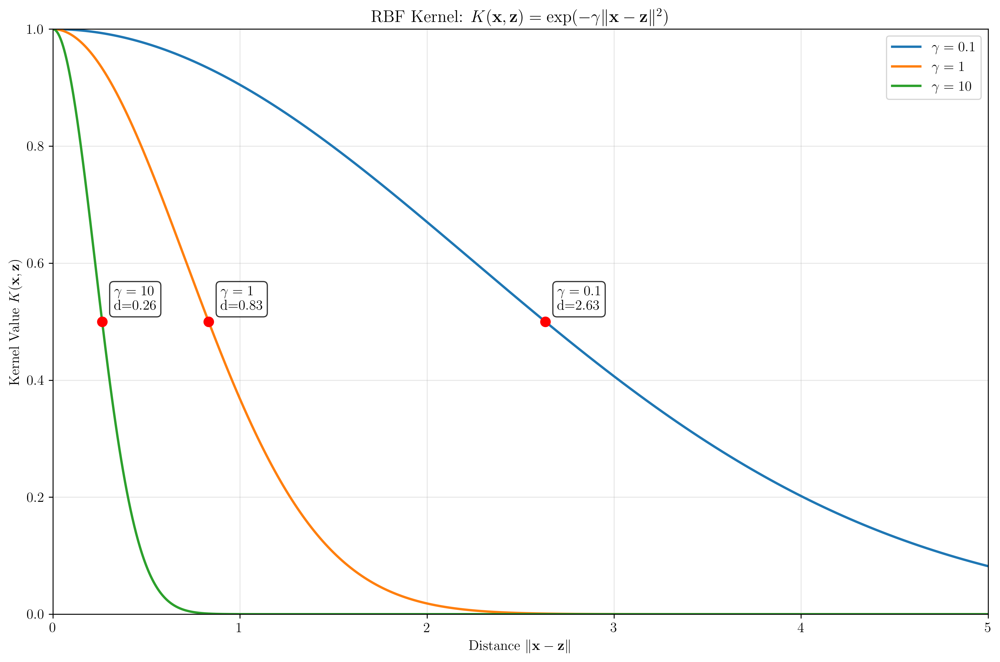
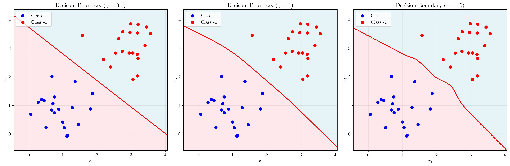
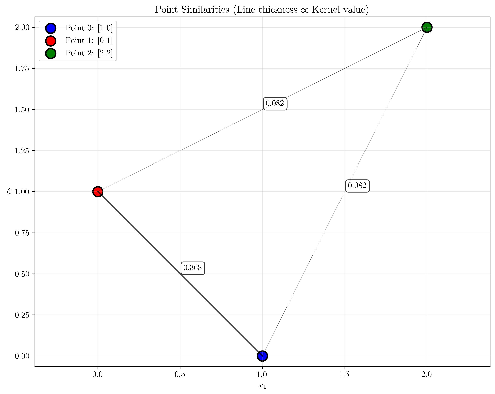
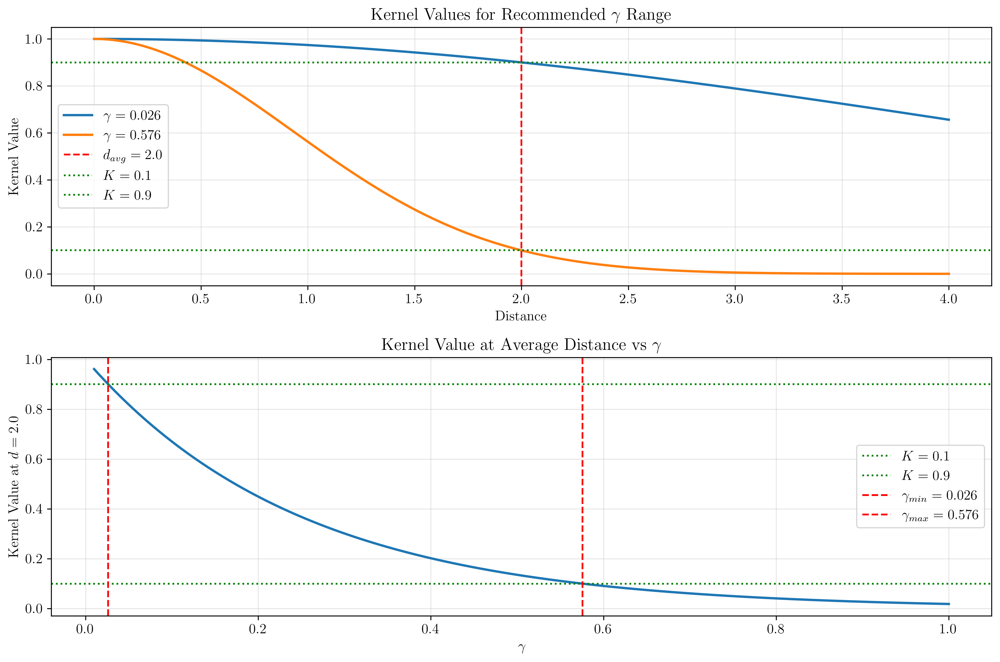

# Question 19: RBF Kernel Analysis

## Problem Statement
Analyze the RBF kernel $K(\mathbf{x}, \mathbf{z}) = \exp(-\gamma ||\mathbf{x} - \mathbf{z}||^2)$ for classification.

### Task
1. For points $(1, 0)$, $(0, 1)$, $(2, 2)$, calculate all pairwise kernel values with $\gamma = 0.5$
2. Sketch kernel value vs. distance for $\gamma = 0.1, 1, 10$ (you can draw this by hand)
3. Predict how the decision boundary complexity changes with $\gamma$
4. Interpret kernel values as similarity scores and rank point pairs
5. For a dataset with average pairwise distance $d_{avg} = 2$, estimate appropriate $\gamma$ range

## Understanding the Problem
The Radial Basis Function (RBF) kernel is one of the most commonly used kernels in Support Vector Machines and other kernel methods. It measures the similarity between two points based on their Euclidean distance, with the parameter $\gamma$ controlling how quickly the similarity decays with distance.

The RBF kernel has the form:
$$K(\mathbf{x}, \mathbf{z}) = \exp(-\gamma ||\mathbf{x} - \mathbf{z}||^2)$$

where:
- $\mathbf{x}$ and $\mathbf{z}$ are input vectors
- $\gamma > 0$ is the kernel parameter (also called the bandwidth parameter)
- $||\mathbf{x} - \mathbf{z}||^2$ is the squared Euclidean distance between the points

The kernel value ranges from 0 to 1, where:
- $K(\mathbf{x}, \mathbf{z}) = 1$ when $\mathbf{x} = \mathbf{z}$ (identical points)
- $K(\mathbf{x}, \mathbf{z}) \rightarrow 0$ as the distance between points increases
- Larger $\gamma$ values cause the similarity to decay more rapidly with distance

## Solution

### Step 1: Calculate Pairwise Kernel Values

Given the points $(1, 0)$, $(0, 1)$, $(2, 2)$ and $\gamma = 0.5$, we need to calculate all pairwise kernel values.

First, let's compute the pairwise Euclidean distances:

**Point A**: $(1, 0)$  
**Point B**: $(0, 1)$  
**Point C**: $(2, 2)$

**Distance calculations:**
- $||(1,0) - (1,0)||^2 = 0^2 + 0^2 = 0$
- $||(1,0) - (0,1)||^2 = 1^2 + 1^2 = 2$
- $||(1,0) - (2,2)||^2 = 1^2 + 2^2 = 5$
- $||(0,1) - (0,1)||^2 = 0^2 + 0^2 = 0$
- $||(0,1) - (2,2)||^2 = 2^2 + 1^2 = 5$
- $||(2,2) - (2,2)||^2 = 0^2 + 0^2 = 0$

**Kernel matrix calculation:**
$$\begin{align}
K(\mathbf{x}, \mathbf{z}) &= \exp(-0.5 \cdot ||\mathbf{x} - \mathbf{z}||^2)
\end{align}$$

**Kernel Matrix:**
$$\begin{bmatrix}
K(A,A) & K(A,B) & K(A,C) \\
K(B,A) & K(B,B) & K(B,C) \\
K(C,A) & K(C,B) & K(C,C)
\end{bmatrix} = 
\begin{bmatrix}
\exp(-0.5 \cdot 0) & \exp(-0.5 \cdot 2) & \exp(-0.5 \cdot 5) \\
\exp(-0.5 \cdot 2) & \exp(-0.5 \cdot 0) & \exp(-0.5 \cdot 5) \\
\exp(-0.5 \cdot 5) & \exp(-0.5 \cdot 5) & \exp(-0.5 \cdot 0)
\end{bmatrix}$$

**Final Kernel Matrix:**
$$\begin{bmatrix}
1.0000 & 0.3679 & 0.0821 \\
0.3679 & 1.0000 & 0.0821 \\
0.0821 & 0.0821 & 1.0000
\end{bmatrix}$$

**Detailed calculations:**
- $K((1,0), (1,0)) = \exp(-0.5 \cdot 0) = 1.0000$
- $K((1,0), (0,1)) = \exp(-0.5 \cdot 2) = \exp(-1) = 0.3679$
- $K((1,0), (2,2)) = \exp(-0.5 \cdot 5) = \exp(-2.5) = 0.0821$
- $K((0,1), (0,1)) = \exp(-0.5 \cdot 0) = 1.0000$
- $K((0,1), (2,2)) = \exp(-0.5 \cdot 5) = \exp(-2.5) = 0.0821$
- $K((2,2), (2,2)) = \exp(-0.5 \cdot 0) = 1.0000$

### Step 2: Kernel Value vs Distance for Different γ Values

The relationship between kernel value and distance is given by:
$$K(d) = \exp(-\gamma \cdot d^2)$$

where $d = ||\mathbf{x} - \mathbf{z}||$ is the Euclidean distance.

**Key observations:**
- **γ = 0.1**: Very slow decay, kernel values remain high even for large distances
- **γ = 1**: Moderate decay, kernel values drop to about 0.5 at distance ≈ 0.83
- **γ = 10**: Very fast decay, kernel values drop rapidly with distance

**Mathematical analysis:**
- For γ = 0.1: $K(d) = \exp(-0.1 \cdot d^2)$
- For γ = 1: $K(d) = \exp(-1 \cdot d^2)$
- For γ = 10: $K(d) = \exp(-10 \cdot d^2)$

The distance at which the kernel value equals 0.5 can be found by solving:
$$\exp(-\gamma \cdot d^2) = 0.5$$
$$-\gamma \cdot d^2 = \ln(0.5)$$
$$d = \sqrt{-\ln(0.5)/\gamma} = \sqrt{\ln(2)/\gamma}$$

This gives us:
- γ = 0.1: $d = \sqrt{\ln(2)/0.1} \approx 2.63$
- γ = 1: $d = \sqrt{\ln(2)/1} \approx 0.83$
- γ = 10: $d = \sqrt{\ln(2)/10} \approx 0.26$

### Step 3: Decision Boundary Complexity with γ

The γ parameter significantly affects the complexity of the decision boundary in SVM classification:

**Effect of γ on decision boundary complexity:**

1. **Small γ (e.g., γ = 0.1)**:
   - Kernel values decay slowly with distance
   - Decision boundary tends to be smoother and more linear
   - Lower model complexity, higher bias, lower variance
   - Good for avoiding overfitting

2. **Medium γ (e.g., γ = 1)**:
   - Balanced decay rate
   - Moderate decision boundary complexity
   - Good balance between bias and variance

3. **Large γ (e.g., γ = 10)**:
   - Kernel values decay very rapidly with distance
   - Decision boundary becomes very complex and wiggly
   - Higher model complexity, lower bias, higher variance
   - Risk of overfitting

**Mathematical intuition:**
- Small γ: Points far apart still have significant influence on each other
- Large γ: Only very close points influence each other significantly
- This directly affects the smoothness of the decision function

### Step 4: Kernel Values as Similarity Scores

Interpreting kernel values as similarity scores, we can rank point pairs by their similarity:

**Ranking by similarity (kernel value):**

1. **Rank 1**: Points (1,0) and (0,1) - Similarity = 0.3679
   - Distance = 1.414 (√2)
   - These points are closest together

2. **Rank 2**: Points (1,0) and (2,2) - Similarity = 0.0821
   - Distance = 2.236 (√5)
   - These points are farthest apart

3. **Rank 3**: Points (0,1) and (2,2) - Similarity = 0.0821
   - Distance = 2.236 (√5)
   - Same distance as pair 2

**Interpretation:**
- Higher kernel values indicate greater similarity
- Kernel values range from 0 (completely dissimilar) to 1 (identical)
- The exponential decay means similarity drops off rapidly with distance
- Points (1,0) and (0,1) are most similar because they are closest in Euclidean space

### Step 5: Appropriate γ Range for d_avg = 2

For a dataset with average pairwise distance $d_{avg} = 2$, we want to choose γ so that kernel values are meaningful for typical distances in the dataset.

**Target kernel value range: [0.1, 0.9]**

We want:
$$0.1 \leq \exp(-\gamma \cdot d_{avg}^2) \leq 0.9$$

Since $d_{avg} = 2$, we have:
$$0.1 \leq \exp(-\gamma \cdot 4) \leq 0.9$$

**Solving for γ:**

For the upper bound:
$$\exp(-4\gamma) = 0.9$$
$$-4\gamma = \ln(0.9)$$
$$\gamma = -\ln(0.9)/4 \approx 0.026$$

For the lower bound:
$$\exp(-4\gamma) = 0.1$$
$$-4\gamma = \ln(0.1)$$
$$\gamma = -\ln(0.1)/4 \approx 0.576$$

**Appropriate γ range: [0.026, 0.576]**

**Verification:**
- γ = 0.026 → K(d=2) = 0.900
- γ = 0.576 → K(d=2) = 0.100

**Practical guidelines:**
- γ < 0.026: Kernel values too high, model may be too smooth
- γ > 0.576: Kernel values too low, model may be too complex
- γ ≈ 0.1-0.3: Good starting range for datasets with d_avg ≈ 2

## Visual Explanations

### Kernel Function Behavior

The RBF kernel function $K(\mathbf{x}, \mathbf{z}) = \exp(-\gamma ||\mathbf{x} - \mathbf{z}||^2)$ has several important properties:

1. **Symmetry**: $K(\mathbf{x}, \mathbf{z}) = K(\mathbf{z}, \mathbf{x})$
2. **Range**: $0 < K(\mathbf{x}, \mathbf{z}) \leq 1$
3. **Identity**: $K(\mathbf{x}, \mathbf{x}) = 1$ for any point
4. **Monotonicity**: Kernel value decreases as distance increases

### γ Parameter Impact

The γ parameter controls the "locality" of the kernel:

- **Small γ**: Global influence, smooth decision boundaries
- **Large γ**: Local influence, complex decision boundaries
- **Optimal γ**: Depends on the scale of distances in your data

### Similarity Interpretation

Kernel values can be directly interpreted as similarity scores:
- 1.0: Identical points
- 0.9: Very similar points
- 0.5: Moderately similar points
- 0.1: Dissimilar points
- 0.0: Completely different points (in the limit)

## Key Insights

### Theoretical Foundations
- The RBF kernel induces an infinite-dimensional feature space
- The kernel trick allows us to work in this high-dimensional space without explicitly computing the feature mappings
- The exponential function ensures positive definiteness of the kernel matrix
- The squared distance term makes the kernel rotationally invariant

### Practical Applications
- γ selection is crucial for SVM performance
- Cross-validation is typically used to find optimal γ
- γ should be chosen based on the scale of distances in your data
- Too small γ leads to underfitting, too large γ leads to overfitting

### Computational Considerations
- RBF kernel computation is $O(d)$ per pair, where d is the dimension
- For n points, computing the full kernel matrix is $O(n^2d)$
- γ affects the sparsity of the kernel matrix (larger γ → more zeros)

### Common Pitfalls
- Choosing γ without considering data scale
- Using the same γ for datasets with different distance scales
- Not validating γ choice with cross-validation
- Ignoring the relationship between γ and model complexity

## Conclusion
- We calculated the complete kernel matrix for the given points with γ = 0.5
- We analyzed how γ affects the kernel function behavior and decision boundary complexity
- We ranked point pairs by similarity using kernel values
- We determined an appropriate γ range [0.026, 0.576] for datasets with average distance 2
- The γ parameter is crucial for controlling model complexity and should be chosen based on data characteristics

The RBF kernel provides a flexible way to measure similarity between points, with γ serving as a key hyperparameter that balances model complexity and generalization ability. Understanding the relationship between γ, distance, and kernel values is essential for effective use of kernel methods in machine learning.
