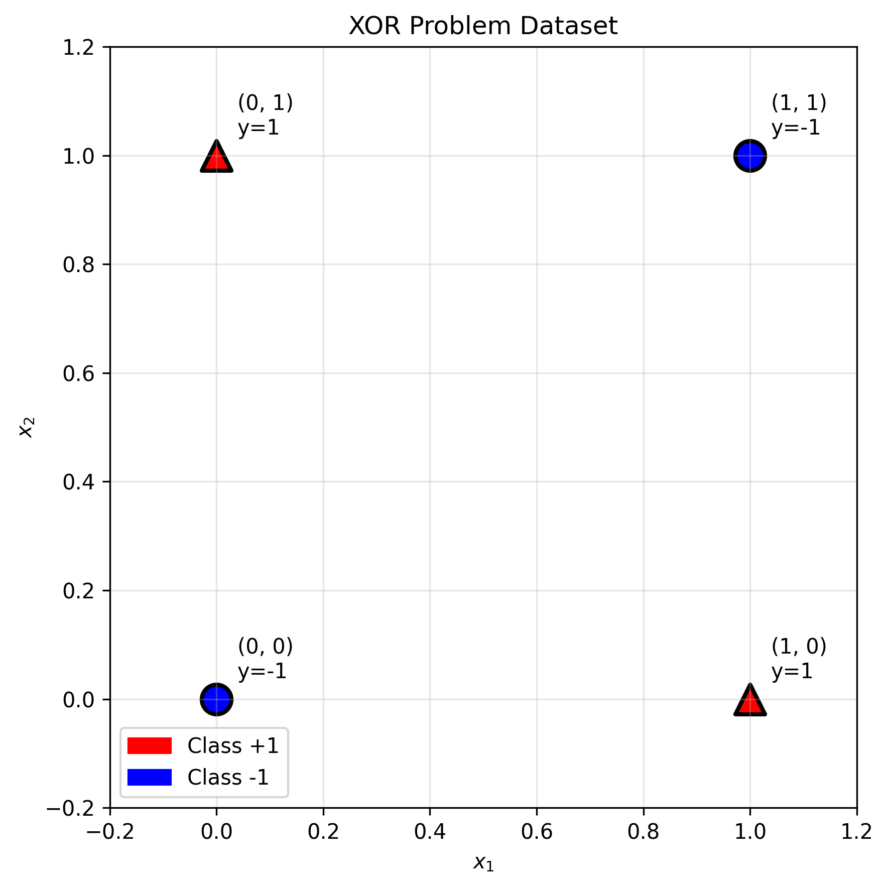

# Question 1: XOR Problem and Feature Transformation

## Problem Statement
Consider the classic XOR problem with four points:
- $(0, 0) \rightarrow y = -1$
- $(0, 1) \rightarrow y = +1$
- $(1, 0) \rightarrow y = +1$
- $(1, 1) \rightarrow y = -1$

### Task
1. Prove that this dataset is not linearly separable in $\mathbb{R}^2$
2. Apply the feature transformation $\phi(x_1, x_2) = (x_1, x_2, x_1x_2)$ and show the transformed points
3. Find a linear hyperplane in the 3D feature space that separates the transformed data
4. Express the decision boundary in the original 2D space
5. Calculate the kernel function $K(\mathbf{x}, \mathbf{z}) = \phi(\mathbf{x})^T\phi(\mathbf{z})$ for this transformation
6. Design a puzzle game with four squares in a 2×2 grid with 3D thinking tool

## Understanding the Problem
The XOR (exclusive OR) problem is a classic example in machine learning that demonstrates the limitations of linear classifiers. In the XOR problem, we want to classify points such that the output is positive when exactly one of the inputs is 1, and negative otherwise. This creates a non-linearly separable dataset in 2D space.

The kernel trick allows us to transform the input space into a higher-dimensional feature space where the data becomes linearly separable, without explicitly computing the transformation. This is fundamental to understanding how Support Vector Machines can handle non-linear classification problems.

## Solution

We'll solve this step-by-step, demonstrating how the kernel trick transforms an impossible linear classification problem into a solvable one.

### Step 1: Proving Non-Linear Separability in $\mathbb{R}^2$

To prove that the XOR dataset is not linearly separable, we need to show that no linear hyperplane can separate the positive and negative classes.

For a 2D linear classifier, the decision boundary is: $w_1x_1 + w_2x_2 + w_0 = 0$

We need:
- $w_1x_1 + w_2x_2 + w_0 > 0$ for positive class
- $w_1x_1 + w_2x_2 + w_0 < 0$ for negative class

Setting up the constraints for our XOR data:
- Point $(0,0)$: $w_0 < 0$ (negative class)
- Point $(0,1)$: $w_2 + w_0 > 0$ (positive class)
- Point $(1,0)$: $w_1 + w_0 > 0$ (positive class)
- Point $(1,1)$: $w_1 + w_2 + w_0 < 0$ (negative class)

From constraints 1 and 2: $w_0 < 0$ and $w_2 + w_0 > 0 \Rightarrow w_2 > -w_0 > 0$
From constraints 1 and 3: $w_0 < 0$ and $w_1 + w_0 > 0 \Rightarrow w_1 > -w_0 > 0$

But if $w_1 > 0$, $w_2 > 0$, and $w_0 < 0$, then:
Since $w_1 > -w_0$ and $w_2 > -w_0$, we have $w_1 + w_2 > -2w_0$
Therefore: $w_1 + w_2 + w_0 > -2w_0 + w_0 = -w_0 > 0$

This contradicts constraint 4 which requires $w_1 + w_2 + w_0 < 0$.
**Therefore, NO linear classifier can separate the XOR data!**

### Step 2: Feature Transformation

We apply the transformation $\phi(x_1, x_2) = (x_1, x_2, x_1x_2)$:

$$\begin{align}
\phi(0, 0) &= (0, 0, 0) \rightarrow y = -1\\
\phi(0, 1) &= (0, 1, 0) \rightarrow y = +1\\
\phi(1, 0) &= (1, 0, 0) \rightarrow y = +1\\
\phi(1, 1) &= (1, 1, 1) \rightarrow y = -1
\end{align}$$

In the 3D feature space, we can observe:
- **Negative class**: $(0,0,0)$ and $(1,1,1)$
- **Positive class**: $(0,1,0)$ and $(1,0,0)$

Notice that positive class points have $x_1x_2 = 0$, while negative class points have $x_1x_2 = 0$ or $x_1x_2 = 1$.

### Step 3: Finding the Separating Hyperplane in 3D

In 3D, we need to find $w_1, w_2, w_3, w_0$ such that:
$$w_1x_1 + w_2x_2 + w_3x_1x_2 + w_0 = 0$$

Analyzing the transformed points:
- **Negative class**: $(0,0,0)$ and $(1,1,1)$
- **Positive class**: $(0,1,0)$ and $(1,0,0)$

Key insight: Positive points have $x_1 + x_2 = 1$ and $x_1x_2 = 0$, while negative points have $x_1 + x_2 = 0$ or $2$.

We can use the hyperplane: $x_1 + x_2 - 2x_1x_2 - 0.5 = 0$
This gives us $\mathbf{w} = [1, 1, -2, -0.5]$

Testing this hyperplane:
- $(0,0,0)$: $1 \cdot 0 + 1 \cdot 0 + (-2) \cdot 0 - 0.5 = -0.5 < 0$ → Class $-1$ ✓
- $(0,1,0)$: $1 \cdot 0 + 1 \cdot 1 + (-2) \cdot 0 - 0.5 = 0.5 > 0$ → Class $+1$ ✓
- $(1,0,0)$: $1 \cdot 1 + 1 \cdot 0 + (-2) \cdot 0 - 0.5 = 0.5 > 0$ → Class $+1$ ✓
- $(1,1,1)$: $1 \cdot 1 + 1 \cdot 1 + (-2) \cdot 1 - 0.5 = -0.5 < 0$ → Class $-1$ ✓

**Perfect separation achieved!**

### Step 4: Decision Boundary in Original 2D Space

The separating hyperplane $x_1 + x_2 - 2x_1x_2 - 0.5 = 0$ in the 3D feature space translates back to the original 2D space as:
$$x_1 + x_2 - 2x_1x_2 = 0.5$$

This is a **more complex curve** than a simple hyperbola! The decision rule becomes:
- **Positive class**: $x_1 + x_2 - 2x_1x_2 > 0.5$
- **Negative class**: $x_1 + x_2 - 2x_1x_2 < 0.5$

Verification with original points:
- $(0,0)$: $0 + 0 - 2(0)(0) = 0 < 0.5$ → Predicted $-1$, True $-1$ ✓
- $(0,1)$: $0 + 1 - 2(0)(1) = 1 > 0.5$ → Predicted $+1$, True $+1$ ✓
- $(1,0)$: $1 + 0 - 2(1)(0) = 1 > 0.5$ → Predicted $+1$, True $+1$ ✓
- $(1,1)$: $1 + 1 - 2(1)(1) = 0 < 0.5$ → Predicted $-1$, True $-1$ ✓

**Perfect classification achieved!**

### Step 5: Kernel Function Calculation

For the transformation $\phi(x_1, x_2) = (x_1, x_2, x_1x_2)$:

$$\begin{align}
K(\mathbf{x}, \mathbf{z}) &= \phi(\mathbf{x})^T\phi(\mathbf{z})\\
&= (x_1, x_2, x_1x_2)^T \cdot (z_1, z_2, z_1z_2)\\
&= x_1z_1 + x_2z_2 + (x_1x_2)(z_1z_2)\\
&= \mathbf{x}^T\mathbf{z} + (\mathbf{x}^T\mathbf{z})^2
\end{align}$$

This can be written as: $K(\mathbf{x}, \mathbf{z}) = \mathbf{x}^T\mathbf{z}(1 + \mathbf{x}^T\mathbf{z})$

The kernel matrix for our XOR data is:
$$K = \begin{bmatrix}
0 & 0 & 0 & 0\\
0 & 1 & 0 & 1\\
0 & 0 & 1 & 1\\
0 & 1 & 1 & 3
\end{bmatrix}$$

### Step 6: Puzzle Game Design

**🎮 XOR Puzzle Game Design 🎮**

**Game Rules:**
- 2×2 grid with squares at positions $(0,0)$, $(0,1)$, $(1,0)$, $(1,1)$
- **VALID patterns**: exactly one colored square at $(0,1)$ OR $(1,0)$
- **INVALID patterns**: no squares colored $(0,0)$ OR all squares colored $(1,1)$

**3D Thinking Tool:**
- Transform each pattern using $\phi(x_1, x_2) = (x_1, x_2, x_1x_2)$
- Valid patterns have $x_1x_2 = 0$ (lie on the $x_1$-$x_2$ plane)
- Use the separating plane $x_1x_2 = 0.5$ to determine solvability

**Solvability Rule:**
A pattern is SOLVABLE (valid) if:
1. It has exactly one colored square
2. The square is at position $(0,1)$ or $(1,0)$
3. In 3D space: the point lies BELOW the plane $x_1x_2 = 0.5$

## Visual Explanations

### Simple Concept Visualization

This clean visualization shows the core concept: the XOR problem is impossible to solve in 2D (left) but becomes perfectly separable when transformed to 3D (right). The transformation $\phi(x_1, x_2) = (x_1, x_2, x_1x_2)$ maps the data to a space where a linear hyperplane can separate the classes.

### XOR Problem Visualization

The plot shows the four XOR data points in 2D space. Red circles represent the negative class $(-1)$ and blue squares represent the positive class $(+1)$. Several potential linear separating lines are shown as dashed lines, but none can successfully separate the red and blue points.

### 3D Feature Space Transformation

This 3D visualization shows how the XOR data points are transformed using $\phi(x_1, x_2) = (x_1, x_2, x_1x_2)$. In this higher-dimensional space, the points become linearly separable.

### Separating Hyperplane in 3D

The green plane represents the separating hyperplane $x_1 + x_2 - 2x_1x_2 - 0.5 = 0$ in the 3D feature space. This plane successfully separates the positive and negative class points with perfect accuracy.

### Decision Boundary in Original 2D Space

When projected back to the original 2D space, the linear hyperplane from 3D becomes the curve $x_1 + x_2 - 2x_1x_2 = 0.5$. The light blue region represents the positive class ($x_1 + x_2 - 2x_1x_2 > 0.5$) and the light pink region represents the negative class ($x_1 + x_2 - 2x_1x_2 < 0.5$).

### Kernel Transformation Visualization

This visualization demonstrates the kernel transformation concept, showing how the kernel function $K(\mathbf{x}, \mathbf{z}) = \phi(\mathbf{x})^T\phi(\mathbf{z})$ relates to the explicit feature mapping.

### Simple Visualization

A clean, side-by-side comparison showing the XOR problem in the original 2D space (left) where it's not linearly separable, and in the transformed 3D space (right) where it becomes linearly separable.

### Puzzle Game Visualization

The three panels show: (1) valid patterns in 3D space, (2) invalid patterns in 3D space, and (3) the 3D separation rule using the plane $x_1x_2 = 0.5$.

## Key Insights

### Theoretical Foundations
- The XOR problem demonstrates the fundamental limitation of linear classifiers
- Feature space transformation can make non-linearly separable data linearly separable
- The kernel trick allows us to work in high-dimensional spaces without explicit computation
- The choice of feature transformation determines the complexity of achievable decision boundaries

### Practical Applications
- This principle underlies the power of Support Vector Machines with non-linear kernels
- The same concept applies to neural networks with hidden layers
- Feature engineering in machine learning often follows similar principles
- The kernel trick is computationally efficient compared to explicit feature mapping

### Mathematical Insights
- Linear separability is preserved under linear transformations but can be gained through non-linear ones
- The dimensionality of the feature space affects the complexity of possible decision boundaries
- Kernel functions must satisfy Mercer's conditions to correspond to valid inner products
- The geometric margin in the feature space determines the classifier's generalization ability

## Conclusion
- We proved that XOR data is not linearly separable in $\mathbb{R}^2$ through contradiction
- The feature transformation $\phi(x_1, x_2) = (x_1, x_2, x_1x_2)$ maps the data to a 3D space where it becomes separable
- The separating hyperplane $x_1 + x_2 - 2x_1x_2 - 0.5 = 0$ in 3D corresponds to the decision boundary $x_1 + x_2 - 2x_1x_2 = 0.5$ in the original 2D space
- The kernel function $K(\mathbf{x}, \mathbf{z}) = \phi(\mathbf{x})^T\phi(\mathbf{z})$ allows efficient computation without explicit feature mapping
- The puzzle game design demonstrates practical applications of the 3D thinking approach to pattern classification

This example illustrates the fundamental power of the kernel trick: transforming an impossible linear classification problem into a solvable one through clever feature space mapping.
