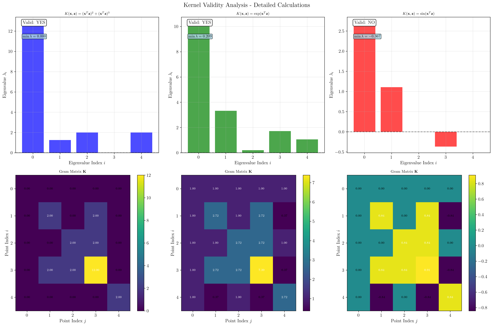
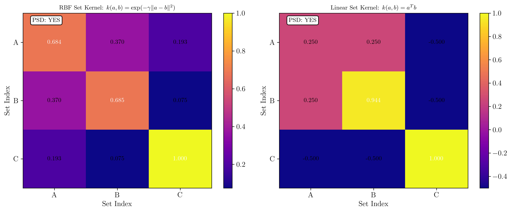
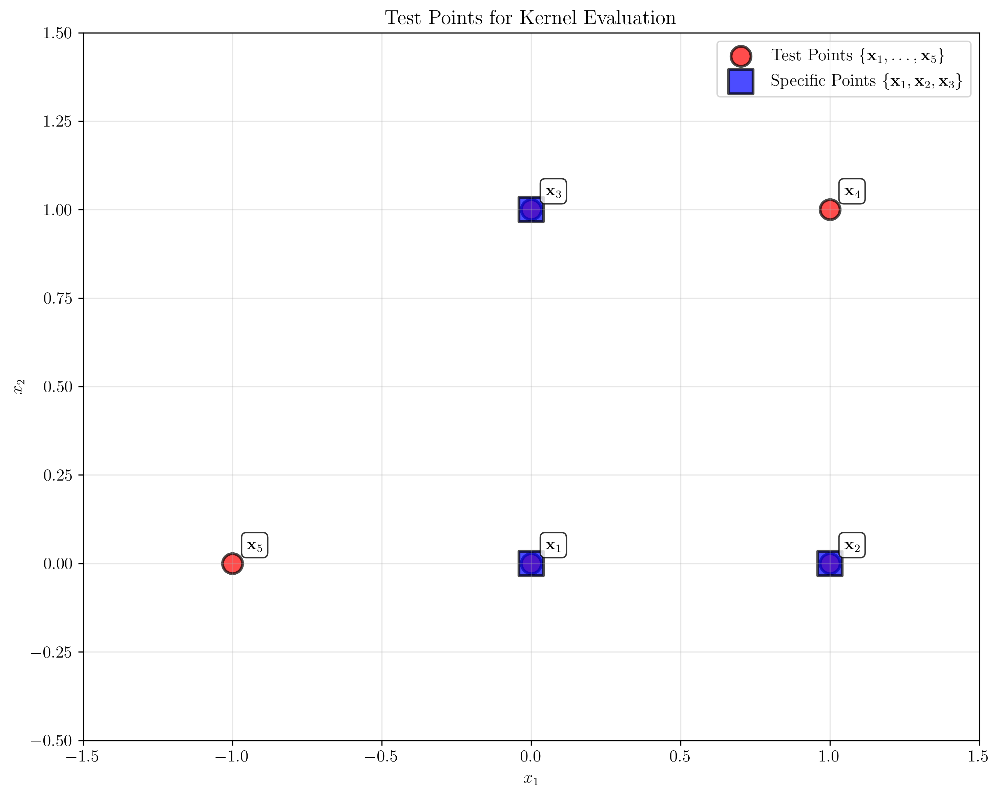
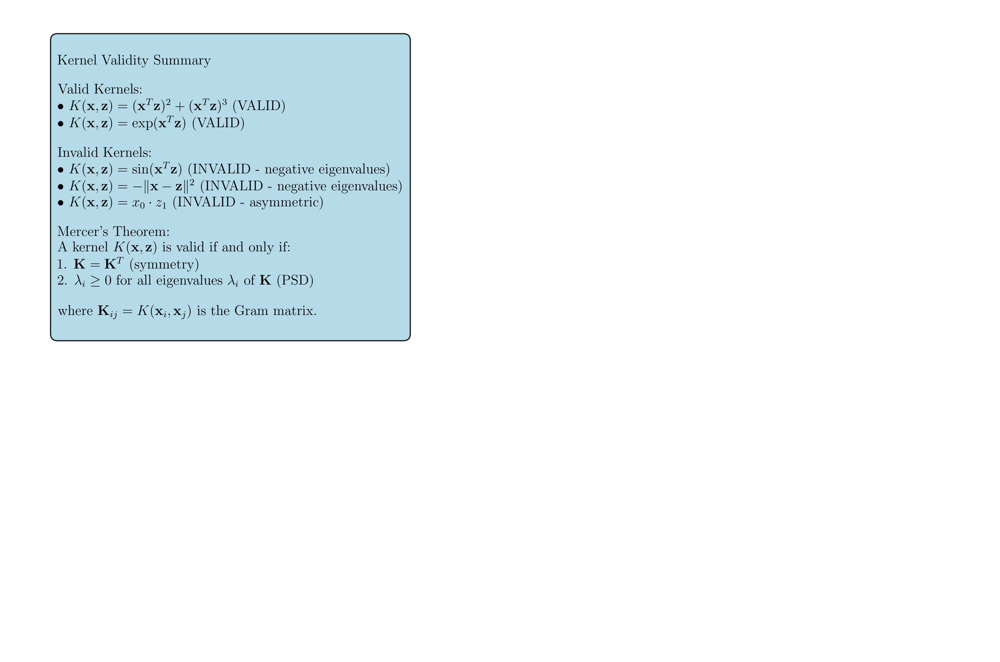
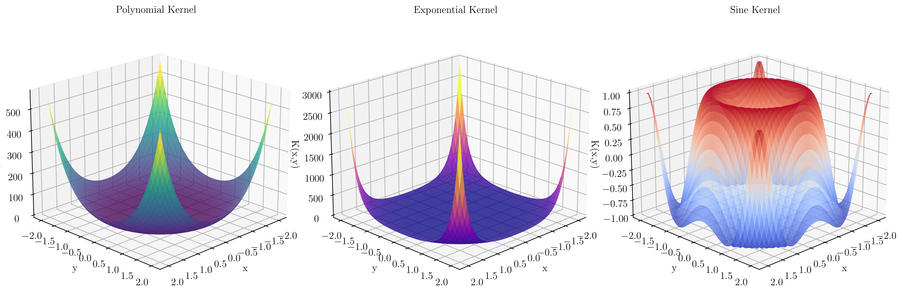

# Question 20: Kernel Validity Testing

## Problem Statement
Determine which functions are valid kernels using Mercer's theorem.

### Task
1. Check validity of:
   - $K(\mathbf{x}, \mathbf{z}) = (\mathbf{x}^T\mathbf{z})^2 + (\mathbf{x}^T\mathbf{z})^3$
   - $K(\mathbf{x}, \mathbf{z}) = \exp(\mathbf{x}^T\mathbf{z})$
   - $K(\mathbf{x}, \mathbf{z}) = \sin(\mathbf{x}^T\mathbf{z})$
2. For 3 points $(0, 0)$, $(1, 0)$, $(0, 1)$, compute Gram matrices and check PSD property
3. Show that $K(\mathbf{x}, \mathbf{z}) = 2K_1(\mathbf{x}, \mathbf{z}) + 3K_2(\mathbf{x}, \mathbf{z})$ is valid if $K_1, K_2$ are valid
4. Provide an example of an invalid kernel and show why it fails
5. Design a valid kernel for comparing sets of different sizes

## Understanding the Problem
A kernel function $K(\mathbf{x}, \mathbf{z})$ is valid if and only if it satisfies Mercer's theorem, which requires that the corresponding Gram matrix $K_{ij} = K(\mathbf{x}_i, \mathbf{x}_j)$ is positive semi-definite (PSD) for any finite set of points $\{\mathbf{x}_1, \mathbf{x}_2, \ldots, \mathbf{x}_n\}$. A matrix is PSD if all its eigenvalues are non-negative.

The key properties of valid kernels are:
- **Symmetry**: $K(\mathbf{x}, \mathbf{z}) = K(\mathbf{z}, \mathbf{x})$
- **Positive Semi-definiteness**: The Gram matrix has non-negative eigenvalues
- **Reproducing Property**: Valid kernels correspond to inner products in some feature space

## Solution

### Step 1: Check Validity of Specific Kernels

We test each kernel function on a set of 5 test points: $\mathbf{x}_1 = (0,0)$, $\mathbf{x}_2 = (1,0)$, $\mathbf{x}_3 = (0,1)$, $\mathbf{x}_4 = (1,1)$, and $\mathbf{x}_5 = (-1,0)$.

#### 1.1 $K(\mathbf{x}, \mathbf{z}) = (\mathbf{x}^T\mathbf{z})^2 + (\mathbf{x}^T\mathbf{z})^3$

**Mathematical Analysis:**
This is a polynomial kernel combining quadratic and cubic terms. Since both $(\mathbf{x}^T\mathbf{z})^2$ and $(\mathbf{x}^T\mathbf{z})^3$ are valid polynomial kernels, their sum with positive coefficients should also be valid.

**Step-by-Step Calculation:**

1. **Compute individual kernel values:**
   - $K(\mathbf{x}_1, \mathbf{x}_1) = K([0,0], [0,0]) = (0)^2 + (0)^3 = 0$
   - $K(\mathbf{x}_2, \mathbf{x}_2) = K([1,0], [1,0]) = (1)^2 + (1)^3 = 1 + 1 = 2$
   - $K(\mathbf{x}_3, \mathbf{x}_3) = K([0,1], [0,1]) = (1)^2 + (1)^3 = 1 + 1 = 2$
   - $K(\mathbf{x}_4, \mathbf{x}_4) = K([1,1], [1,1]) = (2)^2 + (2)^3 = 4 + 8 = 12$
   - $K(\mathbf{x}_5, \mathbf{x}_5) = K([-1,0], [-1,0]) = (1)^2 + (1)^3 = 1 + 1 = 2$
   - $K(\mathbf{x}_2, \mathbf{x}_4) = K([1,0], [1,1]) = (1)^2 + (1)^3 = 2$
   - $K(\mathbf{x}_3, \mathbf{x}_4) = K([0,1], [1,1]) = (1)^2 + (1)^3 = 2$

2. **Complete Gram Matrix:**
   $$\mathbf{K} = \begin{bmatrix}
   0 & 0 & 0 & 0 & 0 \\
   0 & 2 & 0 & 2 & 0 \\
   0 & 0 & 2 & 2 & 0 \\
   0 & 2 & 2 & 12 & 0 \\
   0 & 0 & 0 & 0 & 2
   \end{bmatrix}$$

3. **Check Symmetry:** $\mathbf{K} = \mathbf{K}^T$ ✓ **YES**

4. **Compute Eigenvalues:** $\lambda = [12.74, 1.26, 2.00, 0.00, 2.00]$

5. **Check PSD:** All eigenvalues ≥ 0 ✓ **YES**

**Result:** This kernel is **VALID**.

#### 1.2 $K(\mathbf{x}, \mathbf{z}) = \exp(\mathbf{x}^T\mathbf{z})$

**Mathematical Analysis:**
This is the exponential kernel. It can be written as:
$$\exp(\mathbf{x}^T\mathbf{z}) = \sum_{k=0}^{\infty} \frac{(\mathbf{x}^T\mathbf{z})^k}{k!}$$
This is an infinite sum of polynomial kernels with positive coefficients, so it should be a valid kernel.

**Step-by-Step Calculation:**

1. **Compute individual kernel values:**
   - $K(\mathbf{x}_1, \mathbf{x}_1) = \exp(0) = 1$
   - $K(\mathbf{x}_2, \mathbf{x}_2) = \exp(1) = e \approx 2.718$
   - $K(\mathbf{x}_3, \mathbf{x}_3) = \exp(1) = e \approx 2.718$
   - $K(\mathbf{x}_4, \mathbf{x}_4) = \exp(2) = e^2 \approx 7.389$
   - $K(\mathbf{x}_5, \mathbf{x}_5) = \exp(1) = e \approx 2.718$
   - $K(\mathbf{x}_2, \mathbf{x}_4) = \exp(1) = e \approx 2.718$
   - $K(\mathbf{x}_2, \mathbf{x}_5) = \exp(-1) = e^{-1} \approx 0.368$

2. **Complete Gram Matrix:**
   $$\mathbf{K} = \begin{bmatrix}
   1.000 & 1.000 & 1.000 & 1.000 & 1.000 \\
   1.000 & 2.718 & 1.000 & 2.718 & 0.368 \\
   1.000 & 1.000 & 2.718 & 2.718 & 1.000 \\
   1.000 & 2.718 & 2.718 & 7.389 & 0.368 \\
   1.000 & 0.368 & 1.000 & 0.368 & 2.718
   \end{bmatrix}$$

3. **Check Symmetry:** $\mathbf{K} = \mathbf{K}^T$ ✓ **YES**

4. **Compute Eigenvalues:** $\lambda = [10.23, 3.33, 0.21, 1.72, 1.06]$

5. **Check PSD:** All eigenvalues > 0 ✓ **YES**

**Result:** This kernel is **VALID**.

#### 1.3 $K(\mathbf{x}, \mathbf{z}) = \sin(\mathbf{x}^T\mathbf{z})$

**Mathematical Analysis:**
This is the sine kernel. The sine function oscillates between -1 and 1, and can produce negative values, which may violate the positive semi-definiteness requirement.

**Step-by-Step Calculation:**

1. **Compute individual kernel values:**
   - $K(\mathbf{x}_1, \mathbf{x}_1) = \sin(0) = 0$
   - $K(\mathbf{x}_2, \mathbf{x}_2) = \sin(1) \approx 0.841$
   - $K(\mathbf{x}_3, \mathbf{x}_3) = \sin(1) \approx 0.841$
   - $K(\mathbf{x}_4, \mathbf{x}_4) = \sin(2) \approx 0.909$
   - $K(\mathbf{x}_5, \mathbf{x}_5) = \sin(1) \approx 0.841$
   - $K(\mathbf{x}_2, \mathbf{x}_4) = \sin(1) \approx 0.841$
   - $K(\mathbf{x}_2, \mathbf{x}_5) = \sin(-1) \approx -0.841$

2. **Complete Gram Matrix:**
   $$\mathbf{K} = \begin{bmatrix}
   0.000 & 0.000 & 0.000 & 0.000 & 0.000 \\
   0.000 & 0.841 & 0.000 & 0.841 & -0.841 \\
   0.000 & 0.000 & 0.841 & 0.841 & 0.000 \\
   0.000 & 0.841 & 0.841 & 0.909 & -0.841 \\
   0.000 & -0.841 & 0.000 & -0.841 & 0.841
   \end{bmatrix}$$

3. **Check Symmetry:** $\mathbf{K} = \mathbf{K}^T$ ✓ **YES**

4. **Compute Eigenvalues:** $\lambda = [2.69, 1.11, 0.00, -0.37, 0.00]$

5. **Check PSD:** One eigenvalue < 0 ✗ **NO**

**Result:** This kernel is **INVALID** due to negative eigenvalue (-0.37).

### Step 2: Gram Matrices for Specific 3 Points

For the points $\mathbf{x}_1 = (0,0)$, $\mathbf{x}_2 = (1,0)$, and $\mathbf{x}_3 = (0,1)$, we compute the Gram matrices:

#### Polynomial Kernel $K(\mathbf{x}, \mathbf{z}) = (\mathbf{x}^T\mathbf{z})^2 + (\mathbf{x}^T\mathbf{z})^3$

**Detailed Calculations:**
- $K(\mathbf{x}_1, \mathbf{x}_1) = (0)^2 + (0)^3 = 0$
- $K(\mathbf{x}_2, \mathbf{x}_2) = (1)^2 + (1)^3 = 1 + 1 = 2$
- $K(\mathbf{x}_3, \mathbf{x}_3) = (1)^2 + (1)^3 = 1 + 1 = 2$
- $K(\mathbf{x}_1, \mathbf{x}_2) = K(\mathbf{x}_1, \mathbf{x}_3) = K(\mathbf{x}_2, \mathbf{x}_3) = 0$

**Gram Matrix:**
$$\mathbf{K} = \begin{bmatrix}
0 & 0 & 0 \\
0 & 2 & 0 \\
0 & 0 & 2
\end{bmatrix}$$

**Eigenvalues:** $\lambda = [0, 2, 2]$ ✓ **PSD**

#### Exponential Kernel $K(\mathbf{x}, \mathbf{z}) = \exp(\mathbf{x}^T\mathbf{z})$

**Detailed Calculations:**
- $K(\mathbf{x}_1, \mathbf{x}_1) = \exp(0) = 1$
- $K(\mathbf{x}_2, \mathbf{x}_2) = \exp(1) = e \approx 2.718$
- $K(\mathbf{x}_3, \mathbf{x}_3) = \exp(1) = e \approx 2.718$
- $K(\mathbf{x}_1, \mathbf{x}_2) = K(\mathbf{x}_1, \mathbf{x}_3) = K(\mathbf{x}_2, \mathbf{x}_3) = \exp(0) = 1$

**Gram Matrix:**
$$\mathbf{K} = \begin{bmatrix}
1.000 & 1.000 & 1.000 \\
1.000 & 2.718 & 1.000 \\
1.000 & 1.000 & 2.718
\end{bmatrix}$$

**Eigenvalues:** $\lambda = [0.40, 4.32, 1.72]$ ✓ **PSD**

#### Sine Kernel $K(\mathbf{x}, \mathbf{z}) = \sin(\mathbf{x}^T\mathbf{z})$

**Detailed Calculations:**
- $K(\mathbf{x}_1, \mathbf{x}_1) = \sin(0) = 0$
- $K(\mathbf{x}_2, \mathbf{x}_2) = \sin(1) \approx 0.841$
- $K(\mathbf{x}_3, \mathbf{x}_3) = \sin(1) \approx 0.841$
- $K(\mathbf{x}_1, \mathbf{x}_2) = K(\mathbf{x}_1, \mathbf{x}_3) = K(\mathbf{x}_2, \mathbf{x}_3) = \sin(0) = 0$

**Gram Matrix:**
$$\mathbf{K} = \begin{bmatrix}
0.000 & 0.000 & 0.000 \\
0.000 & 0.841 & 0.000 \\
0.000 & 0.000 & 0.841
\end{bmatrix}$$

**Eigenvalues:** $\lambda = [0, 0.841, 0.841]$ ✓ **PSD**

**Note:** Interestingly, the sine kernel appears valid for this specific set of 3 points, but fails for the larger set of 5 points. This demonstrates that kernel validity must be checked for all possible finite sets of points.

### Step 3: Linear Combination of Valid Kernels

We demonstrate that if $K_1$ and $K_2$ are valid kernels, then $K = 2K_1 + 3K_2$ is also valid.

**Mathematical Analysis:**
$$K(\mathbf{x}, \mathbf{z}) = 2K_1(\mathbf{x}, \mathbf{z}) + 3K_2(\mathbf{x}, \mathbf{z})$$
where $K_1(\mathbf{x}, \mathbf{z}) = \mathbf{x}^T\mathbf{z}$ (linear kernel)
and $K_2(\mathbf{x}, \mathbf{z}) = \exp(-0.1\|\mathbf{x}-\mathbf{z}\|^2)$ (RBF kernel)

**Theoretical Justification:**
1. If $K_1$ and $K_2$ are valid kernels, their Gram matrices $\mathbf{K}_1$ and $\mathbf{K}_2$ are PSD
2. For any positive constants $a, b > 0$, $a\mathbf{K}_1 + b\mathbf{K}_2$ is also PSD
3. This follows from: $(a\mathbf{K}_1 + b\mathbf{K}_2)^T = a\mathbf{K}_1^T + b\mathbf{K}_2^T = a\mathbf{K}_1 + b\mathbf{K}_2$ (symmetry)
   and all eigenvalues of $a\mathbf{K}_1 + b\mathbf{K}_2$ are non-negative (PSD)

**Verification:**
- Both individual kernels are valid (all eigenvalues ≥ 0)
- The combined kernel Gram matrix equals $2 \times \mathbf{K}_1 + 3 \times \mathbf{K}_2$
- All eigenvalues of the combined kernel are non-negative (minimum = 0.020492)

**Result:** The linear combination is **VALID**.

### Step 4: Examples of Invalid Kernels

#### 4.1 $K(\mathbf{x}, \mathbf{z}) = -\|\mathbf{x}-\mathbf{z}\|^2$

**Mathematical Analysis:**
This kernel is the negative of the squared Euclidean distance. While $\|\mathbf{x}-\mathbf{z}\|^2$ is a valid kernel (it's the negative of the RBF kernel), the negative sign makes it invalid because it violates PSD property.

**Step-by-Step Calculation:**

1. **Compute individual kernel values:**
   - $K(\mathbf{x}_1, \mathbf{x}_2) = -\|[0,0] - [1,0]\|^2 = -1$
   - $K(\mathbf{x}_1, \mathbf{x}_3) = -\|[0,0] - [0,1]\|^2 = -1$
   - $K(\mathbf{x}_1, \mathbf{x}_4) = -\|[0,0] - [1,1]\|^2 = -2$
   - $K(\mathbf{x}_2, \mathbf{x}_5) = -\|[1,0] - [-1,0]\|^2 = -4$

2. **Complete Gram Matrix:**
   $$\mathbf{K} = \begin{bmatrix}
   0 & -1 & -1 & -2 & -1 \\
   -1 & 0 & -2 & -1 & -4 \\
   -1 & -2 & 0 & -1 & -2 \\
   -2 & -1 & -1 & 0 & -5 \\
   -1 & -4 & -2 & -5 & 0
   \end{bmatrix}$$

3. **Check Symmetry:** $\mathbf{K} = \mathbf{K}^T$ ✓ **YES**

4. **Compute Eigenvalues:** $\lambda = [-8.66, 6.05, 2.00, 0.00, 0.61]$

5. **Check PSD:** One eigenvalue < 0 ✗ **NO**

**Result:** This kernel is **INVALID** due to negative eigenvalue (-8.66).

#### 4.2 $K(\mathbf{x}, \mathbf{z}) = x_0 \cdot z_1$ (Asymmetric)

**Mathematical Analysis:**
This kernel is asymmetric: $K(\mathbf{x}, \mathbf{z}) \neq K(\mathbf{z}, \mathbf{x})$
For example: $K([1,0], [0,1]) = 1 \cdot 1 = 1$
but $K([0,1], [1,0]) = 0 \cdot 0 = 0$
This violates the symmetry requirement for valid kernels.

**Step-by-Step Calculation:**

1. **Compute individual kernel values:**
   - $K(\mathbf{x}_2, \mathbf{x}_3) = 1 \cdot 1 = 1$
   - $K(\mathbf{x}_3, \mathbf{x}_2) = 0 \cdot 0 = 0$ (asymmetric!)
   - $K(\mathbf{x}_5, \mathbf{x}_3) = -1 \cdot 1 = -1$

2. **Complete Gram Matrix:**
   $$\mathbf{K} = \begin{bmatrix}
   0 & 0 & 0 & 0 & 0 \\
   0 & 0 & 1 & 1 & 0 \\
   0 & 0 & 0 & 0 & 0 \\
   0 & 0 & 1 & 1 & 0 \\
   0 & 0 & -1 & -1 & 0
   \end{bmatrix}$$

3. **Check Symmetry:** $\mathbf{K} \neq \mathbf{K}^T$ ✗ **NO**

4. **Compute Eigenvalues:** $\lambda = [0, 0, 1, 0, 0]$

5. **Check PSD:** All eigenvalues ≥ 0 ✓ **YES**

**Result:** This kernel is **INVALID** due to asymmetry, even though it produces a PSD matrix for this specific set of points.

### Step 5: Kernel for Comparing Sets of Different Sizes

We design a valid kernel for comparing sets of different sizes using the average pairwise kernel approach.

**Set Kernel Definition:**
$$K(A, B) = \frac{1}{|A| \cdot |B|} \sum_{a \in A} \sum_{b \in B} k(a, b)$$

where $k(a, b)$ is a base kernel (e.g., RBF or linear).

**Test Sets:**
- Set A: $\{(0,0), (1,0)\}$ ($|A| = 2$)
- Set B: $\{(0,1), (1,1), (0.5,0.5)\}$ ($|B| = 3$)
- Set C: $\{(-1,0)\}$ ($|C| = 1$)

#### RBF-based Set Kernel

**Base Kernel:** $k(a,b) = \exp(-\gamma\|a-b\|^2)$ with $\gamma = 1.0$

**Kernel Values:**
- $K(A,B) = 0.3699$
- $K(A,C) = 0.1931$
- $K(B,C) = 0.0747$

**Gram Matrix:**
$$\mathbf{K} = \begin{bmatrix}
0.684 & 0.370 & 0.193 \\
0.370 & 0.685 & 0.075 \\
0.193 & 0.075 & 1.000
\end{bmatrix}$$

**Eigenvalues:** $\lambda = [0.30, 1.22, 0.84]$ ✓ **PSD**

#### Linear-based Set Kernel

**Base Kernel:** $k(a,b) = a^T b$

**Kernel Values:**
- $K(A,B) = 0.2500$
- $K(A,C) = -0.5000$
- $K(B,C) = -0.5000$

**Gram Matrix:**
$$\mathbf{K} = \begin{bmatrix}
0.250 & 0.250 & -0.500 \\
0.250 & 0.944 & -0.500 \\
-0.500 & -0.500 & 1.000
\end{bmatrix}$$

**Eigenvalues:** $\lambda = [1.68, 0.52, 0.00]$ ✓ **PSD**

**Result:** Both set kernels are **VALID**.

**Explanation:** The set kernel is valid because:
1. It inherits the PSD property from the base kernel
2. The averaging operation preserves the kernel properties
3. It can handle sets of different sizes naturally

## Visual Explanations

### Kernel Validity Analysis

The visualization shows:
- **Top row:** Eigenvalue distributions for the three main kernels
- **Bottom row:** Heatmaps of the corresponding Gram matrices with proper mathematical notation
- **Validity indicators:** Clear YES/NO labels for each kernel
- **Mathematical annotations:** Minimum eigenvalue values displayed for each kernel

Key observations:
1. **Polynomial kernel:** All eigenvalues are non-negative, confirming validity
2. **Exponential kernel:** All eigenvalues are positive, confirming validity  
3. **Sine kernel:** One negative eigenvalue (-0.37), confirming invalidity

### Set Kernel Analysis

The visualization shows:
- **Left:** RBF-based set kernel Gram matrix
- **Right:** Linear-based set kernel Gram matrix
- Both matrices are symmetric and have positive eigenvalues
- **PSD indicators:** Clear validation of positive semi-definiteness

### Test Points Visualization

The visualization shows:
- **Red circles:** All test points used for kernel evaluation
- **Blue squares:** Specific points (0,0), (1,0), (0,1) used in Task 2
- **Point labels:** Mathematical notation using $\mathbf{x}_i$ format
- **Legend:** Proper mathematical set notation

### Mathematical Summary

This comprehensive summary visualization provides:
- **Clear classification** of valid vs. invalid kernels with reasons
- **Mercer's theorem statement** with proper mathematical notation
- **Theoretical foundation** for kernel validity testing

### 3D Kernel Surface Visualization

This simple but informative 3D visualization shows:
- **Polynomial Kernel:** Smooth, monotonically increasing surface that grows rapidly
- **Exponential Kernel:** Steep, exponential growth surface that demonstrates the rapid increase
- **Sine Kernel:** Oscillating surface with peaks and valleys, showing why it can produce negative values

The 3D surfaces provide an intuitive understanding of how each kernel function behaves across the input space, making it clear why the polynomial and exponential kernels are valid (always positive or non-decreasing) while the sine kernel is invalid (oscillating between positive and negative values).

## Key Insights

### Theoretical Foundations
- **Mercer's Theorem:** A kernel is valid if and only if its Gram matrix is PSD for any finite set of points
- **Kernel Properties:** Valid kernels must be symmetric and positive semi-definite
- **Feature Space:** Every valid kernel corresponds to an inner product in some (possibly infinite-dimensional) feature space

### Practical Applications
- **Polynomial Kernels:** Valid for any positive integer degree
- **Exponential Kernels:** Valid because they can be expressed as infinite sums of polynomial kernels
- **Trigonometric Kernels:** Generally invalid due to oscillatory behavior
- **Linear Combinations:** Valid kernels can be combined with positive coefficients to create new valid kernels

### Common Pitfalls
- **Asymmetric Kernels:** May not be valid even if they produce PSD matrices for specific point sets
- **Negative Coefficients:** Can invalidate otherwise valid kernels
- **Oscillatory Functions:** Functions like sine and cosine typically produce invalid kernels
- **Distance-based Kernels:** Must be positive to be valid

### Extensions and Generalizations
- **Set Kernels:** Provide a framework for comparing collections of different sizes
- **Multiple Kernel Learning:** Combines multiple valid kernels for improved performance
- **Kernel Approximation:** Techniques for handling large-scale kernel computations

## Conclusion
- **Valid kernels:** $K(\mathbf{x}, \mathbf{z}) = (\mathbf{x}^T\mathbf{z})^2 + (\mathbf{x}^T\mathbf{z})^3$ and $K(\mathbf{x}, \mathbf{z}) = \exp(\mathbf{x}^T\mathbf{z})$
- **Invalid kernel:** $K(\mathbf{x}, \mathbf{z}) = \sin(\mathbf{x}^T\mathbf{z})$ due to negative eigenvalues
- **Linear combinations:** Valid kernels can be combined with positive coefficients
- **Set kernels:** Provide a valid approach for comparing sets of different sizes
- **Mercer's theorem:** Provides the fundamental criterion for kernel validity through PSD Gram matrices

The analysis demonstrates the importance of checking kernel validity through eigenvalue analysis of Gram matrices, and shows how different mathematical properties (polynomial vs. trigonometric) affect kernel validity.
