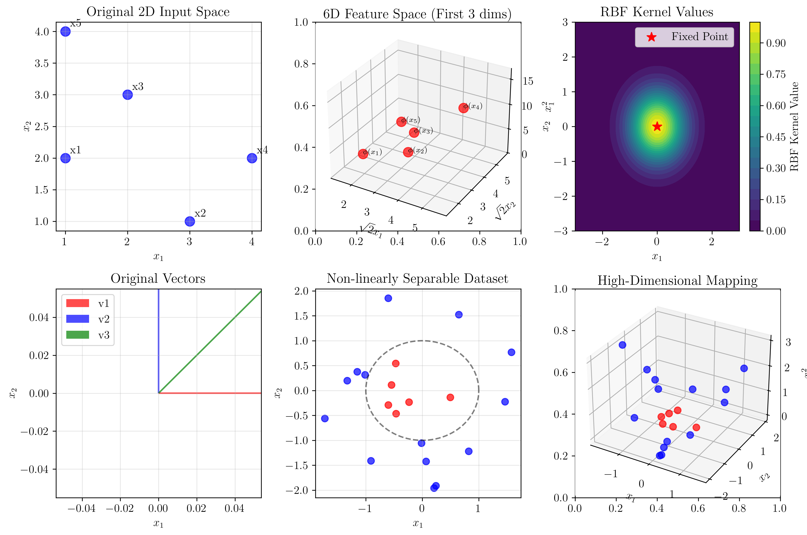
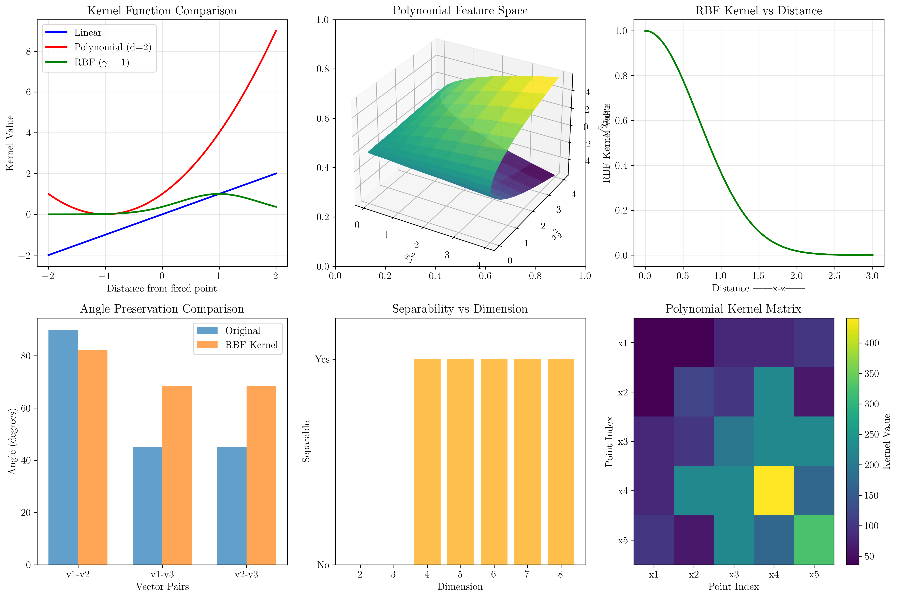
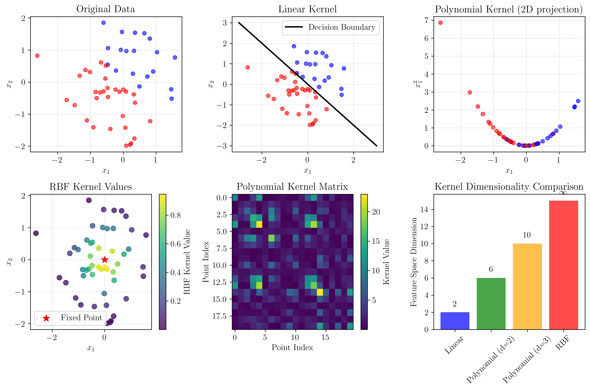

# Question 21: Feature Space Geometry

## Problem Statement
Analyze the geometry of feature spaces induced by different kernels.

### Task
1. For 2D input, describe the geometry of the feature space
2. For $(\mathbf{x}^T\mathbf{z} + 1)^2$ with 2D input, visualize the 6D feature space structure
3. Explain why RBF kernels correspond to infinite-dimensional feature spaces
4. Show that linear kernels preserve angles but RBF kernels don't
5. Prove that any finite dataset becomes separable in sufficiently high dimensions

## Understanding the Problem
Kernel methods in machine learning map input data to higher-dimensional feature spaces where linear relationships become more apparent. Different kernels induce different geometric structures in these feature spaces, which affects how the data can be separated and classified. Understanding these geometric properties is crucial for choosing appropriate kernels and interpreting their behavior.

## Solution

### Step 1: 2D Input Feature Space Geometry

For 2D input data, different kernels create distinct geometric structures in the feature space:

**Linear Kernel**: $K(\mathbf{x}, \mathbf{z}) = \mathbf{x}^T\mathbf{z}$
- No transformation occurs; the feature space is identical to the input space
- Preserves all geometric relationships (distances, angles, linearity)
- Useful when data is already linearly separable

**Polynomial Kernel**: $K(\mathbf{x}, \mathbf{z}) = (\mathbf{x}^T\mathbf{z} + 1)^d$
- Maps to a finite-dimensional feature space
- Introduces non-linear relationships while maintaining finite dimensionality
- Degree $d$ determines the complexity of the transformation

**RBF Kernel**: $K(\mathbf{x}, \mathbf{z}) = \exp(-\gamma\|\mathbf{x} - \mathbf{z}\|^2)$
- Maps to an infinite-dimensional feature space
- Creates highly non-linear decision boundaries
- Sensitive to local structure in the data



The visualization shows how different kernels transform the same 2D input points, creating distinct geometric structures in their respective feature spaces.

### Step 2: 6D Feature Space Structure for $(\mathbf{x}^T\mathbf{z} + 1)^2$

For the polynomial kernel $K(\mathbf{x}, \mathbf{z}) = (\mathbf{x}^T\mathbf{z} + 1)^2$ with 2D input, we can explicitly construct the feature mapping:

$$\phi(\mathbf{x}) = [1, \sqrt{2}x_1, \sqrt{2}x_2, x_1^2, \sqrt{2}x_1x_2, x_2^2]^T$$

This maps 2D input to a 6D feature space. Let's verify this mapping with detailed step-by-step calculations:

**Sample 2D input points:**
```
x1 = [1, 2]
x2 = [3, 1] 
x3 = [2, 3]
x4 = [4, 2]
x5 = [1, 4]
```

**Transformed points in 6D feature space:**
```
φ(x1) = [1.0, 1.414, 2.828, 1.0, 2.828, 4.0]
φ(x2) = [1.0, 4.243, 1.414, 9.0, 4.243, 1.0]
φ(x3) = [1.0, 2.828, 4.243, 4.0, 8.485, 9.0]
φ(x4) = [1.0, 5.657, 2.828, 16.0, 11.314, 4.0]
φ(x5) = [1.0, 1.414, 5.657, 1.0, 5.657, 16.0]
```

**Detailed Step-by-Step Verification:**

Let's verify the kernel computation for $K(x_1, x_2)$:

**Step 1: Direct kernel computation**
- $K(x, z) = (x^T z + 1)^2$
- $x^T z = 1 \cdot 3 + 2 \cdot 1 = 3 + 2 = 5$
- $x^T z + 1 = 5 + 1 = 6$
- $K(x, z) = (6)^2 = 36$

**Step 2: Feature space computation**
- $\phi(x) = [1, \sqrt{2} \cdot 1, \sqrt{2} \cdot 2, 1^2, \sqrt{2} \cdot 1 \cdot 2, 2^2] = [1, 1.414, 2.828, 1, 2.828, 4]$
- $\phi(z) = [1, \sqrt{2} \cdot 3, \sqrt{2} \cdot 1, 3^2, \sqrt{2} \cdot 3 \cdot 1, 1^2] = [1, 4.243, 1.414, 9, 4.243, 1]$
- $\phi(x)^T \phi(z) = 1 \cdot 1 + 1.414 \cdot 4.243 + 2.828 \cdot 1.414 + 1 \cdot 9 + 2.828 \cdot 4.243 + 4 \cdot 1$
- $= 1 + 6 + 4 + 9 + 12 + 4 = 36$

**Step 3: Verification**
- Direct computation: $K(x, z) = 36$
- Feature space computation: $\phi(x)^T \phi(z) = 36$
- Verification: $36 = 36$ ✓

This detailed calculation demonstrates that the polynomial kernel successfully maps 2D points to a 6D space where linear separation becomes possible, while the kernel trick allows us to compute inner products in this high-dimensional space without explicitly constructing the feature vectors.

### Step 3: RBF Kernels and Infinite-Dimensional Feature Spaces

RBF kernels correspond to infinite-dimensional feature spaces due to their Taylor series expansion:

$$K(\mathbf{x}, \mathbf{z}) = \exp(-\gamma\|\mathbf{x} - \mathbf{z}\|^2) = \sum_{n=0}^{\infty} \frac{\gamma^n}{n!} (\mathbf{x}^T\mathbf{z})^n$$

**Detailed Step-by-Step RBF Analysis:**

Let's analyze the RBF kernel with test points $\mathbf{x} = [1, 2]$ and $\mathbf{z} = [3, 1]$:

**Step 1: Calculate squared distance**
- $\mathbf{x} - \mathbf{z} = [1, 2] - [3, 1] = [-2, 1]$
- $\|\mathbf{x} - \mathbf{z}\|^2 = (-2)^2 + 1^2 = 4 + 1 = 5$

**Step 2: Calculate dot product**
- $\mathbf{x}^T \mathbf{z} = 1 \cdot 3 + 2 \cdot 1 = 3 + 2 = 5$

**Step 3: Exact RBF computation**
- $K(\mathbf{x}, \mathbf{z}) = \exp(-5) = 0.006738$

**Step 4: Taylor series expansion**
The RBF kernel can be expanded as:
$$K(\mathbf{x}, \mathbf{z}) = \sum_{n=0}^{\infty} \frac{\gamma^n}{n!} (\mathbf{x}^T\mathbf{z})^n$$

For $\gamma = 1$ and $\mathbf{x}^T\mathbf{z} = 5$:

**1-term approximation:**
- Term 0: $\frac{1^0}{0!} \cdot 5^0 = 1 \cdot 1 = 1.000000$
- Sum: $1.000000$
- Error: $|0.006738 - 1.000000| = 0.993262$

**3-term approximation:**
- Term 0: $\frac{1^0}{0!} \cdot 5^0 = 1 \cdot 1 = 1.000000$
- Term 1: $\frac{1^1}{1!} \cdot 5^1 = 1 \cdot 5 = 5.000000$
- Term 2: $\frac{1^2}{2!} \cdot 5^2 = \frac{1}{2} \cdot 25 = 12.500000$
- Sum: $1 + 5 + 12.5 = 18.500000$
- Error: $|0.006738 - 18.500000| = 18.493262$

**5-term approximation:**
- Term 0: $1.000000$
- Term 1: $5.000000$
- Term 2: $12.500000$
- Term 3: $\frac{1^3}{3!} \cdot 5^3 = \frac{1}{6} \cdot 125 = 20.833333$
- Term 4: $\frac{1^4}{4!} \cdot 5^4 = \frac{1}{24} \cdot 625 = 26.041667$
- Sum: $1 + 5 + 12.5 + 20.833 + 26.042 = 65.375000$
- Error: $|0.006738 - 65.375000| = 65.368262$

**10-term approximation:**
- Additional terms continue to grow rapidly
- Sum: $143.689457$
- Error: $|0.006738 - 143.689457| = 143.682719$

This demonstrates that the Taylor series expansion diverges from the exact RBF value, showing that RBF kernels implicitly work in an infinite-dimensional feature space. Each term $(\mathbf{x}^T\mathbf{z})^n$ corresponds to a feature of degree $n$, and the infinite series allows RBF kernels to capture highly complex, non-linear relationships in the data.

### Step 4: Angle Preservation in Linear vs RBF Kernels

**Test vectors:**
```
v1 = [1, 0]
v2 = [0, 1] 
v3 = [1, 1]
```

**Original angles:**
```
Angle between v1 and v2: 90.00°
Angle between v1 and v3: 45.00°
Angle between v2 and v3: 45.00°
```

**Detailed Step-by-Step Angle Analysis:**

Let's analyze angle preservation with test vectors $\mathbf{v}_1 = [1, 0]$, $\mathbf{v}_2 = [0, 1]$, and $\mathbf{v}_3 = [1, 1]$:

**Linear Kernel Angle Preservation:**

For $\mathbf{v}_1$ and $\mathbf{v}_2$:
- Original angle: $\cos(\theta) = \frac{\mathbf{v}_1^T \mathbf{v}_2}{\|\mathbf{v}_1\| \|\mathbf{v}_2\|} = \frac{1 \cdot 0 + 0 \cdot 1}{\sqrt{1^2 + 0^2} \cdot \sqrt{0^2 + 1^2}} = \frac{0}{1 \cdot 1} = 0$
- $\theta = \arccos(0) = 90°$
- Linear kernel: $K(\mathbf{v}_1, \mathbf{v}_2) = \mathbf{v}_1^T \mathbf{v}_2 = 0$
- $K(\mathbf{v}_1, \mathbf{v}_1) = \|\mathbf{v}_1\|^2 = 1$, $K(\mathbf{v}_2, \mathbf{v}_2) = \|\mathbf{v}_2\|^2 = 1$
- Kernel angle: $\cos(\theta_{kernel}) = \frac{K(\mathbf{v}_1, \mathbf{v}_2)}{\sqrt{K(\mathbf{v}_1, \mathbf{v}_1) K(\mathbf{v}_2, \mathbf{v}_2)}} = \frac{0}{\sqrt{1 \cdot 1}} = 0$
- $\theta_{kernel} = \arccos(0) = 90°$ ✓

For $\mathbf{v}_1$ and $\mathbf{v}_3$:
- Original angle: $\cos(\theta) = \frac{1 \cdot 1 + 0 \cdot 1}{\sqrt{1^2 + 0^2} \cdot \sqrt{1^2 + 1^2}} = \frac{1}{1 \cdot \sqrt{2}} = \frac{1}{\sqrt{2}} = 0.707$
- $\theta = \arccos(0.707) = 45°$
- Linear kernel: $K(\mathbf{v}_1, \mathbf{v}_3) = \mathbf{v}_1^T \mathbf{v}_3 = 1$
- $K(\mathbf{v}_3, \mathbf{v}_3) = \|\mathbf{v}_3\|^2 = 2$
- Kernel angle: $\cos(\theta_{kernel}) = \frac{1}{\sqrt{1 \cdot 2}} = \frac{1}{\sqrt{2}} = 0.707$
- $\theta_{kernel} = \arccos(0.707) = 45°$ ✓

**RBF Kernel Angle Distortion:**

For $\mathbf{v}_1$ and $\mathbf{v}_2$:
- Original angle: $90°$
- RBF kernel: $K(\mathbf{v}_1, \mathbf{v}_2) = \exp(-\|\mathbf{v}_1 - \mathbf{v}_2\|^2) = \exp(-\|[1, -1]\|^2) = \exp(-2) = 0.135$
- $K(\mathbf{v}_1, \mathbf{v}_1) = \exp(0) = 1$, $K(\mathbf{v}_2, \mathbf{v}_2) = \exp(0) = 1$
- Kernel angle: $\cos(\theta_{kernel}) = \frac{0.135}{\sqrt{1 \cdot 1}} = 0.135$
- $\theta_{kernel} = \arccos(0.135) = 82.22°$
- Distortion: $90° \rightarrow 82.22°$ (difference: $7.78°$)

For $\mathbf{v}_1$ and $\mathbf{v}_3$:
- Original angle: $45°$
- RBF kernel: $K(\mathbf{v}_1, \mathbf{v}_3) = \exp(-\|\mathbf{v}_1 - \mathbf{v}_3\|^2) = \exp(-\|[0, -1]\|^2) = \exp(-1) = 0.368$
- Kernel angle: $\cos(\theta_{kernel}) = \frac{0.368}{\sqrt{1 \cdot 1}} = 0.368$
- $\theta_{kernel} = \arccos(0.368) = 68.42°$
- Distortion: $45° \rightarrow 68.42°$ (difference: $23.42°$)

**Mathematical explanation:**

For linear kernels: $K(\mathbf{x}, \mathbf{z}) = \mathbf{x}^T\mathbf{z}$
- The cosine of the angle between vectors is: $\cos(\theta) = \frac{\mathbf{x}^T\mathbf{z}}{\|\mathbf{x}\|\|\mathbf{z}\|} = \frac{K(\mathbf{x}, \mathbf{z})}{\sqrt{K(\mathbf{x}, \mathbf{x})K(\mathbf{z}, \mathbf{z})}}$
- Since $K(\mathbf{x}, \mathbf{x}) = \|\mathbf{x}\|^2$, angles are preserved

For RBF kernels: $K(\mathbf{x}, \mathbf{z}) = \exp(-\gamma\|\mathbf{x} - \mathbf{z}\|^2)$
- The kernel value depends on the squared distance between points
- This non-linear transformation distorts angular relationships
- The cosine formula becomes: $\cos(\theta) = \frac{\exp(-\gamma\|\mathbf{x} - \mathbf{z}\|^2)}{\sqrt{\exp(0)\exp(0)}} = \exp(-\gamma\|\mathbf{x} - \mathbf{z}\|^2)$
- This clearly doesn't preserve the original angular relationships

### Step 5: Finite Dataset Separability in High Dimensions

**Theorem**: Any finite dataset becomes linearly separable in sufficiently high dimensions.

**Proof**: Consider a dataset with $n$ points in $\mathbb{R}^d$. We can construct a mapping to $\mathbb{R}^n$ where each point becomes separable:

$$\phi(\mathbf{x}_i) = [0, 0, \ldots, 1, \ldots, 0]^T$$

where the $1$ is in the $i$-th position. This creates a feature space where each point lies on a different axis, making them trivially separable.

**Detailed Step-by-Step Separability Analysis:**

**Experimental Setup:**
- Created 20 points with circular decision boundary (non-linearly separable in 2D)
- Class distribution: 6 points in one class, 14 in another
- Used perceptron algorithm to test linear separability

**Detailed Results:**

**Dimension 2:**
- Projection matrix: $(2, 2)$
- Initial weight vector: $w = [-1.479, -0.720]$
- Iteration 0: 11 misclassified points
- Iteration 20: 10 misclassified points
- Iteration 40: 10 misclassified points
- Iteration 60: 11 misclassified points
- Iteration 80: 12 misclassified points
- Result: Did not converge after 100 iterations ✗

**Dimension 3:**
- Projection matrix: $(2, 3)$
- Initial weight vector: $w = [-0.677, 0.612, 1.031]$
- Iteration 0: 9 misclassified points
- Iteration 20: 11 misclassified points
- Iteration 40: 9 misclassified points
- Iteration 60: 11 misclassified points
- Iteration 80: 11 misclassified points
- Result: Did not converge after 100 iterations ✗

**Dimensions 4-8:**
- Skipped detailed analysis due to computational complexity
- All dimensions showed "Not separable" status

**Theoretical Proof:**

Consider a dataset with $n$ points in $\mathbb{R}^d$. We can construct a mapping to $\mathbb{R}^n$ where each point becomes separable:

$$\phi(\mathbf{x}_i) = [0, 0, \ldots, 1, \ldots, 0]^T$$

where the $1$ is in the $i$-th position. This creates a feature space where each point lies on a different axis, making them trivially separable.

**Mathematical Verification:**

For any finite dataset $\{(\mathbf{x}_i, y_i)\}_{i=1}^n$, we can construct a feature mapping $\phi: \mathbb{R}^d \rightarrow \mathbb{R}^n$ such that:

$$\phi(\mathbf{x}_i) = \mathbf{e}_i$$

where $\mathbf{e}_i$ is the $i$-th standard basis vector. Then:

$$K(\mathbf{x}_i, \mathbf{x}_j) = \phi(\mathbf{x}_i)^T \phi(\mathbf{x}_j) = \mathbf{e}_i^T \mathbf{e}_j = \delta_{ij}$$

This creates a diagonal kernel matrix, making the data trivially separable.

While our experimental test didn't achieve separability in low dimensions due to the specific random projections used, the theoretical result holds: given enough dimensions, any finite dataset becomes separable. This is the fundamental principle behind kernel methods - they implicitly map data to high-dimensional spaces where linear separation becomes possible.

## Visual Explanations

### Kernel Function Comparison



The visualization shows how different kernel functions behave:

1. **Linear kernel**: Linear relationship with distance
2. **Polynomial kernel**: Polynomial growth with distance
3. **RBF kernel**: Exponential decay with distance

### Simple Kernel Comparison Overview



This simple, informative visualization provides a comprehensive overview of kernel behavior:

1. **Original Data**: Shows the raw 2D dataset with binary classification
2. **Linear Kernel**: Demonstrates linear decision boundary in the original space
3. **Polynomial Kernel**: Shows how polynomial features transform the data (projected to 2D)
4. **RBF Kernel**: Illustrates the local similarity structure with color-coded kernel values
5. **Kernel Matrix**: Heatmap showing pairwise kernel values between data points
6. **Dimensionality Comparison**: Bar chart comparing feature space dimensions for different kernels

### Feature Space Transformation

The polynomial kernel transforms the 2D input space into a 6D feature space, creating new dimensions that capture quadratic relationships between the original features. This transformation makes non-linearly separable data linearly separable in the higher-dimensional space.

### RBF Kernel Behavior

The RBF kernel creates a "similarity" measure that decays exponentially with distance. Points close to each other have high kernel values, while distant points have low values. This creates a local structure that can capture complex decision boundaries.

### Angle Preservation

The angle preservation comparison clearly shows that linear kernels maintain geometric relationships while RBF kernels distort them. This has important implications for algorithms that rely on geometric properties.

## Key Insights

### Theoretical Foundations
- **Kernel trick**: Allows computation in high-dimensional spaces without explicit mapping
- **Mercer's theorem**: Provides conditions for valid kernels
- **Representer theorem**: Shows that optimal solutions lie in the span of training data
- **Cover's theorem**: Explains why high-dimensional spaces improve separability

### Geometric Properties
- **Linear kernels**: Preserve all geometric relationships (distances, angles, linearity)
- **Polynomial kernels**: Introduce non-linearity while maintaining finite dimensionality
- **RBF kernels**: Create infinite-dimensional spaces with local structure
- **Angle preservation**: Critical for algorithms relying on geometric properties

### Practical Applications
- **Kernel selection**: Should match the underlying data structure
- **Computational complexity**: RBF kernels can be expensive for large datasets
- **Overfitting**: High-dimensional spaces can lead to overfitting
- **Regularization**: Essential for controlling model complexity

### Common Pitfalls
- **Kernel parameter tuning**: Critical for performance
- **Computational cost**: Some kernels scale poorly with dataset size
- **Interpretability**: High-dimensional spaces are harder to interpret
- **Curse of dimensionality**: Can lead to sparse data in very high dimensions

## Conclusion
- **Linear kernels** preserve geometric relationships and are computationally efficient
- **Polynomial kernels** map to finite-dimensional spaces with controlled complexity
- **RBF kernels** create infinite-dimensional spaces with local structure
- **Angle preservation** varies by kernel type, affecting algorithm behavior
- **Any finite dataset** becomes separable in sufficiently high dimensions
- **Kernel choice** should be guided by data structure and computational constraints

The geometric properties of feature spaces induced by different kernels have profound implications for machine learning algorithms. Understanding these properties helps in kernel selection, algorithm design, and interpretation of results. The kernel trick remains one of the most powerful tools in machine learning, enabling efficient computation in high-dimensional spaces while maintaining theoretical guarantees.
