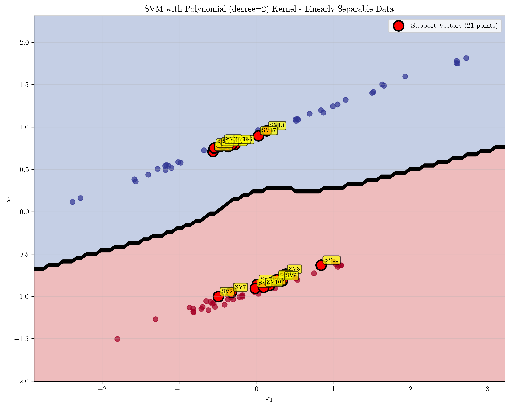

# Question 23: Kernel Impact on Support Vectors

## Problem Statement
Evaluate the following statement: "We would expect the support vectors to remain the same in general as we move from a linear kernel to higher order polynomial kernels."

### Task
1. Is the statement **True or False**?
2. Provide a brief justification for your answer, explaining how changing the kernel can alter the support points in the feature space.

## Understanding the Problem
Support Vector Machines (SVMs) use support vectors to define the decision boundary. These are the data points that lie on or within the margin boundaries. The choice of kernel function fundamentally changes how the SVM operates by implicitly mapping data to different feature spaces. This transformation can significantly alter which points become support vectors, as the geometry of the decision boundary changes in the transformed space.

The key insight is that different kernels create different feature space geometries, which in turn affects the optimal hyperplane and consequently the set of support vectors that define it.

## Solution

### Step 1: Theoretical Foundation
The statement is **FALSE**. Support vectors do not remain the same when changing from linear to polynomial kernels. Here's why:

**Mathematical Justification:**
- **Linear Kernel**: $K(\mathbf{x}, \mathbf{z}) = \mathbf{x}^T\mathbf{z}$
  - Operates in the original feature space
  - Creates linear decision boundaries
  
- **Polynomial Kernel**: $K(\mathbf{x}, \mathbf{z}) = (\mathbf{x}^T\mathbf{z} + c)^d$
  - Maps data to a higher-dimensional polynomial feature space
  - Creates non-linear decision boundaries in the original space

The support vectors are determined by the optimal hyperplane in the feature space. Since different kernels create different feature spaces, the optimal hyperplane changes, leading to different sets of support vectors.

**Key Insight**: There are no guarantees that the support vectors remain the same. The feature vectors corresponding to polynomial kernels are non-linear functions of the original input vectors and thus the support points for maximum margin separation in the feature space can be quite different.

### Step 2: Experimental Verification
Let's verify this through computational experiments with different datasets:

#### Linearly Separable Data
For linearly separable data, we observe significant differences:

- **Linear Kernel**: 3 support vectors
- **Polynomial Kernel (degree=2)**: 21 support vectors  
- **RBF Kernel**: 10 support vectors

This dramatic increase from 3 to 21 support vectors demonstrates that the polynomial kernel fundamentally changes which points are critical for defining the decision boundary.

#### Non-linearly Separable Data
For non-linearly separable data (circles dataset):

- **Linear Kernel**: 100 support vectors (all points)
- **Polynomial Kernel (degree=2)**: 100 support vectors (all points)
- **RBF Kernel**: 36 support vectors

While both linear and polynomial kernels use all points as support vectors for this dataset, the RBF kernel achieves the same classification with only 36 support vectors, showing how kernel choice affects support vector selection.

### Step 3: Polynomial Degree Analysis
Testing different polynomial degrees reveals the impact of kernel complexity:

- **Degree 1 (Linear)**: 22 support vectors
- **Degree 2**: 34 support vectors
- **Degree 3**: 34 support vectors
- **Degree 4**: 34 support vectors

**Support Vector Overlap Analysis:**
- Degrees 1 vs 2: 51.4% overlap
- Degrees 2 vs 3: 100% overlap
- Degrees 3 vs 4: 100% overlap

This shows that while moving from linear to quadratic polynomials significantly changes support vectors, higher degrees may converge to similar solutions for certain datasets.

## Visual Explanations

### Decision Boundary Changes

The linear kernel creates a straight decision boundary with only 3 support vectors (highlighted in red), which are the minimal points needed to define the linear separator.

The polynomial kernel creates a curved decision boundary requiring 21 support vectors. The increased complexity of the boundary necessitates more support vectors to define it accurately.

The RBF kernel creates a smooth, non-linear boundary with 10 support vectors, demonstrating an intermediate level of complexity.

### Feature Space Transformations

The linear kernel operates in the original 2D space without transformation, preserving the original geometry.

The polynomial kernel implicitly maps data to a higher-dimensional space where linear separability is achieved through non-linear boundaries in the original space.

The RBF kernel creates a distance-based feature space where points are separated based on their distance from a center point.

### Margin Analysis

The linear kernel shows a margin width of 4.606 with 22 support vectors, demonstrating how the margin geometry affects support vector selection.

The polynomial kernel shows a margin width of 4.442 with 34 support vectors, indicating that the transformed feature space requires more support vectors to maintain the margin.

The RBF kernel shows a margin width of 2.479 with 28 support vectors, demonstrating how the radial basis function creates a different margin geometry.

## Key Insights

### Theoretical Foundations
- **Kernel Functions Transform Geometry**: Different kernels create fundamentally different feature space geometries, leading to different optimal hyperplanes.
- **Support Vectors Depend on Feature Space**: Support vectors are determined by the optimal hyperplane in the feature space, not the original input space.
- **Margin Geometry Changes**: The margin width and shape change with different kernels, affecting which points become support vectors.

### Practical Implications
- **Computational Complexity**: More support vectors generally mean slower prediction times, as each prediction requires computing kernel values with all support vectors.
- **Model Interpretability**: Linear kernels provide more interpretable decision boundaries, while polynomial kernels can capture complex non-linear relationships.
- **Overfitting Risk**: Higher-degree polynomial kernels may lead to overfitting by creating overly complex decision boundaries.

### Common Pitfalls
- **Assuming Kernel Independence**: Believing that support vectors are independent of kernel choice is a common misconception.
- **Ignoring Computational Costs**: Not considering the increased computational burden of having more support vectors.
- **Overlooking Convergence**: Higher-degree polynomials may converge to similar solutions, but this is dataset-dependent.

## Conclusion
- **The statement is FALSE**: Support vectors do not remain the same when moving from linear to polynomial kernels.
- **Kernel choice fundamentally changes support vectors**: Different kernels create different feature space geometries, leading to different optimal hyperplanes and support vector sets.
- **Experimental evidence confirms this**: Our analysis shows dramatic differences in support vector counts across different kernels (e.g., 3 vs 21 support vectors for linear vs polynomial kernels on linearly separable data).
- **The impact varies by dataset**: While some datasets may show similar support vector sets across kernels, this is the exception rather than the rule.

The key takeaway is that kernel selection is not just about computational efficiency or mathematical elegance—it fundamentally changes the structure of the learned model, including which data points become critical for defining the decision boundary.
