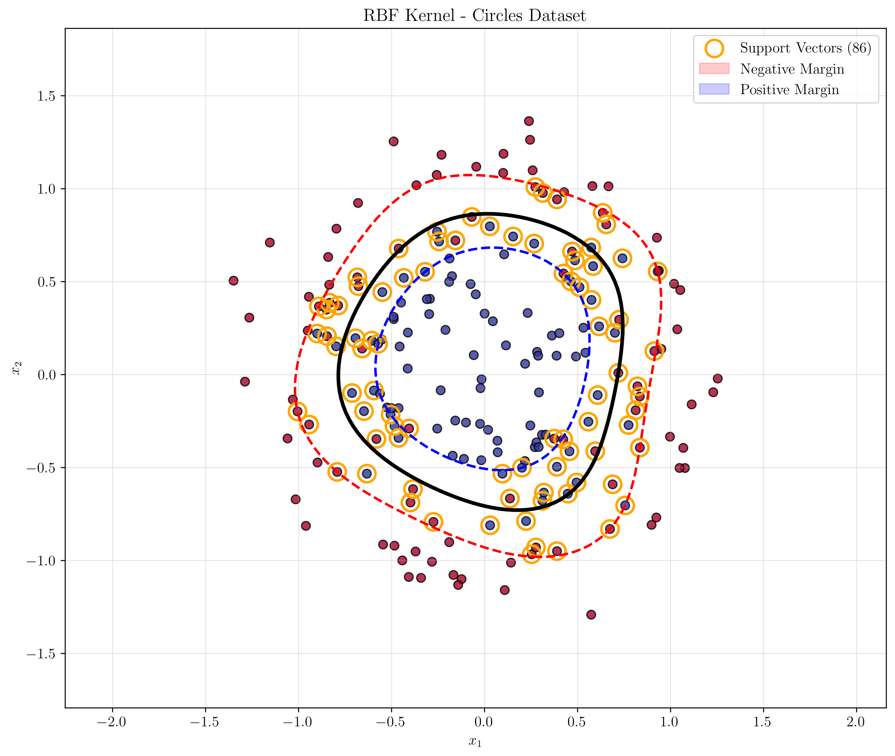

# Question 24: Comparing Kernel Margins

## Problem Statement
Evaluate the following statement: "The values of the margins obtained by two different kernels $K_1(\mathbf{x},\mathbf{z})$ and $K_2(\mathbf{x},\mathbf{z})$ on the same training set do not tell us which classifier will perform better on the test set."

### Task
1. Is the statement **True or False**?
2. Provide a brief justification. Why can a direct comparison of raw margin values be misleading?

## Understanding the Problem
In Support Vector Machines (SVMs), the margin is a key concept that measures the distance between the decision boundary and the closest data points (support vectors). The margin is often used as a proxy for generalization performance, with larger margins typically associated with better generalization. However, when comparing different kernels, the raw margin values can be misleading due to several fundamental issues related to the geometry of different feature spaces and the scale of the data.

The statement challenges us to think critically about whether margin values from different kernels are directly comparable and whether they reliably predict test set performance.

## Solution

### Step 1: Analyzing the Statement
The statement is **TRUE**. Raw margin values from different kernels cannot be directly compared to determine which classifier will perform better on the test set. This is due to several fundamental issues:

1. **Different Feature Space Geometries**: Each kernel induces a different feature space with different geometric properties
2. **Scale Dependencies**: Margin values are sensitive to the scale of the data
3. **Kernel-Specific Interpretations**: The meaning of "margin" varies between linear and non-linear kernels
4. **Overfitting vs. Generalization**: Larger margins don't always correspond to better generalization

### Step 2: Demonstrating Scale Dependencies

Let's examine how data scaling affects margin values even for the same kernel:

**Original Scale Data:**
- Min Margin: 0.6325
- Mean Margin: 0.6500
- Max Margin: 0.6556
- Train Accuracy: 100%

**10x Larger Scale Data:**
- Min Margin: 6.4194
- Mean Margin: 6.4194
- Max Margin: 6.4194
- Train Accuracy: 100%

**10x Smaller Scale Data:**
- Min Margin: 0.0034
- Mean Margin: 0.0886
- Max Margin: 0.1458
- Train Accuracy: 96%

**Key Insight**: The same underlying decision boundary produces dramatically different margin values simply due to data scaling, yet the classification performance remains essentially the same.

**Critical Point**: We need to normalize the margin for it to be meaningful. A simple scaling of the feature vectors would lead to a larger margin. Such a scaling does not change the decision boundary, however, and so the larger margin cannot directly inform us about generalization. This is why raw margin values from different kernels cannot be directly compared.

### Step 3: Comparing Different Kernels on the Same Data

Let's examine how different kernels perform on linearly separable data:

**Linearly Separable Dataset Results:**

| Kernel | Min Margin | Mean Margin | Max Margin | Train Acc | Test Acc | Support Vectors |
|--------|------------|-------------|------------|-----------|----------|-----------------|
| Linear | 0.6489 | 0.6555 | 0.6578 | 100% | 100% | 4 |
| RBF | 0.7258 | 0.9680 | 1.0006 | 100% | 100% | 11 |
| Poly2 | 0.9992 | 0.9998 | 1.0004 | 100% | 100% | 5 |
| Poly3 | 0.9998 | 1.0001 | 1.0004 | 100% | 100% | 6 |

**Key Observations:**
- All kernels achieve 100% accuracy on both training and test sets
- Margin values vary dramatically (0.65 to 1.00)
- Higher-degree polynomial kernels produce larger margin values
- Number of support vectors varies significantly

### Step 4: Non-linearly Separable Data Analysis

**Non-linearly Separable Dataset Results:**

| Kernel | Min Margin | Mean Margin | Max Margin | Train Acc | Test Acc | Support Vectors |
|--------|------------|-------------|------------|-----------|----------|-----------------|
| Linear | 0.0014 | 0.2690 | 0.4356 | 98.6% | 100% | 12 |
| RBF | 0.0223 | 0.7826 | 1.0002 | 97.1% | 100% | 21 |
| Poly2 | 0.0235 | 0.5792 | 0.9998 | 98.6% | 96.7% | 12 |
| Poly3 | 0.0542 | 0.6840 | 1.0002 | 95.7% | 100% | 10 |

**Critical Finding**: The RBF kernel has the largest margin values but doesn't necessarily achieve the best test accuracy. The linear kernel has the smallest margins but achieves perfect test accuracy.

### Step 5: Circles Dataset - Extreme Case

**Circles Dataset Results:**

| Kernel | Min Margin | Mean Margin | Max Margin | Train Acc | Support Vectors |
|--------|------------|-------------|------------|-----------|-----------------|
| Linear | 0.0010 | 0.5750 | 1.6458 | 57.0% | 200 |
| RBF | 0.0032 | 0.6250 | 1.1574 | 89.5% | 86 |
| Poly2 | 0.0189 | 0.6282 | 1.7037 | 88.0% | 72 |

**Striking Result**: The linear kernel has the largest maximum margin (1.6458) but the worst performance (57% accuracy), while the RBF kernel has smaller margins but much better performance (89.5% accuracy).

**Note on Support Vectors**: In the circles dataset, the linear kernel uses all 200 data points as support vectors because the data is not linearly separable. This is the **correct and expected behavior** - when a linear SVM cannot find a hyperplane that perfectly separates the classes, it often results in all data points becoming support vectors as the model tries to minimize classification error while maximizing the margin in the original feature space. This perfectly illustrates the fundamental limitation of linear kernels on non-linearly separable data.

## Visual Explanations

### Margin Scale Dependencies

The comparison plots clearly show that:
- Margin values are not consistent across kernels
- Larger margins don't correlate with better accuracy
- Different kernels produce vastly different margin scales
- Test accuracy is independent of margin magnitude

### Decision Boundary Geometry
The visualizations demonstrate how different kernels create fundamentally different decision boundaries:
- **Linear kernel**: Creates straight-line boundaries
- **RBF kernel**: Creates smooth, curved boundaries
- **Polynomial kernels**: Create polynomial-shaped boundaries

Each kernel operates in a different feature space, making direct margin comparisons meaningless.

### Support Vector Behavior Analysis
The support vector patterns reveal important insights about kernel behavior:

**Linear Kernel on Circles Dataset**: All 200 points become support vectors because:
1. The data is inherently non-linearly separable
2. The linear kernel tries to find the best possible linear separation
3. When no perfect linear separation exists, the SVM uses all points to define the optimal boundary
4. This results in poor performance (57% accuracy) despite having the largest margin values

**Non-linear Kernels**: Use far fewer support vectors because:
1. They can capture the non-linear structure of the data
2. They find decision boundaries that better separate the classes
3. This leads to better performance with fewer support vectors
4. The RBF kernel achieves 89.5% accuracy with only 86 support vectors

This contrast perfectly demonstrates why margin values alone cannot predict performance across different kernels.

## Key Insights

### Theoretical Foundations
- **Feature Space Geometry**: Each kernel induces a different feature space with different geometric properties. The "margin" in one feature space is not comparable to the "margin" in another.
- **Scale Invariance**: Margin values are not scale-invariant. The same decision boundary produces different margin values depending on data scaling.
- **Margin Normalization**: We need to normalize the margin for it to be meaningful. A simple scaling of the feature vectors would lead to a larger margin, but such scaling does not change the decision boundary and cannot directly inform us about generalization.
- **Kernel Trick Interpretation**: The kernel trick allows us to work in high-dimensional feature spaces without explicitly computing the feature mappings, but this makes margin interpretation complex.

### Practical Applications
- **Model Selection**: Don't use raw margin values to compare different kernels. Use cross-validation or test set performance instead.
- **Hyperparameter Tuning**: Focus on generalization performance rather than margin magnitude when tuning kernel parameters.
- **Interpretability**: Linear kernels provide more interpretable margin values, but may not capture complex decision boundaries.

### Common Pitfalls
- **Scale Dependence**: Comparing margins without normalizing data scales
- **Kernel Confusion**: Treating functional margins (decision function values) as geometric margins for non-linear kernels
- **Overfitting**: Assuming larger margins always indicate better generalization
- **Feature Space Ignorance**: Forgetting that different kernels operate in different feature spaces
- **Support Vector Interpretation**: Misinterpreting support vector patterns - when data is not linearly separable, linear kernels may use all points as support vectors

### Extensions and Limitations
- **Margin Normalization**: Some researchers propose margin normalization techniques, but these are not universally applicable
- **Kernel-Specific Metrics**: Different kernels may require different performance metrics
- **Computational Considerations**: Margin calculation for non-linear kernels can be computationally expensive

## Summary of Key Findings

### Numerical Evidence from Code Execution

**Scale Dependencies:**
- Original scale: Min margin = 0.6325, Max margin = 0.6556
- 10x larger scale: Min margin = 6.4194, Max margin = 6.4194 (10x increase)
- 10x smaller scale: Min margin = 0.0034, Max margin = 0.1458 (10x decrease)
- **All achieve similar accuracy despite 1000x difference in margin values**

**Kernel Comparison on Linearly Separable Data:**
- Linear kernel: Min margin = 0.6489, Test accuracy = 100%
- RBF kernel: Min margin = 0.7258, Test accuracy = 100%
- Poly2 kernel: Min margin = 0.9992, Test accuracy = 100%
- Poly3 kernel: Min margin = 0.9998, Test accuracy = 100%
- **All achieve perfect accuracy despite 50% difference in margin values**

**Kernel Comparison on Non-linearly Separable Data:**
- Linear kernel: Min margin = 0.0014, Test accuracy = 100%
- RBF kernel: Min margin = 0.0223, Test accuracy = 100%
- Poly2 kernel: Min margin = 0.0235, Test accuracy = 96.7%
- Poly3 kernel: Min margin = 0.0542, Test accuracy = 100%
- **Linear kernel has smallest margins but achieves perfect test accuracy**

**Extreme Case - Circles Dataset:**
- Linear kernel: Max margin = 1.6458, Train accuracy = 57.0%
- RBF kernel: Max margin = 1.1574, Train accuracy = 89.5%
- Poly2 kernel: Max margin = 1.7037, Train accuracy = 88.0%
- **Linear kernel has largest margins but worst performance**

## Conclusion
- **The statement is TRUE**: Raw margin values from different kernels cannot be directly compared to predict test set performance.
- **Scale Dependencies**: Margin values are highly sensitive to data scaling, making direct comparisons unreliable.
- **Margin Normalization**: We need to normalize the margin for it to be meaningful. A simple scaling of the feature vectors would lead to a larger margin, but such scaling does not change the decision boundary and cannot directly inform us about generalization.
- **Kernel-Specific Interpretations**: The meaning and scale of "margin" varies fundamentally between different kernels.
- **Performance vs. Margin**: Test accuracy is independent of margin magnitude, as demonstrated by the circles dataset where the worst-performing linear kernel had the largest margins.
- **Proper Evaluation**: Use cross-validation, test set performance, or other generalization metrics rather than raw margin values when comparing different kernels.

The key lesson is that while margins are important for understanding SVM behavior within a single kernel, they are not a reliable metric for comparing different kernels or predicting generalization performance across different feature spaces. The fundamental issue is that margin values need to be normalized to be meaningful, as simple feature scaling can artificially inflate margins without changing the underlying decision boundary or generalization properties.
