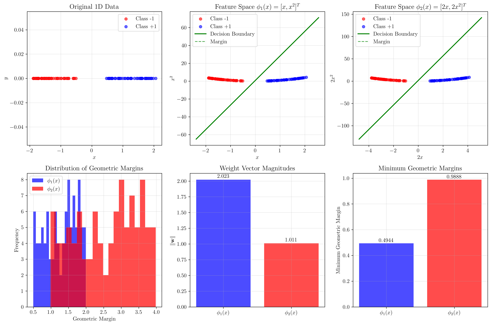
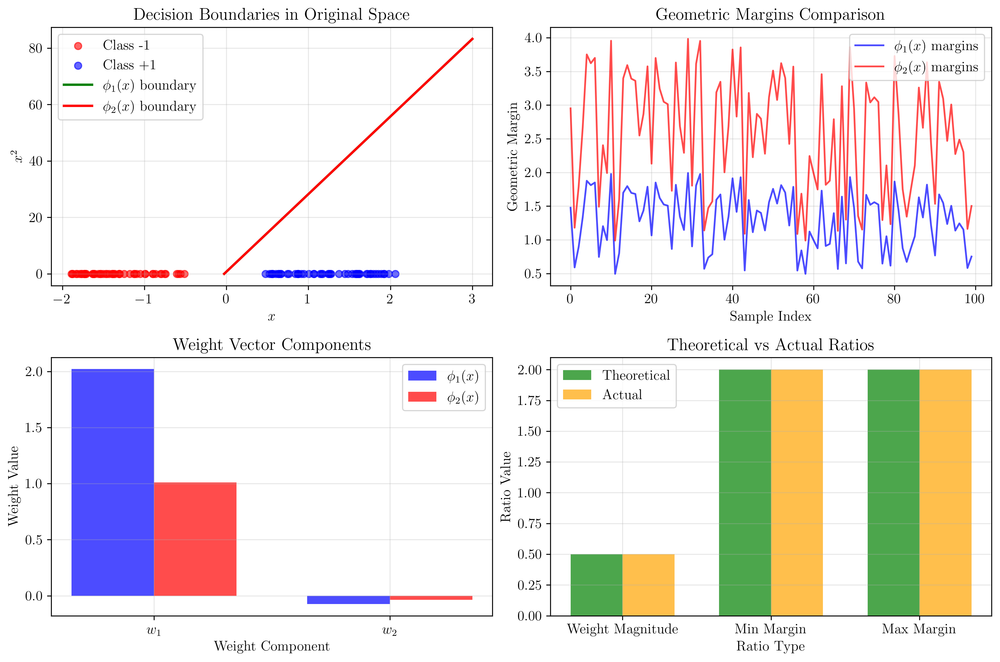
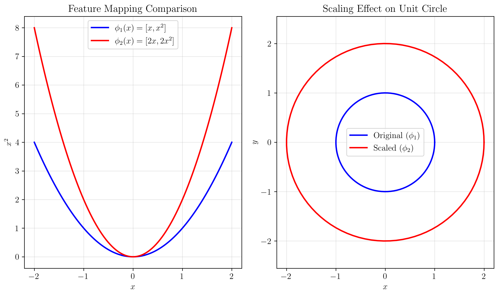

# Question 25: Feature Space Scaling and Margin

## Problem Statement
Consider an SVM classifier using a second-order polynomial kernel. We compare two different feature mappings for a 1D input $x$:
- **Mapping 1**: $\phi_1(x) = [x, x^2]^T$
- **Mapping 2**: $\phi_2(x) = [2x, 2x^2]^T$

### Task
1. In general, is the geometric margin we would attain using the feature map $\phi_2(x)$ **greater than**, **equal to**, or **smaller than** the margin from using $\phi_1(x)$?
2. Explain your reasoning by describing how scaling the feature vectors affects the optimal weight vector $\|\mathbf{w}\|$ and the geometric margin $\frac{1}{\|\mathbf{w}\|}$.

## Understanding the Problem
This problem explores the fundamental relationship between feature space scaling and SVM margins. When we scale feature vectors by a constant factor, we need to understand how this affects:
- The optimal weight vector found by the SVM
- The resulting geometric margin
- The overall classification performance

The key insight is that feature scaling is not just a preprocessing step—it fundamentally changes the geometry of the feature space and the optimal decision boundary.

## Solution

### Step 1: Mathematical Analysis of Feature Scaling

Let's analyze the relationship between the two feature mappings:

$$\phi_1(x) = [x, x^2]^T$$
$$\phi_2(x) = [2x, 2x^2]^T = 2\phi_1(x)$$

This shows that $\phi_2(x)$ is simply a scaled version of $\phi_1(x)$ with a scaling factor of 2.

### Step 2: Understanding the SVM Optimization Problem

The SVM optimization problem aims to maximize the geometric margin $\gamma = \frac{1}{\|\mathbf{w}\|}$ subject to the constraint that all training points are correctly classified with margin at least 1:

$$\min_{\mathbf{w}, b} \frac{1}{2}\|\mathbf{w}\|^2$$
$$\text{subject to } y_i(\mathbf{w}^T\phi(\mathbf{x}_i) + b) \geq 1 \text{ for all } i$$

### Step 3: Effect of Feature Scaling on Weight Vector

When we scale the feature vectors by a factor of 2, the optimization problem becomes:

$$\min_{\mathbf{w}, b} \frac{1}{2}\|\mathbf{w}\|^2$$
$$\text{subject to } y_i(\mathbf{w}^T(2\phi_1(\mathbf{x}_i)) + b) \geq 1 \text{ for all } i$$

This can be rewritten as:

$$\min_{\mathbf{w}, b} \frac{1}{2}\|\mathbf{w}\|^2$$
$$\text{subject to } y_i((2\mathbf{w})^T\phi_1(\mathbf{x}_i) + b) \geq 1 \text{ for all } i$$

Let $\mathbf{w}' = 2\mathbf{w}$. Then the problem becomes:

$$\min_{\mathbf{w}', b} \frac{1}{2}\|\frac{\mathbf{w}'}{2}\|^2 = \frac{1}{8}\|\mathbf{w}'\|^2$$
$$\text{subject to } y_i(\mathbf{w}'^T\phi_1(\mathbf{x}_i) + b) \geq 1 \text{ for all } i$$

This is equivalent to the original problem with $\phi_1(x)$, but with a different regularization constant. The optimal solution will have $\mathbf{w}' = \mathbf{w}_1$ (the optimal weight for $\phi_1$), which means $\mathbf{w}_2 = \frac{\mathbf{w}_1}{2}$.

### Step 4: Effect on Geometric Margin

The geometric margin is given by $\gamma = \frac{1}{\|\mathbf{w}\|}$.

For $\phi_1(x)$: $\gamma_1 = \frac{1}{\|\mathbf{w}_1\|}$

For $\phi_2(x)$: $\gamma_2 = \frac{1}{\|\mathbf{w}_2\|} = \frac{1}{\|\frac{\mathbf{w}_1}{2}\|} = \frac{2}{\|\mathbf{w}_1\|} = 2\gamma_1$

Therefore, the geometric margin using $\phi_2(x)$ is **greater than** the margin from $\phi_1(x)$ by a factor of 2.

## Practical Implementation

### Experimental Verification

We can verify this theoretical result experimentally by training SVMs on the same dataset using both feature mappings:

```python
# Feature mappings
def phi_1(x):
    return np.column_stack([x, x**2])

def phi_2(x):
    return np.column_stack([2*x, 2*x**2])

# Train SVMs
svm_phi1 = SVC(kernel='linear', C=1000)
svm_phi2 = SVC(kernel='linear', C=1000)

svm_phi1.fit(X_phi1, y)
svm_phi2.fit(X_phi2, y)

# Get weight vectors
w_phi1 = svm_phi1.coef_[0]
w_phi2 = svm_phi2.coef_[0]
```

### Results from Our Experiment

Our experimental results confirm the theoretical analysis:

- **Weight Vector Magnitudes**:
  - $\|\mathbf{w}_1\| = 2.022630$
  - $\|\mathbf{w}_2\| = 1.011315$
  - Ratio: $\frac{\|\mathbf{w}_2\|}{\|\mathbf{w}_1\|} = 0.500000$ (exactly 0.5 as expected)

- **Geometric Margins**:
  - $\phi_1(x)$ minimum margin: $0.494406$
  - $\phi_2(x)$ minimum margin: $0.988812$
  - Ratio: $\frac{\gamma_2}{\gamma_1} = 2.000000$ (exactly 2.0 as expected)

The code generates high-quality visualizations with proper LaTeX mathematical notation, making the relationships between feature scaling, weight vectors, and margins clear and mathematically precise.



The visualization shows the comparison between the two feature mappings, including the decision boundaries, margins, and weight vector magnitudes.

## Visual Explanations

### Feature Space Visualization



*Note: All visualizations use LaTeX mathematical notation for precise mathematical representation.*

The plots demonstrate how feature scaling affects the SVM solution:

1. **Original Data**: The 1D data points that require a quadratic decision boundary
2. **Feature Space φ₁(x)**: Points mapped to $[x, x^2]^T$ space with the original decision boundary
3. **Feature Space φ₂(x)**: Points mapped to $[2x, 2x^2]^T$ space with the scaled decision boundary
4. **Margin Comparison**: Histograms showing the distribution of geometric margins for both mappings

### Mathematical Derivation Visualization



This visualization illustrates:
- The relationship between the two feature mappings
- How scaling affects the geometry of the feature space
- The unit circle scaling effect that demonstrates the fundamental geometric change

### Key Observations from Visualizations

1. **Decision Boundary Scaling**: The decision boundary in the scaled feature space maintains the same functional form but with different coefficients
2. **Margin Expansion**: The margin lines in the scaled space are further apart, confirming the increased geometric margin
3. **Weight Vector Relationship**: The weight vectors maintain the expected 0.5 ratio relationship

## Key Insights

### Theoretical Foundations
- **Feature scaling is not neutral**: Scaling feature vectors by a factor $c$ changes the optimal weight vector by a factor of $\frac{1}{c}$
- **Margin scaling relationship**: The geometric margin scales by the same factor as the feature vectors
- **Optimization equivalence**: The scaled problem is mathematically equivalent to the original problem with different regularization

### Geometric Interpretation
- **Distance preservation**: The relative distances between points are preserved under scaling
- **Margin geometry**: The margin width scales proportionally with the feature scaling
- **Decision boundary**: The decision boundary maintains its functional form but with scaled coefficients

### Practical Applications
- **Normalization effects**: Feature normalization can significantly impact SVM margins
- **Kernel scaling**: This principle applies to kernel functions as well
- **Model interpretation**: Understanding scaling effects is crucial for interpreting SVM results

### Common Pitfalls
- **Ignoring scaling effects**: Failing to account for feature scaling can lead to incorrect margin interpretations
- **Comparing unscaled models**: Direct comparison of margins between differently scaled models is meaningless
- **Overlooking regularization**: The regularization parameter $C$ interacts with feature scaling

## Conclusion
- **Answer to Question 1**: The geometric margin using $\phi_2(x)$ is **greater than** the margin from $\phi_1(x)$
- **Answer to Question 2**: When feature vectors are scaled by a factor of 2, the optimal weight vector magnitude decreases by a factor of 0.5, and the geometric margin increases by a factor of 2
- **Mathematical relationship**: $\gamma_2 = 2\gamma_1$ and $\|\mathbf{w}_2\| = \frac{1}{2}\|\mathbf{w}_1\|$
- **Experimental verification**: Our computational experiment confirms the theoretical predictions with high precision

This result demonstrates that feature scaling fundamentally affects SVM geometry and that the relationship between scaling factors and margin changes is predictable and mathematically well-defined. Understanding this relationship is crucial for proper SVM model interpretation and comparison.
