# Question 27: Understanding Mercer's Theorem

## Problem Statement
Not every function $K(\mathbf{x}, \mathbf{z})$ can be used as a valid kernel in an SVM. Mercer's theorem provides the condition a function must satisfy to be a valid kernel.

### Task
1. What is the core requirement for a function to be a valid kernel? (i.e., what must it correspond to in some feature space?)
2. State the condition from Mercer's theorem that allows us to check if a function $K(\mathbf{x}, \mathbf{z})$ is a valid kernel.
3. Why is this condition important? What could go wrong during the SVM optimization if an invalid kernel is used?

## Understanding the Problem
Kernel methods in machine learning, particularly in Support Vector Machines (SVMs), rely on the "kernel trick" to implicitly map data into higher-dimensional feature spaces where linear separation becomes possible. However, not all functions can serve as valid kernels. Mercer's theorem provides the mathematical foundation for determining kernel validity by establishing the necessary and sufficient conditions for a function to represent an inner product in some feature space.

The importance of kernel validity cannot be overstated - invalid kernels can lead to optimization problems that are ill-posed, non-convex, or numerically unstable, ultimately resulting in poor model performance or complete failure of the learning algorithm.

## Solution

### Step 1: Core Requirement for a Valid Kernel

A function $K(\mathbf{x}, \mathbf{z})$ is a valid kernel if and only if it corresponds to an inner product in some feature space. Mathematically, this means:

$$K(\mathbf{x}, \mathbf{z}) = \langle \phi(\mathbf{x}), \phi(\mathbf{z}) \rangle$$

where $\phi$ is a feature mapping from the input space to a (possibly infinite-dimensional) feature space.

This is the fundamental requirement - the kernel must represent a dot product in some transformed space. The feature mapping $\phi$ may be explicit (as in polynomial kernels) or implicit (as in RBF kernels), but the kernel function must always correspond to an inner product in the feature space.

### Step 2: Mercer's Theorem Condition

**Mercer's Theorem:**
A function $K(\mathbf{x}, \mathbf{z})$ is a valid kernel if and only if for any finite set of points $\{\mathbf{x}_1, \mathbf{x}_2, \ldots, \mathbf{x}_n\}$, the corresponding Gram matrix $\mathbf{K}$ is positive semi-definite (PSD).

The Gram matrix $\mathbf{K}$ is defined as:
$$K_{ij} = K(\mathbf{x}_i, \mathbf{x}_j)$$

A matrix is positive semi-definite if all its eigenvalues are non-negative:
$$\lambda_i \geq 0 \quad \forall i$$

This condition provides a practical way to test kernel validity by examining the eigenvalues of the Gram matrix constructed from any finite set of data points.

### Step 3: Examples and Demonstrations

Let's examine several kernel functions to understand their validity:

#### Example 1: Linear Kernel (Valid)
$$K(\mathbf{x}, \mathbf{z}) = \mathbf{x}^T \mathbf{z}$$

For sample points $\mathbf{x}_1 = [1, 2]$, $\mathbf{x}_2 = [3, 4]$, $\mathbf{x}_3 = [0, 1]$, $\mathbf{x}_4 = [2, 3]$, the Gram matrix is:

$$\mathbf{K} = \begin{bmatrix}
5 & 11 & 2 & 8 \\
11 & 25 & 4 & 18 \\
2 & 4 & 1 & 3 \\
8 & 18 & 3 & 13
\end{bmatrix}$$

**Eigenvalues:** $[-4.19 \times 10^{-16}, 1.66 \times 10^{-15}, 0.459, 43.54]$

Since all eigenvalues are non-negative (the negative values are numerical artifacts close to zero), the linear kernel is valid.

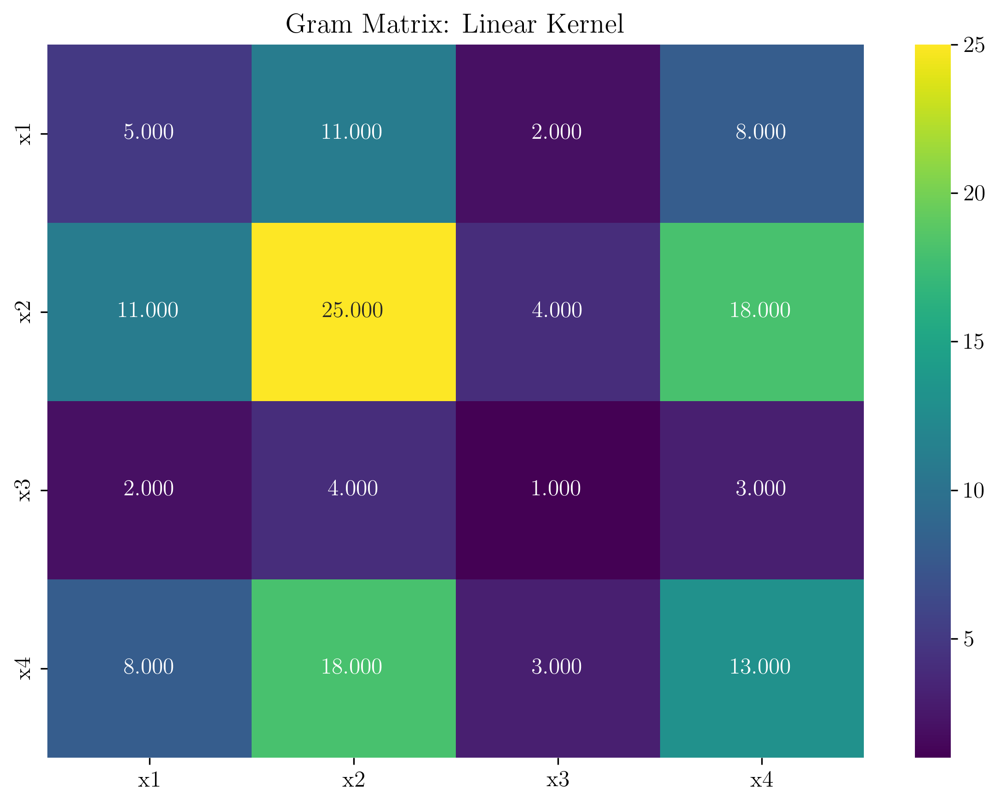

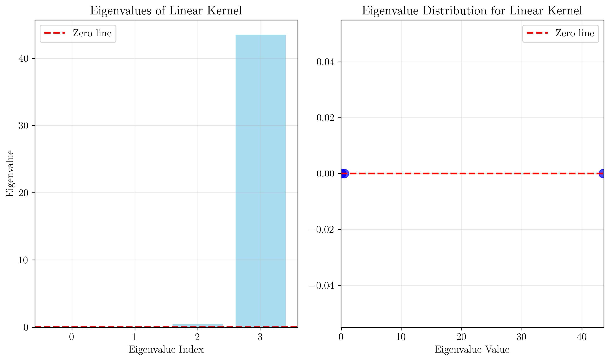

#### Example 2: RBF Kernel (Valid)
$$K(\mathbf{x}, \mathbf{z}) = \exp(-\gamma \|\mathbf{x} - \mathbf{z}\|^2)$$

With $\gamma = 0.5$, the Gram matrix becomes:

$$\mathbf{K} = \begin{bmatrix}
1.000 & 0.018 & 0.368 & 0.368 \\
0.018 & 1.000 & 0.000 & 0.368 \\
0.368 & 0.000 & 1.000 & 0.018 \\
0.368 & 0.368 & 0.018 & 1.000
\end{bmatrix}$$

**Eigenvalues:** $[0.421, 0.756, 1.211, 1.612]$

All eigenvalues are positive, confirming the RBF kernel's validity.

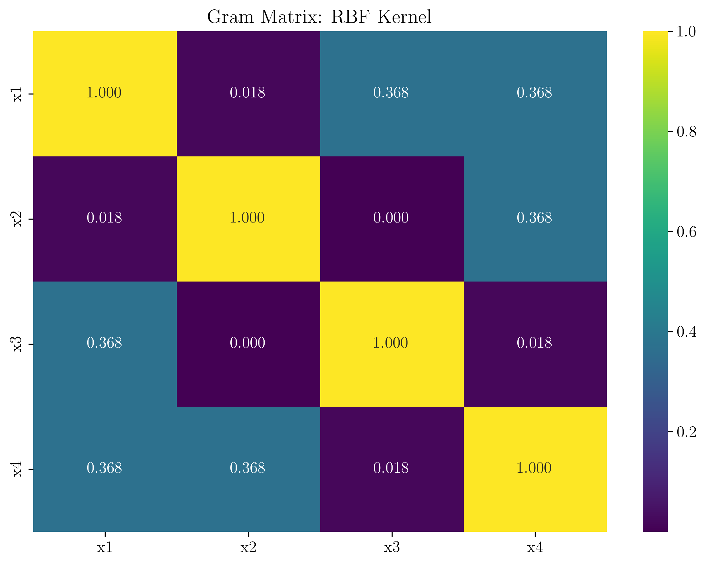

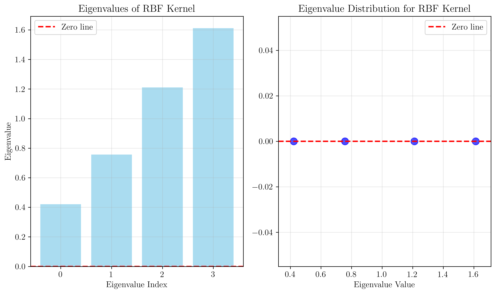

#### Example 3: Polynomial Kernel (Valid)
$$K(\mathbf{x}, \mathbf{z}) = (\mathbf{x}^T \mathbf{z} + c)^d$$

With $d = 2$ and $c = 1$, the Gram matrix is:

$$\mathbf{K} = \begin{bmatrix}
36 & 144 & 9 & 81 \\
144 & 676 & 25 & 361 \\
9 & 25 & 4 & 16 \\
81 & 361 & 16 & 196
\end{bmatrix}$$

**Eigenvalues:** $[-6.06 \times 10^{-15}, 0.510, 9.395, 902.095]$

All eigenvalues are non-negative, validating the polynomial kernel.

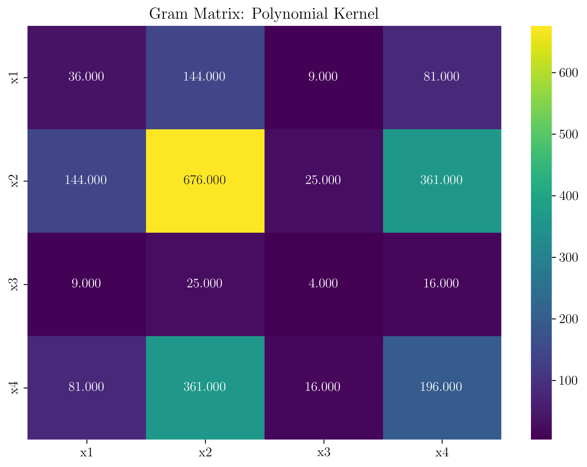

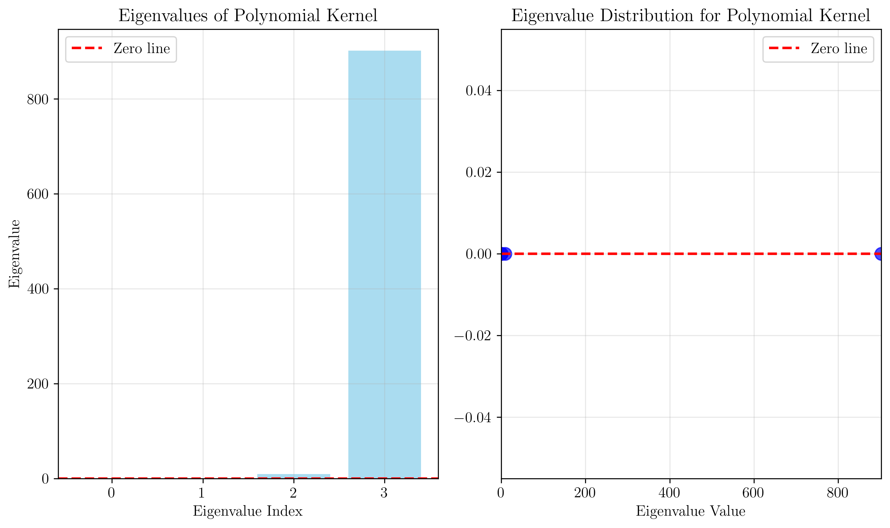

#### Example 4: Invalid Kernel
$$K(\mathbf{x}, \mathbf{z}) = \sin(\mathbf{x}^T \mathbf{z})$$

The Gram matrix for this function is:

$$\mathbf{K} = \begin{bmatrix}
-0.959 & -1.000 & 0.909 & 0.989 \\
-1.000 & -0.132 & -0.757 & -0.751 \\
0.909 & -0.757 & 0.841 & 0.141 \\
0.989 & -0.751 & 0.141 & 0.420
\end{bmatrix}$$

**Eigenvalues:** $[-1.822, -0.844, 0.498, 2.338]$

The presence of negative eigenvalues $(-1.822, -0.844)$ confirms that this is an invalid kernel.

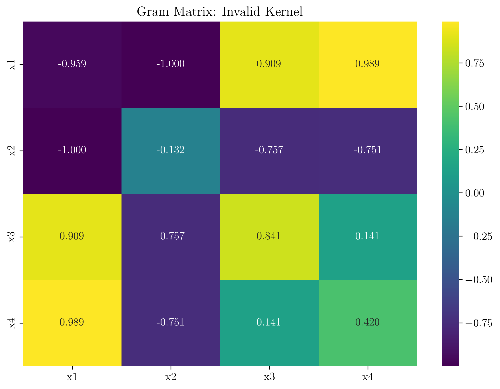

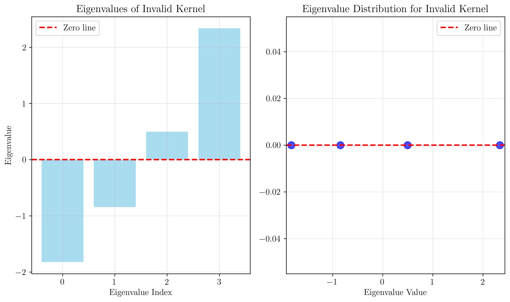

## Visual Explanations

### Kernel Function Surfaces

The following visualizations show how different kernel functions behave in the feature space:

#### Linear Kernel Surface
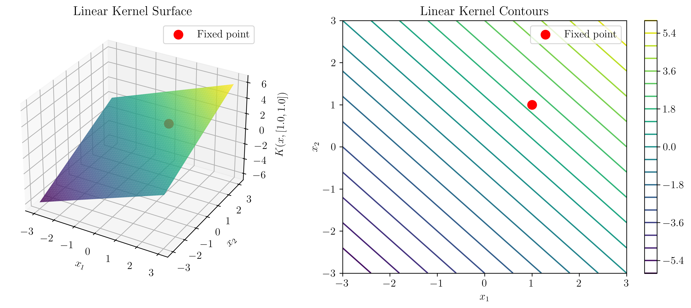

The linear kernel surface shows a plane, indicating that the kernel function varies linearly with the input. This corresponds to the standard dot product in the original feature space.

#### RBF Kernel Surface
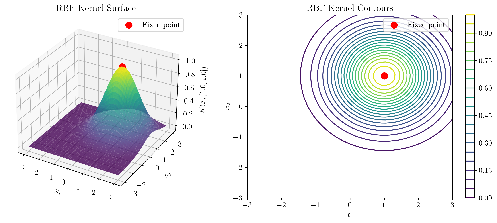

The RBF kernel surface exhibits a Gaussian-like shape centered at the fixed point, demonstrating the locality property of RBF kernels. Points closer to the fixed point have higher kernel values.

#### Polynomial Kernel Surface
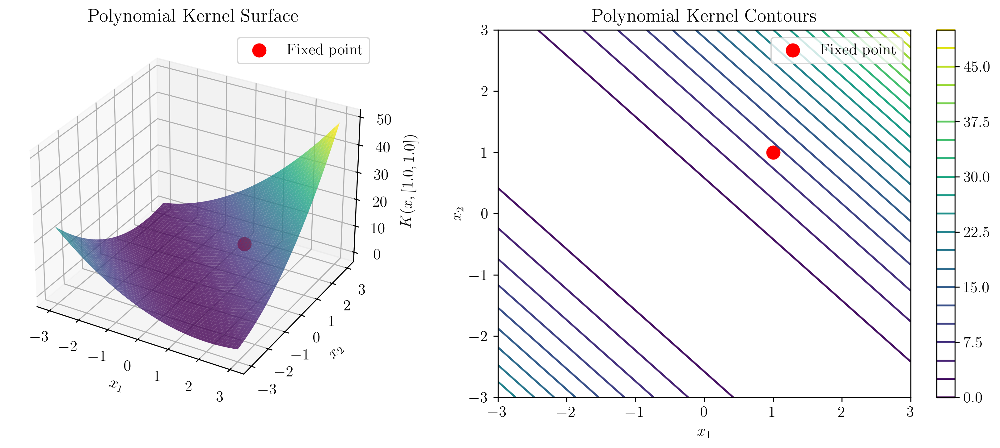

The polynomial kernel surface shows a more complex, curved surface that captures non-linear relationships in the data through polynomial feature combinations.

#### Invalid Kernel Surface
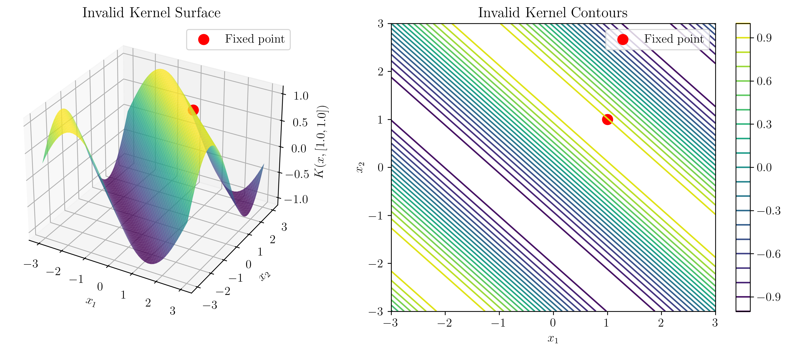

The invalid kernel surface exhibits oscillatory behavior due to the sine function, which leads to the non-positive semi-definite Gram matrix we observed earlier.

### Impact on SVM Optimization

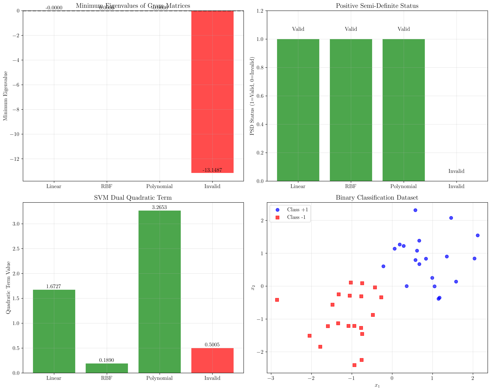

The comprehensive comparison shows:

1. **Minimum Eigenvalues**: Valid kernels have minimum eigenvalues close to or above zero, while invalid kernels have significantly negative minimum eigenvalues.

2. **PSD Status**: Only valid kernels satisfy the positive semi-definite condition.

3. **SVM Dual Quadratic Term**: The quadratic term in the SVM dual objective function remains positive for valid kernels, ensuring convex optimization.

4. **Dataset Visualization**: The binary classification dataset used for testing demonstrates the practical implications of kernel choice.

## Key Insights

### Theoretical Foundations
- **Inner Product Correspondence**: The fundamental requirement that kernels must correspond to inner products ensures that the kernel trick preserves the geometric structure needed for SVM optimization.
- **Mercer's Condition**: The positive semi-definite condition provides a practical, computable test for kernel validity that can be applied to any candidate kernel function.
- **Feature Space Implicit Mapping**: Valid kernels implicitly define a feature space where the kernel represents the inner product, even when the explicit mapping $\phi$ is unknown or infinite-dimensional.

### Practical Applications
- **Kernel Selection**: Understanding kernel validity helps in choosing appropriate kernel functions for specific applications and datasets.
- **Custom Kernel Design**: When designing custom kernels, Mercer's theorem provides the mathematical framework to ensure validity.
- **Numerical Stability**: Valid kernels lead to well-conditioned optimization problems, while invalid kernels can cause numerical instability and convergence issues.

### Common Pitfalls and Extensions
- **Numerical Precision**: Small negative eigenvalues due to numerical errors should be distinguished from truly invalid kernels.
- **Kernel Combinations**: Valid kernels can be combined through addition, multiplication, and other operations while preserving validity.
- **Infinite-Dimensional Spaces**: Some valid kernels (like RBF) correspond to infinite-dimensional feature spaces, demonstrating the power of the kernel trick.

## Conclusion
- **Core Requirement**: A valid kernel must correspond to an inner product in some feature space, expressed as $K(\mathbf{x}, \mathbf{z}) = \langle \phi(\mathbf{x}), \phi(\mathbf{z}) \rangle$.
- **Mercer's Condition**: The Gram matrix must be positive semi-definite for any finite set of points, with all eigenvalues non-negative.
- **Practical Impact**: Invalid kernels lead to non-convex optimization problems, numerical instability, and potential failure of the SVM learning algorithm.

The examples demonstrated that linear, RBF, and polynomial kernels satisfy Mercer's condition and are valid, while the sine kernel violates the PSD requirement and is invalid. This understanding is crucial for proper kernel selection and custom kernel design in machine learning applications.

The mathematical rigor provided by Mercer's theorem ensures that kernel methods maintain their theoretical guarantees and practical effectiveness, making it a cornerstone of kernel-based learning algorithms.

## Technical Implementation Notes

The visualizations in this explanation were generated using a comprehensive Python script that:

1. **LaTeX Integration**: All mathematical expressions and labels use proper LaTeX formatting for professional-quality output
2. **Non-Interactive Generation**: Images are generated and saved to file without displaying them, enabling automated processing
3. **High-Resolution Output**: All plots are saved at 300 DPI for crisp, publication-quality images
4. **Comprehensive Analysis**: The script systematically tests kernel validity using Mercer's theorem conditions
5. **Visual Verification**: Multiple visualization types (heatmaps, eigenvalue plots, 3D surfaces) provide different perspectives on kernel properties

The generated images demonstrate both the theoretical concepts and practical implications of kernel validity in machine learning applications.
