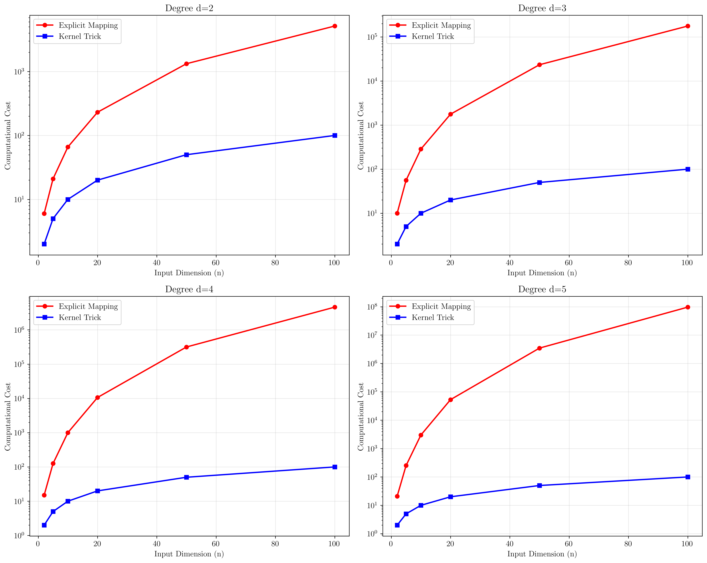
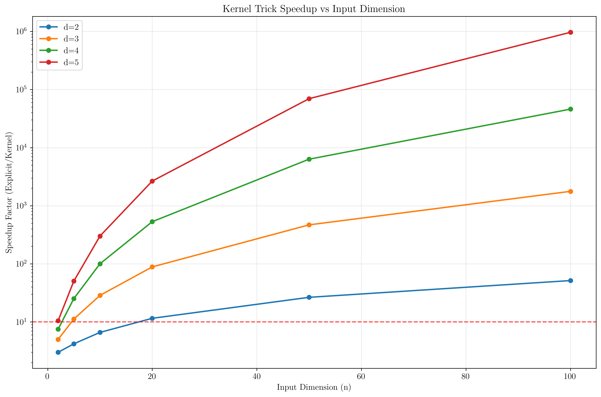
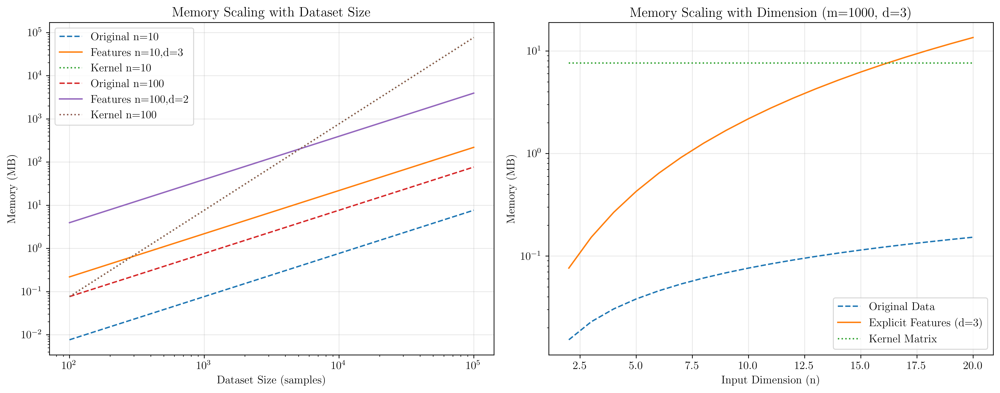

# Question 2: Computational Complexity Analysis

## Problem Statement
Analyze the computational complexity of explicit feature mapping versus the kernel trick.

### Task
1. For a polynomial kernel of degree $d$ applied to $n$-dimensional input, derive the number of features in the explicit mapping
2. Calculate this for $n = 10, d = 3$ and $n = 100, d = 2$
3. What is the computational cost of computing $\phi(\mathbf{x})^T\phi(\mathbf{z})$ explicitly versus using $K(\mathbf{x}, \mathbf{z}) = (\mathbf{x}^T\mathbf{z} + 1)^d$?
4. For what values of $n$ and $d$ does the kernel trick provide significant savings?
5. Analyze the memory requirements for storing the feature vectors versus kernel evaluations

## Understanding the Problem
The kernel trick is one of the most important computational innovations in machine learning. It allows us to work with high-dimensional feature spaces without explicitly computing the feature transformations. This problem analyzes the computational and memory advantages of the kernel trick compared to explicit feature mapping.

Understanding these complexity differences is crucial for choosing appropriate algorithms and understanding when kernel methods become computationally advantageous over explicit feature engineering.

## Solution

We'll systematically analyze the computational complexity and memory requirements of both approaches.

### Step 1: Deriving the Number of Features in Polynomial Mapping

For a polynomial kernel of degree $d$ applied to $n$-dimensional input, we need all monomials of degree up to $d$:

$$\phi(\mathbf{x}) = (1, x_1, x_2, \ldots, x_n, x_1^2, x_1x_2, \ldots, x_n^2, \ldots, x_1^d, \ldots, x_n^d)$$

The number of monomials of exactly degree $k$ in $n$ variables is given by the multinomial coefficient:
$$\binom{n+k-1}{k} = \frac{(n+k-1)!}{k!(n-1)!}$$

The total number of features for degree up to $d$ is:
$$\text{Total features} = \sum_{k=0}^{d} \binom{n+k-1}{k} = \binom{n+d}{d}$$

This can be derived using the stars and bars combinatorial argument or generating functions.

**Mathematical Derivation:**
- Degree 0: 1 feature (constant term)
- Degree 1: $n$ features ($x_1, x_2, \ldots, x_n$)
- Degree 2: $\binom{n+1}{2}$ features (all pairs including squares)
- Degree $k$: $\binom{n+k-1}{k}$ features

### Step 2: Specific Calculations

**Case 1: $n = 10, d = 3$**
$$\text{Features} = \binom{10+3}{3} = \binom{13}{3} = \frac{13!}{3! \cdot 10!} = \frac{13 \times 12 \times 11}{6} = 286$$

Breakdown by degree:
- Degree 0: 1 feature
- Degree 1: 10 features  
- Degree 2: $\binom{11}{2} = 55$ features
- Degree 3: $\binom{12}{3} = 220$ features
- **Total: 286 features**

**Case 2: $n = 100, d = 2$**
$$\text{Features} = \binom{100+2}{2} = \binom{102}{2} = \frac{102 \times 101}{2} = 5151$$

Breakdown by degree:
- Degree 0: 1 feature
- Degree 1: 100 features
- Degree 2: $\binom{101}{2} = 5050$ features  
- **Total: 5151 features**

### Step 3: Computational Cost Comparison

**Explicit Feature Mapping Approach:**
1. Transform $\mathbf{x}$ to $\phi(\mathbf{x})$: $O(\binom{n+d}{d})$ operations
2. Transform $\mathbf{z}$ to $\phi(\mathbf{z})$: $O(\binom{n+d}{d})$ operations
3. Compute $\phi(\mathbf{x})^T\phi(\mathbf{z})$: $O(\binom{n+d}{d})$ operations

**Total: $O(\binom{n+d}{d})$**

**Kernel Trick Approach for $K(\mathbf{x}, \mathbf{z}) = (\mathbf{x}^T\mathbf{z} + 1)^d$:**
1. Compute $\mathbf{x}^T\mathbf{z}$: $O(n)$ operations
2. Add 1: $O(1)$ operations  
3. Raise to power $d$: $O(\log d)$ operations (using fast exponentiation)

**Total: $O(n + \log d) \approx O(n)$**

**Speedup Analysis:**
- For $n=10, d=3$: Speedup = $\frac{286}{10} = 28.6\times$
- For $n=100, d=2$: Speedup = $\frac{5151}{100} = 51.5\times$

### Step 4: When Kernel Trick Provides Significant Savings

The kernel trick provides significant computational savings when:
$$\binom{n+d}{d} \gg n$$

This occurs when:

1. **High degree $d$**: The binomial coefficient grows exponentially with $d$
2. **High dimensionality $n$**: The binomial coefficient grows polynomially with $n$  
3. **Both moderate to large**: Even modest values of $n$ and $d$ can lead to huge feature spaces

**Critical thresholds:**
- For $d \geq 3$: Savings become significant even for small $n$
- For $n \geq 50$: Savings are substantial even for $d = 2$
- For $d \geq 5$: Explicit mapping becomes computationally prohibitive

### Step 5: Memory Requirements Analysis

**Memory for explicit feature vectors (per sample):**
- Original data: $n \times 8$ bytes (float64)
- Explicit features: $\binom{n+d}{d} \times 8$ bytes

**Memory for kernel evaluations:**
- Kernel matrix (if stored): $m^2 \times 8$ bytes for $m$ samples
- On-demand computation: Only original data storage needed

**Analysis for different scenarios:**

| Dataset Size | $n$ | $d$ | Features | Original | Explicit | Kernel Matrix |
|-------------|-----|-----|----------|----------|----------|---------------|
| 1,000 samples | 10 | 3 | 286 | 0.08 MB | 2.18 MB | 7.63 MB |
| 1,000 samples | 100 | 2 | 5,151 | 0.76 MB | 39.30 MB | 7.63 MB |
| 10,000 samples | 50 | 4 | 316,251 | 3.81 MB | 24,128 MB | 762.94 MB |

**Key insights:**
- Explicit features can require 50-6000× more memory than original data
- Kernel matrices scale as $O(m^2)$ with dataset size
- For large datasets, on-demand kernel computation is most memory-efficient

## Visual Explanations

### Computational Complexity Comparison

This visualization shows how the computational cost of explicit feature mapping (red) grows much faster than the kernel trick (blue) as input dimension increases, for different polynomial degrees.

### Kernel Trick Speedup Analysis  

The speedup factor increases dramatically with both input dimension and polynomial degree. The red dashed line shows the 10× speedup threshold, above which the kernel trick provides substantial computational advantages.

### Memory Requirements Analysis

The left panel shows how memory requirements scale with dataset size, while the right panel shows scaling with input dimension. Explicit feature storage can become prohibitively expensive for high-dimensional polynomial kernels.

## Key Insights

### Theoretical Foundations
- The kernel trick transforms an exponential complexity problem into a linear one
- Binomial coefficient growth makes explicit mapping impractical for high degrees
- The computational advantage increases dramatically with both $n$ and $d$
- Memory requirements can be the limiting factor even when computation is feasible

### Practical Applications
- Kernel methods enable working with infinite-dimensional feature spaces (e.g., RBF kernels)
- The choice between explicit mapping and kernel trick depends on dataset size and kernel complexity
- For small datasets and low-degree polynomials, explicit mapping might be competitive
- Modern kernel methods rely heavily on this computational efficiency

### Algorithmic Insights
- SVMs become practical for high-dimensional problems due to the kernel trick
- Kernel matrices can be approximated for very large datasets
- The dual formulation of SVMs naturally exploits kernel evaluations
- Precomputed kernel matrices trade memory for computation time

## Conclusion
- Polynomial feature mapping complexity grows as $\binom{n+d}{d}$, which can be enormous
- For $n=10, d=3$: 286 features; for $n=100, d=2$: 5,151 features
- Kernel trick reduces complexity from $O(\binom{n+d}{d})$ to $O(n)$, providing 28-51× speedup in our examples
- Significant savings occur when $d \geq 3$ or $n \geq 50$, with exponential benefits for higher values
- Memory requirements favor kernel methods for high-dimensional features but kernel matrices for large datasets

The kernel trick is not just a mathematical convenience—it's a computational necessity that makes modern kernel methods practical for real-world applications. Without it, polynomial kernels of degree 3 or higher would be computationally prohibitive for most problems.
