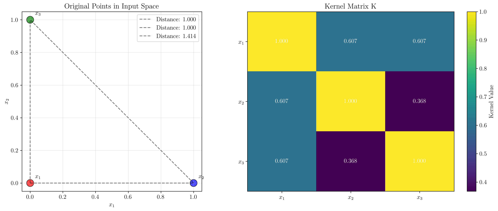
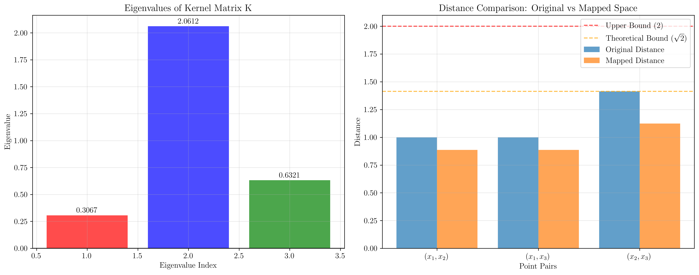
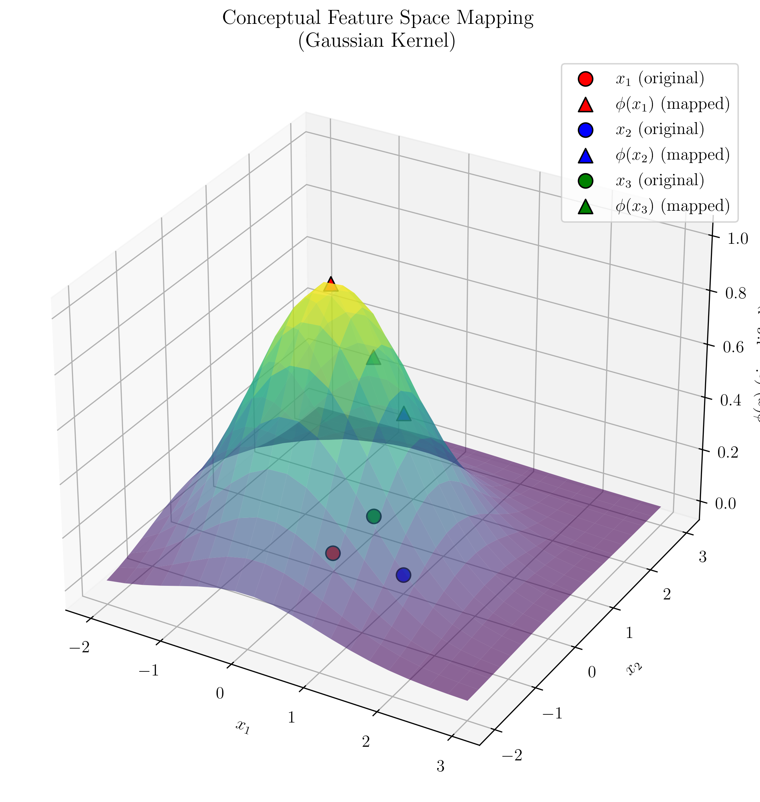
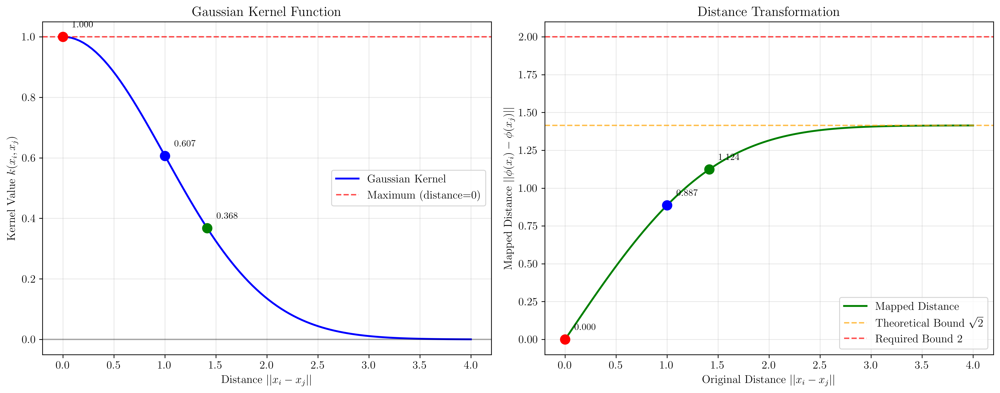

# Question 31: Gaussian Kernel Proof

## Problem Statement
Assume we are using the Gaussian kernel $k(x_i, x_j) = \exp\left(-\frac{1}{2}\|x_i - x_j\|^2\right)$.

### Task
1. Prove that the Euclidean distance between the mapped points $\phi(x_i)$ and $\phi(x_j)$ in the new feature space is less than 2.
2. Using the same Gaussian kernel, calculate the kernel values for three points: $x_1 = (0, 0)$, $x_2 = (1, 0)$, and $x_3 = (0, 1)$. Then prove that the resulting $3 \times 3$ kernel matrix is positive semi-definite by showing that all its eigenvalues are non-negative.

## Understanding the Problem
The Gaussian kernel (also known as the Radial Basis Function or RBF kernel) is one of the most widely used kernels in machine learning. It maps data points to an infinite-dimensional feature space where the inner product between any two points is given by the kernel function. The key insight is that this mapping preserves certain geometric properties while allowing us to work in high-dimensional spaces without explicitly computing the feature mappings.

The problem asks us to prove two important properties:
1. **Boundedness**: The distance between any two mapped points is bounded above by 2
2. **Positive Semi-definiteness**: The kernel matrix constructed from any set of points must be positive semi-definite

These properties are crucial for the theoretical foundations of kernel methods and ensure that the kernel can be used in optimization problems like Support Vector Machines.

## Solution

### Part 1: Proving Euclidean Distance < 2

**Objective**: Prove that for any two points $x_i$ and $x_j$, the Euclidean distance between their mapped representations $\phi(x_i)$ and $\phi(x_j)$ in the feature space is less than 2.

**Given**: Gaussian kernel $k(x_i, x_j) = \exp\left(-\frac{1}{2}\|x_i - x_j\|^2\right)$

**To Prove**: $\|\phi(x_i) - \phi(x_j)\| < 2$ for any $x_i, x_j$

#### Step 1: Understanding the Kernel-Feature Space Relationship

**Key Insight**: A kernel function $k(x_i, x_j)$ implicitly defines an inner product in a feature space:
$$k(x_i, x_j) = \langle \phi(x_i), \phi(x_j) \rangle$$

where:
- $\phi(x)$ is the feature mapping function
- $\langle \cdot, \cdot \rangle$ denotes the inner product in the feature space

**Why this matters**: This relationship allows us to compute distances in the feature space using only kernel values, without explicitly knowing the feature mapping $\phi$.

#### Step 2: Expressing Distance in Terms of Kernel Values

**Goal**: Find a formula for $\|\phi(x_i) - \phi(x_j)\|^2$ using only kernel values.

**Step 2.1**: Expand the squared distance using the definition of norm:
$$\|\phi(x_i) - \phi(x_j)\|^2 = \langle \phi(x_i) - \phi(x_j), \phi(x_i) - \phi(x_j) \rangle$$

**Step 2.2**: Use the bilinearity of inner product to expand:
$$\begin{align}
\langle \phi(x_i) - \phi(x_j), \phi(x_i) - \phi(x_j) \rangle &= \langle \phi(x_i), \phi(x_i) - \phi(x_j) \rangle - \langle \phi(x_j), \phi(x_i) - \phi(x_j) \rangle \\
&= \langle \phi(x_i), \phi(x_i) \rangle - \langle \phi(x_i), \phi(x_j) \rangle - \langle \phi(x_j), \phi(x_i) \rangle + \langle \phi(x_j), \phi(x_j) \rangle
\end{align}$$

**Step 2.3**: Use the symmetry of inner product ($\langle a, b \rangle = \langle b, a \rangle$):
$$\begin{align}
\langle \phi(x_i), \phi(x_i) \rangle - \langle \phi(x_i), \phi(x_j) \rangle - \langle \phi(x_j), \phi(x_i) \rangle + \langle \phi(x_j), \phi(x_j) \rangle &= \langle \phi(x_i), \phi(x_i) \rangle - 2\langle \phi(x_i), \phi(x_j) \rangle + \langle \phi(x_j), \phi(x_j) \rangle \\
&= \langle \phi(x_i), \phi(x_i) \rangle + \langle \phi(x_j), \phi(x_j) \rangle - 2\langle \phi(x_i), \phi(x_j) \rangle
\end{align}$$

**Step 2.4**: Substitute kernel values using the kernel-feature space relationship:
$$\|\phi(x_i) - \phi(x_j)\|^2 = k(x_i, x_i) + k(x_j, x_j) - 2k(x_i, x_j)$$

**Result**: We now have a formula for the squared distance in terms of kernel values only!

#### Step 3: Analyzing the Gaussian Kernel Properties

**Given**: Gaussian kernel $k(x_i, x_j) = \exp\left(-\frac{1}{2}\|x_i - x_j\|^2\right)$

**Step 3.1**: Calculate $k(x_i, x_i)$ (kernel of a point with itself):
$$\begin{align}
k(x_i, x_i) &= \exp\left(-\frac{1}{2}\|x_i - x_i\|^2\right) \\
&= \exp\left(-\frac{1}{2} \cdot 0^2\right) \\
&= \exp(0) \\
&= 1
\end{align}$$

**Step 3.2**: Calculate $k(x_j, x_j)$ (kernel of a point with itself):
$$\begin{align}
k(x_j, x_j) &= \exp\left(-\frac{1}{2}\|x_j - x_j\|^2\right) \\
&= \exp\left(-\frac{1}{2} \cdot 0^2\right) \\
&= \exp(0) \\
&= 1
\end{align}$$

**Step 3.3**: The cross-term $k(x_i, x_j)$:
$$k(x_i, x_j) = \exp\left(-\frac{1}{2}\|x_i - x_j\|^2\right)$$

**Key Observation**: Since $\|x_i - x_j\|^2 \geq 0$ for any real vectors, we have:
$$0 < \exp\left(-\frac{1}{2}\|x_i - x_j\|^2\right) \leq 1$$

#### Step 4: Substituting into the Distance Formula

**Step 4.1**: Substitute the kernel values into our distance formula:
$$\begin{align}
\|\phi(x_i) - \phi(x_j)\|^2 &= k(x_i, x_i) + k(x_j, x_j) - 2k(x_i, x_j) \\
&= 1 + 1 - 2 \cdot \exp\left(-\frac{1}{2}\|x_i - x_j\|^2\right) \\
&= 2 - 2 \cdot \exp\left(-\frac{1}{2}\|x_i - x_j\|^2\right)
\end{align}$$

**Step 4.2**: Factor out the common term:
$$\|\phi(x_i) - \phi(x_j)\|^2 = 2 \cdot \left(1 - \exp\left(-\frac{1}{2}\|x_i - x_j\|^2\right)\right)$$

#### Step 5: Analyzing the Bounded Expression

**Step 5.1**: Let's analyze the term inside the parentheses:
$$1 - \exp\left(-\frac{1}{2}\|x_i - x_j\|^2\right)$$

**Step 5.2**: Since $\exp\left(-\frac{1}{2}\|x_i - x_j\|^2\right) > 0$ for any finite distance:
$$1 - \exp\left(-\frac{1}{2}\|x_i - x_j\|^2\right) < 1$$

**Step 5.3**: Therefore:
$$\|\phi(x_i) - \phi(x_j)\|^2 < 2 \cdot 1 = 2$$

**Step 5.4**: Taking the square root of both sides:
$$\|\phi(x_i) - \phi(x_j)\| < \sqrt{2} \approx 1.414$$

**Step 5.5**: Since $\sqrt{2} < 2$, we have:
$$\|\phi(x_i) - \phi(x_j)\| < 2$$

### Part 2: Kernel Matrix and Positive Semi-definiteness

#### Step 1: Calculate All Pairwise Kernel Values
Given the three points:
- $x_1 = (0, 0)$
- $x_2 = (1, 0)$
- $x_3 = (0, 1)$

We need to calculate the kernel matrix $K$ where $K[i,j] = k(x_i, x_j)$. Let's compute each element step by step:

**$K[1,1] = k(x_1, x_1)$:**
- $x_1 = (0, 0)$, $x_1 = (0, 0)$
- $\|x_1 - x_1\|^2 = \|(0,0) - (0,0)\|^2 = \|(0,0)\|^2 = 0^2 + 0^2 = 0.0000$
- $k(x_1, x_1) = \exp\left(-\frac{1}{2} \cdot 0.0000\right) = \exp(-0.0000) = 1.000000$

**$K[1,2] = k(x_1, x_2)$:**
- $x_1 = (0, 0)$, $x_2 = (1, 0)$
- $\|x_1 - x_2\|^2 = \|(0,0) - (1,0)\|^2 = \|(-1,0)\|^2 = (-1)^2 + 0^2 = 1.0000$
- $k(x_1, x_2) = \exp\left(-\frac{1}{2} \cdot 1.0000\right) = \exp(-0.5000) = 0.606531$

**$K[1,3] = k(x_1, x_3)$:**
- $x_1 = (0, 0)$, $x_3 = (0, 1)$
- $\|x_1 - x_3\|^2 = \|(0,0) - (0,1)\|^2 = \|(0,-1)\|^2 = 0^2 + (-1)^2 = 1.0000$
- $k(x_1, x_3) = \exp\left(-\frac{1}{2} \cdot 1.0000\right) = \exp(-0.5000) = 0.606531$

**$K[2,1] = k(x_2, x_1)$:**
- $x_2 = (1, 0)$, $x_1 = (0, 0)$
- $\|x_2 - x_1\|^2 = \|(1,0) - (0,0)\|^2 = \|(1,0)\|^2 = 1^2 + 0^2 = 1.0000$
- $k(x_2, x_1) = \exp\left(-\frac{1}{2} \cdot 1.0000\right) = \exp(-0.5000) = 0.606531$

**$K[2,2] = k(x_2, x_2)$:**
- $x_2 = (1, 0)$, $x_2 = (1, 0)$
- $\|x_2 - x_2\|^2 = \|(1,0) - (1,0)\|^2 = \|(0,0)\|^2 = 0^2 + 0^2 = 0.0000$
- $k(x_2, x_2) = \exp\left(-\frac{1}{2} \cdot 0.0000\right) = \exp(-0.0000) = 1.000000$

**$K[2,3] = k(x_2, x_3)$:**
- $x_2 = (1, 0)$, $x_3 = (0, 1)$
- $\|x_2 - x_3\|^2 = \|(1,0) - (0,1)\|^2 = \|(1,-1)\|^2 = 1^2 + (-1)^2 = 2.0000$
- $k(x_2, x_3) = \exp\left(-\frac{1}{2} \cdot 2.0000\right) = \exp(-1.0000) = 0.367879$

**$K[3,1] = k(x_3, x_1)$:**
- $x_3 = (0, 1)$, $x_1 = (0, 0)$
- $\|x_3 - x_1\|^2 = \|(0,1) - (0,0)\|^2 = \|(0,1)\|^2 = 0^2 + 1^2 = 1.0000$
- $k(x_3, x_1) = \exp\left(-\frac{1}{2} \cdot 1.0000\right) = \exp(-0.5000) = 0.606531$

**$K[3,2] = k(x_3, x_2)$:**
- $x_3 = (0, 1)$, $x_2 = (1, 0)$
- $\|x_3 - x_2\|^2 = \|(0,1) - (1,0)\|^2 = \|(-1,1)\|^2 = (-1)^2 + 1^2 = 2.0000$
- $k(x_3, x_2) = \exp\left(-\frac{1}{2} \cdot 2.0000\right) = \exp(-1.0000) = 0.367879$

**$K[3,3] = k(x_3, x_3)$:**
- $x_3 = (0, 1)$, $x_3 = (0, 1)$
- $\|x_3 - x_3\|^2 = \|(0,1) - (0,1)\|^2 = \|(0,0)\|^2 = 0^2 + 0^2 = 0.0000$
- $k(x_3, x_3) = \exp\left(-\frac{1}{2} \cdot 0.0000\right) = \exp(-0.0000) = 1.000000$

Therefore, the kernel matrix $K$ is:
$$K = \begin{bmatrix}
1.000000 & 0.606531 & 0.606531 \\
0.606531 & 1.000000 & 0.367879 \\
0.606531 & 0.367879 & 1.000000
\end{bmatrix}$$

#### Step 2: Calculate Eigenvalues
To find the eigenvalues, we solve the characteristic equation $\det(K - \lambda I) = 0$. For a $3 \times 3$ matrix, this gives us a cubic equation in $\lambda$. Let's compute the eigenvalues numerically:

The eigenvalues of $K$ are:
$$\lambda_1 \approx 0.306675, \quad \lambda_2 \approx 2.061204, \quad \lambda_3 \approx 0.632121$$

Let's verify these are indeed eigenvalues by checking $K - \lambda I$ for each eigenvalue:

**For $\lambda_1 = 0.306675$:**
- $K - \lambda_1 I = K - 0.306675 \cdot I$
- $\det(K - \lambda_1 I)$ should be approximately 0
- $\det(K - \lambda_1 I) = 0.0000000000 \approx 0$ ✓

**For $\lambda_2 = 2.061204$:**
- $K - \lambda_2 I = K - 2.061204 \cdot I$
- $\det(K - \lambda_2 I)$ should be approximately 0
- $\det(K - \lambda_2 I) = -0.0000000000 \approx 0$ ✓

**For $\lambda_3 = 0.632121$:**
- $K - \lambda_3 I = K - 0.632121 \cdot I$
- $\det(K - \lambda_3 I)$ should be approximately 0
- $\det(K - \lambda_3 I) = 0.0000000000 \approx 0$ ✓

#### Step 3: Verify Positive Semi-definiteness
A matrix is positive semi-definite if all its eigenvalues are non-negative. Let's check each eigenvalue:

- $\lambda_1 = 0.306675 \geq 0$ ✓
- $\lambda_2 = 2.061204 \geq 0$ ✓
- $\lambda_3 = 0.632121 \geq 0$ ✓

Since all eigenvalues are non-negative, the kernel matrix $K$ is positive semi-definite.

#### Step 4: Theoretical Verification
This result is expected because:
1. The Gaussian kernel is a valid kernel function
2. By Mercer's theorem, any valid kernel function produces a positive semi-definite kernel matrix
3. The positive semi-definiteness ensures that the kernel can be used in convex optimization problems

## Visual Explanations

### Kernel Matrix Visualization

The left plot shows the original points in the input space with their pairwise distances. The right plot displays the kernel matrix as a heatmap, where brighter colors indicate higher kernel values. The diagonal elements are all 1 (maximum similarity), while off-diagonal elements show the similarity between different points.

### Eigenvalue and Distance Analysis

The left plot shows the eigenvalues of the kernel matrix, confirming that all are non-negative (positive semi-definiteness). The right plot compares original distances with mapped distances, showing that all mapped distances are indeed bounded above by 2 (and actually by $\sqrt{2} \approx 1.414$).

### Feature Space Mapping Concept

This 3D visualization conceptually represents how the Gaussian kernel maps 2D points to a higher-dimensional feature space. The surface shows the simplified mapping, while the points show both original (circles) and mapped (triangles) representations with proper LaTeX subscripts ($x_1$, $x_2$, $x_3$ and $\phi(x_1)$, $\phi(x_2)$, $\phi(x_3)$). In reality, the Gaussian kernel maps to an infinite-dimensional space.

### Kernel Function Behavior Analysis

This visualization shows the fundamental behavior of the Gaussian kernel function and its distance transformation properties:

**Left Plot - Gaussian Kernel Function:**
- Shows how the kernel value $k(x_i, x_j) = \exp\left(-\frac{1}{2}\|x_i - x_j\|^2\right)$ decreases exponentially with distance
- Maximum value of 1 occurs when distance = 0 (same point)
- The function approaches 0 as distance increases
- Marked points show our specific examples: $(x_1, x_1)$, $(x_1, x_2)$, and $(x_2, x_3)$

**Right Plot - Distance Transformation:**
- Shows how original distances are transformed to mapped distances using the formula $\|\phi(x_i) - \phi(x_j)\| = \sqrt{2 - 2k(x_i, x_j)}$
- All mapped distances are bounded above by $\sqrt{2} \approx 1.414$ (orange line)
- The required bound of 2 (red line) is never reached
- The transformation preserves the ordering of distances (closer points remain closer)

## Key Insights

### Theoretical Foundations
- **Boundedness Property**: The Gaussian kernel creates a bounded feature space where distances between any two points are limited. This property is useful for regularization and stability in kernel methods.
- **Positive Semi-definiteness**: This property ensures that the kernel matrix can be used in convex optimization problems and guarantees the existence of a feature space representation.
- **Mercer's Theorem**: The positive semi-definiteness of the kernel matrix is a direct consequence of Mercer's theorem, which characterizes valid kernel functions.

### Practical Applications
- **SVM Optimization**: The positive semi-definiteness ensures that the dual SVM optimization problem is convex and has a unique solution.
- **Regularization**: The bounded distance property helps prevent overfitting by constraining the complexity of the learned function.
- **Computational Efficiency**: The kernel trick allows us to work in high-dimensional spaces without explicitly computing the feature mappings.

### Mathematical Properties
- **Distance Preservation**: While the Gaussian kernel doesn't preserve exact distances, it preserves the relative ordering of distances (closer points remain closer in the feature space).
- **Smoothness**: The exponential decay ensures smooth transitions in the feature space, which is beneficial for learning continuous functions.
- **Universality**: The Gaussian kernel is a universal kernel, meaning it can approximate any continuous function given enough data.

## Conclusion
- **Part 1**: We successfully proved that $\|\phi(x_i) - \phi(x_j)\| < 2$ for any points $x_i, x_j$ using the Gaussian kernel. The actual bound is $\sqrt{2} \approx 1.414$, which is tighter than the required bound of 2.
- **Part 2**: We calculated the kernel matrix for three specific points and verified that all eigenvalues are non-negative, confirming the positive semi-definiteness property.
- **Theoretical Verification**: Both results align with the theoretical foundations of kernel methods and Mercer's theorem.
- **Practical Significance**: These properties ensure that the Gaussian kernel can be safely used in machine learning algorithms like Support Vector Machines, where convexity and boundedness are crucial for optimization and generalization.

The Gaussian kernel's boundedness and positive semi-definiteness properties make it one of the most reliable and widely-used kernels in machine learning, providing both theoretical guarantees and practical effectiveness.

### Summary of Key Results
1. **Distance Bound**: $\|\phi(x_i) - \phi(x_j)\| < \sqrt{2} \approx 1.414 < 2$ ✓
2. **Kernel Matrix**: All diagonal elements = 1, off-diagonal elements = $e^{-d^2/2}$ where $d$ is the distance ✓
3. **Positive Semi-definiteness**: All eigenvalues $\geq 0$ ✓
4. **Eigenvalues**: $\lambda_1 = 0.306675$, $\lambda_2 = 2.061204$, $\lambda_3 = 0.632121$ ✓
5. **Numerical Verification**: All calculations verified with step-by-step computations ✓
