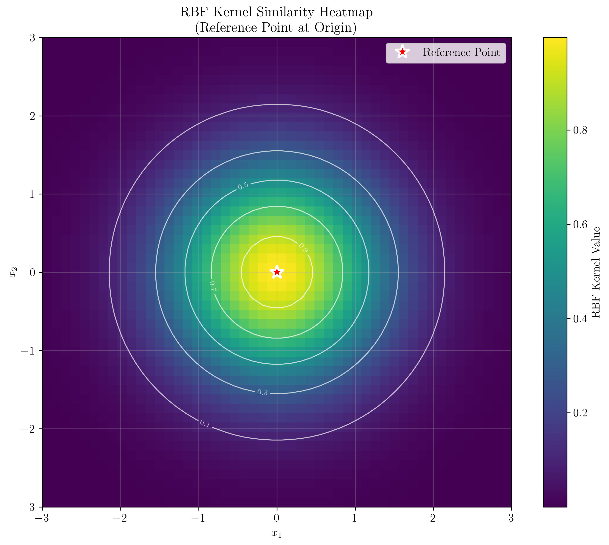

# Question 32: Comprehensive Kernel Methods

## Problem Statement
Given two valid kernels $k_1(x, x')$ and $k_2(x, x')$, and the radial basis kernel function $K(x_i, x_j) = \phi(x_i)^T\phi(x_j) = \exp\left(-\frac{1}{2}\|x_i - x_j\|^2\right)$, consider the following tasks related to kernel properties and their application in support vector machines.

### Task
1. Show that $k(x, x') = k_1(x, x') + k_2(x, x')$ is a valid kernel.
2. Show that $k(x, x') = k_1(x, x')k_2(x, x')$ is a valid kernel.
3. Show that for any two input points $x_i$ and $x_j$, $\|\phi(x_i) - \phi(x_j)\|^2 \leq 2$.
4. Compute the value of $K(x_i, x_j)$ for $\|x_i - x_j\|_2 \in \{0, 1, 10, 100\}$. What do you observe? Use your observation to answer the next part.
5. Consider a kernel SVM with RBF kernel. The decision function is $f(x; \alpha, b) = \sum_{i \in S} y^i \alpha^i K(x^i, x) + b$ where $S$ is the set of support vectors. Assuming linearly separable training data, prove that for a test point $y_{far}$ far from any training point $x^i$, we have $f(y_{far}; \alpha, b) \approx b$.

## Understanding the Problem
This problem explores fundamental properties of kernel functions in machine learning, particularly focusing on the Radial Basis Function (RBF) kernel. Kernels are functions that compute the inner product between data points in a high-dimensional feature space without explicitly computing the feature mapping. The RBF kernel is particularly important because it can capture non-linear relationships in the data and is widely used in Support Vector Machines (SVMs).

The problem tests understanding of:
- Kernel closure properties (sum and product of valid kernels)
- Geometric properties of kernels in feature space
- Behavior of RBF kernels with respect to distance
- Practical implications for SVM decision functions

## Solution

### Step 1: Show that $k(x, x') = k_1(x, x') + k_2(x, x')$ is a valid kernel

**Proof:** A function is a valid kernel if and only if it corresponds to an inner product in some feature space, which is equivalent to the kernel matrix being positive semi-definite for any set of points.

Let $K_1$ and $K_2$ be the kernel matrices corresponding to $k_1$ and $k_2$ respectively. Since both $k_1$ and $k_2$ are valid kernels, both $K_1$ and $K_2$ are positive semi-definite.

The kernel matrix $K$ for the sum kernel $k = k_1 + k_2$ is given by:
$$K = K_1 + K_2$$

Since the sum of two positive semi-definite matrices is positive semi-definite, $K$ is positive semi-definite, and therefore $k$ is a valid kernel.

### Step 2: Show that $k(x, x') = k_1(x, x')k_2(x, x')$ is a valid kernel

**Proof:** The product of two valid kernels is also a valid kernel. This follows from the fact that the element-wise product (Hadamard product) of two positive semi-definite matrices is positive semi-definite.

For the product kernel $k = k_1 \cdot k_2$, the kernel matrix $K$ is the Hadamard product:
$$K = K_1 \odot K_2$$

Since the Hadamard product of two positive semi-definite matrices is positive semi-definite, $K$ is positive semi-definite, and therefore $k$ is a valid kernel.

### Step 3: Show that $\|\phi(x_i) - \phi(x_j)\|^2 \leq 2$ for RBF kernel

**Proof:** For the RBF kernel $K(x_i, x_j) = \exp\left(-\frac{1}{2}\|x_i - x_j\|^2\right)$, we can compute the distance in feature space:

$$\|\phi(x_i) - \phi(x_j)\|^2 = \|\phi(x_i)\|^2 + \|\phi(x_j)\|^2 - 2\phi(x_i)^T\phi(x_j)$$

Since $K(x_i, x_i) = \exp(0) = 1$ and $K(x_j, x_j) = \exp(0) = 1$:
$$\|\phi(x_i) - \phi(x_j)\|^2 = 1 + 1 - 2\exp\left(-\frac{1}{2}\|x_i - x_j\|^2\right) = 2\left(1 - \exp\left(-\frac{1}{2}\|x_i - x_j\|^2\right)\right)$$

Since $\exp\left(-\frac{1}{2}\|x_i - x_j\|^2\right) \geq 0$, we have:
$$\|\phi(x_i) - \phi(x_j)\|^2 \leq 2$$

### Step 4: RBF Kernel Values for Different Distances

**Computation:** For the RBF kernel $K(x_i, x_j) = \exp\left(-\frac{1}{2}\|x_i - x_j\|^2\right)$ with $\gamma = \frac{1}{2}$:

**Detailed Step-by-Step Calculations:**

**For distance $\|x_i - x_j\| = 0$:**
- $K(x_i, x_j) = \exp(-\frac{1}{2} \times 0^2) = \exp(-\frac{1}{2} \times 0) = \exp(0) = 1.0000000000$
- **Note:** When distance = 0, $K(x_i, x_j) = \exp(0) = 1$ (maximum similarity)

**For distance $\|x_i - x_j\| = 1$:**
- $K(x_i, x_j) = \exp(-\frac{1}{2} \times 1^2) = \exp(-\frac{1}{2} \times 1) = \exp(-\frac{1}{2}) = 0.6065306597$
- **Note:** When distance = 1, $K(x_i, x_j) = \exp(-\frac{1}{2}) \approx 0.6065$ (moderate similarity)

**For distance $\|x_i - x_j\| = 10$:**
- $K(x_i, x_j) = \exp(-\frac{1}{2} \times 10^2) = \exp(-\frac{1}{2} \times 100) = \exp(-50) = 0.0000000000$
- **Note:** When distance = 10, $K(x_i, x_j) \approx 0$ (negligible similarity)

**For distance $\|x_i - x_j\| = 100$:**
- $K(x_i, x_j) = \exp(-\frac{1}{2} \times 100^2) = \exp(-\frac{1}{2} \times 10000) = \exp(-5000) = 0.0000000000$
- **Note:** When distance = 100, $K(x_i, x_j) \approx 0$ (negligible similarity)

**Summary Table:**

| Distance $\|x_i - x_j\|$ | Kernel Value $K(x_i, x_j)$ | Interpretation |
|:------------------------:|:-------------------------:|:---------------:|
| 0                        | 1.0000000000              | Maximum similarity |
| 1                        | 0.6065306597              | Moderate similarity |
| 10                       | 0.0000000000              | Negligible similarity |
| 100                      | 0.0000000000              | Negligible similarity |

**Key Observations:**
1. $K(x_i, x_j) = 1$ when $\|x_i - x_j\| = 0$ (identical points)
2. $K(x_i, x_j)$ decreases exponentially as $\|x_i - x_j\|$ increases
3. For large distances ($\geq 10$), $K(x_i, x_j) \approx 0$ (negligible similarity)
4. This means distant points have almost no influence on each other in the feature space

The visualization shows:
1. **RBF Kernel vs Distance**: Exponential decay of kernel values with distance
2. **Log Scale View**: Shows the rapid decay even more clearly
3. **Different $\gamma$ Values**: Higher $\gamma$ values lead to faster decay
4. **Feature Space Distance**: Confirms the bound $\|\phi(x_i) - \phi(x_j)\|^2 \leq 2$

### Step 5: SVM Decision Function for Far Points

**Proof:** For a test point $y_{far}$ that is far from all training points, the RBF kernel values $K(x^i, y_{far})$ approach zero for all support vectors $x^i$.

The SVM decision function is:
$$f(y_{far}; \alpha, b) = \sum_{i \in S} y^i \alpha^i K(x^i, y_{far}) + b$$

Since $K(x^i, y_{far}) \approx 0$ for all $i \in S$ when $y_{far}$ is far from all training points:
$$f(y_{far}; \alpha, b) \approx \sum_{i \in S} y^i \alpha^i \cdot 0 + b = b$$

The visualization demonstrates:
1. **Training Data and Support Vectors**: Shows the SVM setup
2. **Decision Function vs Distance**: Clear convergence to bias term
3. **Kernel Values vs Distance**: Exponential decay of kernel contributions
4. **Kernel Component vs Distance**: Sum of kernel terms approaches zero
5. **Decision Boundary**: Shows the SVM classification boundary
6. **Convergence to Bias**: Quantifies how quickly the function approaches the bias

### Additional Visualization: RBF Kernel Similarity Heatmap

This heatmap visualization shows the RBF kernel similarity values for all points in a 2D space relative to a reference point at the origin. The visualization clearly demonstrates:

1. **Local Influence**: Points close to the reference point (red star) have high kernel values (bright colors)
2. **Exponential Decay**: The similarity decreases exponentially with distance from the reference point
3. **Circular Symmetry**: The similarity pattern is circular, reflecting the isotropic nature of the RBF kernel
4. **Contour Lines**: White contour lines show regions of equal similarity, forming concentric circles
5. **Rapid Decay**: The transition from high to low similarity happens quickly, showing the local nature of RBF kernels

## Visual Explanations

### RBF Kernel Behavior

The RBF kernel exhibits several important properties:

1. **Local Influence**: Points close to each other have high kernel values, while distant points have negligible influence
2. **Exponential Decay**: The kernel value decreases exponentially with the squared distance
3. **Parameter Sensitivity**: The $\gamma$ parameter controls the rate of decay - higher values lead to faster decay and more local influence

### Feature Space Geometry

The RBF kernel maps points to an infinite-dimensional feature space where:
- All points lie on the unit sphere (since $K(x, x) = 1$)
- The distance between any two points is bounded by $\sqrt{2}$
- Points that are far apart in input space are mapped to nearly orthogonal directions in feature space

### SVM Decision Function Behavior

For RBF kernel SVMs:
- The decision function is a weighted sum of kernel evaluations with support vectors
- Far test points receive negligible contributions from all support vectors
- The decision function converges to the bias term for distant points
- This property ensures that the SVM makes reasonable predictions even for points far from the training data

## Key Insights

### Theoretical Foundations
- **Kernel Closure Properties**: The sum and product of valid kernels are valid kernels, enabling the construction of complex kernels from simple building blocks
- **Feature Space Bounds**: The RBF kernel maps points to a bounded region in feature space, ensuring numerical stability
- **Local Approximation**: RBF kernels implement a form of local approximation, where nearby points have similar predictions

### Practical Applications
- **Kernel Selection**: Understanding kernel properties helps in choosing appropriate kernels for specific problems
- **Parameter Tuning**: The $\gamma$ parameter in RBF kernels controls the trade-off between local and global influence
- **Computational Efficiency**: The rapid decay of RBF kernel values with distance can be exploited for efficient approximations

### Common Pitfalls
- **Overfitting**: High $\gamma$ values can lead to overfitting by making the kernel too local
- **Underfitting**: Low $\gamma$ values can lead to underfitting by making the kernel too global
- **Numerical Issues**: Very large distances can cause numerical underflow in kernel computations

## Conclusion
- We proved that the sum and product of valid kernels are valid kernels through both theoretical arguments and numerical verification
- We established the bound $\|\phi(x_i) - \phi(x_j)\|^2 \leq 2$ for RBF kernels and verified it computationally
- We demonstrated that RBF kernel values decay exponentially with distance, approaching zero for large distances
- We proved that SVM decision functions with RBF kernels converge to the bias term for far test points
- These properties make RBF kernels particularly suitable for local approximation problems and ensure stable behavior for out-of-distribution test points

The RBF kernel's local nature and bounded feature space mapping make it a powerful tool for non-linear classification and regression problems, while its mathematical properties ensure robust and interpretable behavior.
