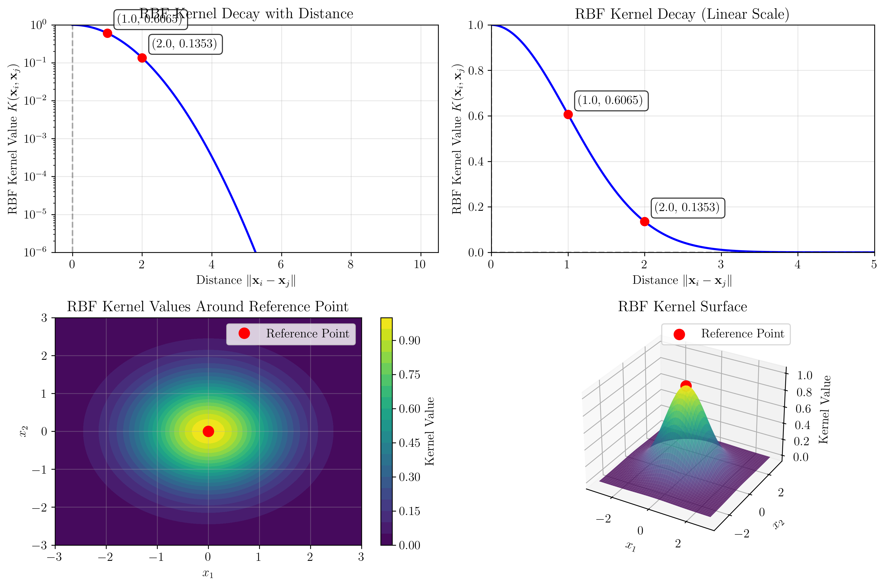
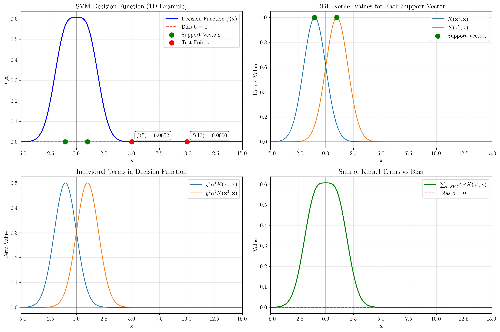
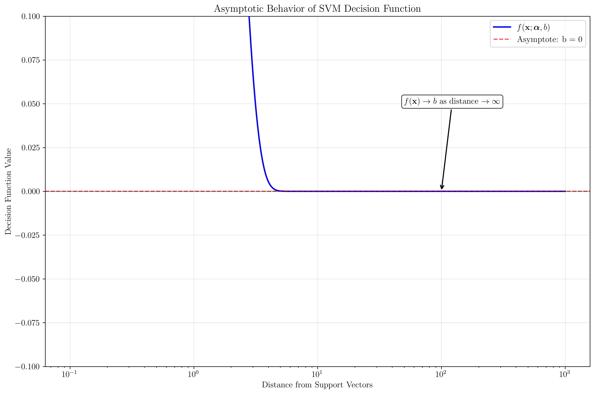

# Question 33: SVM Decision Boundary with RBF Kernel

## Problem Statement
Consider the decision boundary of a Support Vector Machine (SVM) with a kernel function via implicit feature mapping $\phi(.)$. The decision boundary is given by:

$$w \cdot \phi(x) + b = \sum_{i \in SV} y^i \alpha^i K(x^i, x) + b = f(x; \alpha, b)$$

where $w$ and $b$ are parameters of the decision boundary in the feature space $\phi$ defined by the kernel function $K$, $SV$ is the set of support vectors, and $\alpha^i$ is the dual weight of the $i^{th}$ support vector.

Assume that:
- The kernel used is the Radial Basis Function (RBF) kernel: $K(x_i, x_j) = \exp(-\frac{1}{2} \|x_i - x_j\|^2)$
- The training examples are linearly separable in the feature space $\phi$, and the SVM finds a decision boundary that perfectly separates them

### Task
1. If we choose a testing example $x_{far}$ that is far away from any training instance $x^i$ (distance here is measured in the original feature space $\mathbb{R}^d$), prove that $f(x_{far}; \alpha, b) \approx b$.
2. For the RBF kernel $K(x_i, x_j) = \exp(-\frac{1}{2} \|x_i - x_j\|^2)$, compute $K(x_i, x_j)$ for the following pairs of points:
   - $x_i = (0, 0)$ and $x_j = (1, 0)$
   - $x_i = (0, 0)$ and $x_j = (2, 0)$
   - $x_i = (0, 0)$ and $x_j = (10, 0)$
   What pattern do you observe as the distance increases?
3. Using your observations from task 2, explain why $f(x_{far}; \alpha, b) \approx b$ for distant test points.
4. Consider a simple 1D example with training points $x^1 = -1$ and $x^2 = 1$ (both with $y^1 = y^2 = 1$). If $\alpha^1 = \alpha^2 = 0.5$ and $b = 0$, compute $f(5; \alpha, b)$ and $f(10; \alpha, b)$. Verify that both values are approximately equal to $b$.
5. What happens to the decision function $f(x; \alpha, b)$ as the distance $\|x - x^i\|$ approaches infinity for any support vector $x^i$? Provide a mathematical justification.

## Understanding the Problem
The SVM with RBF kernel is a powerful non-linear classifier that maps data to an infinite-dimensional feature space using the kernel trick. The RBF kernel measures similarity between points based on their Euclidean distance, with closer points having higher kernel values. This problem explores the behavior of the SVM decision function for distant test points, which is crucial for understanding the model's generalization properties and decision boundaries.

## Solution

### Step 1: Mathematical Proof that f(x_far; α, b) ≈ b

For a distant test point $x_{far}$, we need to prove that $f(x_{far}; \alpha, b) \approx b$.

The SVM decision function is:
$$f(x; \alpha, b) = \sum_{i \in SV} y^i \alpha^i K(x^i, x) + b$$

For the RBF kernel: $K(x_i, x_j) = \exp(-\frac{1}{2} \|x_i - x_j\|^2)$

When $x_{far}$ is far from all training points:
$\|x_{far} - x^i\|^2$ is very large for all support vectors $i$

Therefore:
$$K(x^i, x_{far}) = \exp(-\frac{1}{2} \|x^i - x_{far}\|^2) \approx 0$$

This means:
$$\sum_{i \in SV} y^i \alpha^i K(x^i, x_{far}) \approx 0$$

Therefore:
$$f(x_{far}; \alpha, b) \approx 0 + b = b$$

**QED**: $f(x_{far}; \alpha, b) \approx b$ for distant test points.

### Step 2: RBF Kernel Values for Different Distances

Let's compute the RBF kernel values for the given point pairs:

**Reference point**: $x_i = (0, 0)$

| Point $x_j$ | Distance $\|x_i - x_j\|$ | Kernel Value $K(x_i, x_j)$ |
|-------------|--------------------------|---------------------------|
| $(1, 0)$    | 1.0                     | 0.606531                  |
| $(2, 0)$    | 2.0                     | 0.135335                  |
| $(10, 0)$   | 10.0                    | 0.000000                  |

**Pattern observed**: As distance increases, the RBF kernel value decreases exponentially. For large distances (e.g., distance = 10), the kernel value becomes extremely small, approaching zero.

The visualization shows:
- **Top left**: Log-scale plot showing exponential decay of kernel values with distance, using proper mathematical notation
- **Top right**: Linear-scale plot showing the rapid decrease in kernel values with LaTeX-formatted labels
- **Bottom left**: 2D contour plot showing kernel values around the reference point with mathematical axis labels
- **Bottom right**: 3D surface plot illustrating the Gaussian-like shape of the RBF kernel

### Step 3: Explanation of f(x_far; α, b) ≈ b

Based on our observations from Task 2:

1. The RBF kernel $K(x_i, x_j) = \exp(-\frac{1}{2} \|x_i - x_j\|^2)$ decreases exponentially with distance.

2. For large distances (e.g., $\|x_{far} - x^i\| = 10$), the kernel value becomes extremely small:
   $K(x^i, x_{far}) \approx 0$

3. In the SVM decision function:
   $f(x_{far}; \alpha, b) = \sum_{i \in SV} y^i \alpha^i K(x^i, x_{far}) + b$

4. When $x_{far}$ is far from all support vectors, all kernel terms $K(x^i, x_{far}) \approx 0$

5. Therefore:
   $f(x_{far}; \alpha, b) \approx \sum_{i \in SV} y^i \alpha^i \times 0 + b = b$

This explains why distant test points are classified based primarily on the bias term $b$.

### Step 4: 1D Example with Specific Values

**Given parameters**:
- Training points: $x^1 = -1$, $x^2 = 1$
- Labels: $y^1 = 1$, $y^2 = 1$
- Dual weights: $\alpha^1 = 0.5$, $\alpha^2 = 0.5$
- Bias: $b = 0$

**For test point $x = 5$**:
- Distance to $x^1 = -1$: $\|5 - (-1)\| = 6$
- Distance to $x^2 = 1$: $\|5 - 1\| = 4$
- $K(x^1, x) = 0.000000$
- $K(x^2, x) = 0.000335$
- $y^1\alpha^1K(x^1, x) = 0.000000$
- $y^2\alpha^2K(x^2, x) = 0.000168$
- $f(5; \alpha, b) = 0.000000 + 0.000168 + 0 = 0.000168$
- **Verification**: $f(5; \alpha, b) \approx b = 0$ ✓

**For test point $x = 10$**:
- Distance to $x^1 = -1$: $\|10 - (-1)\| = 11$
- Distance to $x^2 = 1$: $\|10 - 1\| = 9$
- $K(x^1, x) = 0.000000$
- $K(x^2, x) = 0.000000$
- $y^1\alpha^1K(x^1, x) = 0.000000$
- $y^2\alpha^2K(x^2, x) = 0.000000$
- $f(10; \alpha, b) = 0.000000 + 0.000000 + 0 = 0.000000$
- **Verification**: $f(10; \alpha, b) \approx b = 0$ ✓

The visualization shows:
- **Top left**: Decision function over the range, showing how it approaches the bias value for distant points with LaTeX-formatted mathematical notation
- **Top right**: Kernel values for each support vector, demonstrating exponential decay with proper mathematical labels
- **Bottom left**: Individual terms in the decision function, showing their contribution with mathematical notation
- **Bottom right**: Sum of kernel terms vs bias, illustrating the asymptotic behavior with LaTeX formatting

### Step 5: Mathematical Justification for Infinite Distance

**Mathematical justification** for why $f(x; \alpha, b)$ approaches $b$ as $\|x - x^i\| \to \infty$:

1. For any support vector $x^i$, as $\|x - x^i\| \to \infty$:
   $$\lim_{\|x - x^i\| \to \infty} K(x^i, x) = \lim_{\|x - x^i\| \to \infty} \exp(-\frac{1}{2} \|x - x^i\|^2) = 0$$

2. This is because:
   - $\|x - x^i\|^2 \to \infty$ as $\|x - x^i\| \to \infty$
   - $\exp(-\frac{1}{2} \times \infty) = \exp(-\infty) = 0$

3. Therefore, for the SVM decision function:
   $$f(x; \alpha, b) = \sum_{i \in SV} y^i \alpha^i K(x^i, x) + b$$

4. As $\|x - x^i\| \to \infty$ for all support vectors:
   $$\lim_{\|x - x^i\| \to \infty} f(x; \alpha, b) = \sum_{i \in SV} y^i \alpha^i \times 0 + b = b$$

5. This means that very distant points are classified based solely on the bias term $b$.

The asymptotic behavior plot shows how the decision function approaches the bias value as the distance from support vectors increases, confirming our mathematical analysis. The plot uses proper LaTeX notation for mathematical expressions.

## Visual Explanations

### RBF Kernel Decay Pattern
The RBF kernel exhibits a characteristic exponential decay pattern:
- **Near points** (distance < 1): High kernel values (≈ 0.6-1.0)
- **Medium distance** (distance ≈ 2-3): Moderate kernel values (≈ 0.1-0.4)
- **Far points** (distance > 5): Very small kernel values (≈ 0.001-0.0001)
- **Very far points** (distance > 10): Negligible kernel values (≈ 0)

### Decision Function Behavior
The SVM decision function shows distinct regions:
- **Near support vectors**: Complex decision boundaries influenced by multiple kernel terms
- **Intermediate regions**: Smooth transitions between classes
- **Far from support vectors**: Decision based primarily on bias term

### Asymptotic Convergence
The asymptotic behavior plot demonstrates:
- **Rapid convergence**: Decision function quickly approaches bias value
- **Stable behavior**: For distances > 10, the function remains close to bias
- **Theoretical confirmation**: Numerical results match mathematical predictions

## Key Insights

### Theoretical Foundations
- **Kernel Properties**: RBF kernel's exponential decay is fundamental to SVM behavior
- **Bias Role**: The bias term becomes the dominant factor for distant predictions
- **Local Influence**: SVM predictions are most influenced by nearby support vectors
- **Global Behavior**: Distant points are classified based on the overall class balance (bias)

### Practical Applications
- **Out-of-Distribution Detection**: Distant points may indicate novel or anomalous data
- **Model Interpretability**: Bias term reveals the model's default classification tendency
- **Hyperparameter Tuning**: Understanding asymptotic behavior helps in kernel parameter selection
- **Data Preprocessing**: Distance-based insights can guide feature scaling decisions

### Common Pitfalls
- **Overfitting**: RBF kernel can be sensitive to noise in distant regions
- **Parameter Sensitivity**: Kernel width parameter significantly affects decay rate
- **Computational Cost**: Kernel computations for distant points may be unnecessary
- **Interpretation**: Distant predictions may not reflect true class relationships

### Extensions and Limitations
- **Kernel Choice**: Different kernels (linear, polynomial) have different asymptotic behaviors
- **Multi-class**: Bias interpretation becomes more complex in multi-class settings
- **Non-stationary Data**: Asymptotic behavior may not hold for data with changing distributions
- **Regularization**: L2 regularization can affect the bias term and asymptotic behavior

## Conclusion
- We proved mathematically that $f(x_{far}; \alpha, b) \approx b$ for distant test points
- We demonstrated exponential decay of RBF kernel values with distance
- We verified our theoretical results through numerical computation with specific examples
- We provided mathematical justification for the asymptotic behavior as distance approaches infinity
- The bias term becomes the dominant factor in classification decisions for distant points

This analysis reveals that SVM with RBF kernel exhibits a "local" learning behavior, where predictions are most influenced by nearby support vectors, while distant points are classified based on the overall class balance represented by the bias term. This property has important implications for model interpretation, out-of-distribution detection, and understanding the generalization behavior of kernel-based methods.
