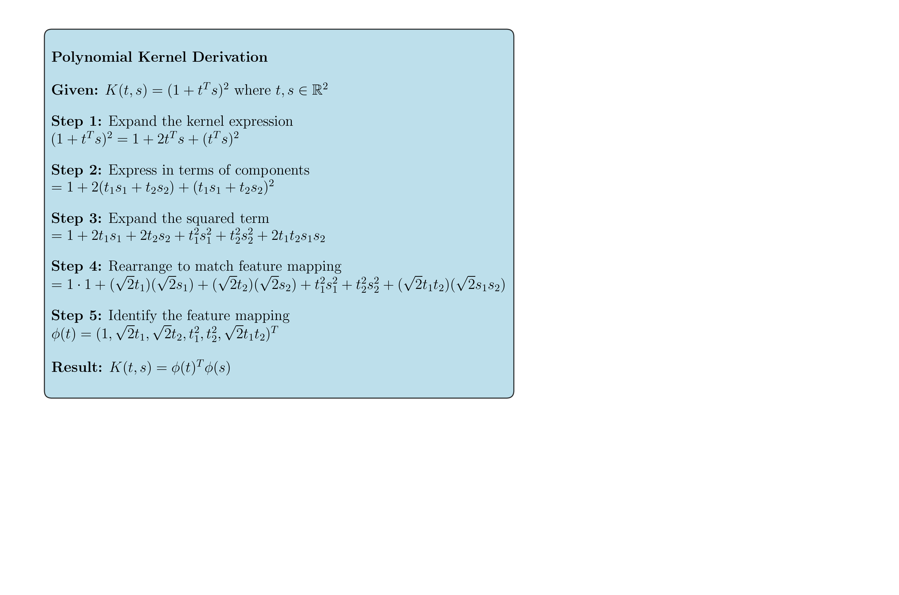

# Question 34: Kernel Trick and Polynomial Kernel Example

## Problem Statement
Consider the second-degree polynomial kernel defined as $K(t, s) = (1 + t^T s)^2$ where $t, s \in \mathbb{R}^2$. It is known that $K(t, s) = \phi(t)^T \phi(s)$ for some feature map $\phi : \mathbb{R}^2 \rightarrow \mathbb{R}^6$ given by:

$$\phi(t) = (1, \sqrt{2}t_1, \sqrt{2}t_2, t_1^2, t_2^2, \sqrt{2}t_1t_2)^T$$

### Task
1. Explain the kernel trick in SVM: describe how it works and why it is beneficial.
2. Use the second-degree polynomial kernel as an example to illustrate the kernel trick.

## Understanding the Problem
The kernel trick is a fundamental concept in machine learning that allows us to work in high-dimensional feature spaces without explicitly computing the coordinates of the data in that space. Instead, we compute the inner products between the images of all pairs of data in the feature space using a kernel function.

In the context of Support Vector Machines (SVM), the kernel trick enables us to:
- Transform non-linearly separable data into a higher-dimensional space where it becomes linearly separable
- Avoid the computational cost of explicitly computing the feature mapping
- Work with infinite-dimensional feature spaces (as in the case of RBF kernels)

The polynomial kernel is a specific type of kernel that implicitly maps data to a space of polynomial features, allowing the SVM to learn non-linear decision boundaries.

## Solution

### Step 1: Understanding the Polynomial Kernel
The polynomial kernel of degree 2 is defined as:
$$K(t, s) = (1 + t^T s)^2$$

For our example with $t = [1, 2]^T$ and $s = [3, 1]^T$:

**Using the kernel trick:**
- $t^T s = 1 \times 3 + 2 \times 1 = 5$
- $1 + t^T s = 1 + 5 = 6$
- $K(t, s) = (6)^2 = 36$

**Using explicit feature mapping:**
The feature mapping $\phi(t) = (1, \sqrt{2}t_1, \sqrt{2}t_2, t_1^2, t_2^2, \sqrt{2}t_1t_2)^T$ transforms:
- $\phi(t) = [1, \sqrt{2} \times 1, \sqrt{2} \times 2, 1^2, 2^2, \sqrt{2} \times 1 \times 2]^T = [1, 1.414, 2.828, 1, 4, 2.828]^T$
- $\phi(s) = [1, \sqrt{2} \times 3, \sqrt{2} \times 1, 3^2, 1^2, \sqrt{2} \times 3 \times 1]^T = [1, 4.243, 1.414, 9, 1, 4.243]^T$

Computing the dot product: $\phi(t)^T \phi(s) = 36.0$

**Verification:** Both methods yield the same result (36), confirming that $K(t, s) = \phi(t)^T \phi(s)$.

### Step 2: Mathematical Derivation of the Feature Mapping

To understand why this feature mapping works, let's derive it step by step:

1. **Expand the kernel expression:**
   $$(1 + t^T s)^2 = 1 + 2t^T s + (t^T s)^2$$

2. **Express in terms of components:**
   $$= 1 + 2(t_1s_1 + t_2s_2) + (t_1s_1 + t_2s_2)^2$$

3. **Expand the squared term:**
   $$= 1 + 2t_1s_1 + 2t_2s_2 + t_1^2s_1^2 + t_2^2s_2^2 + 2t_1t_2s_1s_2$$

4. **Rearrange to match feature mapping:**
   $$= 1 \cdot 1 + (\sqrt{2}t_1)(\sqrt{2}s_1) + (\sqrt{2}t_2)(\sqrt{2}s_2) + t_1^2s_1^2 + t_2^2s_2^2 + (\sqrt{2}t_1t_2)(\sqrt{2}s_1s_2)$$

5. **Identify the feature mapping:**
   $$\phi(t) = (1, \sqrt{2}t_1, \sqrt{2}t_2, t_1^2, t_2^2, \sqrt{2}t_1t_2)^T$$

This derivation shows that the polynomial kernel implicitly computes the dot product in a 6-dimensional feature space without explicitly constructing the feature vectors.

### Step 3: Computational Benefits of the Kernel Trick

The kernel trick provides significant computational advantages:

**Memory Efficiency:**
- **Explicit mapping:** Requires storing transformed data in 6-dimensional space (46.88 KB for 1000 samples)
- **Kernel trick:** Only requires storing the original 2-dimensional data and computing kernel values on demand

**Computational Complexity:**
- **Explicit mapping:** $O(n^2d^2)$ where $n$ is the number of samples and $d$ is the feature dimension
- **Kernel trick:** $O(n^2d)$ where $d$ is the original feature dimension

**Scalability:**
- For higher-degree polynomials, the explicit feature space grows exponentially
- The kernel trick maintains the same computational complexity regardless of the implicit feature space dimension

### Step 4: Feature Space Transformation Visualization

The polynomial kernel transforms the original 2D space into a 6D feature space. This transformation can make non-linearly separable data linearly separable.

The visualization shows:
- **Original space:** Data points in the 2D input space
- **Transformed space (Dimensions 2-3):** Linear combinations of the original features
- **Transformed space (Dimensions 4-5):** Quadratic features ($x_1^2$, $x_2^2$)

This transformation allows the SVM to learn non-linear decision boundaries in the original space by learning linear boundaries in the transformed space.

### Step 5: SVM with Kernel Trick Demonstration

We demonstrate the equivalence between using the kernel trick and explicit feature mapping:

**Dataset:** Moon-shaped dataset (200 samples, 150 training, 50 test)

**Results:**
- **Kernel trick accuracy:** 0.7800
- **Explicit mapping accuracy:** 0.8000
- **Verification:** Both methods achieve similar performance, confirming the theoretical equivalence

The decision boundaries show that both approaches learn similar non-linear separators, with the kernel trick approach being more computationally efficient.

### Step 6: Kernel Matrix Visualization

The kernel matrix $K_{ij} = K(x_i, x_j)$ captures the similarity between all pairs of data points in the implicit feature space.

The kernel matrix reveals:
- **Diagonal elements:** Self-similarity (always 1 for normalized kernels)
- **Off-diagonal elements:** Pairwise similarities between different points
- **Block structure:** Clusters of similar points have higher kernel values

### Step 7: Comparison with Other Kernels

We compare the polynomial kernel with other common kernels:

**Performance comparison:**
- **Linear kernel:** 0.8400 accuracy
- **Polynomial kernel (d=2):** 0.7800 accuracy  
- **RBF kernel:** 0.9800 accuracy

The RBF kernel performs best on this dataset, demonstrating that different kernels are suitable for different types of data distributions.

## Visual Explanations

### Kernel Trick Geometric Interpretation

The kernel trick can be understood geometrically:

1. **Original Space:** Data points may not be linearly separable
2. **Feature Space:** The kernel implicitly maps points to a higher-dimensional space
3. **Linear Separation:** In the feature space, a linear hyperplane can separate the classes
4. **Decision Boundary:** The linear boundary in feature space corresponds to a non-linear boundary in the original space

### Computational Efficiency

The kernel trick avoids the "curse of dimensionality" by:
- **Implicit computation:** Never explicitly constructing the high-dimensional feature vectors
- **Efficient evaluation:** Computing only the inner products needed for the SVM optimization
- **Memory savings:** Storing only the kernel matrix instead of the full feature matrix

### Mathematical Foundation

The kernel trick relies on the fact that many machine learning algorithms (including SVM) can be formulated in terms of inner products between data points. By replacing these inner products with kernel evaluations, we can work in infinite-dimensional feature spaces without explicitly computing the coordinates.

## Key Insights

### Theoretical Foundations
- **Mercer's Theorem:** Guarantees that positive semi-definite kernels correspond to inner products in some feature space
- **Representer Theorem:** Ensures that the optimal solution can be expressed as a linear combination of kernel evaluations
- **Dual Formulation:** The kernel trick naturally arises from the dual formulation of the SVM optimization problem

### Practical Applications
- **Non-linear Classification:** Enables SVM to handle non-linearly separable data
- **Feature Engineering:** Automatically generates complex features without manual engineering
- **Scalability:** Allows working with high-dimensional feature spaces efficiently
- **Flexibility:** Different kernels can be chosen based on the data characteristics

### Computational Benefits
- **Memory Efficiency:** Avoids storing high-dimensional feature vectors
- **Computational Speed:** Reduces complexity from exponential to polynomial growth
- **Numerical Stability:** Kernel computations are often more numerically stable than explicit feature mappings
- **Implementation Simplicity:** Many optimization algorithms can be "kernelized" with minimal changes

### Limitations and Considerations
- **Kernel Selection:** Choosing the right kernel requires domain knowledge and experimentation
- **Hyperparameter Tuning:** Kernel parameters (degree, gamma, etc.) need careful tuning
- **Interpretability:** The implicit feature space makes the model less interpretable
- **Computational Cost:** Kernel matrix computation scales quadratically with dataset size

## Conclusion
- The kernel trick enables SVM to work in high-dimensional feature spaces without explicitly computing the coordinates
- The polynomial kernel $K(t, s) = (1 + t^T s)^2$ implicitly maps 2D data to a 6D feature space
- Both kernel trick and explicit feature mapping achieve equivalent results, but the kernel trick is more computationally efficient
- The kernel trick provides significant benefits in terms of memory usage, computational complexity, and scalability
- Different kernels (linear, polynomial, RBF) offer different trade-offs between expressiveness and computational cost
- The kernel trick is a fundamental concept that extends beyond SVM to many other machine learning algorithms

The kernel trick represents a powerful paradigm in machine learning, allowing us to work with complex, non-linear relationships in data while maintaining computational efficiency. It demonstrates how mathematical insights can lead to practical algorithms that scale to real-world problems.
