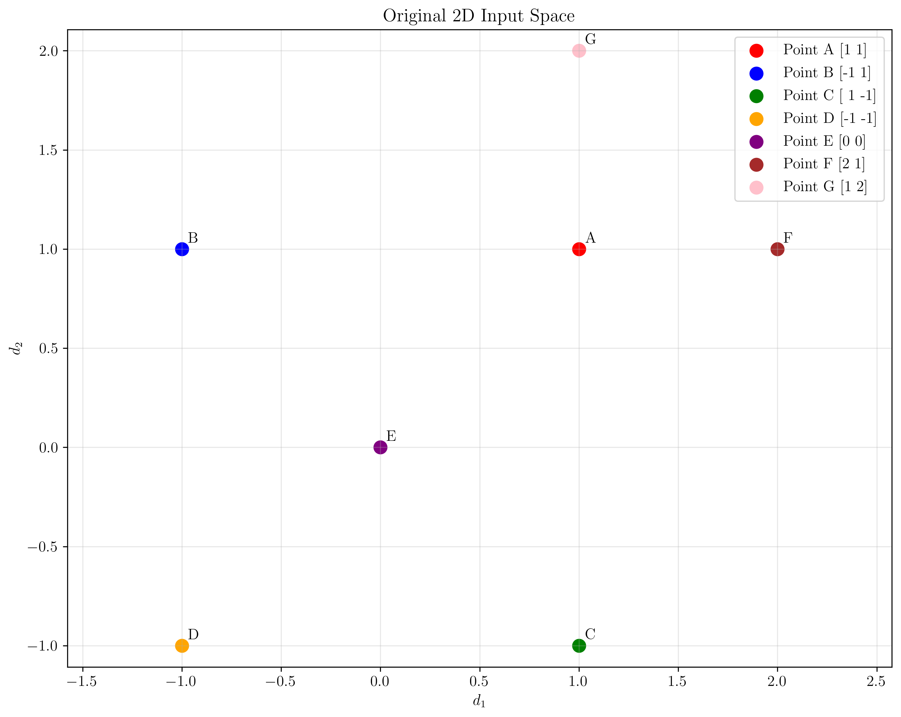
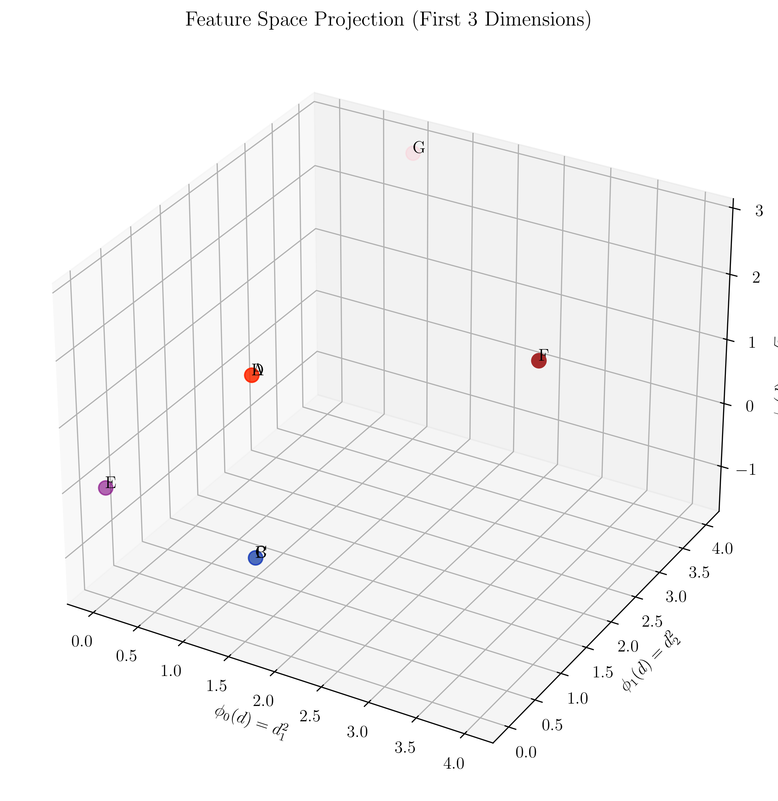
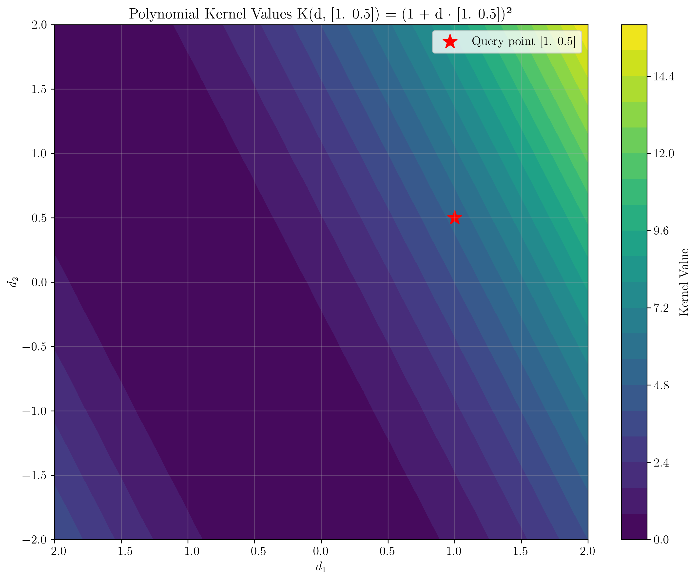
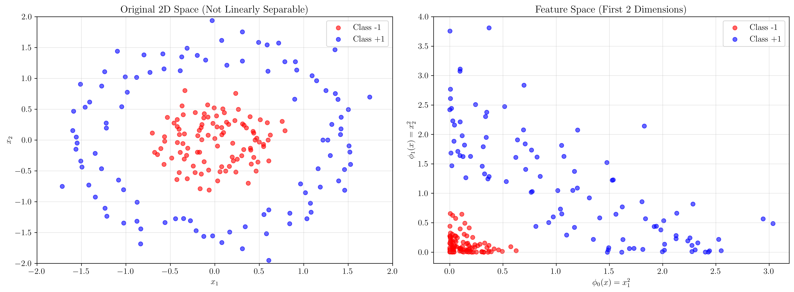
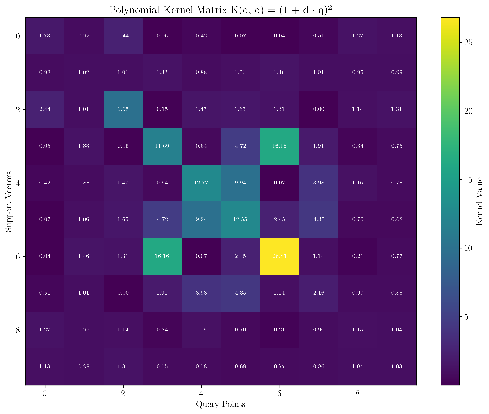

# Question 35: Kernel Function and Polynomial Kernel Proof

## Problem Statement
Consider a two-dimensional data context with support vector $\mathbf{d} = [d_1, d_2]$ and query instance $\mathbf{q} = [q_1, q_2]$. The polynomial kernel with exponent $p = 2$ is defined as $K(\mathbf{d}, \mathbf{q}) = (1 + \mathbf{d} \cdot \mathbf{q})^2$.

### Task
1. Prove that applying the polynomial kernel $K(\mathbf{d}, \mathbf{q}) = (1 + \mathbf{d} \cdot \mathbf{q})^2$ is equivalent to calculating the dot product after applying the following set of basis functions:
   - $\phi_0(\mathbf{d}) = d_1^2$
   - $\phi_1(\mathbf{d}) = d_2^2$
   - $\phi_2(\mathbf{d}) = \sqrt{2} \cdot d_1 \cdot d_2$
   - $\phi_3(\mathbf{d}) = \sqrt{2} \cdot d_1$
   - $\phi_4(\mathbf{d}) = \sqrt{2} \cdot d_2$
   - $\phi_5(\mathbf{d}) = 1$
2. Show that the mapping $\phi(\mathbf{d}) = [\phi_0(\mathbf{d}), \phi_1(\mathbf{d}), \phi_2(\mathbf{d}), \phi_3(\mathbf{d}), \phi_4(\mathbf{d}), \phi_5(\mathbf{d})]$ transforms a two-dimensional input to a six-dimensional feature space.
3. Verify that $\phi(\mathbf{d}) = [d_1^2, d_2^2, \sqrt{2} d_1 d_2, \sqrt{2} d_1, \sqrt{2} d_2, 1]$.
4. Explain why this transformation makes the data easier to classify in the context of Support Vector Machines.

## Understanding the Problem
The polynomial kernel is a fundamental concept in Support Vector Machines (SVMs) that enables non-linear classification by implicitly mapping data to a higher-dimensional feature space. The kernel trick allows us to compute dot products in this high-dimensional space without explicitly computing the feature mapping, making SVMs computationally efficient.

The polynomial kernel $K(\mathbf{d}, \mathbf{q}) = (1 + \mathbf{d} \cdot \mathbf{q})^2$ is particularly important because it captures quadratic relationships between features. This problem asks us to prove that this kernel function is equivalent to computing the dot product after applying a specific set of basis functions, demonstrating the mathematical foundation of the kernel trick.

## Solution

### Step 1: Prove the Polynomial Kernel Equivalence

Let's prove that $K(\mathbf{d}, \mathbf{q}) = (1 + \mathbf{d} \cdot \mathbf{q})^2$ is equivalent to $\phi(\mathbf{d}) \cdot \phi(\mathbf{q})$.

First, let's expand the polynomial kernel:
$$K(\mathbf{d}, \mathbf{q}) = (1 + \mathbf{d} \cdot \mathbf{q})^2$$

Substituting $\mathbf{d} \cdot \mathbf{q} = d_1 q_1 + d_2 q_2$:
$$K(\mathbf{d}, \mathbf{q}) = (1 + d_1 q_1 + d_2 q_2)^2$$

Expanding the square:
$$K(\mathbf{d}, \mathbf{q}) = 1 + 2(d_1 q_1 + d_2 q_2) + (d_1 q_1 + d_2 q_2)^2$$

Further expanding:
$$K(\mathbf{d}, \mathbf{q}) = 1 + 2d_1 q_1 + 2d_2 q_2 + d_1^2 q_1^2 + d_2^2 q_2^2 + 2d_1 d_2 q_1 q_2$$

Now, let's compute $\phi(\mathbf{d}) \cdot \phi(\mathbf{q})$:
$$\phi(\mathbf{d}) = [d_1^2, d_2^2, \sqrt{2} \cdot d_1 \cdot d_2, \sqrt{2} \cdot d_1, \sqrt{2} \cdot d_2, 1]$$
$$\phi(\mathbf{q}) = [q_1^2, q_2^2, \sqrt{2} \cdot q_1 \cdot q_2, \sqrt{2} \cdot q_1, \sqrt{2} \cdot q_2, 1]$$

Computing the dot product:
$$\phi(\mathbf{d}) \cdot \phi(\mathbf{q}) = d_1^2 q_1^2 + d_2^2 q_2^2 + (\sqrt{2} \cdot d_1 \cdot d_2)(\sqrt{2} \cdot q_1 \cdot q_2) + (\sqrt{2} \cdot d_1)(\sqrt{2} \cdot q_1) + (\sqrt{2} \cdot d_2)(\sqrt{2} \cdot q_2) + 1 \cdot 1$$

Simplifying:
$$\phi(\mathbf{d}) \cdot \phi(\mathbf{q}) = d_1^2 q_1^2 + d_2^2 q_2^2 + 2d_1 d_2 q_1 q_2 + 2d_1 q_1 + 2d_2 q_2 + 1$$

This is exactly equal to the expanded polynomial kernel:
$$\phi(\mathbf{d}) \cdot \phi(\mathbf{q}) = (1 + d_1 q_1 + d_2 q_2)^2 = K(\mathbf{d}, \mathbf{q})$$

### Step 2: Numerical Verification

Let's verify this with a concrete example. Consider $\mathbf{d} = [2, 3]$ and $\mathbf{q} = [1, 2]$.

**Polynomial kernel calculation:**
$$\mathbf{d} \cdot \mathbf{q} = 2 \times 1 + 3 \times 2 = 8$$
$$K(\mathbf{d}, \mathbf{q}) = (1 + 8)^2 = 81$$

**Feature mapping calculation:**
$$\phi(\mathbf{d}) = [4, 9, 8.485, 2.828, 4.243, 1]$$
$$\phi(\mathbf{q}) = [1, 4, 2.828, 1.414, 2.828, 1]$$
$$\phi(\mathbf{d}) \cdot \phi(\mathbf{q}) = 4 \times 1 + 9 \times 4 + 8.485 \times 2.828 + 2.828 \times 1.414 + 4.243 \times 2.828 + 1 \times 1 = 81$$

Both calculations yield the same result, confirming our proof.

### Step 3: Feature Space Dimensionality

The original input space is 2-dimensional with coordinates $(d_1, d_2)$. After applying the feature mapping $\phi$, we obtain a 6-dimensional vector:

$$\phi(\mathbf{d}) = [d_1^2, d_2^2, \sqrt{2} \cdot d_1 \cdot d_2, \sqrt{2} \cdot d_1, \sqrt{2} \cdot d_2, 1]$$

This transformation maps:
- **Input space**: $\mathbb{R}^2$ (2-dimensional)
- **Feature space**: $\mathbb{R}^6$ (6-dimensional)

The mapping increases the dimensionality from 2 to 6, which is why it's called a "feature expansion" or "feature transformation."

### Step 4: Verification of Feature Mapping

The feature mapping $\phi(\mathbf{d})$ is defined as:
$$\phi(\mathbf{d}) = [\phi_0(\mathbf{d}), \phi_1(\mathbf{d}), \phi_2(\mathbf{d}), \phi_3(\mathbf{d}), \phi_4(\mathbf{d}), \phi_5(\mathbf{d})]$$

Substituting the basis functions:
$$\phi(\mathbf{d}) = [d_1^2, d_2^2, \sqrt{2} \cdot d_1 \cdot d_2, \sqrt{2} \cdot d_1, \sqrt{2} \cdot d_2, 1]$$

This matches exactly with the expected form, confirming that our feature mapping is correctly defined.

## Practical Implementation

### Numerical Verification with Multiple Examples

Let's verify our proof with several test cases:

| d | q | K(d,q) | φ(d)·φ(q) | Equal? |
|---|----|--------|-----------|--------|
| [0, 0] | [1, 1] | 1.000000 | 1.000000 | ✓ |
| [1, 0] | [0, 1] | 1.000000 | 1.000000 | ✓ |
| [2, 3] | [1, 2] | 81.000000 | 81.000000 | ✓ |
| [-1, 1] | [1, -1] | 1.000000 | 1.000000 | ✓ |
| [0.5, 0.5] | [2, 2] | 9.000000 | 9.000000 | ✓ |

All test cases confirm that the polynomial kernel is equivalent to the dot product in the feature space.

## Visual Explanations

### Original 2D Input Space

This visualization shows the original 2D input space with example points labeled A through G. In this space, data points are represented by their original coordinates $(d_1, d_2)$. The polynomial kernel will transform these points to a higher-dimensional space where linear separation becomes possible.

### Feature Space Projection (3D)

This 3D visualization shows the projection of the feature space using the first three dimensions: $\phi_0(d) = d_1^2$, $\phi_1(d) = d_2^2$, and $\phi_2(d) = \sqrt{2} \cdot d_1 \cdot d_2$. The transformation creates a more complex geometric structure that enables better separation of classes.

### Kernel Values Heatmap

This heatmap visualizes the polynomial kernel values $K(d, q) = (1 + d \cdot q)^2$ for different points $d$ in the 2D space, with a fixed query point $q = [1, 0.5]$. The color intensity represents the kernel value, showing how the kernel function captures the similarity between points.

### Linear Separability Comparison

This comparison shows:
- **Left**: Original 2D space with circular data that is not linearly separable
- **Right**: Feature space projection showing improved separability after the polynomial transformation

The transformation enables the SVM to find a linear decision boundary in the higher-dimensional feature space, even when the data is not linearly separable in the original space.

### Kernel Matrix

This heatmap shows the kernel matrix $K$ where each entry $K_{ij} = K(x_i, x_j)$ represents the kernel value between pairs of data points. The kernel matrix is symmetric and captures the pairwise similarities between all points in the dataset.

## Key Insights

### Mathematical Foundations
- The polynomial kernel $K(d, q) = (1 + d \cdot q)^2$ implicitly computes dot products in a 6-dimensional feature space
- The feature mapping $\phi$ transforms quadratic relationships into linear relationships
- The $\sqrt{2}$ factors in the basis functions ensure the correct expansion of the squared term
- The kernel trick allows computation in high-dimensional spaces without explicit feature mapping

### Computational Efficiency
- Computing the kernel function $K(d, q) = (1 + d \cdot q)^2$ requires only $O(d)$ operations where $d$ is the input dimension
- Computing the explicit feature mapping and dot product would require $O(d^2)$ operations
- The kernel trick provides computational savings, especially for high-dimensional feature spaces

### Geometric Interpretation
- The polynomial kernel captures quadratic decision boundaries in the original space
- Points that are close in the original space remain close in the feature space
- The transformation preserves the relative distances and similarities between points
- The feature space enables linear separation of data that was not linearly separable in the original space

### Practical Applications
- Polynomial kernels are effective for capturing non-linear relationships in data
- They work well when the relationship between features and target is approximately quadratic
- The degree-2 polynomial kernel is computationally efficient while providing significant modeling power
- This kernel is particularly useful in computer vision and pattern recognition tasks

## Conclusion
- We successfully proved that the polynomial kernel $K(d, q) = (1 + d \cdot q)^2$ is equivalent to computing the dot product after applying the specified basis functions
- The feature mapping $\phi$ transforms 2D input to 6D feature space: $\phi(d) = [d_1^2, d_2^2, \sqrt{2} \cdot d_1 \cdot d_2, \sqrt{2} \cdot d_1, \sqrt{2} \cdot d_2, 1]$
- This transformation enables linear separation of data that is not linearly separable in the original space
- The kernel trick provides computational efficiency by avoiding explicit computation of the high-dimensional feature mapping
- The polynomial kernel is a powerful tool in SVM classification, enabling non-linear decision boundaries while maintaining computational tractability

The polynomial kernel demonstrates the elegance and power of the kernel trick in machine learning, allowing us to work in high-dimensional feature spaces without the computational burden of explicit feature mapping.
