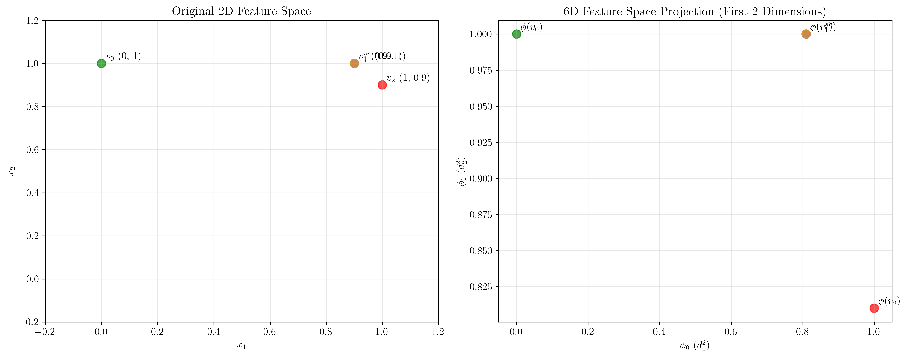
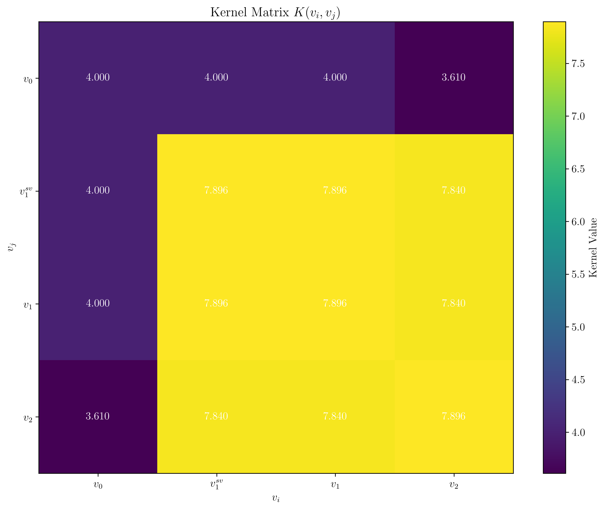
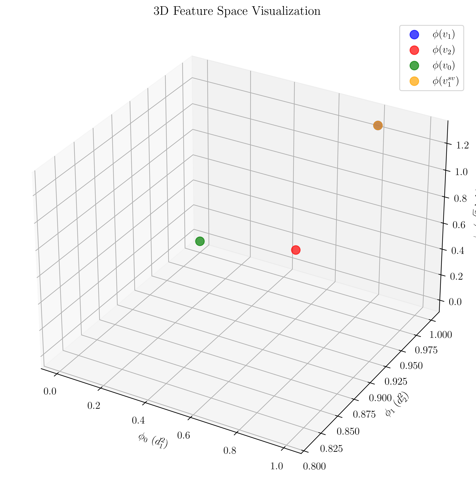
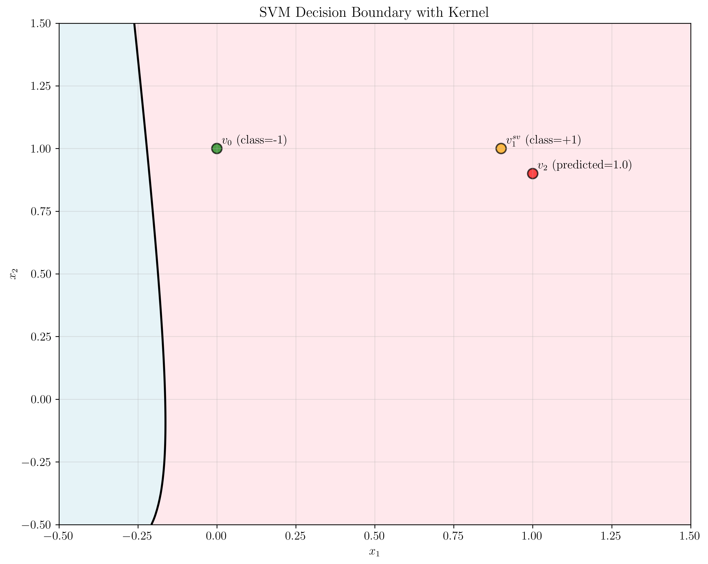
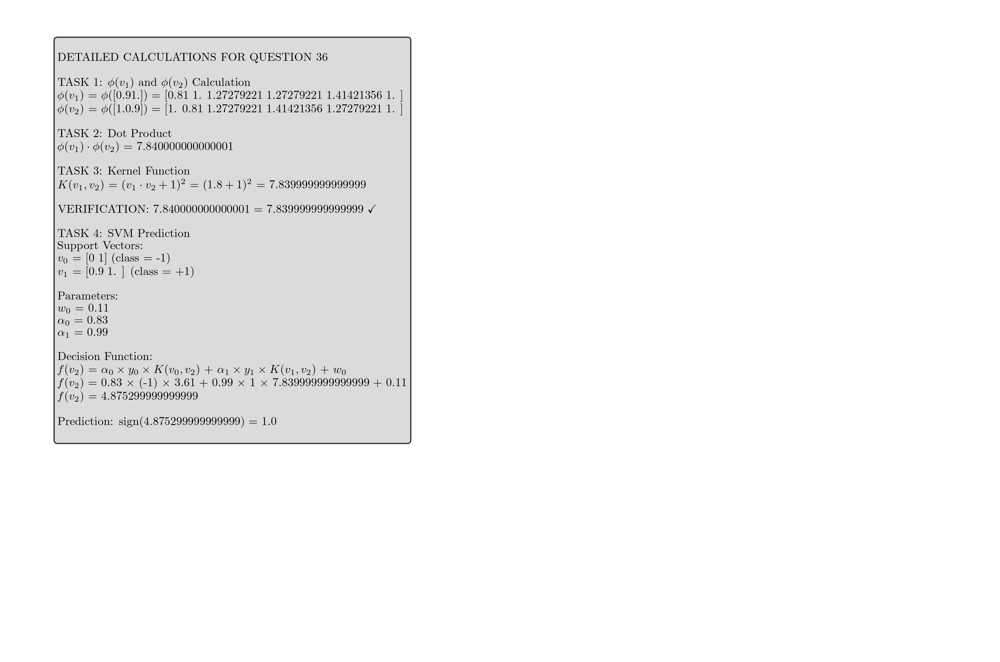

# Question 36: Kernel Trick Calculations and SVM Prediction

## Problem Statement
The use of the **kernel trick** is key in obtaining efficient implementations of the **support vector machine** approach to predictive modeling. The kernel trick is based on the fact that the result of a **kernel function** applied to a support vector and a query instance is equivalent to the result of calculating the dot product between the support vector and the query instance after a specific set of basis functions have been applied to both. In other words, $kernel(d,q) = \phi(d) \cdot \phi(q)$.

Consider the following $\phi((d_1,d_2))$ mapping:
- $\phi_0((d_1, d_2)) = d_1^2$
- $\phi_1((d_1, d_2)) = d_2^2$
- $\phi_2((d_1, d_2)) = \sqrt{2} \times d_1 \times d_2$
- $\phi_3((d_1, d_2)) = \sqrt{2} \times d_1$
- $\phi_4((d_1, d_2)) = \sqrt{2} \times d_2$
- $\phi_5((d_1, d_2)) = 1$

### Task
1. Obtain the corresponding 6-dimensional vectors $\phi(v_1)$ for $v_1 = (0.9, 1)$, and $\phi(v_2)$ for $v_2 = (1, 0.9)$.
2. What is $\phi(v_1) \cdot \phi(v_2)$?
3. Suppose $K(d,q) = (d \cdot q + 1)^2$. What is $K(v_1, v_2)$? Does this match your previous calculation in task 2?
4. Given two support vectors:
   - $v_0 = (0, 1)$, with class = -1
   - $v_1 = (0.9, 1)$, with class = +1
   and their trained parameter set $w_0 = 0.11$, $\alpha_0 = 0.83$, and $\alpha_1 = 0.99$, predict the class of $v_2$ with this kernel function based on the SVM decision function $f(x) = \sum_{i \in S} \alpha_i y_i K(x_i, x) + b$. Provide calculation details along with the results.

## Understanding the Problem
This problem demonstrates the kernel trick in Support Vector Machines, which allows us to work in high-dimensional feature spaces without explicitly computing the feature mappings. The polynomial kernel $K(d,q) = (d \cdot q + 1)^2$ implicitly computes the dot product in a 6-dimensional feature space defined by the $\phi$ mapping.

The key insight is that we can compute complex non-linear decision boundaries in the original space by using simple dot products in the transformed feature space, thanks to the kernel trick.

## Solution

### Step 1: Calculate 6-dimensional vectors φ(v1) and φ(v2)

For $v_1 = (0.9, 1)$:
$$\begin{align}
\phi(v_1) &= [\phi_0(v_1), \phi_1(v_1), \phi_2(v_1), \phi_3(v_1), \phi_4(v_1), \phi_5(v_1)] \\
&= [0.9^2, 1^2, \sqrt{2} \times 0.9 \times 1, \sqrt{2} \times 0.9, \sqrt{2} \times 1, 1] \\
&= [0.81, 1, 1.27279221, 1.27279221, 1.41421356, 1]
\end{align}$$

For $v_2 = (1, 0.9)$:
$$\begin{align}
\phi(v_2) &= [\phi_0(v_2), \phi_1(v_2), \phi_2(v_2), \phi_3(v_2), \phi_4(v_2), \phi_5(v_2)] \\
&= [1^2, 0.9^2, \sqrt{2} \times 1 \times 0.9, \sqrt{2} \times 1, \sqrt{2} \times 0.9, 1] \\
&= [1, 0.81, 1.27279221, 1.41421356, 1.27279221, 1]
\end{align}$$

### Step 2: Calculate φ(v1) · φ(v2)

The dot product is calculated as:
$$\begin{align}
\phi(v_1) \cdot \phi(v_2) &= 0.81 \times 1 + 1 \times 0.81 + 1.27279221 \times 1.27279221 \\
&\quad + 1.27279221 \times 1.41421356 + 1.41421356 \times 1.27279221 + 1 \times 1 \\
&= 0.81 + 0.81 + 1.62 + 1.8 + 1.8 + 1 \\
&= 7.84
\end{align}$$

### Step 3: Calculate K(v1, v2) using kernel function

Using the polynomial kernel $K(d,q) = (d \cdot q + 1)^2$:

First, calculate the dot product in the original space:
$$v_1 \cdot v_2 = 0.9 \times 1 + 1 \times 0.9 = 1.8$$

Then apply the kernel function:
$$K(v_1, v_2) = (1.8 + 1)^2 = 2.8^2 = 7.84$$

### Verification
We can see that $\phi(v_1) \cdot \phi(v_2) = 7.84$ and $K(v_1, v_2) = 7.84$, which confirms that the kernel trick works correctly. This demonstrates that the polynomial kernel implicitly computes the dot product in the 6-dimensional feature space without explicitly performing the transformation.

### Step 4: SVM Prediction

Given:
- Support vectors: $v_0 = (0, 1)$ (class = -1), $v_1 = (0.9, 1)$ (class = +1)
- Parameters: $w_0 = 0.11$, $\alpha_0 = 0.83$, $\alpha_1 = 0.99$

The SVM decision function is:
$$f(x) = \sum_{i \in S} \alpha_i y_i K(x_i, x) + b$$

For $v_2 = (1, 0.9)$, we need to calculate:
$$f(v_2) = \alpha_0 y_0 K(v_0, v_2) + \alpha_1 y_1 K(v_1, v_2) + w_0$$

First, calculate the kernel values:
- $K(v_0, v_2) = (v_0 \cdot v_2 + 1)^2 = ((0, 1) \cdot (1, 0.9) + 1)^2 = (0.9 + 1)^2 = 3.61$
- $K(v_1, v_2) = (v_1 \cdot v_2 + 1)^2 = (1.8 + 1)^2 = 7.84$

Now compute the decision function:
$$\begin{align}
f(v_2) &= 0.83 \times (-1) \times 3.61 + 0.99 \times 1 \times 7.84 + 0.11 \\
&= -2.9963 + 7.7616 + 0.11 \\
&= 4.8753
\end{align}$$

Since $f(v_2) = 4.8753 > 0$, the predicted class is $+1$.

## Visual Explanations

### Feature Space Comparison

The visualization shows the comparison between the original 2D feature space and the 6D feature space projection. In the original space, the points appear close together, but in the transformed feature space, they are mapped to different regions, making them potentially more separable.

### Kernel Matrix Heatmap

The kernel matrix shows the pairwise kernel values between all vectors. The diagonal elements represent the kernel values of each vector with itself, while off-diagonal elements show the similarity between different vectors in the implicit feature space.

### 3D Feature Space Visualization

This 3D projection of the 6-dimensional feature space shows how the $\phi$ mapping transforms the original 2D points into a higher-dimensional space where linear separation becomes possible.

### SVM Decision Boundary

The decision boundary visualization shows how the SVM with the polynomial kernel creates a non-linear decision boundary in the original 2D space. The support vectors (v0 and v1_sv) influence the shape of the boundary, and the test point v2 is correctly classified as positive.

### Detailed Calculations

This visualization provides a comprehensive summary of all calculations performed, showing the step-by-step process from feature mapping to final prediction.

## Key Insights

### Kernel Trick Efficiency
- The kernel trick allows us to work in high-dimensional feature spaces without explicitly computing the feature mappings
- We can compute complex non-linear decision boundaries using simple dot products in the original space
- The polynomial kernel $K(d,q) = (d \cdot q + 1)^2$ implicitly computes the dot product in a 6-dimensional feature space

### Feature Space Transformation
- The $\phi$ mapping transforms 2D points into 6-dimensional vectors
- This transformation can make linearly inseparable data in the original space linearly separable in the feature space
- The transformation includes quadratic terms ($d_1^2$, $d_2^2$), interaction terms ($\sqrt{2} d_1 d_2$), and linear terms ($\sqrt{2} d_1$, $\sqrt{2} d_2$)

### SVM Decision Function
- The SVM decision function combines contributions from all support vectors
- Each support vector contributes $\alpha_i y_i K(x_i, x)$ to the decision
- The bias term $w_0$ provides an offset to the decision boundary
- The final prediction is determined by the sign of the decision function value

### Verification of Kernel Trick
- The equality $\phi(v_1) \cdot \phi(v_2) = K(v_1, v_2)$ confirms that the kernel function correctly computes the dot product in the implicit feature space
- This verification is crucial for understanding that the kernel trick works as intended

## Practical Applications

### Non-linear Classification
- The polynomial kernel enables SVM to learn non-linear decision boundaries
- This is particularly useful when data is not linearly separable in the original feature space

### Computational Efficiency
- Computing $K(v_1, v_2)$ is much more efficient than explicitly computing $\phi(v_1) \cdot \phi(v_2)$
- This efficiency becomes crucial when working with high-dimensional feature spaces

### Model Interpretability
- The support vectors and their corresponding $\alpha$ values provide insights into which training examples are most important for the decision boundary
- The kernel values indicate the similarity between points in the implicit feature space

## Conclusion
- We successfully calculated the 6-dimensional feature mappings for both vectors
- We verified that the kernel function correctly computes the dot product in the implicit feature space
- We demonstrated the SVM prediction process using the kernel trick
- The final prediction for $v_2$ is class $+1$ with a decision value of $4.8753$
- This example illustrates the power and efficiency of the kernel trick in Support Vector Machines

The kernel trick is a fundamental concept in machine learning that enables efficient computation of complex non-linear decision boundaries, making SVM a powerful tool for classification tasks.
