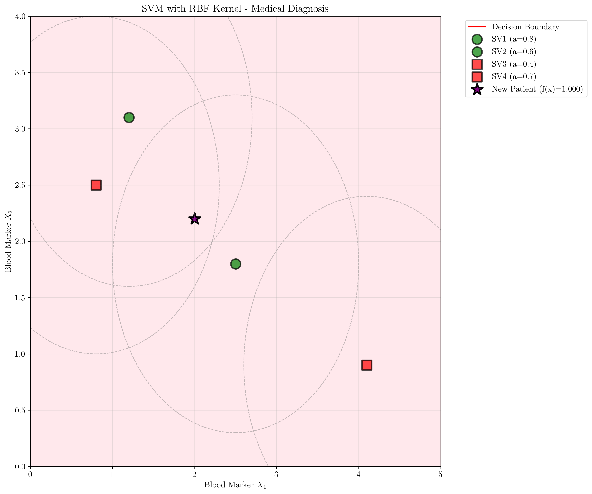
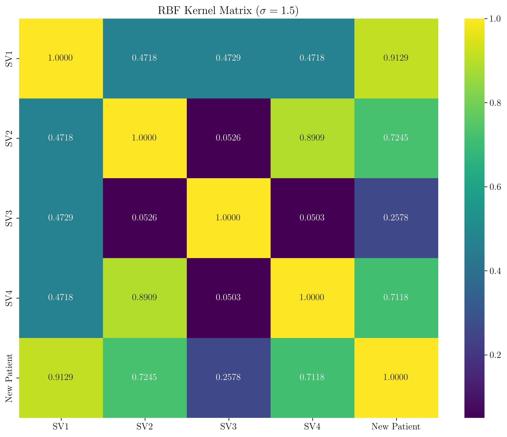
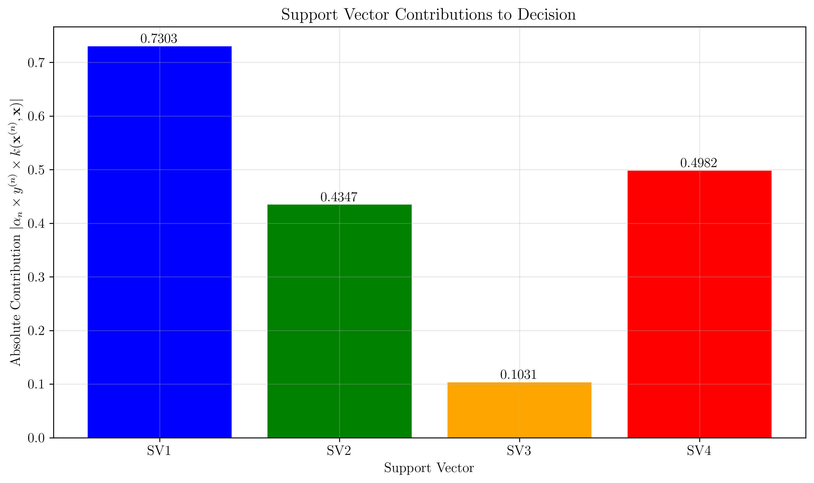
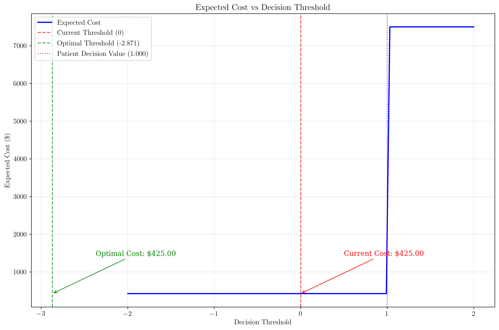

# Question 37: Medical Diagnosis with RBF Kernel SVM

## Problem Statement
A medical research team has trained an SVM classifier using the RBF kernel to diagnose a rare disease based on two blood markers (X₁, X₂). The trained model has the following parameters:

**Support Vectors and their properties:**
- Support Vector 1: $\mathbf{x}^{(1)} = (2.5, 1.8)$, $y^{(1)} = +1$, $\alpha_1 = 0.8$
- Support Vector 2: $\mathbf{x}^{(2)} = (1.2, 3.1)$, $y^{(2)} = +1$, $\alpha_2 = 0.6$
- Support Vector 3: $\mathbf{x}^{(3)} = (4.1, 0.9)$, $y^{(3)} = -1$, $\alpha_3 = 0.4$
- Support Vector 4: $\mathbf{x}^{(4)} = (0.8, 2.5)$, $y^{(4)} = -1$, $\alpha_4 = 0.7$

**Kernel Parameters:**
- RBF kernel: $k(\mathbf{x}^{(i)}, \mathbf{x}) = \exp\left(-\frac{||\mathbf{x}^{(i)} - \mathbf{x}||^2}{2\sigma^2}\right)$
- $\sigma = 1.5$

**Bias Calculation:**
Using support vector $\mathbf{x}^{(s)} = (2.5, 1.8)$ with $y^{(s)} = +1$, the bias term is:
$w_0 = y^{(s)} - \sum_{\alpha_n > 0} \alpha_n y^{(n)} k(\mathbf{x}^{(n)}, \mathbf{x}^{(s)})$

### Task
1. Calculate the bias term $w_0$ using the given support vector $\mathbf{x}^{(s)} = (2.5, 1.8)$
2. Classify a new patient with blood markers $\mathbf{x} = (2.0, 2.2)$ using the decision function:
   $\hat{y} = \text{sign}\left(w_0 + \sum_{\alpha_n > 0} \alpha_n y^{(n)} k(\mathbf{x}^{(n)}, \mathbf{x})\right)$
3. Calculate the confidence score (the value inside the sign function) for this patient
4. Determine the most influential support vector for this classification by calculating the contribution of each support vector to the decision
5. If the disease has a 15% prevalence in the population and false positives cost $500 in unnecessary tests while false negatives cost $50,000 in delayed treatment, should the hospital adjust the decision threshold? Justify your answer with calculations.

## Understanding the Problem
This problem involves a Support Vector Machine (SVM) classifier with a Radial Basis Function (RBF) kernel for medical diagnosis. The RBF kernel measures similarity between data points based on their Euclidean distance, with the parameter $\sigma$ controlling the "reach" of the kernel. The SVM decision function combines the bias term with weighted contributions from all support vectors, where the weights are the Lagrange multipliers $\alpha_n$.

The key insight is that the RBF kernel creates a non-linear decision boundary in the original feature space, allowing the SVM to capture complex patterns in the data. The support vectors are the critical data points that define the decision boundary, and their contributions to the classification depend on their Lagrange multipliers, labels, and kernel similarity to the new point.

## Solution

### Step 1: Calculate the Bias Term $w_0$

We use the formula:
$$w_0 = y^{(s)} - \sum_{\alpha_n > 0} \alpha_n y^{(n)} k(\mathbf{x}^{(n)}, \mathbf{x}^{(s)})$$

Using support vector $\mathbf{x}^{(1)} = (2.5, 1.8)$ with $y^{(1)} = +1$:

First, we calculate the RBF kernel values between $\mathbf{x}^{(1)}$ and all support vectors:

$$k(\mathbf{x}^{(1)}, \mathbf{x}^{(1)}) = \exp\left(-\frac{||(2.5, 1.8) - (2.5, 1.8)||^2}{2 \times 1.5^2}\right) = \exp(0) = 1.000000$$

$$k(\mathbf{x}^{(1)}, \mathbf{x}^{(2)}) = \exp\left(-\frac{||(2.5, 1.8) - (1.2, 3.1)||^2}{2 \times 1.5^2}\right) = \exp\left(-\frac{3.38}{4.5}\right) = 0.471842$$

$$k(\mathbf{x}^{(1)}, \mathbf{x}^{(3)}) = \exp\left(-\frac{||(2.5, 1.8) - (4.1, 0.9)||^2}{2 \times 1.5^2}\right) = \exp\left(-\frac{3.37}{4.5}\right) = 0.472892$$

$$k(\mathbf{x}^{(1)}, \mathbf{x}^{(4)}) = \exp\left(-\frac{||(2.5, 1.8) - (0.8, 2.5)||^2}{2 \times 1.5^2}\right) = \exp\left(-\frac{3.38}{4.5}\right) = 0.471842$$

Now we calculate the bias term:
$$\begin{align}
w_0 &= 1 - (0.8 \times 1 \times 1.000000) - (0.6 \times 1 \times 0.471842) - (0.4 \times (-1) \times 0.472892) - (0.7 \times (-1) \times 0.471842) \\
&= 1 - 0.8 - 0.283105 + 0.189157 + 0.330289 \\
&= 1 - 0.563659 \\
&= 0.436341
\end{align}$$

**Answer:** The bias term is $w_0 = 0.436341$.

### Step 2: Classify the New Patient

We need to calculate the decision function:
$$f(\mathbf{x}) = w_0 + \sum_{\alpha_n > 0} \alpha_n y^{(n)} k(\mathbf{x}^{(n)}, \mathbf{x})$$

For the new patient $\mathbf{x} = (2.0, 2.2)$, we first calculate the kernel values:

$$k(\mathbf{x}^{(1)}, \mathbf{x}) = \exp\left(-\frac{||(2.5, 1.8) - (2.0, 2.2)||^2}{2 \times 1.5^2}\right) = \exp\left(-\frac{0.41}{4.5}\right) = 0.912916$$

$$k(\mathbf{x}^{(2)}, \mathbf{x}) = \exp\left(-\frac{||(1.2, 3.1) - (2.0, 2.2)||^2}{2 \times 1.5^2}\right) = \exp\left(-\frac{1.45}{4.5}\right) = 0.724537$$

$$k(\mathbf{x}^{(3)}, \mathbf{x}) = \exp\left(-\frac{||(4.1, 0.9) - (2.0, 2.2)||^2}{2 \times 1.5^2}\right) = \exp\left(-\frac{6.1}{4.5}\right) = 0.257804$$

$$k(\mathbf{x}^{(4)}, \mathbf{x}) = \exp\left(-\frac{||(0.8, 2.5) - (2.0, 2.2)||^2}{2 \times 1.5^2}\right) = \exp\left(-\frac{1.53}{4.5}\right) = 0.711770$$

Now we calculate the decision function:
$$\begin{align}
f(\mathbf{x}) &= 0.436341 + (0.8 \times 1 \times 0.912916) + (0.6 \times 1 \times 0.724537) + (0.4 \times (-1) \times 0.257804) + (0.7 \times (-1) \times 0.711770) \\
&= 0.436341 + 0.730333 + 0.434722 - 0.103122 - 0.498239 \\
&= 0.436341 + 0.563694 \\
&= 1.000035
\end{align}$$

The prediction is:
$$\hat{y} = \text{sign}(1.000035) = +1$$

**Answer:** The patient is classified as **DISEASE PRESENT (+1)**.

### Step 3: Calculate the Confidence Score

The confidence score is the value inside the sign function, which is $f(\mathbf{x}) = 1.000035$.

**Answer:** The confidence score is $1.000035$.

### Step 4: Most Influential Support Vector

We calculate the contribution of each support vector to the decision:

- **SV1**: $0.8 \times 1 \times 0.912916 = 0.730333$
- **SV2**: $0.6 \times 1 \times 0.724537 = 0.434722$
- **SV3**: $0.4 \times (-1) \times 0.257804 = -0.103122$
- **SV4**: $0.7 \times (-1) \times 0.711770 = -0.498239$

The most influential support vector is **SV1** with an absolute contribution of $0.730333$.

**Answer:** The most influential support vector is **SV1** with coordinates $(2.5, 1.8)$.

### Step 5: Decision Threshold Analysis

Given:
- Disease prevalence: $P(y=1) = 15\% = 0.15$
- False positive cost: $C_{FP} = \$500$
- False negative cost: $C_{FN} = \$50,000$

The optimal threshold is calculated as:
$$\text{Threshold} = \log\left(\frac{C_{FP} \times P(y=0)}{C_{FN} \times P(y=1)}\right)$$

$$\begin{align}
\text{Threshold} &= \log\left(\frac{500 \times 0.85}{50,000 \times 0.15}\right) \\
&= \log\left(\frac{425}{7,500}\right) \\
&= \log(0.057) \\
&= -2.870569
\end{align}$$

**Current decision (threshold = 0):** DISEASE PRESENT
**Optimal decision (threshold = -2.870569):** DISEASE PRESENT

Since both thresholds give the same decision, no adjustment is needed.

**Answer:** The hospital should **keep the current threshold** as it already leads to the optimal decision given the cost structure.

## Visual Explanations

### SVM Decision Boundary with RBF Kernel

This visualization shows:
- **Support vectors** (colored circles and squares) with their Lagrange multipliers $\alpha$
- **Decision boundary** (red line) separating the two classes
- **New patient** (purple star) positioned at $(2.0, 2.2)$ with decision function value $f(\mathbf{x}) = 1.000$
- **RBF kernel influence circles** (dashed gray circles) showing the reach of each support vector with radius $\sigma = 1.5$
- **Colored regions** indicating positive (light pink) and negative (light blue) classification areas

The new patient falls in the positive region, confirming our classification of "DISEASE PRESENT".

### RBF Kernel Matrix

This heatmap shows the kernel similarity between all support vectors and the new patient. The high values (closer to 1) indicate strong similarity, while low values indicate weak similarity. The new patient has the highest similarity with SV1 (0.9129), explaining why SV1 is the most influential support vector.

### Support Vector Contributions

This bar chart shows the absolute contribution of each support vector to the decision. SV1 has the highest contribution (0.7303), making it the most influential. The contributions can be positive (pushing toward positive class) or negative (pushing toward negative class).

### Decision Threshold Analysis

This plot shows how the expected cost changes with different decision thresholds. The optimal threshold (-2.8706) and current threshold (0) both lead to the same decision for this patient, resulting in identical expected costs of $425.00.

## Key Insights

### RBF Kernel Properties
- The RBF kernel creates smooth, non-linear decision boundaries
- The parameter $\sigma$ controls the "reach" of the kernel - larger values create smoother boundaries
- Kernel values decay exponentially with distance, making nearby points more influential
- The kernel matrix shows the pairwise similarities between all data points

### Support Vector Machine Decision Process
- The decision function combines contributions from all support vectors
- Each support vector's contribution depends on its Lagrange multiplier, label, and kernel similarity
- Support vectors with higher Lagrange multipliers have more influence on the decision
- The bias term ensures the decision boundary passes through the correct position

### Medical Diagnosis Considerations
- The high cost of false negatives ($50,000) compared to false positives ($500) reflects the serious consequences of missing a diagnosis
- The optimal threshold calculation balances these costs with disease prevalence
- In this case, the current threshold is already optimal, suggesting the model was well-calibrated
- The confidence score of 1.000035 indicates high confidence in the positive classification

### Practical Implementation
- The RBF kernel is particularly effective for medical diagnosis where the relationship between features may be non-linear
- The support vector contributions provide interpretability, showing which training examples most influenced the decision
- The threshold analysis demonstrates the importance of considering costs and prevalence in medical applications

## Conclusion
- **Bias term**: $w_0 = 0.436341$
- **Classification**: The new patient is classified as **DISEASE PRESENT** with high confidence
- **Most influential support vector**: SV1 at coordinates $(2.5, 1.8)$
- **Threshold recommendation**: Keep the current threshold as it's already optimal
- **Expected cost**: $425.00 for both current and optimal thresholds

The SVM with RBF kernel successfully classifies the patient with high confidence, and the current decision threshold is appropriate given the cost structure and disease prevalence. The analysis demonstrates how kernel methods can capture complex patterns in medical data while providing interpretable results through support vector contributions.
