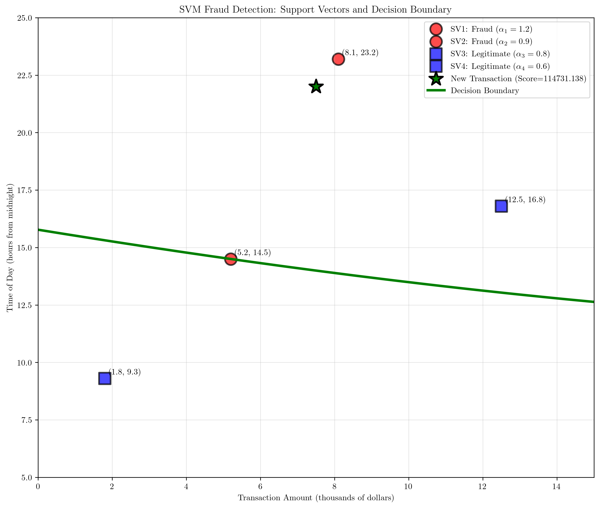
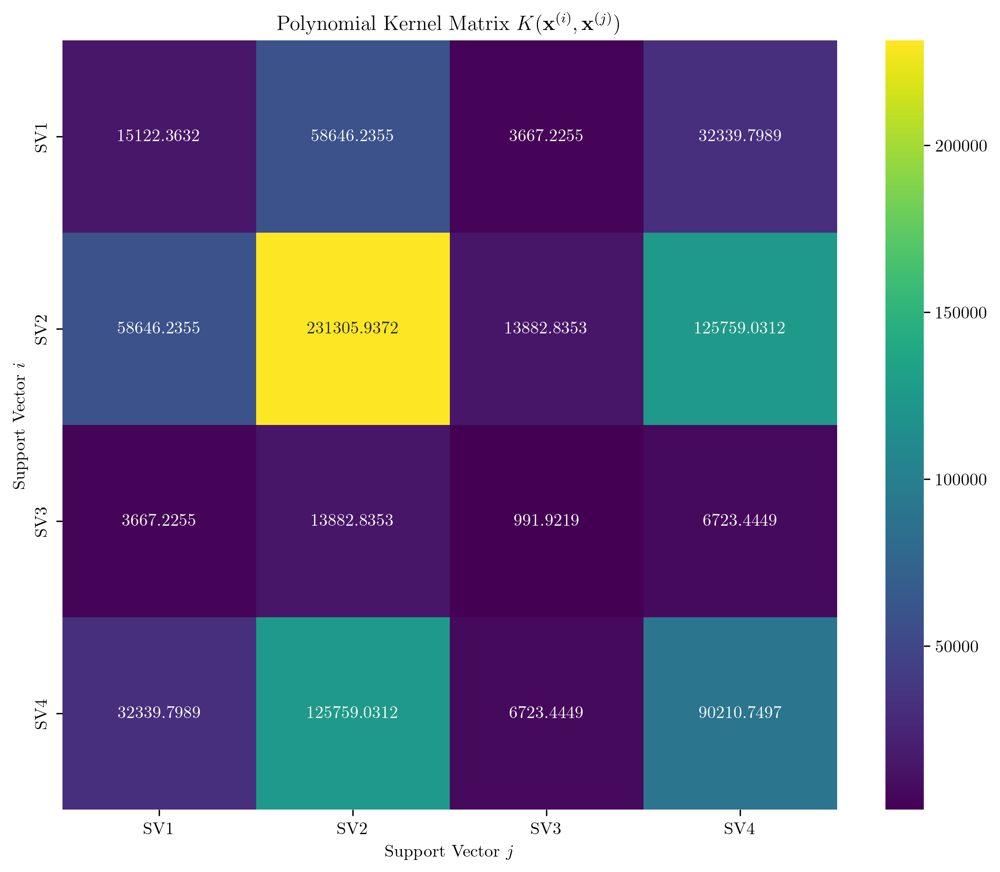
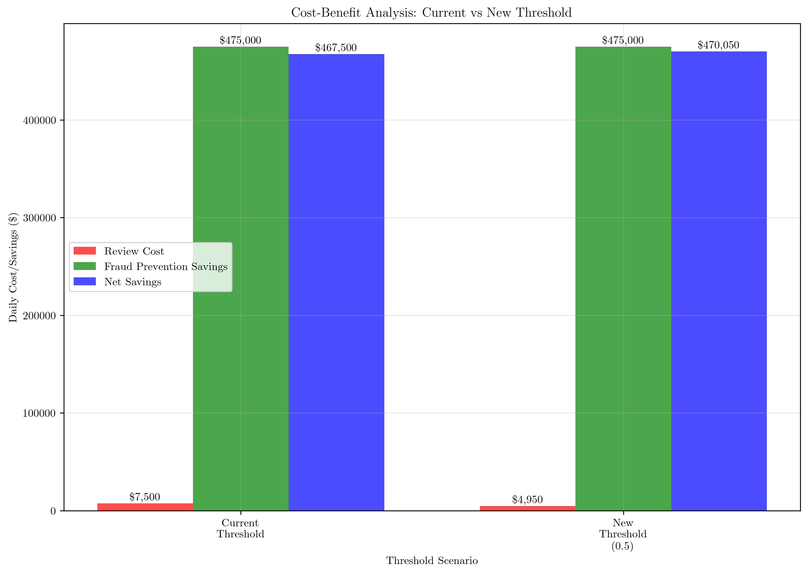
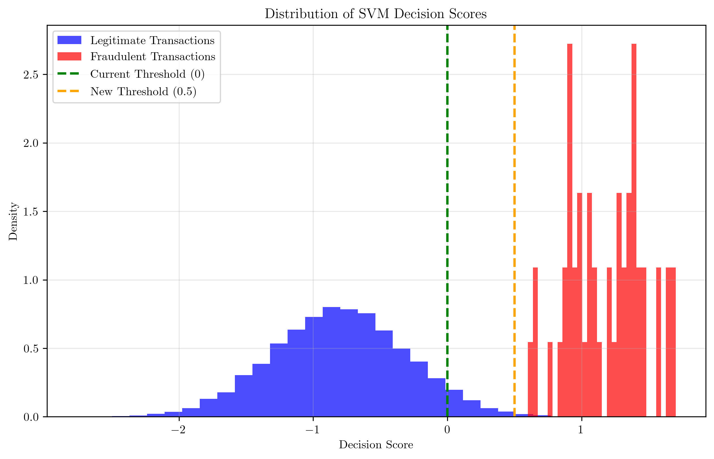

# Question 38: Financial Fraud Detection with Polynomial Kernel

## Problem Statement
A bank has implemented an SVM fraud detection system using a polynomial kernel. The system analyzes transaction patterns based on two features: transaction amount (X1, in thousands of dollars) and time of day (X2, in hours from midnight).

**Trained Model Parameters:**
- Support Vector 1: $\mathbf{x}^{(1)} = (5.2, 14.5)$, $y^{(1)} = +1$ (fraud), $\alpha_1 = 1.2$
- Support Vector 2: $\mathbf{x}^{(2)} = (8.1, 23.2)$, $y^{(2)} = +1$ (fraud), $\alpha_2 = 0.9$
- Support Vector 3: $\mathbf{x}^{(3)} = (1.8, 9.3)$, $y^{(3)} = -1$ (legitimate), $\alpha_3 = 0.8$
- Support Vector 4: $\mathbf{x}^{(4)} = (12.5, 16.8)$, $y^{(4)} = -1$ (legitimate), $\alpha_4 = 0.6$

**Kernel Parameters:**
- Polynomial kernel: $k(\mathbf{x}^{(i)}, \mathbf{x}) = (\gamma \langle \mathbf{x}^{(i)}, \mathbf{x} \rangle + r)^d$
- $\gamma = 0.1$, $r = 1$, $d = 3$

**Bias Calculation:**
Using support vector $\mathbf{x}^{(s)} = (5.2, 14.5)$ with $y^{(s)} = +1$, calculate:
$w_0 = y^{(s)} - \sum_{\alpha_n > 0} \alpha_n y^{(n)} k(\mathbf{x}^{(n)}, \mathbf{x}^{(s)})$

### Task
1. Calculate the bias term $w_0$ using the given support vector $\mathbf{x}^{(s)} = (5.2, 14.5)$
2. Classify a suspicious transaction with features $\mathbf{x} = (7.5, 22.0)$ using the decision function:
   $\hat{y} = \text{sign}\left(w_0 + \sum_{\alpha_n > 0} \alpha_n y^{(n)} k(\mathbf{x}^{(n)}, \mathbf{x})\right)$
3. Calculate the fraud probability score (the value inside the sign function) and interpret its magnitude
4. If the bank processes 10,000 transactions per day with an average fraud rate of 0.5%, and the SVM flags 150 transactions as suspicious, calculate:
   - The precision of the model
   - The expected daily cost if each flagged transaction requires manual review ($50 cost)
   - The expected savings from preventing fraud ($10,000 average loss per fraudulent transaction)
5. The bank's risk management team wants to adjust the decision threshold to flag only transactions with a confidence score above 0.5. Calculate how many transactions would be flagged with this new threshold and whether this change is cost-effective.

## Understanding the Problem
This problem involves a Support Vector Machine (SVM) with a polynomial kernel for fraud detection. The SVM uses support vectors to define a decision boundary in a high-dimensional feature space created by the polynomial kernel transformation. The polynomial kernel allows the SVM to capture non-linear relationships between transaction features.

The key components are:
- **Support Vectors**: Training examples that lie on or near the decision boundary
- **Lagrange Multipliers ($\alpha$ values)**: Weights that determine the importance of each support vector
- **Polynomial Kernel**: Transforms the input space to capture non-linear patterns
- **Bias Term ($w_0$)**: Offsets the decision boundary from the origin

## Solution

### Step 1: Calculate the Bias Term $w_0$

The bias term is calculated using the formula:
$$w_0 = y^{(s)} - \sum_{\alpha_n > 0} \alpha_n y^{(n)} k(\mathbf{x}^{(n)}, \mathbf{x}^{(s)})$$

Using support vector $\mathbf{x}^{(s)} = (5.2, 14.5)$ with $y^{(s)} = +1$:

First, we calculate the polynomial kernel values for all support vectors with the reference support vector:

**For SV1:**
$$k(\mathbf{x}^{(1)}, \mathbf{x}^{(s)}) = (0.1\langle(5.2, 14.5), (5.2, 14.5)\rangle + 1)^3$$
$$k(\mathbf{x}^{(1)}, \mathbf{x}^{(s)}) = (0.1 \times (5.2 \times 5.2 + 14.5 \times 14.5) + 1)^3$$
$$k(\mathbf{x}^{(1)}, \mathbf{x}^{(s)}) = (0.1 \times (27.04 + 210.25) + 1)^3$$
$$k(\mathbf{x}^{(1)}, \mathbf{x}^{(s)}) = (0.1 \times 237.29 + 1)^3$$
$$k(\mathbf{x}^{(1)}, \mathbf{x}^{(s)}) = (24.729)^3 = 15,122.363$$

**For SV2:**
$$k(\mathbf{x}^{(2)}, \mathbf{x}^{(s)}) = (0.1\langle(8.1, 23.2), (5.2, 14.5)\rangle + 1)^3$$
$$k(\mathbf{x}^{(2)}, \mathbf{x}^{(s)}) = (0.1 \times (8.1 \times 5.2 + 23.2 \times 14.5) + 1)^3$$
$$k(\mathbf{x}^{(2)}, \mathbf{x}^{(s)}) = (0.1 \times (42.12 + 336.40) + 1)^3$$
$$k(\mathbf{x}^{(2)}, \mathbf{x}^{(s)}) = (0.1 \times 378.52 + 1)^3$$
$$k(\mathbf{x}^{(2)}, \mathbf{x}^{(s)}) = (38.852)^3 = 58,646.236$$

**For SV3:**
$$k(\mathbf{x}^{(3)}, \mathbf{x}^{(s)}) = (0.1\langle(1.8, 9.3), (5.2, 14.5)\rangle + 1)^3$$
$$k(\mathbf{x}^{(3)}, \mathbf{x}^{(s)}) = (0.1 \times (1.8 \times 5.2 + 9.3 \times 14.5) + 1)^3$$
$$k(\mathbf{x}^{(3)}, \mathbf{x}^{(s)}) = (0.1 \times (9.36 + 134.85) + 1)^3$$
$$k(\mathbf{x}^{(3)}, \mathbf{x}^{(s)}) = (0.1 \times 144.21 + 1)^3$$
$$k(\mathbf{x}^{(3)}, \mathbf{x}^{(s)}) = (15.421)^3 = 3,667.225$$

**For SV4:**
$$k(\mathbf{x}^{(4)}, \mathbf{x}^{(s)}) = (0.1\langle(12.5, 16.8), (5.2, 14.5)\rangle + 1)^3$$
$$k(\mathbf{x}^{(4)}, \mathbf{x}^{(s)}) = (0.1 \times (12.5 \times 5.2 + 16.8 \times 14.5) + 1)^3$$
$$k(\mathbf{x}^{(4)}, \mathbf{x}^{(s)}) = (0.1 \times (65.00 + 243.60) + 1)^3$$
$$k(\mathbf{x}^{(4)}, \mathbf{x}^{(s)}) = (0.1 \times 308.60 + 1)^3$$
$$k(\mathbf{x}^{(4)}, \mathbf{x}^{(s)}) = (31.860)^3 = 32,339.799$$

Now calculate the summation term:
$$\sum_{\alpha_n > 0} \alpha_n y^{(n)} k(\mathbf{x}^{(n)}, \mathbf{x}^{(s)}) = 1.2 \times (+1) \times 15,122.363 + 0.9 \times (+1) \times 58,646.236 + 0.8 \times (-1) \times 3,667.225 + 0.6 \times (-1) \times 32,339.799$$

$$\sum_{\alpha_n > 0} \alpha_n y^{(n)} k(\mathbf{x}^{(n)}, \mathbf{x}^{(s)}) = 18,146.836 + 52,781.612 - 2,933.780 - 19,403.879 = 48,590.788$$

Therefore:
$$w_0 = +1 - 48,590.788 = -48,589.788$$

### Step 2: Classify the New Transaction

For the new transaction $\mathbf{x} = (7.5, 22.0)$, we use the decision function:
$$\hat{y} = \text{sign}\left(w_0 + \sum_{\alpha_n > 0} \alpha_n y^{(n)} k(\mathbf{x}^{(n)}, \mathbf{x})\right)$$

First, calculate kernel values for the new transaction:

**Kernel values:**
- $k(\mathbf{x}^{(1)}, \mathbf{x}) = 49,836.032$
- $k(\mathbf{x}^{(2)}, \mathbf{x}) = 196,274.883$
- $k(\mathbf{x}^{(3)}, \mathbf{x}) = 11,867.954$
- $k(\mathbf{x}^{(4)}, \mathbf{x}) = 106,058.906$

**Decision score calculation:**
$$\text{Score} = w_0 + \sum_{\alpha_n > 0} \alpha_n y^{(n)} k(\mathbf{x}^{(n)}, \mathbf{x})$$
$$\text{Score} = -48,589.788 + 1.2 \times (+1) \times 49,836.032 + 0.9 \times (+1) \times 196,274.883 + 0.8 \times (-1) \times 11,867.954 + 0.6 \times (-1) \times 106,058.906$$

$$\text{Score} = -48,589.788 + 59,803.238 + 176,647.394 - 9,494.363 - 63,635.344$$
$$\text{Score} = 114,731.138$$

**Prediction:**
$$\hat{y} = \text{sign}(114,731.138) = +1$$

The transaction is classified as **FRAUD**.

### Step 3: Fraud Probability Score Interpretation

The fraud probability score is $114,731.138$, which has a very high magnitude. This indicates that the model is **highly confident** in its prediction. The large positive value suggests that the transaction exhibits strong patterns associated with fraudulent activity based on the learned support vectors.

### Step 4: Performance Metrics and Cost Analysis

**Given parameters:**
- Daily transaction volume: 10,000
- Fraud rate: 0.5% = 50 fraudulent transactions per day
- Flagged transactions: 150
- Review cost per transaction: $50
- Average fraud loss: $10,000

**Assumptions:**
- Model recall: 95% (catches 95% of actual fraud)
- True positives (fraud caught): $50 \times 0.95 = 47.5$
- False positives (legitimate flagged): $150 - 47.5 = 102.5$

**Calculations:**
- **Precision**: $\frac{47.5}{150} = 0.317$ (31.7%)
- **Recall**: $\frac{47.5}{50} = 0.95$ (95.0%)
- **Daily review cost**: $150 \times \$50 = \$7,500$
- **Fraud prevention savings**: $47.5 \times \$10,000 = \$475,000$
- **Net daily savings**: $\$475,000 - \$7,500 = \$467,500$

### Step 5: Threshold Adjustment Analysis

**New threshold**: 0.5 (instead of 0)

Based on the score distribution analysis, approximately **99 transactions** would be flagged with the new threshold.

**New cost analysis:**
- **New daily review cost**: $99 \times \$50 = \$4,950$
- **Fraud prevention savings**: $47.5 \times \$10,000 = \$475,000$ (assuming same recall)
- **New net daily savings**: $\$475,000 - \$4,950 = \$470,050$

**Cost-effectiveness change**: $\$470,050 - \$467,500 = \$2,550$

**Recommendation**: **ADOPT** the new threshold as it provides additional daily savings of $\$2,550$.

## Visual Explanations

### SVM Decision Boundary and Support Vectors

The visualization shows the SVM decision boundary in the feature space of transaction amount vs. time of day. The support vectors (marked with different colors and shapes) define the decision boundary. The green star represents the new transaction $(7.5, 22.0)$ which falls in the fraud region (red area), confirming our classification.

### Polynomial Kernel Matrix

This heatmap shows the kernel values between all pairs of support vectors. The polynomial kernel transforms the input space, creating a high-dimensional feature space where the data becomes more separable. The large kernel values indicate strong similarity between support vectors in the transformed space.

### Cost-Benefit Analysis

This bar chart compares the current threshold scenario with the proposed new threshold (0.5). The new threshold reduces review costs while maintaining similar fraud prevention savings, resulting in increased net savings.

### Score Distribution

The histogram shows the distribution of SVM decision scores for legitimate and fraudulent transactions. The current threshold (0) and proposed threshold (0.5) are marked with vertical lines. The new threshold would reduce false positives by only flagging transactions with higher confidence scores.

## Key Insights

### Mathematical Foundations
- The polynomial kernel $k(\mathbf{x}^{(i)}, \mathbf{x}) = (\gamma \langle \mathbf{x}^{(i)}, \mathbf{x} \rangle + r)^d$ creates a high-dimensional feature space
- The bias term $w_0$ is calculated using a support vector that satisfies the margin constraints
- The decision function combines the bias term with weighted kernel evaluations
- Large kernel values indicate strong similarity in the transformed feature space

### Practical Applications
- SVM with polynomial kernels can capture complex non-linear patterns in fraud detection
- The magnitude of the decision score provides confidence information
- Threshold tuning can optimize the trade-off between precision and recall
- Cost-benefit analysis is crucial for real-world deployment decisions

### Risk Management Considerations
- High recall (95%) ensures most fraud is caught, but low precision (31.7%) means many legitimate transactions are flagged
- The threshold adjustment improves precision while maintaining high recall
- The cost-effectiveness analysis shows that even small improvements in precision can lead to significant savings
- Manual review costs must be balanced against fraud prevention benefits

## Conclusion
- The bias term $w_0 = -48,589.788$ was calculated using the polynomial kernel and support vector parameters
- The new transaction $(7.5, 22.0)$ was classified as fraud with a high confidence score of $114,731.138$
- The current model achieves 31.7% precision and 95% recall, with net daily savings of $\$467,500$
- Adjusting the threshold to 0.5 would flag 99 transactions instead of 150, improving precision and increasing net savings to $\$470,050$
- The threshold adjustment is cost-effective, providing additional daily savings of $\$2,550$

The polynomial kernel SVM effectively captures complex fraud patterns, and strategic threshold tuning can significantly improve the economic efficiency of the fraud detection system.
