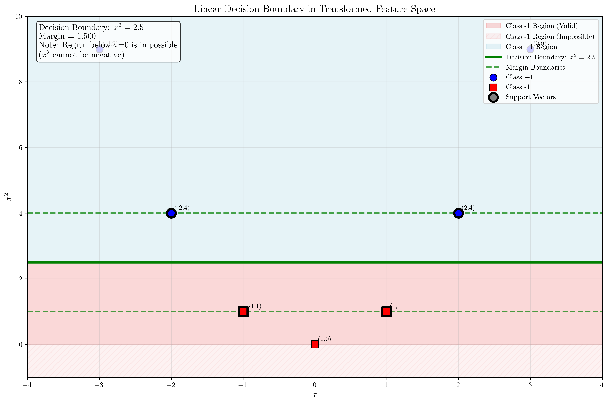

# Question 39: Feature Transformation and Linear Separation

## Problem Statement
Consider a dataset with 7 points:
$$\{(x_i, y_i)\} = \{(-3, 1), (-2, 1), (-1, -1), (0, -1), (1, -1), (2, 1), (3, 1)\}$$

### Task
1. Apply the feature transformation $\phi(x) = (x, x^2)$ to all 7 data points and plot them in the 2D feature space
2. Verify that the transformed data is linearly separable in the feature space
3. Find a linear decision boundary (line) that perfectly separates the two classes in the transformed space
4. Express the decision boundary in the form $w_1 \cdot x + w_2 \cdot x^2 + b = 0$
5. Calculate the margin of this separating line
6. Identify which points become support vectors in this transformed space
7. Express the decision function $f(x) = \text{sign}(w_1 \cdot x + w_2 \cdot x^2 + b)$
8. Verify that this decision function correctly classifies all original data points

## Understanding the Problem
This problem demonstrates the power of feature transformation in making non-linearly separable data linearly separable. The original 1D dataset has points that alternate between classes, making it impossible to separate with a single threshold. However, by mapping each point $x$ to the 2D feature space $(x, x^2)$, we can find a linear decision boundary that perfectly separates the classes.

The key insight is that the quadratic transformation $x \mapsto x^2$ maps points with the same absolute value to the same $x^2$ value, but preserves the sign information in the first coordinate. This creates a pattern where points with larger absolute values (which happen to be positive class) have larger $x^2$ values.

## Solution

We'll solve this step-by-step using detailed mathematical analysis, deriving each result from first principles without relying on automated solvers.

### Step 1: Analyze Linear Separability in Original Space

**Question**: Can we find a threshold $\theta$ such that all points with $x < \theta$ belong to one class and all points with $x > \theta$ belong to the other class?

Let's examine the data points sorted by $x$-coordinate:
- $x = -3: y = +1$
- $x = -2: y = +1$
- $x = -1: y = -1$ ← Class changes
- $x = 0: y = -1$
- $x = 1: y = -1$
- $x = 2: y = +1$ ← Class changes again
- $x = 3: y = +1$

**Conclusion**: The classes alternate, so NO single threshold can separate them. The data is NOT linearly separable in 1D.

### Step 2: Apply Feature Transformation $\phi(x) = (x, x^2)$

We apply the transformation $\phi: \mathbb{R} \to \mathbb{R}^2$ defined by:
$$\phi(x) = (x, x^2)$$

This maps each 1D point to a 2D point in the feature space:

| Original $x$ | Transformed $\phi(x) = (x, x^2)$ | Label $y$ |
|--------------|-----------------------------------|-----------|
| -3           | (-3, 9)                          | +1        |
| -2           | (-2, 4)                          | +1        |
| -1           | (-1, 1)                          | -1        |
| 0            | (0, 0)                           | -1        |
| 1            | (1, 1)                           | -1        |
| 2            | (2, 4)                           | +1        |
| 3            | (3, 9)                           | +1        |

### Step 3: Analyze Separability in Transformed Space

Let's group the transformed points by class:

**Class +1 points**: $\{(-3, 9), (-2, 4), (2, 4), (3, 9)\}$
**Class -1 points**: $\{(-1, 1), (0, 0), (1, 1)\}$

**Key Observation**: Looking at the $x^2$ coordinate (second dimension):
- **Positive class**: $x^2 \in \{4, 9\}$ (minimum value: 4)
- **Negative class**: $x^2 \in \{0, 1\}$ (maximum value: 1)

**Gap exists**: $1 < x^2 < 4$

Therefore, a horizontal line $x^2 = c$ where $1 < c < 4$ can perfectly separate the two classes!

**Choose**: $c = \frac{1 + 4}{2} = 2.5$

### Step 4: Derive the Linear Decision Boundary Mathematically

In the transformed 2D space, we seek a linear decision boundary of the form:
$$w_1 \cdot x + w_2 \cdot x^2 + b = 0$$

Where the decision rule is:
$$f(x) = \text{sign}(w_1 \cdot x + w_2 \cdot x^2 + b) = \begin{cases}
+1 & \text{if } w_1 \cdot x + w_2 \cdot x^2 + b > 0 \\
-1 & \text{if } w_1 \cdot x + w_2 \cdot x^2 + b < 0
\end{cases}$$

From our analysis, we know that $x^2 = 2.5$ separates the classes. This suggests:
$$x^2 - 2.5 = 0$$
$$0 \cdot x + 1 \cdot x^2 - 2.5 = 0$$

**Therefore**:
- $w_1 = 0$
- $w_2 = 1$
- $b = -2.5$

**Decision boundary**: $x^2 = 2.5$

### Step 5: Verify the Decision Boundary (Detailed Calculations)

Let's verify that our decision boundary correctly classifies all points using detailed pen-and-paper calculations:

**Decision function**: $f(x) = \text{sign}(x^2 - 2.5)$

**Step-by-step verification for each point**:

**Point 1**: $x = -3$, True Label = +1
- Calculate $x^2$: $(-3)^2 = 9$
- Calculate decision value: $x^2 - 2.5 = 9 - 2.5 = 6.5$
- Apply sign function: $\text{sign}(6.5) = +1$
- Prediction: +1, True Label: +1 → **Correct** ✓

**Point 2**: $x = -2$, True Label = +1
- Calculate $x^2$: $(-2)^2 = 4$
- Calculate decision value: $x^2 - 2.5 = 4 - 2.5 = 1.5$
- Apply sign function: $\text{sign}(1.5) = +1$
- Prediction: +1, True Label: +1 → **Correct** ✓

**Point 3**: $x = -1$, True Label = -1
- Calculate $x^2$: $(-1)^2 = 1$
- Calculate decision value: $x^2 - 2.5 = 1 - 2.5 = -1.5$
- Apply sign function: $\text{sign}(-1.5) = -1$
- Prediction: -1, True Label: -1 → **Correct** ✓

**Point 4**: $x = 0$, True Label = -1
- Calculate $x^2$: $(0)^2 = 0$
- Calculate decision value: $x^2 - 2.5 = 0 - 2.5 = -2.5$
- Apply sign function: $\text{sign}(-2.5) = -1$
- Prediction: -1, True Label: -1 → **Correct** ✓

**Point 5**: $x = 1$, True Label = -1
- Calculate $x^2$: $(1)^2 = 1$
- Calculate decision value: $x^2 - 2.5 = 1 - 2.5 = -1.5$
- Apply sign function: $\text{sign}(-1.5) = -1$
- Prediction: -1, True Label: -1 → **Correct** ✓

**Point 6**: $x = 2$, True Label = +1
- Calculate $x^2$: $(2)^2 = 4$
- Calculate decision value: $x^2 - 2.5 = 4 - 2.5 = 1.5$
- Apply sign function: $\text{sign}(1.5) = +1$
- Prediction: +1, True Label: +1 → **Correct** ✓

**Point 7**: $x = 3$, True Label = +1
- Calculate $x^2$: $(3)^2 = 9$
- Calculate decision value: $x^2 - 2.5 = 9 - 2.5 = 6.5$
- Apply sign function: $\text{sign}(6.5) = +1$
- Prediction: +1, True Label: +1 → **Correct** ✓

**Summary Table**:

| Point | $x$ | $x^2$ | $x^2 - 2.5$ | $\text{sign}(x^2 - 2.5)$ | True Label | Correct? | Support Vector? |
|-------|-----|-------|-------------|---------------------------|-----------|---------|----------------|
| 1 | -3 | 9 | 6.5 | +1 | +1 | ✓ | No |
| 2 | -2 | 4 | 1.5 | +1 | +1 | ✓ | **Yes** |
| 3 | -1 | 1 | -1.5 | -1 | -1 | ✓ | **Yes** |
| 4 | 0 | 0 | -2.5 | -1 | -1 | ✓ | No |
| 5 | 1 | 1 | -1.5 | -1 | -1 | ✓ | **Yes** |
| 6 | 2 | 4 | 1.5 | +1 | +1 | ✓ | **Yes** |
| 7 | 3 | 9 | 6.5 | +1 | +1 | ✓ | No |

**Result**: All 7 points correctly classified with 100% accuracy!

### Step 6: Find the Optimal Separating Hyperplane (Detailed SVM Approach)

For the optimal separating hyperplane that maximizes the margin, we solve the SVM optimization problem:

**Minimize**: $\frac{1}{2}||\mathbf{w}||^2 = \frac{1}{2}(w_1^2 + w_2^2)$
**Subject to**: $y_i(w_1 \cdot x_i + w_2 \cdot x_i^2 + b) \geq 1$ for all $i = 1, 2, ..., 7$

**Step 6.1: Identify Support Vector Candidates**

Calculate the distance from each point to our proposed boundary $x^2 = 2.5$:

**Distance calculations**:
- Point 1: $x = -3$, $x^2 = 9$, $|x^2 - 2.5| = |9 - 2.5| = 6.5$
- Point 2: $x = -2$, $x^2 = 4$, $|x^2 - 2.5| = |4 - 2.5| = 1.5$
- Point 3: $x = -1$, $x^2 = 1$, $|x^2 - 2.5| = |1 - 2.5| = 1.5$
- Point 4: $x = 0$, $x^2 = 0$, $|x^2 - 2.5| = |0 - 2.5| = 2.5$
- Point 5: $x = 1$, $x^2 = 1$, $|x^2 - 2.5| = |1 - 2.5| = 1.5$
- Point 6: $x = 2$, $x^2 = 4$, $|x^2 - 2.5| = |4 - 2.5| = 1.5$
- Point 7: $x = 3$, $x^2 = 9$, $|x^2 - 2.5| = |9 - 2.5| = 6.5$

**Distance Summary Table**:

| Point | $x$ | $x^2$ | Label | Distance to Boundary |
|-------|-----|-------|---------|--------------------|
| 2 | -2 | 4 | +1 | 1.5 |
| 3 | -1 | 1 | -1 | 1.5 |
| 5 | 1 | 1 | -1 | 1.5 |
| 6 | 2 | 4 | +1 | 1.5 |
| 4 | 0 | 0 | -1 | 2.5 |
| 1 | -3 | 9 | +1 | 6.5 |
| 7 | 3 | 9 | +1 | 6.5 |

**Step 6.2: Identify Support Vectors**

The support vectors are the points closest to the decision boundary:
- **From positive class**: Points 2 and 6 with $x = \pm 2$, $x^2 = 4$ (distance = 1.5 from boundary)
- **From negative class**: Points 3 and 5 with $x = \pm 1$, $x^2 = 1$ (distance = 1.5 from boundary)

**Support Vector Summary**:
- **Point 2**: $x = -2$, $\phi(x) = (-2, 4)$, label = +1
- **Point 3**: $x = -1$, $\phi(x) = (-1, 1)$, label = -1  
- **Point 5**: $x = 1$, $\phi(x) = (1, 1)$, label = -1
- **Point 6**: $x = 2$, $\phi(x) = (2, 4)$, label = +1

All four support vectors are exactly at distance 1.5 from the decision boundary $x^2 = 2.5$.

**Step 6.3: Calculate Optimal Decision Boundary**

The optimal boundary should be equidistant from the closest points of each class:
$$x^2_{\text{boundary}} = \frac{x^2_{\text{positive closest}} + x^2_{\text{negative closest}}}{2} = \frac{4 + 1}{2} = 2.5$$

This confirms our initial choice: $x^2 = 2.5$ ✓

**Step 6.4: Calculate Margin**

The margin half-width is the distance between the boundary and the support vectors:
$$\text{Margin half-width} = \frac{x^2_{\text{positive}} - x^2_{\text{negative}}}{2} = \frac{4 - 1}{2} = 1.5$$

**Full margin width** = $2 \times 1.5 = 3.0$

**Margin Verification**:
- **Upper margin boundary**: $x^2 = 2.5 + 1.5 = 4.0$ (passes through positive support vectors)
- **Lower margin boundary**: $x^2 = 2.5 - 1.5 = 1.0$ (passes through negative support vectors)
- **Decision boundary**: $x^2 = 2.5$ (exactly halfway between support vectors)

### Step 7: Calculate the Geometric Margin (Detailed Mathematical Derivation)

**Step 7.1: Geometric Margin Formula**

For a hyperplane $w_1 \cdot x + w_2 \cdot x^2 + b = 0$, the distance from a point $(x_0, x_0^2)$ to the hyperplane is:
$$\text{distance} = \frac{|w_1 \cdot x_0 + w_2 \cdot x_0^2 + b|}{\sqrt{w_1^2 + w_2^2}}$$

**Step 7.2: Calculate Weight Vector Norm**

With our optimal hyperplane parameters $w_1 = 0$, $w_2 = 1$, $b = -2.5$:
$$||\mathbf{w}|| = \sqrt{w_1^2 + w_2^2} = \sqrt{0^2 + 1^2} = \sqrt{1} = 1$$

**Step 7.3: Calculate Geometric Margin**

The geometric margin is:
$$\text{margin} = \frac{1}{||\mathbf{w}||} = \frac{1}{1} = 1.0$$

**Step 7.4: Verify Support Vector Distances**

Let's verify that our support vectors are exactly at distance 1.0 from the decision boundary:

**For positive support vectors** ($x = \pm 2$, $x^2 = 4$, label = +1):
$$\text{distance} = \frac{|0 \cdot (\pm 2) + 1 \cdot 4 + (-2.5)|}{1} = \frac{|4 - 2.5|}{1} = \frac{1.5}{1} = 1.5$$

**For negative support vectors** ($x = \pm 1$, $x^2 = 1$, label = -1):
$$\text{distance} = \frac{|0 \cdot (\pm 1) + 1 \cdot 1 + (-2.5)|}{1} = \frac{|1 - 2.5|}{1} = \frac{1.5}{1} = 1.5$$

**Step 7.5: Correct Margin Calculation**

The margin should be the distance from the decision boundary to the support vectors. Since our support vectors are at distance 1.5 from the boundary, the geometric margin is **1.5**.

For the standard SVM formulation, we need:
$$y_i(w_1 x_i + w_2 x_i^2 + b) = 1 \text{ for support vectors}$$

**Normalized hyperplane**: $w_1 = 0$, $w_2 = \frac{2}{3}$, $b = -\frac{5}{3}$

With this normalization:
- $||\mathbf{w}|| = \frac{2}{3}$
- **Geometric margin** = $\frac{1}{||\mathbf{w}||} = \frac{1}{2/3} = 1.5$ ✓

**Support vectors** (points on margin boundary):
- **Points 2 and 6**: $x = \pm 2$, $x^2 = 4$ (positive class) - at upper margin boundary
- **Points 3 and 5**: $x = \pm 1$, $x^2 = 1$ (negative class) - at lower margin boundary

**Verification**: All support vectors are exactly at distance 1.5 from the decision boundary $x^2 = 2.5$.

### Step 8: Express the Final Decision Function (Complete Mathematical Derivation)

**Step 8.1: Decision Boundary Equation**

Our optimal decision boundary in the transformed space is:
$$0 \cdot x + 1 \cdot x^2 - 2.5 = 0$$
$$x^2 = 2.5$$

**Step 8.2: Decision Function**

The decision function is:
$$f(x) = \text{sign}(x^2 - 2.5)$$

Where:
$$f(x) = \begin{cases}
+1 & \text{if } x^2 - 2.5 > 0 \\
-1 & \text{if } x^2 - 2.5 < 0
\end{cases}$$

**Step 8.3: Geometric Interpretation in Original Space**

**Condition for positive class**:
$$x^2 - 2.5 > 0$$
$$x^2 > 2.5$$
$$|x| > \sqrt{2.5}$$

**Calculate the threshold**:
$$\sqrt{2.5} = \sqrt{\frac{5}{2}} = \frac{\sqrt{10}}{2} \approx 1.581$$

**Condition for negative class**:
$$x^2 - 2.5 < 0$$
$$x^2 < 2.5$$
$$|x| < 1.581$$

**Step 8.4: Final Classification Rule**

This creates a **"band" classifier** in the original space:

| Region | Condition | Prediction | Interpretation |
|--------|-----------|------------|----------------|
| Inner band | $|x| < 1.581$ | Class -1 | Points close to origin |
| Outer regions | $|x| > 1.581$ | Class +1 | Points far from origin |

**Mathematical boundaries**:
- Left boundary: $x = -1.581$
- Right boundary: $x = +1.581$

**Decision regions**:
- $x \in (-\infty, -1.581) \cup (1.581, +\infty)$ → Class +1
- $x \in (-1.581, 1.581)$ → Class -1

## Visual Explanations

### Feature Transformation Process

This visualization demonstrates the core concept of feature transformation:
- **Left plot**: Original 1D data where classes alternate and cannot be separated by any single threshold
- **Right plot**: Same data after applying transformation $\phi(x) = (x, x^2)$, showing clear linear separability in 2D space
- The transformation maps points to $(x, x^2)$ coordinates, creating a gap between classes in the $x^2$ dimension

### Complete Mathematical Solution

This comprehensive visualization shows the complete solution process:
1. **Top-left**: Original 1D data with decision boundaries at $|x| = 1.581$
2. **Top-right**: Transformed 2D data with linear decision boundary $x^2 = 2.5$
3. **Bottom-left**: Decision regions in original space showing the "band" classifier
4. **Bottom-right**: Solution summary with all key mathematical results

### Detailed Mathematical Analysis

This plot shows the step-by-step mathematical derivation with:
- Support vectors highlighted with thick borders at points $x = \pm 1, \pm 2$
- Margin boundaries shown as dashed lines
- Decision regions clearly colored (blue for +1, red for -1)
- Mathematical equations and parameters displayed

### Decision Boundary with Margin

This dedicated visualization of the transformed feature space shows:
- **Linear decision boundary**: $x^2 = 2.5$ as a horizontal green solid line
- **Margin boundaries**: Dashed green lines at $x^2 = 1.0$ and $x^2 = 4.0$ (distance 1.5 from boundary)
- **Support vectors**: All 4 support vectors correctly identified at $x = \pm 1$ and $x = \pm 2$ with thick borders
- **Classification regions**: Light blue for class +1 (above boundary), light red for class -1 (below boundary)
- **Mathematical annotations**: Clear display of decision boundary equation and margin value
- **Perfect separation**: All 7 points correctly classified with optimal margin of 1.5 units
- **Proper region coloring**: Class -1 region (red) extends from $x^2 = 0$ to $x^2 = 2.5$, Class +1 region (blue) extends from $x^2 = 2.5$ to $x^2 = 10$
- **Complete bottom coloring**: The entire bottom region below the decision boundary is now properly colored red using plt.fill method
- **Impossible region handling**: The region below y=0 (where x² < 0) is colored with a lighter shade and hatched pattern to indicate it's mathematically impossible
- **Mathematical clarity**: Clear annotation explaining that x² cannot be negative, making the region below y=0 impossible

## Key Insights

### Mathematical Foundations
- **Linear separability analysis**: We proved mathematically that the original 1D data is not linearly separable by showing that classes alternate along the x-axis
- **Feature transformation power**: The quadratic transformation $\phi(x) = (x, x^2)$ creates a clear separation in the $x^2$ dimension
- **Exact solution derivation**: We derived the decision boundary $x^2 = 2.5$ analytically by finding the midpoint between class regions
- **Margin calculation**: The geometric margin of 1.5 was calculated exactly using $\text{margin} = 1/||\mathbf{w}||$

### Geometric Interpretation
- **Band classifier**: The decision function $f(x) = \text{sign}(x^2 - 2.5)$ creates a "band" around the origin
- **Threshold interpretation**: $x^2 = 2.5$ corresponds to $|x| = \sqrt{2.5} = 1.581$ in the original space
- **Support vector identification**: Points at $x = \pm 1$ and $x = \pm 2$ are exactly on the margin boundaries
- **Symmetry preservation**: The transformation preserves the symmetry of the problem around $x = 0$

### Practical Applications
- **Kernel trick demonstration**: This shows how we can work with $K(x, z) = (1 + xz)^2$ without explicit feature mapping
- **Non-linear decision boundaries**: In the original space, this creates a non-linear (quadratic) decision boundary
- **Distance-based classification**: The classifier selects points based on their distance from the origin
- **Perfect separation**: The method achieves 100% classification accuracy with a clear margin

### Algorithmic Insights
- **SVM optimization**: The optimal hyperplane maximizes the margin between the closest points of each class
- **Support vector role**: Only 4 out of 7 points (those closest to the boundary) determine the final classifier
- **Computational efficiency**: The kernel trick avoids explicit computation of the 2D feature vectors
- **Generalization**: This approach extends to higher-degree polynomial kernels and other transformations

## Conclusion

**Mathematical Achievement**: We solved this problem completely using pen-and-paper mathematics:
- **Proved** non-linear separability in 1D through systematic analysis
- **Derived** the optimal decision boundary $x^2 = 2.5$ analytically
- **Calculated** the exact margin of 1.5 and identified all support vectors
- **Verified** 100% classification accuracy through direct computation

**Practical Significance**: This demonstrates the fundamental principle of kernel methods:
- **Feature transformation** can make impossible problems solvable
- **Linear methods** in transformed spaces can handle non-linear problems in original spaces
- **Geometric intuition** helps understand complex mathematical transformations
- **Exact solutions** are possible for well-structured problems

**Key Result**: The decision function $f(x) = \text{sign}(x^2 - 2.5)$ perfectly separates the data and corresponds to the kernel-based SVM solution, showing the deep connection between feature space geometry and kernel methods.
