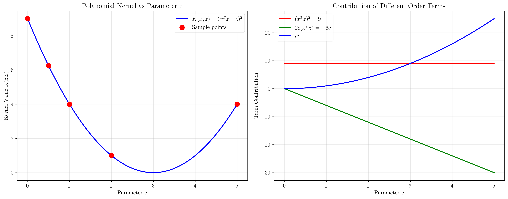
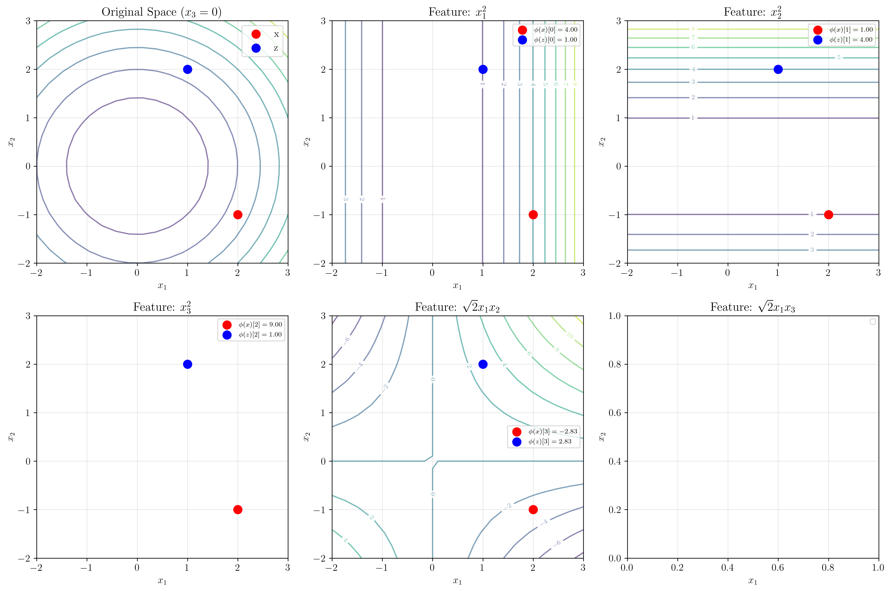

# Question 3: Polynomial Kernel Calculations

## Problem Statement
Work with specific kernel calculations for the polynomial kernel $K(\mathbf{x}, \mathbf{z}) = (\mathbf{x}^T\mathbf{z} + c)^d$.

Given vectors $\mathbf{x} = (2, -1, 3)$ and $\mathbf{z} = (1, 2, -1)$.

### Task
1. Calculate $K(\mathbf{x}, \mathbf{z})$ for $c = 1, d = 2$
2. Calculate $K(\mathbf{x}, \mathbf{z})$ for $c = 0, d = 3$
3. Find the explicit feature mapping $\phi(\mathbf{x})$ for the case $c = 0, d = 2$ in 3D
4. Verify that $K(\mathbf{x}, \mathbf{z}) = \phi(\mathbf{x})^T\phi(\mathbf{z})$ for your calculated mapping
5. How does the parameter $c$ affect the relative importance of different order terms?

## Understanding the Problem
This problem focuses on concrete calculations with polynomial kernels, which are among the most commonly used kernels in practice. Understanding how to compute these kernels both directly and through explicit feature mappings is crucial for grasping the kernel trick.

The polynomial kernel $K(\mathbf{x}, \mathbf{z}) = (\mathbf{x}^T\mathbf{z} + c)^d$ has two important parameters:
- $d$: the degree, which determines the complexity of the decision boundary
- $c$: the constant term, which affects the relative importance of different order terms

## Solution

We'll work through each calculation step-by-step, demonstrating both the kernel trick and explicit feature mapping approaches.

### Step 1: Calculate $K(\mathbf{x}, \mathbf{z})$ for $c = 1, d = 2$

Given: $\mathbf{x} = (2, -1, 3)$ and $\mathbf{z} = (1, 2, -1)$

**Step 1.1: Calculate the dot product**
$$\mathbf{x}^T\mathbf{z} = 2 \cdot 1 + (-1) \cdot 2 + 3 \cdot (-1) = 2 - 2 - 3 = -3$$

**Step 1.2: Apply the kernel formula**
$$K(\mathbf{x}, \mathbf{z}) = (\mathbf{x}^T\mathbf{z} + c)^d = (-3 + 1)^2 = (-2)^2 = 4$$

### Step 2: Calculate $K(\mathbf{x}, \mathbf{z})$ for $c = 0, d = 3$

Using the same dot product: $\mathbf{x}^T\mathbf{z} = -3$

**Apply the kernel formula:**
$$K(\mathbf{x}, \mathbf{z}) = (\mathbf{x}^T\mathbf{z} + c)^d = (-3 + 0)^3 = (-3)^3 = -27$$

### Step 3: Explicit Feature Mapping for $c = 0, d = 2$ in 3D

For the polynomial kernel $(\mathbf{x}^T\mathbf{z})^2$ in 3D, we need all monomials of degree up to 2.

**The explicit feature mapping is:**
$$\phi(\mathbf{x}) = [x_1^2, x_2^2, x_3^2, \sqrt{2}x_1x_2, \sqrt{2}x_1x_3, \sqrt{2}x_2x_3]$$

The $\sqrt{2}$ factors ensure that $\phi(\mathbf{x})^T\phi(\mathbf{z}) = (\mathbf{x}^T\mathbf{z})^2$.

**For $\mathbf{x} = (2, -1, 3)$:**
$$\phi(\mathbf{x}) = [2^2, (-1)^2, 3^2, \sqrt{2} \cdot 2 \cdot (-1), \sqrt{2} \cdot 2 \cdot 3, \sqrt{2} \cdot (-1) \cdot 3]$$
$$= [4, 1, 9, -2\sqrt{2}, 6\sqrt{2}, -3\sqrt{2}]$$
$$= [4, 1, 9, -2.828, 8.485, -4.243]$$

**For $\mathbf{z} = (1, 2, -1)$:**
$$\phi(\mathbf{z}) = [1^2, 2^2, (-1)^2, \sqrt{2} \cdot 1 \cdot 2, \sqrt{2} \cdot 1 \cdot (-1), \sqrt{2} \cdot 2 \cdot (-1)]$$
$$= [1, 4, 1, 2\sqrt{2}, -\sqrt{2}, -2\sqrt{2}]$$
$$= [1, 4, 1, 2.828, -1.414, -2.828]$$

### Step 4: Verification of Kernel Equivalence

**Method 1: Explicit feature mapping**
$$\phi(\mathbf{x})^T\phi(\mathbf{z}) = \sum_{i=1}^{6} \phi(\mathbf{x})_i \cdot \phi(\mathbf{z})_i$$

Computing each term:
- Term 1: $4 \times 1 = 4$
- Term 2: $1 \times 4 = 4$  
- Term 3: $9 \times 1 = 9$
- Term 4: $(-2.828) \times 2.828 = -8$
- Term 5: $8.485 \times (-1.414) = -12$
- Term 6: $(-4.243) \times (-2.828) = 12$

$$\phi(\mathbf{x})^T\phi(\mathbf{z}) = 4 + 4 + 9 - 8 - 12 + 12 = 9$$

**Method 2: Kernel trick**
$$K(\mathbf{x}, \mathbf{z}) = (\mathbf{x}^T\mathbf{z})^2 = (-3)^2 = 9$$

**Verification:** Both methods give the same result: $9$

This confirms that the explicit feature mapping correctly represents the polynomial kernel.

### Step 5: Effect of Parameter $c$

The parameter $c$ in $K(\mathbf{x}, \mathbf{z}) = (\mathbf{x}^T\mathbf{z} + c)^d$ significantly affects the kernel behavior.

**Expansion for $d = 2$:**
$$(\mathbf{x}^T\mathbf{z} + c)^2 = (\mathbf{x}^T\mathbf{z})^2 + 2c(\mathbf{x}^T\mathbf{z}) + c^2$$

For our vectors with $\mathbf{x}^T\mathbf{z} = -3$:

| $c$ | $\mathbf{x}^T\mathbf{z} + c$ | $K(\mathbf{x}, \mathbf{z})$ | Expansion |
|-----|------------------------------|------------------------------|-----------|
| 0   | -3                          | 9                            | $9 + 0 + 0$ |
| 0.5 | -2.5                        | 6.25                         | $9 - 3 + 0.25$ |
| 1   | -2                          | 4                            | $9 - 6 + 1$ |
| 2   | -1                          | 1                            | $9 - 12 + 4$ |
| 5   | 2                           | 4                            | $9 - 30 + 25$ |

**Key insights about parameter $c$:**

1. **$c = 0$**: Pure polynomial terms only, focuses on input similarity
2. **$c > 0$**: Adds lower-order terms, giving weight to constant and linear components
3. **Large $c$**: Can dominate the kernel, reducing the importance of input similarity
4. **$c$ as bias**: Acts as a "bias" term that shifts kernel values upward

## Visual Explanations

### Parameter $c$ Analysis

The left panel shows how the kernel value changes with parameter $c$, while the right panel shows the contribution of different order terms. As $c$ increases, the constant and linear terms become more dominant relative to the pure polynomial term.

### Feature Mapping Visualization

This visualization shows the original 2D space (fixing $x_3 = 0$) and the corresponding feature space dimensions. Each subplot represents one dimension of the feature space $\phi(\mathbf{x})$, showing how the polynomial transformation maps the input space.

## Key Insights

### Mathematical Foundations
- Polynomial kernels can be computed efficiently using the kernel trick: $O(n)$ vs $O(\binom{n+d}{d})$
- The explicit feature mapping requires careful normalization (e.g., $\sqrt{2}$ factors) to ensure equivalence
- Parameter $c$ controls the balance between different order polynomial terms
- Negative kernel values are possible and mathematically valid for certain parameter combinations

### Practical Applications
- The choice of $c$ affects the decision boundary complexity and generalization
- $c = 0$ gives "homogeneous" polynomials, focusing purely on input similarity patterns
- $c > 0$ gives "inhomogeneous" polynomials, adding bias toward certain regions
- Parameter tuning of both $c$ and $d$ is crucial for optimal performance

### Computational Insights
- Explicit feature mapping becomes impractical for high dimensions and degrees
- The kernel trick allows working with polynomial features without explicit computation
- Verification through both methods provides confidence in implementation correctness
- Understanding the expansion helps interpret what the kernel is actually computing

## Conclusion
- For $c = 1, d = 2$: $K(\mathbf{x}, \mathbf{z}) = 4$
- For $c = 0, d = 3$: $K(\mathbf{x}, \mathbf{z}) = -27$
- The explicit feature mapping $\phi(\mathbf{x}) = [x_1^2, x_2^2, x_3^2, \sqrt{2}x_1x_2, \sqrt{2}x_1x_3, \sqrt{2}x_2x_3]$ correctly reproduces the kernel value
- Verification confirms: $\phi(\mathbf{x})^T\phi(\mathbf{z}) = 9 = (\mathbf{x}^T\mathbf{z})^2$
- Parameter $c$ controls the relative importance of different order terms, with larger $c$ values emphasizing constant and linear components over pure polynomial similarity

This example demonstrates the power and elegance of the kernel trick: we can work with complex polynomial feature spaces through simple dot product calculations, while maintaining mathematical rigor and computational efficiency.
