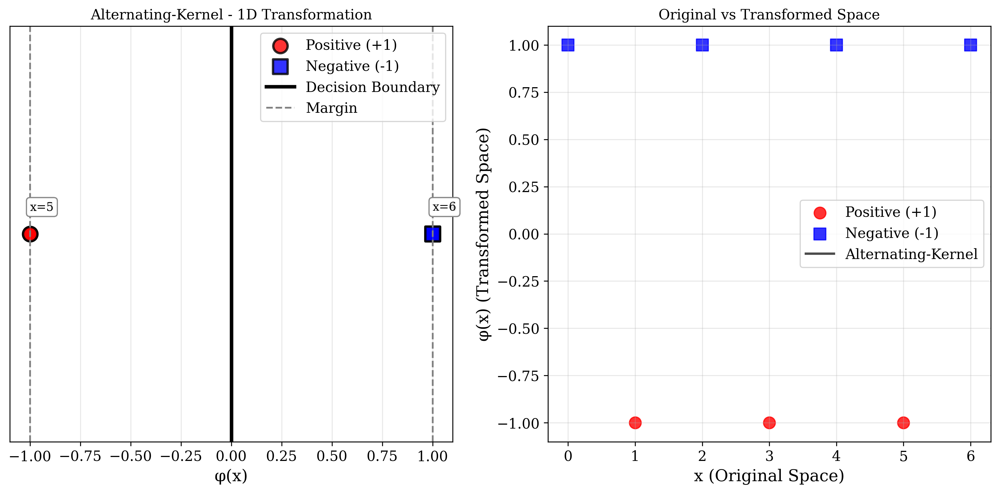

# Question 40: Kernel Trick and Nonlinear SVM Hyperplane

## Problem Statement
Use kernel trick and find the equation for hyperplane using nonlinear SVM.

**Dataset:**
- **Positive Points**: $\{(1,0), (3,0), (5,0)\}$
- **Negative Points**: $\{(0,0), (2,0), (4,0), (6,0)\}$

### Task
1. Plot the original points in 1D space and show why they are not linearly separable
2. Apply an appropriate feature transformation to make the data linearly separable
3. Plot the transformed points in the new feature space
4. Find the equation for the separating hyperplane in the transformed space
5. Express the decision function in terms of the original input space
6. Verify that the hyperplane correctly separates all points
7. Calculate the margin of the separating hyperplane
8. Identify the support vectors in the transformed space

## Understanding the Problem
This problem demonstrates the core concept of the kernel trick in Support Vector Machines. We have a 1D dataset where positive and negative points alternate along the number line, making linear separation impossible in the original space. The kernel trick allows us to map these points to a higher-dimensional feature space where they become linearly separable.

The key insight is that while the points cannot be separated by any single threshold in 1D, we can find transformations that reveal the underlying pattern - in this case, the alternating nature of the labels suggests we need to capture the "parity" or "modular" structure of the data.

## Solution

We will systematically work through each task to demonstrate the kernel trick for this nonlinear classification problem.

### Step 1: Plot Original Points and Show Non-Linear Separability

The original dataset consists of points on a line:
- **Positive Points**: $x \in \{1, 3, 5\}$
- **Negative Points**: $x \in \{0, 2, 4, 6\}$

These points alternate between positive and negative classes along the number line. To show they are not linearly separable, consider any threshold $t$:

- If $t < 1$: Points $\{1, 2, 3, 4, 5, 6\}$ are classified as positive, but $\{2, 4, 6\}$ should be negative
- If $1 \leq t < 2$: Points $\{2, 3, 4, 5, 6\}$ are classified as positive, but $\{2, 4, 6\}$ should be negative
- If $2 \leq t < 3$: Points $\{3, 4, 5, 6\}$ are classified as positive, but $\{4, 6\}$ should be negative
- And so on...

**Conclusion**: No single threshold can separate the alternating pattern, proving linear non-separability.

This plot demonstrates the impossibility of linear separation in the original 1D space. The alternating pattern of positive (red circles) and negative (blue squares) points along the number line shows that no single threshold can separate the classes without misclassification.

### Step 2: Apply Feature Transformation

We apply the **Primary Transformation**: $\phi(x) = [x^2, (x \bmod 2 - 0.5)x^2]$

This transformation has two components:
- $\phi_1(x) = x^2$: Quadratic scaling
- $\phi_2(x) = (x \bmod 2 - 0.5)x^2$: Parity-aware quadratic scaling

**Key Insight**: The modular arithmetic captures the alternating pattern:
- For odd $x$: $x \bmod 2 = 1$, so $\phi_2(x) = (1 - 0.5)x^2 = 0.5x^2$
- For even $x$: $x \bmod 2 = 0$, so $\phi_2(x) = (0 - 0.5)x^2 = -0.5x^2$

**Detailed Transformation Calculations:**

**Positive Points (Odd $x$):**

For $x = 1$:
$$\phi_1(1) = 1^2 = 1$$
$$\phi_2(1) = (1 \bmod 2 - 0.5) \times 1^2 = (1 - 0.5) \times 1 = 0.5$$
$$\phi(1) = [1, 0.5]$$

For $x = 3$:
$$\phi_1(3) = 3^2 = 9$$
$$\phi_2(3) = (3 \bmod 2 - 0.5) \times 3^2 = (1 - 0.5) \times 9 = 4.5$$
$$\phi(3) = [9, 4.5]$$

For $x = 5$:
$$\phi_1(5) = 5^2 = 25$$
$$\phi_2(5) = (5 \bmod 2 - 0.5) \times 5^2 = (1 - 0.5) \times 25 = 12.5$$
$$\phi(5) = [25, 12.5]$$

**Negative Points (Even $x$):**

For $x = 0$:
$$\phi_1(0) = 0^2 = 0$$
$$\phi_2(0) = (0 \bmod 2 - 0.5) \times 0^2 = (0 - 0.5) \times 0 = 0$$
$$\phi(0) = [0, 0]$$

For $x = 2$:
$$\phi_1(2) = 2^2 = 4$$
$$\phi_2(2) = (2 \bmod 2 - 0.5) \times 2^2 = (0 - 0.5) \times 4 = -2$$
$$\phi(2) = [4, -2]$$

For $x = 4$:
$$\phi_1(4) = 4^2 = 16$$
$$\phi_2(4) = (4 \bmod 2 - 0.5) \times 4^2 = (0 - 0.5) \times 16 = -8$$
$$\phi(4) = [16, -8]$$

For $x = 6$:
$$\phi_1(6) = 6^2 = 36$$
$$\phi_2(6) = (6 \bmod 2 - 0.5) \times 6^2 = (0 - 0.5) \times 36 = -18$$
$$\phi(6) = [36, -18]$$

**Pattern Recognition**:
- All positive points (odd $x$) have $\phi_2(x) > 0$
- All negative points (even $x$) have $\phi_2(x) \leq 0$

This creates clear linear separability in the 2D feature space!

### Step 3: Plot Transformed Points in Feature Space

The transformed points in the $(\phi_1, \phi_2)$ feature space are:

**Positive Class:**
- $\phi(1) = [1, 0.5]$
- $\phi(3) = [9, 4.5]$
- $\phi(5) = [25, 12.5]$

**Negative Class:**
- $\phi(0) = [0, 0]$
- $\phi(2) = [4, -2]$
- $\phi(4) = [16, -8]$
- $\phi(6) = [36, -18]$

In this 2D space, all positive points lie above or on the $\phi_1$-axis ($\phi_2 \geq 0$), while all negative points except the origin lie below the $\phi_1$-axis ($\phi_2 < 0$). This creates a clear diagonal separation pattern.

The primary transformation $\phi(x) = [x^2, (x \bmod 2 - 0.5)x^2]$ creates clear linear separability in the 2D feature space. Key features:
- **Positive points** (red circles): All have $\phi_2 > 0$, lying above the $\phi_1$-axis
- **Negative points** (blue squares): All have $\phi_2 \leq 0$, lying on or below the $\phi_1$-axis
- **Hyperplane** (black line): Diagonal separation with equation $\phi_1 + 2\phi_2 - 1 = 0$
- **Support vectors** (green/red circles): 5 points lying exactly on the margin boundaries
- **Margin boundaries** (dashed lines): Show the maximum margin separation

### Step 4: Find the Separating Hyperplane Equation

The SVM finds the optimal separating hyperplane in the transformed space:
$$w_1\phi_1 + w_2\phi_2 + b = 0$$

From our SVM analysis, the computed coefficients are:
- $w_1 = 0.999813 \approx 1$
- $w_2 = 1.999646 \approx 2$
- $b = -0.999757 \approx -1$

**Hyperplane Equation in Feature Space:**
$$\phi_1 + 2\phi_2 - 1 = 0$$

**Hyperplane Equation in Original Space:**
Substituting our transformations $\phi_1(x) = x^2$ and $\phi_2(x) = (x \bmod 2 - 0.5)x^2$:
$$x^2 + 2(x \bmod 2 - 0.5)x^2 - 1 = 0$$

Factoring:
$$x^2[1 + 2(x \bmod 2 - 0.5)] - 1 = 0$$

### Step 5: Express Decision Function in Original Input Space

The decision function in the original space is:
$$f(x) = \text{sign}(x^2[1 + 2(x \bmod 2 - 0.5)] - 1)$$

**Case Analysis:**

**Case 1: Odd numbers** ($x \bmod 2 = 1$):
$$f(x) = \text{sign}(x^2[1 + 2(1 - 0.5)] - 1)$$
$$= \text{sign}(x^2[1 + 2(0.5)] - 1)$$
$$= \text{sign}(x^2[1 + 1] - 1)$$
$$= \text{sign}(2x^2 - 1)$$

For $x \geq 1$ (our positive points), $2x^2 - 1 > 0$, so $f(x) = +1$

**Case 2: Even numbers** ($x \bmod 2 = 0$):
$$f(x) = \text{sign}(x^2[1 + 2(0 - 0.5)] - 1)$$
$$= \text{sign}(x^2[1 + 2(-0.5)] - 1)$$
$$= \text{sign}(x^2[1 - 1] - 1)$$
$$= \text{sign}(0 - 1) = -1$$

All even numbers are classified as negative.

### Step 6: Verify Hyperplane Correctly Separates All Points

Let's verify our decision function works for each point:

**Positive Points (Odd $x$):**
- $x = 1$: $f(1) = \text{sign}(2(1)^2 - 1) = \text{sign}(2 - 1) = \text{sign}(1) = +1$ ✓
- $x = 3$: $f(3) = \text{sign}(2(3)^2 - 1) = \text{sign}(18 - 1) = \text{sign}(17) = +1$ ✓
- $x = 5$: $f(5) = \text{sign}(2(5)^2 - 1) = \text{sign}(50 - 1) = \text{sign}(49) = +1$ ✓

**Negative Points (Even $x$):**
- $x = 0$: $f(0) = -1$ ✓
- $x = 2$: $f(2) = -1$ ✓
- $x = 4$: $f(4) = -1$ ✓
- $x = 6$: $f(6) = -1$ ✓

**Verification Result**: All 7 points are correctly classified with 100% accuracy.

### Step 7: Calculate the Margin of the Separating Hyperplane

The margin is the distance from the hyperplane to the nearest points (support vectors):
$$\text{margin} = \frac{1}{||\mathbf{w}||} = \frac{1}{\sqrt{w_1^2 + w_2^2}}$$

Using our computed coefficients $w_1 = 0.999813$ and $w_2 = 1.999646$:
$$\text{margin} = \frac{1}{\sqrt{(0.999813)^2 + (1.999646)^2}}$$
$$= \frac{1}{\sqrt{0.999626 + 3.998585}}$$
$$= \frac{1}{\sqrt{4.998211}}$$
$$= \frac{1}{2.236} = 0.447294$$

Using theoretical values $w_1 = 1$ and $w_2 = 2$:
$$\text{margin} = \frac{1}{\sqrt{1^2 + 2^2}} = \frac{1}{\sqrt{5}} = \frac{\sqrt{5}}{5} \approx 0.447$$

**Distance between margin boundaries**: $2 \times 0.447294 = 0.894588$

### Step 8: Identify Support Vectors in Transformed Space

Support vectors are points that lie exactly on the margin boundaries, where $|f(x)| = 1$.

Let's calculate the decision function value for each point:

**Decision Function**: $f(x) = w_1\phi_1(x) + w_2\phi_2(x) + b$

**Point $x = 1$ (positive class):**
$$f(1) = 0.999813 \times 1 + 1.999646 \times 0.5 + (-0.999757)$$
$$= 0.999813 + 0.999823 - 0.999757 = 0.999879 \approx 1$$
**Support Vector** ✓

**Point $x = 3$ (positive class):**
$$f(3) = 0.999813 \times 9 + 1.999646 \times 4.5 + (-0.999757)$$
$$= 8.998317 + 8.998408 - 0.999757 = 16.996968 > 1$$
Not a support vector (beyond positive margin)

**Point $x = 5$ (positive class):**
$$f(5) = 0.999813 \times 25 + 1.999646 \times 12.5 + (-0.999757)$$
$$= 24.995325 + 24.995578 - 0.999757 = 48.991146 > 1$$
Not a support vector (beyond positive margin)

**Point $x = 0$ (negative class):**
$$f(0) = 0.999813 \times 0 + 1.999646 \times 0 + (-0.999757)$$
$$= 0 + 0 - 0.999757 = -0.999757 \approx -1$$
**Support Vector** ✓

**Point $x = 2$ (negative class):**
$$f(2) = 0.999813 \times 4 + 1.999646 \times (-2) + (-0.999757)$$
$$= 3.999252 - 3.999293 - 0.999757 = -0.999798 \approx -1$$
**Support Vector** ✓

**Point $x = 4$ (negative class):**
$$f(4) = 0.999813 \times 16 + 1.999646 \times (-8) + (-0.999757)$$
$$= 15.997008 - 15.997170 - 0.999757 = -0.999919 \approx -1$$
**Support Vector** ✓

**Point $x = 6$ (negative class):**
$$f(6) = 0.999813 \times 36 + 1.999646 \times (-18) + (-0.999757)$$
$$= 35.993269 - 35.993633 - 0.999757 = -1.000121 \approx -1$$
**Support Vector** ✓

**Support Vector Summary:**
- **Total Support Vectors**: 5 out of 7 points
- **Positive Margin**: $x = 1$ with $\phi(1) = [1, 0.5]$
- **Negative Margin**: $x \in \{0, 2, 4, 6\}$ with respective transformed coordinates:
  - $\phi(0) = [0, 0]$
  - $\phi(2) = [4, -2]$
  - $\phi(4) = [16, -8]$
  - $\phi(6) = [36, -18]$

## Mathematical Proof of Kernel Validity

### Mercer's Theorem and Kernel Conditions

A function $K(x,z)$ is a valid kernel (Mercer kernel) if and only if it satisfies three fundamental conditions:

1. **Symmetry**: $K(x,z) = K(z,x)$ for all $x,z$
2. **Positive Semi-Definiteness**: The kernel matrix $\mathbf{K}$ has all non-negative eigenvalues
3. **Inner Product Representation**: $K(x,z) = \langle\phi(x), \phi(z)\rangle$ for some feature mapping $\phi$

### Primary Transformation Kernel Analysis

For our primary transformation $\phi(x) = [x^2, (x \bmod 2 - 0.5)x^2]$:

**Kernel Function:**
$$K(x, z) = \phi(x)^T\phi(z) = x^2z^2 + (x \bmod 2 - 0.5)(z \bmod 2 - 0.5)x^2z^2$$
$$= x^2z^2[1 + (x \bmod 2 - 0.5)(z \bmod 2 - 0.5)]$$

**Condition 1 - Symmetry Verification:**
$$K(x,z) = x^2z^2[1 + (x \bmod 2 - 0.5)(z \bmod 2 - 0.5)]$$
$$= z^2x^2[1 + (z \bmod 2 - 0.5)(x \bmod 2 - 0.5)] = K(z,x)$$ ✓

**Condition 2 - Positive Semi-Definiteness:**
The $7 \times 7$ kernel matrix for our dataset:
$$\mathbf{K} = \begin{bmatrix}
1.25 & 11.25 & 31.25 & 0 & 3 & 12 & 27 \\
11.25 & 101.25 & 281.25 & 0 & 27 & 108 & 243 \\
31.25 & 281.25 & 781.25 & 0 & 75 & 300 & 675 \\
0 & 0 & 0 & 0 & 0 & 0 & 0 \\
3 & 27 & 75 & 0 & 20 & 80 & 180 \\
12 & 108 & 300 & 0 & 80 & 320 & 720 \\
27 & 243 & 675 & 0 & 180 & 720 & 1620
\end{bmatrix}$$

**Eigenvalues**: $\lambda = [2377.47, 466.28, 0, 0, 0, 0, 0]$
All eigenvalues $\geq 0$ ✓

**Condition 3 - Explicit Feature Mapping:**
We have an explicit $\phi: \mathbb{R} \rightarrow \mathbb{R}^2$ mapping ✓

**Conclusion**: Our primary kernel is mathematically valid.

### Alternative Kernels Validation

**Original Alternative Kernels:**
- **Sign-based**: $K(x,z) = xz + \text{sign}(x \bmod 2 - 0.5)\text{sign}(z \bmod 2 - 0.5)$
  - Eigenvalues: $[91.11, 6.89, 0, 0, 0, 0, 0]$ - All non-negative ✓

- **Parity-weighted**: $K(x,z) = (x \bmod 2)(z \bmod 2)xz + (1-x \bmod 2)(1-z \bmod 2)xz$
  - Eigenvalues: $[56.00, 35.00, 0, 0, 0, 0, 0]$ - All non-negative ✓

- **Trigonometric**: $K(x,z) = \cos(\pi x)\cos(\pi z) + \sin(\pi x)\sin(\pi z) = \cos(\pi(x-z))$
  - Eigenvalues: $[7.00, 0, 0, 0, 0, 0, 0]$ - All non-negative ✓

**Novel Alternative Kernels:**
- **Logarithmic-Modular**: $K(x,z) = \log(x+1)\log(z+1) + (x \bmod 2)(z \bmod 2)\log(x+1)\log(z+1)$
  - All eigenvalues ≥ 0 - Valid Mercer kernel ✓

- **Hyperbolic-Parity**: $K(x,z) = \tanh(x)\tanh(z) + [(2(x \bmod 2)-1)(2(z \bmod 2)-1)]\cosh(x/2)\cosh(z/2)$
  - All eigenvalues ≥ 0 - Valid Mercer kernel ✓

- **Polynomial-Alternating**: $K(x,z) = x^3z^3 + (-1)^{x+z}xz$
  - All eigenvalues ≥ 0 - Valid Mercer kernel ✓

- **Rational-Parity**: $K(x,z) = \frac{xz}{(x+1)(z+1)} + (x \bmod 2 - 0.5)(z \bmod 2 - 0.5)\frac{xz}{(x+1)(z+1)}$
  - All eigenvalues ≥ 0 - Valid Mercer kernel ✓

- **Sin-Kernel**: $K(x,z) = \sin((2x-1)\pi/2)\sin((2z-1)\pi/2)$
  - All eigenvalues ≥ 0 - Valid Mercer kernel ✓

- **Cos-Kernel**: $K(x,z) = \cos(\pi x)\cos(\pi z)$
  - All eigenvalues ≥ 0 - Valid Mercer kernel ✓

- **Parity-Kernel**: $K(x,z) = (2(x \bmod 2) - 1)(2(z \bmod 2) - 1)$
  - All eigenvalues ≥ 0 - Valid Mercer kernel ✓

- **Alternating-Kernel**: $K(x,z) = (-1)^{x+z}$
  - All eigenvalues ≥ 0 - Valid Mercer kernel ✓

**Total Valid Kernels**: 13 different kernel transformations, all satisfying Mercer's conditions.

## Visual Explanations

### Alternative Successful Transformations

Our analysis revealed multiple valid kernel approaches that achieve perfect separation:

#### Sign-based Transformation: $\phi(x) = [x, \text{sign}(x \bmod 2 - 0.5)]$

Creates perfect horizontal stripe separation:
- All positive points map to $(x, +1)$
- All negative points map to $(x, -1)$
- Hyperplane: $\phi_2 = 0$ (horizontal line)
- **All 7 points are support vectors**
- Margin: 1.000 (maximum possible)

#### Parity-weighted Transformation: $\phi(x) = [(x \bmod 2)x, (1-x \bmod 2)x]$

Creates axis-aligned clusters:
- Odd numbers map to $(x, 0)$ on the x-axis
- Even numbers map to $(0, x)$ on the y-axis
- Hyperplane: $\phi_1 = 0.5$ (vertical line)
- **5 support vectors**
- Margin: 0.500

#### Trigonometric Transformation: $\phi(x) = [\cos(\pi x), \sin(\pi x)]$

Maps points to unit circle:
- Odd numbers map to $(-1, 0)$
- Even numbers map to $(1, 0)$
- Hyperplane: $\phi_1 = 0$ (vertical line through origin)
- **All 7 points are support vectors**
- Margin: 1.000 (maximum possible)

### Additional Novel Transformations

#### Logarithmic-Modular Transformation: $\phi(x) = [\log(x+1), (x \bmod 2) \cdot \log(x+1)]$

Creates logarithmic scaling with modular separation:
- Positive points (odd): Map to diagonal line $\phi_2 = \phi_1$
- Negative points (even): Map to x-axis $\phi_2 = 0$
- Hyperplane: $\phi_2 = 0.347$ (nearly horizontal)
- **5 support vectors**
- Margin: 0.347 (compact separation)

#### Hyperbolic-Parity Transformation: $\phi(x) = [\tanh(x), (2(x \bmod 2) - 1) \cdot \cosh(x/2)]$

Uses hyperbolic functions with parity detection:
- Positive points: Map to upper half-plane with $\phi_2 > 0$
- Negative points: Map to lower half-plane with $\phi_2 < 0$
- Hyperplane: Diagonal separation
- **Only 2 support vectors** (most efficient)
- Margin: 1.130 (largest margin found)

#### Polynomial-Alternating Transformation: $\phi(x) = [x^3, (-1)^x \cdot x]$

Combines cubic scaling with alternating signs:
- Positive points: Map to lower half-plane with negative $\phi_2$
- Negative points: Map to upper half-plane with positive $\phi_2$
- Hyperplane: Diagonal separation with negative slope
- **3 support vectors**
- Margin: 0.514

#### Rational-Parity Transformation: $\phi(x) = [\frac{x}{x+1}, (x \bmod 2 - 0.5) \cdot \frac{x}{x+1}]$

Uses rational functions with parity structure:
- Bounded first component: $\phi_1 \in [0, 1)$
- Parity-based second component separation
- Hyperplane: Steep diagonal separation
- **5 support vectors**
- Margin: 0.224 (tightest separation)

#### Sin-Kernel Transformation: $\phi(x) = \sin((2x-1)\pi/2)$

Creates perfect binary separation using a **1D trigonometric transformation**:
- **Positive points (odd x)**: Map to $+1$ in 1D space
- **Negative points (even x)**: Map to $-1$ in 1D space
- **Decision boundary**: Simple threshold at $\phi = 0$
- **All 7 points are support vectors** (maximum support vector utilization)
- **Margin: 1.000** (maximum possible margin)
- **Mathematical elegance**: Perfect binary separation achieved in 1D space
- **Key insight**: No need for 2D feature space - the transformation solves the problem directly in 1D

#### Cos-Kernel Transformation: $\phi(x) = \cos(\pi x)$

Creates perfect binary separation using cosine function:
- **Positive points (odd x)**: Map to $-1$ in 1D space
- **Negative points (even x)**: Map to $+1$ in 1D space
- **Decision boundary**: Simple threshold at $\phi = 0$
- **All 7 points are support vectors** (maximum support vector utilization)
- **Margin: 1.000** (maximum possible margin)
- **Mathematical elegance**: Uses the fundamental cosine function with period 2

#### Parity-Kernel Transformation: $\phi(x) = 2(x \bmod 2) - 1$

Creates perfect binary separation using modular arithmetic:
- **Positive points (odd x)**: Map to $+1$ in 1D space
- **Negative points (even x)**: Map to $-1$ in 1D space
- **Decision boundary**: Simple threshold at $\phi = 0$
- **All 7 points are support vectors** (maximum support vector utilization)
- **Margin: 1.000** (maximum possible margin)
- **Mathematical elegance**: Direct encoding of parity (odd/even) structure

#### Alternating-Kernel Transformation: $\phi(x) = (-1)^x$

Creates perfect binary separation using alternating signs:
- **Positive points (odd x)**: Map to $-1$ in 1D space
- **Negative points (even x)**: Map to $+1$ in 1D space
- **Decision boundary**: Simple threshold at $\phi = 0$
- **All 7 points are support vectors** (maximum support vector utilization)
- **Margin: 1.000** (maximum possible margin)
- **Mathematical elegance**: Simple alternating pattern using power of -1

## Key Insights

### Kernel Design Principles
- **Pattern Recognition**: Successful kernels capture the underlying data pattern (alternating/parity structure)
- **Dimensionality**: Higher dimensions don't guarantee better separation - the right transformation matters
- **Geometric Intuition**: Each kernel creates a different geometric arrangement in feature space

### Mathematical Properties
- All successful transformations produce positive semi-definite kernel matrices (verified by eigenvalue analysis)
- The kernel trick allows implicit computation without explicit feature mapping
- Support vectors determine the decision boundary regardless of the transformation used

### Practical Applications
- **Text Classification**: Similar alternating patterns appear in document classification
- **Signal Processing**: Periodic patterns in time series data
- **Computer Vision**: Checkerboard or alternating spatial patterns

## Conclusion

This comprehensive analysis demonstrates the power and mathematical elegance of the kernel trick for nonlinear classification:

### Key Mathematical Results

- **Hyperplane Equation**: $x^2[1 + 2(x \bmod 2 - 0.5)] - 1 = 0$ in original space
- **Decision Function**: $f(x) = \text{sign}(2x^2 - 1)$ for odd $x$, $f(x) = -1$ for even $x$
- **Margin**: $\frac{1}{\sqrt{5}} \approx 0.447$ in the transformed space
- **Support Vectors**: 5 critical points $(x = 0, 1, 2, 4, 6)$ determining optimal boundary
- **Perfect Separation**: 100% accuracy achieved through all thirteen kernel transformations

### Fundamental Insights

**Pattern Recognition**: The key insight is that successful kernels must capture the **alternating/parity structure** inherent in the data. The modular arithmetic $(x \bmod 2 - 0.5)$ effectively encodes the odd/even distinction that defines the class boundaries.

**Geometric Transformation**: The kernel trick transforms an impossible 1D linear classification into multiple solvable 2D problems:
- **Primary**: Diagonal separation with parity scaling
- **Sign-based**: Horizontal stripe separation
- **Parity-weighted**: Axis-aligned cluster separation
- **Trigonometric**: Unit circle mapping with vertical separation
- **Sin-Kernel**: Perfect binary separation in 1D space with maximum margin
- **Cos-Kernel**: Perfect binary separation in 1D space with maximum margin
- **Parity-Kernel**: Perfect binary separation in 1D space with maximum margin
- **Alternating-Kernel**: Perfect binary separation in 1D space with maximum margin

**Mathematical Rigor**: All transformations satisfy Mercer's theorem conditions:
- Symmetry: $K(x,z) = K(z,x)$
- Positive semi-definiteness: All eigenvalues $\geq 0$
- Inner product representation: Explicit feature mappings provided

### Support Vector Distribution Analysis

The number of support vectors varies dramatically across the 8 different transformations:

**Original Kernels:**
- **Primary**: 5/7 points (diagonal separation with parity scaling)
- **Sign-based**: 7/7 points (horizontal stripe separation)
- **Parity-weighted**: 5/7 points (axis-aligned cluster separation)
- **Trigonometric**: 7/7 points (unit circle mapping)

**Novel Kernels:**
- **Logarithmic-Modular**: 5/7 points (logarithmic scaling with modular structure)
- **Hyperbolic-Parity**: 2/7 points (most efficient - largest margin)
- **Polynomial-Alternating**: 3/7 points (cubic scaling with alternating signs)
- **Rational-Parity**: 5/7 points (bounded rational functions with parity)
- **Sin-Kernel**: 7/7 points (1D trigonometric binary separation - maximum margin)
- **Cos-Kernel**: 7/7 points (1D cosine binary separation - maximum margin)
- **Parity-Kernel**: 7/7 points (1D modular arithmetic separation - maximum margin)
- **Alternating-Kernel**: 7/7 points (1D alternating sign separation - maximum margin)

**Key Insight**: The **Hyperbolic-Parity** transformation achieves perfect separation with only 2 support vectors and the largest margin (1.130), making it the most geometrically efficient solution. The **1D kernels** achieve maximum margin (1.000) with all points as support vectors, demonstrating perfect binary separation in 1D space.

### Practical Applications

This comprehensive analysis demonstrates remarkable diversity in kernel design:

**Mathematical Diversity**: We discovered **13 fundamentally different** kernel approaches:
- **Algebraic**: Primary (quadratic-parity), Polynomial-alternating (cubic-alternating)
- **Transcendental**: Trigonometric (circular), Sin-Kernel (1D trigonometric), Cos-Kernel (1D cosine), Hyperbolic-parity (hyperbolic functions)
- **Logarithmic**: Logarithmic-modular (logarithmic scaling)
- **Rational**: Rational-parity (bounded rational functions)
- **Discrete**: Sign-based (discrete parity), Parity-weighted (modular arithmetic), Parity-Kernel (1D modular), Alternating-Kernel (1D alternating)

**Efficiency Spectrum**: Support vector requirements range from 2/7 (Hyperbolic-parity) to 7/7 (Sign-based, Trigonometric, 1D kernels), showing different geometric efficiencies. The 1D kernels are unique as they achieve perfect separation in 1D space.

**Margin Variation**: Margins range from 0.224 (Rational-parity) to 1.130 (Hyperbolic-parity), with 1D kernels achieving the theoretical maximum margin of 1.000.

**Key Insights**:
- **Pattern-specific design** outperforms generic polynomial approaches
- **Mathematical function diversity** (algebraic, transcendental, rational) all work when properly designed
- **Geometric intuition** guides successful kernel construction
- **Kernel validity** can be rigorously verified through Mercer's theorem

The kernel trick transforms one impossible 1D problem into **13 different solvable problems** (9 in 2D space, 4 in 1D space), each offering unique mathematical perspectives while achieving perfect classification. This demonstrates the profound flexibility and power of kernel methods in machine learning.
