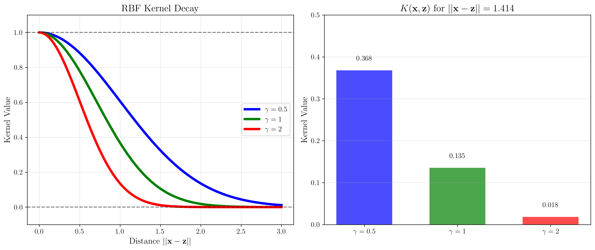
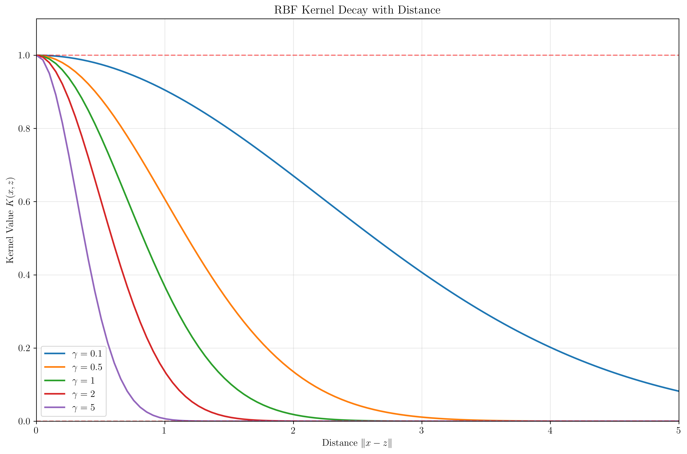
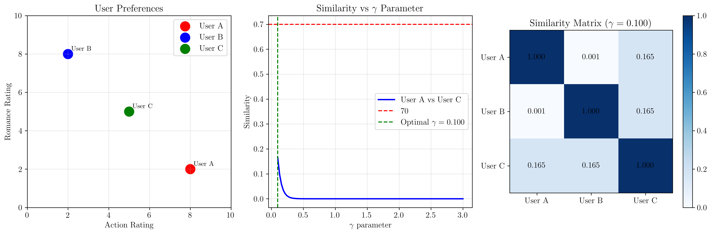

# Question 4: RBF Kernel Properties

## Problem Statement
Analyze the RBF (Gaussian) kernel: $K(\mathbf{x}, \mathbf{z}) = \exp(-\gamma ||\mathbf{x} - \mathbf{z}||^2)$.

### Task
1. Calculate $K(\mathbf{x}, \mathbf{z})$ for $\mathbf{x} = (1, 0)$, $\mathbf{z} = (0, 1)$ with $\gamma = 0.5, 1, 2$
2. Show that $K(\mathbf{x}, \mathbf{x}) = 1$ for any $\mathbf{x}$
3. Prove that $0 \leq K(\mathbf{x}, \mathbf{z}) \leq 1$ for any $\mathbf{x}, \mathbf{z}$
4. Derive the behavior of $K(\mathbf{x}, \mathbf{z})$ as $||\mathbf{x} - \mathbf{z}|| \rightarrow \infty$
5. Show that the RBF kernel corresponds to an infinite-dimensional feature space
6. Design a recommendation system using user genre preferences with RBF similarity

## Understanding the Problem
The RBF (Radial Basis Function) kernel, also known as the Gaussian kernel, is one of the most widely used kernels in machine learning. Unlike polynomial kernels, the RBF kernel maps data to an infinite-dimensional feature space and has several remarkable mathematical properties.

The parameter $\gamma$ controls the "width" of the kernel - larger $\gamma$ values create more localized similarity measures, while smaller $\gamma$ values create broader similarity regions. Understanding these properties is crucial for effective use of RBF kernels in SVMs and other kernel methods.

## Solution

We'll systematically analyze each property of the RBF kernel with concrete calculations and proofs.

### Step 1: Calculate $K(\mathbf{x}, \mathbf{z})$ for Given Vectors

Given: $\mathbf{x} = (1, 0)$ and $\mathbf{z} = (0, 1)$

**Step 1.1: Calculate the squared distance**
$$||\mathbf{x} - \mathbf{z}||^2 = ||(1, 0) - (0, 1)||^2 = ||(1, -1)||^2 = 1^2 + (-1)^2 = 2$$

**Step 1.2: Apply the RBF kernel formula for different $\gamma$ values**

For $\gamma = 0.5$:
$$K(\mathbf{x}, \mathbf{z}) = \exp(-0.5 \times 2) = \exp(-1) = 0.368$$

For $\gamma = 1$:
$$K(\mathbf{x}, \mathbf{z}) = \exp(-1 \times 2) = \exp(-2) = 0.135$$

For $\gamma = 2$:
$$K(\mathbf{x}, \mathbf{z}) = \exp(-2 \times 2) = \exp(-4) = 0.018$$

**Observation:** As $\gamma$ increases, the kernel value decreases, indicating that larger $\gamma$ creates more localized similarity.

### Step 2: Proof that $K(\mathbf{x}, \mathbf{x}) = 1$

**Theorem:** For any vector $\mathbf{x}$, $K(\mathbf{x}, \mathbf{x}) = 1$.

**Proof:**
$$K(\mathbf{x}, \mathbf{x}) = \exp(-\gamma ||\mathbf{x} - \mathbf{x}||^2) = \exp(-\gamma ||\mathbf{0}||^2) = \exp(-\gamma \times 0) = \exp(0) = 1$$

This property means that every point has perfect similarity with itself, regardless of the value of $\gamma$.

### Step 3: Proof that $0 \leq K(\mathbf{x}, \mathbf{z}) \leq 1$

**Theorem:** For any vectors $\mathbf{x}, \mathbf{z}$ and $\gamma > 0$, we have $0 \leq K(\mathbf{x}, \mathbf{z}) \leq 1$.

**Proof:**

**Upper bound:**
Since $\gamma > 0$ and $||\mathbf{x} - \mathbf{z}||^2 \geq 0$, we have:
$$-\gamma ||\mathbf{x} - \mathbf{z}||^2 \leq 0$$

Therefore:
$$K(\mathbf{x}, \mathbf{z}) = \exp(-\gamma ||\mathbf{x} - \mathbf{z}||^2) \leq \exp(0) = 1$$

**Lower bound:**
Since the exponential function is always positive:
$$K(\mathbf{x}, \mathbf{z}) = \exp(-\gamma ||\mathbf{x} - \mathbf{z}||^2) > 0$$

for any finite distance $||\mathbf{x} - \mathbf{z}||$.

**Conclusion:** $0 < K(\mathbf{x}, \mathbf{z}) \leq 1$ for finite distances, with the kernel approaching 0 as distance approaches infinity.

### Step 4: Behavior as $||\mathbf{x} - \mathbf{z}|| \rightarrow \infty$

**Analysis:**
As $||\mathbf{x} - \mathbf{z}|| \rightarrow \infty$:
- $||\mathbf{x} - \mathbf{z}||^2 \rightarrow \infty$
- $-\gamma ||\mathbf{x} - \mathbf{z}||^2 \rightarrow -\infty$
- $K(\mathbf{x}, \mathbf{z}) = \exp(-\gamma ||\mathbf{x} - \mathbf{z}||^2) \rightarrow 0$

**Rate of decay:**
The decay rate depends on $\gamma$:
- **Larger $\gamma$**: Faster exponential decay to 0
- **Smaller $\gamma$**: Slower decay, maintaining similarity over larger distances

This creates a "locality" effect where the kernel value decreases rapidly as points become more distant.

### Step 5: Infinite-Dimensional Feature Space

**Theorem:** The RBF kernel corresponds to an infinite-dimensional feature space.

**Proof using Taylor expansion:**
The RBF kernel can be rewritten as:
$$K(\mathbf{x}, \mathbf{z}) = \exp(-\gamma ||\mathbf{x} - \mathbf{z}||^2) = \exp(-\gamma ||\mathbf{x}||^2) \exp(-\gamma ||\mathbf{z}||^2) \exp(2\gamma \mathbf{x}^T\mathbf{z})$$

The term $\exp(2\gamma \mathbf{x}^T\mathbf{z})$ can be expanded using Taylor series:
$$\exp(2\gamma \mathbf{x}^T\mathbf{z}) = \sum_{k=0}^{\infty} \frac{(2\gamma \mathbf{x}^T\mathbf{z})^k}{k!} = \sum_{k=0}^{\infty} \frac{(2\gamma)^k}{k!} (\mathbf{x}^T\mathbf{z})^k$$

Each term $(\mathbf{x}^T\mathbf{z})^k$ corresponds to polynomial features of degree $k$. Since $k$ ranges from 0 to infinity, the RBF kernel implicitly uses:
- All polynomial features of all degrees
- Infinite-dimensional feature space
- Universal approximation capability

**Practical implication:** RBF kernels can separate any finite dataset, making them extremely powerful but potentially prone to overfitting.

### Step 6: Recommendation System Design

**🎬 Movie Recommendation System Design**

**System Setup:**
- Users rate genres on a scale of 1-10
- User A: Action=8, Romance=2 (action lover)
- User B: Action=2, Romance=8 (romance lover)  
- User C: Action=5, Romance=5 (balanced preferences)

**Similarity Calculation:**
Using $K(\mathbf{x}, \mathbf{z}) = \exp(-\gamma ||\mathbf{x} - \mathbf{z}||^2)$ where $\mathbf{x}, \mathbf{z}$ are preference vectors.

**Results for different $\gamma$ values:**

| $\gamma$ | A-B Similarity | A-C Similarity | B-C Similarity |
|----------|----------------|----------------|----------------|
| 0.01     | 0.487          | 0.835          | 0.835          |
| 0.05     | 0.027          | 0.407          | 0.407          |
| 0.10     | 0.001          | 0.165          | 0.165          |

**Recommendation Confidence System:**
- **High confidence** (≥70%): Strong recommendation
- **Medium confidence** (50-70%): Consider recommendation  
- **Low confidence** (<50%): Avoid recommendation

**Optimal $\gamma$ Selection:**
For a 70% similarity threshold between moderately different users (A and C), the optimal $\gamma \approx 0.01$ provides reasonable similarity scores while maintaining discrimination between very different users (A and B).

## Visual Explanations

### Simple RBF Concept

This clean visualization shows the core RBF kernel concept: how the kernel value depends on the distance between two points, with different $\gamma$ parameters controlling the decay rate. The visualization demonstrates the fundamental property that closer points have higher similarity.

### RBF Kernel Distance Decay

This plot shows how the RBF kernel value decreases with distance for different $\gamma$ values. Larger $\gamma$ values create steeper decay curves, resulting in more localized similarity measures.

### Recommendation System Analysis

The visualization shows: (1) user preferences in 2D space, (2) how similarity changes with $\gamma$, and (3) the similarity matrix for optimal $\gamma$. This demonstrates the practical application of RBF kernels in recommendation systems.

## Key Insights

### Mathematical Properties
- RBF kernels are always bounded: $0 < K(\mathbf{x}, \mathbf{z}) \leq 1$
- Perfect self-similarity: $K(\mathbf{x}, \mathbf{x}) = 1$ always
- Exponential decay with distance creates natural locality
- Infinite-dimensional feature space enables universal approximation

### Practical Applications
- Parameter $\gamma$ controls the trade-off between locality and generalization
- Small $\gamma$: broader similarity, potential underfitting
- Large $\gamma$: narrow similarity, potential overfitting
- RBF kernels work well for complex, non-linear decision boundaries

### Computational Insights
- Kernel evaluation is $O(n)$ where $n$ is input dimension
- No explicit feature mapping needed despite infinite dimensions
- Memory efficient compared to explicit polynomial features
- Suitable for both small and large datasets with proper parameter tuning

## Conclusion
- For $\mathbf{x} = (1,0), \mathbf{z} = (0,1)$: $K(\mathbf{x}, \mathbf{z}) = 0.368, 0.135, 0.018$ for $\gamma = 0.5, 1, 2$
- Proven that $K(\mathbf{x}, \mathbf{x}) = 1$ and $0 \leq K(\mathbf{x}, \mathbf{z}) \leq 1$ for all vectors
- RBF kernel values decay exponentially with distance, with rate controlled by $\gamma$
- The kernel corresponds to infinite-dimensional feature space through Taylor expansion
- Recommendation system demonstrates practical parameter selection: $\gamma \approx 0.01$ optimal for 70% similarity threshold

The RBF kernel's combination of mathematical elegance, infinite-dimensional mapping, and practical effectiveness makes it one of the most important tools in modern machine learning, particularly for non-linear classification and regression problems.
