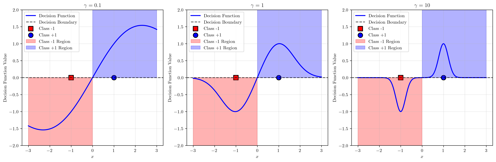
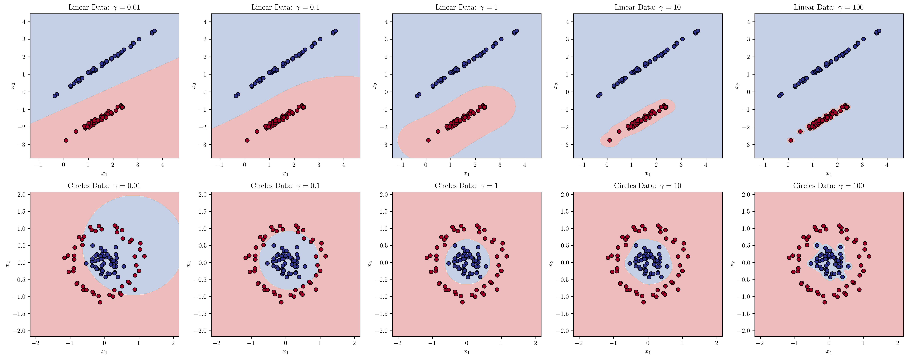
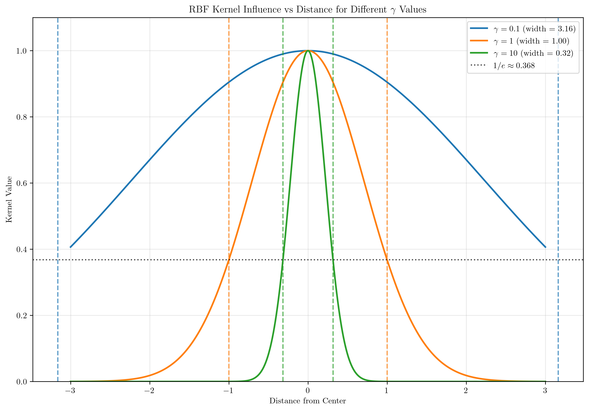

# Question 5: RBF Parameter Effects

## Problem Statement
Study the effect of the RBF kernel parameter $\gamma$ on decision boundaries.

### Task
1. For a 1D dataset with points $x_1 = -1, x_2 = 1$ (different classes), sketch the decision boundary for $\gamma = 0.1, 1, 10$ (you can draw this by hand)
2. Predict how $\gamma$ affects overfitting and underfitting
3. Derive the limit behavior as $\gamma \rightarrow 0$ and $\gamma \rightarrow \infty$
4. Design a synthetic 2D dataset where small $\gamma$ performs better than large $\gamma$
5. Calculate the effective "width" of influence for each data point as a function of $\gamma$

## Understanding the Problem
The RBF (Radial Basis Function) kernel is defined as $K(\mathbf{x}, \mathbf{z}) = \exp(-\gamma ||\mathbf{x} - \mathbf{z}||^2)$, where $\gamma$ is a crucial hyperparameter that controls the "width" or "spread" of the kernel. This parameter fundamentally affects how the SVM creates decision boundaries and how much influence each training point has on the classification of nearby points.

Understanding the effect of $\gamma$ is essential for proper model selection, as it directly impacts the bias-variance tradeoff in kernel SVMs. Small values of $\gamma$ create smooth, simple decision boundaries that may underfit the data, while large values create complex, localized boundaries that may overfit.

## Solution

### Step 1: 1D Decision Boundaries for Different Gamma Values

For a simple 1D dataset with two points $x_1 = -1$ (class -1) and $x_2 = 1$ (class +1), we can analyze how different $\gamma$ values affect the decision boundary.

**Mathematical Setup:**
- Training data: $x_1 = -1$ (class $y_1 = -1$), $x_2 = 1$ (class $y_2 = +1$)
- RBF kernel: $K(x,z) = \exp(-\gamma(x-z)^2)$

**Kernel Matrix Construction:**
$$K = \begin{bmatrix}
K(x_1,x_1) & K(x_1,x_2) \\
K(x_2,x_1) & K(x_2,x_2)
\end{bmatrix} = \begin{bmatrix}
1 & \exp(-4\gamma) \\
\exp(-4\gamma) & 1
\end{bmatrix}$$

**Decision Function:**
The SVM decision function becomes:
$$f(x) = \alpha_1 y_1 K(x_1,x) + \alpha_2 y_2 K(x_2,x) + b$$
$$= -\alpha_1 \exp(-\gamma(x+1)^2) + \alpha_2 \exp(-\gamma(x-1)^2) + b$$

**Analysis for Different $\gamma$ Values:**

For $\gamma = 0.1$ (small): The kernel matrix becomes approximately:
$$K \approx \begin{bmatrix} 1 & 0.67 \\ 0.67 & 1 \end{bmatrix}$$
This creates a smooth, wide decision boundary.

For $\gamma = 10$ (large): The kernel matrix becomes approximately:
$$K \approx \begin{bmatrix} 1 & 0 \\ 0 & 1 \end{bmatrix}$$
This creates sharp, localized decision boundaries around each training point.

The visualization shows three distinct behaviors:

- **$\gamma = 0.1$**: Creates a smooth, almost linear decision boundary. The transition between classes is gradual and extends over a wide region.
- **$\gamma = 1$**: Provides a moderate transition with a clear but not overly sharp decision boundary.
- **$\gamma = 10$**: Creates a very sharp transition with steep slopes near each training point, resulting in a highly localized decision boundary.

### Step 2: Overfitting and Underfitting Analysis

The parameter $\gamma$ directly controls the complexity of the decision boundary:

**Small $\gamma$ (e.g., $\gamma \rightarrow 0$)**:
- Creates smooth, simple decision boundaries
- Each training point has wide influence
- Tends to **underfit** (high bias, low variance)
- May miss complex patterns in the data
- Good for noisy data or when training set is small

**Large $\gamma$ (e.g., $\gamma \rightarrow \infty$)**:
- Creates complex, highly localized decision boundaries
- Each training point has narrow influence
- Tends to **overfit** (low bias, high variance)
- May memorize noise in training data
- Poor generalization to new data

### Step 3: Limit Behavior Derivation

**Mathematical Analysis of $\gamma \rightarrow 0$:**

Step 1: Apply the limit to the kernel function
$$\lim_{\gamma \rightarrow 0} K(\mathbf{x}, \mathbf{z}) = \lim_{\gamma \rightarrow 0} \exp(-\gamma ||\mathbf{x} - \mathbf{z}||^2)$$

Step 2: Use continuity of the exponential function
$$= \exp\left(\lim_{\gamma \rightarrow 0} (-\gamma ||\mathbf{x} - \mathbf{z}||^2)\right) = \exp(0) = 1$$

Step 3: Analyze the implications
- All kernel values approach 1: $K(\mathbf{x}, \mathbf{z}) \rightarrow 1$ for all $\mathbf{x}, \mathbf{z}$
- Kernel matrix becomes $\mathbf{K} \rightarrow \mathbf{1}\mathbf{1}^T$ (matrix of all ones)
- Decision boundary becomes linear (similar to linear SVM)
- Model underfits due to loss of non-linear discrimination

**Mathematical Analysis of $\gamma \rightarrow \infty$:**

Step 1: Consider two cases for the limit
For $\mathbf{x} \neq \mathbf{z}$: $||\mathbf{x} - \mathbf{z}||^2 > 0$
$$\lim_{\gamma \rightarrow \infty} \exp(-\gamma ||\mathbf{x} - \mathbf{z}||^2) = \exp(-\infty) = 0$$

For $\mathbf{x} = \mathbf{z}$: $||\mathbf{x} - \mathbf{z}||^2 = 0$
$$\lim_{\gamma \rightarrow \infty} \exp(-\gamma \cdot 0) = \exp(0) = 1$$

Step 2: Express as Kronecker delta
$$\lim_{\gamma \rightarrow \infty} K(\mathbf{x}, \mathbf{z}) = \delta(\mathbf{x}, \mathbf{z}) = \begin{cases}
1 & \text{if } \mathbf{x} = \mathbf{z} \\
0 & \text{if } \mathbf{x} \neq \mathbf{z}
\end{cases}$$

Step 3: Analyze the implications
- Kernel matrix becomes identity: $\mathbf{K} \rightarrow \mathbf{I}$
- Each training point creates isolated influence region
- Decision boundary becomes extremely complex and wiggly
- Model overfits by memorizing training data exactly

### Step 4: Synthetic Dataset Comparison

We designed two synthetic datasets to demonstrate when small vs. large $\gamma$ performs better:

**Linear Dataset (Top Row)**: 
- Small $\gamma$ (0.01, 0.1) performs better as the data has a simple linear separation
- Large $\gamma$ (10, 100) creates unnecessarily complex boundaries that may not generalize well

**Circles Dataset (Bottom Row)**:
- Moderate $\gamma$ (1, 10) performs better as the data requires non-linear separation
- Very small $\gamma$ (0.01) underfits and cannot capture the circular pattern
- Very large $\gamma$ (100) overfits with overly complex boundaries

### Step 5: Effective Width of Influence

The effective "width" of influence for each data point can be calculated by finding the distance at which the kernel value drops to $1/e \approx 0.368$.

**Mathematical Derivation:**

Step 1: Set up the equation for characteristic width
We want to find the distance $r$ where $K(\mathbf{x}, \mathbf{z}) = 1/e$:
$$\exp(-\gamma ||\mathbf{x} - \mathbf{z}||^2) = \frac{1}{e}$$

Step 2: Apply natural logarithm to both sides
$$\ln(\exp(-\gamma ||\mathbf{x} - \mathbf{z}||^2)) = \ln(1/e)$$
$$-\gamma ||\mathbf{x} - \mathbf{z}||^2 = -1$$

Step 3: Solve for the distance
$$\gamma ||\mathbf{x} - \mathbf{z}||^2 = 1$$
$$||\mathbf{x} - \mathbf{z}||^2 = \frac{1}{\gamma}$$
$$||\mathbf{x} - \mathbf{z}|| = \frac{1}{\sqrt{\gamma}}$$

Step 4: Define the characteristic width
Therefore, the characteristic width of influence is:
$$w = \frac{1}{\sqrt{\gamma}}$$

**Physical Interpretation:**
- This width represents the "radius of influence" for each training point
- Points within distance $w$ from a training point have kernel value $> 1/e$
- Points beyond distance $w$ have rapidly decreasing influence
- Smaller $\gamma$ → larger $w$ → wider influence
- Larger $\gamma$ → smaller $w$ → more localized influence

**Examples:**
- $\gamma = 0.1 \rightarrow w = 3.162$ (wide influence)
- $\gamma = 1.0 \rightarrow w = 1.000$ (moderate influence)  
- $\gamma = 10.0 \rightarrow w = 0.316$ (narrow influence)

## Key Insights

### Theoretical Foundations
- The $\gamma$ parameter controls the trade-off between bias and variance in RBF kernel SVMs
- Small $\gamma$ leads to high bias (underfitting) but low variance
- Large $\gamma$ leads to low bias but high variance (overfitting)
- The optimal $\gamma$ depends on the complexity of the underlying data distribution and noise level

### Practical Applications
- For smooth, simple patterns: use smaller $\gamma$ values
- For complex, non-linear patterns: use moderate to large $\gamma$ values
- Always use cross-validation to select optimal $\gamma$
- Consider the training set size: smaller datasets may benefit from smaller $\gamma$ to avoid overfitting

### Model Selection Guidelines
- Start with $\gamma = 1/n_{features}$ as a baseline
- Use grid search over logarithmic scale: $\gamma \in [10^{-4}, 10^{1}]$
- Monitor both training and validation performance to detect overfitting
- Consider the computational cost: larger $\gamma$ may require more support vectors

## Conclusion
- The RBF kernel parameter $\gamma$ fundamentally controls the complexity of decision boundaries
- Small $\gamma$ creates smooth, simple boundaries that may underfit
- Large $\gamma$ creates complex, localized boundaries that may overfit  
- The effective width of influence is inversely proportional to $\sqrt{\gamma}$
- Proper selection of $\gamma$ through cross-validation is crucial for optimal performance
- The optimal $\gamma$ depends on data complexity, noise level, and training set size
