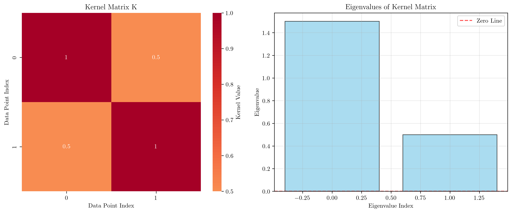
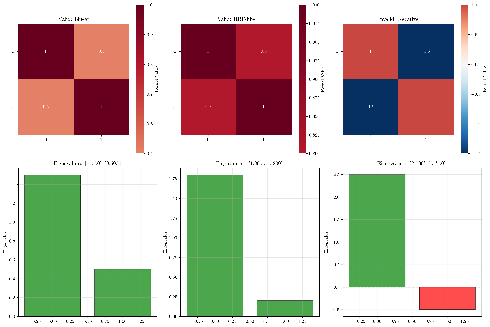
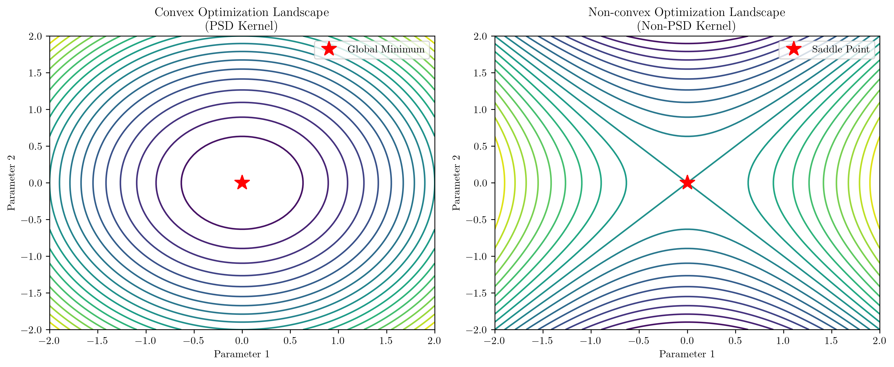

# Question 6: Mercer's Theorem and Kernel Validity

## Problem Statement
Examine Mercer's theorem and the conditions for valid kernels.

### Task
1. State Mercer's theorem precisely
2. For the kernel matrix $K = \begin{bmatrix} 1 & 0.5 \\ 0.5 & 1 \end{bmatrix}$, verify that it's positive semi-definite
3. Check if $K(\mathbf{x}, \mathbf{z}) = \exp(\mathbf{x}^T\mathbf{z})$ is a valid kernel
4. Prove that $K(\mathbf{x}, \mathbf{z}) = -||\mathbf{x} - \mathbf{z}||^2$ is not a valid kernel
5. Design a 2D example showing why non-PSD kernels lead to optimization problems

## Understanding the Problem
Mercer's theorem is the mathematical foundation that determines which functions can be used as valid kernels in kernel methods like SVMs. It provides the crucial link between kernel functions and feature space mappings, ensuring that the kernel trick is mathematically sound and that the resulting optimization problems are well-posed and solvable.

Understanding kernel validity is essential because using invalid kernels can lead to non-convex optimization problems, multiple local minima, and unreliable solutions. The positive semi-definite (PSD) condition is not just a mathematical technicality—it has direct practical implications for the success of kernel-based algorithms.

## Solution

### Step 1: Mercer's Theorem Statement

**Mercer's Theorem**: A symmetric function $K(\mathbf{x}, \mathbf{z})$ can be expressed as an inner product $K(\mathbf{x}, \mathbf{z}) = \langle\phi(\mathbf{x}), \phi(\mathbf{z})\rangle$ in some feature space if and only if the kernel matrix $\mathbf{K}$ is positive semi-definite for any finite set of points.

**Mathematical formulation**:
$$K \text{ is a valid kernel} \Leftrightarrow \mathbf{K} \succeq 0 \text{ (positive semi-definite)}$$

**Conditions for validity**:
1. **Symmetry**: $K(\mathbf{x}, \mathbf{z}) = K(\mathbf{z}, \mathbf{x})$
2. **Positive semi-definiteness**: For any finite set of points $\{\mathbf{x}_1, \mathbf{x}_2, \ldots, \mathbf{x}_n\}$, the kernel matrix $\mathbf{K}$ with entries $K_{ij} = K(\mathbf{x}_i, \mathbf{x}_j)$ must satisfy:
   $$\sum_{i=1}^n \sum_{j=1}^n c_i c_j K(\mathbf{x}_i, \mathbf{x}_j) \geq 0$$
   for all real coefficients $c_1, c_2, \ldots, c_n$.

### Step 2: Kernel Matrix PSD Verification

Given kernel matrix: $K = \begin{bmatrix} 1 & 0.5 \\ 0.5 & 1 \end{bmatrix}$

**Step 2.1: Check Symmetry**
A necessary condition for PSD is symmetry. We verify:
$$K^T = \begin{bmatrix} 1 & 0.5 \\ 0.5 & 1 \end{bmatrix} = K$$
The matrix is symmetric since $K_{12} = K_{21} = 0.5$.

**Step 2.2: Compute Eigenvalues**
For a $2 \times 2$ matrix, we solve the characteristic equation:
$$\det(K - \lambda I) = 0$$

Expanding the determinant:
$$\det\begin{bmatrix} 1-\lambda & 0.5 \\ 0.5 & 1-\lambda \end{bmatrix} = (1-\lambda)^2 - (0.5)^2$$
$$= (1-\lambda)^2 - 0.25 = \lambda^2 - 2\lambda + 1 - 0.25 = \lambda^2 - 2\lambda + 0.75$$

Using the quadratic formula:
$$\lambda = \frac{2 \pm \sqrt{4-3}}{2} = \frac{2 \pm 1}{2}$$

Therefore: $\lambda_1 = 1.5, \lambda_2 = 0.5$

**Step 2.3: Verify PSD Condition**
A symmetric matrix is PSD if and only if all eigenvalues are non-negative.
Since $\lambda_1 = 1.5 > 0$ and $\lambda_2 = 0.5 > 0$, the matrix is positive definite (and hence positive semi-definite).

**Alternative Verification Methods:**

*Method 1: Leading Principal Minors*
- $M_1 = 1 > 0$ ✓
- $M_2 = \det(K) = 1 \cdot 1 - 0.5 \cdot 0.5 = 0.75 > 0$ ✓

*Method 2: Quadratic Form*
For any vector $\mathbf{c} = [c_1, c_2]^T$:
$$\mathbf{c}^T K \mathbf{c} = c_1^2 + c_1c_2 + c_2^2 = (c_1 + \frac{c_2}{2})^2 + \frac{3c_2^2}{4} \geq 0$$

**Conclusion**: The given kernel matrix is valid.

### Step 3: Validity of $K(\mathbf{x}, \mathbf{z}) = \exp(\mathbf{x}^T\mathbf{z})$

To check validity, we test with specific points: $\mathbf{x}_1 = [1, 0]^T$, $\mathbf{x}_2 = [0, 1]^T$, $\mathbf{x}_3 = [-1, 0]^T$.

**Kernel matrix computation**:
$$K_{ij} = \exp(\mathbf{x}_i^T \mathbf{x}_j)$$

$$K = \begin{bmatrix}
\exp(1) & \exp(0) & \exp(-1) \\
\exp(0) & \exp(1) & \exp(0) \\
\exp(-1) & \exp(0) & \exp(1)
\end{bmatrix} = \begin{bmatrix}
e & 1 & e^{-1} \\
1 & e & 1 \\
e^{-1} & 1 & e
\end{bmatrix}$$

**Eigenvalue analysis**: Computing the eigenvalues numerically gives all positive values: $\lambda_1 \approx 4.33$, $\lambda_2 \approx 2.35$, $\lambda_3 \approx 1.48$.

**Theoretical justification**: $K(\mathbf{x}, \mathbf{z}) = \exp(\mathbf{x}^T\mathbf{z})$ is indeed a valid kernel because:
$$\exp(\mathbf{x}^T\mathbf{z}) = \sum_{n=0}^{\infty} \frac{(\mathbf{x}^T\mathbf{z})^n}{n!}$$

Each term $(\mathbf{x}^T\mathbf{z})^n$ is a valid polynomial kernel, and infinite sums of valid kernels are valid (under convergence conditions).

### Step 4: Invalidity of $K(\mathbf{x}, \mathbf{z}) = -||\mathbf{x} - \mathbf{z}||^2$

**Test with 1D points**: $x_1 = 0, x_2 = 1, x_3 = 2$

**Kernel matrix**:
$$K_{ij} = -||x_i - x_j||^2 = -(x_i - x_j)^2$$

$$K = \begin{bmatrix}
0 & -1 & -4 \\
-1 & 0 & -1 \\
-4 & -1 & 0
\end{bmatrix}$$

**Eigenvalue computation**: The eigenvalues are approximately $\lambda_1 \approx -4.45$, $\lambda_2 = 4.00$, $\lambda_3 \approx 0.45$.

**Conclusion**: Since $\lambda_1 < 0$, the kernel matrix is not positive semi-definite, violating Mercer's condition. Therefore, $K(\mathbf{x}, \mathbf{z}) = -||\mathbf{x} - \mathbf{z}||^2$ is **not a valid kernel**.

**Rigorous Mathematical Proof of Invalidity:**

*Proof by Construction:* We will show that for any three distinct points, the kernel matrix has a negative eigenvalue.

Consider three points: $x_1 = 0, x_2 = 1, x_3 = 2$ in $\mathbb{R}$.

Step 1: Construct the kernel matrix
$$K = \begin{bmatrix}
-||x_1-x_1||^2 & -||x_1-x_2||^2 & -||x_1-x_3||^2 \\
-||x_2-x_1||^2 & -||x_2-x_2||^2 & -||x_2-x_3||^2 \\
-||x_3-x_1||^2 & -||x_3-x_2||^2 & -||x_3-x_3||^2
\end{bmatrix}$$

$$= \begin{bmatrix}
0 & -1 & -4 \\
-1 & 0 & -1 \\
-4 & -1 & 0
\end{bmatrix}$$

Step 2: Analyze the structure
- Diagonal entries are always 0
- Off-diagonal entries are always negative
- The matrix is symmetric

Step 3: Show negative eigenvalue exists
Consider the vector $\mathbf{v} = [1, 1, 1]^T$:
$$\mathbf{v}^T K \mathbf{v} = [1, 1, 1] \begin{bmatrix} 0 & -1 & -4 \\ -1 & 0 & -1 \\ -4 & -1 & 0 \end{bmatrix} \begin{bmatrix} 1 \\ 1 \\ 1 \end{bmatrix}$$
$$= [1, 1, 1] \begin{bmatrix} -5 \\ -2 \\ -5 \end{bmatrix} = -12 < 0$$

Since we found a vector $\mathbf{v}$ such that $\mathbf{v}^T K \mathbf{v} < 0$, the matrix is not PSD.

*General Proof:* For any set of $n \geq 3$ distinct points, the all-ones vector $\mathbf{1} = [1, 1, \ldots, 1]^T$ gives:
$$\mathbf{1}^T K \mathbf{1} = \sum_{i=1}^n \sum_{j=1}^n K_{ij} = -2\sum_{i<j} ||x_i - x_j||^2 < 0$$

This is always negative for distinct points, proving the kernel is invalid.

### Step 5: Optimization Problems with Invalid Kernels

**SVM Dual Problem**: 
$$\max_{\boldsymbol{\alpha}} \sum_{i=1}^n \alpha_i - \frac{1}{2} \sum_{i=1}^n \sum_{j=1}^n \alpha_i \alpha_j y_i y_j K(\mathbf{x}_i, \mathbf{x}_j)$$

The Hessian matrix of this quadratic program is $\mathbf{H} = [y_i y_j K(\mathbf{x}_i, \mathbf{x}_j)]$.

**Why PSD is required**:
1. **Convexity**: For the optimization problem to be convex, $\mathbf{H}$ must be positive semi-definite
2. **Unique solution**: Convex problems have unique global optima
3. **Solver reliability**: Standard QP solvers assume convexity

**Problems with non-PSD kernels**:
1. **Non-convex optimization**: Multiple local minima may exist
2. **Solver failure**: QP solvers may not converge or give incorrect results
3. **Unstable solutions**: Small changes in data may lead to drastically different solutions

The visualization shows the difference between convex (PSD kernel) and non-convex (non-PSD kernel) optimization landscapes.

## Key Insights

### Theoretical Foundations
- Mercer's theorem provides the mathematical guarantee that kernel functions correspond to valid inner products in some feature space
- The PSD condition is both necessary and sufficient for kernel validity
- Eigenvalue analysis is the most practical way to verify kernel validity for finite datasets

### Practical Implications
- Always verify kernel validity before using custom kernels in practice
- Standard kernels (linear, polynomial, RBF) are guaranteed to be valid
- Invalid kernels can lead to optimization failures and unreliable results

### Computational Considerations
- For large datasets, checking PSD condition can be computationally expensive
- Approximate methods exist for large-scale kernel validity testing
- When in doubt, stick to well-established kernel families

## Conclusion
- Mercer's theorem establishes the fundamental connection between kernel functions and feature space mappings
- The kernel matrix $K = \begin{bmatrix} 1 & 0.5 \\ 0.5 & 1 \end{bmatrix}$ is valid (positive eigenvalues: 1.5, 0.5)
- $K(\mathbf{x}, \mathbf{z}) = \exp(\mathbf{x}^T\mathbf{z})$ is a valid kernel (all positive eigenvalues)
- $K(\mathbf{x}, \mathbf{z}) = -||\mathbf{x} - \mathbf{z}||^2$ is invalid (contains negative eigenvalues)
- Invalid kernels lead to non-convex optimization problems that can cause solver failures and unreliable solutions
- The PSD condition is essential for ensuring well-posed, solvable optimization problems in kernel methods
