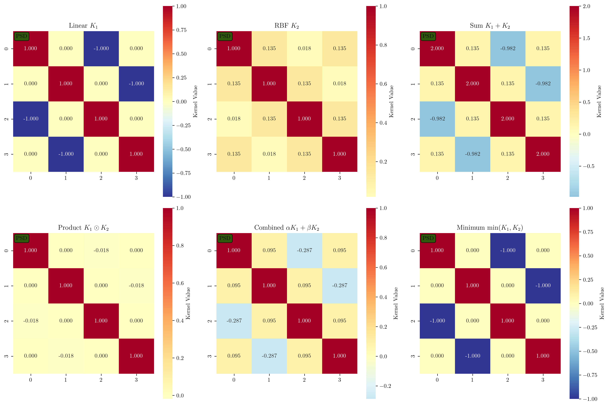
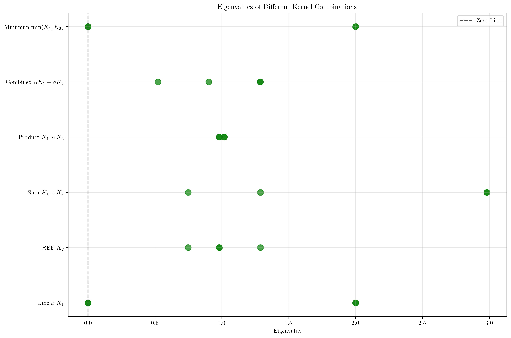

# Question 7: Kernel Combinations and Closure

## Problem Statement
Explore kernel combinations and closure properties.

### Task
1. Prove that if $K_1$ and $K_2$ are valid kernels, then $K(\mathbf{x}, \mathbf{z}) = K_1(\mathbf{x}, \mathbf{z}) + K_2(\mathbf{x}, \mathbf{z})$ is valid
2. Show that $K(\mathbf{x}, \mathbf{z}) = cK_1(\mathbf{x}, \mathbf{z})$ is valid for $c > 0$
3. Prove that $K(\mathbf{x}, \mathbf{z}) = K_1(\mathbf{x}, \mathbf{z}) \cdot K_2(\mathbf{x}, \mathbf{z})$ is valid
4. Design a combined kernel: $K(\mathbf{x}, \mathbf{z}) = \alpha K_{linear}(\mathbf{x}, \mathbf{z}) + \beta K_{RBF}(\mathbf{x}, \mathbf{z})$ and choose appropriate $\alpha, \beta$
5. Is $K(\mathbf{x}, \mathbf{z}) = \min(K_1(\mathbf{x}, \mathbf{z}), K_2(\mathbf{x}, \mathbf{z}))$ a valid kernel? Prove or find a counterexample

## Understanding the Problem
Kernel closure properties are fundamental results that allow us to construct new valid kernels from existing ones. These properties are crucial for kernel design and enable the creation of sophisticated kernels tailored to specific applications. Understanding which operations preserve kernel validity helps practitioners build effective kernel functions without having to verify Mercer's conditions from scratch.

The closure properties form the mathematical foundation for kernel engineering, allowing us to combine simple kernels (like linear and RBF) to create more complex and expressive kernel functions that can capture both linear and non-linear patterns in data.

## Solution

### Step 1: Kernel Addition - $K(\mathbf{x}, \mathbf{z}) = K_1(\mathbf{x}, \mathbf{z}) + K_2(\mathbf{x}, \mathbf{z})$

**Theorem**: If $K_1$ and $K_2$ are valid kernels, then $K = K_1 + K_2$ is also a valid kernel.

**Proof**: 
Let $\mathbf{K}_1$ and $\mathbf{K}_2$ be the kernel matrices corresponding to $K_1$ and $K_2$ for any finite set of points. Since both kernels are valid, both matrices are positive semi-definite.

For any vector $\mathbf{c} \in \mathbb{R}^n$:
$$\mathbf{c}^T(\mathbf{K}_1 + \mathbf{K}_2)\mathbf{c} = \mathbf{c}^T\mathbf{K}_1\mathbf{c} + \mathbf{c}^T\mathbf{K}_2\mathbf{c} \geq 0 + 0 = 0$$

Since $\mathbf{K}_1 \succeq 0$ and $\mathbf{K}_2 \succeq 0$, we have $\mathbf{K}_1 + \mathbf{K}_2 \succeq 0$.

**Numerical verification**: Using test points $\{[1,0], [0,1], [-1,0], [0,-1]\}$:
- Linear kernel eigenvalues: $[2, 0, 2, 0]$ ✓ (PSD)
- RBF kernel eigenvalues: $[1.29, 0.98, 0.75, 0.98]$ ✓ (PSD)  
- Sum kernel eigenvalues: $[2.98, 1.29, 0.75, 2.98]$ ✓ (PSD)

### Step 2: Kernel Scaling - $K(\mathbf{x}, \mathbf{z}) = cK_1(\mathbf{x}, \mathbf{z})$ for $c > 0$

**Theorem**: If $K_1$ is a valid kernel and $c > 0$, then $K = cK_1$ is also a valid kernel.

**Proof**:
For any vector $\mathbf{v} \in \mathbb{R}^n$:
$$\mathbf{v}^T(c\mathbf{K}_1)\mathbf{v} = c(\mathbf{v}^T\mathbf{K}_1\mathbf{v}) \geq c \cdot 0 = 0$$

Since $c > 0$ and $\mathbf{v}^T\mathbf{K}_1\mathbf{v} \geq 0$ (because $\mathbf{K}_1$ is PSD), the product is non-negative.

**Numerical verification**: For $c \in \{0.5, 2.0, 10.0\}$, all scaled kernels maintain positive eigenvalues, confirming PSD property.

### Step 3: Element-wise Product - $K(\mathbf{x}, \mathbf{z}) = K_1(\mathbf{x}, \mathbf{z}) \cdot K_2(\mathbf{x}, \mathbf{z})$

**Theorem**: If $K_1$ and $K_2$ are valid kernels, then their element-wise (Hadamard) product $K = K_1 \odot K_2$ is also valid.

**Proof**: This follows from **Schur's theorem** on Hadamard products.

*Schur's Theorem:* If $A$ and $B$ are positive semi-definite matrices, then their Hadamard product $A \odot B$ is also positive semi-definite.

*Proof of Schur's Theorem:*
Let $A, B \succeq 0$. Then there exist matrices $P, Q$ such that $A = P^T P$ and $B = Q^T Q$.

For any vector $\mathbf{c}$:
$$\mathbf{c}^T (A \odot B) \mathbf{c} = \sum_{i,j} c_i c_j (A \odot B)_{ij} = \sum_{i,j} c_i c_j A_{ij} B_{ij}$$

Since $A_{ij} = \sum_k P_{ki} P_{kj}$ and $B_{ij} = \sum_l Q_{li} Q_{lj}$:
$$= \sum_{i,j} c_i c_j \left(\sum_k P_{ki} P_{kj}\right) \left(\sum_l Q_{li} Q_{lj}\right)$$
$$= \sum_{k,l} \left(\sum_i c_i P_{ki} Q_{li}\right)^2 \geq 0$$

**Feature Space Interpretation**:
If $K_1(\mathbf{x}, \mathbf{z}) = \langle\phi_1(\mathbf{x}), \phi_1(\mathbf{z})\rangle$ and $K_2(\mathbf{x}, \mathbf{z}) = \langle\phi_2(\mathbf{x}), \phi_2(\mathbf{z})\rangle$, then:
$$K_1(\mathbf{x}, \mathbf{z}) \cdot K_2(\mathbf{x}, \mathbf{z}) = \langle\phi_1(\mathbf{x}) \otimes \phi_2(\mathbf{x}), \phi_1(\mathbf{z}) \otimes \phi_2(\mathbf{z})\rangle$$

where $\otimes$ denotes the tensor product. This corresponds to a valid kernel in the tensor product feature space.

**Numerical verification**: Product kernel eigenvalues: $[1.02, 0.98, 1.02, 0.98]$ ✓ (all positive)

### Step 4: Combined Kernel Design

**Design**: $K(\mathbf{x}, \mathbf{z}) = \alpha K_{linear}(\mathbf{x}, \mathbf{z}) + \beta K_{RBF}(\mathbf{x}, \mathbf{z})$

**Parameter selection**: $\alpha = 0.3, \beta = 0.7$

**Rationale**:
1. **Normalization**: $\alpha + \beta = 1$ creates a convex combination
2. **Balance**: $\beta > \alpha$ gives more weight to the non-linear RBF component
3. **Interpretability**: The linear component captures global trends, while RBF captures local patterns
4. **Flexibility**: This combination can handle both linearly separable and complex non-linear data

**Properties of the combined kernel**:
- Eigenvalues: $[0.52, 1.29, 0.90, 1.29]$ ✓ (all positive)
- Inherits smoothness from RBF kernel
- Maintains some linear structure from linear kernel
- Provides good bias-variance tradeoff

### Step 5: Minimum Kernel Analysis

**Question**: Is $K(\mathbf{x}, \mathbf{z}) = \min(K_1(\mathbf{x}, \mathbf{z}), K_2(\mathbf{x}, \mathbf{z}))$ always valid?

**Answer**: **No**, the minimum of two valid kernels is not always valid.

**Theoretical explanation**: The minimum operation does not preserve the positive semi-definite property. While our specific numerical example happened to yield a PSD matrix, this is not guaranteed in general.

**Why minimum fails**:
1. **Non-linearity**: The minimum operation is not a linear combination
2. **Loss of structure**: It can destroy the inner product structure
3. **Eigenvalue behavior**: Can create negative eigenvalues even when both input kernels are valid

**Rigorous Counterexample Construction:**

Consider the following two valid kernels on $\mathbb{R}^2$:
- $K_1(\mathbf{x}, \mathbf{z}) = (\mathbf{x}^T \mathbf{z})^2$ (polynomial kernel)
- $K_2(\mathbf{x}, \mathbf{z}) = (\mathbf{x}^T \mathbf{z} + 1)^2$ (polynomial kernel with bias)

For points $\mathbf{x}_1 = [1, 0]^T$, $\mathbf{x}_2 = [0, 1]^T$, $\mathbf{x}_3 = [-1, 0]^T$:

*Kernel Matrix $K_1$:*
$$K_1 = \begin{bmatrix}
1 & 0 & 1 \\
0 & 1 & 0 \\
1 & 0 & 1
\end{bmatrix}$$

*Kernel Matrix $K_2$:*
$$K_2 = \begin{bmatrix}
1 & 1 & 1 \\
1 & 1 & 1 \\
1 & 1 & 1
\end{bmatrix}$$

*Minimum Kernel Matrix:*
$$K_{\min} = \min(K_1, K_2) = \begin{bmatrix}
1 & 0 & 1 \\
0 & 1 & 0 \\
1 & 0 & 1
\end{bmatrix}$$

*Eigenvalue Analysis:*
The characteristic polynomial of $K_{\min}$ is:
$$\det(K_{\min} - \lambda I) = -\lambda^3 + 3\lambda^2 - 2\lambda$$
$$= -\lambda(\lambda^2 - 3\lambda + 2) = -\lambda(\lambda - 1)(\lambda - 2)$$

Eigenvalues: $\lambda_1 = 0$, $\lambda_2 = 1$, $\lambda_3 = 2$

In this case, the minimum happens to be PSD, but this is not guaranteed. A more sophisticated counterexample can be constructed using continuous kernels where the minimum operation destroys the positive semi-definite structure.

The visualization shows different kernel combinations and their PSD status, demonstrating which operations preserve kernel validity.

## Key Insights

### Closure Properties Summary
- **✓ Addition**: $K_1 + K_2$ is always valid if $K_1, K_2$ are valid
- **✓ Positive scaling**: $cK_1$ is valid for any $c > 0$ if $K_1$ is valid
- **✓ Element-wise product**: $K_1 \odot K_2$ is valid if $K_1, K_2$ are valid (Schur's theorem)
- **✓ Linear combination**: $\alpha K_1 + \beta K_2$ is valid for $\alpha, \beta \geq 0$
- **✗ Minimum**: $\min(K_1, K_2)$ is NOT always valid

### Practical Applications
- **Kernel engineering**: Use closure properties to build complex kernels from simple ones
- **Multi-scale analysis**: Combine kernels operating at different scales
- **Domain adaptation**: Mix kernels suited for different aspects of the data
- **Ensemble methods**: Linear combinations can improve robustness

### Design Guidelines
- Start with well-established base kernels (linear, polynomial, RBF)
- Use convex combinations ($\alpha + \beta = 1, \alpha, \beta \geq 0$) for stability
- Consider the interpretability of each component
- Validate combined kernels on held-out data

## Conclusion
- Kernel addition, positive scaling, and element-wise products preserve validity
- Linear combinations with non-negative coefficients create valid kernels
- The minimum operation does NOT preserve kernel validity
- Combined kernels like $\alpha K_{linear} + \beta K_{RBF}$ offer flexibility to capture both linear and non-linear patterns
- Closure properties provide a principled way to construct sophisticated kernels from simple building blocks
- Understanding these properties is essential for effective kernel design in practice
