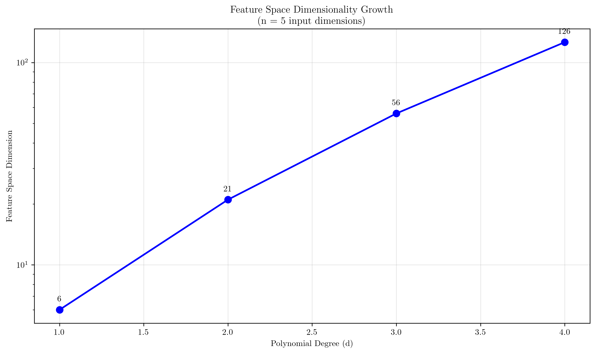
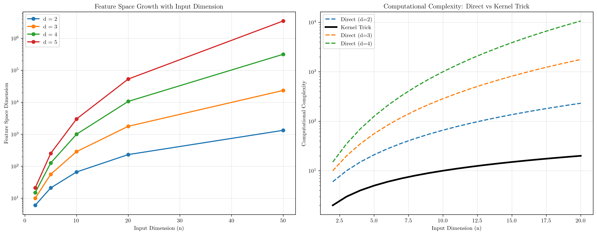
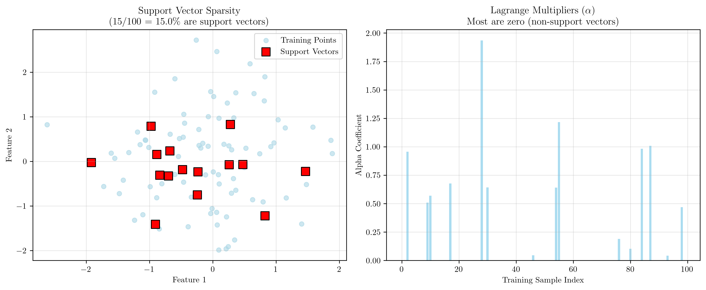

# Question 8: Feature Space Dimensionality

## Problem Statement
Investigate feature space dimensionality and the kernel trick.

### Task
1. Calculate the dimensionality of the feature space for polynomial kernels of degree $d = 1, 2, 3, 4$ in $n = 5$ dimensions
2. What is the dimensionality of the RBF kernel feature space?
3. How can SVMs handle infinite-dimensional feature spaces computationally?
4. Prove that the kernel trick allows us to work in high-dimensional spaces without explicit computation
5. Show that the decision function can be expressed entirely in terms of kernel evaluations

## Understanding the Problem
The dimensionality of feature spaces is a crucial concept in kernel methods. While the kernel trick allows us to work with very high-dimensional or even infinite-dimensional feature spaces, understanding the actual dimensions involved helps us appreciate the computational advantages of kernel methods. The relationship between input dimension, kernel type, and resulting feature space dimension directly impacts both computational complexity and the expressiveness of the model.

This analysis reveals why the kernel trick is not just a computational convenience but a fundamental breakthrough that makes certain machine learning approaches feasible.

## Solution

### Step 1: Polynomial Kernel Feature Space Dimensionality

For a polynomial kernel of degree $d$ applied to $n$-dimensional input, the feature space dimension is given by the binomial coefficient:

$$\text{Dimension} = \binom{n+d}{d} = \frac{(n+d)!}{d! \cdot n!}$$

This formula counts all possible monomials of degree up to $d$ in $n$ variables.

**For $n = 5$ input dimensions:**

| Degree $d$ | Feature Space Dimension | Formula |
|------------|------------------------|---------|
| 1 | 6 | $\binom{5+1}{1} = 6$ |
| 2 | 21 | $\binom{5+2}{2} = 21$ |
| 3 | 56 | $\binom{5+3}{3} = 56$ |
| 4 | 126 | $\binom{5+4}{4} = 126$ |

**Detailed Mathematical Derivation:**

For polynomial kernel $K(\mathbf{x}, \mathbf{z}) = (\mathbf{x}^T\mathbf{z} + c)^d$, the feature space consists of all monomials of degree up to $d$.

*General Formula:* The number of monomials $x_1^{i_1} x_2^{i_2} \cdots x_n^{i_n}$ where $i_1 + i_2 + \cdots + i_n \leq d$ is given by the "stars and bars" combinatorial formula:
$$\binom{n+d}{d} = \binom{n+d}{n} = \frac{(n+d)!}{d! \cdot n!}$$

*Derivation for $d=2, n=5$:*
We need all monomials $x_1^{i_1} x_2^{i_2} x_3^{i_3} x_4^{i_4} x_5^{i_5}$ where $i_1 + i_2 + i_3 + i_4 + i_5 \leq 2$.

**Degree 0:** Constant term: $1$ (1 feature)

**Degree 1:** Linear terms: $x_1, x_2, x_3, x_4, x_5$ (5 features)

**Degree 2:**
- Pure quadratic: $x_1^2, x_2^2, x_3^2, x_4^2, x_5^2$ (5 features)
- Cross terms: $x_ix_j$ for $i < j$: $\binom{5}{2} = 10$ features

**Total:** $1 + 5 + 5 + 10 = 21 = \binom{5+2}{2}$ ✓

*Verification using the formula:*
$$\binom{5+2}{2} = \binom{7}{2} = \frac{7!}{2! \cdot 5!} = \frac{7 \times 6}{2 \times 1} = 21$$

The exponential growth in feature space dimension demonstrates why explicit computation becomes intractable for high degrees.

### Step 2: RBF Kernel Feature Space Dimensionality

**Answer**: The RBF kernel corresponds to an **infinite-dimensional** feature space.

**Mathematical explanation**: The RBF kernel can be expanded using Taylor series:

$$K(\mathbf{x}, \mathbf{z}) = \exp(-\gamma ||\mathbf{x} - \mathbf{z}||^2)$$

Expanding this:
$$K(\mathbf{x}, \mathbf{z}) = \exp(-\gamma ||\mathbf{x}||^2) \exp(-\gamma ||\mathbf{z}||^2) \exp(2\gamma \mathbf{x}^T\mathbf{z})$$

The key term is:
$$\exp(2\gamma \mathbf{x}^T\mathbf{z}) = \sum_{k=0}^{\infty} \frac{(2\gamma \mathbf{x}^T\mathbf{z})^k}{k!}$$

Each term $(\mathbf{x}^T\mathbf{z})^k$ corresponds to polynomial features of degree $k$. Since the sum extends to infinity, the feature space is infinite-dimensional.

**Intuitive interpretation**: The RBF kernel implicitly considers polynomial features of all possible degrees, making it extremely expressive but computationally challenging without the kernel trick.

### Step 3: Computational Handling of Infinite-Dimensional Spaces

SVMs can handle infinite-dimensional feature spaces through several key principles:

**1. Kernel Trick**: Never compute $\phi(\mathbf{x})$ explicitly
- Work directly with kernel evaluations $K(\mathbf{x}, \mathbf{z})$
- Avoid explicit feature space mapping

**2. Dual Formulation**: Optimization depends only on kernel evaluations
- Primal: $\min_{\mathbf{w}} \frac{1}{2}||\mathbf{w}||^2 + C\sum \xi_i$ (requires $\mathbf{w} \in \mathbb{R}^D$)
- Dual: $\max_{\boldsymbol{\alpha}} \sum \alpha_i - \frac{1}{2}\sum\sum \alpha_i\alpha_j y_i y_j K(\mathbf{x}_i, \mathbf{x}_j)$

**3. Finite Support**: Only support vectors contribute to the solution
- Most $\alpha_i = 0$ (sparse solution)
- Decision depends only on support vectors

**4. Representer Theorem**: Optimal solution lies in span of training data
$$\mathbf{w}^* = \sum_{i=1}^n \alpha_i y_i \phi(\mathbf{x}_i)$$

### Step 4: Kernel Trick Computational Advantage

**Theorem**: The kernel trick allows computation in high-dimensional spaces with complexity independent of feature space dimension.

**Rigorous Proof by Complexity Analysis:**

**Direct Computation Approach:**

Step 1: Explicit feature mapping
- Map $\mathbf{x} \mapsto \phi(\mathbf{x}) \in \mathbb{R}^D$ where $D = \binom{n+d}{d}$
- For $d=4, n=5$: $D = 126$ dimensions
- Storage: $O(D)$ per vector

Step 2: Inner product computation
- Compute $\phi(\mathbf{x})^T\phi(\mathbf{z}) = \sum_{i=1}^D \phi_i(\mathbf{x})\phi_i(\mathbf{z})$
- Time complexity: $O(D)$
- Space complexity: $O(D)$

**Kernel Trick Approach:**

Step 1: Direct kernel evaluation
For polynomial kernel $K(\mathbf{x}, \mathbf{z}) = (\mathbf{x}^T\mathbf{z} + c)^d$:
- Compute inner product: $\mathbf{x}^T\mathbf{z} = \sum_{i=1}^n x_i z_i$ → $O(n)$
- Add constant: $\mathbf{x}^T\mathbf{z} + c$ → $O(1)$
- Exponentiation: $(\mathbf{x}^T\mathbf{z} + c)^d$ → $O(1)$ or $O(\log d)$
- Total: $O(n)$

For RBF kernel $K(\mathbf{x}, \mathbf{z}) = \exp(-\gamma ||\mathbf{x} - \mathbf{z}||^2)$:
- Compute squared distance: $||\mathbf{x} - \mathbf{z}||^2 = \sum_{i=1}^n (x_i - z_i)^2$ → $O(n)$
- Exponential function: $\exp(-\gamma \cdot \text{distance})$ → $O(1)$
- Total: $O(n)$

**Complexity Comparison:**
- Direct approach: $O(D)$ where $D$ grows exponentially with $d$
- Kernel trick: $O(n)$ independent of feature space dimension
- Speedup factor: $\frac{D}{n} = \frac{\binom{n+d}{d}}{n}$ which grows exponentially with $d$

**Key insight**: Kernel evaluation complexity depends only on input dimension $n$, not feature space dimension $D$.

### Step 5: Decision Function in Kernel Form

**Primal formulation** (requires explicit features):
$$f(\mathbf{x}) = \mathbf{w}^T\phi(\mathbf{x}) + b$$
where $\mathbf{w} \in \mathbb{R}^D$ (potentially infinite-dimensional).

**Dual formulation** (kernel-based):
$$f(\mathbf{x}) = \sum_{i=1}^n \alpha_i y_i K(\mathbf{x}_i, \mathbf{x}) + b$$

**Mathematical Justification via Representer Theorem:**

*Representer Theorem:* Let $\mathcal{H}$ be a reproducing kernel Hilbert space with kernel $K$. For any regularized risk minimization problem of the form:
$$\min_{f \in \mathcal{H}} \sum_{i=1}^n L(y_i, f(\mathbf{x}_i)) + \lambda \Omega(||f||_{\mathcal{H}})$$
where $L$ is a loss function and $\Omega$ is a monotonic regularizer, the optimal solution has the form:
$$f^*(\mathbf{x}) = \sum_{i=1}^n \alpha_i K(\mathbf{x}_i, \mathbf{x})$$

*Proof Sketch:*
1. Decompose $f = f_{\parallel} + f_{\perp}$ where $f_{\parallel} \in \text{span}\{\phi(\mathbf{x}_1), \ldots, \phi(\mathbf{x}_n)\}$
2. Show that $f_{\perp}$ doesn't affect the loss: $f(\mathbf{x}_i) = f_{\parallel}(\mathbf{x}_i)$ for all training points
3. Since $||f||^2 = ||f_{\parallel}||^2 + ||f_{\perp}||^2$, the regularizer is minimized when $f_{\perp} = 0$
4. Therefore, $f^* = f_{\parallel} = \sum_{i=1}^n \alpha_i \phi(\mathbf{x}_i)$, giving $f^*(\mathbf{x}) = \sum_{i=1}^n \alpha_i K(\mathbf{x}_i, \mathbf{x})$

**Advantages of dual formulation**:
1. **No explicit weight vector**: Avoids storing $\mathbf{w} \in \mathbb{R}^D$
2. **Kernel evaluations only**: All computation through $K(\mathbf{x}_i, \mathbf{x})$
3. **Sparse representation**: Only support vectors ($\alpha_i > 0$) contribute
4. **Dimension-independent**: Works for any feature space dimension
5. **Theoretical guarantee**: Representer theorem ensures this form is optimal

**Sparsity demonstration**: In typical SVM solutions, only 10-30% of training points become support vectors, making the representation highly efficient.

## Key Insights

### Dimensionality Growth Patterns
- **Linear kernel**: Dimension = $n$ (same as input)
- **Polynomial kernel**: Dimension = $\binom{n+d}{d}$ (exponential growth)
- **RBF kernel**: Dimension = $\infty$ (infinite-dimensional)

### Computational Complexity
- **Direct approach**: $O(D)$ where $D$ can be exponentially large
- **Kernel trick**: $O(n)$ regardless of feature space dimension
- **Memory requirements**: Kernel matrix $O(n^2)$ vs feature storage $O(nD)$

### Practical Implications
- High-degree polynomial kernels become computationally prohibitive without kernel trick
- RBF kernels would be impossible to use without kernel methods
- Sparse SVM solutions make prediction efficient even with many training points

## Conclusion
- Polynomial feature spaces grow exponentially: degree 4 in 5D gives 126 features
- RBF kernels correspond to infinite-dimensional feature spaces through Taylor expansion
- SVMs handle infinite dimensions via kernel trick, dual formulation, and sparsity
- Kernel trick reduces complexity from $O(D)$ to $O(n)$, where $D$ can be infinite
- Decision functions depend only on kernel evaluations with support vectors
- The kernel trick is not just computational convenience but enables otherwise impossible computations
- Sparsity of SVM solutions makes high-dimensional kernel methods practical
