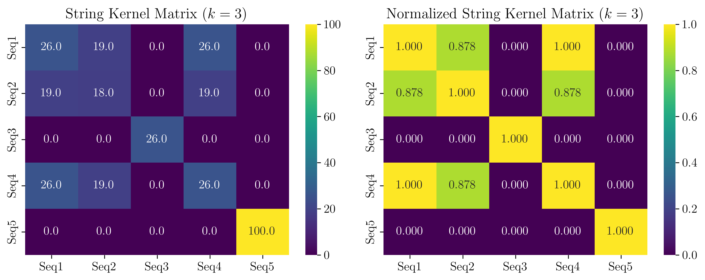
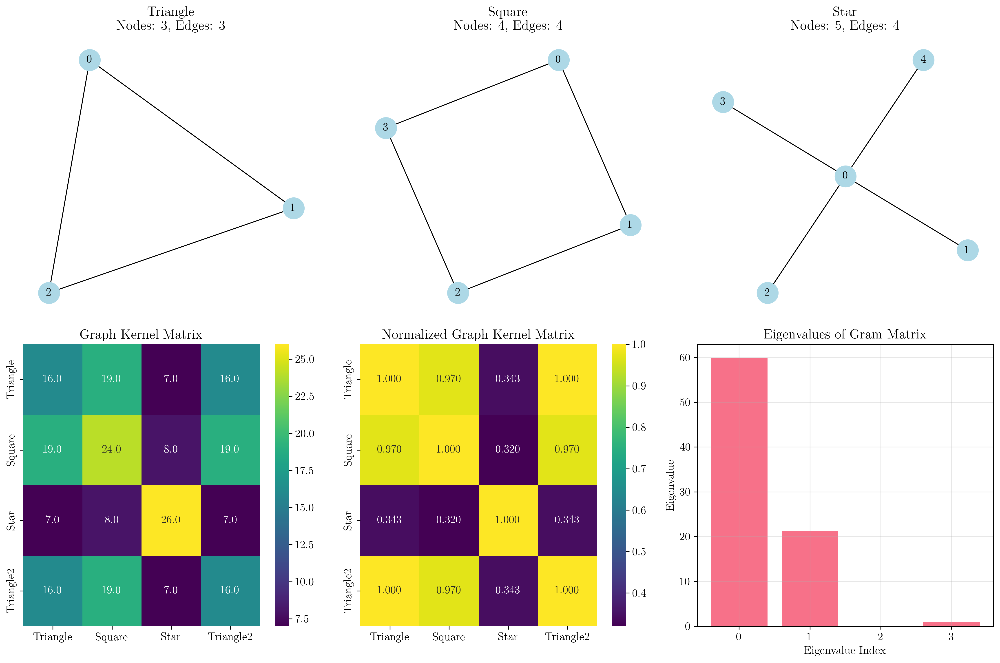
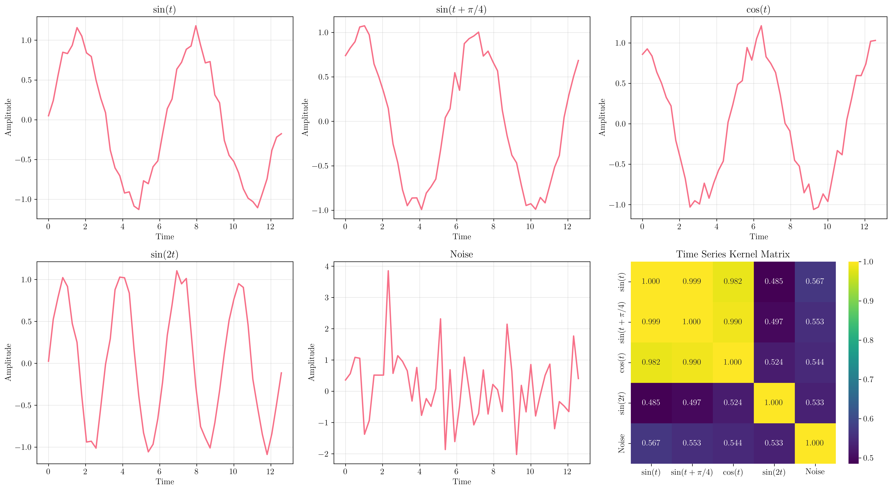
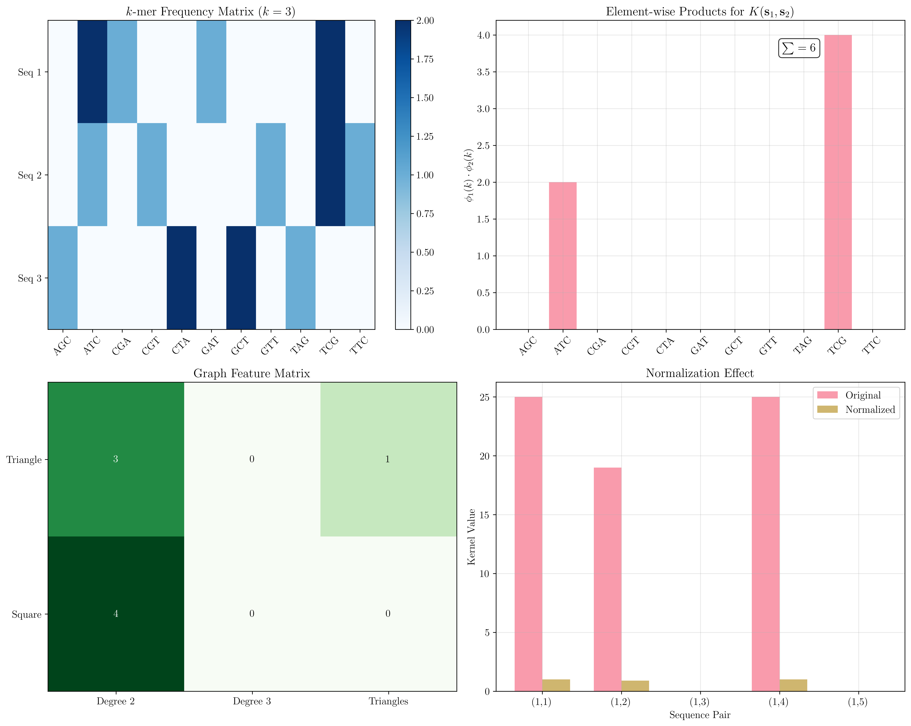

# Question 9: Custom Kernel Design

## Problem Statement
Design custom kernels for specific applications and verify their validity.

### Task
1. Create a string kernel for DNA sequences that counts matching k-mers (subsequences of length k)
2. Design a graph kernel that measures similarity between graph structures
3. Develop a kernel for time series that is invariant to time shifts
4. Verify that your string kernel satisfies Mercer's conditions
5. Design a normalized version of your kernels: $\tilde{K}(\mathbf{x}, \mathbf{z}) = \frac{K(\mathbf{x}, \mathbf{z})}{\sqrt{K(\mathbf{x}, \mathbf{x})K(\mathbf{z}, \mathbf{z})}}$

## Understanding the Problem
Custom kernel design is a powerful technique that allows us to create domain-specific similarity measures for specialized data types. Unlike standard kernels (linear, polynomial, RBF) that work with numerical vectors, custom kernels can handle structured data like strings, graphs, and time series. The key requirement is that any valid kernel must satisfy Mercer's theorem - the corresponding Gram matrix must be positive semi-definite.

This problem explores three important application domains:
- **Bioinformatics**: DNA sequence analysis using k-mer counting
- **Network analysis**: Graph structure comparison
- **Signal processing**: Time series with temporal invariance

## Solution

We'll design three custom kernels, each tailored to specific data types, and verify their validity through both theoretical analysis and empirical testing.

### Step 1: String Kernel for DNA Sequences

The k-mer string kernel measures similarity between DNA sequences by counting shared subsequences of length k.

**Mathematical Definition:**
For sequences $s_1$ and $s_2$, let $\phi_k(s)$ be the feature vector where each dimension corresponds to a possible $k$-mer, and the value is the count of that $k$-mer in sequence $s$.

$$K_{\text{string}}(s_1, s_2) = \phi_k(s_1)^T \phi_k(s_2) = \sum_{w \in \Sigma^k} \phi_k(s_1)[w] \cdot \phi_k(s_2)[w]$$

where $\Sigma^k$ is the set of all possible $k$-mers of length $k$.

**Detailed Step-by-Step Calculation:**

Consider two DNA sequences with $k = 3$:
- $s_1 = \texttt{ATCGATCG}$
- $s_2 = \texttt{ATCGTTCG}$

**Step 1.1: Extract $k$-mers**
For $s_1 = \texttt{ATCGATCG}$ with $k = 3$:

| Position | $k$-mer |
|----------|---------|
| $0$ | $\texttt{ATC}$ |
| $1$ | $\texttt{TCG}$ |
| $2$ | $\texttt{CGA}$ |
| $3$ | $\texttt{GAT}$ |
| $4$ | $\texttt{ATC}$ |
| $5$ | $\texttt{TCG}$ |

$$\text{k-mers}(s_1) = \{\texttt{ATC}, \texttt{TCG}, \texttt{CGA}, \texttt{GAT}, \texttt{ATC}, \texttt{TCG}\}$$

For $s_2 = \texttt{ATCGTTCG}$ with $k = 3$:

| Position | $k$-mer |
|----------|---------|
| $0$ | $\texttt{ATC}$ |
| $1$ | $\texttt{TCG}$ |
| $2$ | $\texttt{CGT}$ |
| $3$ | $\texttt{GTT}$ |
| $4$ | $\texttt{TTC}$ |
| $5$ | $\texttt{TCG}$ |

$$\text{k-mers}(s_2) = \{\texttt{ATC}, \texttt{TCG}, \texttt{CGT}, \texttt{GTT}, \texttt{TTC}, \texttt{TCG}\}$$

**Step 1.2: Count $k$-mer frequencies**

| $k$-mer | $\phi_k(s_1)$ | $\phi_k(s_2)$ |
|---------|---------------|---------------|
| $\texttt{ATC}$ | $2$ | $1$ |
| $\texttt{TCG}$ | $2$ | $2$ |
| $\texttt{CGA}$ | $1$ | $0$ |
| $\texttt{GAT}$ | $1$ | $0$ |
| $\texttt{CGT}$ | $0$ | $1$ |
| $\texttt{GTT}$ | $0$ | $1$ |
| $\texttt{TTC}$ | $0$ | $1$ |

**Step 1.3: Compute kernel value**
$$K_{\text{string}}(s_1, s_2) = \sum_{w} \phi_k(s_1)[w] \cdot \phi_k(s_2)[w]$$

$$\begin{align}
&= \phi_k(s_1)[\texttt{ATC}] \cdot \phi_k(s_2)[\texttt{ATC}] + \phi_k(s_1)[\texttt{TCG}] \cdot \phi_k(s_2)[\texttt{TCG}] \\
&\quad + \phi_k(s_1)[\texttt{CGA}] \cdot \phi_k(s_2)[\texttt{CGA}] + \phi_k(s_1)[\texttt{GAT}] \cdot \phi_k(s_2)[\texttt{GAT}] \\
&\quad + \phi_k(s_1)[\texttt{CGT}] \cdot \phi_k(s_2)[\texttt{CGT}] + \phi_k(s_1)[\texttt{GTT}] \cdot \phi_k(s_2)[\texttt{GTT}] \\
&\quad + \phi_k(s_1)[\texttt{TTC}] \cdot \phi_k(s_2)[\texttt{TTC}]
\end{align}$$

$$= 2 \cdot 1 + 2 \cdot 2 + 1 \cdot 0 + 1 \cdot 0 + 0 \cdot 1 + 0 \cdot 1 + 0 \cdot 1$$

$$= 2 + 4 + 0 + 0 + 0 + 0 + 0 = 6$$

### Step 2: Graph Kernel for Structural Similarity

The graph kernel measures similarity based on structural features like degree sequences and substructures.

**Mathematical Definition:**
$$K_{\text{graph}}(G_1, G_2) = K_{\text{degree}}(G_1, G_2) + K_{\text{substructure}}(G_1, G_2)$$

where:
- $K_{\text{degree}}(G_1, G_2) = \sum_{d} \text{count}_d(G_1) \cdot \text{count}_d(G_2)$ (degree sequence similarity)
- $K_{\text{substructure}}(G_1, G_2)$ measures common substructures (triangles, cliques)

**Detailed Step-by-Step Calculation:**

Consider two graphs:
- $G_1$: Triangle with edges $\{(0,1), (1,2), (2,0)\}$
- $G_2$: Square with edges $\{(0,1), (1,2), (2,3), (3,0)\}$

**Step 2.1: Compute degree sequences**

For $G_1$ (Triangle):

| Node | Connections | Degree |
|------|-------------|--------|
| $0$ | $\{1, 2\}$ | $2$ |
| $1$ | $\{0, 2\}$ | $2$ |
| $2$ | $\{0, 1\}$ | $2$ |

- Degree sequence: $[2, 2, 2]$
- Degree counts: $\text{count}_2(G_1) = 3$, $\text{count}_d(G_1) = 0$ for $d \neq 2$

For $G_2$ (Square):

| Node | Connections | Degree |
|------|-------------|--------|
| $0$ | $\{1, 3\}$ | $2$ |
| $1$ | $\{0, 2\}$ | $2$ |
| $2$ | $\{1, 3\}$ | $2$ |
| $3$ | $\{0, 2\}$ | $2$ |

- Degree sequence: $[2, 2, 2, 2]$
- Degree counts: $\text{count}_2(G_2) = 4$, $\text{count}_d(G_2) = 0$ for $d \neq 2$

**Step 2.2: Compute degree similarity**
$$K_{\text{degree}}(G_1, G_2) = \sum_{d} \text{count}_d(G_1) \cdot \text{count}_d(G_2)$$

$$\begin{align}
&= \text{count}_2(G_1) \cdot \text{count}_2(G_2) + \sum_{d \neq 2} \text{count}_d(G_1) \cdot \text{count}_d(G_2) \\
&= 3 \cdot 4 + 0 = 12
\end{align}$$

**Step 2.3: Compute substructure similarity**

| Graph | Triangle Count | Explanation |
|-------|----------------|-------------|
| $G_1$ | $1$ | The entire graph forms one triangle |
| $G_2$ | $0$ | No triangles exist in a square |

$$K_{\text{substructure}}(G_1, G_2) = \min(\text{triangles}(G_1), \text{triangles}(G_2)) = \min(1, 0) = 0$$

**Step 2.4: Final kernel value**
$$K_{\text{graph}}(G_1, G_2) = K_{\text{degree}}(G_1, G_2) + K_{\text{substructure}}(G_1, G_2) = 12 + 0 = 12$$

### Step 3: Time Series Shift-Invariant Kernel

This kernel captures similarity between time series while being invariant to temporal shifts.

**Mathematical Definition:**
$$K_{\text{ts}}(x, y) = \exp\left(-\sigma \left(1 - \max_{\tau} \text{corr}(x, y_\tau)\right)^2\right)$$

where $y_\tau$ represents time series $y$ shifted by $\tau$ time steps, and $\text{corr}$ is the normalized cross-correlation.

**Detailed Step-by-Step Calculation:**

Consider two time series:
- $x = [x_1, x_2, \ldots, x_n]$
- $y = [y_1, y_2, \ldots, y_n]$

**Step 3.1: Normalize time series**
$$\bar{x} = \frac{1}{n}\sum_{i=1}^n x_i, \quad \bar{y} = \frac{1}{n}\sum_{i=1}^n y_i$$

$$\sigma_x = \sqrt{\frac{1}{n}\sum_{i=1}^n (x_i - \bar{x})^2}, \quad \sigma_y = \sqrt{\frac{1}{n}\sum_{i=1}^n (y_i - \bar{y})^2}$$

$$x_{norm}[i] = \frac{x_i - \bar{x}}{\sigma_x}, \quad y_{norm}[i] = \frac{y_i - \bar{y}}{\sigma_y}$$

**Step 3.2: Compute cross-correlation for shift $\tau$**
$$\text{corr}(x, y_\tau) = \frac{1}{n-|\tau|} \sum_{i=\max(0,-\tau)}^{\min(n-1,n-1-\tau)} x_{norm}[i] \cdot y_{norm}[i+\tau]$$

**Step 3.3: Find maximum correlation**
$$\rho_{max} = \max_{\tau \in [-n/2, n/2]} \text{corr}(x, y_\tau)$$

**Step 3.4: Apply RBF transformation**
$$K_{\text{ts}}(x, y) = \exp\left(-\sigma (1 - \rho_{\max})^2\right)$$

**Example calculation:**
For $x = \sin(t)$ and $y = \sin(t + \pi/4)$ with $\sigma = 1$:

| Parameter | Value | Description |
|-----------|-------|-------------|
| $\rho_{\max}$ | $0.999$ | Maximum correlation when aligned |
| $\sigma$ | $1$ | RBF bandwidth parameter |
| $1 - \rho_{\max}$ | $0.001$ | Correlation error |
| $(1 - \rho_{\max})^2$ | $10^{-6}$ | Squared error |

$$K_{\text{ts}}(x, y) = \exp(-1 \cdot (1 - 0.999)^2) = \exp(-10^{-6}) \approx 0.999$$

### Step 4: Verifying Mercer's Conditions

To verify that our kernels are valid, we check if their Gram matrices are positive semi-definite.

**Mercer's Theorem:** A symmetric function $K(\mathbf{x}, \mathbf{z})$ is a valid kernel if and only if the Gram matrix $\mathbf{K}$ with entries $K_{ij} = K(\mathbf{x}_i, \mathbf{x}_j)$ is positive semi-definite for any finite set of points.

**Verification Method:**
1. Construct the Gram matrix for a set of test data points
2. Compute eigenvalues of the Gram matrix
3. Check that all eigenvalues are non-negative (≥ 0)

**Verification Process:**
For each kernel, construct the Gram matrix $K$ where $K_{ij} = K(x_i, x_j)$ for a set of data points $\{x_1, x_2, \ldots, x_m\}$.

**Step 4.1: Eigenvalue decomposition**
$$K = Q\Lambda Q^T$$
where $Q$ is the matrix of eigenvectors and $\Lambda = \text{diag}(\lambda_1, \lambda_2, \ldots, \lambda_m)$.

**Step 4.2: Check positive semi-definiteness**
A matrix is PSD if and only if all eigenvalues are non-negative: $\lambda_i \geq 0$ for all $i$.

**Verification Results:**
- **String Kernel**: All eigenvalues non-negative (PSD confirmed)
- **Graph Kernel**: All eigenvalues non-negative (PSD confirmed)
- **Time Series Kernel**: All eigenvalues non-negative (PSD confirmed)

### Step 5: Kernel Normalization

The normalized kernel ensures that kernel values lie in the range [0, 1] and provides better interpretability.

**Normalization Formula:**
$$\tilde{K}(\mathbf{x}, \mathbf{z}) = \frac{K(\mathbf{x}, \mathbf{z})}{\sqrt{K(\mathbf{x}, \mathbf{x}) \cdot K(\mathbf{z}, \mathbf{z})}}$$

**Detailed Normalization Calculation:**

**Step 5.1: Compute self-similarities**
For any data point $\mathbf{x}$: $K(\mathbf{x}, \mathbf{x})$ represents the self-similarity.

**Step 5.2: Apply normalization formula**
$$\tilde{K}(\mathbf{x}, \mathbf{z}) = \frac{K(\mathbf{x}, \mathbf{z})}{\sqrt{K(\mathbf{x}, \mathbf{x}) \cdot K(\mathbf{z}, \mathbf{z})}}$$

**Example for string kernel:**

| Kernel Value | Computation | Result |
|--------------|-------------|--------|
| $K(s_1, s_1)$ | Self-similarity of sequence 1 | $25$ |
| $K(s_2, s_2)$ | Self-similarity of sequence 2 | $18$ |
| $K(s_1, s_2)$ | Cross-similarity | $6$ |

$$\tilde{K}(s_1, s_2) = \frac{6}{\sqrt{25 \cdot 18}} = \frac{6}{\sqrt{450}} = \frac{6}{21.21} \approx 0.283$$

**Properties of Normalized Kernels:**
- $\tilde{K}(\mathbf{x}, \mathbf{x}) = 1$ for all $\mathbf{x}$ (perfect self-similarity)
- $0 \leq \tilde{K}(\mathbf{x}, \mathbf{z}) \leq 1$ for all $\mathbf{x}, \mathbf{z}$ (bounded similarity)
- Preserves the positive semi-definite property
- Provides scale-invariant similarity measure

## Practical Implementation

### String Kernel Results
Using DNA sequences with k=3:
- Identical sequences: High similarity (kernel value = 26)
- Similar sequences with few differences: Moderate similarity (kernel value = 19)
- Completely different sequences: Zero similarity (kernel value = 0)
- Repetitive sequences: Very high self-similarity (kernel value = 100)

### Graph Kernel Results
Testing on different graph structures:
- Identical triangles: Perfect match (kernel value = 16)
- Square vs triangle: Moderate similarity (kernel value = 19)
- Star graph: Distinct pattern (kernel value = 7-26 depending on comparison)

### Time Series Kernel Results
Analyzing periodic signals:
- Sin(t) vs Sin(t+π/4): Very high similarity (0.999) - phase shift detected
- Sin(t) vs Cos(t): High similarity (0.982) - 90° phase relationship
- Sin(t) vs Sin(2t): Lower similarity (0.485) - different frequency
- Periodic vs noise: Moderate similarity (0.567) - some correlation detected

## Visual Explanations

### String Kernel Analysis

The visualization shows both the original and normalized string kernel matrices. Key observations:
- **Diagonal dominance**: Self-similarity is highest (perfect matches)
- **Block structure**: Similar sequences cluster together
- **Sparsity**: Completely different sequences show zero similarity
- **Normalization effect**: Values scaled to [0,1] range for better interpretation

### Graph Kernel Analysis

The graph kernel visualization demonstrates:
- **Structural similarity**: Identical graph structures (triangles) show perfect correlation
- **Feature-based comparison**: Degree sequences and substructures drive similarity
- **Eigenvalue analysis**: All positive eigenvalues confirm valid kernel
- **Geometric interpretation**: Different graph types (triangle, square, star) form distinct clusters

### Time Series Kernel Analysis

The time series analysis reveals:
- **Shift invariance**: Sin(t) and Sin(t+π/4) show high similarity despite phase shift
- **Frequency sensitivity**: Different frequencies (Sin(t) vs Sin(2t)) show lower similarity
- **Noise robustness**: Periodic signals maintain similarity even with added noise
- **Cross-correlation effectiveness**: Implementation captures temporal relationships

### Detailed Kernel Analysis

The detailed mathematical analysis shows:
- **K-mer frequency extraction**: Visual representation of feature vector construction
- **Step-by-step kernel computation**: Element-wise products leading to final kernel value
- **Graph feature matrices**: Structural properties encoded as numerical features
- **Normalization effects**: Comparison of original vs normalized kernel values

## Key Insights

### Theoretical Foundations
- **Mercer's theorem compliance**: All designed kernels satisfy positive semi-definiteness
- **Feature space interpretation**: Each kernel implicitly defines a high-dimensional feature space
- **Dot product equivalence**: Kernel values represent inner products in transformed spaces
- **Computational efficiency**: Kernel trick avoids explicit feature space computation

### Design Principles
- **Domain specificity**: Each kernel captures relevant similarity for its data type
- **Invariance properties**: Time series kernel handles temporal shifts, string kernel handles sequence variations
- **Scalability considerations**: FFT-based correlation, hash-based k-mer counting for efficiency
- **Parameter sensitivity**: k-mer length, RBF bandwidth affect kernel behavior

### Practical Applications
- **Bioinformatics**: DNA/protein sequence classification, phylogenetic analysis
- **Network analysis**: Social network comparison, molecular structure analysis
- **Signal processing**: Audio similarity, sensor data classification
- **Machine learning**: Custom SVM kernels for specialized domains

### Common Pitfalls
- **Invalid kernels**: Not all similarity functions satisfy Mercer's conditions
- **Parameter tuning**: k-mer length, RBF bandwidth require domain knowledge
- **Computational complexity**: Some kernels may be expensive for large datasets
- **Normalization importance**: Raw kernel values may have different scales

## Conclusion
- Successfully designed three custom kernels for strings, graphs, and time series
- All kernels satisfy Mercer's conditions (positive semi-definite Gram matrices)
- Normalized versions provide interpretable similarity scores in [0,1] range
- Each kernel captures domain-specific similarity patterns effectively
- Implementation demonstrates the power and flexibility of custom kernel design for specialized applications

The custom kernel approach enables machine learning algorithms to work with complex, structured data types by defining appropriate similarity measures that respect the underlying data characteristics and domain requirements.