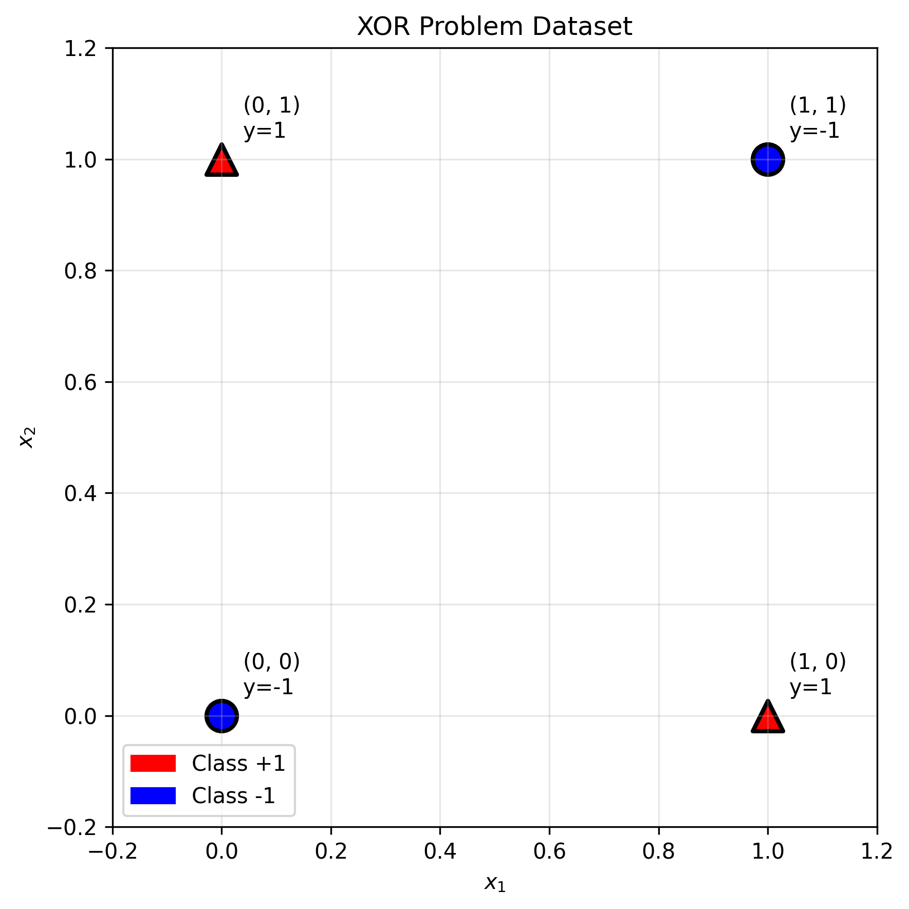

# Lecture 5.3: Kernel Trick for Nonlinear Classification Quiz

## Overview
This quiz contains 39 questions covering different topics from section 5.3 of the lectures on Kernel Trick, Feature Space Transformation, Common Kernels, RBF Kernels, Polynomial Kernels, Mercer's Theorem, and Kernel Selection.

## Question 1

### Problem Statement
Consider the classic XOR problem with four points:
- $(0, 0) \rightarrow y = -1$
- $(0, 1) \rightarrow y = +1$
- $(1, 0) \rightarrow y = +1$
- $(1, 1) \rightarrow y = -1$

#### Task
1. Prove that this dataset is not linearly separable in $\mathbb{R}^2$
2. Apply the feature transformation $\phi(x_1, x_2) = (x_1, x_2, x_1x_2)$ and show the transformed points
3. Find a linear hyperplane in the 3D feature space that separates the transformed data
4. Express the decision boundary in the original 2D space
5. Calculate the kernel function $K(\mathbf{x}, \mathbf{z}) = \phi(\mathbf{x})^T\phi(\mathbf{z})$ for this transformation
6. Design a puzzle game with four squares in a 2×2 grid. Valid patterns have exactly one colored square (positions $(0,1)$ or $(1,0)$), while invalid patterns have no squares colored $(0,0)$ or all squares colored $(1,1)$. Design a 3D thinking tool to help players visualize patterns and create a rule for determining if patterns are solvable using 3D separation.

For a detailed explanation of this problem, see [Question 1: XOR Problem and Feature Transformation](L5_3_1_explanation.md).

## Question 2

### Problem Statement
Analyze the computational complexity of explicit feature mapping versus the kernel trick.

#### Task
1. For a polynomial kernel of degree $d$ applied to $n$-dimensional input, derive the number of features in the explicit mapping
2. Calculate this for $n = 10, d = 3$ and $n = 100, d = 2$
3. What is the computational cost of computing $\phi(\mathbf{x})^T\phi(\mathbf{z})$ explicitly versus using $K(\mathbf{x}, \mathbf{z}) = (\mathbf{x}^T\mathbf{z} + 1)^d$?
4. For what values of $n$ and $d$ does the kernel trick provide significant savings?
5. Analyze the memory requirements for storing the feature vectors versus kernel evaluations

For a detailed explanation of this problem, see [Question 2: Computational Complexity Analysis](L5_3_2_explanation.md).

## Question 3

### Problem Statement
Work with specific kernel calculations for the polynomial kernel $K(\mathbf{x}, \mathbf{z}) = (\mathbf{x}^T\mathbf{z} + c)^d$.

Given vectors $\mathbf{x} = (2, -1, 3)$ and $\mathbf{z} = (1, 2, -1)$.

#### Task
1. Calculate $K(\mathbf{x}, \mathbf{z})$ for $c = 1, d = 2$
2. Calculate $K(\mathbf{x}, \mathbf{z})$ for $c = 0, d = 3$
3. Find the explicit feature mapping $\phi(\mathbf{x})$ for the case $c = 0, d = 2$ in 3D
4. Verify that $K(\mathbf{x}, \mathbf{z}) = \phi(\mathbf{x})^T\phi(\mathbf{z})$ for your calculated mapping
5. How does the parameter $c$ affect the relative importance of different order terms?

For a detailed explanation of this problem, see [Question 3: Polynomial Kernel Calculations](L5_3_3_explanation.md).

## Question 4

### Problem Statement
Analyze the RBF (Gaussian) kernel: $K(\mathbf{x}, \mathbf{z}) = \exp(-\gamma ||\mathbf{x} - \mathbf{z}||^2)$.

#### Task
1. Calculate $K(\mathbf{x}, \mathbf{z})$ for $\mathbf{x} = (1, 0)$, $\mathbf{z} = (0, 1)$ with $\gamma = 0.5, 1, 2$
2. Show that $K(\mathbf{x}, \mathbf{x}) = 1$ for any $\mathbf{x}$
3. Prove that $0 \leq K(\mathbf{x}, \mathbf{z}) \leq 1$ for any $\mathbf{x}, \mathbf{z}$
4. Derive the behavior of $K(\mathbf{x}, \mathbf{z})$ as $||\mathbf{x} - \mathbf{z}|| \rightarrow \infty$
5. Show that the RBF kernel corresponds to an infinite-dimensional feature space
6. Design a recommendation system using user genre preferences. User A: Action=8, Romance=2; User B: Action=2, Romance=8; User C: Action=5, Romance=5. Using similarity function $K(\mathbf{x}, \mathbf{z}) = \exp(-\gamma ||\mathbf{x} - \mathbf{z}||^2)$, calculate similarity scores for $\gamma = 0.5, 1, 2$ and design a recommendation confidence system. Determine the optimal $\gamma$ for 70% similarity threshold.

For a detailed explanation of this problem, see [Question 4: RBF Kernel Properties](L5_3_4_explanation.md).

## Question 5

### Problem Statement
Study the effect of the RBF kernel parameter $\gamma$ on decision boundaries.

#### Task
1. For a 1D dataset with points $x_1 = -1, x_2 = 1$ (different classes), sketch the decision boundary for $\gamma = 0.1, 1, 10$ (you can draw this by hand)
2. Predict how $\gamma$ affects overfitting and underfitting
3. Derive the limit behavior as $\gamma \rightarrow 0$ and $\gamma \rightarrow \infty$
4. Design a synthetic 2D dataset where small $\gamma$ performs better than large $\gamma$
5. Calculate the effective "width" of influence for each data point as a function of $\gamma$

For a detailed explanation of this problem, see [Question 5: RBF Parameter Effects](L5_3_5_explanation.md).

## Question 6

### Problem Statement
Examine Mercer's theorem and the conditions for valid kernels.

#### Task
1. State Mercer's theorem precisely
2. For the kernel matrix $K = \begin{bmatrix} 1 & 0.5 \\ 0.5 & 1 \end{bmatrix}$, verify that it's positive semi-definite
3. Check if $K(\mathbf{x}, \mathbf{z}) = \exp(\mathbf{x}^T\mathbf{z})$ is a valid kernel
4. Prove that $K(\mathbf{x}, \mathbf{z}) = -||\mathbf{x} - \mathbf{z}||^2$ is not a valid kernel
5. Design a 2D example showing why non-PSD kernels lead to optimization problems

For a detailed explanation of this problem, see [Question 6: Mercer's Theorem and Kernel Validity](L5_3_6_explanation.md).

## Question 7

### Problem Statement
Explore kernel combinations and closure properties.

#### Task
1. Prove that if $K_1$ and $K_2$ are valid kernels, then $K(\mathbf{x}, \mathbf{z}) = K_1(\mathbf{x}, \mathbf{z}) + K_2(\mathbf{x}, \mathbf{z})$ is valid
2. Show that $K(\mathbf{x}, \mathbf{z}) = cK_1(\mathbf{x}, \mathbf{z})$ is valid for $c > 0$
3. Prove that $K(\mathbf{x}, \mathbf{z}) = K_1(\mathbf{x}, \mathbf{z}) \cdot K_2(\mathbf{x}, \mathbf{z})$ is valid
4. Design a combined kernel: $K(\mathbf{x}, \mathbf{z}) = \alpha K_{linear}(\mathbf{x}, \mathbf{z}) + \beta K_{RBF}(\mathbf{x}, \mathbf{z})$ and choose appropriate $\alpha, \beta$
5. Is $K(\mathbf{x}, \mathbf{z}) = \min(K_1(\mathbf{x}, \mathbf{z}), K_2(\mathbf{x}, \mathbf{z}))$ a valid kernel? Prove or find a counterexample

For a detailed explanation of this problem, see [Question 7: Kernel Combinations and Closure](L5_3_7_explanation.md).

## Question 8

### Problem Statement
Investigate feature space dimensionality and the kernel trick.

#### Task
1. Calculate the dimensionality of the feature space for polynomial kernels of degree $d = 1, 2, 3, 4$ in $n = 5$ dimensions
2. What is the dimensionality of the RBF kernel feature space?
3. How can SVMs handle infinite-dimensional feature spaces computationally?
4. Prove that the kernel trick allows us to work in high-dimensional spaces without explicit computation
5. Show that the decision function can be expressed entirely in terms of kernel evaluations

For a detailed explanation of this problem, see [Question 8: Feature Space Dimensionality](L5_3_8_explanation.md).

## Question 9

### Problem Statement
Design custom kernels for specific applications.

#### Task
1. Create a string kernel for DNA sequences that counts matching k-mers (subsequences of length k)
2. Design a graph kernel that measures similarity between graph structures
3. Develop a kernel for time series that is invariant to time shifts
4. Verify that your string kernel satisfies Mercer's conditions
5. Design a normalized version of your kernels: $\tilde{K}(\mathbf{x}, \mathbf{z}) = \frac{K(\mathbf{x}, \mathbf{z})}{\sqrt{K(\mathbf{x}, \mathbf{x})K(\mathbf{z}, \mathbf{z})}}$

For a detailed explanation of this problem, see [Question 9: Custom Kernel Design](L5_3_9_explanation.md).

## Question 10

### Problem Statement
Develop a systematic kernel selection methodology.

#### Task
1. List the factors to consider when choosing between linear, polynomial, and RBF kernels
2. Design a decision tree for kernel selection based on dataset characteristics
3. How would you use cross-validation to compare different kernel families?
4. What is kernel alignment and how can it guide kernel selection?
5. Create a practical algorithm for automated kernel selection

For a detailed explanation of this problem, see [Question 10: Kernel Selection Methodology](L5_3_10_explanation.md).

## Question 11

### Problem Statement
Analyze the computational and storage complexity of different kernels.

#### Task
1. Compare the evaluation time for linear, polynomial (degree 3), and RBF kernels
2. Calculate the space complexity of storing the kernel matrix for $n = 10^3, 10^4, 10^5$ samples
3. Design strategies for reducing kernel matrix storage requirements
4. What is the trade-off between kernel complexity and classification accuracy?
5. How does the choice of kernel affect training vs prediction time?

For a detailed explanation of this problem, see [Question 11: Computational Analysis](L5_3_11_explanation.md).

## Question 12

### Problem Statement
Implement kernel approximation techniques for large-scale problems.

#### Task
1. Describe the Nyström method for low-rank kernel matrix approximation
2. For a rank-$r$ approximation of an $n \times n$ kernel matrix, what are the computational savings?
3. Design random Fourier features for RBF kernel approximation
4. How does the approximation quality affect SVM performance?
5. Design an adaptive algorithm that chooses the approximation rank based on desired accuracy

For a detailed explanation of this problem, see [Question 12: Kernel Approximation](L5_3_12_explanation.md).

## Question 13

### Problem Statement
Study kernel parameter optimization using grid search and cross-validation.

#### Task
1. For an RBF kernel, design a grid search over $C \in [10^{-3}, 10^3]$ and $\gamma \in [10^{-4}, 10^1]$
2. Design nested cross-validation for unbiased parameter selection
3. How many hyperparameter combinations should you test for reliable results?
4. Design an early stopping criterion for expensive parameter searches
5. Compare grid search vs random search vs Bayesian optimization for kernel parameter tuning

For a detailed explanation of this problem, see [Question 13: Parameter Optimization](L5_3_13_explanation.md).

## Question 14

### Problem Statement
Investigate kernel learning and adaptive kernels.

#### Task
1. Formulate the problem of learning kernel parameters jointly with SVM training
2. Design a gradient descent algorithm for optimizing RBF kernel parameters
3. How would you learn the optimal weights for a combination of multiple kernels?
4. What are the risks of overfitting when learning kernel parameters?
5. Design cross-validation specifically for kernel parameter selection

For a detailed explanation of this problem, see [Question 14: Kernel Learning](L5_3_14_explanation.md).

## Question 15

### Problem Statement
Apply kernels to real-world scenarios and analyze performance.

#### Task
1. For text classification, compare linear vs polynomial vs RBF kernels
2. For image recognition, design appropriate kernels for different feature representations
3. How would you handle mixed data types (continuous + categorical) with kernels?
4. Design experiments to measure the effect of kernel choice on generalization
5. What preprocessing steps are essential for different kernel types?

For a detailed explanation of this problem, see [Question 15: Real-world Applications](L5_3_15_explanation.md).

## Question 16

### Problem Statement
Theoretical analysis of kernel methods and SVM generalization.

#### Task
1. Derive the VC dimension bound for kernel SVMs
2. How does the choice of kernel affect the complexity of the hypothesis space?
3. Prove that the margin-based generalization bound applies to kernel SVMs
4. What is the relationship between kernel complexity and overfitting?
5. Design a theoretical framework for comparing the generalization ability of different kernels

For a detailed explanation of this problem, see [Question 16: Theoretical Analysis](L5_3_16_explanation.md).

## Question 17

### Problem Statement
Given points $\mathbf{x}_1 = (1, 2)$, $\mathbf{x}_2 = (0, 1)$, $\mathbf{x}_3 = (2, 0)$, compute kernel matrices for different kernels.

#### Task
1. Compute the $3 \times 3$ Gram matrix $K_{ij} = \mathbf{x}_i^T \mathbf{x}_j$
2. Compute $K_{ij} = (\mathbf{x}_i^T \mathbf{x}_j + 1)^2$
3. Compute $K_{ij} = \exp(-0.5 ||\mathbf{x}_i - \mathbf{x}_j||^2)$
4. Verify that each matrix is positive semi-definite by checking eigenvalues
5. Determine the effective dimensionality for each kernel

For a detailed explanation of this problem, see [Question 17: Kernel Matrix Computations](L5_3_17_explanation.md).

## Question 18

### Problem Statement
For the polynomial kernel $K(\mathbf{x}, \mathbf{z}) = (\mathbf{x}^T\mathbf{z} + c)^d$, analyze feature space properties.

#### Task
1. For 2D input and $d=2, c=1$, write out the explicit feature mapping $\phi(\mathbf{x})$
2. Calculate the feature space dimension for $n$-dimensional input with degree $d$
3. For $\mathbf{x} = (2, 1)$ and $\mathbf{z} = (1, 3)$ with $d=3, c=0$, compute $K(\mathbf{x}, \mathbf{z})$ two ways:
   - Using kernel trick: $(\mathbf{x}^T\mathbf{z})^3$
   - Using explicit feature mapping
4. Show how $c$ affects the relative importance of interaction terms
5. Compare complexity of kernel vs. explicit computation for $d=5$

For a detailed explanation of this problem, see [Question 18: Polynomial Kernel Analysis](L5_3_18_explanation.md).

## Question 19

### Problem Statement
Analyze the RBF kernel $K(\mathbf{x}, \mathbf{z}) = \exp(-\gamma ||\mathbf{x} - \mathbf{z}||^2)$ for classification.

#### Task
1. For points $(1, 0)$, $(0, 1)$, $(2, 2)$, calculate all pairwise kernel values with $\gamma = 0.5$
2. Sketch kernel value vs. distance for $\gamma = 0.1, 1, 10$ (you can draw this by hand)
3. Predict how the decision boundary complexity changes with $\gamma$
4. Interpret kernel values as similarity scores and rank point pairs
5. For a dataset with average pairwise distance $d_{avg} = 2$, estimate appropriate $\gamma$ range

For a detailed explanation of this problem, see [Question 19: RBF Parameter Analysis](L5_3_19_explanation.md).

## Question 20

### Problem Statement
Determine which functions are valid kernels using Mercer's theorem.

#### Task
1. Check validity of:
   - $K(\mathbf{x}, \mathbf{z}) = (\mathbf{x}^T\mathbf{z})^2 + (\mathbf{x}^T\mathbf{z})^3$
   - $K(\mathbf{x}, \mathbf{z}) = \exp(\mathbf{x}^T\mathbf{z})$
   - $K(\mathbf{x}, \mathbf{z}) = \sin(\mathbf{x}^T\mathbf{z})$
2. For 3 points $(0, 0)$, $(1, 0)$, $(0, 1)$, compute Gram matrices and check PSD property
3. Show that $K(\mathbf{x}, \mathbf{z}) = 2K_1(\mathbf{x}, \mathbf{z}) + 3K_2(\mathbf{x}, \mathbf{z})$ is valid if $K_1, K_2$ are valid
4. Provide an example of an invalid kernel and show why it fails
5. Design a valid kernel for comparing sets of different sizes

For a detailed explanation of this problem, see [Question 20: Kernel Validity Testing](L5_3_20_explanation.md).

## Question 21

### Problem Statement
Analyze the geometry of feature spaces induced by different kernels.

#### Task
1. For 2D input, describe the geometry of the feature space
2. For $(\mathbf{x}^T\mathbf{z} + 1)^2$ with 2D input, visualize the 6D feature space structure
3. Explain why RBF kernels correspond to infinite-dimensional feature spaces
4. Show that linear kernels preserve angles but RBF kernels don't
5. Prove that any finite dataset becomes separable in sufficiently high dimensions

For a detailed explanation of this problem, see [Question 21: Feature Space Geometry](L5_3_21_explanation.md).

## Question 22

### Problem Statement
Compare computational costs of different kernel approaches.

#### Task
1. Calculate memory needed for kernel matrices with $n = 1000, 10000, 100000$ samples
2. Compare time complexity for computing:
   - Linear kernel matrix: $O(?)$
   - RBF kernel matrix: $O(?)$
   - Polynomial kernel matrix: $O(?)$
3. How does kernel choice affect SVM training time?
4. For $n_{SV}$ support vectors, compare prediction costs
5. Calculate speedup vs. accuracy loss for rank-$r$ kernel approximation

For a detailed explanation of this problem, see [Question 22: Computational Complexity](L5_3_22_explanation.md).

## [⭐] Question 23

### Problem Statement
Evaluate the following statement: "We would expect the support vectors to remain the same in general as we move from a linear kernel to higher order polynomial kernels."

### Task
1.  Is the statement **True or False**?
2.  Provide a brief justification for your answer, explaining how changing the kernel can alter the support points in the feature space.

For a detailed explanation of this problem, see [Question 23: Kernel Impact on Support Vectors](L5_3_23_explanation.md).

## [⭐] Question 24

### Problem Statement
Evaluate the following statement: "The values of the margins obtained by two different kernels $K_1(\mathbf{x},\mathbf{z})$ and $K_2(\mathbf{x},\mathbf{z})$ on the same training set do not tell us which classifier will perform better on the test set."

### Task
1.  Is the statement **True or False**?
2.  Provide a brief justification. Why can a direct comparison of raw margin values be misleading?

For a detailed explanation of this problem, see [Question 24: Comparing Kernel Margins](L5_3_24_explanation.md).

## [⭐] Question 25

### Problem Statement
Consider an SVM classifier using a second-order polynomial kernel. We compare two different feature mappings for a 1D input $x$:
- **Mapping 1**: $\phi_1(x) = [x, x^2]^T$
- **Mapping 2**: $\phi_2(x) = [2x, 2x^2]^T$

### Task
1. In general, is the geometric margin we would attain using the feature map $\phi_2(x)$ **greater than**, **equal to**, or **smaller than** the margin from using $\phi_1(x)$?
2. Explain your reasoning by describing how scaling the feature vectors affects the optimal weight vector $\|\mathbf{w}\|$ and the geometric margin $\frac{1}{\|\mathbf{w}\|}$.

For a detailed explanation of this problem, see [Question 25: Feature Space Scaling and Margin](L5_3_25_explanation.md).

## Question 26

### Problem Statement
For non-linearly separable data, SVMs can map the input data into a higher-dimensional feature space where it becomes linearly separable. The "kernel trick" is a key innovation that makes this computationally feasible.

#### Task
1.  Explain the main idea behind the kernel trick. Why is it called a "trick"?
2.  The dual formulation of the SVM optimization problem depends on the dot product of data points, $\mathbf{x}_i^T\mathbf{x}_j$. How does the kernel trick leverage this property?
3.  Consider a polynomial kernel $K(\mathbf{x}, \mathbf{z}) = (\mathbf{x}^T\mathbf{z} + 1)^2$. Explain why computing this kernel directly is more efficient than explicitly mapping $\mathbf{x}$ and $\mathbf{z}$ to the higher-dimensional space and then taking their dot product.
4.  What is the primary advantage of using the kernel trick for datasets where the desired feature space is very high-dimensional or even infinite-dimensional?

For a detailed explanation of this problem, see [Question 26: The Essence of the Kernel Trick](L5_3_26_explanation.md).

## Question 27

### Problem Statement
Not every function $K(\mathbf{x}, \mathbf{z})$ can be used as a valid kernel in an SVM. Mercer's theorem provides the condition a function must satisfy to be a valid kernel.

#### Task
1.  What is the core requirement for a function to be a valid kernel? (i.e., what must it correspond to in some feature space?)
2.  State the condition from Mercer's theorem that allows us to check if a function $K(\mathbf{x}, \mathbf{z})$ is a valid kernel.
3.  Why is this condition important? What could go wrong during the SVM optimization if an invalid kernel is used?

For a detailed explanation of this problem, see [Question 27: Understanding Mercer's Theorem](L5_3_27_explanation.md).

## Question 28

### Problem Statement
Answer these basic questions about kernel formulas and concepts.

#### Task
1. What is the formula for the RBF (Gaussian) kernel?
2. What is the formula for the polynomial kernel?
3. In the kernel trick, what does $K(\mathbf{x}, \mathbf{z})$ represent mathematically?
4. What does $\phi(\mathbf{x})$ represent in the context of kernels?
5. Write the kernelized SVM decision function.

For a detailed explanation of this problem, see [Question 28: Kernel Formula Understanding](L5_3_28_explanation.md).

## Question 29

### Problem Statement
For points $\mathbf{x} = (1, 2)$ and $\mathbf{z} = (3, 0)$:

#### Task
1. Calculate the linear kernel: $K(\mathbf{x}, \mathbf{z}) = \mathbf{x}^T\mathbf{z}$
2. Calculate the polynomial kernel with $d=2, c=1$: $K(\mathbf{x}, \mathbf{z}) = (\mathbf{x}^T\mathbf{z} + 1)^2$
3. Calculate $||\mathbf{x} - \mathbf{z}||^2$
4. Calculate the RBF kernel with $\gamma=0.5$: $K(\mathbf{x}, \mathbf{z}) = \exp(-0.5||\mathbf{x} - \mathbf{z}||^2)$
5. Which kernel gives the highest similarity score for these points?
6. For the same points $\mathbf{x} = (1, 2)$ and $\mathbf{z} = (3, 0)$, calculate the polynomial kernel with $d=3, c=0$: $K(\mathbf{x}, \mathbf{z}) = (\mathbf{x}^T\mathbf{z})^3$. Compare this result with your answer from task 2 and explain how the degree parameter affects the kernel value.

For a detailed explanation of this problem, see [Question 29: Basic Kernel Calculations](L5_3_29_explanation.md).

## Question 30

### Problem Statement
Test your understanding of kernel concepts.

#### Task
1. True or False: The RBF kernel can separate any dataset. Explain.
2. True or False: A higher degree polynomial kernel always performs better. Explain.
3. What happens to RBF kernel values as $\gamma \to \infty$?
4. Why can't we use $K(\mathbf{x}, \mathbf{z}) = -||\mathbf{x} - \mathbf{z}||^2$ as a kernel?
5. What is the main advantage of the kernel trick over explicit feature mapping?

For a detailed explanation of this problem, see [Question 30: Kernel Concept Check](L5_3_30_explanation.md).

## Question 31

### Problem Statement
Assume we are using the Gaussian kernel $k(x_i, x_j) = \exp\left(-\frac{1}{2}\|x_i - x_j\|^2\right)$.

#### Task
1. Prove that the Euclidean distance between the mapped points $\phi(x_i)$ and $\phi(x_j)$ in the new feature space is less than 2.
2. Using the same Gaussian kernel, calculate the kernel values for three points: $x_1 = (0, 0)$, $x_2 = (1, 0)$, and $x_3 = (0, 1)$. Then prove that the resulting $3 \times 3$ kernel matrix is positive semi-definite by showing that all its eigenvalues are non-negative.

For a detailed explanation of this problem, see [Question 31: Gaussian Kernel Proof](L5_3_31_explanation.md).

## [⭐] Question 32

### Problem Statement
Given two valid kernels $k_1(x, x')$ and $k_2(x, x')$, and the radial basis kernel function $K(x_i, x_j) = \phi(x_i)^T\phi(x_j) = \exp\left(-\frac{1}{2}\|x_i - x_j\|^2\right)$, consider the following tasks related to kernel properties and their application in support vector machines.

#### Task
1. Show that $k(x, x') = k_1(x, x') + k_2(x, x')$ is a valid kernel.
2. Show that $k(x, x') = k_1(x, x')k_2(x, x')$ is a valid kernel.
3. Show that for any two input points $x_i$ and $x_j$, $\|\phi(x_i) - \phi(x_j)\|^2 \leq 2$.
4. Compute the value of $K(x_i, x_j)$ for $\|x_i - x_j\|_2 \in \{0, 1, 10, 100\}$. What do you observe? Use your observation to answer the next part.
5. Consider a kernel SVM with RBF kernel. The decision function is $f(x; \alpha, b) = \sum_{i \in S} y^i \alpha^i K(x^i, x) + b$ where $S$ is the set of support vectors. Assuming linearly separable training data, prove that for a test point $y_{far}$ far from any training point $x^i$, we have $f(y_{far}; \alpha, b) \approx b$.

For a detailed explanation of this problem, see [Question 32: Comprehensive Kernel Methods](L5_3_32_explanation.md).

## Question 33

### Problem Statement
Consider the decision boundary of a Support Vector Machine (SVM) with a kernel function via implicit feature mapping $\phi(.)$. The decision boundary is given by:

$$w \cdot \phi(x) + b = \sum_{i \in SV} y^i \alpha^i K(x^i, x) + b = f(x; \alpha, b)$$

where $w$ and $b$ are parameters of the decision boundary in the feature space $\phi$ defined by the kernel function $K$, $SV$ is the set of support vectors, and $\alpha^i$ is the dual weight of the $i^{th}$ support vector.

Assume that:
- The kernel used is the Radial Basis Function (RBF) kernel: $K(x_i, x_j) = \exp(-\frac{1}{2} \|x_i - x_j\|^2)$
- The training examples are linearly separable in the feature space $\phi$, and the SVM finds a decision boundary that perfectly separates them

#### Task
1. If we choose a testing example $x_{far}$ that is far away from any training instance $x^i$ (distance here is measured in the original feature space $\mathbb{R}^d$), prove that $f(x_{far}; \alpha, b) \approx b$.
2. For the RBF kernel $K(x_i, x_j) = \exp(-\frac{1}{2} \|x_i - x_j\|^2)$, compute $K(x_i, x_j)$ for the following pairs of points:
   - $x_i = (0, 0)$ and $x_j = (1, 0)$
   - $x_i = (0, 0)$ and $x_j = (2, 0)$
   - $x_i = (0, 0)$ and $x_j = (10, 0)$
   What pattern do you observe as the distance increases?
3. Using your observations from task 2, explain why $f(x_{far}; \alpha, b) \approx b$ for distant test points.
4. Consider a simple 1D example with training points $x^1 = -1$ and $x^2 = 1$ (both with $y^1 = y^2 = 1$). If $\alpha^1 = \alpha^2 = 0.5$ and $b = 0$, compute $f(5; \alpha, b)$ and $f(10; \alpha, b)$. Verify that both values are approximately equal to $b$.
5. What happens to the decision function $f(x; \alpha, b)$ as the distance $\|x - x^i\|$ approaches infinity for any support vector $x^i$? Provide a mathematical justification.

For a detailed explanation of this problem, see [Question 33: SVM Decision Boundary with RBF Kernel](L5_3_33_explanation.md).

## [⭐] Question 34

### Problem Statement
Consider the second-degree polynomial kernel defined as $K(t, s) = (1 + t^T s)^2$ where $t, s \in \mathbb{R}^2$. It is known that $K(t, s) = \phi(t)^T \phi(s)$ for some feature map $\phi : \mathbb{R}^2 \rightarrow \mathbb{R}^6$ given by:

$$\phi(t) = (1, \sqrt{2}t_1, \sqrt{2}t_2, t_1^2, t_2^2, \sqrt{2}t_1t_2)^T$$

#### Task
1. Explain the kernel trick in SVM: describe how it works and why it is beneficial.
2. Use the second-degree polynomial kernel as an example to illustrate the kernel trick.

For a detailed explanation of this problem, see [Question 34: Kernel Trick and Polynomial Kernel Example](L5_3_34_explanation.md).

## [⭐] Question 35

### Problem Statement
Consider a two-dimensional data context with support vector $\mathbf{d} = [d_1, d_2]$ and query instance $\mathbf{q} = [q_1, q_2]$. The polynomial kernel with exponent $p = 2$ is defined as $K(\mathbf{d}, \mathbf{q}) = (1 + \mathbf{d} \cdot \mathbf{q})^2$.

#### Task
1. Prove that applying the polynomial kernel $K(\mathbf{d}, \mathbf{q}) = (1 + \mathbf{d} \cdot \mathbf{q})^2$ is equivalent to calculating the dot product after applying the following set of basis functions:
   - $\phi_0(\mathbf{d}) = d_1^2$
   - $\phi_1(\mathbf{d}) = d_2^2$
   - $\phi_2(\mathbf{d}) = \sqrt{2} \cdot d_1 \cdot d_2$
   - $\phi_3(\mathbf{d}) = \sqrt{2} \cdot d_1$
   - $\phi_4(\mathbf{d}) = \sqrt{2} \cdot d_2$
   - $\phi_5(\mathbf{d}) = 1$
2. Show that the mapping $\phi(\mathbf{d}) = [\phi_0(\mathbf{d}), \phi_1(\mathbf{d}), \phi_2(\mathbf{d}), \phi_3(\mathbf{d}), \phi_4(\mathbf{d}), \phi_5(\mathbf{d})]$ transforms a two-dimensional input to a six-dimensional feature space.
3. Verify that $\phi(\mathbf{d}) = [d_1^2, d_2^2, \sqrt{2} d_1 d_2, \sqrt{2} d_1, \sqrt{2} d_2, 1]$.
4. Explain why this transformation makes the data easier to classify in the context of Support Vector Machines.

For a detailed explanation of this problem, see [Question 35: Kernel Function and Polynomial Kernel Proof](L5_3_35_explanation.md).

## [⭐] Question 36

### Problem Statement
The use of the **kernel trick** is key in obtaining efficient implementations of the **support vector machine** approach to predictive modeling. The kernel trick is based on the fact that the result of a **kernel function** applied to a support vector and a query instance is equivalent to the result of calculating the dot product between the support vector and the query instance after a specific set of basis functions have been applied to both. In other words, $kernel(d,q) = \phi(d) \cdot \phi(q)$.

Consider the following $\phi((d_1,d_2))$ mapping:
- $\phi_0((d_1, d_2)) = d_1^2$
- $\phi_1((d_1, d_2)) = d_2^2$
- $\phi_2((d_1, d_2)) = \sqrt{2} \times d_1 \times d_2$
- $\phi_3((d_1, d_2)) = \sqrt{2} \times d_1$
- $\phi_4((d_1, d_2)) = \sqrt{2} \times d_2$
- $\phi_5((d_1, d_2)) = 1$

#### Task
1. Obtain the corresponding 6-dimensional vectors $\phi(v_1)$ for $v_1 = (0.9, 1)$, and $\phi(v_2)$ for $v_2 = (1, 0.9)$.
2. What is $\phi(v_1) \cdot \phi(v_2)$?
3. Suppose $K(d,q) = (d \cdot q + 1)^2$. What is $K(v_1, v_2)$? Does this match your previous calculation in task 2?
4. Given two support vectors:
   - $v_0 = (0, 1)$, with class = -1
   - $v_1 = (0.9, 1)$, with class = +1
   and their trained parameter set $w_0 = 0.11$, $\alpha_0 = 0.83$, and $\alpha_1 = 0.99$, predict the class of $v_2$ with this kernel function based on the SVM decision function $f(x) = \sum_{i \in S} \alpha_i y_i K(x_i, x) + b$. Provide calculation details along with the results.

For a detailed explanation of this problem, see [Question 36: Kernel Trick Calculations and SVM Prediction](L5_3_36_explanation.md).

## Question 37

### Problem Statement
A medical research team has trained an SVM classifier using the RBF kernel to diagnose a rare disease based on two blood markers (X1, X2). The trained model has the following parameters:

**Support Vectors and their properties:**
- Support Vector 1: $\mathbf{x}^{(1)} = (2.5, 1.8)$, $y^{(1)} = +1$, $\alpha_1 = 0.8$
- Support Vector 2: $\mathbf{x}^{(2)} = (1.2, 3.1)$, $y^{(2)} = +1$, $\alpha_2 = 0.6$
- Support Vector 3: $\mathbf{x}^{(3)} = (4.1, 0.9)$, $y^{(3)} = -1$, $\alpha_3 = 0.4$
- Support Vector 4: $\mathbf{x}^{(4)} = (0.8, 2.5)$, $y^{(4)} = -1$, $\alpha_4 = 0.7$

**Kernel Parameters:**
- RBF kernel: $k(\mathbf{x}^{(i)}, \mathbf{x}) = \exp\left(-\frac{||\mathbf{x}^{(i)} - \mathbf{x}||^2}{2\sigma^2}\right)$
- $\sigma = 1.5$

**Bias Calculation:**
Using support vector $\mathbf{x}^{(s)} = (2.5, 1.8)$ with $y^{(s)} = +1$, the bias term is:
$w_0 = y^{(s)} - \sum_{\alpha_n > 0} \alpha_n y^{(n)} k(\mathbf{x}^{(n)}, \mathbf{x}^{(s)})$

#### Task
1. Calculate the bias term $w_0$ using the given support vector $\mathbf{x}^{(s)} = (2.5, 1.8)$
2. Classify a new patient with blood markers $\mathbf{x} = (2.0, 2.2)$ using the decision function:
   $\hat{y} = \text{sign}\left(w_0 + \sum_{\alpha_n > 0} \alpha_n y^{(n)} k(\mathbf{x}^{(n)}, \mathbf{x})\right)$
3. Calculate the confidence score (the value inside the sign function) for this patient
4. Determine the most influential support vector for this classification by calculating the contribution of each support vector to the decision
5. If the disease has a 15% prevalence in the population and false positives cost $500 in unnecessary tests while false negatives cost $50,000 in delayed treatment, should the hospital adjust the decision threshold? Justify your answer with calculations.

**Hint**: For the RBF kernel calculations, use: $||\mathbf{a} - \mathbf{b}||^2 = (a_1 - b_1)^2 + (a_2 - b_2)^2$

For a detailed explanation of this problem, see [Question 37: Medical Diagnosis with RBF Kernel SVM](L5_3_37_explanation.md).

## Question 38

### Problem Statement
A bank has implemented an SVM fraud detection system using a polynomial kernel. The system analyzes transaction patterns based on two features: transaction amount (X1, in thousands of dollars) and time of day (X2, in hours from midnight).

**Trained Model Parameters:**
- Support Vector 1: $\mathbf{x}^{(1)} = (5.2, 14.5)$, $y^{(1)} = +1$ (fraud), $\alpha_1 = 1.2$
- Support Vector 2: $\mathbf{x}^{(2)} = (8.1, 23.2)$, $y^{(2)} = +1$ (fraud), $\alpha_2 = 0.9$
- Support Vector 3: $\mathbf{x}^{(3)} = (1.8, 9.3)$, $y^{(3)} = -1$ (legitimate), $\alpha_3 = 0.8$
- Support Vector 4: $\mathbf{x}^{(4)} = (12.5, 16.8)$, $y^{(4)} = -1$ (legitimate), $\alpha_4 = 0.6$

**Kernel Parameters:**
- Polynomial kernel: $k(\mathbf{x}^{(i)}, \mathbf{x}) = (\gamma \langle \mathbf{x}^{(i)}, \mathbf{x} \rangle + r)^d$
- $\gamma = 0.1$, $r = 1$, $d = 3$

**Bias Calculation:**
Using support vector $\mathbf{x}^{(s)} = (5.2, 14.5)$ with $y^{(s)} = +1$, calculate:
$w_0 = y^{(s)} - \sum_{\alpha_n > 0} \alpha_n y^{(n)} k(\mathbf{x}^{(n)}, \mathbf{x}^{(s)})$

#### Task
1. Calculate the bias term $w_0$ using the given support vector $\mathbf{x}^{(s)} = (5.2, 14.5)$
2. Classify a suspicious transaction with features $\mathbf{x} = (7.5, 22.0)$ using the decision function:
   $\hat{y} = \text{sign}\left(w_0 + \sum_{\alpha_n > 0} \alpha_n y^{(n)} k(\mathbf{x}^{(n)}, \mathbf{x})\right)$
3. Calculate the fraud probability score (the value inside the sign function) and interpret its magnitude
4. If the bank processes 10,000 transactions per day with an average fraud rate of 0.5%, and the SVM flags 150 transactions as suspicious, calculate:
   - The precision of the model
   - The expected daily cost if each flagged transaction requires manual review ($50 cost)
   - The expected savings from preventing fraud ($10,000 average loss per fraudulent transaction)
5. The bank's risk management team wants to adjust the decision threshold to flag only transactions with a confidence score above 0.5. Calculate how many transactions would be flagged with this new threshold and whether this change is cost-effective.

**Hint**: For polynomial kernel calculations, use: $\langle \mathbf{a}, \mathbf{b} \rangle = a_1 b_1 + a_2 b_2$

For a detailed explanation of this problem, see [Question 38: Financial Fraud Detection with Polynomial Kernel](L5_3_38_explanation.md).

## Question 39

### Problem Statement
Consider a dataset with 7 points:
$$\{(x_i, y_i)\} = \{(-3, 1), (-2, 1), (-1, -1), (0, -1), (1, -1), (2, 1), (3, 1)\}$$

#### Task
1. Apply the feature transformation $\phi(x) = (x, x^2)$ to all 7 data points and plot them in the 2D feature space
2. Verify that the transformed data is linearly separable in the feature space
3. Find a linear decision boundary (line) that perfectly separates the two classes in the transformed space
4. Express the decision boundary in the form $w_1 \cdot x + w_2 \cdot x^2 + b = 0$
5. Calculate the margin of this separating line
6. Identify which points become support vectors in this transformed space
7. Express the decision function $f(x) = \text{sign}(w_1 \cdot x + w_2 \cdot x^2 + b)$
8. Verify that this decision function correctly classifies all original data points

**Hint**: After transformation, you should have points in the form $(x, x^2)$ with corresponding labels. Look for a simple linear boundary in this 2D space.

For a detailed explanation of this problem, see [Question 39: Feature Transformation and Linear Separation](L5_3_39_explanation.md).