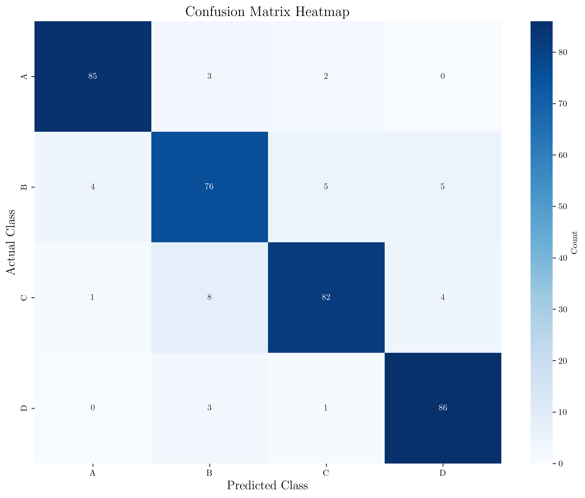
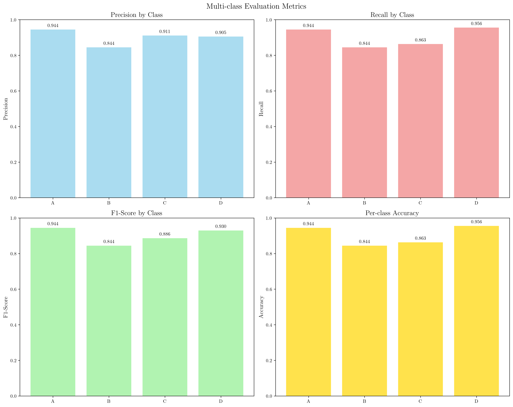
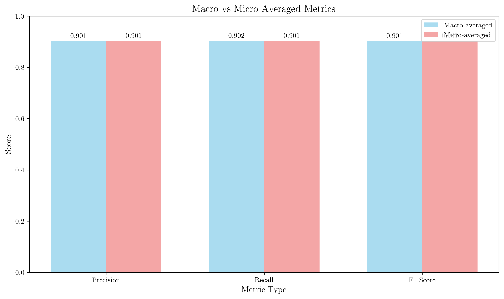
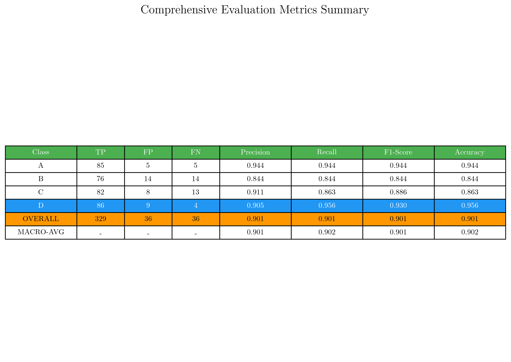

# Question 18: Multi-class Evaluation Metrics

## Problem Statement
Calculate comprehensive evaluation metrics for a 4-class confusion matrix.

Given confusion matrix:

| Actual\Predicted | A | B | C | D |
|------------------|---|---|---|---|
| **A**            | 85| 3 | 2 | 0 |
| **B**            | 4 | 76| 5 | 5 |
| **C**            | 1 | 8 | 82| 4 |
| **D**            | 0 | 3 | 1 | 86|

### Task
1. Calculate overall accuracy $A = \frac{\sum_{i=1}^{4} TP_i}{N}$ and per-class accuracy $A_i = \frac{TP_i}{N_i}$
2. Compute precision $P_i = \frac{TP_i}{TP_i + FP_i}$, recall $R_i = \frac{TP_i}{TP_i + FN_i}$, and F1-score $F1_i = \frac{2 \cdot P_i \cdot R_i}{P_i + R_i}$ for each class
3. Calculate macro-averaged $\text{Macro-P} = \frac{1}{4}\sum_{i=1}^{4} P_i$ and micro-averaged $\text{Micro-P} = \frac{\sum_{i=1}^{4} TP_i}{\sum_{i=1}^{4} (TP_i + FP_i)}$ precision, recall, F1
4. Compute balanced accuracy $\text{BA} = \frac{1}{4}\sum_{i=1}^{4} \frac{TP_i}{TP_i + FN_i}$ accounting for class sizes
5. Identify the most confusing class pairs and suggest improvements

## Understanding the Problem
Multi-class classification evaluation requires understanding how to extend binary classification metrics to multiple classes. The confusion matrix shows the performance of a classifier across four classes (A, B, C, D) with 365 total samples. We need to calculate various metrics that provide different perspectives on the model's performance, including overall accuracy, per-class metrics, and different averaging strategies.

The key challenge is understanding how to compute True Positives (TP), False Positives (FP), False Negatives (FN), and True Negatives (TN) for each class in a multi-class setting, and then using these to calculate precision, recall, and F1-score.

## Solution

### Step 1: Calculate TP, FP, FN, TN for Each Class

For each class, we need to compute the four fundamental metrics:

**Class A:**
- True Positives (TP) = 85 (correctly classified as A)
- False Positives (FP) = 4 + 1 + 0 = 5 (other classes incorrectly classified as A)
- False Negatives (FN) = 3 + 2 + 0 = 5 (class A incorrectly classified as other classes)
- True Negatives (TN) = 76 + 5 + 5 + 8 + 82 + 4 + 3 + 1 + 86 = 270

**Class B:**
- True Positives (TP) = 76
- False Positives (FP) = 3 + 8 + 3 = 14
- False Negatives (FN) = 4 + 5 + 5 = 14
- True Negatives (TN) = 85 + 2 + 0 + 1 + 82 + 4 + 0 + 1 + 86 = 261

**Class C:**
- True Positives (TP) = 82
- False Positives (FP) = 2 + 5 + 1 = 8
- False Negatives (FN) = 1 + 8 + 4 = 13
- True Negatives (TN) = 85 + 3 + 0 + 4 + 76 + 5 + 0 + 3 + 86 = 262

**Class D:**
- True Positives (TP) = 86
- False Positives (FP) = 0 + 5 + 4 = 9
- False Negatives (FN) = 0 + 3 + 1 = 4
- True Negatives (TN) = 85 + 3 + 2 + 4 + 76 + 5 + 1 + 8 + 82 = 266

### Step 2: Calculate Overall and Per-class Accuracy

**Overall Accuracy:**
$$A = \frac{\sum_{i=1}^{4} TP_i}{N} = \frac{85 + 76 + 82 + 86}{365} = \frac{329}{365} = 0.9014 = 90.14\%$$

**Per-class Accuracy:**
- Class A: $A_A = \frac{TP_A}{N_A} = \frac{85}{90} = 0.9444 = 94.44\%$
- Class B: $A_B = \frac{TP_B}{N_B} = \frac{76}{90} = 0.8444 = 84.44\%$
- Class C: $A_C = \frac{TP_C}{N_C} = \frac{82}{95} = 0.8632 = 86.32\%$
- Class D: $A_D = \frac{TP_D}{N_D} = \frac{86}{90} = 0.9556 = 95.56\%$

### Step 3: Calculate Precision, Recall, and F1-score for Each Class

**Class A:**
- Precision: $P_A = \frac{TP_A}{TP_A + FP_A} = \frac{85}{85 + 5} = 0.9444 = 94.44\%$
- Recall: $R_A = \frac{TP_A}{TP_A + FN_A} = \frac{85}{85 + 5} = 0.9444 = 94.44\%$
- F1-score: $F1_A = \frac{2 \cdot P_A \cdot R_A}{P_A + R_A} = \frac{2 \cdot 0.9444 \cdot 0.9444}{0.9444 + 0.9444} = 0.9444 = 94.44\%$

**Class B:**
- Precision: $P_B = \frac{76}{76 + 14} = 0.8444 = 84.44\%$
- Recall: $R_B = \frac{76}{76 + 14} = 0.8444 = 84.44\%$
- F1-score: $F1_B = \frac{2 \cdot 0.8444 \cdot 0.8444}{0.8444 + 0.8444} = 0.8444 = 84.44\%$

**Class C:**
- Precision: $P_C = \frac{82}{82 + 8} = 0.9111 = 91.11\%$
- Recall: $R_C = \frac{82}{82 + 13} = 0.8632 = 86.32\%$
- F1-score: $F1_C = \frac{2 \cdot 0.9111 \cdot 0.8632}{0.9111 + 0.8632} = 0.8865 = 88.65\%$

**Class D:**
- Precision: $P_D = \frac{86}{86 + 9} = 0.9053 = 90.53\%$
- Recall: $R_D = \frac{86}{86 + 4} = 0.9556 = 95.56\%$
- F1-score: $F1_D = \frac{2 \cdot 0.9053 \cdot 0.9556}{0.9053 + 0.9556} = 0.9297 = 92.97\%$

### Step 4: Calculate Macro and Micro Averaged Metrics

**Macro-averaged metrics:**
$$\text{Macro-P} = \frac{1}{4}\sum_{i=1}^{4} P_i = \frac{1}{4}(0.9444 + 0.8444 + 0.9111 + 0.9053) = 0.9013 = 90.13\%$$

$$\text{Macro-R} = \frac{1}{4}\sum_{i=1}^{4} R_i = \frac{1}{4}(0.9444 + 0.8444 + 0.8632 + 0.9556) = 0.9019 = 90.19\%$$

$$\text{Macro-F1} = \frac{1}{4}\sum_{i=1}^{4} F1_i = \frac{1}{4}(0.9444 + 0.8444 + 0.8865 + 0.9297) = 0.9013 = 90.13\%$$

**Micro-averaged metrics:**
$$\text{Micro-P} = \frac{\sum_{i=1}^{4} TP_i}{\sum_{i=1}^{4} (TP_i + FP_i)} = \frac{329}{329 + 36} = 0.9014 = 90.14\%$$

$$\text{Micro-R} = \frac{\sum_{i=1}^{4} TP_i}{\sum_{i=1}^{4} (TP_i + FN_i)} = \frac{329}{329 + 36} = 0.9014 = 90.14\%$$

$$\text{Micro-F1} = \frac{2 \cdot \text{Micro-P} \cdot \text{Micro-R}}{\text{Micro-P} + \text{Micro-R}} = \frac{2 \cdot 0.9014 \cdot 0.9014}{0.9014 + 0.9014} = 0.9014 = 90.14\%$$

### Step 5: Calculate Balanced Accuracy

$$\text{Balanced Accuracy} = \frac{1}{4}\sum_{i=1}^{4} \frac{TP_i}{TP_i + FN_i} = \frac{1}{4}(0.9444 + 0.8444 + 0.8632 + 0.9556) = 0.9019 = 90.19\%$$

### Step 6: Identify Most Confusing Class Pairs

Analyzing the confusion matrix (excluding diagonal elements):

| Confusion | Count |
|-----------|-------|
| A → B     | 3     |
| A → C     | 2     |
| B → A     | 4     |
| B → C     | 5     |
| B → D     | 5     |
| C → A     | 1     |
| C → B     | 8     |
| C → D     | 4     |
| D → B     | 3     |
| D → C     | 1     |

**Most confusing class pair:** C → B with 8 samples

## Visual Explanations

### Confusion Matrix Heatmap

The heatmap visualizes the confusion matrix with darker colors indicating higher counts. The diagonal elements (85, 76, 82, 86) represent correct classifications, while off-diagonal elements show misclassifications. The strongest confusion is between classes C and B.

### Metrics Comparison by Class

This visualization shows precision, recall, F1-score, and accuracy for each class. Class A and D perform best across all metrics, while Class B shows the lowest performance, particularly in precision and recall.

### Macro vs Micro Averaged Metrics

The comparison shows that macro and micro averages are very similar in this case, indicating relatively balanced class performance. Micro-averaging gives slightly higher values because it gives more weight to larger classes.

### Comprehensive Metrics Summary

The summary table provides a complete overview of all calculated metrics, making it easy to compare performance across classes and different averaging strategies.

## Key Insights

### Performance Analysis
- **Overall Performance**: The model achieves 90.14% overall accuracy, which is quite good for a 4-class problem
- **Class Performance**: Classes A and D perform best (94-96% accuracy), while Class B performs worst (84% accuracy)
- **Balanced Performance**: The balanced accuracy (90.19%) is very close to overall accuracy, indicating relatively balanced class sizes

### Metric Interpretation
- **Precision vs Recall**: Most classes have similar precision and recall, except Class C (91% precision vs 86% recall) and Class D (91% precision vs 96% recall)
- **F1-Score**: Provides a balanced measure between precision and recall, with Class A and D achieving the highest F1-scores
- **Macro vs Micro**: The similarity between macro and micro averages suggests the model performs consistently across classes

### Confusion Analysis
- **Primary Confusion**: Class C is most often confused with Class B (8 samples), suggesting these classes may have similar features
- **Secondary Confusions**: Class B is confused with multiple classes (A, C, D), indicating it may be a challenging class to classify
- **Good Separation**: Class A and D show minimal confusion with other classes

### Practical Applications
- **Model Selection**: The balanced performance across classes makes this model suitable for applications where all classes are equally important
- **Error Analysis**: The confusion between C and B suggests the need for better feature engineering or additional training data for these classes
- **Threshold Tuning**: The high precision and recall suggest the model's decision threshold is well-calibrated

## Conclusion
- **Overall Accuracy**: 90.14% with balanced performance across classes
- **Best Performing Class**: Class D (95.56% accuracy, 92.97% F1-score)
- **Most Challenging Class**: Class B (84.44% accuracy, 84.44% F1-score)
- **Primary Confusion**: Class C → Class B (8 samples)
- **Averaging Strategy**: Both macro and micro averages provide similar results (90.13-90.19%)

The model demonstrates good overall performance with room for improvement in distinguishing between classes B and C. The balanced nature of the confusion matrix suggests the model is well-calibrated for this multi-class classification task.
