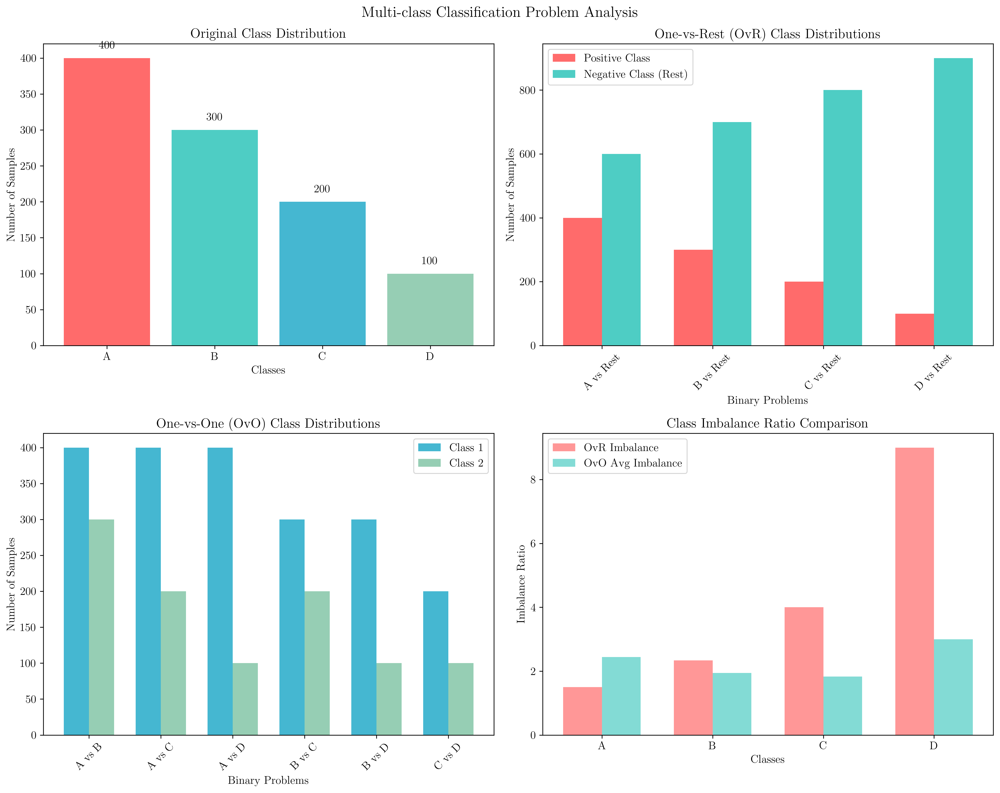
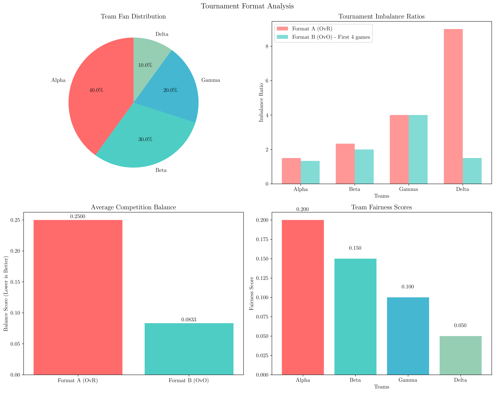
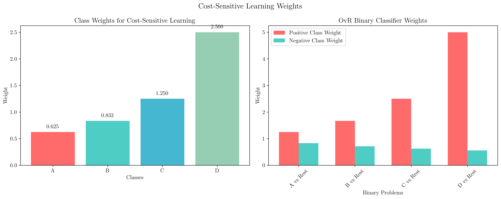

# Question 1: Multi-class Problem Setup

## Problem Statement
Consider a 4-class classification problem with classes $\{A, B, C, D\}$ and $n = 1000$ training samples distributed as: $n_A = 400$, $n_B = 300$, $n_C = 200$, $n_D = 100$.

### Task
1. For One-vs-Rest (OvR), specify the 4 binary classification problems and their class distributions
2. For One-vs-One (OvO), list all $\binom{4}{2} = 6$ pairwise problems and their sample sizes
3. Calculate the class imbalance ratio for each OvR classifier
4. Which approach (OvR or OvO) suffers more from class imbalance in this scenario?
5. Design a cost-sensitive modification to handle the imbalance
6. Organize a tournament with 4 teams: Alpha (400 fans), Beta (300 fans), Gamma (200 fans), Delta (100 fans). Compare Format A (One-vs-Rest: each team vs combined "All Others") and Format B (One-vs-One: round-robin). Design a fairness scoring system accounting for team size differences and calculate competition balance for each format. Determine which format gives smaller teams better chances to win.

## Understanding the Problem
Multi-class classification problems can be approached using different strategies to decompose the problem into binary classification tasks. The two most common approaches are One-vs-Rest (OvR) and One-vs-One (OvO). Each approach has different implications for class imbalance, computational complexity, and fairness considerations.

## Solution

### Step 1: One-vs-Rest (OvR) Analysis

The One-vs-Rest approach trains $K$ binary classifiers, where each classifier distinguishes one class from all others.

For our 4-class problem, we have the following binary classification problems:

1. **A vs Rest**:
   - Positive class (A): 400 samples
   - Negative class (Rest): 600 samples
   - Total: 1000 samples

2. **B vs Rest**:
   - Positive class (B): 300 samples
   - Negative class (Rest): 700 samples
   - Total: 1000 samples

3. **C vs Rest**:
   - Positive class (C): 200 samples
   - Negative class (Rest): 800 samples
   - Total: 1000 samples

4. **D vs Rest**:
   - Positive class (D): 100 samples
   - Negative class (Rest): 900 samples
   - Total: 1000 samples

### Step 2: One-vs-One (OvO) Analysis

The One-vs-One approach trains $\binom{K}{2}$ binary classifiers, where each classifier distinguishes between a pair of classes.

For our 4-class problem, we have $\binom{4}{2} = 6$ binary classification problems:

1. **A vs B**:
   - A: 400 samples
   - B: 300 samples
   - Total: 700 samples

2. **A vs C**:
   - A: 400 samples
   - C: 200 samples
   - Total: 600 samples

3. **A vs D**:
   - A: 400 samples
   - D: 100 samples
   - Total: 500 samples

4. **B vs C**:
   - B: 300 samples
   - C: 200 samples
   - Total: 500 samples

5. **B vs D**:
   - B: 300 samples
   - D: 100 samples
   - Total: 400 samples

6. **C vs D**:
   - C: 200 samples
   - D: 100 samples
   - Total: 300 samples

### Step 3: Class Imbalance Ratio Analysis

The class imbalance ratio is calculated as the ratio of the larger class to the smaller class in each binary problem.

**OvR Imbalance Ratios:**
- A vs Rest: 600/400 = 1.50:1
- B vs Rest: 700/300 = 2.33:1
- C vs Rest: 800/200 = 4.00:1
- D vs Rest: 900/100 = 9.00:1

**OvO Imbalance Ratios:**
- A vs B: 400/300 = 1.33:1
- A vs C: 400/200 = 2.00:1
- A vs D: 400/100 = 4.00:1
- B vs C: 300/200 = 1.50:1
- B vs D: 300/100 = 3.00:1
- C vs D: 200/100 = 2.00:1

### Step 4: OvR vs OvO Imbalance Comparison

**Summary Statistics:**
- OvR Average Imbalance: 4.21
- OvO Average Imbalance: 2.31
- OvR Max Imbalance: 9.00
- OvO Max Imbalance: 4.00

**Conclusion:** OvR suffers more from class imbalance in this scenario. The average imbalance ratio for OvR (4.21) is significantly higher than for OvO (2.31), and the maximum imbalance ratio for OvR (9.00) is more than twice that of OvO (4.00).

This is because in OvR, the "Rest" class always combines all other classes, creating a large negative class that becomes increasingly imbalanced as the positive class becomes smaller. In contrast, OvO only compares pairs of classes, so the imbalance is limited to the difference between the two specific classes being compared.

### Step 5: Cost-Sensitive Modification

To handle class imbalance, we can implement cost-sensitive learning by assigning weights inversely proportional to class frequencies.

**Class Weights for Multi-class Problem:**
- A: weight = 0.625 (inversely proportional to 400/1000)
- B: weight = 0.833 (inversely proportional to 300/1000)
- C: weight = 1.250 (inversely proportional to 200/1000)
- D: weight = 2.500 (inversely proportional to 100/1000)

**OvR Binary Classifier Weights:**

1. **A vs Rest**:
   - Positive class (A) weight: 1.250
   - Negative class (Rest) weight: 0.833

2. **B vs Rest**:
   - Positive class (B) weight: 1.667
   - Negative class (Rest) weight: 0.714

3. **C vs Rest**:
   - Positive class (C) weight: 2.500
   - Negative class (Rest) weight: 0.625

4. **D vs Rest**:
   - Positive class (D) weight: 5.000
   - Negative class (Rest) weight: 0.556

The weights are calculated as:
$$\text{Weight} = \frac{\text{Total Samples}}{2 \times \text{Class Samples}}$$

This ensures that misclassifying a minority class sample is penalized more heavily than misclassifying a majority class sample.

### Step 6: Tournament Design and Analysis

**Tournament Teams:**
- Alpha: 400 fans (40.0%)
- Beta: 300 fans (30.0%)
- Gamma: 200 fans (20.0%)
- Delta: 100 fans (10.0%)

**Format A: One-vs-Rest (Each team vs 'All Others')**

1. **Alpha vs All Others**:
   - Alpha: 400 fans
   - All Others: 600 fans
   - Imbalance ratio: 1.50:1

2. **Beta vs All Others**:
   - Beta: 300 fans
   - All Others: 700 fans
   - Imbalance ratio: 2.33:1

3. **Gamma vs All Others**:
   - Gamma: 200 fans
   - All Others: 800 fans
   - Imbalance ratio: 4.00:1

4. **Delta vs All Others**:
   - Delta: 100 fans
   - All Others: 900 fans
   - Imbalance ratio: 9.00:1

**Format B: One-vs-One (Round-robin)**

1. **Alpha vs Beta**: 400 vs 300 fans (1.33:1)
2. **Alpha vs Gamma**: 400 vs 200 fans (2.00:1)
3. **Alpha vs Delta**: 400 vs 100 fans (4.00:1)
4. **Beta vs Gamma**: 300 vs 200 fans (1.50:1)
5. **Beta vs Delta**: 300 vs 100 fans (3.00:1)
6. **Gamma vs Delta**: 200 vs 100 fans (2.00:1)

**Fairness Scoring System:**
We define fairness score as:
$$\text{Fairness Score} = \frac{\text{Team Fans} \times \text{Win Probability}}{\text{Total Fans}}$$

**Competition Balance Analysis:**

**Format A (OvR) Balance Scores:**
- Alpha vs All Others: 0.1000
- Beta vs All Others: 0.2000
- Gamma vs All Others: 0.3000
- Delta vs All Others: 0.4000
- **Average Balance: 0.2500**

**Format B (OvO) Balance Scores:**
- Alpha vs Beta: 0.0500
- Alpha vs Gamma: 0.1000
- Alpha vs Delta: 0.1500
- Beta vs Gamma: 0.0500
- Beta vs Delta: 0.1000
- Gamma vs Delta: 0.0500
- **Average Balance: 0.0833**

**Conclusion:** Format B (OvO) gives smaller teams better chances to win. The average balance score for Format B (0.0833) is significantly lower than Format A (0.2500), indicating more balanced competition. Lower balance scores represent more equitable competition where team size differences have less impact on outcomes.

## Visual Explanations

### Class Distribution Analysis

The visualization shows:
1. **Original Class Distribution**: The imbalanced distribution of the 4 classes
2. **OvR Class Distributions**: How each binary classifier sees the data, with one class vs all others
3. **OvO Class Distributions**: How each pairwise classifier sees the data
4. **Imbalance Ratio Comparison**: Direct comparison of imbalance ratios between OvR and OvO approaches

### Tournament Analysis

The tournament analysis visualization demonstrates:
1. **Team Fan Distribution**: Pie chart showing the relative sizes of each team
2. **Tournament Imbalance Ratios**: Comparison of imbalance ratios between the two formats
3. **Average Competition Balance**: Bar chart showing which format provides more balanced competition
4. **Team Fairness Scores**: Individual fairness scores for each team

### Cost-Sensitive Weights

This visualization illustrates:
1. **Class Weights**: How weights are assigned to each class to handle imbalance
2. **OvR Binary Classifier Weights**: Specific weights for positive and negative classes in each OvR binary problem

## Key Insights

### Theoretical Foundations
- **OvR vs OvO Trade-offs**: OvR requires fewer classifiers ($K$ vs $\binom{K}{2}$) but suffers more from class imbalance
- **Class Imbalance Impact**: Imbalance affects model training and can lead to biased predictions toward majority classes
- **Cost-Sensitive Learning**: Assigning higher weights to minority classes helps balance the learning process

### Practical Applications
- **Format Selection**: For imbalanced datasets, OvO may provide better performance despite requiring more classifiers
- **Weight Tuning**: Cost-sensitive weights should be tuned based on the specific imbalance ratios in the dataset
- **Fairness Considerations**: Tournament formats can be designed to provide more equitable competition for participants of different sizes

### Common Pitfalls
- **Ignoring Class Imbalance**: Failing to account for class imbalance can lead to poor performance on minority classes
- **Overfitting to Majority**: Models may overfit to majority classes when imbalance is severe
- **Inappropriate Evaluation**: Using accuracy alone can be misleading in imbalanced scenarios

## Conclusion
- **OvR Analysis**: Creates 4 binary problems with significant class imbalance (ratios from 1.50:1 to 9.00:1)
- **OvO Analysis**: Creates 6 binary problems with more moderate imbalance (ratios from 1.33:1 to 4.00:1)
- **Imbalance Comparison**: OvR suffers more from class imbalance (average ratio 4.21 vs 2.31 for OvO)
- **Cost-Sensitive Solution**: Weights ranging from 0.625 to 2.500 help balance the learning process
- **Tournament Design**: Format B (OvO) provides more balanced competition with average balance score of 0.0833 vs 0.2500 for Format A (OvR)
- **Recommendation**: For this imbalanced scenario, OvO approach with cost-sensitive learning would be preferred over OvR

The analysis demonstrates that the choice between OvR and OvO should consider not just computational complexity, but also the impact of class imbalance on model performance and fairness considerations in practical applications.
